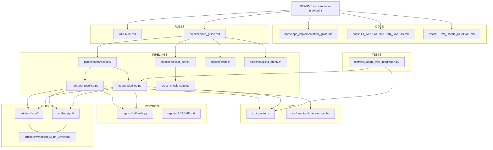
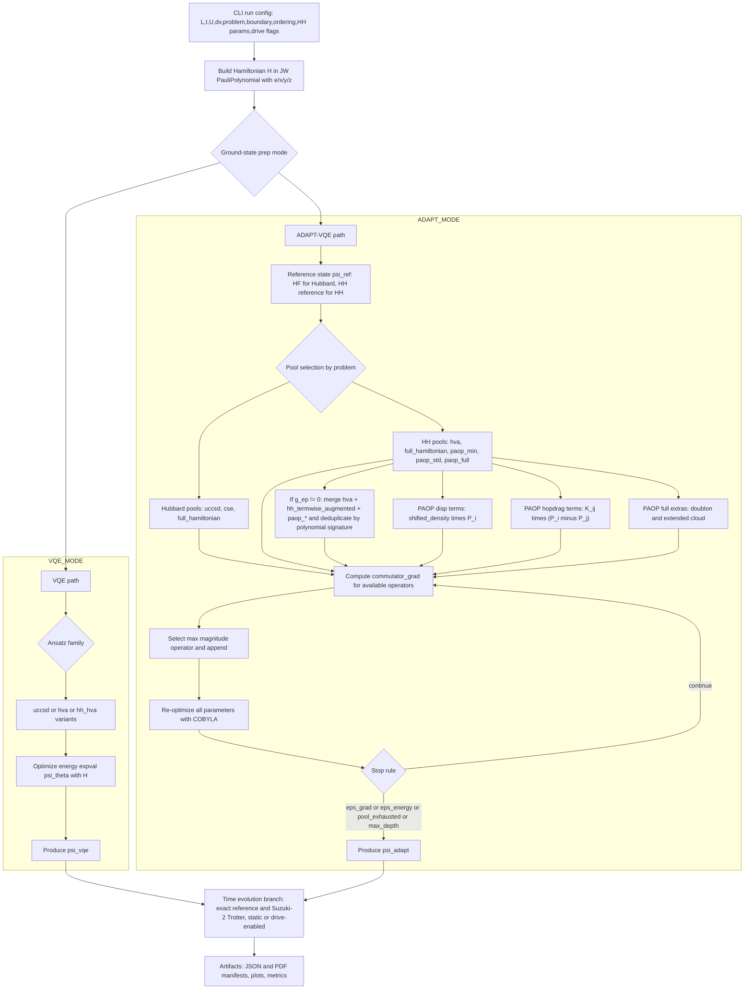

# Holstein_test

Canonical repository onboarding document.

This repo implements Hubbard / Hubbard-Holstein (HH) simulation workflows with
Jordan-Wigner operator construction, hardcoded VQE/ADAPT ground-state
preparation, and exact vs Trotterized dynamics pipelines.

## Project focus

- Primary production model: `Hubbard-Holstein (HH)`.
- Pure Hubbard is retained as a limiting-case validation path.
- Standard regression limit check: HH with `g_ep = 0` and `omega0 = 0` under
  matched settings should reduce to Hubbard behavior.

## Recent HH L2/L3 Results (as of 2026-03-02)

### Warm-start chain (separate family)

Warm-start runs use a two-stage sequence:

1. Run HH-HVA VQE warm start (for example `hh_hva_ptw`).
2. Use that warm-start state as the ADAPT reference state.
3. Run ADAPT with `paop_lf_std`.

Do not mix interpretation of this family with the separate combined-pool trend
family below.

### Combined pools (separate family)

Separate trend runs evaluate:

- `UCCSD+PAOP`
- `UCCSD+PAOP+HVA`

These are a different experiment family from warm-start B/C runs.

### Default path going forward (L-specific)

- `L3+` static runs: use the combined-pool family as primary.
- `L2` and driven runs: use warm-start + `paop_lf_std` as the fallback path.

### Evidence Table (artifact-backed)

| Case | Artifact run | `|DeltaE|` |
|---|---|---:|
| L3 meta-pool best | `A_medium` in `l3_uccsd_paop_hva_trend_full_20260302T000521.json` | `2.622402274776725e-4` |
| L3 warm-start C | `fix1_warm_start_C` in `l3_hh_accessibility_fixes_under8pct.json` | `4.393299375013565e-3` |
| L2 warm-start C/export | exported state in `fix1_warm_start_B_l2_state.json` (`adapt_vqe.abs_delta_e`) | `1.0866130099410898e-3` |
| L2 strict meta-pool crosscheck | `A_heavy` in `l2_uccsd_paop_hva_trend_crosscheck.json` | `3.283230696724525e-1` |

L2 caveat: in the strict L2 meta-pool crosscheck artifact above, the combined
pool family is not competitive versus the warm-start accessibility export.

### Provenance links

- [docs/hh_l2_l3_warmstart_paop_hva_results_explainer.md](docs/hh_l2_l3_warmstart_paop_hva_results_explainer.md)
- [artifacts/useful/L3/l3_uccsd_paop_hva_trend_full_20260302T000521.json](artifacts/useful/L3/l3_uccsd_paop_hva_trend_full_20260302T000521.json)
- [artifacts/useful/L3/l3_hh_accessibility_fixes_under8pct.json](artifacts/useful/L3/l3_hh_accessibility_fixes_under8pct.json)
- [artifacts/useful/L2/warmstart_states/fix1_warm_start_B_l2_state.json](artifacts/useful/L2/warmstart_states/fix1_warm_start_B_l2_state.json)
- [artifacts/useful/L2/l2_uccsd_paop_hva_trend_crosscheck.json](artifacts/useful/L2/l2_uccsd_paop_hva_trend_crosscheck.json)

## Repository map (minimal)

- `src/quantum/`: operator algebra, Hamiltonian builders, ansatz/statevector math
- `pipelines/hardcoded/`: production hardcoded pipeline entrypoints
- `pipelines/exact_bench/`: exact-diagonalization benchmark tooling
- `reports/`: PDF and reporting utilities
- `docs/`: architecture, implementation, and status documents

## Visual overview



## Physics algorithm flow (VQE / ADAPT / pools)



### ADAPT Pool Summary (plaintext fallback)

- `hubbard` pools: `uccsd`, `cse`, `full_hamiltonian`.
- `hh` pools: `hva`, `full_hamiltonian`, `paop_min`, `paop_std`, `paop_full`, `paop_lf` (`paop_lf_std` alias), `paop_lf2_std`, `paop_lf_full`.
- `paop_min`: displacement-focused PAOP operators.
- `paop_std`: displacement plus dressed-hopping (`hopdrag`) operators.
- `paop_full`: `paop_std` plus doublon dressing and extended cloud operators.
- `paop_lf_std`: `paop_std` plus LF-leading odd channel (`curdrag`).
- HH merge behavior (when `g_ep != 0`): merge `hva` + `hh_termwise_augmented` + selected `paop_*` pool, then deduplicate by polynomial signature.

### ADAPT gradient performance note (2026-03-03)

- `pipelines/hardcoded/adapt_pipeline.py` now caches compiled Pauli actions for repeated ADAPT commutator-gradient evaluations.
- The cache is built once per ADAPT run (Hamiltonian + pool operators) and reused across gradient sweeps.
- Cache behavior is always on; there is no dedicated CLI toggle.
- Numerical behavior is unchanged (cached and uncached paths are parity-tested).
- ADAPT JSON includes additive telemetry:
  - `adapt_vqe.compiled_pauli_cache`
  - `adapt_vqe.history[*].gradient_eval_elapsed_s`

## Start here (doc priority)

Use this order when onboarding:

1. `AGENTS.md` - repo conventions and non-negotiable implementation rules
2. `pipelines/run_guide.md` - CLI and runbook for active pipelines
3. `docs/repo_implementation_guide.md` - implementation-deep walkthrough
4. `docs/HH_IMPLEMENTATION_STATUS.md` - current HH status and remaining work
5. `docs/FERMI_HAMIL_README.md` - legacy high-level architecture overview

## Important note on README files

Subdirectory README files are component-scoped documentation, not repo-canonical
onboarding docs. Use this root `README.md` first, then drill into local READMEs
for module-specific details.

## Quick run examples

ADAPT-VQE (HH, PAOP pool):

```bash
python pipelines/hardcoded/adapt_pipeline.py \
  --L 2 --problem hh --omega0 1.0 --g-ep 0.5 --n-ph-max 1 \
  --adapt-pool paop_std --paop-r 1 --paop-normalization none \
  --adapt-max-depth 30 --adapt-eps-grad 1e-5 --adapt-maxiter 600 \
  --initial-state-source adapt_vqe --skip-pdf \
  --output-json artifacts/json/adapt_L2_hh_paop_std.json
```

Cross-check suite (exact benchmark; auto-scaled by L/problem defaults):

```bash
python pipelines/exact_bench/cross_check_suite.py --L 2 --problem hubbard
```

CFQM propagation (hardcoded pipeline):

```bash
python pipelines/hardcoded/hubbard_pipeline.py \
  --L 2 --problem hubbard \
  --propagator cfqm4 \
  --cfqm-stage-exp expm_multiply_sparse \
  --cfqm-coeff-drop-abs-tol 0.0 \
  --trotter-steps 64 --t-final 10.0 --num-times 201 \
  --skip-qpe
```

CFQM propagation status (hardcoded pipeline):
- `--propagator` defaults to `suzuki2`; existing run behavior is unchanged unless `cfqm4`/`cfqm6` is selected.
- CFQM uses fixed scheme nodes (`c_j`) and ignores legacy midpoint/left/right `--drive-time-sampling`.
- `--exact-steps-multiplier` remains a reference-only control and does not change CFQM macro-step count.
- `--cfqm-stage-exp` default is `expm_multiply_sparse`; `--cfqm-coeff-drop-abs-tol` default is `0.0`; `--cfqm-normalize` default is off.
- Sparse CFQM stage backend uses native sparse stage assembly + `scipy.sparse.linalg.expm_multiply` (no dense->csc stage materialization).
- Shared Pauli-term exponentiation helpers are centralized in `src/quantum/pauli_actions.py` (used by both the hardcoded pipeline and CFQM backend).
- Unknown drive labels are handled with a guardrail policy: nontrivial coefficients warn once per label then are ignored; tiny coefficients (`abs(coeff) <= 1e-14`) are silently ignored.
- A=0 invariance is preserved by the zero-increment insertion guard; safe-test target is `<= 1e-10`.
- If non-midpoint sampling is supplied under CFQM, runtime warns:
  `CFQM ignores midpoint/left/right sampling; uses fixed scheme nodes c_j.`
- If `--cfqm-stage-exp pauli_suzuki2` is selected, runtime warns:
  `Inner Suzuki-2 makes overall method 2nd order; use expm_multiply_sparse/dense_expm for true CFQM order.`

CFQM6 command:

```bash
python pipelines/hardcoded/hubbard_pipeline.py \
  --L 2 --problem hubbard \
  --propagator cfqm6 \
  --cfqm-stage-exp expm_multiply_sparse \
  --cfqm-coeff-drop-abs-tol 0.0 \
  --trotter-steps 64 --t-final 10.0 --num-times 201 \
  --skip-qpe
```

CFQM tests:

```bash
pytest -q test/test_cfqm_schemes.py test/test_cfqm_propagator.py test/test_cfqm_acceptance.py
```

Acceptance highlights:
- static regression vs exact expm
- A=0 invariance (drive provider present vs absent)
- manufactured 1-qubit order slopes (`~4` for cfqm4, `~6` for cfqm6, `~2` with inner suzuki2)
- small HH sanity trend vs fine piecewise reference

Quantum-processor proxy benchmark (CFQM vs Suzuki):

```bash
python pipelines/exact_bench/cfqm_vs_suzuki_qproc_proxy_benchmark.py \
  --problem hubbard --L 2 \
  --methods suzuki2,cfqm4,cfqm6 \
  --steps-grid 64,128,256,512 \
  --reference-steps 2048 \
  --drive-enabled

# Equal-cost policy (optional, apples-to-apples):
python pipelines/exact_bench/cfqm_vs_suzuki_qproc_proxy_benchmark.py \
  --problem hubbard --L 2 \
  --methods suzuki2,cfqm4,cfqm6 \
  --steps-grid 64,128,256,512 \
  --reference-steps 2048 \
  --compare-policy cost_match \
  --cost-match-metric cx_proxy_total \
  --cost-match-tolerance 0.0 \
  --drive-enabled
```

Why this benchmark:
- Local runtime is machine-dependent and not the main comparison axis.
- The benchmark ranks methods by final energy error versus processor-oriented cost proxies:
  - term exponential count
  - 2-qubit gate proxy (`cx_proxy_total`)
  - 1-qubit gate proxy (`sq_proxy_total`)
- `S` in the result tables is macro-step count (`trotter_steps`), not a cost metric.
- Use `--compare-policy cost_match` for fair, equal-cost comparisons; default remains
  sweep-only row listing.
- Default cost axis for fair matching is `cx_proxy_total`; fallback metric is `term_exp_count_total` when requested.
- CFQM runs use `pauli_suzuki2` stage exponentials in this benchmark to produce hardware-comparable termwise gate proxies (this is a benchmarking profile, not the high-order dense/sparse CFQM profile).

Artifacts:
- `artifacts/cfqm_benchmark/cfqm_vs_suzuki_proxy_runs.json`
- `artifacts/cfqm_benchmark/cfqm_vs_suzuki_proxy_runs.csv`
- `artifacts/cfqm_benchmark/cfqm_vs_suzuki_proxy_summary.json`

CFQM efficiency suite (error-vs-cost, apples-to-apples):

```bash
python pipelines/exact_bench/cfqm_vs_suzuki_efficiency_suite.py \
  --problem-grid hubbard_L4,hh_L2_nb2,hh_L2_nb3 \
  --drive-grid sinusoid,gaussian_sharp \
  --methods suzuki2,cfqm4,cfqm6 \
  --stage-mode-grid exact_sparse,exact_dense,pauli_suzuki2 \
  --reference-steps-multiplier 8 \
  --equal-cost-axis cx_proxy,pauli_rot_count,expm_calls,wall_time \
  --equal-cost-policy exact_tie_only \
  --calibrate-transpile \
  --output-dir artifacts/cfqm_efficiency_benchmark
```

Efficiency-suite outputs:
- `artifacts/cfqm_efficiency_benchmark/runs_full.json`
- `artifacts/cfqm_efficiency_benchmark/runs_full.csv`
- `artifacts/cfqm_efficiency_benchmark/summary_by_scenario.json`
- `artifacts/cfqm_efficiency_benchmark/pareto_by_metric.json`
- `artifacts/cfqm_efficiency_benchmark/slope_fits.json`
- `artifacts/cfqm_efficiency_benchmark/equal_cost_exact_ties_<metric>.csv`
- `artifacts/cfqm_efficiency_benchmark/cfqm_efficiency_suite.pdf`

Efficiency-suite interpretation rules:
- Main fair tables are exact-cost ties only (`delta=0`) for `cx_proxy`, `pauli_rot_count`, and `expm_calls`.
- Wall-time comparisons are near-tie bins and explicitly marked approximate.
- Fallback nearest-neighbor matches are appendix-only (non-fair direct comparisons).
- `S` always means macro-step count (`trotter_steps`), never a fairness axis.

For compare/orchestration workflows, use `pipelines/run_guide.md`.

## Major Markdown docs index

- `AGENTS.md`
- `pipelines/run_guide.md`
- `docs/LLM_RESEARCH_CONTEXT.md`
- `docs/repo_implementation_guide.md`
- `docs/HH_IMPLEMENTATION_STATUS.md`
- `docs/FERMI_HAMIL_README.md`
- `reports/README.md`
- `pipelines/exact_bench/README.md`
- `pipelines/qiskit_archive/README.md`
- `pipelines/qiskit_archive/DESIGN_NOTE_TIMEDEP.md`

## HH noisy estimator validation

The repo now includes an HH-first noisy/hardware validation pipeline:
- `pipelines/exact_bench/hh_noise_hardware_validation.py`

It provides one shared expectation oracle across `ideal`, `shots`, `aer_noise`, and `runtime` modes, with optional noisy ADAPT and PDF/JSON reporting.  
Use `pipelines/run_guide.md` section 11+ for operational commands and mode-by-mode guidance.
