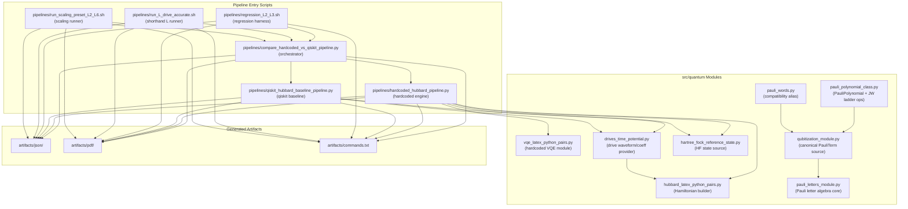

# Simplified Hubbard Pipeline Repo

This repo implements **Fermionic Hubbard-model simulation pipelines** with Jordan–Wigner (JW) mapping, VQE ground-state preparation, Suzuki–Trotter time evolution, and optional QPE (which we never want to use).
Two independent implementations (a custom "hardcoded" backend and a Qiskit-based baseline)
can be compared head-to-head with automated metric extraction -- Qiskit is meant to serve as a cross-check for the "hardcoded" implementation correctness.

## Main Entry Points

| Script | Purpose |
|--------|---------|
| `pipelines/hardcoded_hubbard_pipeline.py` | Hardcoded Hamiltonian, hardcoded VQE, hardcoded Trotter dynamics, optional (Qiskit) QPE |
| `pipelines/qiskit_hubbard_baseline_pipeline.py` | Qiskit Hamiltonian, Qiskit VQE, Qiskit-aligned Trotter dynamics, optional QPE |
| `pipelines/compare_hardcoded_vs_qiskit_pipeline.py` | Orchestrator — runs both pipelines, compares metrics, writes comparison PDFs |

## Repository Architecture (Mermaid)



Scope note: this chart covers the active runtime architecture, not archived content.

Arrow note: arrows denote runtime, import, or orchestration dependency.

## Key Features

### Static Hubbard Model
- Configurable lattice size L, hopping t, interaction U, local potential dv
- Periodic or open boundary conditions; blocked or interleaved qubit ordering
- VQE ground-state solver with multi-restart optimisation
- Second-order Suzuki–Trotter time evolution with subspace-fidelity tracking
- Quantum Phase Estimation (QPE) energy extraction
- JSON `trajectory[].fidelity` stores subspace fidelity against the filtered-sector ground manifold (`E <= E0 + tol`, default `tol=1e-8`)

### Time-Dependent Drive
All three pipelines support a **time-dependent onsite density drive**:

$$v(t) = A \cdot \sin(\omega t + \phi) \cdot \exp\!\Big(-\frac{(t - t_0)^2}{2\,\bar{t}^{\,2}}\Big)$$

- Gaussian-envelope sinusoidal waveform with configurable amplitude, frequency, phase, envelope width, and start time
- Built-in spatial patterns: `staggered`, `dimer_bias`, or `custom` per-site weights
- Midpoint / left / right time-sampling within each Trotter slice
- Reference propagator uses `scipy.sparse.linalg.expm_multiply` with optional refinement (`--exact-steps-multiplier`)

See `pipelines/DESIGN_NOTE_QISKIT_BASELINE_TIMEDEP.md` for design details.

### Drive Amplitude Comparison PDF
The compare pipeline supports an **amplitude-comparison mode** (`--with-drive-amplitude-comparison-pdf`)
that exercises the drive at two amplitudes (A0 = trivial, A1 = active) and produces a
multi-page PDF containing:

1. **Scoreboard + physics headline page** — compact HC-vs-QK agreement table, A1−A0 response table, and the exact drive waveform `f(t)` used in `H(t)`.
2. **Drive-induced response page** — explicit Δ-observable traces (`ΔEnergy`, `ΔDoubleOcc`, and matched channel such as `ΔO_stag` for staggered drives).
3. **Combined trajectory overlay page** — single page (HC + QK together) with color encoding amplitude and linestyle encoding implementation.
4. **VQE residual page** — residual-focused table (`HC-QK`, `HC-exact`, `QK-exact`) to make tiny deltas perceptible.
5. **Conditional safe-test detail page** — full semilogy timeseries appears only on fail, near-threshold, or with `--report-verbose`.
6. **Optional meeting pages** — site-resolved density heatmaps and a compact response spectrum panel.

A companion `amp_{tag}_metrics.json` provides machine-readable fields:
`safe_test`, `delta_vqe_hc_minus_qk_at_A0`, `delta_vqe_hc_minus_qk_at_A1`.

## Run Guide

Full command usage and all parameter options are documented in:

- **[`pipelines/PIPELINE_RUN_GUIDE.md`](pipelines/PIPELINE_RUN_GUIDE.md)**

## Codex Cloud / Fresh Machine Setup

From this directory, run:

```bash
python3 -m pip install --user --upgrade pip
bash scripts/bootstrap_cloud.sh
source ../.venv/bin/activate
```

If you prefer a different environment path:

```bash
bash scripts/bootstrap_cloud.sh /path/to/venv
source /path/to/venv/bin/activate
```

Then run any command from the Quick Start section.

Quick start from this directory:

```bash
# See all options
python pipelines/compare_hardcoded_vs_qiskit_pipeline.py --help

# Minimal L=2 comparison with drive enabled
python pipelines/compare_hardcoded_vs_qiskit_pipeline.py \
  --l-values 2 --run-pipelines --enable-drive --drive-pattern dimer_bias \
  --drive-omega 2.0 --drive-tbar 2.0 --t-final 2.0 --num-times 21 \
  --trotter-steps 32 --skip-qpe

# Amplitude comparison PDF (scoreboard + response deltas)
python pipelines/compare_hardcoded_vs_qiskit_pipeline.py \
  --l-values 2 --run-pipelines --enable-drive --drive-pattern dimer_bias \
  --drive-omega 2.0 --drive-tbar 2.0 --t-final 2.0 --num-times 21 \
  --trotter-steps 32 --skip-qpe \
  --drive-amplitudes '0.0,0.2' --with-drive-amplitude-comparison-pdf
```

## Output Location

Generated JSON/PDF outputs go to:

- `artifacts/` (created automatically when scripts run, configurable via `--artifacts-dir`)
  - `json/` — all JSON outputs
  - `pdf/` — all PDF outputs
  - `commands.txt` — exact commands that were executed

### Naming convention

Artifact filenames encode the run configuration as a **tag**:

```
{prefix}_{tag}[_suffix].{ext}
```

Where **tag** = `L{L}_{vt|static}_t{t}_U{u}_S{trotter_steps}`, e.g. `L2_static_t1.0_U4.0_S64`.

Prefixes: **hc** = hardcoded, **qk** = Qiskit, **cmp** = cross-pipeline comparison, **amp** = amplitude comparison, **xchk** = cross-check suite, **adapt** = ADAPT-VQE.

### Key generated files

| File | Description |
|------|-------------|
| `json/hc_hubbard_{tag}.json` | Hardcoded pipeline full output |
| `json/qk_hubbard_{tag}.json` | Qiskit pipeline full output |
| `json/cmp_hubbard_{tag}_metrics.json` | Per-L comparison metrics |
| `json/cmp_hubbard_bundle_summary.json` | Summary across all L values |
| `pdf/cmp_hubbard_bundle.pdf` | Multi-page comparison bundle PDF |
| `pdf/cmp_hubbard_{tag}.pdf` | Per-L standalone comparison PDF (with `--with-per-l-pdfs`) |
| `pdf/amp_cmp_hubbard_{tag}.pdf` | Amplitude comparison PDF (when enabled) |
| `json/amp_cmp_hubbard_{tag}_metrics.json` | Amplitude comparison metrics (when enabled) |

## Directory Structure

```
Fermi-Hamil-JW-VQE-TROTTER-PIPELINE/
├── AGENTS.md                          # Agent/contributor guidelines
├── README.md                          # This file
├── artifacts/                         # Generated outputs (gitignored)
│   ├── json/                          #   All JSON outputs
│   ├── pdf/                           #   All PDF outputs
│   └── commands.txt                   #   Exact commands run
├── pipelines/
│   ├── PIPELINE_RUN_GUIDE.md          # Comprehensive CLI reference
│   ├── DESIGN_NOTE_QISKIT_BASELINE_TIMEDEP.md
│   ├── compare_hardcoded_vs_qiskit_pipeline.py
│   ├── hardcoded_hubbard_pipeline.py
│   ├── qiskit_hubbard_baseline_pipeline.py
│   ├── manual_compare_jsons.py
│   ├── regression_L2_L3.sh
│   └── l2_vqe_exact_dynamics_dual_method.py
src/
├── __init__.py
└── quantum/
    ├── pauli_letters_module.py        # Symbol Product Map + PauliLetter
    ├── qubitization_module.py         # PauliTerm (canonical source)
    ├── pauli_polynomial_class.py      # PauliPolynomial + JW ladder ops
    ├── pauli_words.py                 # PauliTerm compatibility alias
    ├── hubbard_latex_python_pairs.py  # LaTeX↔Python Hubbard terms
    ├── vqe_latex_python_pairs.py      # LaTeX↔Python VQE terms
    └── hartree_fock_reference_state.py
```

## Archived Legacy Content

Legacy notebooks, old test harnesses, and prior report artifacts were moved (archive-first) to:

- `archive/pre_simplify_*`

They are preserved for rollback/reference but are no longer part of the active runtime path.


Current modeling convention: HH is primary; pure Hubbard runs are mainly used as limiting-case validation checks (e.g., HH at `g_ep=0`, `omega0=0` under matched settings).

---