# L2/L3 HH Warm-Start PAOP+HVA Results (Human-Readable PDF Report)

## 1. Parameter Manifest

- Model family/name: `Hubbard` (HH specialization).
- Ansatz types covered: `hh_hva_tw`, `hh_hva_ptw`, ADAPT(`paop_lf_std`), ADAPT trend pools (`uccsd+paop`, `uccsd+paop+hva`).
- Drive enabled: both `false` (static sections) and `true` (driven section from `drive_from_fix1_warm_start_B_full.json`).
- Core physical parameters: L2 static uses `t=1.0, U=2.0, dv=0.0`; L3 runs use `t=1.0, U=4.0, dv=0.0`.
- HH-defining parameters: `omega0=1.0`, `g_ep={1.0 (L2), 0.5 (L3)}`, `n_ph_max=1`, boson encoding `binary`, ordering `blocked`, boundary `open`.
- Reproducibility sector references: L2 `(N_up,N_dn)=(1,1)`; L3 `(N_up,N_dn)=(2,1)`.
- Driven-run timing/drive: `t_final=15.0`, `num_times=201`, `trotter_steps=192`, `exact_steps=384`, `A=0.5`, `omega=2.0`, `phi=0.0`, `t0=0.0`, `tbar=3.0`, pattern `staggered`.

### 1.1 What “Accessibility Rerun” Means (Exhaustive Definition)

In this report, “Accessibility rerun” does **not** mean a UI/accessibility feature and does **not** mean driven Trotter dynamics. It means a second-pass static ADAPT optimization run where we keep a fixed practical compute budget and re-run the warm-start branch under those fixed limits to measure what quality is realistically reachable.

Concretely, the accessibility runs come from `ACC_JSON = artifacts/useful/L3/l3_hh_accessibility_fixes_under8pct.json`. Each rung (for example, `Acc B` and `Acc C`) specifies explicit ADAPT limits such as `adapt_max_depth`, `adapt_maxiter`, `eps_grad`, and `wallclock_cap_s=1200`. The purpose is to compare outcomes under controlled run limits, not to change physics definitions.

The non-accessibility counterpart in this PDF is `B export` from `B_EXPORT_JSON = artifacts/useful/L3/warmstart_states/fix1_warm_start_B_full_state.json`, which is the direct exported rebuild artifact for warm-start branch B. That is why `B export` and `Acc B` can be very close in `DeltaE` but still differ in recorded depth/parameter count (`42` vs `43`) and runtime fields: they are separate executions with separate bookkeeping.

For this reason, throughout this document:
- `Accessibility rerun` = fixed-budget static ADAPT rerun (`Acc B`, `Acc C`).
- `Driven dynamics` = time-evolution branch analysis from `drive_from_fix1_warm_start_B_full.json`.

## 2. Executive Summary

- L2 strong VQE reaches `DeltaE=6.029e-07` (near exact).
- L3 warm VQE alone remains at `DeltaE=1.969e-02`.
- Warm-start + ADAPT improves L3 to `DeltaE=4.393e-03` (Accessibility C).
- Trend runs reach `DeltaE~2.622e-04` (best shown point).
- Drive branch diagnostics show PAOP branch fidelity near `0.995893` vs HVA near `0.827750` against the same filtered exact manifold.

\newpage

## 3. Math and Metrics (Compact)

$$H = H_t + H_U + H_{ph} + H_{e-ph}, \quad H(t)=H+H_{drive}(t).$$
$$E_{exact,sector}=\min_{\psi\in\mathcal{H}_{(N_\uparrow,N_\downarrow)}}\langle\psi|H|\psi\rangle.$$
$$\Delta E = |E_{best}-E_{exact,sector}|, \quad \varepsilon_{rel}=\Delta E/|E_{exact,sector}|.$$
$$|\psi_d\rangle = e^{-i\theta_d G_d}\cdots e^{-i\theta_1 G_1}|\psi_0\rangle, \quad g_m=i\langle\psi_d|[H,G_m]|\psi_d\rangle.$$

Cost metrics used in this report:
$$\kappa_{eval}=nfev/P, \quad \tau_{eval}=runtime\_s/nfev.$$

## 4. Run Labels and Measurement Dictionary

### 4.1 Run Label Glossary (What each row name means)

| Label in tables/figures | Provenance ID | Definition used in this report |
|---|---|---|
| `L2 VQE` | `L2_JSON` | Hardcoded HH VQE on L=2 (`hh_hva_tw`, `L-BFGS-B`). |
| `L3 warm VQE` | `L3_WARM_JSON` | Warm-start seed VQE stage on L=3 (`hh_hva_ptw`, `COBYLA`). |
| `B export` | `B_EXPORT_JSON` | Exported fix1 warm-start branch B state (`depth=42`, `pool=paop_lf_std`). |
| `Acc B` | `ACC_JSON[rung=B]` | Accessibility rerun for branch B (separate execution from `B export`, reached `depth=43`). |
| `Acc C` | `ACC_JSON[rung=C]` | Accessibility rerun for branch C (different rung settings). |
| `A_medium` | `TREND_JSON[A_medium]` | Trend pool A (`uccsd+paop`), medium budget (`depth=20`). |
| `A_heavy` | `TREND_JSON[A_heavy]` | Trend pool A (`uccsd+paop`), heavy budget (`depth=36`). |
| `B_medium` | `TREND_JSON[B_medium]` | Trend pool B (`uccsd+paop+hva`), medium budget (`depth=20`). |
| `B_heavy` | `TREND_JSON[B_heavy]` | Trend pool B (`uccsd+paop+hva`), heavy budget (`depth=36`). |

Provenance key:
- `L2_JSON` = `artifacts/useful/L2/H_L2_hh_termwise_regular_lbfgs_t1.0_U2.0_g1_nph1.json`
- `L3_WARM_JSON` = `artifacts/json/hh_L3_hh_hva_ptw_heavy.json`
- `B_EXPORT_JSON` = `artifacts/useful/L3/warmstart_states/fix1_warm_start_B_full_state.json`
- `ACC_JSON` = `artifacts/useful/L3/l3_hh_accessibility_fixes_under8pct.json`
- `TREND_JSON` = `artifacts/useful/L3/l3_uccsd_paop_hva_trend_full_20260302T000521.json`

Clarification on naming:
- In this report, `Acc B` means \"Accessibility rung B\" (same concept you referred to as \"BACC\").
- `B export` and `Acc B` are related but not identical runs; that is why depth can appear as `42` vs `43`.

### 4.2 Measurement Dictionary (What each metric is)

| Metric label | Formula / source field(s) | Meaning | Units |
|---|---|---|---|
| `E_best` | `vqe.energy` or `result.E_best` | Best energy for that run definition. | energy |
| `E_exact` | `ground_state.exact_energy_filtered` or `exact.E_exact_sector` | Sector-filtered exact oracle used in `DeltaE`. | energy |
| `DeltaE` | `|E_best - E_exact|` | Absolute static energy error. | energy |
| `eps_rel` | `DeltaE / |E_exact|` | Relative static energy error magnitude. | unitless |
| `Params P` | `vqe.num_parameters` or `result.num_parameters` | Number of optimized parameters in the final model. | count |
| `nfev` | `vqe.nfev` or `result.nfev_total` | Objective evaluations consumed in that run. | count |
| `Depth` | VQE proxy=`reps`; ADAPT depth field (`ansatz_depth` or `adapt_depth_reached`) | Ansatz growth indicator used for comparison. | count |
| `Runtime (s)` | `runtime_s` (or nearest runtime field in artifact) | Wall-clock runtime for that run block. | seconds |
| `F_paop` / `F_hva` | `fidelity_paop_trotter`, `fidelity_hva_trotter` | Branch fidelity versus filtered exact GS manifold projector. | unitless |
| `dE_total_paop` / `dE_total_hva` | `|E_total_exact - E_total_trotter|` (per branch) | Branch-wise total-energy Trotter error at each time. | energy |
| `dD_paop` / `dD_hva` | `|D_exact - D_trotter|` (per branch) | Branch-wise doublon observable error at each time. | unitless |
| `kappa_eval` | `nfev / P` | Evaluation pressure per free parameter. | eval/param |
| `tau_eval` | `runtime_s / nfev` | Average wall-clock cost per evaluation. | s/eval |

## 5. Readable Static Scoreboard

| Run | DeltaE | Depth | Params P | nfev | E_best | E_exact | eps_rel | Optimizer |
|---|---:|---:|---:|---:|---:|---:|---:|---|
| L2 VQE | 6.029e-07 | 6 | 108 | 15042 | -0.389552500 | -0.389553103 | 1.548e-06 | L-BFGS-B |
| L3 warm VQE | 1.969e-02 | 3 | 39 | 4000 | 0.264627255 | 0.244940700 | 8.037e-02 | COBYLA |
| B export | 6.508e-03 | 42 | 42 | n/a | 0.251448234 | 0.244940700 | 2.657e-02 | ADAPT |
| Acc B | 6.508e-03 | 43 | 43 | 8063 | 0.251448234 | 0.244940700 | 2.657e-02 | ADAPT |
| Acc C | 4.393e-03 | 38 | 38 | 6227 | 0.249334000 | 0.244940700 | 1.794e-02 | ADAPT |
| A_medium | 2.622e-04 | 20 | 20 | 12640 | 0.245202940 | 0.244940700 | 1.071e-03 | ADAPT |
| A_heavy | 2.629e-04 | 36 | 36 | 26833 | 0.245203648 | 0.244940700 | 1.074e-03 | ADAPT |
| B_medium | 2.622e-04 | 20 | 20 | 12640 | 0.245202940 | 0.244940700 | 1.071e-03 | ADAPT |
| B_heavy | 2.629e-04 | 36 | 36 | 26833 | 0.245203648 | 0.244940700 | 1.074e-03 | ADAPT |

Note: this table intentionally rounds values for readability; all source values are retained in JSON artifacts.

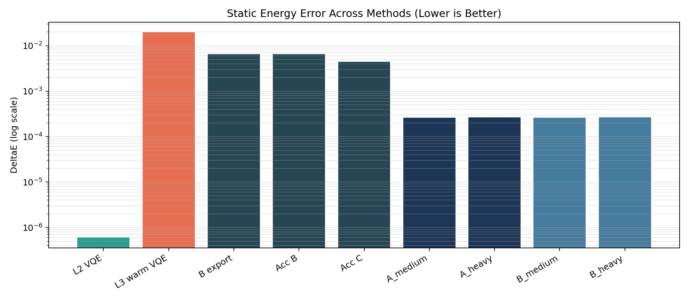

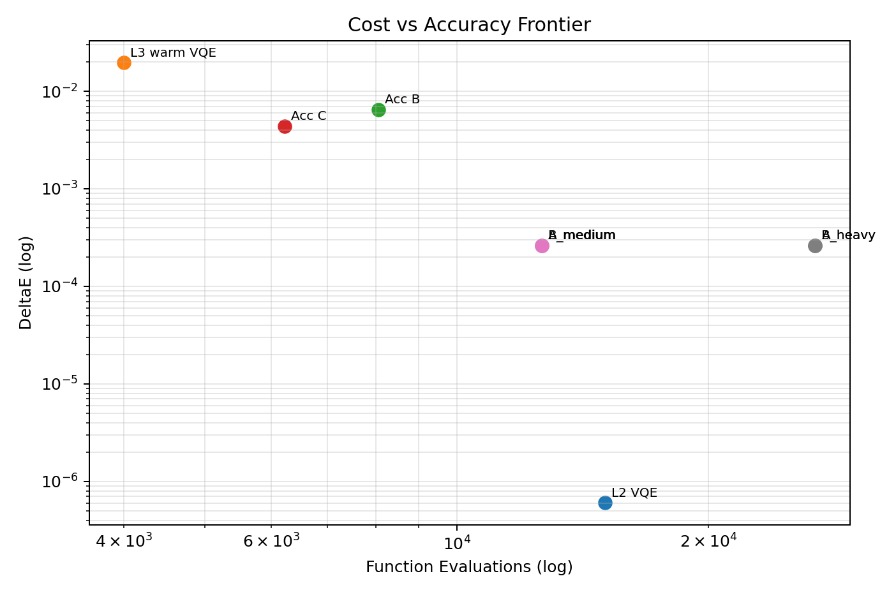

\newpage

## 6. Accessibility and Warm-Start Convergence

| Run | DeltaE_best | Depth | Params P | nfev | DeltaE_warm | Improvement factor DeltaE_warm/DeltaE_best | E_warm | E_best | Runtime (s) |
|---|---:|---:|---:|---:|---:|---:|---:|---:|---:|
| B export | 6.508e-03 | 42 | 42 | n/a | 1.969e-02 | 3.025 | 0.264627255 | 0.251448234 | 1201.4 |
| Acc B | 6.508e-03 | 43 | 43 | 8063 | 1.969e-02 | 3.025 | 0.264627255 | 0.251448234 | 1261.9 |
| Acc C | 4.393e-03 | 38 | 38 | 6227 | 1.234e-02 | 2.809 | 0.257282637 | 0.249334000 | 1208.3 |

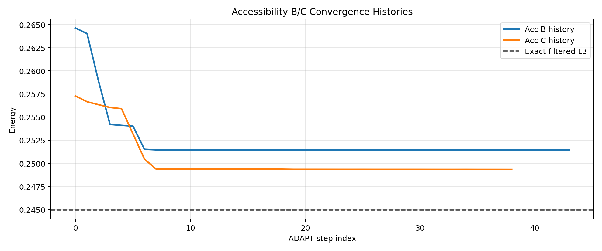

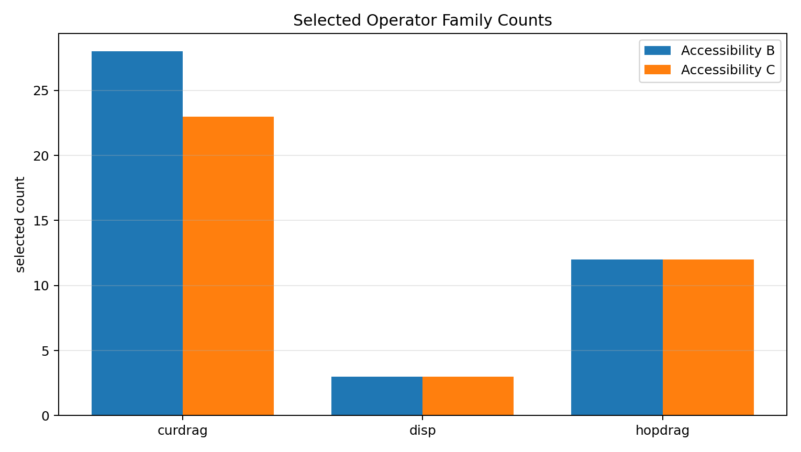

\newpage

## 7. Trend Experiment (A/B pools)

- Raw pool sizes: `UCCSD=8`, `PAOP=7`, `HVA=13`.
- Pool A (`uccsd+paop`): `dedup_total=15`, `overlap_count=0`.
- Pool B (`uccsd+paop+hva`): `dedup_total=28`, `overlap_count=0`.

| Trend run | DeltaE | Depth | Params P | nfev | runtime (s) | final max|grad| |
|---|---:|---:|---:|---:|---:|---:|
| A_medium | 2.622e-04 | 20 | 20 | 12640 | 624.0 | 4.564e-03 |
| A_heavy | 2.629e-04 | 36 | 36 | 26833 | 1722.5 | 7.722e-03 |
| B_medium | 2.622e-04 | 20 | 20 | 12640 | 720.7 | 4.564e-03 |
| B_heavy | 2.629e-04 | 36 | 36 | 26833 | 2379.3 | 7.722e-03 |

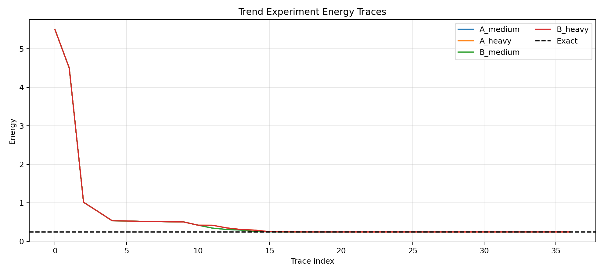

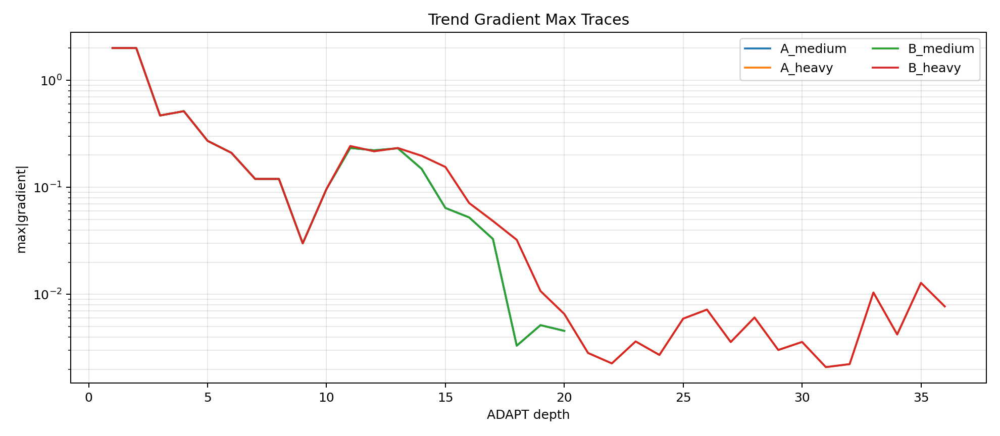

Section role boundary: Section 7 is static ADAPT trend optimization; Section 8 is driven branch dynamics.

\newpage

## 8. Drive Dynamics (Branch-Aware)

Branch order: `exact_gs_filtered`, `exact_paop`, `trotter_paop`, `exact_hva`, `trotter_hva`.

### 8.0 Dynamics Reference Trajectory and How It Is Generated

For dynamics, the reference is the time-dependent exact trajectory

$$
E_{ref}(t) \equiv E_{exact\_gs\_filtered}(t) = \\texttt{energy\\_total\\_exact}(t),
$$

taken from the `exact_gs_filtered` branch in `drive_from_fix1_warm_start_B_full.json`.

This is not a single static scalar; it is a full time series used as the baseline for branch comparisons. In this run:
- `E_ref(t=0) = 0.24494070012791422`
- `E_ref(t=t_final=15) = 0.26953974487978255`

Repo options/fields used to generate this dynamics dataset (same file, `settings.drive` + top-level settings):
- drive enabled: `true`
- waveform: `A=0.5`, `omega=2.0`, `phi=0.0`, `t0=0.0`, `tbar=3.0`, pattern=`staggered`
- Trotter setup: `suzuki_order=2`, `trotter_steps=192`
- exact reference setup: `reference_steps_multiplier=2`, `reference_steps=384`
- exact reference method: `exponential_midpoint_magnus2_order2`
- backend: `scipy_sparse_expm_multiply`

### 8.1 Exact-GS vs PAOP/Trotter-PAOP (Primary Dynamics Comparison)

Naming map used in this section (`drive_from_fix1_warm_start_B_full.json`):
- `exact_gs_filtered`: exact/reference propagation from filtered-sector exact ground-state initialization.
- `exact_paop`: exact propagation from imported PAOP ADAPT state (`source=adapt_json`, `pool=paop_lf_std`, `depth=42`).
- `trotter_paop`: Trotter propagation from the same PAOP initialization.
- `exact_hva`: exact propagation from regular hardcoded VQE (`source=regular_vqe`, `ansatz=hh_hva_ptw`).
- `trotter_hva`: Trotter propagation from the same HVA initialization.

Primary PAOP triad (total-energy distances):

| Metric pair | t=0 | mean over time | max over time | t=t_final |
|---|---:|---:|---:|---:|
| `|E_gs - E_exact_paop|` | 6.508e-03 | 6.941e-03 | 7.938e-03 | 6.923e-03 |
| `|E_gs - E_trotter_paop|` | 6.508e-03 | 6.936e-03 | 7.910e-03 | 6.789e-03 |
| `|E_exact_paop - E_trotter_paop|` | 0.000e+00 | 1.380e-04 | 1.014e-03 | 1.340e-04 |

Companion HVA comparison (same metric form):

| Metric pair | t=0 | mean over time | max over time | t=t_final |
|---|---:|---:|---:|---:|
| `|E_gs - E_exact_hva|` | 1.777e-01 | 1.859e-01 | 1.905e-01 | 1.876e-01 |
| `|E_gs - E_trotter_hva|` | 1.777e-01 | 1.859e-01 | 1.904e-01 | 1.868e-01 |
| `|E_exact_hva - E_trotter_hva|` | 0.000e+00 | 4.360e-04 | 2.766e-03 | 7.359e-04 |

Fidelity summary (vs filtered exact GS manifold projector):

| Branch | mean | min | max | final |
|---|---:|---:|---:|---:|
| `paop` | 0.995893 | 0.995732 | 0.996043 | 0.995881 |
| `hva` | 0.827750 | 0.827244 | 0.828695 | 0.828071 |

Driven overlays requested in this revision:
- Plot A combines absolute energies and energy-error trajectories in one figure.
- Plot B combines absolute energies, fidelities, and observables in one figure.

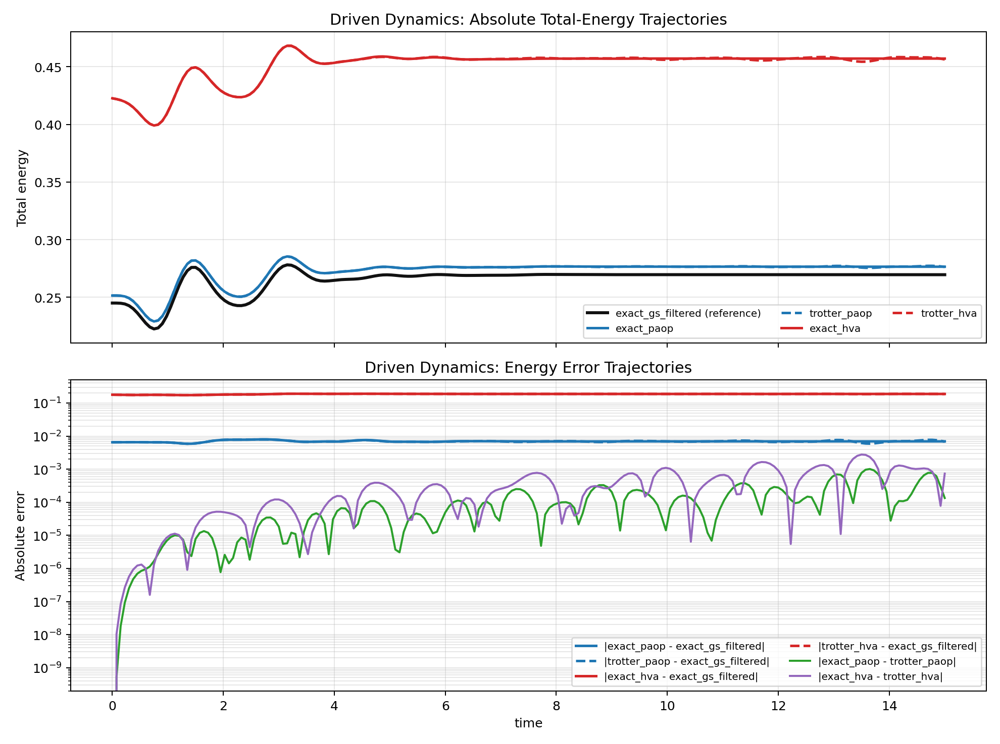

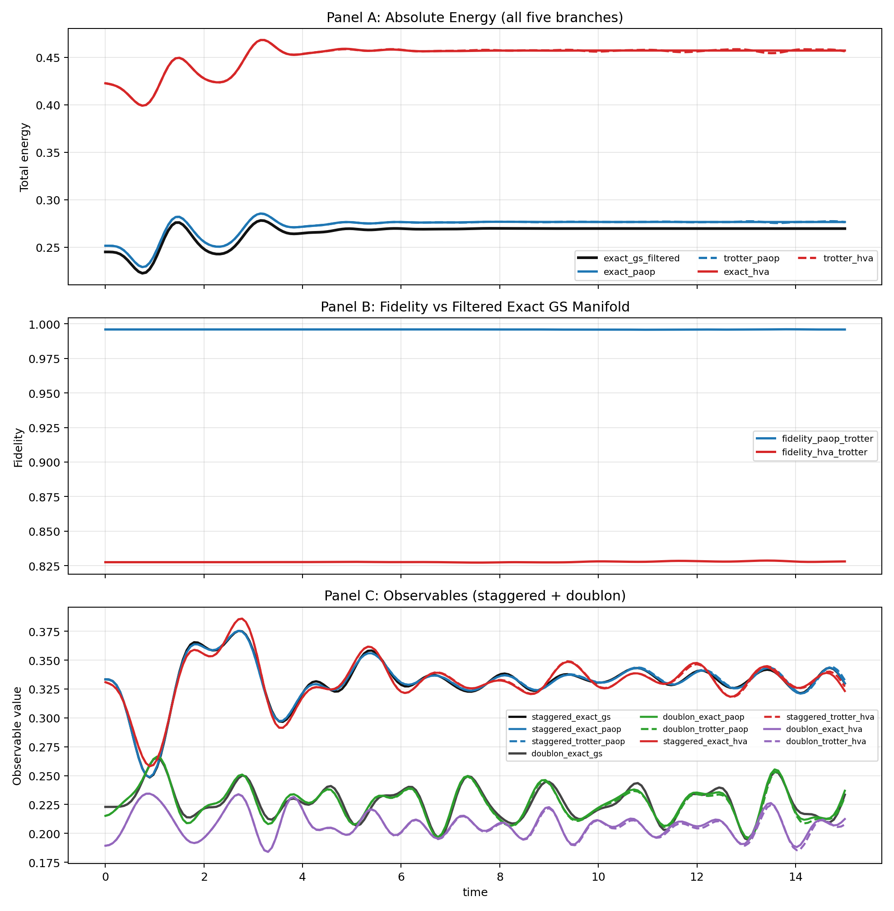

### 8.2 Additional Branch Aggregates

| Metric | PAOP branch | HVA branch |
|---|---:|---:|
| Fidelity mean | 0.995892975 | 0.827750111 |
| Fidelity final | 0.995881343 | 0.828070675 |
| max |Delta E_total| | 1.014e-03 | 2.766e-03 |
| mean |Delta E_total| | 1.380e-04 | 4.360e-04 |
| max |Delta doublon| | 5.556e-03 | 4.733e-03 |

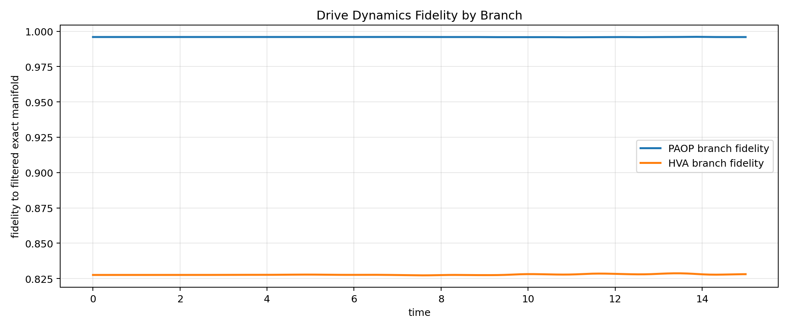

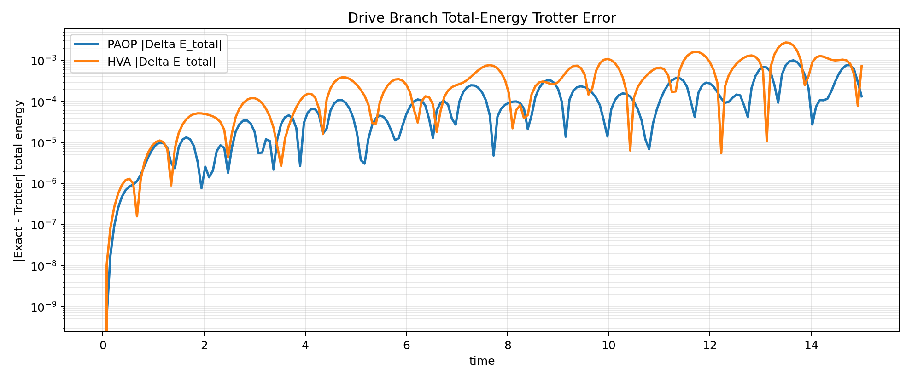

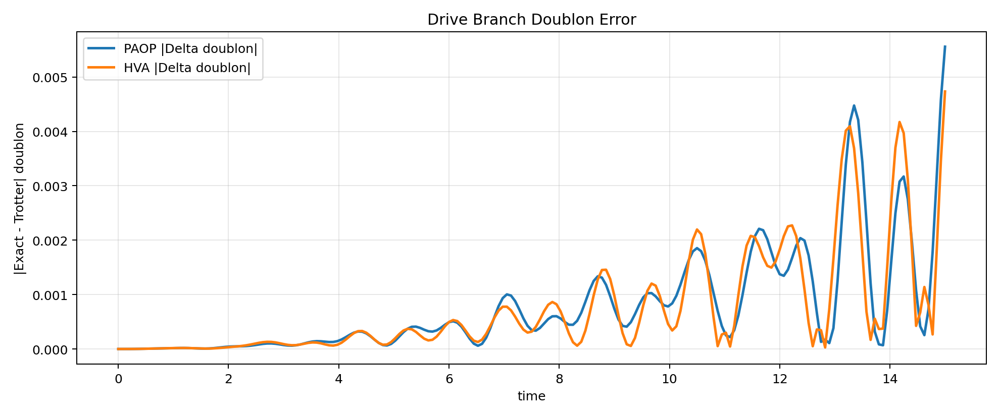

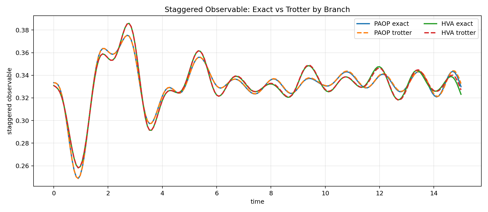

\newpage

## 9. Interpretable Time-Snapshot Appendix (No Raw Dump)

Snapshot rows every 10th time index for readability (21 rows total).

| idx | time | F_paop | F_hva | dE_total_paop | dE_total_hva | dD_paop | dD_hva |
|---:|---:|---:|---:|---:|---:|---:|---:|
| 0 | 0.000 | 0.995909 | 0.827522 | 0.000e+00 | 0.000e+00 | 0.000e+00 | 0.000e+00 |
| 10 | 0.750 | 0.995909 | 0.827521 | 1.663e-06 | 1.320e-06 | 9.340e-06 | 1.044e-05 |
| 20 | 1.500 | 0.995909 | 0.827517 | 7.830e-06 | 1.727e-05 | 7.975e-06 | 9.208e-06 |
| 30 | 2.250 | 0.995904 | 0.827514 | 6.163e-06 | 3.898e-05 | 5.051e-05 | 5.763e-05 |
| 40 | 3.000 | 0.995906 | 0.827580 | 1.832e-05 | 1.211e-04 | 7.286e-05 | 8.990e-05 |
| 50 | 3.750 | 0.995910 | 0.827601 | 4.004e-05 | 4.533e-05 | 1.343e-04 | 8.513e-05 |
| 60 | 4.500 | 0.995910 | 0.827710 | 6.052e-05 | 2.118e-04 | 2.869e-04 | 2.994e-04 |
| 70 | 5.250 | 0.995936 | 0.827729 | 1.259e-05 | 8.408e-05 | 3.732e-04 | 3.713e-04 |
| 80 | 6.000 | 0.995924 | 0.827590 | 4.948e-05 | 2.581e-04 | 4.923e-04 | 4.956e-04 |
| 90 | 6.750 | 0.995951 | 0.827563 | 1.030e-04 | 1.305e-04 | 3.830e-04 | 4.241e-04 |
| 100 | 7.500 | 0.995918 | 0.827248 | 1.660e-04 | 6.827e-04 | 3.472e-04 | 3.184e-04 |
| 110 | 8.250 | 0.995908 | 0.827536 | 9.220e-05 | 8.233e-05 | 4.452e-04 | 1.238e-04 |
| 120 | 9.000 | 0.995863 | 0.827396 | 2.033e-04 | 3.001e-04 | 7.400e-04 | 9.808e-04 |
| 130 | 9.750 | 0.995822 | 0.827926 | 1.248e-04 | 5.640e-04 | 9.674e-04 | 1.164e-03 |
| 140 | 10.500 | 0.995833 | 0.827907 | 9.978e-05 | 1.265e-04 | 1.854e-03 | 2.196e-03 |
| 150 | 11.250 | 0.995769 | 0.828147 | 3.302e-04 | 1.730e-04 | 6.147e-04 | 9.901e-04 |
| 160 | 12.000 | 0.995880 | 0.828300 | 2.780e-04 | 9.137e-04 | 1.374e-03 | 1.826e-03 |
| 170 | 12.750 | 0.995851 | 0.828023 | 4.194e-05 | 1.302e-03 | 1.309e-04 | 3.459e-04 |
| 180 | 13.500 | 0.995954 | 0.828678 | 7.711e-04 | 2.766e-03 | 3.432e-03 | 1.780e-03 |
| 190 | 14.250 | 0.995912 | 0.827734 | 1.078e-04 | 1.247e-03 | 3.170e-03 | 3.969e-03 |
| 200 | 15.000 | 0.995881 | 0.828071 | 1.340e-04 | 7.359e-04 | 5.556e-03 | 4.733e-03 |

## 10. Quantile Appendix (Trajectory Error Distributions)

| quantile | dE_total_paop | dE_total_hva | dD_paop | dD_hva |
|---|---:|---:|---:|---:|
| min | 0.000e+00 | 0.000e+00 | 0.000e+00 | 0.000e+00 |
| q25 | 1.345e-05 | 4.970e-05 | 9.817e-05 | 8.990e-05 |
| median | 6.784e-05 | 2.426e-04 | 4.109e-04 | 3.386e-04 |
| q75 | 1.702e-04 | 6.503e-04 | 1.030e-03 | 9.851e-04 |
| q90 | 3.296e-04 | 1.141e-03 | 1.963e-03 | 2.055e-03 |
| q99 | 9.172e-04 | 2.538e-03 | 4.475e-03 | 4.095e-03 |
| max | 1.014e-03 | 2.766e-03 | 5.556e-03 | 4.733e-03 |

\newpage

## 11. Interpretation Notes

1. Large `nfev` does not guarantee lower `DeltaE`; pool geometry and stopping criteria dominate late-stage behavior.
2. The `42 vs 43` depth discrepancy for B is a provenance difference across two executions (export artifact vs accessibility rerun), not a contradiction.
3. In driven outputs, internal HVA branch quality can differ substantially from imported PAOP branch quality; always interpret by branch source first.
4. This report intentionally removes unreadable raw dumps; all raw values remain in JSON artifacts listed in Section 1.
