# HH Pareto Flow Chart

Reduced HH workflow map for Pareto screening.

Excluded by design: `HVA only` and `HVA -> VQE`.

For `ADAPT -> VQE` and `HVA -> ADAPT -> VQE`, the final VQE stage is matched-family replay with `full_meta` fallback.

```mermaid
flowchart TB
  root["HH workflow candidates"]

  root --> hva_first["HVA-first branch"]
  root --> adapt_branch["ADAPT branch"]
  root --> vqe_only["VQE only"]

  hva_first --> hva_to_adapt["HVA -> ADAPT"]
  hva_first --> hva_to_adapt_vqe["HVA -> ADAPT -> VQE"]

  adapt_branch --> adapt_only["ADAPT only"]
  adapt_branch --> adapt_to_vqe["ADAPT -> VQE"]

  hva_to_adapt --> warm_bucket
  hva_to_adapt --> adapt_surface
  hva_to_adapt_vqe --> warm_bucket
  hva_to_adapt_vqe --> adapt_surface
  hva_to_adapt_vqe --> replay_bucket

  adapt_only --> adapt_surface
  adapt_to_vqe --> adapt_surface
  adapt_to_vqe --> replay_bucket

  vqe_only --> fixed_vqe_bucket

  subgraph warm_surface["Warm-start HVA surface"]
    direction TB
    warm_bucket["Warm-start HH-HVA variants"]
    warm_bucket --> warm_hh_hva["hh_hva"]
    warm_bucket --> warm_hh_hva_tw["hh_hva_tw"]
    warm_bucket --> warm_hh_hva_ptw["hh_hva_ptw"]
  end

  subgraph fixed_vqe_surface["Fixed VQE surface"]
    direction TB
    fixed_vqe_bucket["Fixed VQE ansatz families"]
    fixed_vqe_bucket --> fixed_uccsd["uccsd"]
    fixed_vqe_bucket --> fixed_hh_hva["hh_hva"]
    fixed_vqe_bucket --> fixed_hh_hva_tw["hh_hva_tw"]
    fixed_vqe_bucket --> fixed_hh_hva_ptw["hh_hva_ptw"]
  end

  subgraph adapt_search["ADAPT search surface"]
    direction TB
    adapt_surface["ADAPT pool / generator search"]

    adapt_surface --> meta_bucket["Meta / broad families"]
    meta_bucket --> meta_hva["hva"]
    meta_bucket --> meta_full_meta["full_meta"]
    meta_bucket --> meta_all_hh_meta["all_hh_meta_v1"]
    meta_bucket --> meta_uccsd_paop_lf_full["uccsd_paop_lf_full"]

    adapt_surface --> paop_family_bucket["PAOP pool families"]
    paop_family_bucket --> pf_min["paop_min"]
    paop_family_bucket --> pf_std["paop_std"]
    paop_family_bucket --> pf_full["paop_full"]
    paop_family_bucket --> pf_lf_std["paop_lf_std"]
    paop_family_bucket --> pf_lf2_std["paop_lf2_std"]
    paop_family_bucket --> pf_lf3_std["paop_lf3_std"]
    paop_family_bucket --> pf_lf4_std["paop_lf4_std"]
    paop_family_bucket --> pf_lf_full["paop_lf_full"]
    paop_family_bucket --> pf_sq_std["paop_sq_std"]
    paop_family_bucket --> pf_sq_full["paop_sq_full"]
    paop_family_bucket --> pf_bond_disp["paop_bond_disp_std"]
    paop_family_bucket --> pf_hop_sq["paop_hop_sq_std"]
    paop_family_bucket --> pf_pair_sq["paop_pair_sq_std"]

    adapt_surface --> paop_primitive_bucket["PAOP primitive channels"]
    paop_primitive_bucket --> pp_disp["disp"]
    paop_primitive_bucket --> pp_dbl["dbl"]
    paop_primitive_bucket --> pp_hopdrag["hopdrag"]
    paop_primitive_bucket --> pp_curdrag["curdrag"]
    paop_primitive_bucket --> pp_hop2["hop2"]
    paop_primitive_bucket --> pp_curdrag3["curdrag3"]
    paop_primitive_bucket --> pp_hop4["hop4"]
    paop_primitive_bucket --> pp_bond_disp["bond_disp"]
    paop_primitive_bucket --> pp_hop_sq["hop_sq"]
    paop_primitive_bucket --> pp_pair_sq["pair_sq"]
    paop_primitive_bucket --> pp_sq["sq"]
    paop_primitive_bucket --> pp_dens_sq["dens_sq"]
    paop_primitive_bucket --> pp_cloud_p["cloud_p"]
    paop_primitive_bucket --> pp_cloud_x["cloud_x"]
    paop_primitive_bucket --> pp_cloud_sq["cloud_sq"]
    paop_primitive_bucket --> pp_dbl_p["dbl_p"]
    paop_primitive_bucket --> pp_dbl_x["dbl_x"]
    paop_primitive_bucket --> pp_dbl_sq["dbl_sq"]

    adapt_surface --> vlf_bucket["VLF / SQ macro families"]
    vlf_bucket --> vlf_only["vlf_only"]
    vlf_bucket --> sq_only["sq_only"]
    vlf_bucket --> vlf_sq["vlf_sq"]
    vlf_bucket --> sq_dens_only["sq_dens_only"]
    vlf_bucket --> vlf_sq_dens["vlf_sq_dens"]
  end

  subgraph replay_surface["Replay VQE surface"]
    direction TB
    replay_bucket["Matched-family replay VQE"]
    replay_bucket --> replay_match["generator-family: match_adapt"]
    replay_bucket --> replay_fallback["fallback-family: full_meta"]
  end

  hva_to_adapt --> cand_hva_adapt["Candidate workflow"]
  cand_hva_adapt --> score_hva_adapt["Evaluate ΔE_abs and hardware-cost proxies"]

  hva_to_adapt_vqe --> cand_hva_adapt_vqe["Candidate workflow"]
  cand_hva_adapt_vqe --> score_hva_adapt_vqe["Evaluate ΔE_abs and hardware-cost proxies"]

  adapt_only --> cand_adapt["Candidate workflow"]
  cand_adapt --> score_adapt["Evaluate ΔE_abs and hardware-cost proxies"]

  adapt_to_vqe --> cand_adapt_vqe["Candidate workflow"]
  cand_adapt_vqe --> score_adapt_vqe["Evaluate ΔE_abs and hardware-cost proxies"]

  vqe_only --> cand_vqe["Candidate workflow"]
  cand_vqe --> score_vqe["Evaluate ΔE_abs and hardware-cost proxies"]

  score_hva_adapt --> pareto_metrics
  score_hva_adapt_vqe --> pareto_metrics
  score_adapt --> pareto_metrics
  score_adapt_vqe --> pareto_metrics
  score_vqe --> pareto_metrics

  subgraph pareto_filter["Pareto evaluation"]
    direction TB
    pareto_metrics["Metrics collected"]
    pareto_metrics --> metric_energy["State quality: ΔE_abs"]
    pareto_metrics --> metric_cx["Primary cost axis: cx_proxy_total"]
    pareto_metrics --> metric_terms["Secondary proxy: term_exp_count_total"]
    pareto_metrics --> metric_depth["Secondary proxy: depth_proxy_total"]
    pareto_metrics --> metric_sq["Secondary proxy: sq_proxy_total"]
    metric_energy --> pareto_front["Pareto front"]
    metric_cx --> pareto_front
    metric_terms --> pareto_front
    metric_depth --> pareto_front
    metric_sq --> pareto_front
    pareto_front --> shortlist["Shortlist for detailed benchmarking"]
  end
```

