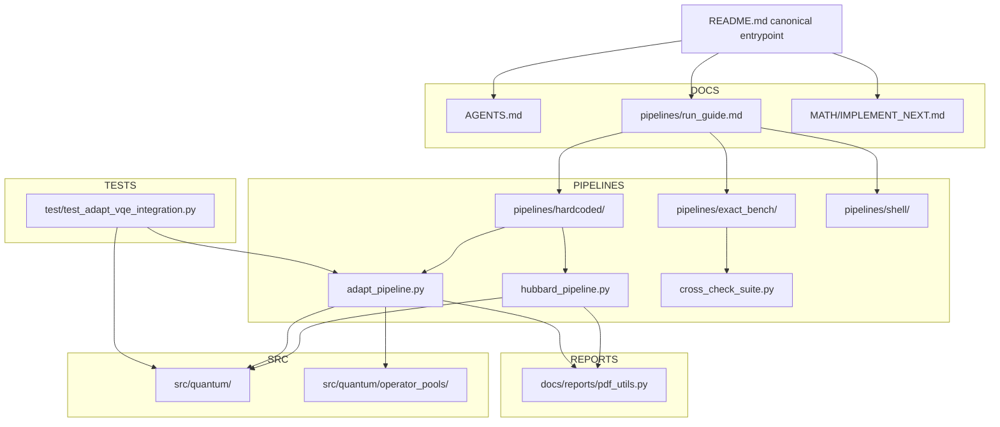
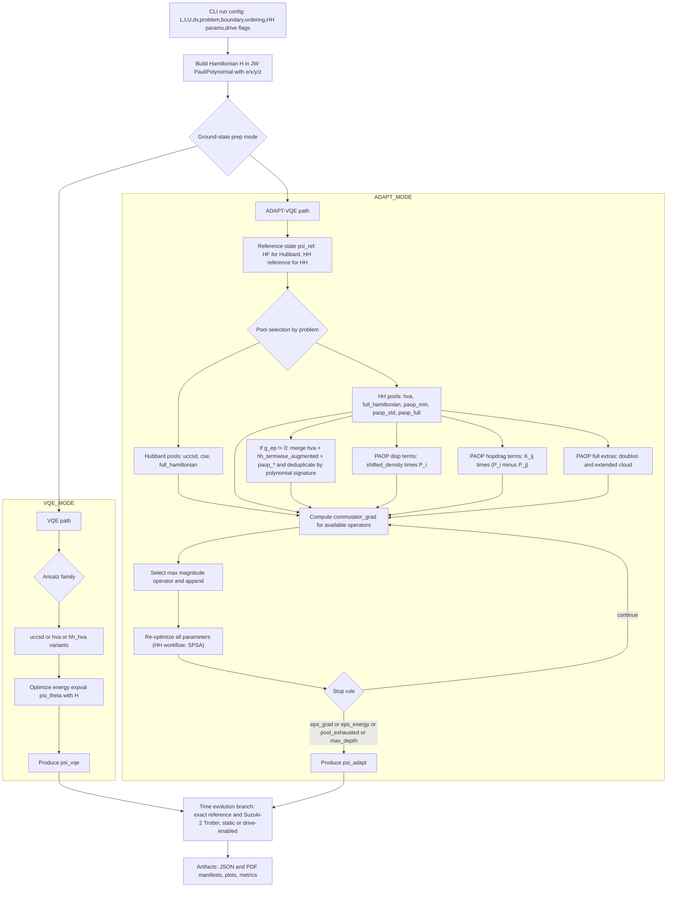

<file_map>
/Users/jakestrobel/Documents/Holstein_implementation/Holstein_test_fullclone_2
├── MATH
│   ├── IMPLEMENT_SOON.md *
│   ├── Math.md *
│   ├── IMPLEMENT_NEXT.md
│   └── Math.pdf
├── artifacts 1
│   ├── useful
│   │   ├── L2
│   │   │   ├── 20260309_plateau_v3_summary.md *
│   │   │   ├── 20260309_knee_layerwise_warm_hh_hva_replay.md
│   │   │   ├── 20260309_knee_ptw_warm_hh_hva_ptw_replay.md
│   │   │   ├── 20260309_plateau_v3_knee_layerwise_replay.md
│   │   │   ├── 20260309_plateau_v3_knee_ptw_replay.md
│   │   │   ├── 20260309_plateau_v3_strong_layerwise_replay.md
│   │   │   ├── 20260309_plateau_v3_strong_ptw_replay.md
│   │   │   ├── 20260309_plateau_v3_weak_layerwise_replay.md
│   │   │   ├── 20260309_plateau_v3_weak_ptw_replay.md
│   │   │   ├── 20260309_strong_layerwise_warm_hh_hva_replay.md
│   │   │   ├── 20260309_strong_ptw_warm_hh_hva_ptw_replay.md
│   │   │   ├── 20260309_weak_layerwise_warm_hh_hva_replay.md
│   │   │   ├── 20260309_weak_ptw_warm_hh_hva_ptw_replay.md
│   │   │   ├── hh_staged_L2_drive_ptw_spsa_heavy_d120_replay.md
│   │   │   ├── hh_staged_L2_static_t1_U2_dv0_w1_g1_nph1_warmhh_hva_ptw_a56ab6fb09_replay.md
│   │   │   ├── hh_staged_circuit_L2_plateau_v3_weak_ptw_L2_replay.md
│   │   │   ├── hh_staged_circuit_L2_reasonable_L2_replay.md
│   │   │   ├── hh_staged_circuit_smoke_legacy_nohhseed_L2_replay.md
│   │   │   ├── l2_first_noise_anchor_replay.md
│   │   │   ├── l2_first_noise_generic6_replay.md
│   │   │   ├── l2_first_noise_jakarta_replay.md
│   │   │   ├── l2_first_noise_jakarta_s2_fast_replay.md
│   │   │   ├── l2_first_noise_jakarta_s2_ok_replay.md
│   │   │   └── l2_first_noise_jakarta_s2_replay.md
│   │   └── L3
│   │       ├── hh_staged_L3_static_t1_U2_dv0_w1_g1_nph1_warmhh_hva_ptw_9afb5d05d5_replay.md
│   │       └── hh_staged_circuit_smoke_legacy_nohhseed_L3_replay.md
│   ├── json
│   │   ├── noise_l2_pdf
│   │   │   ├── basic.json
│   │   │   ├── ideal_control.json
│   │   │   ├── ideal_control_compiled.json
│   │   │   ├── ideal_control_compiled_spsa.json
│   │   │   ├── ideal_control_ptw_spsa.json
│   │   │   ├── scheduled.json
│   │   │   └── shots.json
│   │   ├── noise_l2_test
│   │   │   ├── basic.json
│   │   │   ├── scheduled.json
│   │   │   └── shots.json
│   │   ├── 20260309_knee_layerwise_warm_hh_hva.json
│   │   ├── 20260309_knee_layerwise_warm_hh_hva_adapt_handoff.json
│   │   ├── 20260309_knee_layerwise_warm_hh_hva_replay.csv
│   │   ├── 20260309_knee_layerwise_warm_hh_hva_replay.json
│   │   ├── 20260309_knee_ptw_warm_hh_hva_ptw.json
│   │   ├── 20260309_knee_ptw_warm_hh_hva_ptw_adapt_handoff.json
│   │   ├── 20260309_knee_ptw_warm_hh_hva_ptw_replay.csv
│   │   ├── 20260309_knee_ptw_warm_hh_hva_ptw_replay.json
│   │   ├── 20260309_plateau_v3_knee_layerwise.json
│   │   ├── 20260309_plateau_v3_knee_layerwise_adapt_handoff.json
│   │   ├── 20260309_plateau_v3_knee_layerwise_replay.csv
│   │   ├── 20260309_plateau_v3_knee_layerwise_replay.json
│   │   ├── 20260309_plateau_v3_knee_ptw.json
│   │   ├── 20260309_plateau_v3_knee_ptw_adapt_handoff.json
│   │   ├── 20260309_plateau_v3_knee_ptw_replay.csv
│   │   ├── 20260309_plateau_v3_knee_ptw_replay.json
│   │   ├── 20260309_plateau_v3_strong_layerwise.json
│   │   ├── 20260309_plateau_v3_strong_layerwise_adapt_handoff.json
│   │   ├── 20260309_plateau_v3_strong_layerwise_replay.csv
│   │   ├── 20260309_plateau_v3_strong_layerwise_replay.json
│   │   ├── 20260309_plateau_v3_strong_ptw.json
│   │   ├── 20260309_plateau_v3_strong_ptw_adapt_handoff.json
│   │   ├── 20260309_plateau_v3_strong_ptw_replay.csv
│   │   ├── 20260309_plateau_v3_strong_ptw_replay.json
│   │   ├── 20260309_plateau_v3_weak_layerwise.json
│   │   ├── 20260309_plateau_v3_weak_layerwise_adapt_handoff.json
│   │   ├── 20260309_plateau_v3_weak_layerwise_replay.csv
│   │   ├── 20260309_plateau_v3_weak_layerwise_replay.json
│   │   ├── 20260309_plateau_v3_weak_ptw.json
│   │   ├── 20260309_plateau_v3_weak_ptw_adapt_handoff.json
│   │   ├── 20260309_plateau_v3_weak_ptw_replay.csv
│   │   ├── 20260309_plateau_v3_weak_ptw_replay.json
│   │   ├── 20260309_strong_layerwise_warm_hh_hva.json
│   │   ├── 20260309_strong_layerwise_warm_hh_hva_adapt_handoff.json
│   │   ├── 20260309_strong_layerwise_warm_hh_hva_replay.csv
│   │   ├── 20260309_strong_layerwise_warm_hh_hva_replay.json
│   │   ├── 20260309_strong_ptw_warm_hh_hva_ptw.json
│   │   ├── 20260309_strong_ptw_warm_hh_hva_ptw_adapt_handoff.json
│   │   ├── 20260309_strong_ptw_warm_hh_hva_ptw_replay.csv
│   │   ├── 20260309_strong_ptw_warm_hh_hva_ptw_replay.json
│   │   ├── 20260309_weak_layerwise_warm_hh_hva.json
│   │   ├── 20260309_weak_layerwise_warm_hh_hva_adapt_handoff.json
│   │   ├── 20260309_weak_layerwise_warm_hh_hva_replay.csv
│   │   ├── 20260309_weak_layerwise_warm_hh_hva_replay.json
│   │   ├── 20260309_weak_ptw_warm_hh_hva_ptw.json
│   │   ├── 20260309_weak_ptw_warm_hh_hva_ptw_adapt_handoff.json
│   │   ├── 20260309_weak_ptw_warm_hh_hva_ptw_replay.csv
│   │   ├── 20260309_weak_ptw_warm_hh_hva_ptw_replay.json
│   │   ├── L3_hh_drive_nph2_heavy_cutover_03268371471231371_adapt_handoff.json
│   │   ├── L3_hh_drive_nph2_heavy_cutover_03268371471231371_warm_checkpoint_state.json
│   │   ├── L3_hh_drive_nph2_heavy_cutover_03268371471231371_warm_cutover_state.json
│   │   ├── cfqm4_hh_L2_driveA1.0_U4_nph1_t10.json
│   │   ├── cfqm4_vs_suzuki2_hh_L2_hwmatch.json
│   │   ├── hh_noise_validation_L2_hh_hva_ptw_noiseless_ideal.json
│   │   ├── hh_staged_L2_drive_ptw_spsa_heavy_d120.json
│   │   ├── hh_staged_L2_drive_ptw_spsa_heavy_d120_adapt_handoff.json
│   │   ├── hh_staged_L2_drive_ptw_spsa_heavy_d120_replay.csv
│   │   ├── hh_staged_L2_drive_ptw_spsa_heavy_d120_replay.json
│   │   ├── hh_staged_L2_drive_t1_U2_dv0_w1_g1_nph1_warmhh_hva_ptw_b3d876db0d_adapt_handoff.json
│   │   ├── hh_staged_L2_drive_t1_U2_dv0_w1_g1_nph1_warmhh_hva_ptw_b3d876db0d_warm_checkpoint_state.json
│   │   ├── hh_staged_L2_drive_t1_U2_dv0_w1_g1_nph1_warmhh_hva_ptw_b3d876db0d_warm_cutover_state.json
│   │   ├── hh_staged_L2_static_t1_U2_dv0_w1_g1_nph1_warmhh_hva_ptw_a56ab6fb09_adapt_handoff.json
│   │   ├── hh_staged_L2_static_t1_U2_dv0_w1_g1_nph1_warmhh_hva_ptw_a56ab6fb09_replay.csv
│   │   ├── hh_staged_L2_static_t1_U2_dv0_w1_g1_nph1_warmhh_hva_ptw_a56ab6fb09_replay.json
│   │   ├── hh_staged_L3_static_t1_U2_dv0_w1_g1_nph1_warmhh_hva_ptw_9afb5d05d5_adapt_handoff.json
│   │   ├── hh_staged_L3_static_t1_U2_dv0_w1_g1_nph1_warmhh_hva_ptw_9afb5d05d5_replay.csv
│   │   ├── hh_staged_L3_static_t1_U2_dv0_w1_g1_nph1_warmhh_hva_ptw_9afb5d05d5_replay.json
│   │   ├── hh_staged_circuit_L2_plateau_v3_weak_ptw_L2_adapt_handoff.json
│   │   ├── hh_staged_circuit_L2_plateau_v3_weak_ptw_L2_replay.csv
│   │   ├── hh_staged_circuit_L2_plateau_v3_weak_ptw_L2_replay.json
│   │   ├── hh_staged_circuit_L2_reasonable_L2_adapt_handoff.json
│   │   ├── hh_staged_circuit_L2_reasonable_L2_replay.csv
│   │   ├── hh_staged_circuit_L2_reasonable_L2_replay.json
│   │   ├── hh_staged_circuit_smoke_legacy_L2_adapt_handoff.json
│   │   ├── hh_staged_circuit_smoke_legacy_nohhseed_L2_adapt_handoff.json
│   │   ├── hh_staged_circuit_smoke_legacy_nohhseed_L2_replay.csv
│   │   ├── hh_staged_circuit_smoke_legacy_nohhseed_L2_replay.json
│   │   ├── hh_staged_circuit_smoke_legacy_nohhseed_L3_adapt_handoff.json
│   │   ├── hh_staged_circuit_smoke_legacy_nohhseed_L3_replay.csv
│   │   ├── hh_staged_circuit_smoke_legacy_nohhseed_L3_replay.json
│   │   ├── hh_staged_circuit_smoke_noprune_L2_adapt_handoff.json
│   │   ├── l2_first_noise_anchor_adapt_handoff.json
│   │   ├── l2_first_noise_anchor_replay.csv
│   │   ├── l2_first_noise_anchor_replay.json
│   │   ├── l2_first_noise_anchor_snapshot.json
│   │   ├── l2_first_noise_anchor_warm_checkpoint_state.json
│   │   ├── l2_first_noise_anchor_warm_cutover_state.json
│   │   ├── l2_first_noise_backend_scheduled.json
│   │   ├── l2_first_noise_generic6_adapt_handoff.json
│   │   ├── l2_first_noise_generic6_backend_scheduled.json
│   │   ├── l2_first_noise_generic6_replay.csv
│   │   ├── l2_first_noise_generic6_replay.json
│   │   ├── l2_first_noise_generic6_snapshot.json
│   │   ├── l2_first_noise_generic6_warm_checkpoint_state.json
│   │   ├── l2_first_noise_generic6_warm_cutover_state.json
│   │   ├── l2_first_noise_jakarta_adapt_handoff.json
│   │   ├── l2_first_noise_jakarta_backend_scheduled.json
│   │   └── l2_first_noise_jakarta_replay.csv
│   ├── logs
│   │   ├── L3_hh_drive_nph2_heavy_cutover_03268371471231371.log.pre_resume_20260310T173403Z
│   │   └── L3_hh_drive_nph2_heavy_cutover_03268371471231371.stdout.log.pre_resume_20260310T173403Z
│   ├── pdf
│   │   ├── noise_l2_pdf
│   │   │   ├── basic.pdf
│   │   │   ├── scheduled.pdf
│   │   │   └── shots.pdf
│   │   ├── cfqm4_hh_L2_driveA1.0_U4_nph1_t10.pdf
│   │   ├── cfqm4_vs_suzuki2_hh_L2_hwmatch.pdf
│   │   ├── hh_staged_L2_drive_ptw_spsa_heavy_d120.pdf
│   │   ├── hh_staged_circuit_report_L2_L3.pdf
│   │   ├── hh_staged_circuit_report_L2_L3_smoke.pdf
│   │   ├── hh_staged_circuit_report_L2_plateau_v3_weak_ptw.pdf
│   │   ├── hh_staged_circuit_report_L2_reasonable.pdf
│   │   ├── suzuki2_hh_L2_driveA1.0_U4_nph1_t10_trotter128.pdf
│   │   └── suzuki2_hh_L2_driveA1.0_U4_nph1_t10_trotter64.pdf
│   ├── user_runs
│   │   └── 20260309_hh_l2_noiseless
│   │       └── json
│   │           ├── raw_ptw_g0.5_nph1.json
│   │           ├── raw_ptw_g1.0_nph1.json
│   │           ├── raw_ptw_g1.0_nph2.json
│   │           ├── raw_ptw_g1.25_nph1.json
│   │           ├── raw_ptw_g1.25_nph2.json
│   │           ├── raw_ptw_g1.5_nph1.json
│   │           └── raw_ptw_g1.5_nph2.json
│   └── hh_noise_validation_L2_hh_hva_ptw_run_summary.md
├── pipelines
│   ├── exact_bench
│   │   ├── README.md *
│   │   ├── cross_check_suite.py * +
│   │   ├── hh_fixed_handoff_replay_optimizer_probe_workflow.py * +
│   │   ├── hh_full_pool_expressivity_probe_workflow.py * +
│   │   ├── hh_l2_logical_screen_workflow.py * +
│   │   ├── hh_l2_stage_unit_audit_workflow.py * +
│   │   ├── benchmark_metrics_proxy.py +
│   │   ├── hh_fixed_handoff_replay_optimizer_probe.py +
│   │   ├── hh_full_pool_expressivity_probe.py
│   │   ├── hh_l2_logical_screen.py +
│   │   ├── hh_l2_stage_unit_audit.py +
│   │   ├── hh_noise_hardware_validation.py +
│   │   ├── hh_noise_robustness_seq_report.py +
│   │   ├── hh_seq_transition_utils.py +
│   │   ├── noise_aer_builders.py +
│   │   ├── noise_model_spec.py +
│   │   ├── noise_oracle_runtime.py +
│   │   ├── noise_patch_selection.py +
│   │   ├── noise_snapshot.py +
│   │   └── statevector_kernels.py +
│   ├── hardcoded
│   │   ├── adapt_pipeline.py * +
│   │   ├── hh_staged_cli_args.py * +
│   │   ├── hh_staged_workflow.py * +
│   │   ├── hh_vqe_from_adapt_family.py * +
│   │   ├── handoff_state_bundle.py +
│   │   ├── hh_continuation_generators.py +
│   │   ├── hh_continuation_motifs.py +
│   │   ├── hh_continuation_pruning.py +
│   │   ├── hh_continuation_replay.py +
│   │   ├── hh_continuation_rescue.py +
│   │   ├── hh_continuation_scoring.py +
│   │   ├── hh_continuation_stage_control.py +
│   │   ├── hh_continuation_symmetry.py +
│   │   ├── hh_continuation_types.py +
│   │   ├── hh_staged_circuit_report.py +
│   │   ├── hh_staged_noise.py +
│   │   ├── hh_staged_noise_workflow.py +
│   │   ├── hh_staged_noiseless.py +
│   │   ├── hubbard_pipeline.py +
│   │   └── qpe_qiskit_shim.py +
│   ├── shell
│   │   ├── build_hh_noise_robustness_report.sh
│   │   └── run_drive_accurate.sh
│   └── run_guide.md *
├── src
│   ├── quantum
│   │   ├── operator_pools
│   │   │   ├── polaron_paop.py * +
│   │   │   ├── vlf_sq.py * +
│   │   │   └── __init__.py +
│   │   ├── time_propagation
│   │   │   ├── __init__.py +
│   │   │   ├── cfqm_propagator.py +
│   │   │   └── cfqm_schemes.py +
│   │   ├── vqe_latex_python_pairs.py * +
│   │   ├── __init__.py
│   │   ├── compiled_ansatz.py +
│   │   ├── compiled_polynomial.py +
│   │   ├── drives_time_potential.py +
│   │   ├── ed_hubbard_holstein.py +
│   │   ├── hartree_fock_reference_state.py +
│   │   ├── hubbard_latex_python_pairs.py +
│   │   ├── pauli_actions.py +
│   │   ├── pauli_letters_module.py +
│   │   ├── pauli_polynomial_class.py +
│   │   ├── pauli_words.py +
│   │   ├── qubitization_module.py +
│   │   └── spsa_optimizer.py +
│   └── __init__.py +
├── test
│   ├── test_adapt_vqe_integration.py * +
│   ├── test_hh_adapt_family_replay.py * +
│   ├── test_hh_fixed_handoff_replay_optimizer_probe_workflow.py * +
│   ├── test_hh_full_pool_expressivity_probe_workflow.py * +
│   ├── test_hh_l2_logical_screen_workflow.py * +
│   ├── test_hh_l2_stage_unit_audit_workflow.py * +
│   ├── test_hh_staged_noiseless_workflow.py * +
│   ├── test_polaron_paop.py * +
│   ├── test_vlf_sq_pool.py * +
│   ├── test_vqe_energy_backend.py * +
│   ├── conftest.py +
│   ├── test_benchmark_metrics_proxy.py +
│   ├── test_cfqm_acceptance.py +
│   ├── test_cfqm_propagator.py +
│   ├── test_cfqm_schemes.py +
│   ├── test_compiled_ansatz.py +
│   ├── test_compiled_polynomial.py +
│   ├── test_cross_check_suite_cli.py +
│   ├── test_ed_crosscheck.py +
│   ├── test_exact_steps_multiplier.py +
│   ├── test_hardcoded_qpe_isolation.py +
│   ├── test_hh_continuation_generators.py +
│   ├── test_hh_continuation_motifs.py +
│   ├── test_hh_continuation_pruning.py +
│   ├── test_hh_continuation_replay.py +
│   ├── test_hh_continuation_rescue.py +
│   ├── test_hh_continuation_scoring.py +
│   ├── test_hh_continuation_stage_control.py +
│   ├── test_hh_continuation_symmetry.py +
│   ├── test_hh_noise_hardware_validation.py +
│   ├── test_hh_noise_model_spec.py +
│   ├── test_hh_noise_oracle_runtime.py +
│   ├── test_hh_noise_patch_selection.py +
│   ├── test_hh_noise_robustness_benchmarks.py +
│   ├── test_hh_noise_statevector_kernels.py +
│   ├── test_hh_noise_validation_cli.py +
│   ├── test_hh_staged_circuit_report.py +
│   ├── test_hh_staged_noise_workflow.py +
│   ├── test_hh_vqe_from_adapt_family_seed.py +
│   ├── test_hubbard_adapt_ref_source.py +
│   ├── test_report_layers.py +
│   ├── test_spsa_optimizer.py +
│   ├── test_staged_export_replay_roundtrip.py +
│   ├── test_time_potential_drive.py +
│   └── test_trotter_hh_integration.py +
├── .obsidian
│   ├── app.json
│   ├── appearance.json
│   ├── core-plugins.json
│   └── workspace.json
├── HH
│   ├── .obsidian
│   │   ├── app.json
│   │   ├── appearance.json
│   │   ├── core-plugins.json
│   │   └── workspace.json
│   ├── Untitled.md
│   └── artifacts 1.md
├── docs
│   └── reports
│       ├── __init__.py
│       ├── pdf_utils.py +
│       ├── qiskit_circuit_report.py +
│       ├── report_labels.py +
│       └── report_pages.py +
├── prompt-exports
│   ├── 2026-03-12-2315-plan-hh-failure-test-ladder.md
│   └── 2026-03-12-2359-plan-hh-operator-pool-expansion.md
├── AGENTS.md *
├── L2_hh_smart_replay.md *
├── README.md *
├── .gitignore
├── L2_hh_smart_adapt.json
├── L2_hh_smart_replay.csv
├── L2_hh_smart_replay.json
├── L2_hh_smart_replay_bundle_diagnostic.json
├── L2_hh_smart_results_diagnostic.json
├── L2_hh_smart_results_diagnostic.pdf
├── L2_hh_smart_warm.json
├── activate_ibm_runtime.py +
└── investigation_hh_noise_boundaries.md


(* denotes selected files)
(+ denotes code-map available)
</file_map>
<file_contents>
File: /Users/jakestrobel/Documents/Holstein_implementation/Holstein_test_fullclone_2/MATH/Math.md
(lines 1-320)
```md
---
title: "Hubbard-Holstein Mathematical Implementation (Current Linear Substitution-First Form)"
author: "Jake Skyler Strobel (repo-grounded revision)"
date: "March 11, 2026"
geometry: margin=0.8in
fontsize: 10pt
---

# 1. Parameter Manifest and Reader Contract

This manuscript is a present-tense, self-contained mathematical description of the implemented Hubbard and Hubbard-Holstein (HH) stack in this repository. It keeps the same linear style as the older manuscript,

1. primitives first,
2. composite operators second,
3. explicit substitutions third,
4. fully substituted forms last,

but it removes older future-tense framing and replaces it with the currently implemented operator, variational, drive, PAOP, continuation, and handoff surfaces.

## 1.1 Required parameter manifest

- Model family: `Hubbard` / `Hubbard-Holstein`.
- Lattice size: `L` or `dims`.
- Fermion ordering: `blocked` or `interleaved`.
- Boundary condition: `open` or `periodic`.
- Core fermion parameters: `t` (or `J` on HH surfaces), `U`, `dv` / site potentials.
- Core phonon parameters: `omega0`, `g` / `g_ep`, `n_ph_max`, `boson_encoding`.
- Variational family when relevant:
  - `hh_hva` = HH layerwise,
  - `hh_hva_tw` = HH Pauli-termwise,
  - `hh_hva_ptw` = HH physical-termwise,
  - ADAPT pools including `hva`, `full_meta`, `paop_*`, `uccsd_paop_lf_full`, `full_hamiltonian`.
- Optimizer/runtime parameters when relevant:
  - VQE optimizer,
  - SPSA schedule parameters,
  - energy backend,
  - ADAPT state backend,
  - staged continuation mode,
  - drive waveform controls,
  - propagator choice.

## 1.2 Reader contract

This document intentionally favors explicit substitution over compressed meta-definition.

- If a primitive exists, it is written first.
- If a composite operator is formed from primitives, those primitives are substituted into the composite.
- If a later formula can be reduced by inserting an earlier primitive explicitly, the insertion is shown.
- When a runtime surface has different defaults from a core builder surface, the difference is named explicitly instead of being hidden behind a single “repo default”.

## 1.3 Non-negotiable repository conventions

### 1.3.1 Internal Pauli alphabet

Internally the Pauli alphabet is always
$$
\{e,x,y,z\},
$$
with `e` as identity.

### 1.3.2 Pauli-word and qubit ordering

Pauli words and computational-basis labels are written left-to-right as
$$
q_{N_q-1}\cdots q_1 q_0,
$$
with qubit `q_0` the rightmost character and also the least-significant bit in basis-index arithmetic.

### 1.3.3 Canonical algebra sources

- Canonical `PauliTerm`: `src/quantum/qubitization_module.py`
- Canonical `PauliPolynomial`: `src/quantum/pauli_polynomial_class.py`
- Canonical JW ladder primitives:
  - `fermion_plus_operator(...)`
  - `fermion_minus_operator(...)`
- Canonical number operator surface:
  - `jw_number_operator(...)` in `src/quantum/hubbard_latex_python_pairs.py`

### 1.3.4 Surface-specific defaults

This manuscript does **not** pretend there is one universal default surface.

- Core builder functions in `src/quantum/hubbard_latex_python_pairs.py` often default to
  - `indexing="interleaved"`,
  - `pbc=True`.
- Hardcoded pipeline CLIs use different defaults, most notably
  - `ordering="blocked"`,
  - `boundary="periodic"`.
- `pipelines/hardcoded/adapt_pipeline.py` currently exposes HH `--boson-encoding binary` only.
- `pipelines/hardcoded/hubbard_pipeline.py` exposes a broader boson-encoding surface.

Whenever a formula depends on the surface, the surface is named locally.

## 1.4 Canonical code anchors

- `AGENTS.md`
- `README.md`
- `src/quantum/qubitization_module.py`
- `src/quantum/pauli_polynomial_class.py`
- `src/quantum/hubbard_latex_python_pairs.py`
- `src/quantum/hartree_fock_reference_state.py`
- `src/quantum/vqe_latex_python_pairs.py`
- `src/quantum/operator_pools/polaron_paop.py`
- `src/quantum/ed_hubbard_holstein.py`
- `src/quantum/spsa_optimizer.py`
- `src/quantum/drives_time_potential.py`
- `pipelines/hardcoded/hubbard_pipeline.py`
- `pipelines/hardcoded/adapt_pipeline.py`
- `pipelines/hardcoded/hh_continuation_stage_control.py`
- `pipelines/hardcoded/hh_continuation_scoring.py`
- `pipelines/hardcoded/handoff_state_bundle.py`
- `pipelines/exact_bench/cross_check_suite.py`
- `pipelines/exact_bench/hh_noise_hardware_validation.py`

# 2. Ordering, Indexing, and Register Layout

## 2.1 Site, spin, and mode indices

The site index is
$$
i\in\{0,1,\dots,L-1\},
$$
and the spin label is stored as
$$
\sigma\in\{\uparrow,\downarrow\}\equiv\{0,1\}.
$$

The fermion mode index is the JW qubit index.

### 2.1.1 Interleaved ordering

The interleaved map is
$$
p(i,\sigma)=2i+\sigma.
$$
So
$$
p(i,\uparrow)=2i,
\qquad
p(i,\downarrow)=2i+1.
$$

### 2.1.2 Blocked ordering

The blocked map is
$$
p(i,\uparrow)=i,
\qquad
p(i,\downarrow)=L+i.
$$

These are the two cases implemented by `mode_index(...)`.

## 2.2 Pauli-word placement and basis-index extraction

If a Pauli letter acts on qubit `q`, then in a printed word of length `N_q` it sits at string position
$$
\operatorname{pos}(q)=N_q-1-q.
$$

If the computational-basis index is `k`, then the occupation bit on qubit `q` is
$$
b_q(k)=\left\lfloor\frac{k}{2^q}\right\rfloor \bmod 2=((k\gg q)\&1).
$$

So the printed bitstring and the integer basis index obey the same rightmost-`q_0` convention.

## 2.3 Full HH register layout

The fermion register uses
$$
N_{\mathrm{ferm}}=2L
$$
qubits.

If the local phonon cutoff is `n_ph_max`, then the local Hilbert dimension is
$$
d=n_{\mathrm{ph,max}}+1.
$$

The phonon qubits per site are
$$
q_{\mathrm{pb}}=
\begin{cases}
\max\{1,\lceil \log_2 d\rceil\}, & \text{binary},\\
d, & \text{unary}.
\end{cases}
$$

Therefore the total HH qubit count is
$$
N_q=2L+Lq_{\mathrm{pb}}.
$$

In qubit-index order the register is
$$
[\text{fermion qubits}\;|\;\text{site-0 phonon qubits}\;|\;\text{site-1 phonon qubits}\;|\;\cdots].
$$

In printed bitstring order `q_(N_q-1)...q_0`, the high-index phonon blocks appear on the left, so the displayed HH basis label is read as
$$
[\text{site-(L-1) phonons}\;|\;\cdots\;|\;\text{site-0 phonons}\;|\;\text{fermions}].
$$

Implemented surfaces:

- `src/quantum/hubbard_latex_python_pairs.py`
  - `mode_index`
  - `boson_qubits_per_site`
  - `phonon_qubit_indices_for_site`
- `src/quantum/hartree_fock_reference_state.py`
  - `bitstring_qn1_to_q0`
  - `hubbard_holstein_reference_state`

# 3. Fermionic Primitives and Direct Substitution

## 3.1 Jordan-Wigner ladder primitives

For mode `p`, the creation operator implemented by `fermion_plus_operator("JW", N_q, p)` is
$$
\hat c_p^{\dagger}
=
\frac{1}{2}\,e_{N_q-1}\cdots e_{p+1}x_p z_{p-1}\cdots z_0
-
\frac{i}{2}\,e_{N_q-1}\cdots e_{p+1}y_p z_{p-1}\cdots z_0.
$$

The annihilation operator implemented by `fermion_minus_operator("JW", N_q, p)` is
$$
\hat c_p
=
\frac{1}{2}\,e_{N_q-1}\cdots e_{p+1}x_p z_{p-1}\cdots z_0
+
\frac{i}{2}\,e_{N_q-1}\cdots e_{p+1}y_p z_{p-1}\cdots z_0.
$$

Equivalently, in operator notation,
$$
\hat c_p^{\dagger}=\frac{1}{2}(X_p-iY_p)\prod_{r=0}^{p-1}Z_r,
\qquad
\hat c_p=\frac{1}{2}(X_p+iY_p)\prod_{r=0}^{p-1}Z_r,
$$
but the repository’s printed words always follow the explicit `q_(N_q-1)...q_0` ordering above.

## 3.2 Number primitive

The implemented number operator is
$$
\hat n_p=\hat c_p^{\dagger}\hat c_p=\frac{I-Z_p}{2}.
$$

This is exactly the formula returned by `jw_number_operator(...)`.

## 3.3 Site densities and doublon operator

If the site `i` uses fermion modes
$$
p_{i\uparrow}=p(i,\uparrow),
\qquad
p_{i\downarrow}=p(i,\downarrow),
$$
then
$$
\hat n_{i\uparrow}=\frac{I-Z_{p_{i\uparrow}}}{2},
\qquad
\hat n_{i\downarrow}=\frac{I-Z_{p_{i\downarrow}}}{2}.
$$

So the full site density is
$$
\hat n_i=\hat n_{i\uparrow}+\hat n_{i\downarrow}
=\frac{I-Z_{p_{i\uparrow}}}{2}+\frac{I-Z_{p_{i\downarrow}}}{2}
=I-\frac{1}{2}\bigl(Z_{p_{i\uparrow}}+Z_{p_{i\downarrow}}\bigr).
$$

The onsite doublon operator is
$$
\hat d_i=\hat n_{i\uparrow}\hat n_{i\downarrow}
=\frac{I-Z_{p_{i\uparrow}}}{2}\cdot\frac{I-Z_{p_{i\downarrow}}}{2}
=\frac{1}{4}\Bigl(I-Z_{p_{i\uparrow}}-Z_{p_{i\downarrow}}+Z_{p_{i\uparrow}}Z_{p_{i\downarrow}}\Bigr).
$$

## 3.4 Worked ordering substitutions

For `L=3`, the two repository orderings become

### 3.4.1 Interleaved
$$
\begin{aligned}
p(0,\uparrow)&=0, & p(0,\downarrow)&=1,\\
p(1,\uparrow)&=2, & p(1,\downarrow)&=3,\\
p(2,\uparrow)&=4, & p(2,\downarrow)&=5.
\end{aligned}
$$

### 3.4.2 Blocked
$$
\begin{aligned}
p(0,\uparrow)&=0, & p(0,\downarrow)&=3,\\
p(1,\uparrow)&=1, & p(1,\downarrow)&=4,\\
p(2,\uparrow)&=2, & p(2,\downarrow)&=5.
\end{aligned}
$$

Implemented surfaces:

- `src/quantum/pauli_polynomial_class.py`
- `src/quantum/hubbard_latex_python_pairs.py`
- `src/quantum/qubitization_module.py`

# 4. Boson Primitives and Encodings

## 4.1 Local boson Hilbert space

At site `i`, the truncated phonon space has basis
$$
\{|0\rangle_i,|1\rangle_i,\dots,|n_{\mathrm{ph,max}}\rangle_i\}.
$$

The local annihilation operator is

```

File: /Users/jakestrobel/Documents/Holstein_implementation/Holstein_test_fullclone_2/pipelines/run_guide.md
(lines 1-260)
```md
<!--
This guide is consumed by AI agents.

Editing contract (keep stable):
- Prefer additive edits and new sections over rewrites.
- When introducing “autoscaling”, express formulas explicitly (closed form), plus a reference-run anchored form.
- Record empirically validated baselines with timestamps + artifact filenames.
-->

# Hubbard Pipeline Run Guide

This file is the executable runbook layer (commands + operational contracts).
Active contract surface: `AGENTS.md` and this run guide.

## Active checkout status (2026-03-09)

- **Active production surface in this checkout**
  - `pipelines/hardcoded/hubbard_pipeline.py` (single-run hardcoded VQE/propagation)
  - `pipelines/hardcoded/adapt_pipeline.py` (ADAPT-VQE)
  - `pipelines/shell/run_drive_accurate.sh` (canonical shorthand `run L` contract)
  - `pipelines/exact_bench/cross_check_suite.py` and the `pipelines/exact_bench/` benchmarking/validation tools
- `archive/` compare/Qiskit runners are not present in this checkout.
- Sections labeled **Historical** / **Historical (not runnable)** are kept for provenance only.
- Parser defaults used by the active scripts are `--boundary open` and `--ordering blocked` unless explicitly overridden.

## HH + drive production prologue (2026-03-02)

### Scope (current reality)

- **Production target:** **Hubbard–Holstein (HH)** with **time-dependent drive enabled**.
- **Pure Hubbard** is a **legacy / dead model** for default planning in this repo; ignore it unless the user explicitly asks for a limiting-case / consistency run.
- The **drive waveform parameters** (A, ω, t̄, ϕ, pattern) are orthogonal to the **state-prep** knobs; this guide’s autoscaling focuses on the knobs that dominate convergence:
  - warm-start (conventional VQE seed stage; intermediate HH ansatz `hh_hva_ptw`),
  - ADAPT-VQE (target curriculum from `MATH/IMPLEMENT_SOON.md`: narrow HH
    pool first; `full_meta` only as controlled residual enrichment),
  - and the time-evolution grid (trotter_steps / t_final / num_times).

### Last known-good HH, drive-enabled L=3 artifacts (UTC)

Scoped to **HH + drive-enabled** with **L=3**, the last successful runs are:

- `2026-03-02T16:32:50Z` — `drive_from_fix1_warm_start_B_full.json`
- `2026-03-02T15:10:11Z` — `drive_from_fix1_warm_start_B_depth15.json`

### Common execution context (both runs)

- `problem=hh`, `L=3`, `t=1.0`, `U=4.0`, `dv=0.0`, `omega0=1.0`, `g_ep=0.5`, `n_ph_max=1`
- `ordering=blocked`, `boundary=open`
- Evolution grid: `trotter_steps=192`, `num_times=201`, `t_final=15.0`
- Conventional branch ansatz: `hh_hva_ptw`
  - Internal “regular VQE branch” stays poor in both: `|ΔE_abs| ≈ 1.7768e-01`

### Run A (full warm-start + deeper ADAPT) — **baseline to scale from**

- Imported ADAPT state from `fix1_warm_start_B_full_state.json`
- ADAPT branch: `pool=paop_lf_std`, `ansatz_depth=42`, `num_parameters=42`
- State quality:
  - `E=0.25144823353`
  - `E_exact_filtered=0.24494070013`
  - `ΔE_abs = |E - E_exact_filtered| = 6.5075e-03`
- Fidelity during drive: ~`0.9957` to `0.9960`
- State-build knobs behind the input state:
  - warm-start: `reps=3`, `restarts=5`, `maxiter=4000`
  - ADAPT rung: `max_depth=120`, `maxiter=5000`, `eps_grad=5e-7`, `eps_energy=1e-9` (wallclock-capped)

### Run B (depth-15 proxy) — **do not treat as production-quality**

- Imported ADAPT state from `fix1_warm_start_B_depth15_state.json`
- ADAPT branch: `pool=paop_lf_std`, `ansatz_depth=15`, `num_parameters=15`
- State quality:
  - `E=0.43085525147`
  - `E_exact_filtered=0.24494070013`
  - `ΔE_abs = 1.8591e-01`
- Fidelity during drive: ~`0.8323` to `0.8333`
- State-build knobs: warm-start `reps=3,restarts=1,maxiter=600`; ADAPT `max_depth=15,maxiter=300,eps_grad=5e-7,eps_energy=1e-9`

### Bottom line for HH+drive state-prep in this repo

- The parameter set that produced the expected convergence behavior is **Run A**, not the depth-15 proxy.
- **Current best observed HH L=3 drive-start convergence is** `ΔE_abs ≈ 6.5e-03`.
- **Default Hard Gate (final conventional VQE):** `ΔE_abs < 1e-4`.
- In this checkout, `run_drive_accurate.sh` enforces `<1e-7` unconditionally.

---

## HH autoscaling preset for L ≤ 10 (warm-start + ADAPT → drive)

This section is designed so an agent can compute defaults deterministically from:
- an **empirical reference run** (currently the L=3 Run A baseline), and
- a target lattice size `L ≤ 10`.

### Staged HH convergence gates

Define workflow-level energy gates for HH warm-start → ADAPT → final VQE:

- `ecut_1` (handoff gate): `ΔE_ws = |E_ws - E_exact_filtered| <= 1e-1` by default.
  - Use after warm-start VQE to decide whether to switch to ADAPT.
- `ecut_2` (final acceptance gate): `ΔE_final = |E_final - E_exact_filtered| <= 1e-4` by default.
  - Apply after final VQE on top of ADAPT.

Notes:
- ADAPT internal stopping remains controlled by existing knobs (`adapt-eps-grad`, `adapt-eps-energy`, `adapt-max-depth`, `adapt-maxiter`) and is separate from `ecut_*`.
- This is a runbook convention. If you script this, enforce `ecut_1/ecut_2` as post-stage checks in the orchestration layer; defaults above apply unless overridden by experiment policy.
- `pipelines/shell/run_drive_accurate.sh` is the active shorthand runner contract in this checkout. It enforces a fixed `1e-7` gate in code with no strict/loose runtime switch.

### Gate semantics by context

| Context | Gate | Basis |
|---|---|---|
| Final conventional VQE (agent policy) | `ΔE_abs < 1e-4` | AGENTS/run-guide default policy for this stage |
| Active shorthand runner (`pipelines/shell/run_drive_accurate.sh`) | `ΔE_abs < 1e-7` | Current CLI behavior (hardcoded in this checkout) |
| HH staged handoff (`ecut_1`) | `ΔE_ws <= 1e-2` | Diagnostic handoff guidance (pre-VQE) |
| HH staged final (`ecut_2`) | `ΔE_final <= 1e-4` | Diagnostic stage target before final replay |
| HH production pass gate (runbook) | `ΔE_abs <= 1e-2` | Practical quality indicator, not default hard stop |

### Policy-vs-code note

- `AGENTS target`: shorthand default hard gate `1e-4`; optional strict mode `1e-7`.
- `Current code behavior` (as of 2026-03-09): `pipelines/shell/run_drive_accurate.sh` hardcodes `ERROR_THRESHOLD=1e-7` and exposes no strict-mode switch.
- Guide contract rule: active command sections follow executable behavior, and this mismatch is intentionally visible here for operators.

### Terminology contract (agent-run commands)
- When the user says **"conventional VQE"**, interpret it as the **non-ADAPT VQE** path.
- In this repo, **"conventional VQE"** maps to hardcoded non-ADAPT VQE flows (for example, the VQE stage in `pipelines/hardcoded/hubbard_pipeline.py` and non-ADAPT replay paths).
- **"ADAPT"** / **"ADAPT-VQE"** refers specifically to `pipelines/hardcoded/adapt_pipeline.py` and ADAPT stages.
- The phrase **"hardcoded pipeline"** in repo history/agent direction should be interpreted as the conventional (**non-ADAPT**) path unless ADAPT is explicitly named.

### Agent stage contract (intermediate -> ADAPT -> switch -> replay)

For agent-run HH workflows, use this stage contract:

1. Warm-start stage: conventional VQE with intermediate HH ansatz `hh_hva_ptw`.
2. ADAPT stage: follow the target pool curriculum from `MATH/IMPLEMENT_SOON.md`:
   start from a narrow HH physics-aligned pool and do **not** open `full_meta`
   at depth 0; treat `full_meta` only as controlled residual enrichment after
   plateau diagnosis.
   - Canonical stage selection mode for new HH agent-directed runs is `phase3_v1` (phase1_v1 and phase2_v1 remain opt-in).
3. ADAPT -> final VQE switch: apply an energy-drop switching criterion (see "ADAPT continuation stop policy (energy-first, mandatory for agent runs)").
4. Final VQE replay: initialize from ADAPT state and replay with the same variational generator family ADAPT used (`--generator-family match_adapt`, fallback `full_meta`), using `vqe_reps=L` by default.

Pool curriculum transition note:
- `AGENTS target`: for this HH pool-curriculum transition, treat
  `MATH/IMPLEMENT_SOON.md` as the target spec for new agent-directed pool
  decisions. Depth-0 `full_meta` is not the intended default.
- `Current code behavior`: current CLI and older workflows still support
  `--adapt-pool full_meta`, and historical reference runs below may use it.
- `Required action: ask user before proceeding` if you plan to start a new
  agent-directed HH ADAPT run at depth 0 with `--adapt-pool full_meta`.

CLI note:
- `--adapt-pool full_meta` remains a supported HH pool token in current code; do
  not treat it as the canonical depth-0 target for new agent work.
- Canonical continuation default for new HH staged runs is `--adapt-continuation-mode phase3_v1`.
  (`phase1_v1` and `phase2_v1` are opt-in legacy/experimental follow-ons.)
- Legacy nearest subset remains `--adapt-pool uccsd_paop_lf_full` (`uccsd_lifted + paop_lf_full`).

Opt-in phase-3 follow-ons (keep defaults off unless explicitly requested):
- `--phase3-runtime-split-mode shortlist_pauli_children_v1` is an optional continuation aid for HH staged ADAPT/hardcoded paths: shortlisted macro generators may be probed as single-term children, with parent/child provenance exported in continuation metadata.
- `--phase3-symmetry-mitigation-mode {off,verify_only,postselect_diag_v1,projector_renorm_v1}` is an optional phase-3 continuation hook. On raw ADAPT / hardcoded / replay paths it is a metadata-and-telemetry surface; active counts-based symmetry mitigation is enforced only in the oracle-backed noise runners.
- These follow-ons do **not** change the canonical HH contract above: narrow-core first, no depth-0 `full_meta` for new agent-directed runs, and matched-family replay via `--generator-family match_adapt` with `full_meta` fallback.

### Symbols

- `L`: target lattice size.
- `L_ref`: reference lattice size (default: `3`).
- `s := L / L_ref`: scale factor.
- `E_exact_filtered(L)`: exact filtered-sector ground energy (assumed available every run).
- `E_best(L)`: best energy reached by state-prep (warm-start+ADAPT).
- `ΔE_abs(L) := |E_best(L) - E_exact_filtered(L)|`.

### Reference run (locked to the known-good L=3 baseline)

Use these as the reference knobs unless you intentionally re-calibrate:

**Physics (HH):**
- `t=1.0`, `U=4.0`, `dv=0.0`, `omega0=1.0`, `g_ep=0.5`, `n_ph_max=1`
- `boundary=open`, `ordering=blocked`

**Time grid (drive run):**
- `t_final_ref = 15.0`
- `num_times_ref = 201`
- `trotter_steps_ref = 192`

**Warm-start (seed stage):**
- `ws_reps_ref = 3`
- `ws_restarts_ref = 5`
- `ws_maxiter_ref = 4000`

**ADAPT (historical Run A stage):**
- `adapt_pool = full_meta`
- This is a historical/current executable baseline, not the target depth-0 HH
  pool curriculum for new agent work.
- If reproducing this baseline is an operator decision rather than a historical
  replay/comparison, ask the user before proceeding.
- `adapt_max_depth_ref = 120`
- `adapt_maxiter_ref = 5000`
- `adapt_eps_grad = 5e-7`
- `adapt_eps_energy = 1e-9`

### Scaling philosophy (what scales vs what stays fixed)

- Scale “how hard you search” with `L`:
  - warm-start reps/restarts/maxiter,
  - ADAPT max_depth/maxiter,
  - final VQE replay depth from imported ADAPT state (`vqe_reps(L) = L`),
  - trotter_steps and total evolution time (if you want longer physical windows for larger L).
- Keep convergence thresholds fixed unless you have a specific reason to change them:
  - `adapt_eps_grad`, `adapt_eps_energy` remain constant.
- Drive waveform parameters are **not** scaled here (treat as experiment design), but the **time grid** is scaled.

### Default scaling formulas (anchored to L_ref)

#### Time grid (drive run)

Define the reference step sizes:
- `dt_ref := t_final_ref / (num_times_ref - 1)`
- `dt_trot_ref := t_final_ref / trotter_steps_ref`

Defaults:
- `t_final(L) := t_final_ref * s`
- `trotter_steps(L) := round_to_multiple(trotter_steps_ref * s, 64)`
- `num_times(L) := 1 + ceil( t_final(L) / dt_ref )`

Helper:
- `round_to_multiple(x, m) := m * round(x / m)`

**Closed form with L_ref=3 baseline:**
- `t_final(L) = 5 L`
- `trotter_steps(L) = 64 L`
- `num_times(L) = 1 + ceil(200 L / 3)`  (reproduces 201 at L=3)

Optional (reference-propagator refinement):
- `exact_steps_multiplier(L) := ceil((L + 1)/2)`

#### Warm-start (seed stage)

- `ws_reps(L) := max(1, round(ws_reps_ref * s))`
- `ws_restarts(L) := max(1, ceil(ws_restarts_ref * s))`
- `ws_maxiter(L) := max(200, round(ws_maxiter_ref * s^2))`

**Closed form with L_ref=3 baseline:**
- `ws_reps(L) = L`
- `ws_restarts(L) = ceil(5 L / 3)`
- `ws_maxiter(L) = round(4000 L^2 / 9)`

#### ADAPT (PAOP+LF stage)

- `adapt_max_depth(L) := max(15, round(adapt_max_depth_ref * s))`
- `adapt_maxiter(L) := max(300, round(adapt_maxiter_ref * s^2))`
- `adapt_eps_grad = 5e-7`, `adapt_eps_energy = 1e-9`

**Closed form with L_ref=3 baseline:**
- `adapt_max_depth(L) = 40 L`
- `adapt_maxiter(L) = round(5000 L^2 / 9)`

#### Final VQE replay (from ADAPT state)

- `vqe_reps(L) := L`
- `initial_state_source := adapt_json`
- `adapt_input_json := <exported ADAPT state json>`

```

File: /Users/jakestrobel/Documents/Holstein_implementation/Holstein_test_fullclone_2/pipelines/exact_bench/hh_full_pool_expressivity_probe_workflow.py
(lines 1-260)
```py
#!/usr/bin/env python3
"""HH full-pool conventional VQE expressivity probe.

Purpose:
- Hold physics fixed at HH L=2, n_ph_max=2.
- Remove ADAPT/replay scaffold effects entirely.
- Test whether the current full generator library can reach the exact energy with
  a direct conventional VQE built from the full deduplicated pool.

This is a wrapper-only diagnostic. It does not modify the canonical staged path.
"""

from __future__ import annotations

import argparse
import csv
import hashlib
import json
import sys
import time
from dataclasses import asdict, dataclass
from datetime import datetime, timezone
from pathlib import Path
from typing import Any, Mapping, Sequence

import numpy as np

REPO_ROOT = Path(__file__).resolve().parents[2]
if str(REPO_ROOT) not in sys.path:
    sys.path.insert(0, str(REPO_ROOT))

from pipelines.hardcoded import hh_vqe_from_adapt_family as replay_mod
from src.quantum.hartree_fock_reference_state import hubbard_holstein_reference_state
from src.quantum.vqe_latex_python_pairs import exact_ground_energy_sector_hh, vqe_minimize

_DEFAULT_OUTPUT_JSON = REPO_ROOT / "artifacts/json/hh_full_pool_expressivity_probe.json"
_DEFAULT_OUTPUT_CSV = REPO_ROOT / "artifacts/json/hh_full_pool_expressivity_probe.csv"
_DEFAULT_TAG = "hh_full_pool_expressivity_probe"
_ALLOWED_METHODS = ("SPSA", "Powell")


def _scipy_available() -> bool:
    try:
        from scipy.optimize import minimize as _  # type: ignore
    except Exception:
        return False
    return True


@dataclass(frozen=True)
class FullPoolExpressivityProbeConfig:
    output_json: Path = _DEFAULT_OUTPUT_JSON
    output_csv: Path = _DEFAULT_OUTPUT_CSV
    tag: str = _DEFAULT_TAG
    only_variants: tuple[str, ...] = ()
    base_family: str = "full_meta"
    extra_families: tuple[str, ...] = ()
    t: float = 1.0
    u: float = 4.0
    dv: float = 0.0
    omega0: float = 1.0
    g_ep: float = 1.0
    n_ph_max: int = 2
    order_seed: int = 1000
    random_orderings_x1: int = 2
    include_canonical_x1_powell: bool = True
    include_canonical_x2_spsa: bool = True
    spsa_restarts: int = 6
    spsa_maxiter: int = 4000
    powell_restarts: int = 2
    powell_maxiter: int = 3000
    seed: int = 19
    progress_every_s: float = 60.0
    wallclock_cap_s: int = 43200
    energy_backend: str = "one_apply_compiled"
    spsa_a: float = 0.2
    spsa_c: float = 0.1
    spsa_alpha: float = 0.602
    spsa_gamma: float = 0.101
    spsa_A: float = 10.0
    spsa_avg_last: int = 0
    spsa_eval_repeats: int = 1
    spsa_eval_agg: str = "mean"


@dataclass(frozen=True)
class ExpressivityVariant:
    label: str
    reps: int
    ordering_kind: str
    ordering_seed: int | None
    method: str
    restarts: int
    maxiter: int


_MATH_DELTA_ABS = "Δ_abs := |E(θ) - E_exact|"
_MATH_CAPACITY = "capacity probe := direct conventional VQE over full deduplicated generator pool"


def _now_utc() -> str:
    return datetime.now(timezone.utc).strftime("%Y-%m-%dT%H:%M:%SZ")


def _jsonable(value: Any) -> Any:
    if isinstance(value, Path):
        return str(value)
    if isinstance(value, np.ndarray):
        return value.tolist()
    if isinstance(value, np.generic):
        return value.item()
    if isinstance(value, Mapping):
        return {str(k): _jsonable(v) for k, v in value.items()}
    if isinstance(value, (list, tuple)):
        return [_jsonable(v) for v in value]
    return value


def _write_json(path: Path, payload: Mapping[str, Any]) -> None:
    path.parent.mkdir(parents=True, exist_ok=True)
    path.write_text(json.dumps(_jsonable(payload), indent=2), encoding="utf-8")


def _write_csv(path: Path, rows: Sequence[Mapping[str, Any]]) -> None:
    path.parent.mkdir(parents=True, exist_ok=True)
    if not rows:
        path.write_text("", encoding="utf-8")
        return
    keys = list(rows[0].keys())
    with path.open("w", encoding="utf-8", newline="") as handle:
        writer = csv.DictWriter(handle, fieldnames=keys)
        writer.writeheader()
        for row in rows:
            writer.writerow({k: _jsonable(v) for k, v in row.items()})


def _half_filled_particles(L: int) -> tuple[int, int]:
    return ((int(L) + 1) // 2, int(L) // 2)


def _base_run_cfg(cfg: FullPoolExpressivityProbeConfig) -> replay_mod.RunConfig:
    n_up, n_dn = _half_filled_particles(2)
    n_ph_max = int(cfg.n_ph_max)
    return replay_mod.RunConfig(
        adapt_input_json=REPO_ROOT / "artifacts/json/unused_full_pool_probe_handoff.json",
        output_json=cfg.output_json,
        output_csv=cfg.output_csv,
        output_md=cfg.output_json.with_suffix(".md"),
        output_log=cfg.output_json.with_suffix(".log"),
        tag=str(cfg.tag),
        generator_family=str(cfg.base_family),
        fallback_family=str(cfg.base_family),
        legacy_paop_key="paop_lf_std",
        replay_seed_policy="auto",
        replay_continuation_mode="legacy",
        L=2,
        t=float(cfg.t),
        u=float(cfg.u),
        dv=float(cfg.dv),
        omega0=float(cfg.omega0),
        g_ep=float(cfg.g_ep),
        n_ph_max=int(n_ph_max),
        boson_encoding="binary",
        ordering="blocked",
        boundary="open",
        sector_n_up=int(n_up),
        sector_n_dn=int(n_dn),
        reps=1,
        restarts=int(cfg.spsa_restarts),
        maxiter=int(cfg.spsa_maxiter),
        method="SPSA",
        seed=int(cfg.seed),
        energy_backend=str(cfg.energy_backend),
        progress_every_s=float(cfg.progress_every_s),
        wallclock_cap_s=int(cfg.wallclock_cap_s),
        paop_r=1,
        paop_split_paulis=False,
        paop_prune_eps=0.0,
        paop_normalization="none",
        spsa_a=float(cfg.spsa_a),
        spsa_c=float(cfg.spsa_c),
        spsa_alpha=float(cfg.spsa_alpha),
        spsa_gamma=float(cfg.spsa_gamma),
        spsa_A=float(cfg.spsa_A),
        spsa_avg_last=int(cfg.spsa_avg_last),
        spsa_eval_repeats=int(cfg.spsa_eval_repeats),
        spsa_eval_agg=str(cfg.spsa_eval_agg),
        replay_freeze_fraction=0.2,
        replay_unfreeze_fraction=0.3,
        replay_full_fraction=0.5,
        replay_qn_spsa_refresh_every=5,
        replay_qn_spsa_refresh_mode="diag_rms_grad",
        phase3_symmetry_mitigation_mode="off",
    )


def _default_recipe(cfg: FullPoolExpressivityProbeConfig) -> bool:
    return str(cfg.base_family).strip().lower() == "full_meta" and len(tuple(cfg.extra_families)) == 0


def _validated_recipe(cfg: FullPoolExpressivityProbeConfig) -> tuple[str, tuple[str, ...]]:
    base = replay_mod._canonical_family(cfg.base_family)
    if base is None:
        raise ValueError(f"Unsupported base_family '{cfg.base_family}'.")
    extras: list[str] = []
    seen: set[str] = set()
    for raw in cfg.extra_families:
        extra = replay_mod._canonical_family(raw)
        if extra is None:
            raise ValueError(f"Unsupported extra_family '{raw}'.")
        if extra == base:
            raise ValueError(f"extra_family '{extra}' duplicates base_family '{base}'.")
        if extra in seen:
            raise ValueError(f"Duplicate extra_family '{extra}' is not allowed.")
        seen.add(extra)
        extras.append(extra)
    return str(base), tuple(extras)


def _pool_recipe_label(cfg: FullPoolExpressivityProbeConfig) -> str:
    base, extras = _validated_recipe(cfg)
    return base if not extras else "_plus_".join([base] + list(extras))


def _variant_label(cfg: FullPoolExpressivityProbeConfig, suffix: str) -> str:
    return suffix if _default_recipe(cfg) else f"{_pool_recipe_label(cfg)}_{suffix}"


def _order_hash(labels: Sequence[str]) -> str:
    digest = hashlib.sha256("\n".join(labels).encode("utf-8")).hexdigest()
    return digest[:16]


def _pool_labels(terms: Sequence[Any]) -> list[str]:
    labels: list[str] = []
    for idx, term in enumerate(terms):
        label = getattr(term, "label", None)
        labels.append(str(label) if label not in (None, "") else f"term_{idx}")
    return labels


def build_probe_context(cfg: FullPoolExpressivityProbeConfig) -> dict[str, Any]:
    base_family, extra_families = _validated_recipe(cfg)
    base_cfg = _base_run_cfg(cfg)
    h_poly = replay_mod._build_hh_hamiltonian(base_cfg)
    pool, pool_recipe_meta = replay_mod._build_pool_recipe(
        base_cfg,
        base_family=str(base_family),
        extra_families=tuple(extra_families),
        h_poly=h_poly,
    )
    psi_ref = np.asarray(
        hubbard_holstein_reference_state(
            dims=2,
            num_particles=(int(base_cfg.sector_n_up), int(base_cfg.sector_n_dn)),
            n_ph_max=int(cfg.n_ph_max),
            boson_encoding=str(base_cfg.boson_encoding),
            indexing=str(base_cfg.ordering),
        ),
        dtype=complex,

```

File: /Users/jakestrobel/Documents/Holstein_implementation/Holstein_test_fullclone_2/pipelines/exact_bench/hh_l2_stage_unit_audit_workflow.py
(lines 152-271)
```py
def build_locked_staged_hh_audit_config(workflow_cfg: AuditWorkflowConfig) -> StagedHHConfig:
    parser = build_staged_hh_parser(
        description=(
            "Dedicated HH L=2, n_ph_max=2 stage-unit audit: local/noiseless only, "
            "no patch selection, no noisy execution, no mitigation."
        )
    )
    argv = [
        "--L",
        "2",
        "--n-ph-max",
        "2",
        "--t",
        f"{float(workflow_cfg.t):.16g}",
        "--u",
        f"{float(workflow_cfg.u):.16g}",
        "--dv",
        f"{float(workflow_cfg.dv):.16g}",
        "--omega0",
        f"{float(workflow_cfg.omega0):.16g}",
        "--g-ep",
        f"{float(workflow_cfg.g_ep):.16g}",
        "--warm-ansatz",
        str(workflow_cfg.warm_ansatz),
        "--ordering",
        "blocked",
        "--boundary",
        "open",
        "--adapt-continuation-mode",
        str(workflow_cfg.adapt_continuation_mode),
        "--phase1-no-prune",
        "--tag",
        str(workflow_cfg.stage_tag),
        "--state-export-prefix",
        str(workflow_cfg.stage_tag),
        "--skip-pdf",
    ]
    if workflow_cfg.adapt_pool is not None:
        argv.extend(["--adapt-pool", str(workflow_cfg.adapt_pool)])
    base_cfg = resolve_staged_hh_config(parser.parse_args(argv))
    return replace(
        base_cfg,
        warm_start=replace(
            base_cfg.warm_start,
            reps=3,
            restarts=4,
            maxiter=1500,
            method="SPSA",
        ),
        adapt=replace(
            base_cfg.adapt,
            pool=(None if workflow_cfg.adapt_pool is None else str(workflow_cfg.adapt_pool)),
            continuation_mode=str(workflow_cfg.adapt_continuation_mode),
            max_depth=80,
            maxiter=2222,
            eps_grad=5e-7,
            eps_energy=1e-9,
            inner_optimizer="SPSA",
            phase1_prune_enabled=False,
        ),
        replay=replace(
            base_cfg.replay,
            reps=3,
            restarts=4,
            maxiter=1500,
            method="SPSA",
        ),
        dynamics=replace(
            base_cfg.dynamics,
            trotter_steps=128,
            enable_drive=False,
        ),
        default_provenance={
            **dict(base_cfg.default_provenance),
            "audit_locked_profile": "AGENTS.hh_L2_nph2.audit_locked_profile",
            "audit_ordering": "audit.fixed=blocked",
            "audit_boundary": "audit.fixed=open",
            "audit_adapt_pool": (
                "audit.fixed=paop_lf_std" if workflow_cfg.adapt_pool is None else "cli"
            ),
            "audit_phase1_prune_enabled": "audit.fixed=false",
            "audit_adapt_max_depth": "audit.fixed=80",
            "audit_adapt_maxiter": "audit.fixed=2222",
            "audit_adapt_eps_grad": "audit.fixed=5e-7",
            "audit_adapt_eps_energy": "audit.fixed=1e-9",
        },
    )


"""
U_unit(θ) = Π_m exp(-i θ P_m)
"""
def _apply_single_polynomial(psi: np.ndarray, polynomial: Any, theta_value: float) -> np.ndarray:
    return np.asarray(
        apply_exp_pauli_polynomial(
            np.asarray(psi, dtype=complex).reshape(-1),
            polynomial,
            float(theta_value),
        ),
        dtype=complex,
    ).reshape(-1)


"""
U_prefix = U_{j_k} ... U_{j_2} U_{j_1}
"""
def _apply_unit(psi: np.ndarray, unit: AuditUnit) -> np.ndarray:
    out = np.asarray(psi, dtype=complex).reshape(-1)
    for polynomial in unit.polynomials:
        out = _apply_single_polynomial(out, polynomial, float(unit.theta_value))
    return _normalize_state(out)


"""
ψ(order) = U_{order[-1]} ... U_{order[0]} ψ_ref
"""
def _apply_order(
    reference_state: np.ndarray,
    units_by_id: Mapping[str, AuditUnit],
    ordered_unit_ids: Sequence[str],

```

File: /Users/jakestrobel/Documents/Holstein_implementation/Holstein_test_fullclone_2/pipelines/exact_bench/hh_l2_logical_screen_workflow.py
```py
#!/usr/bin/env python3
"""Wrapper-only HH L=2 logical robustness screen over staged baseline + audit + replay ablations."""

from __future__ import annotations

import argparse
import csv
import json
import math
from dataclasses import asdict, dataclass, replace
from datetime import datetime, timezone
from pathlib import Path
from typing import Any, Mapping, Sequence

import numpy as np

from pipelines.exact_bench.hh_l2_stage_unit_audit_workflow import (
    AuditWorkflowConfig,
    build_audit_payload,
    build_locked_staged_hh_audit_config,
    build_stage_audit_specs,
    compute_stage_audit_rows,
    emit_audit_files,
)
from pipelines.hardcoded import hh_vqe_from_adapt_family as replay_mod
from pipelines.hardcoded.hh_staged_workflow import StageExecutionResult, StagedHHConfig, run_stage_pipeline

REPO_ROOT = Path(__file__).resolve().parents[2]
_DEFAULT_OUTPUT_JSON = REPO_ROOT / "artifacts" / "json" / "hh_l2_logical_screen.json"
_DEFAULT_OUTPUT_CSV = REPO_ROOT / "artifacts" / "json" / "hh_l2_logical_screen.csv"
_DEFAULT_RUN_ROOT = REPO_ROOT / "artifacts" / "json" / "hh_l2_logical_screen_runs"
_DEFAULT_SCREEN_TAG = "hh_l2_logical_screen"
_DEFAULT_LAST_K = 3
_DEFAULT_STRESS_POINT_COUNT = 2
_CORE_ABLATION_IDS = ("full_replay_baseline", "prefix_75", "tail_drop_1", "drop_weakest_accepted")


@dataclass(frozen=True)
class HamiltonianPoint:
    t: float
    u: float
    dv: float
    omega0: float
    g_ep: float

    def point_id(self) -> str:
        return f"U{_tag_float(self.u)}_g{_tag_float(self.g_ep)}_w{_tag_float(self.omega0)}"


@dataclass(frozen=True)
class SeedTriple:
    seed_index: int
    warm_seed: int
    adapt_seed: int
    final_seed: int


@dataclass(frozen=True)
class ReplayAblationPlan:
    ablation_id: str
    ablation_kind: str
    description: str
    keep_operator_indices: tuple[int, ...]
    removed_operator_indices: tuple[int, ...]
    removed_label: str | None = None


@dataclass(frozen=True)
class LogicalScreenConfig:
    output_json: Path
    output_csv: Path
    run_root: Path
    screen_tag: str
    points: tuple[HamiltonianPoint, ...]
    seed_count: int
    last_k: int
    stress_point_count: int
    warm_ansatz: str
    adapt_pool: str | None
    adapt_continuation_mode: str
    include_prefix_50: bool = False
    warm_vqe_reps_override: int | None = None
    warm_vqe_restarts_override: int | None = None
    warm_vqe_maxiter_override: int | None = None
    adapt_max_depth_override: int | None = None
    adapt_drop_min_depth_override: int | None = None
    adapt_maxiter_override: int | None = None
    final_vqe_reps_override: int | None = None
    final_vqe_restarts_override: int | None = None
    final_vqe_maxiter_override: int | None = None


@dataclass
class BaselineRunRecord:
    point: HamiltonianPoint
    seeds: SeedTriple
    staged_cfg: StagedHHConfig
    audit_cfg: AuditWorkflowConfig
    run_dir: Path
    handoff_json: Path
    baseline_payload: dict[str, Any]
    baseline_row: dict[str, Any]
    baseline_delta_abs: float
    weakest_adapt_unit: dict[str, Any] | None
    audit_extrema: dict[str, Any]


# math: timestamp_now = UTC ISO-8601 string

def _now_utc() -> str:
    return datetime.now(timezone.utc).strftime("%Y-%m-%dT%H:%M:%SZ")


# math: tag(x) = decimal string with '.' -> 'p' and '-' -> 'm'

def _tag_float(value: float) -> str:
    text = f"{float(value):.6g}"
    return text.replace("-", "m").replace(".", "p")


# math: jsonable(x) = recursive conversion of numpy / Path / mappings / sequences to JSON-safe values

def _jsonable(value: Any) -> Any:
    if isinstance(value, Path):
        return str(value)
    if isinstance(value, np.generic):
        return value.item()
    if isinstance(value, np.ndarray):
        return value.tolist()
    if isinstance(value, Mapping):
        return {str(k): _jsonable(v) for k, v in value.items()}
    if isinstance(value, Sequence) and not isinstance(value, (str, bytes, bytearray)):
        return [_jsonable(v) for v in value]
    return value


# math: write_json(path, payload) = json.dump(jsonable(payload))

def _write_json(path: Path, payload: Mapping[str, Any]) -> None:
    path.parent.mkdir(parents=True, exist_ok=True)
    path.write_text(json.dumps(_jsonable(payload), indent=2, sort_keys=False), encoding="utf-8")


# math: write_csv(path, rows) = header union + per-row JSON-safe scalarization

def _write_csv(path: Path, rows: Sequence[Mapping[str, Any]]) -> None:
    path.parent.mkdir(parents=True, exist_ok=True)
    fieldnames: list[str] = []
    for row in rows:
        for key in row.keys():
            if str(key) not in fieldnames:
                fieldnames.append(str(key))
    with path.open("w", encoding="utf-8", newline="") as handle:
        writer = csv.DictWriter(handle, fieldnames=fieldnames)
        writer.writeheader()
        for row in rows:
            encoded: dict[str, Any] = {}
            for key in fieldnames:
                raw = _jsonable(row.get(key))
                if isinstance(raw, (dict, list)):
                    encoded[key] = json.dumps(raw, sort_keys=True)
                else:
                    encoded[key] = raw
            writer.writerow(encoded)


# math: representative_6 = fixed six-point HH sandbox subset

def _point_preset_representative_6(*, t: float, dv: float) -> tuple[HamiltonianPoint, ...]:
    return (
        HamiltonianPoint(t=t, u=0.5, dv=dv, g_ep=0.25, omega0=0.5),
        HamiltonianPoint(t=t, u=0.5, dv=dv, g_ep=2.0, omega0=0.5),
        HamiltonianPoint(t=t, u=8.0, dv=dv, g_ep=0.25, omega0=0.5),
        HamiltonianPoint(t=t, u=8.0, dv=dv, g_ep=2.0, omega0=0.5),
        HamiltonianPoint(t=t, u=4.0, dv=dv, g_ep=1.0, omega0=2.0),
        HamiltonianPoint(t=t, u=8.0, dv=dv, g_ep=2.0, omega0=2.0),
    )


# math: full_18 = U-grid × g-grid × omega-grid

def _point_preset_full_18(*, t: float, dv: float) -> tuple[HamiltonianPoint, ...]:
    out: list[HamiltonianPoint] = []
    for u in (0.5, 4.0, 8.0):
        for g_ep in (0.25, 1.0, 2.0):
            for omega0 in (0.5, 2.0):
                out.append(HamiltonianPoint(t=t, u=u, dv=dv, g_ep=g_ep, omega0=omega0))
    return tuple(out)


# math: parse_points(raw) = tuple((u_i, g_i, omega_i)) from ';'-separated 'u:g:omega' tokens

def _parse_points(raw: str, *, t: float, dv: float) -> tuple[HamiltonianPoint, ...]:
    points: list[HamiltonianPoint] = []
    for token in raw.split(";"):
        item = token.strip()
        if item == "":
            continue
        parts = [part.strip() for part in item.split(":")]
        if len(parts) != 3:
            raise ValueError(
                "Each custom point must use 'u:g_ep:omega0' format; "
                f"got '{item}'."
            )
        u_raw, g_raw, omega_raw = parts
        points.append(
            HamiltonianPoint(
                t=float(t),
                u=float(u_raw),
                dv=float(dv),
                g_ep=float(g_raw),
                omega0=float(omega_raw),
            )
        )
    if not points:
        raise ValueError("Custom point list was empty.")
    return tuple(points)


# math: points = custom(raw) if raw else preset(name)

def resolve_screen_points(
    *,
    point_preset: str,
    raw_points: str | None,
    t: float,
    dv: float,
) -> tuple[HamiltonianPoint, ...]:
    if raw_points is not None and str(raw_points).strip() != "":
        return _parse_points(str(raw_points), t=float(t), dv=float(dv))
    if str(point_preset) == "representative_6":
        return _point_preset_representative_6(t=float(t), dv=float(dv))
    if str(point_preset) == "full_18":
        return _point_preset_full_18(t=float(t), dv=float(dv))
    raise ValueError(f"Unknown point preset '{point_preset}'.")


# math: seeds(i) = (7, 11, 19) + 100 i

def _seed_triplet(seed_index: int) -> SeedTriple:
    base = 100 * int(seed_index)
    return SeedTriple(
        seed_index=int(seed_index + 1),
        warm_seed=int(7 + base),
        adapt_seed=int(11 + base),
        final_seed=int(19 + base),
    )


# math: last_k_tail(vals, k) = suffix of length min(k, len(vals)) with summary statistics

def _summarize_last_k_marginal_gains(history: Sequence[Mapping[str, Any]], *, last_k: int) -> dict[str, Any]:
    values = [
        float(row.get("delta_abs_drop_from_prev"))
        for row in history
        if isinstance(row, Mapping) and row.get("delta_abs_drop_from_prev") is not None
    ]
    k = max(1, int(last_k))
    tail = values[-k:]
    if not tail:
        return {
            "last_k": int(k),
            "tail_count": 0,
            "tail_values": [],
            "tail_mean": None,
            "tail_min": None,
            "tail_max": None,
            "tail_last": None,
            "tail_positive_fraction": None,
        }
    tail_arr = np.asarray(tail, dtype=float)
    return {
        "last_k": int(k),
        "tail_count": int(tail_arr.size),
        "tail_values": [float(x) for x in tail_arr.tolist()],
        "tail_mean": float(np.mean(tail_arr)),
        "tail_min": float(np.min(tail_arr)),
        "tail_max": float(np.max(tail_arr)),
        "tail_last": float(tail_arr[-1]),
        "tail_positive_fraction": float(np.mean(tail_arr > 0.0)),
    }


# math: stall_count = count(drop_low_signal or depth_rollback or delta_abs_drop_from_prev <= 0)

def _summarize_stall_signals(history: Sequence[Mapping[str, Any]]) -> dict[str, Any]:
    low_signal_count = 0
    rollback_count = 0
    optimizer_memory_reuse_count = 0
    nonpositive_gain_count = 0
    stall_step_count = 0
    for row in history:
        if not isinstance(row, Mapping):
            continue
        low_signal = bool(row.get("drop_low_signal", False))
        rollback = bool(row.get("depth_rollback", False))
        optimizer_memory_reused = bool(row.get("optimizer_memory_reused", False))
        delta_raw = row.get("delta_abs_drop_from_prev", None)
        nonpositive_gain = False
        if delta_raw is not None:
            delta_val = float(delta_raw)
            nonpositive_gain = bool(delta_val <= 0.0)
        low_signal_count += int(low_signal)
        rollback_count += int(rollback)
        optimizer_memory_reuse_count += int(optimizer_memory_reused)
        nonpositive_gain_count += int(nonpositive_gain)
        stall_step_count += int(low_signal or rollback or nonpositive_gain)
    return {
        "stall_step_count": int(stall_step_count),
        "drop_low_signal_count": int(low_signal_count),
        "depth_rollback_count": int(rollback_count),
        "optimizer_memory_reuse_count": int(optimizer_memory_reuse_count),
        "nonpositive_marginal_gain_count": int(nonpositive_gain_count),
    }


# math: stage_drops = (E_warm - E_adapt, E_adapt - E_replay, E_warm - E_replay)

def _summarize_stage_baseline(stage_result: StageExecutionResult, *, last_k: int) -> dict[str, Any]:
    warm_energy = float(stage_result.warm_payload.get("energy", float("nan")))
    warm_exact = float(stage_result.warm_payload.get("exact_filtered_energy", float("nan")))
    adapt_energy = float(stage_result.adapt_payload.get("energy", float("nan")))
    adapt_exact = float(stage_result.adapt_payload.get("exact_gs_energy", float("nan")))
    replay_vqe = stage_result.replay_payload.get("vqe", {})
    replay_exact = stage_result.replay_payload.get("exact", {})
    final_energy = float(replay_vqe.get("energy", float("nan")))
    final_exact = float(replay_exact.get("E_exact_sector", float("nan")))
    history_raw = stage_result.adapt_payload.get("history", [])
    history = [row for row in history_raw if isinstance(row, Mapping)] if isinstance(history_raw, Sequence) else []
    continuation = stage_result.adapt_payload.get("continuation", {})
    rescue_history = continuation.get("rescue_history", []) if isinstance(continuation, Mapping) else []
    marginal = _summarize_last_k_marginal_gains(history, last_k=int(last_k))
    stall = _summarize_stall_signals(history)
    return {
        "warm_energy": float(warm_energy),
        "warm_exact_energy": float(warm_exact),
        "warm_delta_abs": float(abs(warm_energy - warm_exact)),
        "adapt_energy": float(adapt_energy),
        "adapt_exact_energy": float(adapt_exact),
        "adapt_delta_abs": float(abs(adapt_energy - adapt_exact)),
        "replay_energy": float(final_energy),
        "replay_exact_energy": float(final_exact),
        "replay_delta_abs": float(abs(final_energy - final_exact)),
        "warm_to_adapt_energy_drop": float(warm_energy - adapt_energy),
        "adapt_to_replay_energy_drop": float(adapt_energy - final_energy),
        "warm_to_replay_energy_drop": float(warm_energy - final_energy),
        "final_adapt_depth": int(len(stage_result.adapt_payload.get("operators", []))),
        "history_length": int(len(history)),
        "rescue_count": int(len(rescue_history)) if isinstance(rescue_history, Sequence) else 0,
        **marginal,
        **stall,
    }


# math: extrema(rows) = min prefix/removal/gain scalars for a stage row set

def _stage_row_extrema(rows: Sequence[Mapping[str, Any]]) -> dict[str, Any]:
    if not rows:
        return {
            "min_delta_energy_from_previous": None,
            "min_removal_penalty": None,
            "worst_energy_gain_per_depth": None,
            "worst_energy_gain_per_2q": None,
        }
    deltas = [float(row.get("delta_energy_from_previous")) for row in rows]
    removals = [float(row.get("removal_penalty")) for row in rows]
    depth_gains = [float(row.get("energy_gain_per_depth")) for row in rows]
    twoq_gains = [
        float(row.get("energy_gain_per_2q"))
        for row in rows
        if row.get("energy_gain_per_2q") is not None
    ]
    return {
        "min_delta_energy_from_previous": float(min(deltas)),
        "min_removal_penalty": float(min(removals)),
        "worst_energy_gain_per_depth": float(min(depth_gains)),
        "worst_energy_gain_per_2q": (float(min(twoq_gains)) if twoq_gains else None),
    }


# math: weakest = argmin(removal_penalty, delta_energy_from_previous, -final_order_index, unit_index)

def _select_weakest_adapt_unit(
    *,
    units_in_acceptance_order: Sequence[Any],
    adapt_rows: Sequence[Mapping[str, Any]],
) -> dict[str, Any] | None:
    candidates: list[tuple[tuple[float, float, int, int], dict[str, Any]]] = []
    for unit, row in zip(units_in_acceptance_order, adapt_rows):
        final_order_index = getattr(unit, "final_order_index", None)
        if final_order_index is None:
            continue
        entry = {
            "unit_index": int(getattr(unit, "unit_index")),
            "unit_label": str(getattr(unit, "unit_label")),
            "base_label": str(getattr(unit, "base_label")),
            "final_order_index": int(final_order_index),
            "insertion_position": int(getattr(unit, "insertion_position")),
            "removal_penalty": float(row.get("removal_penalty", float("nan"))),
            "delta_energy_from_previous": float(row.get("delta_energy_from_previous", float("nan"))),
        }
        key = (
            float(entry["removal_penalty"]),
            float(entry["delta_energy_from_previous"]),
            -int(entry["final_order_index"]),
            int(entry["unit_index"]),
        )
        candidates.append((key, entry))
    if len(candidates) <= 1:
        return None
    candidates.sort(key=lambda item: item[0])
    return dict(candidates[0][1])


# math: audit_ctx = emitted audit payload + stage rows + weakest adapt unit summary

def _build_audit_context(
    *,
    stage_result: StageExecutionResult,
    staged_cfg: StagedHHConfig,
    audit_cfg: AuditWorkflowConfig,
) -> dict[str, Any]:
    payload = build_audit_payload(audit_cfg, staged_cfg, stage_result)
    emit_audit_files(payload, audit_cfg)
    rows_by_stage: dict[str, list[dict[str, Any]]] = {}
    specs_by_stage: dict[str, Any] = {}
    for spec in build_stage_audit_specs(stage_result):
        rows, _stage_summary = compute_stage_audit_rows(spec, stage_result.hmat)
        rows_by_stage[str(spec.stage)] = [dict(row) for row in rows]
        specs_by_stage[str(spec.stage)] = spec
    adapt_spec = specs_by_stage.get("adapt_vqe", None)
    adapt_rows = rows_by_stage.get("adapt_vqe", [])
    weakest = None
    if adapt_spec is not None:
        weakest = _select_weakest_adapt_unit(
            units_in_acceptance_order=getattr(adapt_spec, "units_in_acceptance_order", []),
            adapt_rows=adapt_rows,
        )
    adapt_stage_metadata = (
        dict(getattr(adapt_spec, "stage_metadata", {}))
        if isinstance(getattr(adapt_spec, "stage_metadata", {}), Mapping)
        else {}
    )
    seed_prefix_depth = int(adapt_stage_metadata.get("seed_prefix_depth", 0)) if adapt_spec is not None else 0
    accepted_insertion_count = int(len(adapt_rows))
    final_adapt_depth = int(len(stage_result.adapt_payload.get("operators", [])))
    return {
        "payload": payload,
        "audit_json": Path(audit_cfg.output_json),
        "audit_csv": Path(audit_cfg.output_csv),
        "rows_by_stage": rows_by_stage,
        "weakest_adapt_unit": weakest,
        "adapt_stage_metadata": adapt_stage_metadata,
        "seed_prefix_depth": int(seed_prefix_depth),
        "accepted_insertion_count": int(accepted_insertion_count),
        "final_adapt_depth": int(final_adapt_depth),
        "audit_extrema": {
            "warm": _stage_row_extrema(rows_by_stage.get("warm_start", [])),
            "adapt": _stage_row_extrema(rows_by_stage.get("adapt_vqe", [])),
            "replay": _stage_row_extrema(rows_by_stage.get("conventional_replay", [])),
        },
    }


# math: cfg(point, seed_i) = locked audit config with unique artifacts and per-stage seeds

def build_screen_staged_cfg(
    screen_cfg: LogicalScreenConfig,
    *,
    point: HamiltonianPoint,
    seed_index: int,
) -> tuple[StagedHHConfig, AuditWorkflowConfig, SeedTriple, Path]:
    seeds = _seed_triplet(int(seed_index))
    stage_tag = f"{screen_cfg.screen_tag}_{point.point_id()}_seed{int(seeds.seed_index):02d}"
    run_dir = Path(screen_cfg.run_root) / stage_tag
    audit_cfg = AuditWorkflowConfig(
        output_json=run_dir / "audit.json",
        output_csv=run_dir / "audit.csv",
        stage_tag=stage_tag,
        t=float(point.t),
        u=float(point.u),
        dv=float(point.dv),
        omega0=float(point.omega0),
        g_ep=float(point.g_ep),
        warm_ansatz=str(screen_cfg.warm_ansatz),
        adapt_pool=(None if screen_cfg.adapt_pool is None else str(screen_cfg.adapt_pool)),
        adapt_continuation_mode=str(screen_cfg.adapt_continuation_mode),
    )
    staged_cfg = build_locked_staged_hh_audit_config(audit_cfg)
    staged_cfg = replace(
        staged_cfg,
        warm_start=replace(
            staged_cfg.warm_start,
            seed=int(seeds.warm_seed),
            reps=(
                int(screen_cfg.warm_vqe_reps_override)
                if screen_cfg.warm_vqe_reps_override is not None
                else int(staged_cfg.warm_start.reps)
            ),
            restarts=(
                int(screen_cfg.warm_vqe_restarts_override)
                if screen_cfg.warm_vqe_restarts_override is not None
                else int(staged_cfg.warm_start.restarts)
            ),
            maxiter=(
                int(screen_cfg.warm_vqe_maxiter_override)
                if screen_cfg.warm_vqe_maxiter_override is not None
                else int(staged_cfg.warm_start.maxiter)
            ),
        ),
        adapt=replace(
            staged_cfg.adapt,
            seed=int(seeds.adapt_seed),
            max_depth=(
                int(screen_cfg.adapt_max_depth_override)
                if screen_cfg.adapt_max_depth_override is not None
                else int(staged_cfg.adapt.max_depth)
            ),
            drop_min_depth=(
                int(screen_cfg.adapt_drop_min_depth_override)
                if screen_cfg.adapt_drop_min_depth_override is not None
                else staged_cfg.adapt.drop_min_depth
            ),
            maxiter=(
                int(screen_cfg.adapt_maxiter_override)
                if screen_cfg.adapt_maxiter_override is not None
                else int(staged_cfg.adapt.maxiter)
            ),
        ),
        replay=replace(
            staged_cfg.replay,
            seed=int(seeds.final_seed),
            reps=(
                int(screen_cfg.final_vqe_reps_override)
                if screen_cfg.final_vqe_reps_override is not None
                else int(staged_cfg.replay.reps)
            ),
            restarts=(
                int(screen_cfg.final_vqe_restarts_override)
                if screen_cfg.final_vqe_restarts_override is not None
                else int(staged_cfg.replay.restarts)
            ),
            maxiter=(
                int(screen_cfg.final_vqe_maxiter_override)
                if screen_cfg.final_vqe_maxiter_override is not None
                else int(staged_cfg.replay.maxiter)
            ),
        ),
        warm_checkpoint=replace(
            staged_cfg.warm_checkpoint,
            state_export_dir=run_dir / "state_export",
            state_export_prefix=stage_tag,
        ),
        artifacts=replace(
            staged_cfg.artifacts,
            tag=stage_tag,
            output_json=run_dir / "staged_noiseless.json",
            output_pdf=run_dir / "staged_noiseless.pdf",
            handoff_json=run_dir / "handoff.json",
            warm_checkpoint_json=run_dir / "warm_checkpoint.json",
            warm_cutover_json=run_dir / "warm_cutover.json",
            replay_output_json=run_dir / "replay_full.json",
            replay_output_csv=run_dir / "replay_full.csv",
            replay_output_md=run_dir / "replay_full.md",
            replay_output_log=run_dir / "replay_full.log",
            workflow_log=run_dir / "workflow.log",
            skip_pdf=True,
        ),
    )
    return staged_cfg, audit_cfg, seeds, run_dir


# math: load_json(path) = json.parse(text(path))

def _load_json(path: Path) -> dict[str, Any]:
    return json.loads(Path(path).read_text(encoding="utf-8"))


# math: replay_cfg = staged_cfg.replay + ablation-specific artifact paths + handoff path

def _build_replay_cfg(
    staged_cfg: StagedHHConfig,
    *,
    adapt_input_json: Path,
    run_dir: Path,
    ablation_id: str,
) -> replay_mod.RunConfig:
    suffix = str(ablation_id)
    return replay_mod.RunConfig(
        adapt_input_json=Path(adapt_input_json),
        output_json=Path(run_dir) / f"replay_{suffix}.json",
        output_csv=Path(run_dir) / f"replay_{suffix}.csv",
        output_md=Path(run_dir) / f"replay_{suffix}.md",
        output_log=Path(run_dir) / f"replay_{suffix}.log",
        tag=f"{staged_cfg.artifacts.tag}_{suffix}",
        generator_family=str(staged_cfg.replay.generator_family),
        fallback_family=str(staged_cfg.replay.fallback_family),
        legacy_paop_key=str(staged_cfg.replay.legacy_paop_key),
        replay_seed_policy=str(staged_cfg.replay.replay_seed_policy),
        replay_continuation_mode=str(staged_cfg.replay.continuation_mode),
        L=int(staged_cfg.physics.L),
        t=float(staged_cfg.physics.t),
        u=float(staged_cfg.physics.u),
        dv=float(staged_cfg.physics.dv),
        omega0=float(staged_cfg.physics.omega0),
        g_ep=float(staged_cfg.physics.g_ep),
        n_ph_max=int(staged_cfg.physics.n_ph_max),
        boson_encoding=str(staged_cfg.physics.boson_encoding),
        ordering=str(staged_cfg.physics.ordering),
        boundary=str(staged_cfg.physics.boundary),
        sector_n_up=int(staged_cfg.physics.sector_n_up),
        sector_n_dn=int(staged_cfg.physics.sector_n_dn),
        reps=int(staged_cfg.replay.reps),
        restarts=int(staged_cfg.replay.restarts),
        maxiter=int(staged_cfg.replay.maxiter),
        method=str(staged_cfg.replay.method),
        seed=int(staged_cfg.replay.seed),
        energy_backend=str(staged_cfg.replay.energy_backend),
        progress_every_s=float(staged_cfg.replay.progress_every_s),
        wallclock_cap_s=int(staged_cfg.replay.wallclock_cap_s),
        paop_r=int(staged_cfg.replay.paop_r),
        paop_split_paulis=bool(staged_cfg.replay.paop_split_paulis),
        paop_prune_eps=float(staged_cfg.replay.paop_prune_eps),
        paop_normalization=str(staged_cfg.replay.paop_normalization),
        spsa_a=float(staged_cfg.replay.spsa_a),
        spsa_c=float(staged_cfg.replay.spsa_c),
        spsa_alpha=float(staged_cfg.replay.spsa_alpha),
        spsa_gamma=float(staged_cfg.replay.spsa_gamma),
        spsa_A=float(staged_cfg.replay.spsa_A),
        spsa_avg_last=int(staged_cfg.replay.spsa_avg_last),
        spsa_eval_repeats=int(staged_cfg.replay.spsa_eval_repeats),
        spsa_eval_agg=str(staged_cfg.replay.spsa_eval_agg),
        replay_freeze_fraction=float(staged_cfg.replay.replay_freeze_fraction),
        replay_unfreeze_fraction=float(staged_cfg.replay.replay_unfreeze_fraction),
        replay_full_fraction=float(staged_cfg.replay.replay_full_fraction),
        replay_qn_spsa_refresh_every=int(staged_cfg.replay.replay_qn_spsa_refresh_every),
        replay_qn_spsa_refresh_mode=str(staged_cfg.replay.replay_qn_spsa_refresh_mode),
        phase3_symmetry_mitigation_mode=str(staged_cfg.replay.phase3_symmetry_mitigation_mode),
    )


# math: ablation_plans = baseline + optional prefix cuts + tail drop + weakest accepted drop

def _build_replay_ablation_plans(
    *,
    handoff_payload: Mapping[str, Any],
    weakest_adapt_unit: Mapping[str, Any] | None,
    include_prefix_50: bool,
) -> tuple[ReplayAblationPlan, ...]:
    adapt_block = handoff_payload.get("adapt_vqe", {})
    operators = adapt_block.get("operators", []) if isinstance(adapt_block, Mapping) else []
    n_ops = int(len(operators))
    if n_ops <= 0:
        raise ValueError("Handoff payload must include adapt_vqe.operators for replay ablation screening.")
    plans: list[ReplayAblationPlan] = []
    seen_keeps: set[tuple[int, ...]] = set()

    def _append(plan: ReplayAblationPlan) -> None:
        keep_key = tuple(int(x) for x in plan.keep_operator_indices)
        if len(keep_key) <= 0:
            return
        if keep_key in seen_keeps:
            return
        seen_keeps.add(keep_key)
        plans.append(plan)

    full_keep = tuple(range(n_ops))
    _append(
        ReplayAblationPlan(
            ablation_id="full_replay_baseline",
            ablation_kind="baseline",
            description="Canonical staged matched-family replay baseline.",
            keep_operator_indices=full_keep,
            removed_operator_indices=tuple(),
            removed_label=None,
        )
    )
    prefix_75_n = max(1, int(math.floor(0.75 * n_ops)))
    if prefix_75_n < n_ops:
        _append(
            ReplayAblationPlan(
                ablation_id="prefix_75",
                ablation_kind="prefix_truncation",
                description="Keep the first floor(0.75 * depth) accepted operators in final order.",
                keep_operator_indices=tuple(range(prefix_75_n)),
                removed_operator_indices=tuple(range(prefix_75_n, n_ops)),
            )
        )
    if bool(include_prefix_50):
        prefix_50_n = max(1, int(math.floor(0.50 * n_ops)))
        if prefix_50_n < n_ops:
            _append(
                ReplayAblationPlan(
                    ablation_id="prefix_50",
                    ablation_kind="prefix_truncation",
                    description="Keep the first floor(0.50 * depth) accepted operators in final order.",
                    keep_operator_indices=tuple(range(prefix_50_n)),
                    removed_operator_indices=tuple(range(prefix_50_n, n_ops)),
                )
            )
    if n_ops > 1:
        _append(
            ReplayAblationPlan(
                ablation_id="tail_drop_1",
                ablation_kind="tail_truncation",
                description="Drop the last accepted operator in final order.",
                keep_operator_indices=tuple(range(n_ops - 1)),
                removed_operator_indices=(int(n_ops - 1),),
                removed_label=str(operators[int(n_ops - 1)]),
            )
        )
    weakest_index = None if weakest_adapt_unit is None else weakest_adapt_unit.get("final_order_index", None)
    if n_ops > 1 and weakest_index is not None:
        weakest_index_int = int(weakest_index)
        if 0 <= weakest_index_int < n_ops:
            keep = tuple(i for i in range(n_ops) if i != weakest_index_int)
            _append(
                ReplayAblationPlan(
                    ablation_id="drop_weakest_accepted",
                    ablation_kind="single_operator_drop",
                    description="Drop the weakest accepted operator by ADAPT audit removal penalty / prefix-gain ranking.",
                    keep_operator_indices=keep,
                    removed_operator_indices=(int(weakest_index_int),),
                    removed_label=str(operators[int(weakest_index_int)]),
                )
            )
    return tuple(plans)


# math: payload' = payload with adapt_vqe operators/theta filtered by keep indices and ablation meta attached

def _build_ablated_handoff_payload(
    handoff_payload: Mapping[str, Any],
    *,
    plan: ReplayAblationPlan,
) -> dict[str, Any]:
    payload = json.loads(json.dumps(_jsonable(handoff_payload)))
    adapt_block = payload.get("adapt_vqe", None)
    if not isinstance(adapt_block, dict):
        raise ValueError("Handoff payload missing adapt_vqe block.")
    operators = list(adapt_block.get("operators", []))
    theta = list(adapt_block.get("optimal_point", []))
    if len(operators) != len(theta):
        raise ValueError("Handoff payload adapt_vqe operators/theta mismatch.")
    keep = [int(i) for i in plan.keep_operator_indices]
    adapt_block["operators"] = [str(operators[i]) for i in keep]
    adapt_block["optimal_point"] = [float(theta[i]) for i in keep]
    adapt_block["ansatz_depth"] = int(len(keep))
    adapt_block["num_parameters"] = int(len(keep))
    continuation = payload.get("continuation", None)
    if isinstance(continuation, dict):
        selected_meta = continuation.get("selected_generator_metadata", None)
        if isinstance(selected_meta, Sequence) and not isinstance(selected_meta, (str, bytes)) and len(selected_meta) == len(operators):
            continuation["selected_generator_metadata"] = [selected_meta[i] for i in keep]
        replay_contract = continuation.get("replay_contract", None)
        if isinstance(replay_contract, dict):
            replay_contract["adapt_depth"] = int(len(keep))
            replay_contract["derived_num_parameters"] = int(len(keep) * int(replay_contract.get("reps", 1)))
    meta = payload.get("meta", None)
    if not isinstance(meta, dict):
        meta = {}
        payload["meta"] = meta
    meta["logical_screen_ablation"] = {
        "ablation_id": str(plan.ablation_id),
        "ablation_kind": str(plan.ablation_kind),
        "description": str(plan.description),
        "keep_operator_indices": [int(i) for i in plan.keep_operator_indices],
        "removed_operator_indices": [int(i) for i in plan.removed_operator_indices],
        "removed_label": plan.removed_label,
    }
    return payload


# math: replay(plan) = run existing matched-family replay from ablated handoff payload

def _run_replay_ablation(
    *,
    staged_cfg: StagedHHConfig,
    run_dir: Path,
    handoff_payload: Mapping[str, Any],
    plan: ReplayAblationPlan,
) -> tuple[dict[str, Any], Path]:
    handoff_path = Path(run_dir) / f"handoff_{plan.ablation_id}.json"
    _write_json(handoff_path, _build_ablated_handoff_payload(handoff_payload, plan=plan))
    replay_cfg = _build_replay_cfg(staged_cfg, adapt_input_json=handoff_path, run_dir=run_dir, ablation_id=plan.ablation_id)
    return replay_mod.run(replay_cfg), Path(replay_cfg.output_json)


# math: row = flat screen metrics for one (point, seed, ablation)

def _build_screen_row(
    *,
    point: HamiltonianPoint,
    seeds: SeedTriple,
    stage_metrics: Mapping[str, Any],
    audit_ctx: Mapping[str, Any],
    baseline_payload: Mapping[str, Any],
    replay_payload: Mapping[str, Any],
    plan: ReplayAblationPlan,
    replay_output_json: Path,
    handoff_input_json: Path,
) -> dict[str, Any]:
    baseline_vqe = baseline_payload.get("vqe", {}) if isinstance(baseline_payload, Mapping) else {}
    baseline_exact = baseline_payload.get("exact", {}) if isinstance(baseline_payload, Mapping) else {}
    replay_vqe = replay_payload.get("vqe", {}) if isinstance(replay_payload, Mapping) else {}
    replay_exact = replay_payload.get("exact", {}) if isinstance(replay_payload, Mapping) else {}
    weakest = audit_ctx.get("weakest_adapt_unit", None) if isinstance(audit_ctx, Mapping) else None
    audit_extrema = audit_ctx.get("audit_extrema", {}) if isinstance(audit_ctx, Mapping) else {}
    final_adapt_depth = int(stage_metrics.get("final_adapt_depth", 0))
    accepted_insertion_count = int(audit_ctx.get("accepted_insertion_count", 0)) if isinstance(audit_ctx, Mapping) else 0
    seed_prefix_depth = int(audit_ctx.get("seed_prefix_depth", 0)) if isinstance(audit_ctx, Mapping) else 0
    row = {
        "point_id": str(point.point_id()),
        "t": float(point.t),
        "u": float(point.u),
        "dv": float(point.dv),
        "omega0": float(point.omega0),
        "g_ep": float(point.g_ep),
        "seed_index": int(seeds.seed_index),
        "warm_seed": int(seeds.warm_seed),
        "adapt_seed": int(seeds.adapt_seed),
        "final_seed": int(seeds.final_seed),
        "ablation_id": str(plan.ablation_id),
        "ablation_kind": str(plan.ablation_kind),
        "ablation_description": str(plan.description),
        "ablation_selected_operator_count": int(len(plan.keep_operator_indices)),
        "ablation_removed_operator_count": int(len(plan.removed_operator_indices)),
        "ablation_removed_operator_indices": [int(i) for i in plan.removed_operator_indices],
        "ablation_removed_label": plan.removed_label,
        "final_adapt_depth": int(final_adapt_depth),
        "accepted_insertion_count": int(accepted_insertion_count),
        "accepted_operator_count": int(accepted_insertion_count),
        "seed_prefix_depth": int(seed_prefix_depth),
        "warm_energy": float(stage_metrics.get("warm_energy", float("nan"))),
        "warm_exact_energy": float(stage_metrics.get("warm_exact_energy", float("nan"))),
        "warm_delta_abs": float(stage_metrics.get("warm_delta_abs", float("nan"))),
        "adapt_energy": float(stage_metrics.get("adapt_energy", float("nan"))),
        "adapt_exact_energy": float(stage_metrics.get("adapt_exact_energy", float("nan"))),
        "adapt_delta_abs": float(stage_metrics.get("adapt_delta_abs", float("nan"))),
        "baseline_replay_energy": float(baseline_vqe.get("energy", float("nan"))),
        "baseline_replay_exact_energy": float(baseline_exact.get("E_exact_sector", float("nan"))),
        "baseline_replay_delta_abs": float(baseline_vqe.get("abs_delta_e", float("nan"))),
        "replay_energy": float(replay_vqe.get("energy", float("nan"))),
        "replay_exact_energy": float(replay_exact.get("E_exact_sector", float("nan"))),
        "replay_delta_abs": float(replay_vqe.get("abs_delta_e", float("nan"))),
        "replay_relative_error_abs": float(replay_vqe.get("relative_error_abs", float("nan"))),
        "replay_num_parameters": int(replay_vqe.get("num_parameters", 0)),
        "replay_runtime_s": float(replay_vqe.get("runtime_s", float("nan"))),
        "replay_stop_reason": str(replay_vqe.get("stop_reason", replay_vqe.get("message", ""))),
        "replay_gate_pass_1e2": bool(replay_vqe.get("gate_pass_1e2", False)),
        "replay_delta_vs_baseline_energy": float(
            float(replay_vqe.get("energy", float("nan"))) - float(baseline_vqe.get("energy", float("nan")))
        ),
        "replay_delta_vs_baseline_abs_delta": float(
            float(replay_vqe.get("abs_delta_e", float("nan"))) - float(baseline_vqe.get("abs_delta_e", float("nan")))
        ),
        "warm_to_adapt_energy_drop": float(stage_metrics.get("warm_to_adapt_energy_drop", float("nan"))),
        "adapt_to_replay_energy_drop": float(stage_metrics.get("adapt_to_replay_energy_drop", float("nan"))),
        "warm_to_replay_energy_drop": float(stage_metrics.get("warm_to_replay_energy_drop", float("nan"))),
        "history_length": int(stage_metrics.get("history_length", 0)),
        "last_k": int(stage_metrics.get("last_k", _DEFAULT_LAST_K)),
        "last_k_tail_count": int(stage_metrics.get("tail_count", 0)),
        "last_k_marginal_gains": list(stage_metrics.get("tail_values", [])),
        "last_k_marginal_gain_mean": stage_metrics.get("tail_mean", None),
        "last_k_marginal_gain_min": stage_metrics.get("tail_min", None),
        "last_k_marginal_gain_max": stage_metrics.get("tail_max", None),
        "last_k_marginal_gain_last": stage_metrics.get("tail_last", None),
        "last_k_positive_fraction": stage_metrics.get("tail_positive_fraction", None),
        "rescue_count": int(stage_metrics.get("rescue_count", 0)),
        "stall_step_count": int(stage_metrics.get("stall_step_count", 0)),
        "drop_low_signal_count": int(stage_metrics.get("drop_low_signal_count", 0)),
        "depth_rollback_count": int(stage_metrics.get("depth_rollback_count", 0)),
        "optimizer_memory_reuse_count": int(stage_metrics.get("optimizer_memory_reuse_count", 0)),
        "nonpositive_marginal_gain_count": int(stage_metrics.get("nonpositive_marginal_gain_count", 0)),
        "weakest_adapt_unit_label": (None if weakest is None else str(weakest.get("unit_label"))),
        "weakest_adapt_final_order_index": (None if weakest is None else int(weakest.get("final_order_index"))),
        "weakest_adapt_removal_penalty": (None if weakest is None else float(weakest.get("removal_penalty"))),
        "weakest_adapt_delta_energy_from_previous": (
            None if weakest is None else float(weakest.get("delta_energy_from_previous"))
        ),
        "adapt_min_delta_energy_from_previous": audit_extrema.get("adapt", {}).get("min_delta_energy_from_previous"),
        "adapt_min_removal_penalty": audit_extrema.get("adapt", {}).get("min_removal_penalty"),
        "replay_min_delta_energy_from_previous": audit_extrema.get("replay", {}).get("min_delta_energy_from_previous"),
        "replay_min_removal_penalty": audit_extrema.get("replay", {}).get("min_removal_penalty"),
        "audit_json": str(audit_ctx.get("audit_json", "")),
        "audit_csv": str(audit_ctx.get("audit_csv", "")),
        "handoff_input_json": str(handoff_input_json),
        "replay_output_json": str(replay_output_json),
        "seed_role": "unassigned",
        "seed_rank_within_point": None,
    }
    return row


# math: baseline_rank(point) = sort seeds by baseline replay delta_abs then seed_index

def _annotate_seed_roles(rows: list[dict[str, Any]]) -> None:
    baseline_by_point: dict[str, list[dict[str, Any]]] = {}
    for row in rows:
        if str(row.get("ablation_id")) != "full_replay_baseline":
            continue
        baseline_by_point.setdefault(str(row.get("point_id")), []).append(row)
    for point_rows in baseline_by_point.values():
        point_rows.sort(key=lambda row: (float(row.get("baseline_replay_delta_abs", float("inf"))), int(row.get("seed_index", 0))))
        if not point_rows:
            continue
        median_idx = len(point_rows) // 2
        for idx, row in enumerate(point_rows):
            row["seed_rank_within_point"] = int(idx + 1)
            if idx == 0:
                row["seed_role"] = "best"
            elif idx == median_idx:
                row["seed_role"] = "median"
            elif idx == len(point_rows) - 1:
                row["seed_role"] = "worst"
            else:
                row["seed_role"] = "interior"


# math: median_record(point) = middle baseline seed by sorted replay delta_abs

def _select_median_records(records: Sequence[BaselineRunRecord]) -> tuple[BaselineRunRecord, ...]:
    grouped: dict[str, list[BaselineRunRecord]] = {}
    for record in records:
        grouped.setdefault(record.point.point_id(), []).append(record)
    selected: list[BaselineRunRecord] = []
    for point_id in sorted(grouped.keys()):
        point_records = grouped[point_id]
        point_records.sort(key=lambda rec: (float(rec.baseline_delta_abs), int(rec.seeds.seed_index)))
        selected.append(point_records[len(point_records) // 2])
    return tuple(selected)


# math: summary(point) = baseline spread + rescue/stall maxima; stress points = top-N by spread/stall tuple

def _build_screen_summary(rows: Sequence[Mapping[str, Any]], *, stress_point_count: int) -> dict[str, Any]:
    baseline_rows = [row for row in rows if str(row.get("ablation_id")) == "full_replay_baseline"]
    grouped: dict[str, list[Mapping[str, Any]]] = {}
    for row in baseline_rows:
        grouped.setdefault(str(row.get("point_id")), []).append(row)
    per_point: list[dict[str, Any]] = []
    for point_id in sorted(grouped.keys()):
        point_rows = sorted(grouped[point_id], key=lambda row: int(row.get("seed_index", 0)))
        delta_vals = np.asarray([float(row.get("baseline_replay_delta_abs", float("nan"))) for row in point_rows], dtype=float)
        rescue_vals = [int(row.get("rescue_count", 0)) for row in point_rows]
        stall_vals = [int(row.get("stall_step_count", 0)) for row in point_rows]
        entry = {
            "point_id": str(point_id),
            "seed_count": int(len(point_rows)),
            "baseline_replay_delta_abs_mean": float(np.mean(delta_vals)),
            "baseline_replay_delta_abs_std": float(np.std(delta_vals)),
            "baseline_replay_delta_abs_min": float(np.min(delta_vals)),
            "baseline_replay_delta_abs_max": float(np.max(delta_vals)),
            "max_rescue_count": int(max(rescue_vals) if rescue_vals else 0),
            "max_stall_step_count": int(max(stall_vals) if stall_vals else 0),
            "best_seed_index": int(min(point_rows, key=lambda row: (float(row.get("baseline_replay_delta_abs", float("inf"))), int(row.get("seed_index", 0)))).get("seed_index", 0)),
            "median_seed_index": int(sorted(point_rows, key=lambda row: (float(row.get("baseline_replay_delta_abs", float("inf"))), int(row.get("seed_index", 0))))[len(point_rows) // 2].get("seed_index", 0)),
            "worst_seed_index": int(max(point_rows, key=lambda row: (float(row.get("baseline_replay_delta_abs", float("-inf"))), -int(row.get("seed_index", 0)))).get("seed_index", 0)),
        }
        per_point.append(entry)
    stress_points = sorted(
        per_point,
        key=lambda entry: (
            -float(entry.get("baseline_replay_delta_abs_std", 0.0)),
            -int(entry.get("max_stall_step_count", 0)),
            -int(entry.get("max_rescue_count", 0)),
            str(entry.get("point_id", "")),
        ),
    )[: max(0, int(stress_point_count))]
    return {
        "baseline_points": per_point,
        "stress_points": stress_points,
        "median_seed_ablation_scope": "core_only",
    }


# math: screen = baselines(all seeds) + ablations(median seed only) + consolidated artifact rows

def run_hh_l2_logical_screen(screen_cfg: LogicalScreenConfig) -> dict[str, Any]:
    baseline_records: list[BaselineRunRecord] = []
    rows: list[dict[str, Any]] = []

    for point in screen_cfg.points:
        for seed_index in range(int(screen_cfg.seed_count)):
            staged_cfg, audit_cfg, seeds, run_dir = build_screen_staged_cfg(screen_cfg, point=point, seed_index=seed_index)
            stage_result = run_stage_pipeline(staged_cfg)
            audit_ctx = _build_audit_context(stage_result=stage_result, staged_cfg=staged_cfg, audit_cfg=audit_cfg)
            baseline_payload = dict(stage_result.replay_payload)
            stage_metrics = _summarize_stage_baseline(stage_result, last_k=int(screen_cfg.last_k))
            baseline_plan = ReplayAblationPlan(
                ablation_id="full_replay_baseline",
                ablation_kind="baseline",
                description="Canonical staged matched-family replay baseline.",
                keep_operator_indices=tuple(range(int(stage_metrics.get("final_adapt_depth", 0)))),
                removed_operator_indices=tuple(),
            )
            baseline_row = _build_screen_row(
                point=point,
                seeds=seeds,
                stage_metrics=stage_metrics,
                audit_ctx=audit_ctx,
                baseline_payload=baseline_payload,
                replay_payload=baseline_payload,
                plan=baseline_plan,
                replay_output_json=Path(staged_cfg.artifacts.replay_output_json),
                handoff_input_json=Path(staged_cfg.artifacts.handoff_json),
            )
            rows.append(baseline_row)
            baseline_records.append(
                BaselineRunRecord(
                    point=point,
                    seeds=seeds,
                    staged_cfg=staged_cfg,
                    audit_cfg=audit_cfg,
                    run_dir=Path(run_dir),
                    handoff_json=Path(staged_cfg.artifacts.handoff_json),
                    baseline_payload=baseline_payload,
                    baseline_row=baseline_row,
                    baseline_delta_abs=float(baseline_row["baseline_replay_delta_abs"]),
                    weakest_adapt_unit=(
                        dict(audit_ctx["weakest_adapt_unit"])
                        if isinstance(audit_ctx.get("weakest_adapt_unit"), Mapping)
                        else None
                    ),
                    audit_extrema=dict(audit_ctx.get("audit_extrema", {})),
                )
            )

    _annotate_seed_roles(rows)
    median_records = _select_median_records(baseline_records)
    for record in median_records:
        handoff_payload = _load_json(record.handoff_json)
        stage_metrics = {
            key: record.baseline_row[key]
            for key in (
                "warm_energy",
                "warm_exact_energy",
                "warm_delta_abs",
                "adapt_energy",
                "adapt_exact_energy",
                "adapt_delta_abs",
                "warm_to_adapt_energy_drop",
                "adapt_to_replay_energy_drop",
                "warm_to_replay_energy_drop",
                "final_adapt_depth",
                "history_length",
                "last_k",
                "last_k_tail_count",
                "last_k_marginal_gains",
                "last_k_marginal_gain_mean",
                "last_k_marginal_gain_min",
                "last_k_marginal_gain_max",
                "last_k_marginal_gain_last",
                "last_k_positive_fraction",
                "rescue_count",
                "stall_step_count",
                "drop_low_signal_count",
                "depth_rollback_count",
                "optimizer_memory_reuse_count",
                "nonpositive_marginal_gain_count",
            )
            if key in record.baseline_row
        }
        stage_metrics["tail_values"] = list(record.baseline_row.get("last_k_marginal_gains", []))
        stage_metrics["tail_count"] = int(record.baseline_row.get("last_k_tail_count", 0))
        stage_metrics["tail_mean"] = record.baseline_row.get("last_k_marginal_gain_mean", None)
        stage_metrics["tail_min"] = record.baseline_row.get("last_k_marginal_gain_min", None)
        stage_metrics["tail_max"] = record.baseline_row.get("last_k_marginal_gain_max", None)
        stage_metrics["tail_last"] = record.baseline_row.get("last_k_marginal_gain_last", None)
        audit_ctx = {
            "audit_json": Path(record.audit_cfg.output_json),
            "audit_csv": Path(record.audit_cfg.output_csv),
            "weakest_adapt_unit": record.weakest_adapt_unit,
            "audit_extrema": dict(record.audit_extrema),
            "final_adapt_depth": int(record.baseline_row.get("final_adapt_depth", 0)),
            "accepted_insertion_count": int(record.baseline_row.get("accepted_insertion_count", 0)),
            "seed_prefix_depth": int(record.baseline_row.get("seed_prefix_depth", 0)),
        }
        plans = _build_replay_ablation_plans(
            handoff_payload=handoff_payload,
            weakest_adapt_unit=record.weakest_adapt_unit,
            include_prefix_50=bool(screen_cfg.include_prefix_50),
        )
        for plan in plans:
            if str(plan.ablation_id) == "full_replay_baseline":
                continue
            replay_payload, replay_output_json = _run_replay_ablation(
                staged_cfg=record.staged_cfg,
                run_dir=record.run_dir,
                handoff_payload=handoff_payload,
                plan=plan,
            )
            ablation_row = _build_screen_row(
                point=record.point,
                seeds=record.seeds,
                stage_metrics=stage_metrics,
                audit_ctx=audit_ctx,
                baseline_payload=record.baseline_payload,
                replay_payload=replay_payload,
                plan=plan,
                replay_output_json=replay_output_json,
                handoff_input_json=record.run_dir / f"handoff_{plan.ablation_id}.json",
            )
            ablation_row["seed_role"] = str(record.baseline_row.get("seed_role", "median"))
            ablation_row["seed_rank_within_point"] = record.baseline_row.get("seed_rank_within_point")
            rows.append(ablation_row)

    summary = _build_screen_summary(rows, stress_point_count=int(screen_cfg.stress_point_count))
    payload = {
        "generated_utc": _now_utc(),
        "pipeline": "hh_l2_logical_screen",
        "model_family": "Hubbard-Holstein (HH)",
        "screen_scope": {
            "local_only": True,
            "noiseless_only": True,
            "noise_enabled": False,
            "patch_selection_enabled": False,
            "mitigation_enabled": False,
            "boundary_metrics_enabled": False,
            "median_seed_ablation_only": True,
        },
        "settings": {
            "screen_tag": str(screen_cfg.screen_tag),
            "seed_count": int(screen_cfg.seed_count),
            "last_k_marginal_gain_window": int(screen_cfg.last_k),
            "stress_point_count": int(screen_cfg.stress_point_count),
            "warm_ansatz": str(screen_cfg.warm_ansatz),
            "adapt_pool": screen_cfg.adapt_pool,
            "adapt_continuation_mode": str(screen_cfg.adapt_continuation_mode),
            "include_prefix_50": bool(screen_cfg.include_prefix_50),
            "warm_vqe_reps_override": screen_cfg.warm_vqe_reps_override,
            "warm_vqe_restarts_override": screen_cfg.warm_vqe_restarts_override,
            "warm_vqe_maxiter_override": screen_cfg.warm_vqe_maxiter_override,
            "adapt_max_depth_override": screen_cfg.adapt_max_depth_override,
            "adapt_drop_min_depth_override": screen_cfg.adapt_drop_min_depth_override,
            "adapt_maxiter_override": screen_cfg.adapt_maxiter_override,
            "final_vqe_reps_override": screen_cfg.final_vqe_reps_override,
            "final_vqe_restarts_override": screen_cfg.final_vqe_restarts_override,
            "final_vqe_maxiter_override": screen_cfg.final_vqe_maxiter_override,
            "core_ablation_ids": list(_CORE_ABLATION_IDS),
            "points": [asdict(point) for point in screen_cfg.points],
        },
        "metric_semantics": {
            "final_adapt_depth": "Total final ADAPT operator count in the canonical staged baseline, including any seeded prefix operators.",
            "accepted_insertion_count": "Number of audited accepted ADAPT insertions beyond any seeded prefix.",
            "accepted_operator_count": "Alias for accepted_insertion_count kept for first-pass CSV compatibility.",
            "last_k_marginal_gains": "Tail of ADAPT delta_abs_drop_from_prev values from accepted iterations only.",
            "stall_step_count": "Count of ADAPT history rows with drop_low_signal or depth_rollback or nonpositive marginal gain.",
            "weakest_adapt_removal_penalty": "Smallest fixed-parameter ADAPT audit removal penalty chosen for single-operator replay ablation.",
            "replay_delta_vs_baseline_energy": "Ablated matched-family replay energy minus canonical staged replay energy at the same Hamiltonian point and seed.",
            "replay_delta_vs_baseline_abs_delta": "Ablated matched-family replay abs_delta_e minus canonical staged replay abs_delta_e at the same Hamiltonian point and seed.",
        },
        "artifacts": {
            "output_json": str(screen_cfg.output_json),
            "output_csv": str(screen_cfg.output_csv),
            "run_root": str(screen_cfg.run_root),
        },
        "rows": rows,
        "summary": summary,
    }
    _write_json(Path(screen_cfg.output_json), payload)
    _write_csv(Path(screen_cfg.output_csv), rows)
    return payload


def build_cli_parser() -> argparse.ArgumentParser:
    parser = argparse.ArgumentParser(
        description=(
            "Wrapper-only HH L=2 logical robustness screen. Runs canonical staged baselines, "
            "emits stage-unit audits, selects the median seed per point, and runs reduced matched-family replay ablations."
        )
    )
    parser.add_argument("--point-preset", choices=["representative_6", "full_18"], default="representative_6")
    parser.add_argument(
        "--points",
        type=str,
        default=None,
        help="Optional custom point list using 'u:g_ep:omega0;u:g_ep:omega0'. Overrides --point-preset.",
    )
    parser.add_argument("--t", type=float, default=1.0)
    parser.add_argument("--dv", type=float, default=0.0)
    parser.add_argument("--seed-count", type=int, default=3)
    parser.add_argument("--last-k", type=int, default=_DEFAULT_LAST_K)
    parser.add_argument("--stress-point-count", type=int, default=_DEFAULT_STRESS_POINT_COUNT)
    parser.add_argument("--warm-ansatz", choices=["hh_hva", "hh_hva_ptw"], default="hh_hva_ptw")
    parser.add_argument("--adapt-pool", type=str, default="paop_lf_std")
    parser.add_argument(
        "--adapt-continuation-mode",
        choices=["legacy", "phase1_v1", "phase2_v1", "phase3_v1"],
        default="phase3_v1",
    )
    parser.add_argument("--include-prefix-50", action="store_true")
    parser.add_argument("--warm-vqe-reps", type=int, default=None)
    parser.add_argument("--warm-vqe-restarts", type=int, default=None)
    parser.add_argument("--warm-vqe-maxiter", type=int, default=None)
    parser.add_argument("--adapt-max-depth", type=int, default=None)
    parser.add_argument("--adapt-drop-min-depth", type=int, default=None)
    parser.add_argument("--adapt-maxiter", type=int, default=None)
    parser.add_argument("--final-vqe-reps", type=int, default=None)
    parser.add_argument("--final-vqe-restarts", type=int, default=None)
    parser.add_argument("--final-vqe-maxiter", type=int, default=None)
    parser.add_argument("--screen-tag", type=str, default=_DEFAULT_SCREEN_TAG)
    parser.add_argument("--run-root", type=Path, default=_DEFAULT_RUN_ROOT)
    parser.add_argument("--output-json", type=Path, default=_DEFAULT_OUTPUT_JSON)
    parser.add_argument("--output-csv", type=Path, default=_DEFAULT_OUTPUT_CSV)
    return parser


def parse_cli_args(argv: Sequence[str] | None = None) -> LogicalScreenConfig:
    args = build_cli_parser().parse_args(list(argv) if argv is not None else None)
    seed_count = int(args.seed_count)
    if seed_count <= 0 or (seed_count % 2) == 0:
        raise ValueError("--seed-count must be a positive odd integer so a unique median seed exists.")

    def _maybe_positive_int(raw: Any, *, flag: str) -> int | None:
        if raw is None:
            return None
        value = int(raw)
        if value <= 0:
            raise ValueError(f"{flag} must be a positive integer when provided.")
        return value

    points = resolve_screen_points(
        point_preset=str(args.point_preset),
        raw_points=(None if args.points is None else str(args.points)),
        t=float(args.t),
        dv=float(args.dv),
    )
    return LogicalScreenConfig(
        output_json=Path(args.output_json),
        output_csv=Path(args.output_csv),
        run_root=Path(args.run_root),
        screen_tag=str(args.screen_tag),
        points=tuple(points),
        seed_count=int(seed_count),
        last_k=int(args.last_k),
        stress_point_count=int(args.stress_point_count),
        warm_ansatz=str(args.warm_ansatz),
        adapt_pool=(None if args.adapt_pool is None else str(args.adapt_pool)),
        adapt_continuation_mode=str(args.adapt_continuation_mode),
        include_prefix_50=bool(args.include_prefix_50),
        warm_vqe_reps_override=_maybe_positive_int(args.warm_vqe_reps, flag="--warm-vqe-reps"),
        warm_vqe_restarts_override=_maybe_positive_int(args.warm_vqe_restarts, flag="--warm-vqe-restarts"),
        warm_vqe_maxiter_override=_maybe_positive_int(args.warm_vqe_maxiter, flag="--warm-vqe-maxiter"),
        adapt_max_depth_override=_maybe_positive_int(args.adapt_max_depth, flag="--adapt-max-depth"),
        adapt_drop_min_depth_override=_maybe_positive_int(args.adapt_drop_min_depth, flag="--adapt-drop-min-depth"),
        adapt_maxiter_override=_maybe_positive_int(args.adapt_maxiter, flag="--adapt-maxiter"),
        final_vqe_reps_override=_maybe_positive_int(args.final_vqe_reps, flag="--final-vqe-reps"),
        final_vqe_restarts_override=_maybe_positive_int(args.final_vqe_restarts, flag="--final-vqe-restarts"),
        final_vqe_maxiter_override=_maybe_positive_int(args.final_vqe_maxiter, flag="--final-vqe-maxiter"),
    )


def format_compact_summary(payload: Mapping[str, Any]) -> list[str]:
    artifacts = payload.get("artifacts", {}) if isinstance(payload, Mapping) else {}
    summary = payload.get("summary", {}) if isinstance(payload, Mapping) else {}
    lines = [
        f"screen_json={artifacts.get('output_json', '') if isinstance(artifacts, Mapping) else ''}",
        f"screen_csv={artifacts.get('output_csv', '') if isinstance(artifacts, Mapping) else ''}",
    ]
    stress_points = summary.get("stress_points", []) if isinstance(summary, Mapping) else []
    if isinstance(stress_points, Sequence) and not isinstance(stress_points, (str, bytes)):
        for idx, entry in enumerate(stress_points[:2], start=1):
            if isinstance(entry, Mapping):
                lines.append(
                    f"stress_point_{idx}={entry.get('point_id')} std={entry.get('baseline_replay_delta_abs_std')}"
                )
    return lines


__all__ = [
    "BaselineRunRecord",
    "HamiltonianPoint",
    "LogicalScreenConfig",
    "ReplayAblationPlan",
    "SeedTriple",
    "build_cli_parser",
    "build_screen_staged_cfg",
    "format_compact_summary",
    "parse_cli_args",
    "resolve_screen_points",
    "run_hh_l2_logical_screen",
]
```

File: /Users/jakestrobel/Documents/Holstein_implementation/Holstein_test_fullclone_2/pipelines/exact_bench/README.md
```md
# Exact-Metrics Benchmark

This folder hosts ED-based benchmarking and validation helpers used with the hardcoded and noise-validation toolchain.

## Current purpose

- Exact references and sweep helpers for cross-checking VQE/ADAPT + time-propagation workflows.
- CFQM/Suzuki benchmark suites for cost-vs-accuracy analysis.
- Noisy and hardware-facing validation utilities with shared oracle logic.

## Key modules

| File | Purpose |
|------|---------|
| `cross_check_suite.py` | Exact benchmark matrix across ansatz/VQE modes with JSON + PDF outputs |
| `cfqm_vs_suzuki_efficiency_suite.py` | Error-vs-cost CFQM/Suzuki benchmarking suite |
| `cfqm_vs_suzuki_qproc_proxy_benchmark.py` | Processor-proxy benchmark runner and summary artifacts |
| `hh_noise_hardware_validation.py` | HH noisy/hardware validation runner (ideal, shots, Aer, runtime modes) |
| `hh_noise_robustness_seq_report.py` | Sequential HH robustness + final/trajectory report workflow |
| `hh_noise_model_repo_guide.py` | Code/docs guide generator for the noise-model stack |
| `benchmark_metrics_proxy.py` | Shared benchmark metric helpers |
| `statevector_kernels.py` | Shared statevector kernels used by exact-bench scripts |
| `noise_oracle_runtime.py` | Noise-oracle helper runtime for validation suites |
| `noise_aer_builders.py` | Noisy Aer circuit/sampler construction helpers |
| `noise_model_spec.py` | Noise model/spec metadata definitions |
| `noise_snapshot.py` | Structured snapshotting helpers for noise diagnostics |

## Relationship to `test/`

- `test/` validates implementation correctness (unit + integration).
- `exact_bench/` produces reference data, diagnostics, and reproducibility artifacts for physics-level runs.

Example: `test/test_ed_crosscheck.py` checks ED numerics; the exact-bench scripts are where you run the broader benchmark workflows.

```

File: /Users/jakestrobel/Documents/Holstein_implementation/Holstein_test_fullclone_2/MATH/IMPLEMENT_SOON.md
(lines 760-1039: Target HH continuation policy for residual full_meta admission, insertion-position probing, and the distinction between core growth and residual enrichment.)
```md
Use case:
- warm-start / entropy reduction.
- no large adaptive branching.

Exit condition:
- fixed seed depth reached or marginal gain saturates.

#### Core ADAPT stage
Allowed operators:
- PAOP/LF core;
- minimal HVA/UCCSD-lifted support if explicitly needed.

Use case:
- main physics-aligned adaptive growth.

Exit condition:
- repeated low-drop depths **and**
- no significant alternative insertion position discovered.

#### Residual enrichment stage
Allowed operators:
- small admitted subset of `full_meta`.

Use case:
- fill residual expressivity gaps only after the core has genuinely plateaued.

Exit condition:
- persistence rule fails for all candidates;
- or post-admission improvement falls below stage threshold;
- or cost cap reached.

---

## `full_meta` Admission Rule

Residual `full_meta` operators must **not** be admitted based on a single gradient spike.

A candidate residual operator should satisfy all of:

1. **Persistence**
   - It remains near the top of the shortlist under both raw residual gradient and normalized score for \(p_{\mathrm{persist}}\) consecutive checkpoints.

2. **Novelty**
   - Its tangent direction has significant component outside the span of the current scaffold directions or the active refit window:
     \[
     N_{m,p} \ge N_{\min}^{\mathrm{resid}}.
     \]

3. **Compiled cost cap**
   - Its compiled marginal burden is below a residual-stage cap:
     \[
     D_{m,p} \le D_{\max}^{\mathrm{resid}}.
     \]

4. **Statistical significance**
   - The lower-confidence gradient is positive:
     \[
     g^\downarrow_{m,p} > 0.
     \]

Admit at most \(1\)–\(2\) residual operators per enrichment epoch.

### Rationale
Residual enrichment must remain an exception layer, not a silent reversion to “full pool from the start”.

---

## Insertion Position as a Control Variable

Append-only selection can produce a **gradient trough**:
the append position may appear flat even when the same or similar operator inserted elsewhere has a much larger gradient.

### Allowed positions
For each candidate \(m\), consider a small set \(\mathcal P_m\), not all positions.

The default low-cost set should be:
- append;
- prepend only when trough probing is triggered;
- one midpoint cut;
- one heuristic interior cut.

### Good heuristic interior cuts
A generic implementation should support cut-selection by any of:
- boundary between seed and core;
- midpoint of scaffold depth;
- boundary of the active refit window;
- cut near largest cumulative \(|\theta_j|\);
- cut near recent admitted block(s);
- cut at macro-generator family boundaries.

The initial implementation may use a simple fixed subset:
\[
\mathcal P_m = \{\text{append}\}
\]
during normal growth, and
\[
\mathcal P_m = \{\text{append}, \text{prepend}, \text{midpoint}, \text{window-boundary}\}
\]
during trough probes.

### Trough-probe trigger
Probe alternative positions when all of the following hold:
1. recent accepted depths give low energy-error drop;
2. append-position top score is below a historical or stage-relative threshold;
3. stage is not already residual enrichment;
4. the optimizer is not currently in a temporary noisy spike regime.

### Trough declaration
Declare a trough if:
\[
\max_{p \neq \text{append}} S_{m,p}
\ge
\tau_{\mathrm{pos}}
\cdot
\max_{p = \text{append}} S_{m,p}
\]
for some candidate, with \(g^\downarrow > 0\).

Then choose the best-position candidate rather than opening a bigger pool.

### Genuine convergence
Only if the probed non-terminal positions are also flat should the algorithm treat the plateau as genuine.

---

## Windowed Refit Integration

The score must use the same window that the optimizer will actually unlock after admission.

Let \(W(p)\) be the active window for insertion at \(p\).
This window may depend on the already implemented policy, e.g.
- newest \(w\) parameters,
- plus top-\(k\) legacy parameters by \(|\theta_j|\) or sensitivity.

### Why this matters
If the score predicts post-admission behavior assuming one set of relaxed inherited parameters, but the optimizer actually unlocks a different set, then the score is optimizing the wrong continuation protocol.

### Rule
Any refit-aware score must receive the exact `W(p)` from the same planner that will control the post-admission optimizer.

Do not duplicate the window selection logic in multiple inconsistent places.

---

## Curvature Estimation Ladder

The design should support multiple accuracy levels.

### Level 0: no curvature data
Use the simplified score:
\[
\Delta \widehat E \approx \frac{g_{\mathrm{lcb}}^2}{2\lambda_F F}.
\]

### Level 1: diagonal surrogate
Approximate
\[
\widetilde h_{m,p} \approx \lambda_F F_{m,p}
\]
or another diagonal metric/Hessian proxy.

### Level 2: low-rank recycled window curvature
Use recycled optimizer memory to obtain:
- approximate inverse Hessian on the active window;
- approximate candidate-window cross curvature.

### Level 3: explicit Schur complement
Estimate:
- \(h_{m,p}\),
- \(b_{m,p}\),
- \(H_{W(p)}\),
and compute
\[
\widetilde h_{m,p}
=
h_{m,p}
-
b_{m,p}^{\top}(H_{W(p)}+\lambda_H I)^{-1}b_{m,p}.
\]

### Practical rule
- Full-pool screening uses Level 0 or 1.
- Only the shortlist uses Level 2 or 3.

---

## Batch Selection

Batched ADAPT should be limited and conditional.

### When batching is allowed
Only in early ADAPT, and only when:
1. candidate scores are near-degenerate;
2. compiled placement is compatible;
3. support overlap and cross-curvature penalties are small;
4. the batch size is small (preferably \(2\), at most \(3\)).

### When batching is not allowed
- late ADAPT;
- residual enrichment stage;
- replay.

### Compatibility penalty
For a candidate pair \(m,n\), define a compatibility penalty
\[
\Pi_{mn}
=
w_{\mathrm{ov}} O_{mn}
+
w_{\mathrm{comm}} C_{mn}
+
w_{\mathrm{curv}} X_{mn}
+
w_{\mathrm{sched}} Y_{mn},
\]
where:
- \(O_{mn}\): support overlap penalty;
- \(C_{mn}\): noncommutation / ordering penalty;
- \(X_{mn}\): pairwise cross-curvature proxy;
- \(Y_{mn}\): compiled scheduling incompatibility penalty.

Then select a small batch \(B\) by maximizing
\[
\sum_{m\in B} S_m - \sum_{m<n\in B}\Pi_{mn}.
\]

The first implementation may use a greedy approximation.

### Batch ordering
Even within a batch, preserve a deterministic order:
- descending score;
- then deterministic tie-break;
- then stable position ordering.

---

## Macro-Generators and Selective Splitting

A generator should be treated as a first-class **macro-generator** when:
- it is composed of commuting pieces on the same support or a compilation-friendly support pattern;
- it preserves the target symmetries;
- it has a natural circuit template;
- grouping the pieces reduces compiled depth or entangler count.

### When to keep as a macro-generator
Keep the generator grouped if the grouped implementation:
- has lower compiled cost,
- preserves symmetry more naturally,
- does not destroy measurement efficiency.

### When to split
Split only if:
- the grouped generator has unacceptable compiled depth;
- internal noncommutation forces a poor circuit template;
- finer-grained pruning or novelty analysis is necessary;
- the grouped parameter is too coarse for replay continuation.

### Repository-level rule
Selection, replay, pruning, and telemetry should all operate on the **generator object as implemented on hardware**, not on an artificial Pauli-atom expansion, unless a deliberate split has been chosen.

---

## Symmetry Used Twice

Symmetry should be used twice:
1. to constrain construction;
2. to mitigate bias/noise.

### In construction
Every pool family should carry symmetry metadata:
- particle number preservation;
- spin / sector preservation;
- phonon-number or other model-specific constraints where appropriate;
- known leakage risks.

Use symmetry metadata for:
- stage gating,
- hard rejection,
- leakage penalty \(L_{m,p}\),
- macro-generator grouping eligibility.

```

File: /Users/jakestrobel/Documents/Holstein_implementation/Holstein_test_fullclone_2/test/test_hh_full_pool_expressivity_probe_workflow.py
(lines 1-220)
```py
from __future__ import annotations

import csv
import json
from pathlib import Path
import sys

import numpy as np
import pytest

REPO_ROOT = Path(__file__).resolve().parents[1]
if str(REPO_ROOT) not in sys.path:
    sys.path.insert(0, str(REPO_ROOT))

import pipelines.exact_bench.hh_full_pool_expressivity_probe_workflow as wf


class _DummyTerm:
    def __init__(self, label: str) -> None:
        self.label = label


class _DummyAnsatz:
    num_parameters = 3

    def prepare_state(self, theta: np.ndarray, psi_ref: np.ndarray) -> np.ndarray:
        return np.asarray(psi_ref, dtype=complex)


def test_base_run_cfg_propagates_n_ph_max() -> None:
    cfg = wf.FullPoolExpressivityProbeConfig(n_ph_max=3, g_ep=0.5)
    run_cfg = wf._base_run_cfg(cfg)
    assert run_cfg.n_ph_max == 3
    assert run_cfg.g_ep == pytest.approx(0.5)


def test_build_variants_default_matrix() -> None:
    cfg = wf.FullPoolExpressivityProbeConfig(random_orderings_x1=2)
    variants = wf.build_variants(cfg)
    assert [variant.label for variant in variants] == [
        "fullmeta_x1_canonical_spsa",
        "fullmeta_x1_random_1_spsa",
        "fullmeta_x1_random_2_spsa",
        "fullmeta_x1_canonical_powell",
        "fullmeta_x2_canonical_spsa",
    ]


def test_default_recipe_keeps_legacy_variant_labels() -> None:
    cfg = wf.FullPoolExpressivityProbeConfig()
    assert [variant.label for variant in wf.build_variants(cfg)[:2]] == [
        "fullmeta_x1_canonical_spsa",
        "fullmeta_x1_random_1_spsa",
    ]


def test_nondefault_recipe_uses_recipe_specific_variant_prefix() -> None:
    cfg = wf.FullPoolExpressivityProbeConfig(base_family="full_meta", extra_families=("paop_lf4_std",))
    labels = [variant.label for variant in wf.build_variants(cfg)]
    assert labels[0] == "full_meta_plus_paop_lf4_std_x1_canonical_spsa"
    assert labels[-1] == "full_meta_plus_paop_lf4_std_x2_canonical_spsa"


def test_build_variants_can_filter_to_named_subset() -> None:
    cfg = wf.FullPoolExpressivityProbeConfig(only_variants=("fullmeta_x1_random_2_spsa", "fullmeta_x2_canonical_spsa"))
    variants = wf.build_variants(cfg)
    assert [variant.label for variant in variants] == [
        "fullmeta_x1_random_2_spsa",
        "fullmeta_x2_canonical_spsa",
    ]


def test_ordered_terms_random_is_deterministic() -> None:
    context = {
        "pool_terms": [_DummyTerm(f"t{i}") for i in range(6)],
        "pool_labels": [f"t{i}" for i in range(6)],
    }
    variant = wf.ExpressivityVariant(
        label="v",
        reps=1,
        ordering_kind="random",
        ordering_seed=123,
        method="SPSA",
        restarts=2,
        maxiter=10,
    )
    terms_a, labels_a = wf._ordered_terms(context, variant)
    terms_b, labels_b = wf._ordered_terms(context, variant)
    assert labels_a == labels_b
    assert [term.label for term in terms_a] == [term.label for term in terms_b]
    assert labels_a != context["pool_labels"]


def test_build_probe_context_combines_recipe_and_records_metadata(monkeypatch: pytest.MonkeyPatch) -> None:
    cfg = wf.FullPoolExpressivityProbeConfig(base_family="full_meta", extra_families=("paop_lf4_std",))
    monkeypatch.setattr(wf.replay_mod, "_build_hh_hamiltonian", lambda _cfg: object())
    monkeypatch.setattr(
        wf.replay_mod,
        "_build_pool_recipe",
        lambda _cfg, **kwargs: (
            [_DummyTerm("base:a"), _DummyTerm("extra:b")],
            {
                "base_family": "full_meta",
                "extra_families": ["paop_lf4_std"],
                "raw_counts_by_family": {"full_meta": 1, "paop_lf4_std": 1},
                "combined_dedup_total": 2,
            },
        ),
    )
    monkeypatch.setattr(wf, "hubbard_holstein_reference_state", lambda **kwargs: np.array([1.0, 0.0], dtype=complex))
    monkeypatch.setattr(wf, "exact_ground_energy_sector_hh", lambda *args, **kwargs: 0.0)

    context = wf.build_probe_context(cfg)
    assert context["pool_recipe_label"] == "full_meta_plus_paop_lf4_std"
    assert context["pool_recipe_meta"]["raw_counts_by_family"]["paop_lf4_std"] == 1
    assert context["pool_size"] == 2


def test_duplicate_extra_families_rejected_cleanly() -> None:
    cfg = wf.FullPoolExpressivityProbeConfig(extra_families=("paop_lf4_std", "paop_lf4_std"))
    with pytest.raises(ValueError, match="Duplicate extra_family"):
        wf.build_variants(cfg)


def test_vlf_sq_recipe_is_accepted_and_labeled_deterministically() -> None:
    cfg = wf.FullPoolExpressivityProbeConfig(base_family="full_meta", extra_families=("vlf_sq",))
    assert wf._validated_recipe(cfg) == ("full_meta", ("vlf_sq",))
    labels = [variant.label for variant in wf.build_variants(cfg)]
    assert labels[0] == "full_meta_plus_vlf_sq_x1_canonical_spsa"
    assert labels[-1] == "full_meta_plus_vlf_sq_x2_canonical_spsa"


def test_build_payload_and_emit_files(monkeypatch: pytest.MonkeyPatch, tmp_path: Path) -> None:
    cfg = wf.FullPoolExpressivityProbeConfig(
        output_json=tmp_path / "probe.json",
        output_csv=tmp_path / "probe.csv",
        tag="fullmeta_probe_test",
    )
    monkeypatch.setattr(
        wf,
        "build_probe_context",
        lambda _cfg: {
            "base_cfg": type("Cfg", (), {"sector_n_up": 1, "sector_n_dn": 1})(),
            "pool_size": 78,
            "pool_recipe_meta": {"combined_dedup_total": 78},
            "pool_order_hash": "abc123",
            "pool_recipe_label": "full_meta",
            "exact_energy": 0.11,
        },
    )
    rows_iter = iter(
        [
            {
                "variant": "fullmeta_x1_canonical_spsa",
                "delta_abs": 0.02,
                "progress_tail": [],
                "restart_summaries": [],
                "optimizer_memory": None,
            },
            {
                "variant": "fullmeta_x1_canonical_powell",
                "delta_abs": 0.0005,
                "progress_tail": [],
                "restart_summaries": [],
                "optimizer_memory": None,
            },
        ]
    )
    monkeypatch.setattr(
        wf,
        "build_variants",
        lambda _cfg: (
            wf.ExpressivityVariant("fullmeta_x1_canonical_spsa", 1, "canonical", None, "SPSA", 6, 4000),
            wf.ExpressivityVariant("fullmeta_x1_canonical_powell", 1, "canonical", None, "Powell", 2, 3000),
        ),
    )
    monkeypatch.setattr(wf, "run_variant", lambda *_args, **_kwargs: dict(next(rows_iter)))

    payload = wf.build_probe_payload(cfg)
    wf.emit_probe_files(payload, cfg)

    assert payload["summary"]["best_variant"]["variant"] == "fullmeta_x1_canonical_powell"
    assert payload["summary"]["best_overall_expressive_enough_at_1e3"] is True
    assert payload["summary"]["canonical_x1_expressive_enough_at_1e3"] is False

    json_payload = json.loads(cfg.output_json.read_text(encoding="utf-8"))
    assert json_payload["summary"]["best_overall_expressive_enough_at_1e3"] is True
    assert json_payload["summary"]["canonical_x1_expressive_enough_at_1e3"] is False

    with cfg.output_csv.open("r", encoding="utf-8", newline="") as handle:
        rows = list(csv.DictReader(handle))
    assert [row["variant"] for row in rows] == [
        "fullmeta_x1_canonical_spsa",
        "fullmeta_x1_canonical_powell",
    ]


def test_build_payload_records_variant_failure_without_aborting(monkeypatch: pytest.MonkeyPatch) -> None:
    cfg = wf.FullPoolExpressivityProbeConfig(tag="fail_probe")
    monkeypatch.setattr(
        wf,
        "build_probe_context",
        lambda _cfg: {
            "base_cfg": type("Cfg", (), {"sector_n_up": 1, "sector_n_dn": 1})(),
            "pool_size": 4,
            "pool_recipe_meta": {},
            "pool_order_hash": "abcd",
            "pool_recipe_label": "full_meta",
            "exact_energy": 0.11,
            "pool_terms": [_DummyTerm("a"), _DummyTerm("b")],
            "pool_labels": ["a", "b"],
        },
    )
    monkeypatch.setattr(
        wf,
        "build_variants",
        lambda _cfg: (
            wf.ExpressivityVariant("fullmeta_x1_canonical_spsa", 1, "canonical", None, "SPSA", 6, 4000),
            wf.ExpressivityVariant("fullmeta_x1_canonical_powell", 1, "canonical", None, "Powell", 2, 3000),
        ),

```

File: /Users/jakestrobel/Documents/Holstein_implementation/Holstein_test_fullclone_2/pipelines/hardcoded/adapt_pipeline.py
(lines 4887-4946)
```py
        "eps_energy_gate_cumulative_depth": int(adapt_ref_base_depth) + int(eps_energy_min_extra_depth_effective),
        "eps_energy_termination_enabled": bool(eps_energy_termination_enabled),
        "eps_grad_termination_enabled": bool(eps_grad_termination_enabled),
        "eps_energy_low_streak_final": int(eps_energy_low_streak),
        "drop_plateau_hits_final": int(drop_plateau_hits),
        "adapt_gradient_parity_check": bool(adapt_gradient_parity_check),
        "adapt_state_backend": str(adapt_state_backend_key),
        "compiled_pauli_cache": {
            "enabled": True,
            "compile_elapsed_s": compile_cache_elapsed_s,
            "h_terms": int(len(h_compiled.terms)),
            "pool_terms_total": int(pool_compiled_terms_total),
            "unique_pauli_actions": int(len(pauli_action_cache)),
        },
        "history": history,
        "final_full_refit": dict(final_full_refit_meta),
        "continuation_mode": str(continuation_mode),
        "elapsed_s": float(elapsed),
        "hf_bitstring_qn_to_q0": str(hf_bits),
    }
    if phase1_enabled:
        measurement_plan = phase1_measure_cache.plan_for([])
        payload.update(
            {
                "continuation": dict(continuation_payload),
                "measurement_cache_summary": {
                    **dict(phase1_measure_cache.summary()),
                    "measurement_plan": dict(measurement_plan.__dict__),
                },
                "compile_cost_proxy_summary": {
                    "version": (
                        "phase3_v1_proxy"
                        if phase3_enabled
                        else ("phase2_v1_proxy" if phase2_enabled else "phase1_v1_proxy")
                    ),
                    "components": [
                        "new_pauli_actions",
                        "new_rotation_steps",
                        "position_shift_span",
                        "refit_active_count",
                    ],
                },
                "pre_prune_scaffold": (
                    dict(phase1_scaffold_pre_prune) if phase1_scaffold_pre_prune is not None else None
                ),
                "prune_summary": dict(prune_summary),
                "post_prune_refit": {
                    "executed": bool(prune_summary.get("post_refit_executed", False)),
                    "energy": float(prune_summary.get("energy_after_post_refit", energy_current)),
                },
                "scaffold_fingerprint_lite": ScaffoldFingerprintLite(
                    selected_operator_labels=[str(op.label) for op in selected_ops],
                    selected_generator_ids=[
                        str(meta.get("generator_id", ""))
                        for meta in selected_generator_metadata
                        if str(meta.get("generator_id", "")) != ""
                    ],
                    num_parameters=int(theta.size),
                    generator_family=str(pool_key),
                    continuation_mode=str(continuation_mode),

```

File: /Users/jakestrobel/Documents/Holstein_implementation/Holstein_test_fullclone_2/pipelines/hardcoded/hh_staged_cli_args.py
```py
#!/usr/bin/env python3
"""Shared argparse helpers for staged HH workflow CLIs."""

from __future__ import annotations

import argparse
from pathlib import Path


def add_staged_hh_base_args(p: argparse.ArgumentParser) -> argparse.ArgumentParser:
    # Physics
    p.add_argument("--L", type=int, default=2)
    p.add_argument("--t", type=float, default=1.0)
    p.add_argument("--u", type=float, default=2.0)
    p.add_argument("--dv", type=float, default=0.0)
    p.add_argument("--omega0", type=float, default=1.0)
    p.add_argument("--g-ep", type=float, default=1.0, dest="g_ep")
    p.add_argument("--n-ph-max", type=int, default=1, dest="n_ph_max")
    p.add_argument("--boson-encoding", choices=["binary"], default="binary")
    p.add_argument("--ordering", choices=["blocked", "interleaved"], default="blocked")
    p.add_argument("--boundary", choices=["periodic", "open"], default="open")
    p.add_argument("--sector-n-up", type=int, default=None)
    p.add_argument("--sector-n-dn", type=int, default=None)

    # Warm-start VQE
    p.add_argument("--warm-reps", type=int, default=None)
    p.add_argument("--warm-restarts", type=int, default=None)
    p.add_argument("--warm-maxiter", type=int, default=None)
    p.add_argument(
        "--warm-ansatz",
        choices=["hh_hva", "hh_hva_ptw"],
        default=None,
        help="Warm-start HH ansatz: layerwise hh_hva or sector-preserving hh_hva_ptw (default).",
    )
    p.add_argument(
        "--warm-method",
        choices=["SPSA"],
        default="SPSA",
    )
    p.add_argument("--warm-seed", type=int, default=7)
    p.add_argument("--warm-progress-every-s", type=float, default=60.0)
    p.add_argument(
        "--warm-stop-energy",
        type=float,
        default=None,
        help="Auto-stop warm HH-VQE once the global best warm energy is <= this value.",
    )
    p.add_argument(
        "--warm-stop-delta-abs",
        type=float,
        default=None,
        help="Auto-stop warm HH-VQE once abs(E_warm_best - E_exact_filtered) is <= this value.",
    )

    # Shared VQE backend / SPSA knobs
    p.add_argument(
        "--vqe-energy-backend",
        choices=["legacy", "one_apply_compiled"],
        default="one_apply_compiled",
    )
    p.add_argument("--vqe-spsa-a", type=float, default=0.2)
    p.add_argument("--vqe-spsa-c", type=float, default=0.1)
    p.add_argument("--vqe-spsa-alpha", type=float, default=0.602)
    p.add_argument("--vqe-spsa-gamma", type=float, default=0.101)
    p.add_argument("--vqe-spsa-A", type=float, default=10.0)
    p.add_argument("--vqe-spsa-avg-last", type=int, default=0)
    p.add_argument("--vqe-spsa-eval-repeats", type=int, default=1)
    p.add_argument("--vqe-spsa-eval-agg", choices=["mean", "median"], default="mean")

    # ADAPT
    p.add_argument("--adapt-pool", type=str, default=None)
    p.add_argument(
        "--adapt-continuation-mode",
        choices=["legacy", "phase1_v1", "phase2_v1", "phase3_v1"],
        default="phase3_v1",
        help="Continuation mode for HH staged ADAPT. Default is phase3_v1.",
    )
    p.add_argument("--adapt-max-depth", type=int, default=None)
    p.add_argument("--adapt-maxiter", type=int, default=None)
    p.add_argument("--adapt-eps-grad", type=float, default=None)
    p.add_argument("--adapt-eps-energy", type=float, default=None)
    p.add_argument("--adapt-drop-floor", type=float, default=None)
    p.add_argument("--adapt-drop-patience", type=int, default=None)
    p.add_argument("--adapt-drop-min-depth", type=int, default=None)
    p.add_argument("--adapt-grad-floor", type=float, default=None)
    p.add_argument("--adapt-seed", type=int, default=11)
    p.add_argument("--adapt-inner-optimizer", choices=["COBYLA", "SPSA"], default="SPSA")
    p.set_defaults(adapt_allow_repeats=True)
    p.add_argument("--adapt-allow-repeats", dest="adapt_allow_repeats", action="store_true")
    p.add_argument("--adapt-no-repeats", dest="adapt_allow_repeats", action="store_false")
    p.set_defaults(adapt_finite_angle_fallback=True)
    p.add_argument(
        "--adapt-finite-angle-fallback",
        dest="adapt_finite_angle_fallback",
        action="store_true",
    )
    p.add_argument(
        "--adapt-no-finite-angle-fallback",
        dest="adapt_finite_angle_fallback",
        action="store_false",
    )
    p.add_argument("--adapt-finite-angle", type=float, default=0.1)
    p.add_argument("--adapt-finite-angle-min-improvement", type=float, default=1e-12)
    p.add_argument("--adapt-disable-hh-seed", action="store_true")
    p.add_argument(
        "--adapt-reopt-policy",
        choices=["append_only", "full", "windowed"],
        default="append_only",
    )
    p.add_argument("--adapt-window-size", type=int, default=3)
    p.add_argument("--adapt-window-topk", type=int, default=0)
    p.add_argument("--adapt-full-refit-every", type=int, default=0)
    p.set_defaults(adapt_final_full_refit=True)
    p.add_argument("--adapt-final-full-refit", dest="adapt_final_full_refit", action="store_true")
    p.add_argument("--adapt-no-final-full-refit", dest="adapt_final_full_refit", action="store_false")
    p.add_argument("--paop-r", type=int, default=1)
    p.add_argument("--paop-split-paulis", action="store_true")
    p.add_argument("--paop-prune-eps", type=float, default=0.0)
    p.add_argument("--paop-normalization", choices=["none", "fro", "maxcoeff"], default="none")
    p.add_argument("--adapt-spsa-a", type=float, default=0.2)
    p.add_argument("--adapt-spsa-c", type=float, default=0.1)
    p.add_argument("--adapt-spsa-alpha", type=float, default=0.602)
    p.add_argument("--adapt-spsa-gamma", type=float, default=0.101)
    p.add_argument("--adapt-spsa-A", type=float, default=10.0)
    p.add_argument("--adapt-spsa-avg-last", type=int, default=0)
    p.add_argument("--adapt-spsa-eval-repeats", type=int, default=1)
    p.add_argument("--adapt-spsa-eval-agg", choices=["mean", "median"], default="mean")
    p.add_argument("--adapt-spsa-callback-every", type=int, default=5)
    p.add_argument("--adapt-spsa-progress-every-s", type=float, default=60.0)
    p.add_argument("--phase1-lambda-F", type=float, default=1.0)
    p.add_argument("--phase1-lambda-compile", type=float, default=0.05)
    p.add_argument("--phase1-lambda-measure", type=float, default=0.02)
    p.add_argument("--phase1-lambda-leak", type=float, default=0.0)
    p.add_argument("--phase1-score-z-alpha", type=float, default=0.0)
    p.add_argument("--phase1-probe-max-positions", type=int, default=6)
    p.add_argument("--phase1-plateau-patience", type=int, default=2)
    p.add_argument("--phase1-trough-margin-ratio", type=float, default=1.0)
    p.set_defaults(phase1_prune_enabled=True)
    p.add_argument("--phase1-prune-enabled", dest="phase1_prune_enabled", action="store_true")
    p.add_argument("--phase1-no-prune", dest="phase1_prune_enabled", action="store_false")
    p.add_argument("--phase1-prune-fraction", type=float, default=0.25)
    p.add_argument("--phase1-prune-max-candidates", type=int, default=6)
    p.add_argument("--phase1-prune-max-regression", type=float, default=1e-8)
    p.add_argument("--phase3-motif-source-json", type=Path, default=None)
    p.add_argument(
        "--phase3-symmetry-mitigation-mode",
        choices=["off", "verify_only", "postselect_diag_v1", "projector_renorm_v1"],
        default="off",
    )
    p.set_defaults(phase3_enable_rescue=False)
    p.add_argument("--phase3-enable-rescue", dest="phase3_enable_rescue", action="store_true")
    p.add_argument("--phase3-no-rescue", dest="phase3_enable_rescue", action="store_false")
    p.add_argument("--phase3-lifetime-cost-mode", choices=["off", "phase3_v1"], default="phase3_v1")
    p.add_argument(
        "--phase3-runtime-split-mode",
        choices=["off", "shortlist_pauli_children_v1"],
        default="off",
    )

    # Final matched-family replay
    p.add_argument("--final-reps", type=int, default=None)
    p.add_argument("--final-restarts", type=int, default=None)
    p.add_argument("--final-maxiter", type=int, default=None)
    p.add_argument(
        "--final-method",
        choices=["SPSA"],
        default="SPSA",
    )
    p.add_argument("--final-seed", type=int, default=19)
    p.add_argument("--final-progress-every-s", type=float, default=60.0)
    p.add_argument("--legacy-paop-key", type=str, default="paop_lf_std")
    p.add_argument(
        "--replay-seed-policy",
        choices=["auto", "scaffold_plus_zero", "residual_only", "tile_adapt"],
        default="auto",
    )
    p.add_argument(
        "--replay-continuation-mode",
        choices=["auto", "legacy", "phase1_v1", "phase2_v1", "phase3_v1"],
        default="auto",
    )
    p.add_argument("--replay-wallclock-cap-s", type=int, default=43200)
    p.add_argument("--replay-freeze-fraction", type=float, default=0.2)
    p.add_argument("--replay-unfreeze-fraction", type=float, default=0.3)
    p.add_argument("--replay-full-fraction", type=float, default=0.5)
    p.add_argument("--replay-qn-spsa-refresh-every", type=int, default=5)
    p.add_argument("--replay-qn-spsa-refresh-mode", choices=["diag_rms_grad"], default="diag_rms_grad")

    # Dynamics
    p.add_argument("--noiseless-methods", type=str, default="suzuki2,cfqm4")
    p.add_argument("--t-final", type=float, default=None)
    p.add_argument("--num-times", type=int, default=None)
    p.add_argument("--trotter-steps", type=int, default=None)
    p.add_argument("--exact-steps-multiplier", type=int, default=None)
    p.add_argument("--fidelity-subspace-energy-tol", type=float, default=1e-9)
    p.add_argument(
        "--cfqm-stage-exp",
        choices=["expm_multiply_sparse", "dense_expm", "pauli_suzuki2"],
        default="expm_multiply_sparse",
    )
    p.add_argument("--cfqm-coeff-drop-abs-tol", type=float, default=0.0)
    p.add_argument("--cfqm-normalize", action="store_true")

    # Drive remains opt-in for this wrapper.
    p.add_argument("--enable-drive", action="store_true")
    p.add_argument("--drive-A", type=float, default=0.6)
    p.add_argument("--drive-omega", type=float, default=2.0)
    p.add_argument("--drive-tbar", type=float, default=2.5)
    p.add_argument("--drive-phi", type=float, default=0.0)
    p.add_argument("--drive-pattern", choices=["staggered", "dimer_bias", "custom"], default="staggered")
    p.add_argument("--drive-custom-s", type=str, default=None)
    p.add_argument("--drive-include-identity", action="store_true")
    p.add_argument("--drive-time-sampling", choices=["midpoint", "left", "right"], default="midpoint")
    p.add_argument("--drive-t0", type=float, default=0.0)

    # Gates and artifacts
    p.add_argument("--ecut-1", type=float, default=None, help="Diagnostic warm->ADAPT handoff gate; recorded, not hard-fail.")
    p.add_argument("--ecut-2", type=float, default=None, help="Diagnostic final replay gate; recorded, not hard-fail.")
    p.add_argument("--tag", type=str, default=None)
    p.add_argument("--state-export-dir", type=Path, default=None)
    p.add_argument("--state-export-prefix", type=str, default=None)
    p.add_argument("--resume-from-warm-checkpoint", type=Path, default=None)
    p.add_argument(
        "--handoff-from-warm-checkpoint",
        type=Path,
        default=None,
        help="Skip warm HH-VQE and seed ADAPT directly from an existing warm checkpoint bundle.",
    )
    p.add_argument("--output-json", type=Path, default=None)
    p.add_argument("--output-pdf", type=Path, default=None)
    p.add_argument("--skip-pdf", action="store_true")
    p.add_argument(
        "--smoke-test-intentionally-weak",
        action="store_true",
        help="# SMOKE TEST - intentionally weak settings",
    )
    return p


def add_staged_hh_noise_args(p: argparse.ArgumentParser) -> argparse.ArgumentParser:
    p.add_argument("--noise-modes", type=str, default="ideal,shots,aer_noise")
    p.add_argument("--aer-noise-kind", choices=["basic", "scheduled", "patch_snapshot"], default="scheduled")
    p.add_argument(
        "--backend-profile",
        choices=["generic_seeded", "fake_snapshot", "live_backend", "frozen_snapshot_json"],
        default=None,
    )
    p.add_argument("--schedule-policy", choices=["none", "asap"], default=None)
    p.add_argument("--layout-policy", choices=["auto_then_lock", "fixed_patch", "frozen_layout"], default=None)
    p.add_argument("--noise-snapshot-json", type=Path, default=None)
    p.add_argument("--fixed-physical-patch", type=str, default=None)
    p.add_argument("--noisy-methods", type=str, default="cfqm4,suzuki2")
    p.add_argument("--benchmark-active-coeff-tol", type=float, default=1e-12)
    p.add_argument("--shots", type=int, default=2048)
    p.add_argument("--oracle-repeats", type=int, default=4)
    p.add_argument("--oracle-aggregate", choices=["mean", "median"], default="mean")
    p.add_argument("--mitigation", choices=["none", "readout", "zne", "dd"], default="none")
    p.add_argument(
        "--runtime-layer-noise-model-json",
        type=Path,
        default=None,
        help=(
            "RuntimeEncoder JSON file containing a NoiseLearnerResult or Sequence[LayerError]. "
            "Runtime-only; currently used only with noise_mode='qpu_layer_learned'."
        ),
    )
    p.add_argument("--runtime-enable-gate-twirling", action="store_true")
    p.add_argument("--runtime-enable-measure-twirling", action="store_true")
    p.add_argument("--runtime-twirling-num-randomizations", type=int, default=None)
    p.add_argument(
        "--runtime-twirling-strategy",
        choices=["active", "active-circuit", "active-accum", "all"],
        default=None,
    )
    p.add_argument(
        "--symmetry-mitigation-mode",
        choices=["off", "verify_only", "postselect_diag_v1", "projector_renorm_v1"],
        default="off",
    )
    p.add_argument("--zne-scales", type=str, default=None)
    p.add_argument("--dd-sequence", type=str, default=None)
    p.add_argument("--noise-seed", type=int, default=7)
    p.add_argument("--backend-name", type=str, default="FakeManilaV2")
    p.add_argument("--use-fake-backend", action="store_true")
    p.set_defaults(allow_noisy_fallback=False)
    p.add_argument(
        "--allow-noisy-fallback",
        "--allow-aer-fallback",
        dest="allow_noisy_fallback",
        action="store_true",
    )
    p.add_argument(
        "--no-allow-noisy-fallback",
        "--no-allow-aer-fallback",
        dest="allow_noisy_fallback",
        action="store_false",
    )
    p.set_defaults(omp_shm_workaround=True)
    p.add_argument("--omp-shm-workaround", dest="omp_shm_workaround", action="store_true")
    p.add_argument("--no-omp-shm-workaround", dest="omp_shm_workaround", action="store_false")
    p.add_argument("--noisy-mode-timeout-s", type=int, default=1200)
    p.add_argument("--include-final-audit", action="store_true")
    p.add_argument("--paired-anchor-comparison", action="store_true")
    return p


def build_staged_hh_parser(*, description: str, include_noise: bool = False) -> argparse.ArgumentParser:
    parser = argparse.ArgumentParser(description=description)
    add_staged_hh_base_args(parser)
    if include_noise:
        add_staged_hh_noise_args(parser)
    return parser

```

File: /Users/jakestrobel/Documents/Holstein_implementation/Holstein_test_fullclone_2/AGENTS.md
(lines 1-72: Repo policy surface for this decision: scope rules, runbook authority, policy-vs-code handling, and mandatory offline/local-first IBM Runtime safety.)
```md
## Default working scope

Default focus for coding tasks:
- `src/`
- `pipelines/hardcoded/`
- `test/`
- `pipelines/run_guide.md`
- `AGENTS.md`
- `README.md`

Ignore by default unless the user explicitly asks for them:
- `.obsidian/`
- `.vscode-extensions/`
- `.vscode-home/`
- `.vscode-userdata/`
- `archive/`
- `docs/` except `docs/reports/` when PDF/report output is in scope
- `claude_code_adapt_wave/`

Use only when the task explicitly requires them:
- `MATH/`
- `docs/reports/`
- `pipelines/exact_bench/`
- `pipelines/shell/`

If the user narrows scope further (for example, “focus only on X and Y”), obey the user’s narrower scope over this default.

```markdown
<!-- agents.md -->

# Agent Instructions (Repo Rules of Engagement)

This file defines how automated coding agents (and humans) should modify this repository.

The priority is **correctness and consistency of operator conventions**, not “cleverness”.

---

## 1) Non-negotiable conventions

### Runbook authority for operational workflows
- For HH staging, run presets, and the new `ecut_1`/`ecut_2` interpretation, agents must consult `pipelines/run_guide.md` before editing pipeline invocation defaults, scaling tables, or manual run plans.
- Treat this as the canonical source for execution contracts that are not operator-level invariants (e.g., thresholds, gating policy, and recommended run ladders).
- Canonical doc order for agent decisions: `AGENTS.md` -> `pipelines/run_guide.md` -> `README.md` -> task-specific `MATH/` notes.
- Root-level supporting docs for agents: `README.md` and task-specific `MATH/` notes.
- Agents should ignore `docs/` unless the user explicitly asks for material from that folder or PDF/report output is in scope.
- Agents may use `docs/reports/` when repairing or extending PDF/report output.

### Policy-vs-code conflict rule (mandatory)
- If AGENTS policy and current code/CLI behavior diverge, agents must **stop and ask the user before proceeding**.
- In docs, when such a mismatch exists, present:
  - `AGENTS target`
  - `Current code behavior`
  - `Required action: ask user before proceeding`

### Paid Runtime / hardware safety (mandatory)
- Presence of IBM Runtime credentials (`.env`, shell env, saved Qiskit account, API key, instance CRN/SRN) does **not** imply permission to use paid/network Runtime execution.
- Default policy is **offline/local first**:
  - prefer noiseless statevector, local shots, local Aer noise, fake-backend snapshot replay, and local `patch_snapshot` replay before any Runtime submission.
- Agents must **not** run IBM Runtime / hardware-facing modes unless the user explicitly opts in for that turn.
- This explicit opt-in requirement applies to any path that can submit through Runtime, including:
  - `--noise-mode runtime`
  - `qpu_raw`
  - `qpu_suppressed`
  - `qpu_layer_learned`
  - hardware-validation commands pointed at a real IBM backend
- If the user asks only for credential setup or verification, agents must stop after setup/verification and must not submit a Runtime job.
- If the user says they do **not** want paid/hardware execution yet, treat all Runtime submission paths as blocked even if credentials are configured and backends are visible.
- Policy-vs-code note for this repo:
  - `AGENTS target`: never use IBM Runtime / paid hardware by default; require explicit per-turn opt-in.
  - `Current code behavior`: current runtime-capable CLIs can submit to IBM Runtime when credentials and backend access are present.
  - `Required action: ask user before proceeding`.

```

(lines 142-151: Core VQE boundary rule: Qiskit only for validation/reference, core production VQE path remains numpy/statevector-based.)
```md
## 3) VQE implementation rules

### No Qiskit in the core VQE path
Qiskit is allowed only for:
- validation scripts/notebooks
- reference data generation/comparison

The production VQE path must be:
- numpy statevector backend
- minimal optimizer dependencies (SciPy optional; provide fallback if absent)

```

File: /Users/jakestrobel/Documents/Holstein_implementation/Holstein_test_fullclone_2/pipelines/exact_bench/hh_fixed_handoff_replay_optimizer_probe_workflow.py
```py
#!/usr/bin/env python3
"""Fixed-handoff HH replay optimizer probe.

Wrapper-only diagnostic: hold one replay scaffold fixed and compare replay
optimizers on the exact same handoff state. This is intentionally outside the
canonical staged runner and does not alter the production replay CLI.
"""

from __future__ import annotations

import argparse
import csv
import json
import time
from dataclasses import asdict, dataclass, replace
from datetime import datetime, timezone
from pathlib import Path
from typing import Any, Mapping, Sequence

import numpy as np

from pipelines.hardcoded import hh_vqe_from_adapt_family as replay_mod
from src.quantum.vqe_latex_python_pairs import vqe_minimize

REPO_ROOT = Path(__file__).resolve().parents[2]
_DEFAULT_OUTPUT_JSON = REPO_ROOT / "artifacts/json/hh_fixed_handoff_replay_optimizer_probe.json"
_DEFAULT_OUTPUT_CSV = REPO_ROOT / "artifacts/json/hh_fixed_handoff_replay_optimizer_probe.csv"
_DEFAULT_TAG = "hh_fixed_handoff_replay_optimizer_probe"
_ALLOWED_DETERMINISTIC_METHODS = ("L-BFGS-B", "SLSQP", "Powell")


@dataclass(frozen=True)
class ReplayOptimizerProbeConfig:
    adapt_input_json: Path
    output_json: Path = _DEFAULT_OUTPUT_JSON
    output_csv: Path = _DEFAULT_OUTPUT_CSV
    tag: str = _DEFAULT_TAG
    generator_family: str = "match_adapt"
    fallback_family: str = "full_meta"
    legacy_paop_key: str = "paop_lf_std"
    replay_seed_policy: str = "auto"
    replay_continuation_mode: str = "legacy"
    reps: int | None = None
    seed: int = 7
    baseline_restarts: int = 6
    baseline_maxiter: int = 4000
    heavy_restarts: int = 10
    heavy_maxiter: int = 8000
    deterministic_method: str = "L-BFGS-B"
    deterministic_restarts: int = 6
    deterministic_maxiter: int = 4000
    progress_every_s: float = 60.0
    wallclock_cap_s: int = 43200
    energy_backend: str = "one_apply_compiled"
    spsa_a: float = 0.2
    spsa_c: float = 0.1
    spsa_alpha: float = 0.602
    spsa_gamma: float = 0.101
    spsa_A: float = 10.0
    spsa_avg_last: int = 0
    spsa_eval_repeats: int = 1
    spsa_eval_agg: str = "mean"


@dataclass(frozen=True)
class ProbeVariant:
    label: str
    method: str
    restarts: int
    maxiter: int
    seed_offset: int = 0


_MATH_DELTA_ABS = "Δ_abs := |E(θ) - E_exact|"
_MATH_DELTA_IMPROVE = "Δ_improve(seed→variant) := Δ_abs(seed) - Δ_abs(variant)"


def _now_utc() -> str:
    return datetime.now(timezone.utc).strftime("%Y-%m-%dT%H:%M:%SZ")


def _jsonable(value: Any) -> Any:
    if isinstance(value, Path):
        return str(value)
    if isinstance(value, np.ndarray):
        return value.tolist()
    if isinstance(value, np.generic):
        return value.item()
    if isinstance(value, Mapping):
        return {str(k): _jsonable(v) for k, v in value.items()}
    if isinstance(value, (list, tuple)):
        return [_jsonable(v) for v in value]
    return value


def _write_json(path: Path, payload: Mapping[str, Any]) -> None:
    path.parent.mkdir(parents=True, exist_ok=True)
    path.write_text(json.dumps(_jsonable(payload), indent=2), encoding="utf-8")


def _write_csv(path: Path, rows: Sequence[Mapping[str, Any]]) -> None:
    path.parent.mkdir(parents=True, exist_ok=True)
    if not rows:
        path.write_text("", encoding="utf-8")
        return
    keys = list(rows[0].keys())
    with path.open("w", encoding="utf-8", newline="") as handle:
        writer = csv.DictWriter(handle, fieldnames=keys)
        writer.writeheader()
        for row in rows:
            writer.writerow({k: _jsonable(v) for k, v in row.items()})


def _variant_specs(cfg: ReplayOptimizerProbeConfig) -> tuple[ProbeVariant, ...]:
    det_method = str(cfg.deterministic_method).strip()
    if det_method not in _ALLOWED_DETERMINISTIC_METHODS:
        raise ValueError(
            f"deterministic_method must be one of {_ALLOWED_DETERMINISTIC_METHODS}; got {det_method!r}."
        )
    return (
        ProbeVariant(
            label="baseline_spsa",
            method="SPSA",
            restarts=int(cfg.baseline_restarts),
            maxiter=int(cfg.baseline_maxiter),
            seed_offset=0,
        ),
        ProbeVariant(
            label="heavy_spsa",
            method="SPSA",
            restarts=int(cfg.heavy_restarts),
            maxiter=int(cfg.heavy_maxiter),
            seed_offset=0,
        ),
        ProbeVariant(
            label=f"deterministic_{det_method.lower().replace('-', '_')}",
            method=det_method,
            restarts=int(cfg.deterministic_restarts),
            maxiter=int(cfg.deterministic_maxiter),
            seed_offset=0,
        ),
    )


def _base_replay_args(cfg: ReplayOptimizerProbeConfig) -> list[str]:
    argv = [
        "--adapt-input-json",
        str(cfg.adapt_input_json),
        "--tag",
        str(cfg.tag),
        "--generator-family",
        str(cfg.generator_family),
        "--fallback-family",
        str(cfg.fallback_family),
        "--legacy-paop-key",
        str(cfg.legacy_paop_key),
        "--replay-seed-policy",
        str(cfg.replay_seed_policy),
        "--replay-continuation-mode",
        str(cfg.replay_continuation_mode),
        "--seed",
        str(int(cfg.seed)),
        "--restarts",
        str(int(cfg.baseline_restarts)),
        "--maxiter",
        str(int(cfg.baseline_maxiter)),
        "--method",
        "SPSA",
        "--energy-backend",
        str(cfg.energy_backend),
        "--progress-every-s",
        str(float(cfg.progress_every_s)),
        "--wallclock-cap-s",
        str(int(cfg.wallclock_cap_s)),
        "--spsa-a",
        str(float(cfg.spsa_a)),
        "--spsa-c",
        str(float(cfg.spsa_c)),
        "--spsa-alpha",
        str(float(cfg.spsa_alpha)),
        "--spsa-gamma",
        str(float(cfg.spsa_gamma)),
        "--spsa-A",
        str(float(cfg.spsa_A)),
        "--spsa-avg-last",
        str(int(cfg.spsa_avg_last)),
        "--spsa-eval-repeats",
        str(int(cfg.spsa_eval_repeats)),
        "--spsa-eval-agg",
        str(cfg.spsa_eval_agg),
    ]
    if cfg.reps is not None:
        argv.extend(["--reps", str(int(cfg.reps))])
    return argv


def build_base_replay_config(cfg: ReplayOptimizerProbeConfig) -> replay_mod.RunConfig:
    if str(cfg.replay_continuation_mode).strip().lower() != "legacy":
        raise ValueError(
            "Fixed-handoff replay optimizer probe is legacy-only. "
            "Use replay_continuation_mode='legacy' so the probe changes optimizer only, not replay controller logic."
        )
    payload = json.loads(Path(cfg.adapt_input_json).read_text(encoding="utf-8"))
    args = replay_mod.parse_args(_base_replay_args(cfg))
    return replay_mod._build_cfg(args, payload)


_MATH_EXACT_E = "E_exact := payload exact sector energy if available, else exact ED"
def _resolve_exact_energy(cfg: replay_mod.RunConfig, payload: Mapping[str, Any], h_poly: Any) -> tuple[float, str]:
    from_payload = replay_mod._resolve_exact_energy_from_payload(payload)
    if from_payload is not None:
        return float(from_payload), "payload"
    exact = float(
        replay_mod.exact_ground_energy_sector_hh(
            h_poly,
            num_sites=int(cfg.L),
            num_particles=(int(cfg.sector_n_up), int(cfg.sector_n_dn)),
            n_ph_max=int(cfg.n_ph_max),
            boson_encoding=str(cfg.boson_encoding),
            indexing=str(cfg.ordering),
        )
    )
    return exact, "ed"


def build_probe_context(cfg: ReplayOptimizerProbeConfig) -> dict[str, Any]:
    base_cfg = build_base_replay_config(cfg)
    psi_ref, payload = replay_mod._read_input_state_and_payload(base_cfg.adapt_input_json)
    family_info = replay_mod._resolve_family(base_cfg, payload)
    h_poly = replay_mod._build_hh_hamiltonian(base_cfg)
    exact_energy, exact_energy_source = _resolve_exact_energy(base_cfg, payload, h_poly)
    replay_ctx = replay_mod.build_replay_ansatz_context(
        base_cfg,
        payload_in=payload,
        psi_ref=psi_ref,
        h_poly=h_poly,
        family_info=family_info,
        e_exact=float(exact_energy),
    )
    return {
        "base_cfg": base_cfg,
        "payload": payload,
        "psi_ref": np.asarray(psi_ref, dtype=complex).reshape(-1).copy(),
        "h_poly": h_poly,
        "exact_energy": float(exact_energy),
        "exact_energy_source": str(exact_energy_source),
        "replay_ctx": replay_ctx,
    }


def _variant_log_path(cfg: ReplayOptimizerProbeConfig, variant: ProbeVariant) -> Path:
    return cfg.output_json.parent / f"{cfg.tag}_{variant.label}.log"


def _scipy_available() -> bool:
    try:
        from scipy.optimize import minimize as _  # type: ignore
    except Exception:
        return False
    return True


def _progress_logger_factory(logger: replay_mod.RunLogger, *, exact_energy: float) -> tuple[Any, list[dict[str, Any]]]:
    progress_tail: list[dict[str, Any]] = []

    def _progress_logger(ev: dict[str, Any]) -> None:
        row = dict(ev)
        e_cur = row.get("energy_current", None)
        e_best = row.get("energy_best_global", None)
        if isinstance(e_cur, (int, float)):
            row["delta_abs_current"] = float(abs(float(e_cur) - float(exact_energy)))
        if isinstance(e_best, (int, float)):
            row["delta_abs_best"] = float(abs(float(e_best) - float(exact_energy)))
        progress_tail.append(row)
        if len(progress_tail) > 200:
            del progress_tail[:-200]
        if str(row.get("event", "")) in {"heartbeat", "restart_end", "run_end", "early_stop_triggered"}:
            logger.log(
                f"VQE {row.get('event')} elapsed_s={float(row.get('elapsed_s', 0.0)):.1f} "
                f"nfev={int(row.get('nfev_so_far', 0))} delta_abs_best={row.get('delta_abs_best')}"
            )

    return _progress_logger, progress_tail


def run_probe_variant(
    workflow_cfg: ReplayOptimizerProbeConfig,
    context: Mapping[str, Any],
    variant: ProbeVariant,
) -> dict[str, Any]:
    base_cfg: replay_mod.RunConfig = context["base_cfg"]
    replay_ctx = context["replay_ctx"]
    exact_energy = float(context["exact_energy"])
    payload = context["payload"]
    psi_ref = np.asarray(context["psi_ref"], dtype=complex).reshape(-1)
    h_poly = context["h_poly"]

    variant_cfg = replace(
        base_cfg,
        method=str(variant.method),
        restarts=int(variant.restarts),
        maxiter=int(variant.maxiter),
        seed=int(base_cfg.seed) + int(variant.seed_offset),
    )
    logger = replay_mod.RunLogger(_variant_log_path(workflow_cfg, variant))
    logger.log(
        f"START variant={variant.label} method={variant.method} restarts={variant.restarts} "
        f"maxiter={variant.maxiter} seed={variant_cfg.seed}"
    )
    seed_energy = float(replay_ctx["seed_energy"])
    seed_delta_abs = float(replay_ctx["seed_delta_abs"])
    logger.log(
        f"Seed baseline: E={seed_energy:.12f} |DeltaE|={seed_delta_abs:.6e} "
        f"family={replay_ctx['family_resolved']} replay_terms={len(replay_ctx['replay_terms'])}"
    )
    progress_logger, progress_tail = _progress_logger_factory(logger, exact_energy=exact_energy)
    wall_hit = False
    t0 = time.perf_counter()

    def _early_stop_checker(ev: dict[str, Any]) -> bool:
        nonlocal wall_hit
        elapsed = float(ev.get("elapsed_s", 0.0))
        if elapsed >= float(variant_cfg.wallclock_cap_s):
            wall_hit = True
            return True
        return False

    common_opt_kwargs = {
        "spsa_a": float(variant_cfg.spsa_a),
        "spsa_c": float(variant_cfg.spsa_c),
        "spsa_alpha": float(variant_cfg.spsa_alpha),
        "spsa_gamma": float(variant_cfg.spsa_gamma),
        "spsa_A": float(variant_cfg.spsa_A),
        "spsa_avg_last": int(variant_cfg.spsa_avg_last),
        "spsa_eval_repeats": int(variant_cfg.spsa_eval_repeats),
        "spsa_eval_agg": str(variant_cfg.spsa_eval_agg),
        "energy_backend": str(variant_cfg.energy_backend),
    }
    result = vqe_minimize(
        h_poly,
        replay_ctx["ansatz"],
        psi_ref,
        restarts=int(variant_cfg.restarts),
        seed=int(variant_cfg.seed),
        initial_point=np.asarray(replay_ctx["seed_theta"], dtype=float),
        use_initial_point_first_restart=True,
        method=str(variant_cfg.method),
        maxiter=int(variant_cfg.maxiter),
        progress_logger=progress_logger,
        progress_every_s=float(variant_cfg.progress_every_s),
        progress_label=f"hh_fixed_handoff_probe:{variant.label}",
        track_history=False,
        emit_theta_in_progress=False,
        return_best_on_keyboard_interrupt=True,
        early_stop_checker=_early_stop_checker,
        **common_opt_kwargs,
    )
    runtime_s = float(time.perf_counter() - t0)
    energy = float(result.energy)
    delta_abs = float(abs(energy - exact_energy))
    row = {
        "tag": str(workflow_cfg.tag),
        "variant": str(variant.label),
        "method": str(variant.method),
        "restarts": int(variant.restarts),
        "maxiter": int(variant.maxiter),
        "seed": int(variant_cfg.seed),
        "energy": float(energy),
        "exact_energy": float(exact_energy),
        "delta_abs": float(delta_abs),
        "seed_energy": float(seed_energy),
        "seed_delta_abs": float(seed_delta_abs),
        "improvement_from_seed": float(seed_delta_abs - delta_abs),
        "success": bool(result.success),
        "message": str(result.message),
        "nfev": int(result.nfev),
        "nit": int(result.nit),
        "best_restart": int(result.best_restart),
        "runtime_s": float(runtime_s),
        "wallclock_cap_hit": bool(wall_hit),
        "family_requested": str(replay_ctx["family_info"]["requested"]),
        "family_resolved": str(replay_ctx["family_resolved"]),
        "replay_terms": int(len(replay_ctx["replay_terms"])),
        "adapt_depth": int(len(replay_ctx["adapt_labels"])),
        "scipy_available": bool(_scipy_available()),
        "log_path": str(_variant_log_path(workflow_cfg, variant)),
    }
    if isinstance(payload.get("continuation"), Mapping):
        row["continuation_source"] = str(payload.get("continuation", {}).get("generator_family_resolution", ""))
    logger.log(
        f"DONE variant={variant.label} method={variant.method} abs_delta_e={delta_abs:.6e} "
        f"improvement_from_seed={row['improvement_from_seed']:.6e} runtime_s={runtime_s:.1f}"
    )
    row["progress_tail"] = progress_tail[-20:]
    row["restart_summaries"] = result.restart_summaries
    row["optimizer_memory"] = result.optimizer_memory
    return row


def _material_gain(best_delta_abs: float, baseline_delta_abs: float, *, threshold: float = 5e-3) -> bool:
    return float(baseline_delta_abs - best_delta_abs) >= float(threshold)


def build_probe_payload(cfg: ReplayOptimizerProbeConfig) -> dict[str, Any]:
    context = build_probe_context(cfg)
    rows = [run_probe_variant(cfg, context, variant) for variant in _variant_specs(cfg)]
    baseline_row = next(row for row in rows if row["variant"] == "baseline_spsa")
    for row in rows:
        row["improvement_vs_baseline"] = float(baseline_row["delta_abs"] - row["delta_abs"])
    best_row = min(rows, key=lambda row: float(row["delta_abs"]))
    diagnostic_signal = (
        "optimizer_sensitive"
        if _material_gain(float(best_row["delta_abs"]), float(baseline_row["delta_abs"]))
        else "scaffold_limited_suspected"
    )
    replay_ctx = context["replay_ctx"]
    base_cfg: replay_mod.RunConfig = context["base_cfg"]
    payload = {
        "created_utc": _now_utc(),
        "probe_scope": {
            "local_only": True,
            "noise_enabled": False,
            "mitigation_enabled": False,
            "patch_selection_enabled": False,
            "fixed_handoff": True,
            "production_replay_cli_modified": False,
        },
        "config": asdict(cfg),
        "base_replay_config": asdict(base_cfg),
        "math_contract": {
            "delta_abs": _MATH_DELTA_ABS,
            "delta_improve": _MATH_DELTA_IMPROVE,
            "exact_energy": _MATH_EXACT_E,
        },
        "handoff": {
            "adapt_input_json": str(cfg.adapt_input_json),
            "exact_energy": float(context["exact_energy"]),
            "exact_energy_source": str(context["exact_energy_source"]),
            "seed_energy": float(replay_ctx["seed_energy"]),
            "seed_delta_abs": float(replay_ctx["seed_delta_abs"]),
            "family_requested": str(replay_ctx["family_info"]["requested"]),
            "family_resolved": str(replay_ctx["family_resolved"]),
            "replay_terms": int(len(replay_ctx["replay_terms"])),
            "adapt_depth": int(len(replay_ctx["adapt_labels"])),
            "resolved_seed_policy": str(replay_ctx["resolved_seed_policy"]),
            "handoff_state_kind": str(replay_ctx["handoff_state_kind"]),
        },
        "variant_rows": rows,
        "summary": {
            "best_variant": {k: v for k, v in best_row.items() if k not in {"progress_tail", "restart_summaries", "optimizer_memory"}},
            "baseline_variant": {k: v for k, v in baseline_row.items() if k not in {"progress_tail", "restart_summaries", "optimizer_memory"}},
            "diagnostic_signal": diagnostic_signal,
            "material_gain_threshold": 5e-3,
        },
    }
    return payload


def emit_probe_files(payload: Mapping[str, Any], cfg: ReplayOptimizerProbeConfig) -> None:
    _write_json(cfg.output_json, payload)
    rows = []
    for row in payload.get("variant_rows", []):
        rows.append({k: v for k, v in row.items() if k not in {"progress_tail", "restart_summaries", "optimizer_memory"}})
    _write_csv(cfg.output_csv, rows)


def run_fixed_handoff_replay_optimizer_probe(cfg: ReplayOptimizerProbeConfig) -> dict[str, Any]:
    payload = build_probe_payload(cfg)
    emit_probe_files(payload, cfg)
    return payload


def build_cli_parser() -> argparse.ArgumentParser:
    parser = argparse.ArgumentParser(description="Fixed-handoff HH replay optimizer probe.")
    parser.add_argument("--adapt-input-json", type=Path, required=True)
    parser.add_argument("--output-json", type=Path, default=_DEFAULT_OUTPUT_JSON)
    parser.add_argument("--output-csv", type=Path, default=_DEFAULT_OUTPUT_CSV)
    parser.add_argument("--tag", type=str, default=_DEFAULT_TAG)
    parser.add_argument("--generator-family", type=str, default="match_adapt")
    parser.add_argument("--fallback-family", type=str, default="full_meta")
    parser.add_argument("--legacy-paop-key", type=str, default="paop_lf_std")
    parser.add_argument("--replay-seed-policy", type=str, default="auto")
    parser.add_argument(
        "--replay-continuation-mode",
        type=str,
        default="legacy",
        choices=["legacy"],
        help="Fixed-handoff optimizer probe is intentionally legacy-only so the replay scaffold stays fixed while only optimizer choice changes.",
    )
    parser.add_argument("--reps", type=int, default=None)
    parser.add_argument("--seed", type=int, default=7)
    parser.add_argument("--baseline-restarts", type=int, default=6)
    parser.add_argument("--baseline-maxiter", type=int, default=4000)
    parser.add_argument("--heavy-restarts", type=int, default=10)
    parser.add_argument("--heavy-maxiter", type=int, default=8000)
    parser.add_argument("--deterministic-method", type=str, default="L-BFGS-B", choices=list(_ALLOWED_DETERMINISTIC_METHODS))
    parser.add_argument("--deterministic-restarts", type=int, default=6)
    parser.add_argument("--deterministic-maxiter", type=int, default=4000)
    parser.add_argument("--progress-every-s", type=float, default=60.0)
    parser.add_argument("--wallclock-cap-s", type=int, default=43200)
    parser.add_argument("--energy-backend", type=str, default="one_apply_compiled", choices=["legacy", "one_apply_compiled"])
    parser.add_argument("--spsa-a", type=float, default=0.2)
    parser.add_argument("--spsa-c", type=float, default=0.1)
    parser.add_argument("--spsa-alpha", type=float, default=0.602)
    parser.add_argument("--spsa-gamma", type=float, default=0.101)
    parser.add_argument("--spsa-A", type=float, default=10.0)
    parser.add_argument("--spsa-avg-last", type=int, default=0)
    parser.add_argument("--spsa-eval-repeats", type=int, default=1)
    parser.add_argument("--spsa-eval-agg", type=str, default="mean", choices=["mean", "median"])
    return parser


def parse_cli_args(argv: Sequence[str] | None = None) -> ReplayOptimizerProbeConfig:
    args = build_cli_parser().parse_args(argv)
    return ReplayOptimizerProbeConfig(
        adapt_input_json=Path(args.adapt_input_json),
        output_json=Path(args.output_json),
        output_csv=Path(args.output_csv),
        tag=str(args.tag),
        generator_family=str(args.generator_family),
        fallback_family=str(args.fallback_family),
        legacy_paop_key=str(args.legacy_paop_key),
        replay_seed_policy=str(args.replay_seed_policy),
        replay_continuation_mode=str(args.replay_continuation_mode),
        reps=(None if args.reps is None else int(args.reps)),
        seed=int(args.seed),
        baseline_restarts=int(args.baseline_restarts),
        baseline_maxiter=int(args.baseline_maxiter),
        heavy_restarts=int(args.heavy_restarts),
        heavy_maxiter=int(args.heavy_maxiter),
        deterministic_method=str(args.deterministic_method),
        deterministic_restarts=int(args.deterministic_restarts),
        deterministic_maxiter=int(args.deterministic_maxiter),
        progress_every_s=float(args.progress_every_s),
        wallclock_cap_s=int(args.wallclock_cap_s),
        energy_backend=str(args.energy_backend),
        spsa_a=float(args.spsa_a),
        spsa_c=float(args.spsa_c),
        spsa_alpha=float(args.spsa_alpha),
        spsa_gamma=float(args.spsa_gamma),
        spsa_A=float(args.spsa_A),
        spsa_avg_last=int(args.spsa_avg_last),
        spsa_eval_repeats=int(args.spsa_eval_repeats),
        spsa_eval_agg=str(args.spsa_eval_agg),
    )


def format_compact_summary(payload: Mapping[str, Any]) -> list[str]:
    summary = payload.get("summary", {})
    best_row = summary.get("best_variant", {})
    baseline_row = summary.get("baseline_variant", {})
    return [
        f"handoff: {payload.get('handoff', {}).get('adapt_input_json')}",
        f"baseline: {baseline_row.get('variant')} delta_abs={baseline_row.get('delta_abs')}",
        f"best: {best_row.get('variant')} delta_abs={best_row.get('delta_abs')}",
        f"signal: {summary.get('diagnostic_signal')}",
        f"json: {payload.get('config', {}).get('output_json', '')}",
        f"csv: {payload.get('config', {}).get('output_csv', '')}",
    ]


__all__ = [
    "ReplayOptimizerProbeConfig",
    "ProbeVariant",
    "build_base_replay_config",
    "build_probe_context",
    "build_probe_payload",
    "emit_probe_files",
    "run_fixed_handoff_replay_optimizer_probe",
    "build_cli_parser",
    "parse_cli_args",
    "format_compact_summary",
]

```

File: /Users/jakestrobel/Documents/Holstein_implementation/Holstein_test_fullclone_2/test/test_hh_l2_logical_screen_workflow.py
```py
from __future__ import annotations

import csv
import json
from pathlib import Path
import sys
from types import SimpleNamespace

import numpy as np
import pytest

REPO_ROOT = Path(__file__).resolve().parent.parent
if str(REPO_ROOT) not in sys.path:
    sys.path.insert(0, str(REPO_ROOT))

import pipelines.exact_bench.hh_l2_logical_screen_workflow as wf
from pipelines.exact_bench.hh_l2_stage_unit_audit_workflow import AuditWorkflowConfig


def _screen_cfg(
    tmp_path: Path,
    *,
    points: tuple[wf.HamiltonianPoint, ...] | None = None,
    seed_count: int = 3,
    include_prefix_50: bool = False,
    warm_vqe_reps_override: int | None = None,
    warm_vqe_restarts_override: int | None = None,
    warm_vqe_maxiter_override: int | None = None,
    adapt_max_depth_override: int | None = None,
    adapt_drop_min_depth_override: int | None = None,
    adapt_maxiter_override: int | None = None,
    final_vqe_reps_override: int | None = None,
    final_vqe_restarts_override: int | None = None,
    final_vqe_maxiter_override: int | None = None,
) -> wf.LogicalScreenConfig:
    if points is None:
        points = (wf.HamiltonianPoint(t=1.0, u=4.0, dv=0.0, omega0=1.0, g_ep=1.0),)
    return wf.LogicalScreenConfig(
        output_json=tmp_path / "screen.json",
        output_csv=tmp_path / "screen.csv",
        run_root=tmp_path / "runs",
        screen_tag="screen_test",
        points=tuple(points),
        seed_count=int(seed_count),
        last_k=3,
        stress_point_count=1,
        warm_ansatz="hh_hva_ptw",
        adapt_pool="paop_lf_std",
        adapt_continuation_mode="phase3_v1",
        include_prefix_50=bool(include_prefix_50),
        warm_vqe_reps_override=warm_vqe_reps_override,
        warm_vqe_restarts_override=warm_vqe_restarts_override,
        warm_vqe_maxiter_override=warm_vqe_maxiter_override,
        adapt_max_depth_override=adapt_max_depth_override,
        adapt_drop_min_depth_override=adapt_drop_min_depth_override,
        adapt_maxiter_override=adapt_maxiter_override,
        final_vqe_reps_override=final_vqe_reps_override,
        final_vqe_restarts_override=final_vqe_restarts_override,
        final_vqe_maxiter_override=final_vqe_maxiter_override,
    )


def _baseline_record(point: wf.HamiltonianPoint, *, seed_index: int, delta: float) -> wf.BaselineRunRecord:
    seeds = wf.SeedTriple(seed_index=seed_index, warm_seed=7 + 100 * (seed_index - 1), adapt_seed=11 + 100 * (seed_index - 1), final_seed=19 + 100 * (seed_index - 1))
    return wf.BaselineRunRecord(
        point=point,
        seeds=seeds,
        staged_cfg=None,
        audit_cfg=AuditWorkflowConfig(
            output_json=Path(f"audit_{seed_index}.json"),
            output_csv=Path(f"audit_{seed_index}.csv"),
            stage_tag=f"stage_{seed_index}",
            t=point.t,
            u=point.u,
            dv=point.dv,
            omega0=point.omega0,
            g_ep=point.g_ep,
            warm_ansatz="hh_hva_ptw",
            adapt_pool="paop_lf_std",
            adapt_continuation_mode="phase3_v1",
        ),
        run_dir=Path(f"run_{seed_index}"),
        handoff_json=Path(f"handoff_{seed_index}.json"),
        baseline_payload={},
        baseline_row={"seed_index": seed_index, "baseline_replay_delta_abs": delta},
        baseline_delta_abs=float(delta),
        weakest_adapt_unit=None,
        audit_extrema={},
    )


def test_resolve_screen_points_representative_and_custom_override() -> None:
    representative = wf.resolve_screen_points(point_preset="representative_6", raw_points=None, t=1.0, dv=0.0)
    assert len(representative) == 6
    assert representative[0] == wf.HamiltonianPoint(t=1.0, u=0.5, dv=0.0, g_ep=0.25, omega0=0.5)
    custom = wf.resolve_screen_points(
        point_preset="full_18",
        raw_points="0.5:0.25:2.0;8:2.0:0.5",
        t=1.0,
        dv=0.2,
    )
    assert custom == (
        wf.HamiltonianPoint(t=1.0, u=0.5, dv=0.2, g_ep=0.25, omega0=2.0),
        wf.HamiltonianPoint(t=1.0, u=8.0, dv=0.2, g_ep=2.0, omega0=0.5),
    )


def test_parse_cli_args_rejects_even_seed_count() -> None:
    with pytest.raises(ValueError, match="positive odd integer"):
        wf.parse_cli_args(["--seed-count", "4"])


def test_build_replay_ablation_plans_uses_final_order_index_and_dedups() -> None:
    handoff_payload = {
        "adapt_vqe": {
            "operators": ["op0", "op1", "op2", "op3", "op4"],
            "optimal_point": [0.1, 0.2, 0.3, 0.4, 0.5],
        }
    }
    plans = wf._build_replay_ablation_plans(
        handoff_payload=handoff_payload,
        weakest_adapt_unit={"final_order_index": 1, "unit_index": 99},
        include_prefix_50=True,
    )
    by_id = {plan.ablation_id: plan for plan in plans}
    assert set(by_id) == {
        "full_replay_baseline",
        "prefix_75",
        "prefix_50",
        "tail_drop_1",
        "drop_weakest_accepted",
    }
    assert by_id["drop_weakest_accepted"].removed_operator_indices == (1,)
    assert by_id["drop_weakest_accepted"].removed_label == "op1"

    deduped = wf._build_replay_ablation_plans(
        handoff_payload={
            "adapt_vqe": {
                "operators": ["op0", "op1", "op2", "op3"],
                "optimal_point": [0.1, 0.2, 0.3, 0.4],
            }
        },
        weakest_adapt_unit={"final_order_index": 3, "unit_index": 7},
        include_prefix_50=False,
    )
    deduped_ids = [plan.ablation_id for plan in deduped]
    assert deduped_ids == ["full_replay_baseline", "prefix_75"]


def test_select_median_records_is_deterministic_under_ties() -> None:
    point = wf.HamiltonianPoint(t=1.0, u=4.0, dv=0.0, omega0=1.0, g_ep=1.0)
    records = (
        _baseline_record(point, seed_index=3, delta=0.2),
        _baseline_record(point, seed_index=1, delta=0.1),
        _baseline_record(point, seed_index=2, delta=0.2),
    )
    selected = wf._select_median_records(records)
    assert len(selected) == 1
    assert selected[0].seeds.seed_index == 2
    assert selected[0].baseline_delta_abs == pytest.approx(0.2)


def test_build_screen_staged_cfg_applies_optional_budget_overrides(tmp_path: Path) -> None:
    screen_cfg = _screen_cfg(
        tmp_path,
        warm_vqe_reps_override=5,
        warm_vqe_restarts_override=6,
        warm_vqe_maxiter_override=2500,
        adapt_max_depth_override=120,
        adapt_drop_min_depth_override=30,
        adapt_maxiter_override=3333,
        final_vqe_reps_override=4,
        final_vqe_restarts_override=6,
        final_vqe_maxiter_override=2800,
    )
    point = screen_cfg.points[0]

    staged_cfg, _audit_cfg, seeds, _run_dir = wf.build_screen_staged_cfg(screen_cfg, point=point, seed_index=0)

    assert seeds.seed_index == 1
    assert staged_cfg.warm_start.reps == 5
    assert staged_cfg.warm_start.restarts == 6
    assert staged_cfg.warm_start.maxiter == 2500
    assert staged_cfg.adapt.max_depth == 120
    assert staged_cfg.adapt.drop_min_depth == 30
    assert staged_cfg.adapt.maxiter == 3333
    assert staged_cfg.replay.reps == 4
    assert staged_cfg.replay.restarts == 6
    assert staged_cfg.replay.maxiter == 2800


def test_run_screen_emits_baselines_and_median_seed_ablations(
    monkeypatch: pytest.MonkeyPatch,
    tmp_path: Path,
) -> None:
    screen_cfg = _screen_cfg(tmp_path)

    def _fake_run_stage_pipeline(staged_cfg):
        seed_index = 1 + int((int(staged_cfg.warm_start.seed) - 7) / 100)
        baseline_abs_delta = {1: 0.30, 2: 0.10, 3: 0.20}[seed_index]
        return SimpleNamespace(
            hmat=np.eye(2),
            ordered_labels_exyz=["ze"],
            coeff_map_exyz={"ze": 1.0},
            nq_total=1,
            psi_hf=np.array([1.0, 0.0], dtype=complex),
            psi_warm=np.array([1.0, 0.0], dtype=complex),
            psi_adapt=np.array([1.0, 0.0], dtype=complex),
            psi_final=np.array([1.0, 0.0], dtype=complex),
            warm_payload={"energy": -0.50, "exact_filtered_energy": -0.60},
            adapt_payload={
                "energy": -0.80,
                "exact_gs_energy": -0.90,
                "operators": ["op0", "op1", "op2", "op3", "op4"],
                "history": [
                    {"delta_abs_drop_from_prev": 0.12, "optimizer_memory_reused": True},
                    {"delta_abs_drop_from_prev": 0.04},
                    {"delta_abs_drop_from_prev": -0.01, "drop_low_signal": True},
                ],
                "continuation": {"rescue_history": [{"kind": "rescue"}]},
            },
            replay_payload={
                "vqe": {
                    "energy": -1.20 - 0.01 * seed_index,
                    "abs_delta_e": baseline_abs_delta,
                    "relative_error_abs": baseline_abs_delta,
                    "num_parameters": 5,
                    "runtime_s": 1.5,
                    "gate_pass_1e2": True,
                    "stop_reason": "ok",
                },
                "exact": {"E_exact_sector": -1.50},
            },
            warm_circuit_context=None,
            adapt_circuit_context=None,
            replay_circuit_context=None,
        )

    def _fake_build_audit_context(*, stage_result, staged_cfg, audit_cfg):
        wf._write_json(audit_cfg.output_json, {"rows": []})
        wf._write_csv(audit_cfg.output_csv, [{"stage": "adapt_vqe", "unit_index": 1}])
        return {
            "audit_json": Path(audit_cfg.output_json),
            "audit_csv": Path(audit_cfg.output_csv),
            "weakest_adapt_unit": {
                "unit_index": 7,
                "unit_label": "adapt_op_2",
                "base_label": "op1",
                "final_order_index": 1,
                "insertion_position": 1,
                "removal_penalty": 0.002,
                "delta_energy_from_previous": 0.003,
            },
            "accepted_insertion_count": 3,
            "seed_prefix_depth": 2,
            "final_adapt_depth": 5,
            "audit_extrema": {
                "warm": {"min_delta_energy_from_previous": 0.05, "min_removal_penalty": 0.06},
                "adapt": {"min_delta_energy_from_previous": 0.003, "min_removal_penalty": 0.002},
                "replay": {"min_delta_energy_from_previous": 0.004, "min_removal_penalty": 0.005},
            },
        }

    def _fake_replay_run(cfg):
        handoff_payload = json.loads(Path(cfg.adapt_input_json).read_text(encoding="utf-8"))
        ablation = handoff_payload["meta"]["logical_screen_ablation"]
        ablation_id = str(ablation["ablation_id"])
        op_count = len(handoff_payload["adapt_vqe"]["operators"])
        abs_delta = {
            "prefix_75": 0.12,
            "tail_drop_1": 0.11,
            "drop_weakest_accepted": 0.105,
        }[ablation_id]
        payload = {
            "vqe": {
                "energy": -1.10 - 0.01 * op_count,
                "abs_delta_e": abs_delta,
                "relative_error_abs": abs_delta,
                "num_parameters": op_count,
                "runtime_s": 0.25,
                "gate_pass_1e2": True,
                "stop_reason": "ok",
            },
            "exact": {"E_exact_sector": -1.50},
        }
        Path(cfg.output_json).write_text(json.dumps(payload), encoding="utf-8")
        return payload

    def _fake_load_json(path: Path):
        return {
            "adapt_vqe": {
                "operators": ["op0", "op1", "op2", "op3", "op4"],
                "optimal_point": [0.1, 0.2, 0.3, 0.4, 0.5],
                "ansatz_depth": 5,
                "num_parameters": 5,
            },
            "continuation": {
                "selected_generator_metadata": [{"id": i} for i in range(5)],
                "replay_contract": {"reps": 1, "adapt_depth": 5, "derived_num_parameters": 5},
            },
            "meta": {},
        }

    monkeypatch.setattr(wf, "run_stage_pipeline", _fake_run_stage_pipeline)
    monkeypatch.setattr(wf, "_build_audit_context", _fake_build_audit_context)
    monkeypatch.setattr(wf.replay_mod, "run", _fake_replay_run)
    monkeypatch.setattr(wf, "_load_json", _fake_load_json)

    payload = wf.run_hh_l2_logical_screen(screen_cfg)

    assert Path(screen_cfg.output_json).exists()
    assert Path(screen_cfg.output_csv).exists()
    assert payload["screen_scope"]["patch_selection_enabled"] is False
    assert payload["screen_scope"]["median_seed_ablation_only"] is True

    rows = payload["rows"]
    baseline_rows = [row for row in rows if row["ablation_id"] == "full_replay_baseline"]
    ablation_rows = [row for row in rows if row["ablation_id"] != "full_replay_baseline"]

    assert len(baseline_rows) == 3
    assert len(ablation_rows) == 3
    assert {row["seed_role"] for row in baseline_rows} == {"best", "median", "worst"}
    assert {row["seed_index"] for row in ablation_rows} == {3}
    assert {row["seed_role"] for row in ablation_rows} == {"median"}
    assert {row["ablation_id"] for row in ablation_rows} == {
        "prefix_75",
        "tail_drop_1",
        "drop_weakest_accepted",
    }
    assert {row["final_adapt_depth"] for row in rows} == {5}
    assert {row["accepted_insertion_count"] for row in rows} == {3}
    assert {row["accepted_operator_count"] for row in rows} == {3}
    assert {row["seed_prefix_depth"] for row in rows} == {2}

    drop_row = next(row for row in ablation_rows if row["ablation_id"] == "drop_weakest_accepted")
    drop_payload = json.loads(Path(drop_row["handoff_input_json"]).read_text(encoding="utf-8"))
    assert drop_payload["adapt_vqe"]["operators"] == ["op0", "op2", "op3", "op4"]
    assert drop_payload["adapt_vqe"]["optimal_point"] == [0.1, 0.3, 0.4, 0.5]
    assert drop_payload["continuation"]["selected_generator_metadata"] == [{"id": 0}, {"id": 2}, {"id": 3}, {"id": 4}]
    assert drop_payload["continuation"]["replay_contract"]["adapt_depth"] == 4
    assert drop_payload["meta"]["logical_screen_ablation"]["removed_operator_indices"] == [1]

    with Path(screen_cfg.output_csv).open("r", encoding="utf-8", newline="") as handle:
        csv_rows = list(csv.DictReader(handle))
    assert len(csv_rows) == 6
    assert payload["summary"]["stress_points"][0]["point_id"] == screen_cfg.points[0].point_id()

```

File: /Users/jakestrobel/Documents/Holstein_implementation/Holstein_test_fullclone_2/test/test_polaron_paop.py
```py
from __future__ import annotations

from pathlib import Path
import sys

import pytest

REPO_ROOT = Path(__file__).resolve().parents[1]
if str(REPO_ROOT) not in sys.path:
    sys.path.insert(0, str(REPO_ROOT))

from src.quantum.operator_pools.polaron_paop import _to_signature, make_pool


def _build_pool(name: str, *, n_ph_max: int) -> list[tuple[str, object]]:
    return make_pool(
        name,
        num_sites=2,
        num_particles=(1, 1),
        n_ph_max=int(n_ph_max),
        boson_encoding="binary",
        ordering="blocked",
        boundary="open",
        paop_r=1,
        paop_split_paulis=False,
        paop_prune_eps=0.0,
        paop_normalization="none",
    )


def _signature_set(pool: list[tuple[str, object]]) -> set[tuple[tuple[str, float], ...]]:
    return {_to_signature(poly) for _label, poly in pool}


def test_paop_lf4_std_strictly_extends_lf2_and_lf3_at_l2_nph2() -> None:
    lf2 = _build_pool("paop_lf2_std", n_ph_max=2)
    lf3 = _build_pool("paop_lf3_std", n_ph_max=2)
    lf4 = _build_pool("paop_lf4_std", n_ph_max=2)

    sig2 = _signature_set(lf2)
    sig3 = _signature_set(lf3)
    sig4 = _signature_set(lf4)

    assert sig2 < sig3
    assert sig3 < sig4
    assert any("paop_curdrag3(" in label for label, _poly in lf3)
    assert any("paop_hop4(" in label for label, _poly in lf4)


def test_paop_sq_std_produces_squeeze_terms_at_nph2() -> None:
    sq_std = _build_pool("paop_sq_std", n_ph_max=2)
    labels = [label for label, _poly in sq_std]
    assert any(":paop_sq(site=" in label for label in labels)
    assert any(":paop_dens_sq(site=" in label for label in labels)


def test_paop_sq_std_reduces_to_non_squeeze_baseline_at_nph1() -> None:
    sq_std = _build_pool("paop_sq_std", n_ph_max=1)
    lf_std = _build_pool("paop_lf_std", n_ph_max=1)
    labels = [label for label, _poly in sq_std]
    assert not any("paop_sq(site=" in label for label in labels)
    assert not any("paop_dens_sq(site=" in label for label in labels)
    assert _signature_set(sq_std) == _signature_set(lf_std)


def test_paop_lf_full_retains_doublon_translation_x_and_p_labels() -> None:
    lf_full = _build_pool("paop_lf_full", n_ph_max=2)
    labels = [label for label, _poly in lf_full]
    assert any(":paop_dbl_p(site=" in label for label in labels)
    assert any(":paop_dbl_x(site=" in label for label in labels)


def test_new_structural_paop_families_emit_expected_labels() -> None:
    bond_disp = _build_pool("paop_bond_disp_std", n_ph_max=2)
    hop_sq = _build_pool("paop_hop_sq_std", n_ph_max=2)
    pair_sq = _build_pool("paop_pair_sq_std", n_ph_max=2)

    assert any(":paop_bond_disp(" in label for label, _poly in bond_disp)
    assert any(":paop_hop_sq(" in label for label, _poly in hop_sq)
    assert any(":paop_pair_sq(" in label for label, _poly in pair_sq)


def test_new_paop_family_coefficients_remain_effectively_real() -> None:
    for family in (
        "paop_lf4_std",
        "paop_sq_full",
        "paop_bond_disp_std",
        "paop_hop_sq_std",
        "paop_pair_sq_std",
    ):
        for _label, poly in _build_pool(family, n_ph_max=2):
            for term in poly.return_polynomial():
                coeff = complex(term.p_coeff)
                assert abs(coeff.imag) <= 1e-10

```

File: /Users/jakestrobel/Documents/Holstein_implementation/Holstein_test_fullclone_2/test/test_hh_staged_noiseless_workflow.py
(lines 35-187: Tests pin staged HH defaults, under-parameterization rejection, and replay continuation defaults derived from the run guide.)
```py
def test_resolve_staged_defaults_from_run_guide_formulae() -> None:
    args = parse_args(["--L", "3", "--skip-pdf"])
    cfg = resolve_staged_hh_config(args)

    assert str(cfg.warm_start.ansatz_name) == "hh_hva_ptw"
    assert int(cfg.warm_start.reps) == 3
    assert int(cfg.warm_start.restarts) == 5
    assert int(cfg.warm_start.maxiter) == 4000
    assert int(cfg.adapt.max_depth) == 120
    assert int(cfg.adapt.maxiter) == 5000
    assert float(cfg.adapt.eps_grad) == pytest.approx(5e-7)
    assert float(cfg.adapt.eps_energy) == pytest.approx(1e-9)
    assert cfg.adapt.drop_floor is None
    assert cfg.adapt.drop_patience is None
    assert cfg.adapt.drop_min_depth is None
    assert cfg.adapt.grad_floor is None
    assert int(cfg.replay.reps) == 3
    assert int(cfg.replay.restarts) == 5
    assert int(cfg.replay.maxiter) == 4000
    assert str(cfg.replay.continuation_mode) == "phase3_v1"
    assert int(cfg.dynamics.t_final) == 15
    assert int(cfg.dynamics.trotter_steps) == 192
    assert int(cfg.dynamics.num_times) == 201
    assert int(cfg.dynamics.exact_steps_multiplier) == 2
    assert float(cfg.gates.ecut_1) == pytest.approx(1e-1)
    assert float(cfg.gates.ecut_2) == pytest.approx(1e-4)
    assert bool(cfg.dynamics.enable_drive) is False
    assert cfg.default_provenance["warm_ansatz"] == "workflow.warm_ansatz.default=hh_hva_ptw"
    assert cfg.default_provenance["warm_reps"] == "run_guide.ws_reps(L)=L"
    assert cfg.default_provenance["replay_continuation_mode"] == "workflow.replay_mode := adapt_continuation_mode"


def test_warm_ansatz_override_is_resolved_and_retagged() -> None:
    cfg_default = resolve_staged_hh_config(parse_args(["--L", "2", "--skip-pdf"]))
    cfg_layerwise = resolve_staged_hh_config(parse_args(["--L", "2", "--warm-ansatz", "hh_hva", "--skip-pdf"]))

    assert str(cfg_layerwise.warm_start.ansatz_name) == "hh_hva"
    assert str(cfg_default.warm_start.ansatz_name) == "hh_hva_ptw"
    assert str(cfg_layerwise.artifacts.tag) != str(cfg_default.artifacts.tag)
    assert "warmhh_hva" in str(cfg_layerwise.artifacts.tag)


def test_adapt_drop_policy_overrides_roundtrip() -> None:
    cfg = resolve_staged_hh_config(
        parse_args(
            [
                "--L",
                "2",
                "--adapt-drop-floor",
                "1e-3",
                "--adapt-drop-patience",
                "5",
                "--adapt-drop-min-depth",
                "20",
                "--adapt-grad-floor",
                "-1",
                "--skip-pdf",
            ]
        )
    )

    assert cfg.adapt.drop_floor == pytest.approx(1e-3)
    assert cfg.adapt.drop_patience == 5
    assert cfg.adapt.drop_min_depth == 20
    assert cfg.adapt.grad_floor == pytest.approx(-1.0)


def test_warm_checkpoint_cli_fields_roundtrip(tmp_path: Path) -> None:
    resume_json = tmp_path / "resume.json"
    handoff_json = tmp_path / "handoff.json"
    with pytest.raises(ValueError, match="Use either --resume-from-warm-checkpoint or --handoff-from-warm-checkpoint"):
        resolve_staged_hh_config(
            parse_args(
                [
                    "--L",
                    "2",
                    "--skip-pdf",
                    "--warm-stop-energy",
                    "-0.9",
                    "--warm-stop-delta-abs",
                    "0.1",
                    "--state-export-dir",
                    str(tmp_path),
                    "--state-export-prefix",
                    "warm_case",
                    "--resume-from-warm-checkpoint",
                    str(resume_json),
                    "--handoff-from-warm-checkpoint",
                    str(handoff_json),
                ]
            )
        )

    cfg = resolve_staged_hh_config(
        parse_args(
            [
                "--L",
                "2",
                "--skip-pdf",
                "--warm-stop-energy",
                "-0.9",
                "--warm-stop-delta-abs",
                "0.1",
                "--state-export-dir",
                str(tmp_path),
                "--state-export-prefix",
                "warm_case",
                "--handoff-from-warm-checkpoint",
                str(handoff_json),
            ]
        )
    )

    assert cfg.warm_checkpoint.stop_energy == pytest.approx(-0.9)
    assert cfg.warm_checkpoint.stop_delta_abs == pytest.approx(0.1)
    assert cfg.warm_checkpoint.state_export_dir == tmp_path
    assert cfg.warm_checkpoint.state_export_prefix == "warm_case"
    assert cfg.warm_checkpoint.resume_from_warm_checkpoint is None
    assert cfg.warm_checkpoint.handoff_from_warm_checkpoint == handoff_json
    assert cfg.artifacts.warm_checkpoint_json == tmp_path / "warm_case_warm_checkpoint_state.json"
    assert cfg.artifacts.warm_cutover_json == tmp_path / "warm_case_warm_cutover_state.json"


def test_nondefault_sector_override_rejected_cleanly() -> None:
    args = parse_args(["--L", "2", "--sector-n-up", "2", "--skip-pdf"])
    with pytest.raises(ValueError, match="half-filled sector"):
        resolve_staged_hh_config(args)


def test_staged_hh_parse_rejects_non_spsa_methods() -> None:
    with pytest.raises(SystemExit):
        parse_args(["--L", "2", "--warm-method", "COBYLA", "--skip-pdf"])
    with pytest.raises(SystemExit):
        parse_args(["--L", "2", "--final-method", "COBYLA", "--skip-pdf"])


def test_underparameterized_override_rejected_without_smoke_flag() -> None:
    args = parse_args([
        "--L",
        "2",
        "--warm-reps",
        "1",
        "--skip-pdf",
    ])
    with pytest.raises(ValueError, match="Under-parameterized staged HH run rejected"):
        resolve_staged_hh_config(args)

    args = parse_args([
        "--L",
        "2",
        "--warm-reps",
        "1",

```

(lines 526-710: Integration test for full staged HH chain: matched-family replay, static+drive profiles, handoff JSON semantics, and comparison payload expectations.)
```py
def test_workflow_runs_matched_family_replay_and_static_plus_drive_profiles(
    monkeypatch: pytest.MonkeyPatch,
    tmp_path: Path,
) -> None:
    dim = 1 << int(wf._hh_nq_total(2, 1, "binary"))
    psi_hf = _basis(dim, 0)
    psi_warm = _basis(dim, 1)
    psi_adapt = _basis(dim, 2)
    psi_final = _basis(dim, 3)
    calls: dict[str, object] = {}

    monkeypatch.setattr(wf, "build_hubbard_holstein_hamiltonian", lambda **kwargs: object())
    monkeypatch.setattr(wf, "hubbard_holstein_reference_state", lambda **kwargs: np.array(psi_hf, copy=True))
    monkeypatch.setattr(wf.hc_pipeline, "_collect_hardcoded_terms_exyz", lambda h: (["eeeeee"], {"eeeeee": 1.0 + 0.0j}))
    monkeypatch.setattr(wf.hc_pipeline, "_build_hamiltonian_matrix", lambda coeff: np.eye(dim, dtype=complex))

    def _fake_run_hardcoded_vqe(**kwargs):
        calls["warm_kwargs"] = kwargs
        return {
            "success": True,
            "ansatz": str(kwargs["ansatz_name"]),
            "optimizer_method": str(kwargs["method"]),
            "energy": -1.00,
            "exact_filtered_energy": -1.02,
            "message": "warm_ok",
        }, np.array(psi_warm, copy=True)

    def _fake_run_adapt(**kwargs):
        calls["adapt_kwargs"] = kwargs
        return {
            "success": True,
            "energy": -1.03,
            "exact_gs_energy": -1.04,
            "abs_delta_e": 0.01,
            "ansatz_depth": 2,
            "pool_type": "phase1_v1",
            "continuation_mode": str(kwargs["adapt_continuation_mode"]),
            "stop_reason": "eps_grad",
            "operators": ["op_1", "op_2"],
                "optimal_point": [0.1, 0.2],
                "continuation": {
                    "optimizer_memory": {"cached": True},
                    "selected_generator_metadata": [{"generator_id": "g1", "family_id": "paop_lf_std"}],
                },
            }, np.array(psi_adapt, copy=True)

    def _fake_replay_run(cfg):
        calls["replay_cfg"] = cfg
        return {
            "generator_family": {
                "requested": "match_adapt",
                "resolved": "paop_lf_std",
                "resolution_source": "adapt_vqe.pool_type",
            },
            "seed_baseline": {"theta_policy": "auto", "abs_delta_e": 0.005},
            "exact": {"E_exact_sector": -1.05},
            "vqe": {"energy": -1.049, "stop_reason": "converged"},
            "replay_contract": {"continuation_mode": str(cfg.replay_continuation_mode)},
            "best_state": {"amplitudes_qn_to_q0": _amplitudes_qn_to_q0(psi_final)},
        }

    def _fake_simulate_trajectory(**kwargs):
        calls.setdefault("propagators", []).append(str(kwargs["propagator"]))
        rows = [
            {
                "time": 0.0,
                "fidelity": 1.0,
                "energy_total_trotter": -1.049,
                "energy_total_exact": -1.049,
                "doublon_trotter": 0.1,
                "doublon_exact": 0.1,
            },
            {
                "time": 1.0,
                "fidelity": 0.99,
                "energy_total_trotter": -1.045,
                "energy_total_exact": -1.049,
                "doublon_trotter": 0.11,
                "doublon_exact": 0.10,
            },
        ]
        return rows, []

    class _FakeDriveTemplate:
        def labels_exyz(self, include_identity: bool = False):
            return ["zeeeee"]

    class _FakeDrive:
        def __init__(self):
            self.include_identity = False
            self.template = _FakeDriveTemplate()
            self.coeff_map_exyz = lambda _t: {"zeeeee": 0.1 + 0.0j}

    monkeypatch.setattr(wf.hc_pipeline, "_run_hardcoded_vqe", _fake_run_hardcoded_vqe)
    monkeypatch.setattr(wf.adapt_mod, "_run_hardcoded_adapt_vqe", _fake_run_adapt)
    monkeypatch.setattr(wf.replay_mod, "run", _fake_replay_run)
    monkeypatch.setattr(wf.hc_pipeline, "_simulate_trajectory", _fake_simulate_trajectory)
    monkeypatch.setattr(wf, "build_gaussian_sinusoid_density_drive", lambda **kwargs: _FakeDrive())
    monkeypatch.setattr(wf, "exact_ground_energy_sector_hh", lambda *args, **kwargs: -1.02)

    args = parse_args(
        [
            "--L",
            "2",
            "--skip-pdf",
            "--enable-drive",
            "--output-json",
            str(tmp_path / "hh_staged.json"),
            "--output-pdf",
            str(tmp_path / "hh_staged.pdf"),
        ]
    )
    cfg = resolve_staged_hh_config(args)
    payload = wf.run_staged_hh_noiseless(cfg, run_command="python pipelines/hardcoded/hh_staged_noiseless.py --L 2")

    warm_kwargs = calls["warm_kwargs"]
    adapt_kwargs = calls["adapt_kwargs"]
    replay_cfg = calls["replay_cfg"]
    adapt_handoff = json.loads(cfg.artifacts.handoff_json.read_text(encoding="utf-8"))

    assert warm_kwargs["ansatz_name"] == "hh_hva_ptw"
    assert str(adapt_kwargs["adapt_ref_json"]) == str(cfg.artifacts.warm_cutover_json)
    assert Path(adapt_kwargs["adapt_ref_json"]).exists()
    assert adapt_handoff["initial_state"]["handoff_state_kind"] == "prepared_state"
    assert adapt_handoff["settings"]["adapt_pool"] == "paop_lf_std"
    assert adapt_handoff["continuation"]["replay_contract"]["generator_family"]["requested"] == "match_adapt"
    assert adapt_handoff["continuation"]["replay_contract"]["generator_family"]["resolved"] == "paop_lf_std"
    assert adapt_handoff["continuation"]["replay_contract"]["seed_policy_requested"] == "auto"
    assert adapt_handoff["continuation"]["replay_contract"]["seed_policy_resolved"] == "residual_only"
    assert replay_cfg.generator_family == "match_adapt"
    assert replay_cfg.replay_continuation_mode == "phase3_v1"
    assert payload["stage_pipeline"]["conventional_replay"]["generator_family"]["requested"] == "match_adapt"
    assert payload["stage_pipeline"]["warm_start"]["checkpoint_json_used"] == str(cfg.artifacts.warm_cutover_json)
    assert payload["stage_pipeline"]["adapt_vqe"]["adapt_ref_json"] == str(cfg.artifacts.warm_cutover_json)
    assert set(payload["dynamics_noiseless"]["profiles"].keys()) == {"static", "drive"}
    static_profile = payload["dynamics_noiseless"]["profiles"]["static"]
    static_rows = static_profile["methods"]["suzuki2"]["trajectory"]
    assert static_profile["ground_state_reference"]["energy"] == pytest.approx(-1.05)
    assert abs(static_rows[0]["energy_total_trotter"] - static_rows[0]["energy_total_exact"]) == pytest.approx(0.0)
    assert static_rows[0]["abs_energy_error_vs_ground_state"] == pytest.approx(1e-3)
    assert payload["comparisons"]["noiseless_vs_ground_state"]["static"]["suzuki2"]["final_abs_energy_error"] == pytest.approx(5e-3)
    assert payload["comparisons"]["noiseless_vs_reference"]["static"]["suzuki2"]["final_fidelity"] == pytest.approx(0.99)
    assert "noiseless_vs_exact" not in payload["comparisons"]
    assert payload["workflow_contract"]["noiseless_energy_metric"].startswith("|E_method(t) - E_exact_sector_replay|")
    assert calls["propagators"] == ["suzuki2", "cfqm4", "suzuki2", "cfqm4"]
    assert Path(cfg.artifacts.output_json).exists()


def test_infer_handoff_adapt_pool_prefers_selected_and_rejects_mixed() -> None:
    cfg = resolve_staged_hh_config(parse_args(["--L", "2", "--skip-pdf"]))

    family, source = wf._infer_handoff_adapt_pool(
        cfg,
        {
            "continuation": {
                "selected_generator_metadata": [
                    {"family_id": "paop_lf_std"},
                    {"family_id": "full_meta"},
                ],
                "motif_library": {
                    "records": [{"family_id": "paop_lf_std"}]
                },
            },
            "pool_type": "paop_lf_std",
        },
    )
    assert family is None
    assert source == "continuation.selected_generator_metadata.family_id(mixed)"


def test_infer_handoff_adapt_pool_uses_motif_family_when_selected_missing() -> None:
    cfg = resolve_staged_hh_config(parse_args(["--L", "2", "--skip-pdf"]))

    family, source = wf._infer_handoff_adapt_pool(
        cfg,
        {
            "continuation": {
                "motif_library": {
                    "records": [{"family_id": "paop_lf_std"}, {"family_id": "paop_lf_std"}],
                }
            }
        },
    )
    assert family == "paop_lf_std"
    assert source == "continuation.motif_library.records"

```

File: /Users/jakestrobel/Documents/Holstein_implementation/Holstein_test_fullclone_2/pipelines/hardcoded/hh_staged_workflow.py
(lines 1-420)
```py
#!/usr/bin/env python3
"""Shared staged Hubbard-Holstein noiseless workflow orchestration.

This module keeps the stage-chain logic out of the existing monolithic
entrypoints. It reuses the production hardcoded primitives instead of
re-implementing warm-start VQE, ADAPT, replay, or time dynamics.
"""

from __future__ import annotations

import hashlib
import json
import math
import sys
from dataclasses import asdict, dataclass, field
from datetime import datetime, timezone
from pathlib import Path
from types import SimpleNamespace
from typing import Any, Mapping, Sequence

import numpy as np

REPO_ROOT = Path(__file__).resolve().parents[2]
if str(REPO_ROOT) not in sys.path:
    sys.path.insert(0, str(REPO_ROOT))

from docs.reports.pdf_utils import (
    HAS_MATPLOTLIB,
    current_command_string,
    get_PdfPages,
    get_plt,
    render_command_page,
    render_compact_table,
    render_parameter_manifest,
    render_text_page,
    require_matplotlib,
)
from docs.reports.qiskit_circuit_report import (
    adapt_ops_to_circuit,
    ansatz_to_circuit,
    build_cfqm_time_dependent_circuit,
    build_suzuki2_time_dependent_circuit,
    compute_time_dynamics_proxy_cost,
    render_circuit_page,
    render_circuit_summary_page,
)
from pipelines.hardcoded import adapt_pipeline as adapt_mod
from pipelines.hardcoded import hh_vqe_from_adapt_family as replay_mod
from pipelines.hardcoded import hubbard_pipeline as hc_pipeline

_PREPARED_STATE = replay_mod._PREPARED_STATE
_REFERENCE_STATE = replay_mod._REFERENCE_STATE
from pipelines.hardcoded.handoff_state_bundle import (
    HandoffStateBundleConfig,
    write_handoff_state_bundle,
)
from src.quantum.drives_time_potential import (
    build_gaussian_sinusoid_density_drive,
    reference_method_name,
)
from src.quantum.hartree_fock_reference_state import hubbard_holstein_reference_state
from src.quantum.hubbard_latex_python_pairs import (
    boson_qubits_per_site,
    build_hubbard_holstein_hamiltonian,
)
from src.quantum.vqe_latex_python_pairs import (
    HubbardHolsteinLayerwiseAnsatz,
    HubbardHolsteinPhysicalTermwiseAnsatz,
    HubbardHolsteinTermwiseAnsatz,
    exact_ground_energy_sector_hh,
)


_ALLOWED_NOISELESS_METHODS = ("suzuki2", "cfqm4", "cfqm6", "piecewise_exact")


@dataclass(frozen=True)
class PhysicsConfig:
    L: int
    t: float
    u: float
    dv: float
    omega0: float
    g_ep: float
    n_ph_max: int
    boson_encoding: str
    ordering: str
    boundary: str
    sector_n_up: int
    sector_n_dn: int


@dataclass(frozen=True)
class WarmStartConfig:
    ansatz_name: str
    reps: int
    restarts: int
    maxiter: int
    method: str
    seed: int
    progress_every_s: float
    energy_backend: str
    spsa_a: float
    spsa_c: float
    spsa_alpha: float
    spsa_gamma: float
    spsa_A: float
    spsa_avg_last: int
    spsa_eval_repeats: int
    spsa_eval_agg: str


@dataclass(frozen=True)
class AdaptConfig:
    pool: str | None
    continuation_mode: str
    max_depth: int
    maxiter: int
    eps_grad: float
    eps_energy: float
    drop_floor: float | None
    drop_patience: int | None
    drop_min_depth: int | None
    grad_floor: float | None
    seed: int
    inner_optimizer: str
    allow_repeats: bool
    finite_angle_fallback: bool
    finite_angle: float
    finite_angle_min_improvement: float
    disable_hh_seed: bool
    reopt_policy: str
    window_size: int
    window_topk: int
    full_refit_every: int
    final_full_refit: bool
    paop_r: int
    paop_split_paulis: bool
    paop_prune_eps: float
    paop_normalization: str
    spsa_a: float
    spsa_c: float
    spsa_alpha: float
    spsa_gamma: float
    spsa_A: float
    spsa_avg_last: int
    spsa_eval_repeats: int
    spsa_eval_agg: str
    spsa_callback_every: int
    spsa_progress_every_s: float
    phase1_lambda_F: float
    phase1_lambda_compile: float
    phase1_lambda_measure: float
    phase1_lambda_leak: float
    phase1_score_z_alpha: float
    phase1_probe_max_positions: int
    phase1_plateau_patience: int
    phase1_trough_margin_ratio: float
    phase1_prune_enabled: bool
    phase1_prune_fraction: float
    phase1_prune_max_candidates: int
    phase1_prune_max_regression: float
    phase3_motif_source_json: Path | None
    phase3_symmetry_mitigation_mode: str
    phase3_enable_rescue: bool
    phase3_lifetime_cost_mode: str
    phase3_runtime_split_mode: str


@dataclass(frozen=True)
class ReplayConfig:
    generator_family: str
    fallback_family: str
    legacy_paop_key: str
    replay_seed_policy: str
    continuation_mode: str
    reps: int
    restarts: int
    maxiter: int
    method: str
    seed: int
    energy_backend: str
    progress_every_s: float
    wallclock_cap_s: int
    paop_r: int
    paop_split_paulis: bool
    paop_prune_eps: float
    paop_normalization: str
    spsa_a: float
    spsa_c: float
    spsa_alpha: float
    spsa_gamma: float
    spsa_A: float
    spsa_avg_last: int
    spsa_eval_repeats: int
    spsa_eval_agg: str
    replay_freeze_fraction: float
    replay_unfreeze_fraction: float
    replay_full_fraction: float
    replay_qn_spsa_refresh_every: int
    replay_qn_spsa_refresh_mode: str
    phase3_symmetry_mitigation_mode: str


@dataclass(frozen=True)
class DynamicsConfig:
    methods: tuple[str, ...]
    t_final: float
    num_times: int
    trotter_steps: int
    exact_steps_multiplier: int
    fidelity_subspace_energy_tol: float
    cfqm_stage_exp: str
    cfqm_coeff_drop_abs_tol: float
    cfqm_normalize: bool
    enable_drive: bool
    drive_A: float
    drive_omega: float
    drive_tbar: float
    drive_phi: float
    drive_pattern: str
    drive_custom_s: str | None
    drive_include_identity: bool
    drive_time_sampling: str
    drive_t0: float


@dataclass(frozen=True)
class WarmCheckpointConfig:
    stop_energy: float | None
    stop_delta_abs: float | None
    state_export_dir: Path
    state_export_prefix: str
    resume_from_warm_checkpoint: Path | None
    handoff_from_warm_checkpoint: Path | None


@dataclass(frozen=True)
class ArtifactConfig:
    tag: str
    output_json: Path
    output_pdf: Path
    handoff_json: Path
    warm_checkpoint_json: Path
    warm_cutover_json: Path
    replay_output_json: Path
    replay_output_csv: Path
    replay_output_md: Path
    replay_output_log: Path
    workflow_log: Path
    skip_pdf: bool


@dataclass(frozen=True)
class GateConfig:
    ecut_1: float
    ecut_2: float


@dataclass(frozen=True)
class StagedHHConfig:
    physics: PhysicsConfig
    warm_start: WarmStartConfig
    adapt: AdaptConfig
    replay: ReplayConfig
    dynamics: DynamicsConfig
    warm_checkpoint: WarmCheckpointConfig
    artifacts: ArtifactConfig
    gates: GateConfig
    smoke_test_intentionally_weak: bool = False
    default_provenance: dict[str, str] = field(default_factory=dict)
    external_noise_handle: dict[str, Any] | None = None


@dataclass
class StageExecutionResult:
    h_poly: Any
    hmat: np.ndarray
    ordered_labels_exyz: list[str]
    coeff_map_exyz: dict[str, complex]
    nq_total: int
    psi_hf: np.ndarray
    psi_warm: np.ndarray
    psi_adapt: np.ndarray
    psi_final: np.ndarray
    warm_payload: dict[str, Any]
    adapt_payload: dict[str, Any]
    replay_payload: dict[str, Any]
    warm_circuit_context: dict[str, Any] | None = None
    adapt_circuit_context: dict[str, Any] | None = None
    replay_circuit_context: dict[str, Any] | None = None


"""
Δ_rel(E, E_ref) = |E - E_ref| / max(|E_ref|, 1e-14)
"""
def _relative_error_abs(value: float, reference: float) -> float:
    return float(abs(float(value) - float(reference)) / max(abs(float(reference)), 1e-14))


def _now_utc() -> str:
    return datetime.now(timezone.utc).strftime("%Y-%m-%dT%H:%M:%SZ")


def _jsonable(value: Any) -> Any:
    if isinstance(value, Path):
        return str(value)
    if isinstance(value, dict):
        return {str(k): _jsonable(v) for k, v in value.items()}
    if isinstance(value, (list, tuple)):
        return [_jsonable(v) for v in value]
    return value


def _write_json(path: Path, payload: Mapping[str, Any]) -> None:
    path = Path(path)
    path.parent.mkdir(parents=True, exist_ok=True)
    path.write_text(json.dumps(_jsonable(dict(payload)), indent=2, sort_keys=True), encoding="utf-8")


def _append_workflow_log(cfg: StagedHHConfig, event: str, **fields: Any) -> None:
    payload = {
        "ts_utc": _now_utc(),
        "event": str(event),
        **_jsonable(fields),
    }
    log_path = Path(cfg.artifacts.workflow_log)
    log_path.parent.mkdir(parents=True, exist_ok=True)
    with log_path.open("a", encoding="utf-8") as handle:
        handle.write(json.dumps(payload, sort_keys=True) + "\n")


def _handoff_bundle_cfg(cfg: StagedHHConfig) -> HandoffStateBundleConfig:
    return HandoffStateBundleConfig(
        L=int(cfg.physics.L),
        t=float(cfg.physics.t),
        U=float(cfg.physics.u),
        dv=float(cfg.physics.dv),
        omega0=float(cfg.physics.omega0),
        g_ep=float(cfg.physics.g_ep),
        n_ph_max=int(cfg.physics.n_ph_max),
        boson_encoding=str(cfg.physics.boson_encoding),
        ordering=str(cfg.physics.ordering),
        boundary=str(cfg.physics.boundary),
        sector_n_up=int(cfg.physics.sector_n_up),
        sector_n_dn=int(cfg.physics.sector_n_dn),
    )


def _warm_stop_required(cfg: StagedHHConfig) -> bool:
    return (
        cfg.warm_checkpoint.stop_energy is not None
        or cfg.warm_checkpoint.stop_delta_abs is not None
    )


def _warm_stop_status(
    cfg: StagedHHConfig,
    *,
    energy: float,
    exact_filtered_energy: float,
) -> dict[str, Any]:
    delta_abs = float(abs(float(energy) - float(exact_filtered_energy)))
    hit_energy = (
        cfg.warm_checkpoint.stop_energy is not None
        and float(energy) <= float(cfg.warm_checkpoint.stop_energy)
    )
    hit_delta = (
        cfg.warm_checkpoint.stop_delta_abs is not None
        and float(delta_abs) <= float(cfg.warm_checkpoint.stop_delta_abs)
    )
    reasons: list[str] = []
    if bool(hit_energy):
        reasons.append("warm_stop_energy")
    if bool(hit_delta):
        reasons.append("warm_stop_delta_abs")
    return {
        "triggered": bool(reasons),
        "reason": ("+".join(reasons) if reasons else None),
        "delta_abs": float(delta_abs),
        "hit_energy": bool(hit_energy),
        "hit_delta": bool(hit_delta),
        "stop_energy": (
            None if cfg.warm_checkpoint.stop_energy is None else float(cfg.warm_checkpoint.stop_energy)
        ),
        "stop_delta_abs": (
            None
            if cfg.warm_checkpoint.stop_delta_abs is None
            else float(cfg.warm_checkpoint.stop_delta_abs)
        ),
    }


def _write_warm_checkpoint_bundle(
    cfg: StagedHHConfig,
    *,
    path: Path,
    psi_state: np.ndarray,
    energy: float,
    exact_filtered_energy: float,
    theta: Sequence[float] | None,
    role: str,
    cutoff_status: Mapping[str, Any],
    event_meta: Mapping[str, Any] | None = None,
    source_json: Path | None = None,
) -> None:
    meta = {
        "pipeline": "hh_staged_noiseless",
        "workflow_tag": str(cfg.artifacts.tag),
        "stage": "warm_start_hva",
        "checkpoint_role": str(role),
        "warm_ansatz": str(cfg.warm_start.ansatz_name),
        "optimizer_method": str(cfg.warm_start.method),
        "warm_stop_energy": cutoff_status.get("stop_energy"),
        "warm_stop_delta_abs": cutoff_status.get("stop_delta_abs"),
        "cutoff_triggered": bool(cutoff_status.get("triggered", False)),
        "cutoff_reason": cutoff_status.get("reason"),
        "delta_abs": float(cutoff_status.get("delta_abs", float("nan"))),
    }
    if theta is not None:

```

File: /Users/jakestrobel/Documents/Holstein_implementation/Holstein_test_fullclone_2/pipelines/exact_bench/cross_check_suite.py
```py
#!/usr/bin/env python3
"""Cross-check suite: compare multiple ansätze × VQE modes against exact ED.

For a given (L, t, U) setup, runs every applicable ansatz through VQE,
propagates the VQE ground state under Trotter dynamics, compares against
exact eigendecomposition, and produces a multi-page PDF.

Supported modes:
  • Pure Hubbard: HVA-layerwise, UCCSD-layerwise, ADAPT(uccsd), ADAPT(full_hamiltonian)
  • Hubbard-Holstein: HH-termwise, HH-layerwise, ADAPT(hva), ADAPT(full_hamiltonian)

Auto-scales parameters by L per AGENTS.md §4d.
No Qiskit in the core path.
"""

from __future__ import annotations

import argparse
import json
import math
import os
import sys
import time
from dataclasses import dataclass, field
from datetime import datetime, timezone
from pathlib import Path
from typing import Any

import numpy as np

# ---------------------------------------------------------------------------
# Path setup
# ---------------------------------------------------------------------------
REPO_ROOT = Path(__file__).resolve().parents[2]
if str(REPO_ROOT) not in sys.path:
    sys.path.insert(0, str(REPO_ROOT))

from docs.reports.pdf_utils import (
    HAS_MATPLOTLIB,
    require_matplotlib,
    get_plt,
    get_PdfPages,
    render_command_page,
    render_compact_table,
    current_command_string,
)
from docs.reports.report_pages import (
    render_executive_summary_page,
    render_manifest_overview_page,
    render_section_divider_page,
)

# plt and PdfPages are fetched inside _write_pdf after require_matplotlib() guard.

from src.quantum.hubbard_latex_python_pairs import (
    build_hubbard_hamiltonian,
    build_hubbard_holstein_hamiltonian,
    boson_qubits_per_site,
)
from src.quantum.hartree_fock_reference_state import (
    hartree_fock_statevector,
    hubbard_holstein_reference_state,
)
from src.quantum.vqe_latex_python_pairs import (
    AnsatzTerm,
    HardcodedUCCSDLayerwiseAnsatz,
    HubbardLayerwiseAnsatz,
    HubbardHolsteinTermwiseAnsatz,
    HubbardHolsteinLayerwiseAnsatz,
    apply_exp_pauli_polynomial,
    apply_pauli_string,
    basis_state,
    exact_ground_energy_sector,
    exact_ground_energy_sector_hh,
    expval_pauli_polynomial,
    half_filled_num_particles,
    hartree_fock_bitstring,
    vqe_minimize,
)
from pipelines.exact_bench.benchmark_metrics_proxy import write_proxy_sidecars

# ---------------------------------------------------------------------------
# Structured-log helper
# ---------------------------------------------------------------------------

def _ai_log(event: str, **fields: Any) -> None:
    payload = {"event": str(event), "ts_utc": datetime.now(timezone.utc).isoformat(), **fields}
    print(f"AI_LOG {json.dumps(payload, sort_keys=True, default=str)}", flush=True)


# ---------------------------------------------------------------------------
# §4d auto-scaling tables
# ---------------------------------------------------------------------------

# Pure Hubbard minimum parameters per L
_HUBBARD_PARAMS: dict[int, dict[str, Any]] = {
    2: {"trotter_steps": 64,  "exact_mult": 2, "num_times": 201, "reps": 2, "restarts": 2, "maxiter": 600,   "method": "COBYLA", "t_final": 10.0},
    3: {"trotter_steps": 128, "exact_mult": 2, "num_times": 201, "reps": 2, "restarts": 3, "maxiter": 1200,  "method": "COBYLA", "t_final": 15.0},
    4: {"trotter_steps": 256, "exact_mult": 3, "num_times": 241, "reps": 3, "restarts": 4, "maxiter": 6000,  "method": "SLSQP",  "t_final": 20.0},
    5: {"trotter_steps": 384, "exact_mult": 3, "num_times": 301, "reps": 3, "restarts": 5, "maxiter": 8000,  "method": "SLSQP",  "t_final": 20.0},
    6: {"trotter_steps": 512, "exact_mult": 4, "num_times": 361, "reps": 4, "restarts": 6, "maxiter": 10000, "method": "SLSQP",  "t_final": 20.0},
}

# Hubbard-Holstein minimum parameters per (L, n_ph_max)
_HH_PARAMS: dict[tuple[int, int], dict[str, Any]] = {
    (2, 1): {"trotter_steps": 64,  "reps": 2, "restarts": 3, "maxiter": 800,  "method": "SPSA"},
    (2, 2): {"trotter_steps": 128, "reps": 3, "restarts": 4, "maxiter": 1500, "method": "SPSA"},
    (3, 1): {"trotter_steps": 192, "reps": 2, "restarts": 4, "maxiter": 2400, "method": "SPSA"},
}

# ADAPT-VQE defaults per L
_ADAPT_PARAMS: dict[int, dict[str, Any]] = {
    2: {"max_depth": 40,  "eps_grad": 1e-6, "eps_energy": 1e-8, "maxiter": 600,  "seed": 42},
    3: {"max_depth": 60,  "eps_grad": 1e-6, "eps_energy": 1e-8, "maxiter": 1200, "seed": 42},
    4: {"max_depth": 100, "eps_grad": 1e-7, "eps_energy": 1e-9, "maxiter": 4000, "seed": 42},
    5: {"max_depth": 140, "eps_grad": 1e-7, "eps_energy": 1e-9, "maxiter": 6000, "seed": 42},
    6: {"max_depth": 200, "eps_grad": 1e-7, "eps_energy": 1e-9, "maxiter": 8000, "seed": 42},
}


def _get_hubbard_params(L: int) -> dict[str, Any]:
    if L in _HUBBARD_PARAMS:
        return dict(_HUBBARD_PARAMS[L])
    # Extrapolate from largest known
    base = dict(_HUBBARD_PARAMS[max(_HUBBARD_PARAMS)])
    scale = L / max(_HUBBARD_PARAMS)
    base["trotter_steps"] = int(base["trotter_steps"] * scale)
    base["maxiter"] = int(base["maxiter"] * scale)
    return base


def _get_hh_params(L: int, n_ph_max: int) -> dict[str, Any]:
    key = (L, n_ph_max)
    if key in _HH_PARAMS:
        return dict(_HH_PARAMS[key])
    # Fallback: take closest known or escalate from Hubbard
    hub = _get_hubbard_params(L)
    hub["trotter_steps"] = int(hub["trotter_steps"] * 1.5)
    hub["maxiter"] = int(hub["maxiter"] * 1.5)
    hub["restarts"] = hub.get("restarts", 3) + 1
    return hub


def _get_adapt_params(L: int) -> dict[str, Any]:
    if L in _ADAPT_PARAMS:
        return dict(_ADAPT_PARAMS[L])
    base = dict(_ADAPT_PARAMS[max(_ADAPT_PARAMS)])
    scale = L / max(_ADAPT_PARAMS)
    base["max_depth"] = int(base["max_depth"] * scale)
    base["maxiter"] = int(base["maxiter"] * scale)
    return base


# ---------------------------------------------------------------------------
# Pauli algebra helpers  (copied from hubbard_pipeline.py — same repo)
# ---------------------------------------------------------------------------

PAULI_MATS = {
    "e": np.array([[1.0, 0.0], [0.0, 1.0]], dtype=complex),
    "x": np.array([[0.0, 1.0], [1.0, 0.0]], dtype=complex),
    "y": np.array([[0.0, -1.0j], [1.0j, 0.0]], dtype=complex),
    "z": np.array([[1.0, 0.0], [0.0, -1.0]], dtype=complex),
}


def _pauli_matrix_exyz(label: str) -> np.ndarray:
    mats = [PAULI_MATS[ch] for ch in label]
    out = mats[0]
    for m in mats[1:]:
        out = np.kron(out, m)
    return out


def _normalize_state(psi: np.ndarray) -> np.ndarray:
    nrm = float(np.linalg.norm(psi))
    if nrm <= 0.0:
        raise ValueError("Zero-norm state.")
    return psi / nrm


def _collect_hardcoded_terms_exyz(h_poly: Any) -> tuple[list[str], dict[str, complex]]:
    coeff_map: dict[str, complex] = {}
    native_order: list[str] = []
    for term in h_poly.return_polynomial():
        label: str = term.pw2strng()
        coeff: complex = complex(term.p_coeff)
        if label not in coeff_map:
            native_order.append(label)
            coeff_map[label] = coeff
        else:
            coeff_map[label] += coeff
    return native_order, coeff_map


def _build_hamiltonian_matrix(coeff_map_exyz: dict[str, complex]) -> np.ndarray:
    if not coeff_map_exyz:
        return np.zeros((1, 1), dtype=complex)
    nq = len(next(iter(coeff_map_exyz)))
    dim = 1 << nq
    hmat = np.zeros((dim, dim), dtype=complex)
    for label, coeff in coeff_map_exyz.items():
        hmat += coeff * _pauli_matrix_exyz(label)
    return hmat


@dataclass(frozen=True)
class _CompiledPauliAction:
    label_exyz: str
    perm: np.ndarray
    phase: np.ndarray


def _compile_pauli_action(label_exyz: str, nq: int) -> _CompiledPauliAction:
    dim = 1 << nq
    idx = np.arange(dim, dtype=np.int64)
    perm = idx.copy()
    phase = np.ones(dim, dtype=complex)
    for q in range(nq):
        op = label_exyz[nq - 1 - q]
        bits = ((idx >> q) & 1).astype(np.int8)
        sign = (1 - 2 * bits).astype(np.int8)
        if op == "e":
            continue
        elif op == "x":
            perm ^= (1 << q)
        elif op == "y":
            perm ^= (1 << q)
            phase *= 1j * sign
        elif op == "z":
            phase *= sign
        else:
            raise ValueError(f"Unsupported Pauli symbol '{op}'.")
    return _CompiledPauliAction(label_exyz=label_exyz, perm=perm, phase=phase)


def _apply_compiled_pauli(psi: np.ndarray, action: _CompiledPauliAction) -> np.ndarray:
    out = np.empty_like(psi)
    out[action.perm] = action.phase * psi
    return out


def _apply_exp_term(psi: np.ndarray, action: _CompiledPauliAction, coeff: complex, alpha: float) -> np.ndarray:
    if abs(coeff.imag) > 1e-12:
        raise ValueError(f"Imaginary coeff for {action.label_exyz}: {coeff}")
    theta = float(alpha) * float(coeff.real)
    ppsi = _apply_compiled_pauli(psi, action)
    return math.cos(theta) * psi - 1j * math.sin(theta) * ppsi


def _evolve_trotter_suzuki2(
    psi0: np.ndarray,
    ordered_labels: list[str],
    coeff_map: dict[str, complex],
    compiled: dict[str, _CompiledPauliAction],
    time_value: float,
    trotter_steps: int,
) -> np.ndarray:
    """Time-independent Suzuki-2 Trotter propagation."""
    psi = np.array(psi0, copy=True)
    if abs(time_value) <= 1e-15:
        return psi
    dt = float(time_value) / float(trotter_steps)
    half = 0.5 * dt
    for _ in range(trotter_steps):
        for lbl in ordered_labels:
            psi = _apply_exp_term(psi, compiled[lbl], coeff_map[lbl], half)
        for lbl in reversed(ordered_labels):
            psi = _apply_exp_term(psi, compiled[lbl], coeff_map[lbl], half)
    return _normalize_state(psi)


def _expectation_hamiltonian(psi: np.ndarray, hmat: np.ndarray) -> float:
    return float(np.real(np.vdot(psi, hmat @ psi)))


def _spin_orbital_bit_index(site: int, spin: int, num_sites: int, ordering: str) -> int:
    ord_norm = str(ordering).strip().lower()
    if ord_norm == "blocked":
        return int(site) if int(spin) == 0 else int(num_sites) + int(site)
    if ord_norm == "interleaved":
        return (2 * int(site)) + int(spin)
    raise ValueError(f"Unsupported ordering {ordering!r}")


def _site_resolved_observables(
    psi: np.ndarray,
    num_sites: int,
    ordering: str,
) -> tuple[np.ndarray, np.ndarray, float]:
    probs = np.abs(psi) ** 2
    n_up = np.zeros(int(num_sites), dtype=float)
    n_dn = np.zeros(int(num_sites), dtype=float)
    doublon_total = 0.0
    up_bits = [_spin_orbital_bit_index(s, 0, num_sites, ordering) for s in range(int(num_sites))]
    dn_bits = [_spin_orbital_bit_index(s, 1, num_sites, ordering) for s in range(int(num_sites))]
    for idx, prob in enumerate(probs):
        p = float(prob)
        if p <= 0.0:
            continue
        for site in range(int(num_sites)):
            up = int((idx >> up_bits[site]) & 1)
            dn = int((idx >> dn_bits[site]) & 1)
            n_up[site] += float(up) * p
            n_dn[site] += float(dn) * p
            doublon_total += float(up * dn) * p
    return n_up, n_dn, float(doublon_total)


# ---------------------------------------------------------------------------
# Sector filtering (exact ground state)
# ---------------------------------------------------------------------------

def _sector_basis_indices(
    num_sites: int,
    num_particles: tuple[int, int],
    ordering: str,
    nq_total: int | None = None,
) -> np.ndarray:
    nq = nq_total if nq_total is not None else 2 * int(num_sites)
    dim = 1 << nq
    n_up_want, n_dn_want = int(num_particles[0]), int(num_particles[1])
    norm = str(ordering).strip().lower()
    idx_all = np.arange(dim, dtype=np.int64)
    if norm == "blocked":
        up_mask = (1 << num_sites) - 1
        dn_mask = up_mask << num_sites
    else:
        up_mask = int(sum(1 << (2 * q) for q in range(num_sites)))
        dn_mask = int(sum(1 << (2 * q + 1) for q in range(num_sites)))
    n_up_arr = np.array([bin(int(i) & int(up_mask)).count("1") for i in idx_all], dtype=np.int32)
    n_dn_arr = np.array([bin(int(i) & int(dn_mask)).count("1") for i in idx_all], dtype=np.int32)
    sector = np.where((n_up_arr == n_up_want) & (n_dn_arr == n_dn_want))[0]
    if sector.size == 0:
        raise ValueError(f"No basis for sector ({n_up_want},{n_dn_want})")
    return sector


def _exact_ground_state_sector_filtered(
    hmat: np.ndarray,
    num_sites: int,
    num_particles: tuple[int, int],
    ordering: str,
    nq_total: int | None = None,
) -> tuple[float, np.ndarray]:
    sector_idx = _sector_basis_indices(num_sites, num_particles, ordering, nq_total)
    h_sector = hmat[np.ix_(sector_idx, sector_idx)]
    evals, evecs = np.linalg.eigh(h_sector)
    gs_energy = float(np.real(evals[0]))
    psi_sector = np.asarray(evecs[:, 0], dtype=complex)
    psi_full = np.zeros(hmat.shape[0], dtype=complex)
    psi_full[sector_idx] = psi_sector
    return gs_energy, _normalize_state(psi_full)


# ---------------------------------------------------------------------------
# ADAPT-VQE mini-runner  (simplified from adapt_pipeline.py)
# ---------------------------------------------------------------------------

def _build_adapt_pool_hubbard(
    h_poly: Any,
    num_sites: int,
    num_particles: tuple[int, int],
    ordering: str,
    pool_name: str,
) -> list[AnsatzTerm]:
    """Build an ADAPT operator pool for pure Hubbard."""
    from src.quantum.vqe_latex_python_pairs import (
        HardcodedUCCSDAnsatz,
    )

    pool_name = pool_name.strip().lower()

    if pool_name == "uccsd":
        # Reuse the exact same excitation generators the VQE ansatz uses
        # (HardcodedUCCSDAnsatz produces generators with real Pauli coefficients)
        dummy = HardcodedUCCSDAnsatz(
            dims=int(num_sites),
            num_particles=num_particles,
            reps=1,
            repr_mode="JW",
            indexing=str(ordering),
            include_singles=True,
            include_doubles=True,
        )
        return list(dummy.base_terms)

    elif pool_name == "full_hamiltonian":
        # Each Hamiltonian term as a pool operator (unit coefficient)
        pool: list[AnsatzTerm] = []
        for term in h_poly.return_polynomial():
            label = term.pw2strng()
            coeff = complex(term.p_coeff)
            if abs(coeff) < 1e-15:
                continue
            nq = int(term.nqubit())
            id_label = "e" * nq
            if label == id_label:
                continue
            from src.quantum.pauli_polynomial_class import PauliPolynomial
            from src.quantum.pauli_words import PauliTerm as PW
            p = PauliPolynomial(nq)
            p.add_term(PW(nq, ps=label, pc=1.0))
            pool.append(AnsatzTerm(label=f"ham_term({label})", polynomial=p))
        return pool

    else:
        raise ValueError(f"Unsupported Hubbard ADAPT pool: {pool_name}")


def _build_adapt_pool_hh(
    h_poly: Any,
    num_sites: int,
    num_particles: tuple[int, int],
    ordering: str,
    pool_name: str,
    n_ph_max: int,
    boson_encoding: str,
) -> list[AnsatzTerm]:
    """Build an ADAPT operator pool for Hubbard-Holstein."""
    pool_name = pool_name.strip().lower()

    if pool_name == "full_hamiltonian":
        pool: list[AnsatzTerm] = []
        for term in h_poly.return_polynomial():
            label = term.pw2strng()
            coeff = complex(term.p_coeff)
            if abs(coeff) < 1e-15:
                continue
            from src.quantum.pauli_polynomial_class import PauliPolynomial
            from src.quantum.pauli_words import PauliTerm as PW
            nq = int(term.nqubit())
            p = PauliPolynomial(nq)
            p.add_term(PW(nq, ps=label, pc=1.0))
            pool.append(AnsatzTerm(label=f"ham_term({label})", polynomial=p))
        return pool

    elif pool_name == "hva":
        # Delegate to the adapt_pipeline's builder via direct import
        sys_path_orig = list(sys.path)
        try:
            adapt_dir = str(REPO_ROOT / "pipelines" / "hardcoded")
            if adapt_dir not in sys.path:
                sys.path.insert(0, adapt_dir)
            from adapt_pipeline import _build_hva_pool  # type: ignore[import]
        finally:
            sys.path[:] = sys_path_orig

        # HVA pool needs physical parameters — we use defaults
        # (the pool structure doesn't depend on exact coupling values,
        # just the topology)
        pool = _build_hva_pool(
            num_sites, 1.0, 1.0,  # t, U placeholder (pool ops come from H structure)
            1.0, 0.5,  # omega0, g_ep placeholder
            0.0,  # dv
            n_ph_max, boson_encoding,
            ordering, "periodic",
        )
        return pool

    else:
        raise ValueError(f"Unsupported HH ADAPT pool: {pool_name}")


# ---------------------------------------------------------------------------
# ADAPT-VQE mini loop
# ---------------------------------------------------------------------------

def _run_adapt_vqe(
    h_poly: Any,
    pool: list[AnsatzTerm],
    psi_ref: np.ndarray,
    *,
    max_depth: int,
    eps_grad: float,
    eps_energy: float,
    maxiter: int,
    seed: int,
) -> tuple[float, np.ndarray, int, int, str]:
    """Minimal ADAPT-VQE loop. Returns (energy, psi, nfev, depth, stop_reason)."""
    from scipy.optimize import minimize as scipy_minimize

    np.random.seed(seed)
    selected_ops: list[AnsatzTerm] = []
    theta = np.zeros(0, dtype=float)
    nfev_total = 0
    stop_reason = "max_depth"
    energy_current = float(expval_pauli_polynomial(psi_ref, h_poly))
    nfev_total += 1
    available = set(range(len(pool)))

    for depth in range(int(max_depth)):
        psi_current = _prepare_adapt_state(psi_ref, selected_ops, theta)

        # Compute gradients
        gradients = np.zeros(len(pool), dtype=float)
        for i in available:
            gradients[i] = _commutator_gradient(h_poly, pool[i], psi_current)

        grad_mag = np.abs(gradients)
        mask = np.zeros(len(pool), dtype=bool)
        for i in available:
            mask[i] = True
        grad_mag[~mask] = 0.0
        best_idx = int(np.argmax(grad_mag))
        max_grad = float(grad_mag[best_idx])

        if max_grad < float(eps_grad):
            stop_reason = "eps_grad"
            break

        selected_ops.append(pool[best_idx])
        theta = np.append(theta, 0.0)
        available.discard(best_idx)

        energy_prev = energy_current

        def _obj(x: np.ndarray) -> float:
            return _adapt_energy_fn(h_poly, psi_ref, selected_ops, x)

        result = scipy_minimize(
            _obj, theta, method="COBYLA",
            options={"maxiter": int(maxiter), "rhobeg": 0.3},
        )
        theta = np.asarray(result.x, dtype=float)
        energy_current = float(result.fun)
        nfev_total += int(getattr(result, "nfev", 0))

        _ai_log("adapt_iter", depth=depth + 1, energy=energy_current,
                max_grad=max_grad, op=str(pool[best_idx].label))

        if abs(energy_current - energy_prev) < float(eps_energy):
            stop_reason = "eps_energy"
            break

        if not available:
            stop_reason = "pool_exhausted"
            break

    psi_final = _prepare_adapt_state(psi_ref, selected_ops, theta)
    psi_final = _normalize_state(psi_final)
    return energy_current, psi_final, nfev_total, len(selected_ops), stop_reason


def _apply_pauli_polynomial(state: np.ndarray, poly: Any) -> np.ndarray:
    terms = poly.return_polynomial()
    nq = int(terms[0].nqubit())
    result = np.zeros_like(state)
    for term in terms:
        ps = term.pw2strng()
        coeff = complex(term.p_coeff)
        if abs(coeff) < 1e-15:
            continue
        if ps == "e" * nq:
            result += coeff * state
        else:
            result += coeff * apply_pauli_string(state, ps)
    return result


def _commutator_gradient(h_poly: Any, pool_op: AnsatzTerm, psi: np.ndarray) -> float:
    G_psi = _apply_pauli_polynomial(psi, pool_op.polynomial)
    H_psi = _apply_pauli_polynomial(psi, h_poly)
    return float(2.0 * np.vdot(H_psi, G_psi).imag)


def _prepare_adapt_state(psi_ref: np.ndarray, ops: list[AnsatzTerm], theta: np.ndarray) -> np.ndarray:
    psi = np.array(psi_ref, copy=True)
    for k, op in enumerate(ops):
        psi = apply_exp_pauli_polynomial(psi, op.polynomial, float(theta[k]))
    return psi


def _adapt_energy_fn(h_poly: Any, psi_ref: np.ndarray, ops: list[AnsatzTerm], theta: np.ndarray) -> float:
    psi = _prepare_adapt_state(psi_ref, ops, theta)
    return float(expval_pauli_polynomial(psi, h_poly))


# ---------------------------------------------------------------------------
# Trial data container
# ---------------------------------------------------------------------------

@dataclass
class TrialResult:
    name: str
    category: str  # "conventional_vqe" or "adapt_vqe"
    ansatz_label: str
    energy: float
    exact_energy: float
    delta_e: float
    num_params: int
    nfev: int
    psi_vqe: np.ndarray
    elapsed_s: float
    # ADAPT-specific
    adapt_depth: int = 0
    adapt_stop_reason: str = ""
    # Trajectory timeseries (filled after Trotter propagation)
    trajectory: list[dict[str, float]] = field(default_factory=list)


# ---------------------------------------------------------------------------
# Trajectory simulation
# ---------------------------------------------------------------------------

def _simulate_trajectory(
    *,
    num_sites: int,
    ordering: str,
    psi0: np.ndarray,
    hmat: np.ndarray,
    ordered_labels: list[str],
    coeff_map: dict[str, complex],
    trotter_steps: int,
    t_final: float,
    num_times: int,
) -> list[dict[str, float]]:
    """Trotter + exact trajectory from the given initial state."""
    nq = int(round(math.log2(hmat.shape[0])))
    evals, evecs = np.linalg.eigh(hmat)
    evecs_dag = np.conjugate(evecs).T
    compiled = {lbl: _compile_pauli_action(lbl, nq) for lbl in ordered_labels}
    times = np.linspace(0.0, float(t_final), int(num_times))
    rows: list[dict[str, float]] = []

    for idx, tv in enumerate(times):
        t = float(tv)
        psi_exact = evecs @ (np.exp(-1j * evals * t) * (evecs_dag @ psi0))
        psi_exact = _normalize_state(psi_exact)
        psi_trot = _evolve_trotter_suzuki2(psi0, ordered_labels, coeff_map, compiled, t, trotter_steps)
        fidelity = float(abs(np.vdot(psi_exact, psi_trot)) ** 2)
        n_up_ex, n_dn_ex, dbl_ex = _site_resolved_observables(psi_exact, num_sites, ordering)
        n_up_tr, n_dn_tr, dbl_tr = _site_resolved_observables(psi_trot, num_sites, ordering)
        rows.append({
            "time": t,
            "fidelity": fidelity,
            "energy_exact": _expectation_hamiltonian(psi_exact, hmat),
            "energy_trotter": _expectation_hamiltonian(psi_trot, hmat),
            "n_up_site0_exact": float(n_up_ex[0]) if n_up_ex.size > 0 else float("nan"),
            "n_up_site0_trotter": float(n_up_tr[0]) if n_up_tr.size > 0 else float("nan"),
            "n_dn_site0_exact": float(n_dn_ex[0]) if n_dn_ex.size > 0 else float("nan"),
            "n_dn_site0_trotter": float(n_dn_tr[0]) if n_dn_tr.size > 0 else float("nan"),
            "doublon_exact": dbl_ex,
            "doublon_trotter": dbl_tr,
        })
        if idx % max(1, len(times) // 10) == 0:
            _ai_log("trajectory_progress", ansatz="...", step=idx + 1, total=len(times), fidelity=fidelity)

    return rows


# ---------------------------------------------------------------------------
# Trial runners
# ---------------------------------------------------------------------------

def _run_conventional_vqe_trial(
    *,
    name: str,
    ansatz: Any,
    h_poly: Any,
    psi_ref: np.ndarray,
    exact_energy: float,
    restarts: int,
    seed: int,
    maxiter: int,
    method: str,
) -> TrialResult:
    _ai_log("trial_start", name=name, category="conventional_vqe", num_params=int(ansatz.num_parameters))
    t0 = time.perf_counter()
    result = vqe_minimize(
        h_poly, ansatz, psi_ref,
        restarts=restarts, seed=seed, maxiter=maxiter, method=method,
    )
    theta = np.asarray(result.theta, dtype=float)
    psi_vqe = np.asarray(ansatz.prepare_state(theta, psi_ref), dtype=complex).ravel()
    psi_vqe = _normalize_state(psi_vqe)
    elapsed = time.perf_counter() - t0
    _ai_log("trial_done", name=name, energy=float(result.energy),
            delta_e=float(result.energy - exact_energy), elapsed_s=round(elapsed, 2))
    return TrialResult(
        name=name,
        category="conventional_vqe",
        ansatz_label=name,
        energy=float(result.energy),
        exact_energy=exact_energy,
        delta_e=float(result.energy - exact_energy),
        num_params=int(ansatz.num_parameters),
        nfev=int(getattr(result, "nfev", 0)),
        psi_vqe=psi_vqe,
        elapsed_s=elapsed,
    )


def _run_adapt_vqe_trial(
    *,
    name: str,
    h_poly: Any,
    pool: list[AnsatzTerm],
    psi_ref: np.ndarray,
    exact_energy: float,
    max_depth: int,
    eps_grad: float,
    eps_energy: float,
    maxiter: int,
    seed: int,
) -> TrialResult:
    _ai_log("trial_start", name=name, category="adapt_vqe", pool_size=len(pool))
    t0 = time.perf_counter()
    energy, psi, nfev, depth, stop = _run_adapt_vqe(
        h_poly, pool, psi_ref,
        max_depth=max_depth,
        eps_grad=eps_grad,
        eps_energy=eps_energy,
        maxiter=maxiter,
        seed=seed,
    )
    elapsed = time.perf_counter() - t0
    _ai_log("trial_done", name=name, energy=energy,
            delta_e=float(energy - exact_energy), depth=depth, stop=stop, elapsed_s=round(elapsed, 2))
    return TrialResult(
        name=name,
        category="adapt_vqe",
        ansatz_label=name,
        energy=energy,
        exact_energy=exact_energy,
        delta_e=float(energy - exact_energy),
        num_params=depth,
        nfev=nfev,
        psi_vqe=psi,
        elapsed_s=elapsed,
        adapt_depth=depth,
        adapt_stop_reason=stop,
    )


# ---------------------------------------------------------------------------
# Main orchestrator
# ---------------------------------------------------------------------------

def run_cross_check(args: argparse.Namespace) -> dict[str, Any]:
    """Run all applicable ansatz trials for the given problem and L."""
    L = int(args.L)
    t_hop = float(args.t)
    U = float(args.U)
    dv = float(args.dv)
    ordering = str(args.ordering)
    boundary = str(args.boundary)
    problem = str(args.problem).strip().lower()
    is_hh = (problem == "hh")

    _ai_log("cross_check_start", L=L, problem=problem, t=t_hop, U=U, dv=dv)

    # --- 1. Build Hamiltonian ---
    if is_hh:
        omega0 = float(args.omega0)
        g_ep = float(args.g_ep)
        n_ph_max = int(args.n_ph_max)
        boson_enc = str(args.boson_encoding)
        h_poly = build_hubbard_holstein_hamiltonian(
            L,
            J=t_hop, U=U,
            omega0=omega0, g=g_ep,
            n_ph_max=n_ph_max,
            boson_encoding=boson_enc,
            repr_mode="JW", indexing=ordering,
            pbc=(boundary == "periodic"),
        )
        hh_params = _get_hh_params(L, n_ph_max)
    else:
        h_poly = build_hubbard_hamiltonian(
            L, t_hop, U,
            v=dv if abs(dv) > 1e-15 else None,
            repr_mode="JW", indexing=ordering,
            pbc=(boundary == "periodic"),
        )

    # Auto-scale parameters
    hub_params = _get_hubbard_params(L)
    adapt_params = _get_adapt_params(L)
    if is_hh:
        hub_params.update(hh_params)

    # CLI overrides
    reps = int(args.vqe_reps) if args.vqe_reps is not None else hub_params["reps"]
    restarts = int(args.vqe_restarts) if args.vqe_restarts is not None else hub_params["restarts"]
    maxiter = int(args.vqe_maxiter) if args.vqe_maxiter is not None else hub_params["maxiter"]
    method = str(args.vqe_method) if args.vqe_method is not None else hub_params["method"]
    if is_hh and str(method).strip().upper() != "SPSA":
        raise ValueError(
            "HH cross-check is SPSA-only for --vqe-method. "
            "Use --vqe-method SPSA for HH cross-check runs."
        )
    trotter_steps = int(args.trotter_steps) if args.trotter_steps is not None else hub_params["trotter_steps"]
    num_times = int(args.num_times) if args.num_times is not None else hub_params.get("num_times", 201)
    t_final = float(args.t_final) if args.t_final is not None else hub_params.get("t_final", 10.0)
    seed = int(args.seed)

    # --- 2. Collect terms and build matrix ---
    ordered_labels, coeff_map = _collect_hardcoded_terms_exyz(h_poly)
    hmat = _build_hamiltonian_matrix(coeff_map)
    num_particles = half_filled_num_particles(L)
    nq = int(round(math.log2(hmat.shape[0])))

    # --- 3. Exact ground state ---
    gs_energy, psi_gs = _exact_ground_state_sector_filtered(
        hmat, L, num_particles, ordering,
        nq_total=nq if is_hh else None,
    )
    _ai_log("exact_ground_state", energy=gs_energy)

    # --- 4. Reference state ---
    if is_hh:
        psi_ref = np.asarray(
            hubbard_holstein_reference_state(
                dims=L,
                num_particles=num_particles,
                n_ph_max=n_ph_max,
                boson_encoding=boson_enc,
                indexing=ordering,
            ), dtype=complex,
        )
    else:
        hf_bits = hartree_fock_bitstring(n_sites=L, num_particles=num_particles, indexing=ordering)
        psi_ref = np.asarray(basis_state(2 * L, hf_bits), dtype=complex)

    # --- 5. Build and run all trials ---
    trials: list[TrialResult] = []
    pbc_flag = (boundary == "periodic")

    if is_hh:
        # Trial 1: HH Termwise
        _ai_log("building_ansatz", name="HH-Termwise")
        ans_tw = HubbardHolsteinTermwiseAnsatz(
            dims=L, J=t_hop, U=U, omega0=omega0, g=g_ep,
            n_ph_max=n_ph_max, boson_encoding=boson_enc,
            reps=reps, repr_mode="JW", indexing=ordering, pbc=pbc_flag,
        )
        trials.append(_run_conventional_vqe_trial(
            name="HH-Termwise", ansatz=ans_tw, h_poly=h_poly, psi_ref=psi_ref,
            exact_energy=gs_energy, restarts=restarts, seed=seed, maxiter=maxiter, method=method,
        ))

        # Trial 2: HH Layerwise
        _ai_log("building_ansatz", name="HH-Layerwise")
        ans_lw = HubbardHolsteinLayerwiseAnsatz(
            dims=L, J=t_hop, U=U, omega0=omega0, g=g_ep,
            n_ph_max=n_ph_max, boson_encoding=boson_enc,
            reps=reps, repr_mode="JW", indexing=ordering, pbc=pbc_flag,
        )
        trials.append(_run_conventional_vqe_trial(
            name="HH-Layerwise", ansatz=ans_lw, h_poly=h_poly, psi_ref=psi_ref,
            exact_energy=gs_energy, restarts=restarts, seed=seed, maxiter=maxiter, method=method,
        ))

        # Trial 3: ADAPT(full_hamiltonian) for HH
        pool_fh = _build_adapt_pool_hh(h_poly, L, num_particles, ordering, "full_hamiltonian", n_ph_max, boson_enc)
        if pool_fh:
            trials.append(_run_adapt_vqe_trial(
                name="ADAPT(full_H)", h_poly=h_poly, pool=pool_fh, psi_ref=psi_ref,
                exact_energy=gs_energy, max_depth=adapt_params["max_depth"],
                eps_grad=adapt_params["eps_grad"], eps_energy=adapt_params["eps_energy"],
                maxiter=adapt_params["maxiter"], seed=adapt_params["seed"],
            ))

    else:
        # Trial 1: HVA Layerwise (Hubbard)
        _ai_log("building_ansatz", name="HVA-Layerwise")
        ans_hva = HubbardLayerwiseAnsatz(
            dims=L, t=t_hop, U=U,
            v=dv if abs(dv) > 1e-15 else 0.0,
            reps=reps, repr_mode="JW", indexing=ordering, pbc=pbc_flag,
            include_potential_terms=True,
        )
        trials.append(_run_conventional_vqe_trial(
            name="HVA-Layerwise", ansatz=ans_hva, h_poly=h_poly, psi_ref=psi_ref,
            exact_energy=gs_energy, restarts=restarts, seed=seed, maxiter=maxiter, method=method,
        ))

        # Trial 2: UCCSD Layerwise
        _ai_log("building_ansatz", name="UCCSD-Layerwise")
        ans_uccsd = HardcodedUCCSDLayerwiseAnsatz(
            dims=L, num_particles=num_particles,
            reps=reps, repr_mode="JW", indexing=ordering,
            include_singles=True, include_doubles=True,
        )
        trials.append(_run_conventional_vqe_trial(
            name="UCCSD-Layerwise", ansatz=ans_uccsd, h_poly=h_poly, psi_ref=psi_ref,
            exact_energy=gs_energy, restarts=restarts, seed=seed, maxiter=maxiter, method=method,
        ))

        # Trial 3: ADAPT(uccsd)
        pool_uccsd = _build_adapt_pool_hubbard(h_poly, L, num_particles, ordering, "uccsd")
        if pool_uccsd:
            trials.append(_run_adapt_vqe_trial(
                name="ADAPT(UCCSD)", h_poly=h_poly, pool=pool_uccsd, psi_ref=psi_ref,
                exact_energy=gs_energy, max_depth=adapt_params["max_depth"],
                eps_grad=adapt_params["eps_grad"], eps_energy=adapt_params["eps_energy"],
                maxiter=adapt_params["maxiter"], seed=adapt_params["seed"],
            ))

        # Trial 4: ADAPT(full_hamiltonian)
        pool_fh = _build_adapt_pool_hubbard(h_poly, L, num_particles, ordering, "full_hamiltonian")
        if pool_fh:
            trials.append(_run_adapt_vqe_trial(
                name="ADAPT(full_H)", h_poly=h_poly, pool=pool_fh, psi_ref=psi_ref,
                exact_energy=gs_energy, max_depth=adapt_params["max_depth"],
                eps_grad=adapt_params["eps_grad"], eps_energy=adapt_params["eps_energy"],
                maxiter=adapt_params["maxiter"], seed=adapt_params["seed"],
            ))

    # --- 6. Run Trotter trajectories for each trial ---
    _ai_log("trajectory_phase_start", n_trials=len(trials), trotter_steps=trotter_steps,
            num_times=num_times, t_final=t_final)
    for trial in trials:
        _ai_log("trajectory_start", ansatz=trial.name)
        trial.trajectory = _simulate_trajectory(
            num_sites=L,
            ordering=ordering,
            psi0=trial.psi_vqe,
            hmat=hmat,
            ordered_labels=ordered_labels,
            coeff_map=coeff_map,
            trotter_steps=trotter_steps,
            t_final=t_final,
            num_times=num_times,
        )
        _ai_log("trajectory_done", ansatz=trial.name,
                final_fidelity=trial.trajectory[-1]["fidelity"] if trial.trajectory else None)

    # --- 7. Build output payload ---
    payload = _build_payload(args, trials, gs_energy, hub_params, adapt_params)

    # --- 8. Write artifacts ---
    out_dir = Path(args.output_dir)
    out_dir.mkdir(parents=True, exist_ok=True)

    tag = f"L{L}_{problem}_t{t_hop}_U{U}"
    json_path = out_dir / f"xchk_{tag}.json"
    with open(json_path, "w") as f:
        json.dump(payload, f, indent=2, default=str)
    _ai_log("json_written", path=str(json_path))

    if HAS_MATPLOTLIB:
        pdf_path = out_dir / f"xchk_{tag}.pdf"
        _write_pdf(pdf_path, trials, args, gs_energy, payload)
        _ai_log("pdf_written", path=str(pdf_path))
    else:
        _ai_log("pdf_skipped", reason="matplotlib_unavailable")

    summary_dir = out_dir / "summary"
    sidecars = write_proxy_sidecars(
        payload.get("trials", []),
        summary_dir,
        defaults={
            "problem": str(problem),
            "L": int(L),
            "vqe_reps": int(reps),
            "vqe_restarts": int(restarts),
            "vqe_maxiter": int(maxiter),
        },
    )
    _ai_log(
        "metrics_proxy_written",
        csv=str(sidecars["csv"]),
        jsonl=str(sidecars["jsonl"]),
        summary_json=str(sidecars["summary_json"]),
    )

    _ai_log("cross_check_done", n_trials=len(trials))
    return payload


# ---------------------------------------------------------------------------
# Payload builder
# ---------------------------------------------------------------------------

def _build_payload(
    args: argparse.Namespace,
    trials: list[TrialResult],
    exact_energy: float,
    hub_params: dict,
    adapt_params: dict,
) -> dict[str, Any]:
    trial_summaries = []
    for tr in trials:
        d: dict[str, Any] = {
            "run_id": tr.name,
            "method_id": tr.name,
            "method_kind": tr.category,
            "ansatz_name": tr.ansatz_label,
            "name": tr.name,
            "category": tr.category,
            "energy": tr.energy,
            "exact_energy": tr.exact_energy,
            "delta_e": tr.delta_e,
            "abs_delta_e": abs(tr.delta_e),
            "delta_E_abs": abs(tr.delta_e),
            "num_parameters": tr.num_params,
            "num_params": tr.num_params,
            "nfev": tr.nfev,
            "runtime_s": round(tr.elapsed_s, 3),
            "elapsed_s": round(tr.elapsed_s, 3),
        }
        if tr.category == "adapt_vqe":
            d["adapt_depth_reached"] = tr.adapt_depth
            d["adapt_depth"] = tr.adapt_depth
            d["adapt_stop_reason"] = tr.adapt_stop_reason
        if tr.trajectory:
            d["final_fidelity"] = tr.trajectory[-1]["fidelity"]
            d["min_fidelity"] = min(r["fidelity"] for r in tr.trajectory)
        trial_summaries.append(d)

    return {
        "cross_check_suite": True,
        "timestamp": datetime.now(timezone.utc).isoformat(),
        "parameters": {
            "L": int(args.L),
            "problem": str(args.problem),
            "t": float(args.t),
            "U": float(args.U),
            "dv": float(args.dv),
            "ordering": str(args.ordering),
            "boundary": str(args.boundary),
            "auto_scaled_hub": hub_params,
            "auto_scaled_adapt": adapt_params,
        },
        "exact_ground_energy": exact_energy,
        "trials": trial_summaries,
    }


# ---------------------------------------------------------------------------
# PDF writer
# ---------------------------------------------------------------------------

def _write_pdf(
    pdf_path: Path,
    trials: list[TrialResult],
    args: argparse.Namespace,
    exact_energy: float,
    payload: dict[str, Any],
) -> None:
    require_matplotlib()
    plt = get_plt()
    PdfP = get_PdfPages()

    colors = ["#1f77b4", "#ff7f0e", "#2ca02c", "#d62728", "#9467bd", "#8c564b"]
    model_name = "Hubbard-Holstein" if args.problem == "hh" else "Hubbard"
    categories = sorted({str(tr.category).replace("_", " ") for tr in trials})
    ranked_trials = sorted(trials, key=lambda tr: abs(float(tr.delta_e)))
    best_trial = ranked_trials[0] if ranked_trials else None
    adapt_trials = [tr for tr in ranked_trials if "adapt" in str(tr.category).lower() or "adapt" in str(tr.name).lower()]
    conventional_trials = [tr for tr in ranked_trials if tr not in adapt_trials]

    def _trial_metric(trial: TrialResult | None, attr: str) -> Any:
        if trial is None:
            return "n/a"
        value = getattr(trial, attr)
        if attr == "delta_e":
            return abs(float(value))
        return value

    manifest_sections: list[tuple[str, list[tuple[str, Any]]]] = [
        (
            "Model and regime",
            [
                ("Model family", model_name),
                ("Problem", args.problem),
                ("L", args.L),
                ("Ordering", args.ordering),
                ("Boundary", args.boundary),
            ],
        ),
        (
            "Trial matrix",
            [
                ("Categories", categories),
                ("# ansatz trials", len(trials)),
                ("Exact filtered ground energy", exact_energy),
            ],
        ),
        (
            "Core physical parameters",
            [
                ("t", args.t),
                ("U", args.U),
                ("dv", args.dv),
            ],
        ),
        (
            "Dynamics grid",
            [
                ("t_final", args.t_final),
                ("num_times", args.num_times),
                ("trotter_steps", args.trotter_steps),
                ("Seed", args.seed),
            ],
        ),
    ]
    if args.problem == "hh":
        manifest_sections.append(
            (
                "Hubbard-Holstein parameters",
                [
                    ("omega0", args.omega0),
                    ("g_ep", args.g_ep),
                    ("n_ph_max", args.n_ph_max),
                    ("Boson encoding", args.boson_encoding),
                ],
            )
        )

    summary_sections: list[tuple[str, list[tuple[str, Any]]]] = [
        (
            "Best performers",
            [
                ("Best overall", _trial_metric(best_trial, "name")),
                ("Best overall |ΔE|", _trial_metric(best_trial, "delta_e")),
                ("Best conventional", _trial_metric(conventional_trials[0] if conventional_trials else None, "name")),
                ("Best conventional |ΔE|", _trial_metric(conventional_trials[0] if conventional_trials else None, "delta_e")),
                ("Best ADAPT", _trial_metric(adapt_trials[0] if adapt_trials else None, "name")),
                ("Best ADAPT |ΔE|", _trial_metric(adapt_trials[0] if adapt_trials else None, "delta_e")),
            ],
        ),
        (
            "Coverage",
            [
                ("Categories", categories),
                ("Trials with trajectories", sum(1 for tr in trials if tr.trajectory)),
                ("Max parameter count", max((int(tr.num_params) for tr in trials), default=0)),
            ],
        ),
        (
            "Reference and grid",
            [
                ("Exact filtered ground energy", exact_energy),
                ("t_final", args.t_final),
                ("num_times", args.num_times),
                ("trotter_steps", args.trotter_steps),
            ],
        ),
    ]

    with PdfP(str(pdf_path)) as pdf:
        render_manifest_overview_page(
            pdf,
            title=f"{model_name} cross-check — L={args.L}",
            experiment_statement=(
                f"Cross-check suite comparing {len(trials)} ansatz / VQE-mode trials against exact ED "
                "with a common propagation grid."
            ),
            sections=manifest_sections,
            notes=[
                "Machine-readable benchmark detail remains in sidecars.",
                "The full executed command appears at the end of the PDF.",
            ],
        )
        render_executive_summary_page(
            pdf,
            title="Executive summary",
            experiment_statement="Best-by-family overview before dense tables or per-trial pages.",
            sections=summary_sections,
            notes=[
                "Scoreboard page comes next, followed by per-trial trajectories and then cross-trial overlays.",
            ],
        )
        render_section_divider_page(
            pdf,
            title="Scoreboard and per-trial trajectories",
            summary="Start with the compact scoreboard, then inspect each ansatz trajectory on its own page.",
            bullets=[
                "Exact filtered energy is the common reference.",
                "Per-trial pages show fidelity, energy, and site-0 occupations.",
            ],
        )

        headers = ["Ansatz", "Category", "E_VQE", "|ΔE|", "#Params", "NFev", "Final Fid.", "Time(s)"]
        rows = []
        for tr in trials:
            fid_str = f"{tr.trajectory[-1]['fidelity']:.6f}" if tr.trajectory else "N/A"
            rows.append([
                tr.name,
                tr.category.replace("_", " "),
                f"{tr.energy:.8f}",
                f"{abs(tr.delta_e):.2e}",
                str(tr.num_params),
                str(tr.nfev),
                fid_str,
                f"{tr.elapsed_s:.1f}",
            ])
        fig_tbl, ax_tbl = plt.subplots(figsize=(12, max(3, 1 + 0.4 * len(rows))))
        render_compact_table(ax_tbl, title="VQE Scoreboard", col_labels=headers, rows=rows)
        plt.tight_layout()
        pdf.savefig(fig_tbl)
        plt.close(fig_tbl)

        for i, tr in enumerate(trials):
            if not tr.trajectory:
                continue
            times_arr = [r["time"] for r in tr.trajectory]
            fig, axes = plt.subplots(3, 1, figsize=(10, 12), sharex=True)
            fig.suptitle(f"{tr.name}  |  E = {tr.energy:.8f}  |  |ΔE| = {abs(tr.delta_e):.2e}", fontsize=13)

            # Fidelity
            ax = axes[0]
            ax.plot(times_arr, [r["fidelity"] for r in tr.trajectory], color=colors[i % len(colors)], lw=1.5)
            ax.set_ylabel("Fidelity (Trotter vs Exact)")
            ax.set_ylim(-0.05, 1.05)
            ax.axhline(1.0, color="gray", ls="--", lw=0.5)
            ax.grid(True, alpha=0.3)

            # Energy
            ax = axes[1]
            ax.plot(times_arr, [r["energy_exact"] for r in tr.trajectory], label="Exact", color="black", lw=1.0)
            ax.plot(times_arr, [r["energy_trotter"] for r in tr.trajectory], label="Trotter",
                    color=colors[i % len(colors)], lw=1.5, ls="--")
            ax.set_ylabel("Energy")
            ax.legend(fontsize=9)
            ax.grid(True, alpha=0.3)

            # Occupation site 0
            ax = axes[2]
            ax.plot(times_arr, [r["n_up_site0_exact"] for r in tr.trajectory], label="n↑ exact",
                    color="blue", lw=1.0)
            ax.plot(times_arr, [r["n_up_site0_trotter"] for r in tr.trajectory], label="n↑ Trotter",
                    color="blue", lw=1.5, ls="--")
            ax.plot(times_arr, [r["n_dn_site0_exact"] for r in tr.trajectory], label="n↓ exact",
                    color="red", lw=1.0)
            ax.plot(times_arr, [r["n_dn_site0_trotter"] for r in tr.trajectory], label="n↓ Trotter",
                    color="red", lw=1.5, ls="--")
            ax.set_xlabel("Time")
            ax.set_ylabel("Occupation (site 0)")
            ax.legend(fontsize=8, ncol=2)
            ax.grid(True, alpha=0.3)

            plt.tight_layout()
            pdf.savefig(fig)
            plt.close(fig)

        if any(tr.trajectory for tr in trials):
            render_section_divider_page(
                pdf,
                title="Overlay appendix",
                summary="Cross-trial overlays collect the main trajectory comparisons once the per-trial pages are complete.",
                bullets=[
                    "Fidelity overlay.",
                    "Energy overlay.",
                    "Doublon overlay.",
                ],
            )

            fig, ax = plt.subplots(figsize=(10, 5))
            fig.suptitle("Fidelity Overlay — All Ansätze", fontsize=13)
            for i, tr in enumerate(trials):
                if not tr.trajectory:
                    continue
                times_arr = [r["time"] for r in tr.trajectory]
                ax.plot(times_arr, [r["fidelity"] for r in tr.trajectory],
                        color=colors[i % len(colors)], lw=1.5, label=tr.name)
            ax.set_xlabel("Time")
            ax.set_ylabel("Fidelity")
            ax.set_ylim(-0.05, 1.05)
            ax.axhline(1.0, color="gray", ls="--", lw=0.5)
            ax.legend(fontsize=9)
            ax.grid(True, alpha=0.3)
            plt.tight_layout()
            pdf.savefig(fig)
            plt.close(fig)

            fig, ax = plt.subplots(figsize=(10, 5))
            fig.suptitle("Energy Overlay — All Ansätze (Trotter)", fontsize=13)
            for i, tr in enumerate(trials):
                if not tr.trajectory:
                    continue
                times_arr = [r["time"] for r in tr.trajectory]
                ax.plot(times_arr, [r["energy_trotter"] for r in tr.trajectory],
                        color=colors[i % len(colors)], lw=1.5, label=tr.name)
            # Exact reference from first trial
            ref_tr = next((t for t in trials if t.trajectory), None)
            if ref_tr:
                ax.plot([r["time"] for r in ref_tr.trajectory],
                        [r["energy_exact"] for r in ref_tr.trajectory],
                        color="black", lw=1.0, ls="-", label="Exact (ref)")
            ax.set_xlabel("Time")
            ax.set_ylabel("Energy")
            ax.legend(fontsize=9)
            ax.grid(True, alpha=0.3)
            plt.tight_layout()
            pdf.savefig(fig)
            plt.close(fig)

            fig, ax = plt.subplots(figsize=(10, 5))
            fig.suptitle("Total Doublon Overlay — All Ansätze", fontsize=13)
            for i, tr in enumerate(trials):
                if not tr.trajectory:
                    continue
                times_arr = [r["time"] for r in tr.trajectory]
                ax.plot(times_arr, [r["doublon_trotter"] for r in tr.trajectory],
                        color=colors[i % len(colors)], lw=1.5, ls="--", label=f"{tr.name} (Trotter)")
                ax.plot(times_arr, [r["doublon_exact"] for r in tr.trajectory],
                        color=colors[i % len(colors)], lw=0.8, ls="-", alpha=0.5, label=f"{tr.name} (Exact)")
            ax.set_xlabel("Time")
            ax.set_ylabel("Doublon Occupation")
            ax.legend(fontsize=8, ncol=2)
            ax.grid(True, alpha=0.3)
            plt.tight_layout()
            pdf.savefig(fig)
            plt.close(fig)

        render_command_page(
            pdf,
            current_command_string(),
            script_name="pipelines/exact_bench/cross_check_suite.py",
        )

    _ai_log("pdf_complete", path=str(pdf_path))


# ---------------------------------------------------------------------------
# CLI
# ---------------------------------------------------------------------------

def parse_args(argv: list[str] | None = None) -> argparse.Namespace:
    p = argparse.ArgumentParser(
        description="Cross-check suite: compare multiple ansätze vs exact ED.",
        formatter_class=argparse.RawDescriptionHelpFormatter,
    )
    p.add_argument("--L", type=int, required=True, help="Number of sites")
    p.add_argument("--problem", choices=["hubbard", "hh"], default="hubbard",
                   help="Problem type (default: hubbard)")
    p.add_argument("--t", type=float, default=1.0, help="Hopping parameter")
    p.add_argument("--U", type=float, default=4.0, help="Onsite repulsion")
    p.add_argument("--dv", type=float, default=0.0, help="Staggered potential")
    p.add_argument("--ordering", default="interleaved", choices=["interleaved", "blocked"])
    p.add_argument("--boundary", default="open", choices=["periodic", "open"])
    p.add_argument("--seed", type=int, default=42, help="RNG seed")

    # HH-specific
    p.add_argument("--omega0", type=float, default=1.0, help="Phonon frequency (HH)")
    p.add_argument("--g-ep", type=float, default=0.5, help="Electron-phonon coupling (HH)")
    p.add_argument("--n-ph-max", type=int, default=1, help="Max phonon occupancy (HH)")
    p.add_argument("--boson-encoding", default="binary", choices=["binary", "unary"])

    # Override auto-scaled params (optional — None means use §4d table)
    p.add_argument("--vqe-reps", type=int, default=None)
    p.add_argument("--vqe-restarts", type=int, default=None)
    p.add_argument("--vqe-maxiter", type=int, default=None)
    p.add_argument(
        "--vqe-method",
        type=str,
        default=None,
        choices=["COBYLA", "SLSQP", "L-BFGS-B", "SPSA"],
        help="VQE optimizer. HH cross-check is SPSA-only; legacy Hubbard may still use other methods.",
    )
    p.add_argument("--trotter-steps", type=int, default=None)
    p.add_argument("--num-times", type=int, default=None)
    p.add_argument("--t-final", type=float, default=None)

    # Output
    p.add_argument("--output-dir", default=str(REPO_ROOT / "artifacts" / "cross_check"),
                   help="Output directory for JSON and PDF")

    args = p.parse_args(argv)
    if str(args.problem).strip().lower() == "hh" and args.vqe_method is not None and str(args.vqe_method).strip().upper() != "SPSA":
        raise ValueError(
            "HH cross-check is SPSA-only for --vqe-method. "
            "Use --vqe-method SPSA for HH cross-check runs."
        )
    return args


def main(argv: list[str] | None = None) -> None:
    args = parse_args(argv)
    run_cross_check(args)


if __name__ == "__main__":
    main()

```

File: /Users/jakestrobel/Documents/Holstein_implementation/Holstein_test_fullclone_2/src/quantum/operator_pools/vlf_sq.py
```py
from __future__ import annotations

from typing import Any

from src.quantum.hubbard_latex_python_pairs import (
    boson_displacement_operator,
    boson_operator,
    boson_qubits_per_site,
    jw_number_operator,
    mode_index,
    phonon_qubit_indices_for_site,
)
from src.quantum.pauli_polynomial_class import PauliPolynomial
from src.quantum.qubitization_module import PauliTerm
from src.quantum.operator_pools.polaron_paop import (
    _clean_poly,
    _distance_1d,
    _mul_clean,
    _normalize_poly,
    _to_signature,
)

__all__ = ["build_vlf_sq_pool", "make_vlf_sq_pool"]

_MATH_SHIFTED_DENSITY = "δn_i := n_i - nbar I"
_MATH_VLF_SHELL = "G_r^VLF := Σ_{dist(i,j)=r} δn_i P_j"
_MATH_SQ = "G^SQ := Σ_i 1/2 (X_i P_i + P_i X_i) = Σ_i i[(b_i^†)^2 - b_i^2]"
_MATH_DENS_SQ = "G^(n)_SQ := Σ_i δn_i · 1/2 (X_i P_i + P_i X_i)"


def _family_flags(name: str) -> tuple[str, bool, bool, bool]:
    mode = str(name).strip().lower()
    if mode not in {"vlf_only", "sq_only", "vlf_sq", "sq_dens_only", "vlf_sq_dens"}:
        raise ValueError(
            "VLF/SQ family name must be one of vlf_only, sq_only, vlf_sq, sq_dens_only, vlf_sq_dens."
        )
    include_vlf = mode in {"vlf_only", "vlf_sq", "vlf_sq_dens"}
    include_sq = mode in {"sq_only", "vlf_sq", "vlf_sq_dens"}
    include_dens_sq = mode in {"sq_dens_only", "vlf_sq_dens"}
    return mode, include_vlf, include_sq, include_dens_sq


# Math: shells(periodic/open) := { r | 0 <= r <= r_max_effective and ∃(i,j) with dist(i,j)=r }
def _shells_for_radius(*, num_sites: int, periodic: bool, shell_radius: int | None) -> list[int]:
    if int(num_sites) <= 0:
        return []
    if bool(periodic):
        max_possible = int(num_sites) // 2
    else:
        max_possible = max(0, int(num_sites) - 1)
    if shell_radius is None:
        return list(range(max_possible + 1))
    cap = min(max(0, int(shell_radius)), max_possible)
    return list(range(cap + 1))


# Math: I := e^{\otimes nq}
def _identity_poly(nq: int) -> PauliPolynomial:
    return PauliPolynomial("JW", [PauliTerm(int(nq), ps="e" * int(nq), pc=1.0)])


# Math: build_vlf_sq_pool(name) -> {prefixed macro generators, metadata}
def build_vlf_sq_pool(
    name: str,
    *,
    num_sites: int,
    num_particles: tuple[int, int] | None,
    n_ph_max: int = 1,
    boson_encoding: str = "binary",
    ordering: str = "blocked",
    boundary: str = "open",
    shell_radius: int | None = None,
    prune_eps: float = 0.0,
    normalization: str = "none",
) -> tuple[list[tuple[str, PauliPolynomial]], dict[str, Any]]:
    mode, include_vlf, include_sq, include_dens_sq = _family_flags(name)
    n_sites = int(num_sites)
    if n_sites <= 0:
        return [], {
            "family": mode,
            "nbar": 0.0,
            "shell_radius": None if shell_radius is None else int(shell_radius),
            "shells": [],
            "parameter_count": 0,
            "sq_parameterization": "global_shared",
            "density_conditioned_sq": bool(include_dens_sq),
            "math_contract": {
                "shifted_density": _MATH_SHIFTED_DENSITY,
                "vlf_shell": _MATH_VLF_SHELL,
                "sq": _MATH_SQ,
                "dens_sq": _MATH_DENS_SQ,
            },
        }

    n_ph_max_i = int(n_ph_max)
    boson_encoding_i = str(boson_encoding)
    ordering_i = str(ordering)
    periodic = str(boundary).strip().lower() == "periodic"
    total_electrons = int(num_particles[0]) + int(num_particles[1]) if num_particles else 0
    nbar = (float(total_electrons) / float(n_sites)) if total_electrons > 0 else 1.0
    if nbar <= 0.0:
        nbar = 1.0

    nq = 2 * n_sites + n_sites * boson_qubits_per_site(n_ph_max_i, boson_encoding_i)
    id_poly = _identity_poly(nq)
    phonon_qubit_cache: dict[int, tuple[int, ...]] = {}
    number_cache: dict[int, PauliPolynomial] = {}
    p_cache: dict[int, PauliPolynomial] = {}
    x_cache: dict[int, PauliPolynomial] = {}
    sq_cache: dict[int, PauliPolynomial] = {}

    def local_qubits(site: int) -> tuple[int, ...]:
        key = int(site)
        if key not in phonon_qubit_cache:
            phonon_qubit_cache[key] = tuple(
                phonon_qubit_indices_for_site(
                    key,
                    n_sites=n_sites,
                    qpb=boson_qubits_per_site(n_ph_max_i, boson_encoding_i),
                    fermion_qubits=2 * n_sites,
                )
            )
        return phonon_qubit_cache[key]

    def n_i(site: int) -> PauliPolynomial:
        key = int(site)
        if key not in number_cache:
            up = mode_index(key, 0, indexing=ordering_i, n_sites=n_sites)
            dn = mode_index(key, 1, indexing=ordering_i, n_sites=n_sites)
            number_cache[key] = jw_number_operator("JW", nq, up) + jw_number_operator("JW", nq, dn)
        return number_cache[key]

    def shifted_density(site: int) -> PauliPolynomial:
        return n_i(int(site)) + ((-float(nbar)) * id_poly)

    def b_i(site: int) -> PauliPolynomial:
        return boson_operator(
            "JW",
            nq,
            local_qubits(int(site)),
            which="b",
            n_ph_max=n_ph_max_i,
            encoding=boson_encoding_i,
        )

    def bdag_i(site: int) -> PauliPolynomial:
        return boson_operator(
            "JW",
            nq,
            local_qubits(int(site)),
            which="bdag",
            n_ph_max=n_ph_max_i,
            encoding=boson_encoding_i,
        )

    def p_i(site: int) -> PauliPolynomial:
        key = int(site)
        if key not in p_cache:
            p_cache[key] = _clean_poly((1j * bdag_i(key)) + ((-1j) * b_i(key)), float(prune_eps))
        return p_cache[key]

    def x_i(site: int) -> PauliPolynomial:
        key = int(site)
        if key not in x_cache:
            x_cache[key] = boson_displacement_operator(
                "JW",
                nq,
                local_qubits(int(key)),
                n_ph_max=n_ph_max_i,
                encoding=boson_encoding_i,
            )
        return x_cache[key]

    def sq_i(site: int) -> PauliPolynomial:
        key = int(site)
        if key not in sq_cache:
            xp = _mul_clean(x_i(key), p_i(key), float(prune_eps), enforce_real=False)
            px = _mul_clean(p_i(key), x_i(key), float(prune_eps), enforce_real=False)
            sq_cache[key] = _clean_poly(0.5 * (xp + px), float(prune_eps))
        return sq_cache[key]

    shells = _shells_for_radius(num_sites=n_sites, periodic=periodic, shell_radius=shell_radius)
    raw_pool: list[tuple[str, PauliPolynomial]] = []

    if include_vlf:
        for shell in shells:
            shell_poly = PauliPolynomial("JW")
            pair_count = 0
            for i_site in range(n_sites):
                for j_site in range(n_sites):
                    if _distance_1d(i_site, j_site, n_sites, periodic) != int(shell):
                        continue
                    shell_poly += _mul_clean(shifted_density(i_site), p_i(j_site), float(prune_eps))
                    pair_count += 1
            shell_poly = _clean_poly(shell_poly, float(prune_eps))
            if shell_poly.return_polynomial():
                raw_pool.append((f"vlf_shell(r={shell})", _normalize_poly(shell_poly, str(normalization))))

    if include_sq:
        sq_poly = PauliPolynomial("JW")
        for site in range(n_sites):
            sq_poly += sq_i(site)
        sq_poly = _clean_poly(sq_poly, float(prune_eps))
        if sq_poly.return_polynomial():
            raw_pool.append(("sq_global", _normalize_poly(sq_poly, str(normalization))))

    if include_dens_sq:
        dens_sq_poly = PauliPolynomial("JW")
        for site in range(n_sites):
            dens_sq_poly += _mul_clean(shifted_density(site), sq_i(site), float(prune_eps))
        dens_sq_poly = _clean_poly(dens_sq_poly, float(prune_eps))
        if dens_sq_poly.return_polynomial():
            raw_pool.append(("dens_sq_global", _normalize_poly(dens_sq_poly, str(normalization))))

    if mode == "sq_only" and not raw_pool:
        raise ValueError("sq_only produced no surviving squeeze generators; n_ph_max may be too small.")
    if mode == "sq_dens_only" and not raw_pool:
        raise ValueError("sq_dens_only produced no surviving density-conditioned squeeze generators; n_ph_max may be too small.")

    dedup: list[tuple[str, PauliPolynomial]] = []
    seen: set[tuple[tuple[str, float], ...]] = set()
    for label, poly in raw_pool:
        sig = _to_signature(poly)
        if sig in seen:
            continue
        seen.add(sig)
        dedup.append((f"{mode}:{label}", poly))

    meta = {
        "family": mode,
        "nbar": float(nbar),
        "shell_radius": None if shell_radius is None else int(shell_radius),
        "shells": list(shells if include_vlf else []),
        "parameter_count": int(len(dedup)),
        "sq_parameterization": "global_shared" if include_sq or include_dens_sq else "off",
        "density_conditioned_sq": bool(include_dens_sq),
        "math_contract": {
            "shifted_density": _MATH_SHIFTED_DENSITY,
            "vlf_shell": _MATH_VLF_SHELL,
            "sq": _MATH_SQ,
            "dens_sq": _MATH_DENS_SQ,
        },
    }
    return dedup, meta


def make_vlf_sq_pool(
    name: str,
    *,
    num_sites: int,
    num_particles: tuple[int, int] | None,
    n_ph_max: int = 1,
    boson_encoding: str = "binary",
    ordering: str = "blocked",
    boundary: str = "open",
    shell_radius: int | None = None,
    prune_eps: float = 0.0,
    normalization: str = "none",
) -> list[tuple[str, PauliPolynomial]]:
    pool, _meta = build_vlf_sq_pool(
        name,
        num_sites=int(num_sites),
        num_particles=tuple(num_particles) if num_particles is not None else (),
        n_ph_max=int(n_ph_max),
        boson_encoding=str(boson_encoding),
        ordering=str(ordering),
        boundary=str(boundary),
        shell_radius=None if shell_radius is None else int(shell_radius),
        prune_eps=float(prune_eps),
        normalization=str(normalization),
    )
    return pool

```

File: /Users/jakestrobel/Documents/Holstein_implementation/Holstein_test_fullclone_2/test/test_hh_adapt_family_replay.py
```py
from __future__ import annotations

from pathlib import Path
import json
import sys

import numpy as np
import pytest

REPO_ROOT = Path(__file__).resolve().parent.parent
if str(REPO_ROOT) not in sys.path:
    sys.path.insert(0, str(REPO_ROOT))

import pipelines.hardcoded.hh_vqe_from_adapt_family as replay_mod
from pipelines.hardcoded.hh_vqe_from_adapt_family import (
    RunConfig,
    _build_cfg,
    _build_pool_for_family,
    _resolve_family,
    _resolve_family_from_metadata,
    build_replay_ansatz_context,
    parse_args,
)


def _mk_cfg(tmp_path: Path, *, generator_family: str = "match_adapt", fallback_family: str = "full_meta") -> RunConfig:
    return RunConfig(
        adapt_input_json=tmp_path / "in.json",
        output_json=tmp_path / "out.json",
        output_csv=tmp_path / "out.csv",
        output_md=tmp_path / "out.md",
        output_log=tmp_path / "out.log",
        tag="test",
        generator_family=generator_family,
        fallback_family=fallback_family,
        legacy_paop_key="paop_lf_std",
        replay_seed_policy="auto",
        replay_continuation_mode="legacy",
        L=2,
        t=1.0,
        u=4.0,
        dv=0.0,
        omega0=1.0,
        g_ep=0.5,
        n_ph_max=1,
        boson_encoding="binary",
        ordering="blocked",
        boundary="open",
        sector_n_up=1,
        sector_n_dn=1,
        reps=2,
        restarts=2,
        maxiter=20,
        method="SPSA",
        seed=7,
        energy_backend="one_apply_compiled",
        progress_every_s=60.0,
        wallclock_cap_s=600,
        paop_r=1,
        paop_split_paulis=False,
        paop_prune_eps=0.0,
        paop_normalization="none",
        spsa_a=0.2,
        spsa_c=0.1,
        spsa_alpha=0.602,
        spsa_gamma=0.101,
        spsa_A=10.0,
        spsa_avg_last=0,
        spsa_eval_repeats=1,
        spsa_eval_agg="mean",
        replay_freeze_fraction=0.2,
        replay_unfreeze_fraction=0.3,
        replay_full_fraction=0.5,
        replay_qn_spsa_refresh_every=5,
        replay_qn_spsa_refresh_mode="diag_rms_grad",
        phase3_symmetry_mitigation_mode="off",
    )


def test_parse_defaults_match_adapt_and_spsa() -> None:
    args = parse_args(["--adapt-input-json", "dummy.json"])
    assert str(args.generator_family) == "match_adapt"
    assert str(args.fallback_family) == "full_meta"
    assert str(args.method) == "SPSA"
    assert args.replay_continuation_mode is None


def test_parse_rejects_non_spsa_method() -> None:
    with pytest.raises(SystemExit):
        parse_args(["--adapt-input-json", "dummy.json", "--method", "COBYLA"])


def test_build_cfg_keeps_replay_continuation_mode_none(tmp_path: Path) -> None:
    payload = {
        "settings": {
            "L": 2,
            "t": 1.0,
            "U": 4.0,
            "dv": 0.0,
            "omega0": 1.0,
            "g_ep": 0.5,
            "n_ph_max": 1,
            "boson_encoding": "binary",
            "ordering": "blocked",
            "boundary": "open",
            "sector_n_up": 1,
            "sector_n_dn": 1,
        }
    }
    in_json = tmp_path / "adapt_contract_replay_mode.json"
    in_json.write_text(json.dumps(payload), encoding="utf-8")
    payload = json.loads(in_json.read_text(encoding="utf-8"))
    args = parse_args(["--adapt-input-json", str(in_json)])
    cfg = _build_cfg(args, payload)
    assert cfg.replay_continuation_mode is None


def test_parse_rejects_auto_replay_continuation_mode() -> None:
    with pytest.raises(SystemExit):
        parse_args(["--adapt-input-json", "dummy.json", "--replay-continuation-mode", "auto"])


def test_parse_accepts_phase2_replay_continuation_mode() -> None:
    args = parse_args(["--adapt-input-json", "dummy.json", "--replay-continuation-mode", "phase2_v1"])
    assert str(args.replay_continuation_mode) == "phase2_v1"


def test_parse_accepts_phase3_replay_continuation_mode() -> None:
    args = parse_args(["--adapt-input-json", "dummy.json", "--replay-continuation-mode", "phase3_v1"])
    assert str(args.replay_continuation_mode) == "phase3_v1"


def test_resolve_family_prefers_adapt_vqe_pool_type() -> None:
    fam, src = _resolve_family_from_metadata({"adapt_vqe": {"pool_type": "full_meta"}})
    assert fam == "full_meta"
    assert src == "adapt_vqe.pool_type"


def test_resolve_family_uses_settings_adapt_pool() -> None:
    fam, src = _resolve_family_from_metadata({"settings": {"adapt_pool": "uccsd_paop_lf_full"}})
    assert fam == "uccsd_paop_lf_full"
    assert src == "settings.adapt_pool"


def test_resolve_family_accepts_new_experimental_paop_tokens() -> None:
    for token in (
        "paop_lf3_std",
        "paop_lf4_std",
        "paop_sq_std",
        "paop_sq_full",
        "paop_bond_disp_std",
        "paop_hop_sq_std",
        "paop_pair_sq_std",
    ):
        fam, src = _resolve_family_from_metadata({"adapt_vqe": {"pool_type": token}})
        assert fam == token
        assert src == "adapt_vqe.pool_type"


def test_resolve_family_accepts_new_vlf_sq_tokens() -> None:
    for token in ("vlf_only", "sq_only", "vlf_sq", "sq_dens_only", "vlf_sq_dens"):
        fam, src = _resolve_family_from_metadata({"adapt_vqe": {"pool_type": token}})
        assert fam == token
        assert src == "adapt_vqe.pool_type"


def test_build_pool_for_family_materializes_new_paop_tokens(
    tmp_path: Path,
    monkeypatch: pytest.MonkeyPatch,
) -> None:
    cfg = _mk_cfg(tmp_path)
    monkeypatch.setattr(
        replay_mod,
        "_build_paop_pool",
        lambda *args, **kwargs: [type("_T", (), {"label": f"{kwargs.get('pool_key', args[5])}:term"})()],
    )
    for token in (
        "paop_lf3_std",
        "paop_lf4_std",
        "paop_sq_std",
        "paop_sq_full",
        "paop_bond_disp_std",
        "paop_hop_sq_std",
        "paop_pair_sq_std",
    ):
        pool, meta = _build_pool_for_family(cfg, family=token, h_poly=object())
        assert len(pool) == 1
        assert meta["family"] == token


def test_build_pool_for_family_materializes_new_vlf_sq_tokens(
    tmp_path: Path,
    monkeypatch: pytest.MonkeyPatch,
) -> None:
    cfg = _mk_cfg(tmp_path)
    monkeypatch.setattr(
        replay_mod,
        "_build_vlf_sq_pool",
        lambda *args, **kwargs: (
            [type("_T", (), {"label": f"{kwargs.get('pool_key', args[5])}:macro"})()],
            {"family": kwargs.get('pool_key', args[5]), "parameter_count": 1},
        ),
    )
    for token in ("vlf_only", "sq_only", "vlf_sq", "sq_dens_only", "vlf_sq_dens"):
        pool, meta = _build_pool_for_family(cfg, family=token, h_poly=object())
        assert len(pool) == 1
        assert meta["family"] == token
        assert meta["family_kind"] == "macro_probe"


def test_build_pool_for_family_rejects_split_paulis_for_vlf_sq(
    tmp_path: Path,
) -> None:
    cfg = _mk_cfg(tmp_path)
    cfg = cfg.__class__(**{**cfg.__dict__, "paop_split_paulis": True})
    with pytest.raises(ValueError, match="do not support --paop-split-paulis"):
        _build_pool_for_family(cfg, family="vlf_sq", h_poly=object())


def test_resolve_family_uses_nested_selected_generator_metadata() -> None:
    fam, src = _resolve_family_from_metadata(
        {
            "adapt_vqe": {
                "pool_type": "phase3_v1",
                "continuation": {
                    "selected_generator_metadata": [
                        {"family_id": "paop_lf_std"},
                        {"family_id": "paop_lf_std"},
                    ]
                },
            }
        }
    )
    assert fam == "paop_lf_std"
    assert src == "adapt_vqe.continuation.selected_generator_metadata.family_id"


def test_resolve_family_maps_legacy_pool_variant() -> None:
    fam, src = _resolve_family_from_metadata({"meta": {"pool_variant": "B"}})
    assert fam == "pool_b"
    assert src == "meta.pool_variant"


def test_resolve_family_match_adapt_prefers_contract_and_falls_back_when_missing(tmp_path: Path) -> None:
    cfg = _mk_cfg(tmp_path, generator_family="match_adapt", fallback_family="full_meta")
    info = _resolve_family(
        cfg,
        {
            "continuation": {
                "replay_contract": {
                    "contract_version": 2,
                    "generator_family": {
                        "requested": "match_adapt",
                        "resolved": "paop_lf_std",
                        "resolution_source": "selected_generator_metadata.family_id",
                        "fallback_family": "full_meta",
                        "fallback_used": False,
                    },
                    "seed_policy_requested": "auto",
                    "seed_policy_resolved": "residual_only",
                    "handoff_state_kind": "prepared_state",
                    "continuation_mode": "phase1_v1",
                }
            }
        }
    )
    assert info["requested"] == "match_adapt"
    assert info["resolved"] == "paop_lf_std"
    assert info["resolution_source"] == "selected_generator_metadata.family_id"
    assert info["fallback_used"] is False


def test_resolve_family_match_adapt_falls_back_when_missing(tmp_path: Path) -> None:
    cfg = _mk_cfg(tmp_path, generator_family="match_adapt", fallback_family="full_meta")
    info = _resolve_family(cfg, {})
    assert info["requested"] == "match_adapt"
    assert info["resolved"] == "full_meta"
    assert bool(info["fallback_used"]) is True
    assert info["resolution_source"] == "fallback_family"


def test_resolve_family_rejects_malformed_contract(tmp_path: Path) -> None:
    cfg = _mk_cfg(tmp_path, generator_family="match_adapt", fallback_family="full_meta")
    with pytest.raises(ValueError, match="continuation.replay_contract"):
        _resolve_family(
            cfg,
            {
                "continuation": {
                    "replay_contract": {
                        "contract_version": 2,
                    "generator_family": {
                        "requested": "match_adapt",
                        "resolved": "not_a_family",
                    },
                    "seed_policy_requested": "auto",
                    "seed_policy_resolved": "residual_only",
                    "handoff_state_kind": "prepared_state",
                    "continuation_mode": "legacy",
                }
            }
        }
    )


def test_build_replay_ansatz_context_retries_with_full_meta_on_missing_labels(
    tmp_path: Path,
    monkeypatch: pytest.MonkeyPatch,
) -> None:
    cfg = _mk_cfg(tmp_path, generator_family="match_adapt", fallback_family="full_meta")
    payload = {
        "adapt_vqe": {"operators": ["g0"], "optimal_point": [0.1]},
        "initial_state": {"handoff_state_kind": "prepared_state"},
    }
    family_info = {
        "requested": "match_adapt",
        "resolved": "paop_lf_std",
        "resolution_source": "selected_generator_metadata.family_id",
        "fallback_family": "full_meta",
        "fallback_used": False,
        "warning": None,
    }
    calls: list[str] = []

    class _FakeAnsatz:
        def __init__(self, *, terms: list[object], reps: int, nq: int) -> None:
            self.terms = list(terms)
            self.num_parameters = int(len(terms) * reps)

        def prepare_state(self, theta: np.ndarray, psi_ref: np.ndarray) -> np.ndarray:
            return np.asarray(psi_ref, dtype=complex)

    def _fake_build(
        _cfg: RunConfig,
        *,
        family: str,
        h_poly: object,
        adapt_labels: list[str],
        payload: dict[str, object] | None = None,
    ) -> tuple[list[object], dict[str, object], int]:
        del _cfg, h_poly, adapt_labels, payload
        calls.append(str(family))
        if family == "paop_lf_std":
            raise ValueError(
                "ADAPT operators are not present in the resolved replay family pool. "
                "Missing examples: ['g0']"
            )
        assert family == "full_meta"
        return ["term0"], {"family": "full_meta", "raw_total": 7}, 7

    monkeypatch.setattr(replay_mod, "_build_replay_terms_for_family", _fake_build)
    monkeypatch.setattr(replay_mod, "PoolTermwiseAnsatz", _FakeAnsatz)
    monkeypatch.setattr(
        replay_mod,
        "_build_replay_seed_theta_policy",
        lambda adapt_theta, reps, policy, handoff_state_kind: (np.zeros(int(reps), dtype=float), "residual_only"),
    )
    monkeypatch.setattr(replay_mod, "expval_pauli_polynomial", lambda psi, h_poly: 0.25)

    replay_ctx = build_replay_ansatz_context(
        cfg,
        payload_in=payload,
        psi_ref=np.array([1.0 + 0.0j, 0.0 + 0.0j], dtype=complex),
        h_poly=object(),
        family_info=family_info,
        e_exact=0.2,
    )

    assert calls == ["paop_lf_std", "full_meta"]
    assert replay_ctx["family_resolved"] == "full_meta"
    assert replay_ctx["family_terms_count"] == 7
    assert replay_ctx["pool_meta"]["family"] == "full_meta"
    assert replay_ctx["family_info"]["resolved"] == "full_meta"
    assert replay_ctx["family_info"]["resolution_source"] == "fallback_family_missing_labels"
    assert replay_ctx["family_info"]["fallback_used"] is True
    assert "retrying replay with fallback family 'full_meta'" in str(replay_ctx["family_info"]["warning"])


def test_run_records_effective_family_after_replay_fallback(
    tmp_path: Path,
    monkeypatch: pytest.MonkeyPatch,
) -> None:
    cfg = _mk_cfg(tmp_path, generator_family="match_adapt", fallback_family="full_meta")
    psi_ref = np.array([1.0 + 0.0j, 0.0 + 0.0j], dtype=complex)

    class _FakeAnsatz:
        def __init__(self, *, terms: list[object], reps: int, nq: int) -> None:
            del terms, reps, nq
            self.num_parameters = 2

        def prepare_state(self, theta: np.ndarray, psi_ref_in: np.ndarray) -> np.ndarray:
            del theta
            return np.asarray(psi_ref_in, dtype=complex)

    monkeypatch.setattr(replay_mod, "_read_input_state_and_payload", lambda path: (psi_ref, {}))
    monkeypatch.setattr(
        replay_mod,
        "_resolve_family",
        lambda cfg_in, payload_in: {
            "requested": "match_adapt",
            "resolved": "paop_lf_std",
            "resolution_source": "selected_generator_metadata.family_id",
            "fallback_family": "full_meta",
            "fallback_used": False,
            "warning": None,
        },
    )
    monkeypatch.setattr(replay_mod, "_build_hh_hamiltonian", lambda cfg_in: object())
    monkeypatch.setattr(replay_mod, "_resolve_exact_energy_from_payload", lambda payload_in: 0.0)
    monkeypatch.setattr(
        replay_mod,
        "build_replay_ansatz_context",
        lambda cfg_in, **kwargs: {
            "adapt_labels": ["g0"],
            "adapt_theta": np.array([0.1], dtype=float),
            "handoff_state_kind": "prepared_state",
            "provenance_source": "explicit",
            "seed_theta": np.zeros(2, dtype=float),
            "resolved_seed_policy": "residual_only",
            "family_info": {
                "requested": "match_adapt",
                "resolved": "full_meta",
                "resolution_source": "fallback_family_missing_labels",
                "fallback_family": "full_meta",
                "fallback_used": True,
                "warning": "Resolved replay family could not represent the ADAPT-selected labels; retrying replay with fallback family 'full_meta'.",
            },
            "family_resolved": "full_meta",
            "family_terms_count": 7,
            "pool_meta": {"family": "full_meta", "raw_total": 7},
            "replay_terms": ["term0"],
            "ansatz": _FakeAnsatz(terms=["term0"], reps=2, nq=1),
            "nq": 1,
            "psi_seed": psi_ref.copy(),
            "seed_energy": 0.25,
            "seed_delta_abs": 0.25,
            "seed_relative_abs": 0.25,
        },
    )
    monkeypatch.setattr(
        replay_mod,
        "vqe_minimize",
        lambda *args, **kwargs: type(
            "_Res",
            (),
            {
                "theta": np.zeros(2, dtype=float),
                "energy": 0.1,
                "success": True,
                "message": "ok",
                "nfev": 1,
                "nit": 1,
                "best_restart": 0,
            },
        )(),
    )

    result = replay_mod.run(cfg)
    written = json.loads(cfg.output_json.read_text(encoding="utf-8"))

    assert result["generator_family"]["resolved"] == "full_meta"
    assert result["generator_family"]["fallback_used"] is True
    assert result["replay_contract"]["generator_family"]["resolved"] == "full_meta"
    assert result["replay_contract"]["generator_family"]["resolution_source"] == "fallback_family_missing_labels"
    assert written["generator_family"]["resolved"] == "full_meta"
    assert written["replay_contract"]["generator_family"]["resolved"] == "full_meta"

```

File: /Users/jakestrobel/Documents/Holstein_implementation/Holstein_test_fullclone_2/test/test_vlf_sq_pool.py
```py
from __future__ import annotations

from pathlib import Path
import sys

import numpy as np
import pytest

REPO_ROOT = Path(__file__).resolve().parents[1]
if str(REPO_ROOT) not in sys.path:
    sys.path.insert(0, str(REPO_ROOT))

from pipelines.hardcoded.hh_vqe_from_adapt_family import PoolTermwiseAnsatz
from src.quantum.hartree_fock_reference_state import hubbard_holstein_reference_state
from src.quantum.operator_pools.polaron_paop import _to_signature, make_pool
from src.quantum.operator_pools.vlf_sq import build_vlf_sq_pool
from src.quantum.vqe_latex_python_pairs import AnsatzTerm, hamiltonian_matrix


def _build(name: str, *, n_ph_max: int) -> tuple[list[tuple[str, object]], dict[str, object]]:
    return build_vlf_sq_pool(
        name,
        num_sites=2,
        num_particles=(1, 1),
        n_ph_max=int(n_ph_max),
        boson_encoding="binary",
        ordering="blocked",
        boundary="open",
        shell_radius=1,
        prune_eps=0.0,
        normalization="none",
    )


def test_vlf_only_shell_tying_count_and_labels() -> None:
    pool, meta = _build("vlf_only", n_ph_max=2)
    labels = [label for label, _poly in pool]
    assert meta["shells"] == [0, 1]
    assert meta["parameter_count"] == 2
    assert labels == [
        "vlf_only:vlf_shell(r=0)",
        "vlf_only:vlf_shell(r=1)",
    ]


def test_sq_only_and_vlf_sq_variant_selection_counts() -> None:
    sq_only, sq_meta = _build("sq_only", n_ph_max=2)
    vlf_sq, vlf_sq_meta = _build("vlf_sq", n_ph_max=2)
    dens_only, dens_meta = _build("sq_dens_only", n_ph_max=2)
    assert [label for label, _poly in sq_only] == ["sq_only:sq_global"]
    assert [label for label, _poly in dens_only] == ["sq_dens_only:dens_sq_global"]
    assert [label for label, _poly in vlf_sq] == [
        "vlf_sq:vlf_shell(r=0)",
        "vlf_sq:vlf_shell(r=1)",
        "vlf_sq:sq_global",
    ]
    assert sq_meta["parameter_count"] == 1
    assert dens_meta["density_conditioned_sq"] is True
    assert vlf_sq_meta["parameter_count"] == 3


def test_default_vlf_shell_enumeration_uses_all_shells() -> None:
    pool, meta = build_vlf_sq_pool(
        "vlf_only",
        num_sites=3,
        num_particles=(2, 1),
        n_ph_max=2,
        boson_encoding="binary",
        ordering="blocked",
        boundary="open",
        prune_eps=0.0,
        normalization="none",
    )
    assert meta["shells"] == [0, 1, 2]
    assert [label for label, _poly in pool] == [
        "vlf_only:vlf_shell(r=0)",
        "vlf_only:vlf_shell(r=1)",
        "vlf_only:vlf_shell(r=2)",
    ]


def test_sq_only_matches_sum_of_repo_paop_sq_generators() -> None:
    sq_only, _meta = _build("sq_only", n_ph_max=2)
    sq_only_sig = _to_signature(sq_only[0][1])
    paop_sq_std = make_pool(
        "paop_sq_std",
        num_sites=2,
        num_particles=(1, 1),
        n_ph_max=2,
        boson_encoding="binary",
        ordering="blocked",
        boundary="open",
        paop_r=1,
        paop_split_paulis=False,
        paop_prune_eps=0.0,
        paop_normalization="none",
    )
    sq_sum = None
    for label, poly in paop_sq_std:
        if ":paop_sq(site=" not in label:
            continue
        sq_sum = poly if sq_sum is None else (sq_sum + poly)
    assert sq_sum is not None
    assert sq_only_sig == _to_signature(sq_sum)


def test_vlf_sq_generators_are_hermitian_and_effectively_real() -> None:
    for family in ("vlf_only", "sq_only", "vlf_sq", "sq_dens_only", "vlf_sq_dens"):
        pool, _meta = _build(family, n_ph_max=2)
        for _label, poly in pool:
            for term in poly.return_polynomial():
                coeff = complex(term.p_coeff)
                assert abs(coeff.imag) <= 1e-10
            mat = hamiltonian_matrix(poly)
            assert np.max(np.abs(mat - mat.conj().T)) <= 1e-10


def test_zero_parameter_state_prep_is_identity_for_vlf_sq() -> None:
    pool, _meta = _build("vlf_sq", n_ph_max=2)
    ansatz = PoolTermwiseAnsatz(
        terms=[AnsatzTerm(label=label, polynomial=poly) for label, poly in pool],
        reps=1,
        nq=8,
    )
    psi_ref = np.asarray(
        hubbard_holstein_reference_state(
            dims=2,
            num_particles=(1, 1),
            n_ph_max=2,
            boson_encoding="binary",
            indexing="blocked",
        ),
        dtype=complex,
    ).reshape(-1)
    psi = ansatz.prepare_state(np.zeros(ansatz.num_parameters, dtype=float), psi_ref)
    assert np.allclose(psi, psi_ref)


def test_sq_only_rejects_too_small_cutoff_and_vlf_sq_reduces_to_vlf_only() -> None:
    with pytest.raises(ValueError, match="sq_only produced no surviving squeeze generators"):
        _build("sq_only", n_ph_max=1)
    vlf_only, _ = _build("vlf_only", n_ph_max=1)
    vlf_sq, _ = _build("vlf_sq", n_ph_max=1)
    assert {_to_signature(poly) for _label, poly in vlf_only} == {_to_signature(poly) for _label, poly in vlf_sq}

```

File: /Users/jakestrobel/Documents/Holstein_implementation/Holstein_test_fullclone_2/src/quantum/operator_pools/polaron_paop.py
(lines 1-420)
```py
"""Polaron-adapted operator pool for Hubbard-Holstein (HH) ADAPT-VQE.

This module exposes a lightweight, composable PAOP pool builder using the
existing Pauli-layer operators from the repository math stack.
"""

from __future__ import annotations

import math

from src.quantum.hubbard_latex_python_pairs import (
    bravais_nearest_neighbor_edges,
    boson_operator,
    boson_displacement_operator,
    boson_qubits_per_site,
    jw_number_operator,
    mode_index,
    phonon_qubit_indices_for_site,
)
from src.quantum.pauli_polynomial_class import PauliPolynomial, fermion_minus_operator, fermion_plus_operator
from src.quantum.qubitization_module import PauliTerm


def _to_signature(poly: PauliPolynomial, tol: float = 1e-12) -> tuple[tuple[str, float], ...]:
    items: list[tuple[str, float]] = []
    for term in poly.return_polynomial():
        coeff = complex(term.p_coeff)
        if abs(coeff) <= tol:
            continue
        if abs(coeff.imag) > 1e-10:
            raise ValueError(f"PAOP generator has non-negligible imaginary term: {coeff}")
        items.append((str(term.pw2strng()), float(round(coeff.real, 12))))
    items.sort()
    return tuple(items)


def _clean_poly(poly: PauliPolynomial, prune_eps: float) -> PauliPolynomial:
    """Drop tiny coefficients and enforce purely-real Pauli coefficients."""
    return _prune_poly(poly, prune_eps, enforce_real=True)


def _prune_poly(poly: PauliPolynomial, prune_eps: float, *, enforce_real: bool) -> PauliPolynomial:
    """Drop tiny coefficients; optionally enforce purely-real Pauli coefficients."""
    terms = poly.return_polynomial()
    if not terms:
        return PauliPolynomial("JW")
    nq = int(terms[0].nqubit())
    cleaned = PauliPolynomial("JW")
    for term in terms:
        coeff = complex(term.p_coeff)
        if abs(coeff) <= float(prune_eps):
            continue
        if enforce_real and abs(coeff.imag) > 1e-10:
            raise ValueError(f"PAOP generator has non-negligible imaginary coefficient: {coeff}")
        coeff_out: complex | float
        if enforce_real:
            coeff_out = float(coeff.real)
        else:
            coeff_out = complex(coeff)
        cleaned.add_term(PauliTerm(nq, ps=str(term.pw2strng()), pc=coeff_out))
    cleaned._reduce()
    return cleaned


def _normalize_poly(poly: PauliPolynomial, mode: str) -> PauliPolynomial:
    mode_key = str(mode).strip().lower()
    if mode_key == "none":
        return poly
    terms = poly.return_polynomial()
    if not terms:
        return poly

    if mode_key == "maxcoeff":
        max_coeff = max(abs(complex(term.p_coeff)) for term in terms)
        if max_coeff <= 0.0:
            return poly
        return (1.0 / max_coeff) * poly

    if mode_key == "fro":
        norm = math.sqrt(sum(abs(complex(term.p_coeff)) ** 2 for term in terms))
        if norm <= 0.0:
            return poly
        return (1.0 / norm) * poly

    raise ValueError(f"Unknown PAOP normalization '{mode_key}'. Use none|fro|maxcoeff.")


def _append_operator(
    pool: list[tuple[str, PauliPolynomial]],
    label: str,
    poly: PauliPolynomial,
    split_paulis: bool,
    prune_eps: float,
) -> None:
    poly = _clean_poly(poly, prune_eps)
    if not poly.return_polynomial():
        return
    if not split_paulis:
        pool.append((label, poly))
        return

    for term_idx, term in enumerate(poly.return_polynomial()):
        coeff = complex(term.p_coeff)
        if abs(coeff) <= prune_eps:
            continue
        if abs(coeff.imag) > 1e-10:
            raise ValueError(f"PAOP generator has non-negligible imaginary coefficient: {coeff}")
        sub_label = f"{label}[{term_idx}]_{term.pw2strng()}"
        single = PauliPolynomial("JW", [PauliTerm(int(term.nqubit()), ps=str(term.pw2strng()), pc=float(coeff.real))])
        pool.append((sub_label, single))


def _mul_clean(
    left: PauliPolynomial,
    right: PauliPolynomial,
    prune_eps: float,
    *,
    enforce_real: bool = True,
) -> PauliPolynomial:
    """(AB)_clean := clean(A * B) after each nontrivial multiplication."""
    return _prune_poly(left * right, float(prune_eps), enforce_real=bool(enforce_real))


def _distance_1d(i: int, j: int, n_sites: int, periodic: bool) -> int:
    dist = abs(int(i) - int(j))
    if periodic and n_sites > 0:
        period = int(n_sites)
        dist = min(dist, period - dist)
    return int(dist)


def _word_from_qubit_letters(nq: int, letters: dict[int, str]) -> str:
    word = ["e"] * int(nq)
    for qubit, letter in letters.items():
        q = int(qubit)
        if q < 0 or q >= int(nq):
            raise ValueError(f"Qubit index {q} out of range for nq={nq}")
        idx = int(nq) - 1 - q
        word[idx] = str(letter)
    return "".join(word)


def jw_current_hop(nq: int, p: int, q: int) -> PauliPolynomial:
    r"""Build Hermitian odd hopping channel in JW form.

    J_{pq} = i (c^†_p c_q - c^†_q c_p)
          = 1/2 * (X_hi Z_{lo+1..hi-1} Y_lo - Y_hi Z_{lo+1..hi-1} X_lo)
    """
    p_i = int(p)
    q_i = int(q)
    nq_i = int(nq)
    if p_i == q_i:
        return PauliPolynomial("JW")
    if p_i < 0 or p_i >= nq_i or q_i < 0 or q_i >= nq_i:
        raise ValueError(f"jw_current_hop indices out of range: p={p_i}, q={q_i}, nq={nq_i}")

    lo = min(p_i, q_i)
    hi = max(p_i, q_i)
    z_letters = {k: "z" for k in range(lo + 1, hi)}

    xy = dict(z_letters)
    xy[hi] = "x"
    xy[lo] = "y"

    yx = dict(z_letters)
    yx[hi] = "y"
    yx[lo] = "x"

    out = PauliPolynomial("JW")
    out.add_term(PauliTerm(nq_i, ps=_word_from_qubit_letters(nq_i, xy), pc=0.5))
    out.add_term(PauliTerm(nq_i, ps=_word_from_qubit_letters(nq_i, yx), pc=-0.5))
    out._reduce()
    if p_i > q_i:
        return (-1.0) * out
    return out


def _drop_terms_with_identity_on_qubits(poly: PauliPolynomial, qubits: tuple[int, ...]) -> PauliPolynomial:
    terms = poly.return_polynomial()
    if not terms:
        return poly
    nq = int(terms[0].nqubit())
    keep = PauliPolynomial("JW")
    qidx = [int(q) for q in qubits]
    for term in terms:
        word = str(term.pw2strng())
        if all(word[nq - 1 - q] == "e" for q in qidx):
            continue
        keep.add_term(PauliTerm(nq, ps=word, pc=complex(term.p_coeff)))
    keep._reduce()
    return keep


def _make_paop_core(
    num_sites: int,
    n_ph_max: int,
    boson_encoding: str,
    ordering: str,
    boundary: str,
    num_particles: tuple[int, int],
    include_disp: bool,
    include_doublon: bool,
    include_hopdrag: bool,
    include_curdrag: bool,
    include_hop2: bool,
    include_curdrag3: bool,
    include_hop4: bool,
    include_bond_disp: bool,
    include_hop_sq: bool,
    include_pair_sq: bool,
    drop_hop2_phonon_identity: bool,
    include_extended_cloud: bool,
    cloud_radius: int,
    include_cloud_x: bool,
    include_doublon_translation_p: bool,
    include_doublon_translation_x: bool,
    include_sq: bool,
    include_dens_sq: bool,
    include_cloud_sq: bool,
    include_doublon_sq: bool,
    split_paulis: bool,
    prune_eps: float,
    normalization: str,
    pool_name: str,
) -> list[tuple[str, PauliPolynomial]]:
    n_sites = int(num_sites)
    if n_sites <= 0:
        return []

    n_ph_max_i = int(n_ph_max)
    boson_encoding_i = str(boson_encoding)
    ordering_i = str(ordering)
    boundary_i = str(boundary).strip().lower()
    periodic = boundary_i == "periodic"
    total_electrons = int(num_particles[0]) + int(num_particles[1]) if num_particles else 0
    nbar = (float(total_electrons) / float(n_sites)) if total_electrons > 0 else 1.0
    if nbar <= 0.0:
        nbar = 1.0

    nq = 2 * n_sites + n_sites * boson_qubits_per_site(n_ph_max_i, boson_encoding_i)
    repr_mode = "JW"
    id_label = "e" * nq
    id_poly = PauliPolynomial(repr_mode, [PauliTerm(nq, ps=id_label, pc=1.0)])

    number_cache: dict[int, PauliPolynomial] = {}
    doublon_cache: dict[int, PauliPolynomial] = {}
    phonon_qubit_cache: dict[int, tuple[int, ...]] = {}
    b_cache: dict[int, PauliPolynomial] = {}
    bdag_cache: dict[int, PauliPolynomial] = {}
    p_cache: dict[int, PauliPolynomial] = {}
    x_cache: dict[int, PauliPolynomial] = {}
    sq_cache: dict[int, PauliPolynomial] = {}
    hopping_cache: dict[tuple[int, int], PauliPolynomial] = {}
    current_cache: dict[tuple[int, int], PauliPolynomial] = {}
    delta_p_cache: dict[tuple[int, int], PauliPolynomial] = {}
    delta_p_power_cache: dict[tuple[int, int, int], PauliPolynomial] = {}
    bond_p_sum_cache: dict[tuple[int, int], PauliPolynomial] = {}
    bond_sq_sum_cache: dict[tuple[int, int], PauliPolynomial] = {}
    pair_sq_cache: dict[tuple[int, int], PauliPolynomial] = {}
    pool: list[tuple[str, PauliPolynomial]] = []
    phonon_qubits = tuple(range(2 * n_sites, nq))

    def local_qubits(site: int) -> tuple[int, ...]:
        key = int(site)
        if key not in phonon_qubit_cache:
            phonon_qubit_cache[key] = tuple(
                phonon_qubit_indices_for_site(
                    key,
                    n_sites=n_sites,
                    qpb=boson_qubits_per_site(n_ph_max_i, boson_encoding_i),
                    fermion_qubits=2 * n_sites,
                )
            )
        return phonon_qubit_cache[key]

    def n_i(site: int) -> PauliPolynomial:
        key = int(site)
        if key not in number_cache:
            up = mode_index(int(key), 0, indexing=ordering_i, n_sites=n_sites)
            down = mode_index(int(key), 1, indexing=ordering_i, n_sites=n_sites)
            n_up = jw_number_operator(repr_mode, nq, up)
            n_dn = jw_number_operator(repr_mode, nq, down)
            cached = n_up + n_dn
            number_cache[key] = cached
        return number_cache[key]

    def b_i(site: int) -> PauliPolynomial:
        key = int(site)
        if key not in b_cache:
            b_cache[key] = boson_operator(
                repr_mode,
                nq,
                local_qubits(key),
                which="b",
                n_ph_max=n_ph_max_i,
                encoding=boson_encoding_i,
            )
        return b_cache[key]

    def bdag_i(site: int) -> PauliPolynomial:
        key = int(site)
        if key not in bdag_cache:
            bdag_cache[key] = boson_operator(
                repr_mode,
                nq,
                local_qubits(key),
                which="bdag",
                n_ph_max=n_ph_max_i,
                encoding=boson_encoding_i,
            )
        return bdag_cache[key]

    def p_i(site: int) -> PauliPolynomial:
        key = int(site)
        if key not in p_cache:
            # P = i (b^† - b)
            p_cache[key] = _clean_poly((1j * bdag_i(key)) + (-1j * b_i(key)), prune_eps)
        return p_cache[key]

    def x_i(site: int) -> PauliPolynomial:
        key = int(site)
        if key not in x_cache:
            x_cache[key] = boson_displacement_operator(
                repr_mode,
                nq,
                local_qubits(key),
                n_ph_max=n_ph_max_i,
                encoding=boson_encoding_i,
            )
        return x_cache[key]

    def sq_i(site: int) -> PauliPolynomial:
        key = int(site)
        if key not in sq_cache:
            b2 = _mul_clean(b_i(key), b_i(key), prune_eps, enforce_real=False)
            bdag2 = _mul_clean(bdag_i(key), bdag_i(key), prune_eps, enforce_real=False)
            sq_cache[key] = _clean_poly((1j * bdag2) + ((-1j) * b2), prune_eps)
        return sq_cache[key]

    def shifted_density(site: int) -> PauliPolynomial:
        n_site = n_i(site)
        if abs(nbar) < 1e-15:
            return n_site
        return n_site + ((-nbar) * id_poly)

    def doublon_i(site: int) -> PauliPolynomial:
        key = int(site)
        if key not in doublon_cache:
            up = mode_index(key, 0, indexing=ordering_i, n_sites=n_sites)
            down = mode_index(key, 1, indexing=ordering_i, n_sites=n_sites)
            n_up = jw_number_operator(repr_mode, nq, up)
            n_dn = jw_number_operator(repr_mode, nq, down)
            doublon_cache[key] = _mul_clean(n_up, n_dn, prune_eps)
        return doublon_cache[key]

    def k_ij(i_site: int, j_site: int) -> PauliPolynomial:
        key = (int(i_site), int(j_site))
        if key not in hopping_cache:
            hopping = PauliPolynomial(repr_mode)
            for spin in (0, 1):
                i_spin = mode_index(key[0], spin, indexing=ordering_i, n_sites=n_sites)
                j_spin = mode_index(key[1], spin, indexing=ordering_i, n_sites=n_sites)
                term_ij = fermion_plus_operator(repr_mode, nq, i_spin) * fermion_minus_operator(repr_mode, nq, j_spin)
                term_ji = fermion_plus_operator(repr_mode, nq, j_spin) * fermion_minus_operator(repr_mode, nq, i_spin)
                hopping += term_ij
                hopping += term_ji
            hopping_cache[key] = _clean_poly(hopping, prune_eps)
        return hopping_cache[key]

    def j_ij(i_site: int, j_site: int) -> PauliPolynomial:
        key = (int(i_site), int(j_site))
        if key not in current_cache:
            current = PauliPolynomial(repr_mode)
            for spin in (0, 1):
                i_spin = mode_index(key[0], spin, indexing=ordering_i, n_sites=n_sites)
                j_spin = mode_index(key[1], spin, indexing=ordering_i, n_sites=n_sites)
                current += jw_current_hop(nq, i_spin, j_spin)
            current_cache[key] = _clean_poly(current, prune_eps)
        return current_cache[key]

    def delta_p_ij(i_site: int, j_site: int) -> PauliPolynomial:
        key = (int(i_site), int(j_site))
        if key not in delta_p_cache:
            delta_p_cache[key] = _clean_poly(p_i(key[0]) + ((-1.0) * p_i(key[1])), prune_eps)
        return delta_p_cache[key]

    def delta_p_power(i_site: int, j_site: int, exponent: int) -> PauliPolynomial:
        power = int(exponent)
        if power < 1:
            raise ValueError("delta_p_power exponent must be >= 1")
        key = (int(i_site), int(j_site), power)
        if key in delta_p_power_cache:
            return delta_p_power_cache[key]
        base = delta_p_ij(i_site, j_site)
        if power == 1:
            delta_p_power_cache[key] = base
            return base
        acc = base
        for _ in range(1, power):
            acc = _mul_clean(acc, base, prune_eps)
        delta_p_power_cache[key] = acc
        return acc

    def bond_p_sum(i_site: int, j_site: int) -> PauliPolynomial:
        key = (int(i_site), int(j_site))
        if key not in bond_p_sum_cache:
            bond_p_sum_cache[key] = _clean_poly(p_i(key[0]) + p_i(key[1]), prune_eps)
        return bond_p_sum_cache[key]

    def bond_sq_sum(i_site: int, j_site: int) -> PauliPolynomial:
        key = (int(i_site), int(j_site))
        if key not in bond_sq_sum_cache:
            bond_sq_sum_cache[key] = _clean_poly(sq_i(key[0]) + sq_i(key[1]), prune_eps)
        return bond_sq_sum_cache[key]

    def pair_sq_ij(i_site: int, j_site: int) -> PauliPolynomial:
        key = (int(i_site), int(j_site))
        if key not in pair_sq_cache:
            pair_create = _mul_clean(bdag_i(key[0]), bdag_i(key[1]), prune_eps, enforce_real=False)
            pair_annih = _mul_clean(b_i(key[0]), b_i(key[1]), prune_eps, enforce_real=False)

```

File: /Users/jakestrobel/Documents/Holstein_implementation/Holstein_test_fullclone_2/test/test_hh_fixed_handoff_replay_optimizer_probe_workflow.py
```py
from __future__ import annotations

import csv
import json
from pathlib import Path
import sys

import numpy as np
import pytest

REPO_ROOT = Path(__file__).resolve().parents[1]
if str(REPO_ROOT) not in sys.path:
    sys.path.insert(0, str(REPO_ROOT))

import pipelines.exact_bench.hh_fixed_handoff_replay_optimizer_probe_workflow as wf
from pipelines.hardcoded.hh_vqe_from_adapt_family import RunConfig
from src.quantum.vqe_latex_python_pairs import VQEResult


class _DummyAnsatz:
    num_parameters = 2

    def prepare_state(self, theta: np.ndarray, psi_ref: np.ndarray) -> np.ndarray:
        return np.asarray(psi_ref, dtype=complex)


def _run_cfg(tmp_path: Path) -> RunConfig:
    return RunConfig(
        adapt_input_json=tmp_path / "handoff.json",
        output_json=tmp_path / "replay.json",
        output_csv=tmp_path / "replay.csv",
        output_md=tmp_path / "replay.md",
        output_log=tmp_path / "replay.log",
        tag="probe_test",
        generator_family="match_adapt",
        fallback_family="full_meta",
        legacy_paop_key="paop_lf_std",
        replay_seed_policy="auto",
        replay_continuation_mode="legacy",
        L=2,
        t=1.0,
        u=4.0,
        dv=0.0,
        omega0=1.0,
        g_ep=1.0,
        n_ph_max=2,
        boson_encoding="binary",
        ordering="blocked",
        boundary="open",
        sector_n_up=1,
        sector_n_dn=1,
        reps=3,
        restarts=6,
        maxiter=4000,
        method="SPSA",
        seed=19,
        energy_backend="one_apply_compiled",
        progress_every_s=60.0,
        wallclock_cap_s=3600,
        paop_r=1,
        paop_split_paulis=False,
        paop_prune_eps=0.0,
        paop_normalization="none",
        spsa_a=0.2,
        spsa_c=0.1,
        spsa_alpha=0.602,
        spsa_gamma=0.101,
        spsa_A=10.0,
        spsa_avg_last=0,
        spsa_eval_repeats=1,
        spsa_eval_agg="mean",
        replay_freeze_fraction=0.2,
        replay_unfreeze_fraction=0.3,
        replay_full_fraction=0.5,
        replay_qn_spsa_refresh_every=5,
        replay_qn_spsa_refresh_mode="diag_rms_grad",
        phase3_symmetry_mitigation_mode="off",
    )


def test_variant_specs_include_baseline_heavy_and_deterministic(tmp_path: Path) -> None:
    cfg = wf.ReplayOptimizerProbeConfig(adapt_input_json=tmp_path / "handoff.json")
    variants = wf._variant_specs(cfg)
    assert [variant.label for variant in variants] == [
        "baseline_spsa",
        "heavy_spsa",
        "deterministic_l_bfgs_b",
    ]
    assert [variant.method for variant in variants] == ["SPSA", "SPSA", "L-BFGS-B"]


def test_variant_specs_reject_unsupported_deterministic_method(tmp_path: Path) -> None:
    cfg = wf.ReplayOptimizerProbeConfig(
        adapt_input_json=tmp_path / "handoff.json",
        deterministic_method="CG",
    )
    with pytest.raises(ValueError):
        wf._variant_specs(cfg)


def test_build_base_replay_config_rejects_nonlegacy_continuation(tmp_path: Path) -> None:
    handoff = tmp_path / "handoff.json"
    handoff.write_text(json.dumps({"settings": {"L": 2, "t": 1.0, "u": 4.0, "dv": 0.0, "omega0": 1.0, "g_ep": 1.0, "n_ph_max": 2}}), encoding="utf-8")
    cfg = wf.ReplayOptimizerProbeConfig(
        adapt_input_json=handoff,
        replay_continuation_mode="phase3_v1",
    )
    with pytest.raises(ValueError, match="legacy-only"):
        wf.build_base_replay_config(cfg)


def test_run_probe_variant_allows_non_spsa_method(monkeypatch: pytest.MonkeyPatch, tmp_path: Path) -> None:
    base_cfg = _run_cfg(tmp_path)
    context = {
        "base_cfg": base_cfg,
        "payload": {},
        "psi_ref": np.array([1.0 + 0.0j, 0.0 + 0.0j]),
        "h_poly": object(),
        "exact_energy": 1.0,
        "replay_ctx": {
            "ansatz": _DummyAnsatz(),
            "seed_theta": np.array([0.1, -0.2]),
            "seed_energy": 1.25,
            "seed_delta_abs": 0.25,
            "family_info": {"requested": "match_adapt"},
            "family_resolved": "full_meta",
            "replay_terms": ["a", "b"],
            "adapt_labels": ["x", "y"],
        },
    }
    seen: dict[str, object] = {}

    def _fake_vqe_minimize(*args, **kwargs):
        seen["method"] = kwargs["method"]
        seen["initial_point"] = np.asarray(kwargs["initial_point"], dtype=float).copy()
        return VQEResult(
            energy=0.91,
            theta=np.array([0.3, 0.4]),
            success=True,
            message="ok",
            nfev=12,
            nit=7,
            best_restart=0,
            restart_summaries=[{"restart_index": 1, "energy": 0.91}],
            optimizer_memory={"available": False},
        )

    monkeypatch.setattr(wf, "vqe_minimize", _fake_vqe_minimize)
    monkeypatch.setattr(wf, "_scipy_available", lambda: True)
    variant = wf.ProbeVariant(
        label="deterministic_l_bfgs_b",
        method="L-BFGS-B",
        restarts=3,
        maxiter=200,
    )
    probe_cfg = wf.ReplayOptimizerProbeConfig(
        adapt_input_json=tmp_path / "handoff.json",
        output_json=tmp_path / "probe.json",
        output_csv=tmp_path / "probe.csv",
        tag="probe_test",
    )

    row = wf.run_probe_variant(probe_cfg, context, variant)

    assert seen["method"] == "L-BFGS-B"
    assert np.allclose(seen["initial_point"], np.array([0.1, -0.2]))
    assert row["delta_abs"] == pytest.approx(0.09)
    assert row["improvement_from_seed"] == pytest.approx(0.16)
    assert row["family_resolved"] == "full_meta"


def test_build_payload_and_emit_files(monkeypatch: pytest.MonkeyPatch, tmp_path: Path) -> None:
    cfg = wf.ReplayOptimizerProbeConfig(
        adapt_input_json=tmp_path / "handoff.json",
        output_json=tmp_path / "probe.json",
        output_csv=tmp_path / "probe.csv",
        tag="probe_test",
    )
    base_cfg = _run_cfg(tmp_path)
    monkeypatch.setattr(
        wf,
        "build_probe_context",
        lambda _cfg: {
            "base_cfg": base_cfg,
            "payload": {},
            "psi_ref": np.array([1.0 + 0.0j, 0.0 + 0.0j]),
            "h_poly": object(),
            "exact_energy": 1.0,
            "exact_energy_source": "payload",
            "replay_ctx": {
                "seed_energy": 1.2,
                "seed_delta_abs": 0.2,
                "family_info": {"requested": "match_adapt"},
                "family_resolved": "full_meta",
                "replay_terms": ["a", "b"],
                "adapt_labels": ["x", "y"],
                "resolved_seed_policy": "residual_only",
                "handoff_state_kind": "prepared_state",
            },
        },
    )
    rows_iter = iter(
        [
            {
                "variant": "baseline_spsa",
                "method": "SPSA",
                "delta_abs": 0.03,
                "seed_delta_abs": 0.2,
                "improvement_from_seed": 0.17,
                "progress_tail": [],
                "restart_summaries": [],
                "optimizer_memory": None,
            },
            {
                "variant": "heavy_spsa",
                "method": "SPSA",
                "delta_abs": 0.028,
                "seed_delta_abs": 0.2,
                "improvement_from_seed": 0.172,
                "progress_tail": [],
                "restart_summaries": [],
                "optimizer_memory": None,
            },
            {
                "variant": "deterministic_l_bfgs_b",
                "method": "L-BFGS-B",
                "delta_abs": 0.004,
                "seed_delta_abs": 0.2,
                "improvement_from_seed": 0.196,
                "progress_tail": [],
                "restart_summaries": [],
                "optimizer_memory": None,
            },
        ]
    )
    monkeypatch.setattr(wf, "run_probe_variant", lambda *_args, **_kwargs: dict(next(rows_iter)))

    payload = wf.build_probe_payload(cfg)
    wf.emit_probe_files(payload, cfg)

    assert payload["summary"]["diagnostic_signal"] == "optimizer_sensitive"
    assert payload["summary"]["best_variant"]["variant"] == "deterministic_l_bfgs_b"

    json_payload = json.loads(cfg.output_json.read_text(encoding="utf-8"))
    assert json_payload["summary"]["diagnostic_signal"] == "optimizer_sensitive"

    with cfg.output_csv.open("r", encoding="utf-8", newline="") as handle:
        rows = list(csv.DictReader(handle))
    assert [row["variant"] for row in rows] == [
        "baseline_spsa",
        "heavy_spsa",
        "deterministic_l_bfgs_b",
    ]
    assert float(rows[-1]["improvement_vs_baseline"]) == pytest.approx(0.026)

```

File: /Users/jakestrobel/Documents/Holstein_implementation/Holstein_test_fullclone_2/test/test_adapt_vqe_integration.py
(lines 1660-2079: Phase1/phase2/phase3 continuation tests showing which telemetry fields exist for diagnosis: shortlist records, optimizer memory, generator metadata, motif and symmetry data, and plateau stop semantics.)
```py
                seed=7,
                allow_repeats=True,
                finite_angle_fallback=False,
                finite_angle=0.1,
                finite_angle_min_improvement=1e-12,
                adapt_continuation_mode="phase1_v1",
            )


class TestHHPhase1Continuation:
    def _hh_h(self):
        return build_hubbard_holstein_hamiltonian(
            dims=2,
            J=1.0,
            U=2.0,
            omega0=1.0,
            g=0.5,
            n_ph_max=1,
            boson_encoding="binary",
            v_t=None,
            v0=0.0,
            t_eval=None,
            repr_mode="JW",
            indexing="blocked",
            pbc=True,
            include_zero_point=True,
        )

    def test_legacy_history_omits_phase1_fields(self):
        payload, _ = _run_hardcoded_adapt_vqe(
            h_poly=self._hh_h(),
            num_sites=2,
            ordering="blocked",
            problem="hh",
            adapt_pool="paop_std",
            t=1.0,
            u=2.0,
            dv=0.0,
            boundary="periodic",
            omega0=1.0,
            g_ep=0.5,
            n_ph_max=1,
            boson_encoding="binary",
            max_depth=2,
            eps_grad=1e-2,
            eps_energy=1e-6,
            maxiter=20,
            seed=7,
            allow_repeats=True,
            finite_angle_fallback=False,
            finite_angle=0.1,
            finite_angle_min_improvement=1e-12,
            adapt_continuation_mode="legacy",
        )
        assert "continuation" not in payload
        assert "measurement_cache_summary" not in payload
        for row in payload.get("history", []):
            assert "candidate_family" not in row
            assert "refit_window_indices" not in row
            assert "simple_score" not in row

    def test_phase1_refit_window_matches_actual_window(self):
        payload, _ = _run_hardcoded_adapt_vqe(
            h_poly=self._hh_h(),
            num_sites=2,
            ordering="blocked",
            problem="hh",
            adapt_pool="paop_lf_std",
            t=1.0,
            u=2.0,
            dv=0.0,
            boundary="periodic",
            omega0=1.0,
            g_ep=0.5,
            n_ph_max=1,
            boson_encoding="binary",
            max_depth=2,
            eps_grad=1e-3,
            eps_energy=1e-8,
            maxiter=20,
            seed=7,
            allow_repeats=True,
            finite_angle_fallback=False,
            finite_angle=0.1,
            finite_angle_min_improvement=1e-12,
            adapt_reopt_policy="windowed",
            adapt_window_size=1,
            adapt_window_topk=0,
            adapt_continuation_mode="phase1_v1",
        )
        assert payload["continuation"]["mode"] == "phase1_v1"
        assert "stage_events" in payload["continuation"]
        for row in payload.get("history", []):
            assert row["refit_window_indices"] == row["reopt_active_indices"]


class TestHHPhase2Continuation:
    def _hh_h(self):
        return build_hubbard_holstein_hamiltonian(
            dims=2,
            J=1.0,
            U=2.0,
            omega0=1.0,
            g=0.5,
            n_ph_max=1,
            boson_encoding="binary",
            v_t=None,
            v0=0.0,
            t_eval=None,
            repr_mode="JW",
            indexing="blocked",
            pbc=True,
            include_zero_point=True,
        )

    def test_phase2_emits_full_v2_and_memory_fields(self):
        payload, _ = _run_hardcoded_adapt_vqe(
            h_poly=self._hh_h(),
            num_sites=2,
            ordering="blocked",
            problem="hh",
            adapt_pool="paop_lf_std",
            t=1.0,
            u=2.0,
            dv=0.0,
            boundary="periodic",
            omega0=1.0,
            g_ep=0.5,
            n_ph_max=1,
            boson_encoding="binary",
            max_depth=2,
            eps_grad=1e-3,
            eps_energy=1e-8,
            maxiter=20,
            seed=7,
            allow_repeats=True,
            finite_angle_fallback=False,
            finite_angle=0.1,
            finite_angle_min_improvement=1e-12,
            adapt_reopt_policy="windowed",
            adapt_window_size=1,
            adapt_window_topk=0,
            adapt_continuation_mode="phase2_v1",
        )
        assert payload["continuation"]["mode"] == "phase2_v1"
        assert "optimizer_memory" in payload["continuation"]
        assert payload["continuation"]["optimizer_memory"]["parameter_count"] == payload["num_parameters"]
        for row in payload.get("history", []):
            assert row["refit_window_indices"] == row["reopt_active_indices"]
            assert "full_v2_score" in row
            assert "shortlisted_records" in row
            assert "optimizer_memory_source" in row


class TestHHPhase3Continuation:
    def _hh_h(self):
        return build_hubbard_holstein_hamiltonian(
            dims=2,
            J=1.0,
            U=2.0,
            omega0=1.0,
            g=0.5,
            n_ph_max=1,
            boson_encoding="binary",
            v_t=None,
            v0=0.0,
            t_eval=None,
            repr_mode="JW",
            indexing="blocked",
            pbc=True,
            include_zero_point=True,
        )

    def test_phase3_emits_generator_motif_symmetry_and_lifetime_fields(self):
        payload, _ = _run_hardcoded_adapt_vqe(
            h_poly=self._hh_h(),
            num_sites=2,
            ordering="blocked",
            problem="hh",
            adapt_pool="paop_lf_std",
            t=1.0,
            u=2.0,
            dv=0.0,
            boundary="periodic",
            omega0=1.0,
            g_ep=0.5,
            n_ph_max=1,
            boson_encoding="binary",
            max_depth=2,
            eps_grad=1e-3,
            eps_energy=1e-8,
            maxiter=20,
            seed=7,
            allow_repeats=True,
            finite_angle_fallback=False,
            finite_angle=0.1,
            finite_angle_min_improvement=1e-12,
            adapt_reopt_policy="windowed",
            adapt_window_size=1,
            adapt_window_topk=0,
            adapt_continuation_mode="phase3_v1",
            phase3_symmetry_mitigation_mode="verify_only",
            phase3_enable_rescue=False,
            phase3_lifetime_cost_mode="phase3_v1",
        )
        continuation = payload["continuation"]
        assert continuation["mode"] == "phase3_v1"
        assert continuation["selected_generator_metadata"]
        assert "motif_library" in continuation
        assert continuation["symmetry_mitigation"]["mode"] == "verify_only"
        assert "rescue_history" in continuation
        assert payload["scaffold_fingerprint_lite"]["selected_generator_ids"]
        assert payload["compile_cost_proxy_summary"]["version"] == "phase3_v1_proxy"
        for row in payload.get("history", []):
            assert row["refit_window_indices"] == row["reopt_active_indices"]
            assert "generator_id" in row
            assert "symmetry_mode" in row
            assert "lifetime_cost_mode" in row
            assert "remaining_evaluations_proxy" in row

    def test_phase3_eps_energy_is_telemetry_only_without_drop_policy(self, monkeypatch: pytest.MonkeyPatch):
        events: list[tuple[str, dict[str, object]]] = []
        original_ai_log = _adapt_mod._ai_log

        def _capture(event: str, **fields: object) -> None:
            events.append((str(event), dict(fields)))

        monkeypatch.setattr(_adapt_mod, "_ai_log", _capture)
        try:
            payload, _ = _run_hardcoded_adapt_vqe(
                h_poly=self._hh_h(),
                num_sites=2,
                ordering="blocked",
                problem="hh",
                adapt_pool="paop_lf_std",
                t=1.0,
                u=2.0,
                dv=0.0,
                boundary="periodic",
                omega0=1.0,
                g_ep=0.5,
                n_ph_max=1,
                boson_encoding="binary",
                max_depth=3,
                eps_grad=-1.0,
                eps_energy=1e9,
                maxiter=20,
                seed=17,
                adapt_inner_optimizer="SPSA",
                adapt_spsa_callback_every=10,
                adapt_spsa_progress_every_s=999.0,
                allow_repeats=True,
                finite_angle_fallback=False,
                finite_angle=0.1,
                finite_angle_min_improvement=1e-12,
                adapt_reopt_policy="windowed",
                adapt_window_size=1,
                adapt_window_topk=0,
                adapt_continuation_mode="phase3_v1",
                phase3_symmetry_mitigation_mode="off",
                phase3_enable_rescue=False,
                phase3_lifetime_cost_mode="phase3_v1",
            )
            assert payload["success"] is True
            assert bool(payload["eps_energy_termination_enabled"]) is False
            assert bool(payload["eps_grad_termination_enabled"]) is False
            assert bool(payload["adapt_drop_policy_enabled"]) is True
            assert payload["adapt_drop_floor_resolved"] == pytest.approx(5e-4)
            assert int(payload["adapt_drop_patience_resolved"]) == 3
            assert int(payload["adapt_drop_min_depth_resolved"]) == 12
            assert payload["adapt_grad_floor_resolved"] == pytest.approx(2e-2)
            assert payload["adapt_drop_policy_source"] == "auto_hh_staged"
            assert payload["adapt_drop_floor_source"] == "auto_hh_staged"
            assert payload["adapt_drop_patience_source"] == "auto_hh_staged"
            assert payload["adapt_drop_min_depth_source"] == "auto_hh_staged"
            assert payload["adapt_grad_floor_source"] == "auto_hh_staged"
            assert str(payload["stop_reason"]) in {"max_depth", "pool_exhausted"}
            assert str(payload["stop_reason"]) != "eps_energy"
            assert all(bool(row["eps_energy_termination_enabled"]) is False for row in payload.get("history", []))
            assert all(bool(row["eps_grad_termination_enabled"]) is False for row in payload.get("history", []))
            assert any(int(row["eps_energy_low_streak"]) >= 2 for row in payload.get("history", []))

            suppressed = [ev[1] for ev in events if ev[0] == "hardcoded_adapt_eps_energy_termination_suppressed"]
            assert len(suppressed) >= 1
            converged_energy = [ev for ev in events if ev[0] == "hardcoded_adapt_converged_energy"]
            assert len(converged_energy) == 0
        finally:
            monkeypatch.setattr(_adapt_mod, "_ai_log", original_ai_log)

    def test_phase3_low_gradient_no_longer_terminates(self, monkeypatch: pytest.MonkeyPatch):
        events: list[tuple[str, dict[str, object]]] = []
        original_ai_log = _adapt_mod._ai_log

        def _capture(event: str, **fields: object) -> None:
            events.append((str(event), dict(fields)))

        monkeypatch.setattr(_adapt_mod, "_ai_log", _capture)
        try:
            payload, _ = _run_hardcoded_adapt_vqe(
                h_poly=self._hh_h(),
                num_sites=2,
                ordering="blocked",
                problem="hh",
                adapt_pool="paop_lf_std",
                t=1.0,
                u=2.0,
                dv=0.0,
                boundary="periodic",
                omega0=1.0,
                g_ep=0.5,
                n_ph_max=1,
                boson_encoding="binary",
                max_depth=3,
                eps_grad=1e9,
                eps_energy=1e-9,
                maxiter=20,
                seed=23,
                adapt_inner_optimizer="SPSA",
                adapt_spsa_callback_every=10,
                adapt_spsa_progress_every_s=999.0,
                allow_repeats=True,
                finite_angle_fallback=False,
                finite_angle=0.1,
                finite_angle_min_improvement=1e-12,
                adapt_reopt_policy="windowed",
                adapt_window_size=1,
                adapt_window_topk=0,
                adapt_continuation_mode="phase3_v1",
                phase3_symmetry_mitigation_mode="off",
                phase3_enable_rescue=False,
                phase3_lifetime_cost_mode="phase3_v1",
            )
            assert payload["success"] is True
            assert bool(payload["eps_grad_termination_enabled"]) is False
            assert str(payload["stop_reason"]) in {"max_depth", "pool_exhausted"}
            assert str(payload["stop_reason"]) != "eps_grad"
            assert any(bool(row["eps_grad_threshold_hit"]) is True for row in payload.get("history", []))

            suppressed = [ev for ev in events if ev[0] == "hardcoded_adapt_eps_grad_termination_suppressed"]
            assert len(suppressed) >= 1
            converged_grad = [ev for ev in events if ev[0] == "hardcoded_adapt_converged_grad"]
            assert len(converged_grad) == 0
        finally:
            monkeypatch.setattr(_adapt_mod, "_ai_log", original_ai_log)

    def test_phase3_drop_plateau_preempts_eps_energy_hard_stop(self, monkeypatch: pytest.MonkeyPatch):
        events: list[tuple[str, dict[str, object]]] = []
        original_ai_log = _adapt_mod._ai_log

        def _capture(event: str, **fields: object) -> None:
            events.append((str(event), dict(fields)))

        monkeypatch.setattr(_adapt_mod, "_ai_log", _capture)
        try:
            payload, _ = _run_hardcoded_adapt_vqe(
                h_poly=self._hh_h(),
                num_sites=2,
                ordering="blocked",
                problem="hh",
                adapt_pool="paop_lf_std",
                t=1.0,
                u=2.0,
                dv=0.0,
                boundary="periodic",
                omega0=1.0,
                g_ep=0.5,
                n_ph_max=1,
                boson_encoding="binary",
                max_depth=4,
                eps_grad=-1.0,
                eps_energy=1e9,
                maxiter=20,
                seed=19,
                adapt_inner_optimizer="SPSA",
                adapt_spsa_callback_every=10,
                adapt_spsa_progress_every_s=999.0,
                allow_repeats=True,
                finite_angle_fallback=False,
                finite_angle=0.1,
                finite_angle_min_improvement=1e-12,
                adapt_reopt_policy="windowed",
                adapt_window_size=1,
                adapt_window_topk=0,
                adapt_continuation_mode="phase3_v1",
                adapt_drop_floor=1e9,
                adapt_drop_patience=1,
                adapt_drop_min_depth=1,
                adapt_grad_floor=-1.0,
                phase3_symmetry_mitigation_mode="off",
                phase3_enable_rescue=False,
                phase3_lifetime_cost_mode="phase3_v1",
            )
            assert payload["success"] is True
            assert bool(payload["eps_energy_termination_enabled"]) is False
            assert payload["adapt_drop_floor_resolved"] == pytest.approx(1e9)
            assert int(payload["adapt_drop_patience_resolved"]) == 1
            assert int(payload["adapt_drop_min_depth_resolved"]) == 1
            assert payload["adapt_drop_floor_source"] == "explicit"
            assert payload["adapt_drop_patience_source"] == "explicit"
            assert payload["adapt_drop_min_depth_source"] == "explicit"
            assert str(payload["stop_reason"]) == "drop_plateau"
            assert str(payload["stop_reason"]) != "eps_energy"
            assert all(bool(row["eps_energy_termination_enabled"]) is False for row in payload.get("history", []))

            residual_opened = [ev for ev in events if ev[0] == "hardcoded_adapt_phase1_residual_opened_on_plateau"]
            assert len(residual_opened) >= 1
            converged_drop = [ev for ev in events if ev[0] == "hardcoded_adapt_converged_drop_plateau"]
            assert len(converged_drop) == 1
            converged_energy = [ev for ev in events if ev[0] == "hardcoded_adapt_converged_energy"]
            assert len(converged_energy) == 0
        finally:
            monkeypatch.setattr(_adapt_mod, "_ai_log", original_ai_log)

    def test_phase3_drop_plateau_not_blocked_by_grad_floor(self, monkeypatch: pytest.MonkeyPatch):
        events: list[tuple[str, dict[str, object]]] = []
        original_ai_log = _adapt_mod._ai_log

        def _capture(event: str, **fields: object) -> None:
            events.append((str(event), dict(fields)))


```

File: /Users/jakestrobel/Documents/Holstein_implementation/Holstein_test_fullclone_2/test/test_hh_l2_stage_unit_audit_workflow.py
```py
from __future__ import annotations

import csv
import json
from pathlib import Path
import sys

import numpy as np
import pytest

REPO_ROOT = Path(__file__).resolve().parent.parent
if str(REPO_ROOT) not in sys.path:
    sys.path.insert(0, str(REPO_ROOT))

import pipelines.exact_bench.hh_l2_stage_unit_audit_workflow as wf
from pipelines.hardcoded.hh_staged_workflow import StageExecutionResult


class _DummyPolyTerm:
    def __init__(self, label_exyz: str, coeff: complex = 1.0 + 0.0j) -> None:
        self._label_exyz = str(label_exyz)
        self.p_coeff = complex(coeff)

    def pw2strng(self) -> str:
        return str(self._label_exyz)


class _DummyPoly:
    def __init__(self, label_exyz: str, matrix: np.ndarray | None = None) -> None:
        self._label_exyz = str(label_exyz)
        self.matrix = np.asarray(matrix if matrix is not None else np.eye(2), dtype=complex)

    def return_polynomial(self) -> list[_DummyPolyTerm]:
        return [_DummyPolyTerm(self._label_exyz)]


class _DummyAnsatzTerm:
    def __init__(self, label: str, polynomial: _DummyPoly) -> None:
        self.label = str(label)
        self.polynomial = polynomial


class _DummyTermwiseAnsatz:
    def __init__(self, *, reps: int, base_terms: list[_DummyAnsatzTerm]) -> None:
        self.reps = int(reps)
        self.base_terms = list(base_terms)
        self.num_parameters = int(self.reps * len(self.base_terms))


class _DummyLayerwiseAnsatz:
    def __init__(self, *, reps: int, layer_term_groups: list[tuple[str, list[_DummyAnsatzTerm]]]) -> None:
        self.reps = int(reps)
        self.layer_term_groups = list(layer_term_groups)
        self.num_parameters = int(self.reps * len(self.layer_term_groups))


class _DummyReplayAnsatz(_DummyTermwiseAnsatz):
    pass


def _basis(dim: int, idx: int) -> np.ndarray:
    out = np.zeros(int(dim), dtype=complex)
    out[int(idx)] = 1.0
    return out


def _stage_result(
    *,
    hmat: np.ndarray | None = None,
    psi_hf: np.ndarray | None = None,
    psi_warm: np.ndarray | None = None,
    psi_adapt: np.ndarray | None = None,
    psi_final: np.ndarray | None = None,
    warm_ctx: dict[str, object] | None = None,
    adapt_ctx: dict[str, object] | None = None,
    replay_ctx: dict[str, object] | None = None,
    warm_payload: dict[str, object] | None = None,
    adapt_payload: dict[str, object] | None = None,
    replay_payload: dict[str, object] | None = None,
) -> StageExecutionResult:
    hmat_use = np.asarray(hmat if hmat is not None else np.diag([0.0, 1.0]), dtype=complex)
    psi0 = np.asarray(psi_hf if psi_hf is not None else _basis(2, 1), dtype=complex)
    return StageExecutionResult(
        h_poly=object(),
        hmat=hmat_use,
        ordered_labels_exyz=[],
        coeff_map_exyz={},
        nq_total=1,
        psi_hf=psi0,
        psi_warm=np.asarray(psi_warm if psi_warm is not None else psi0, dtype=complex),
        psi_adapt=np.asarray(psi_adapt if psi_adapt is not None else psi0, dtype=complex),
        psi_final=np.asarray(psi_final if psi_final is not None else psi0, dtype=complex),
        warm_payload=dict(warm_payload or {}),
        adapt_payload=dict(adapt_payload or {}),
        replay_payload=dict(replay_payload or {}),
        warm_circuit_context=warm_ctx,
        adapt_circuit_context=adapt_ctx,
        replay_circuit_context=replay_ctx,
    )


def test_build_locked_staged_hh_audit_config_pins_l2_nph2_repo_minimums() -> None:
    cfg = wf.build_locked_staged_hh_audit_config(wf.AuditWorkflowConfig())

    assert int(cfg.physics.L) == 2
    assert int(cfg.physics.n_ph_max) == 2
    assert str(cfg.warm_start.method) == "SPSA"
    assert int(cfg.warm_start.reps) == 3
    assert int(cfg.warm_start.restarts) == 4
    assert int(cfg.warm_start.maxiter) == 1500
    assert str(cfg.replay.method) == "SPSA"
    assert int(cfg.replay.reps) == 3
    assert int(cfg.replay.restarts) == 4
    assert int(cfg.replay.maxiter) == 1500
    assert int(cfg.dynamics.trotter_steps) == 128
    assert bool(cfg.dynamics.enable_drive) is False
    assert str(cfg.physics.ordering) == "blocked"
    assert str(cfg.physics.boundary) == "open"
    assert str(cfg.adapt.pool) == "paop_lf_std"
    assert bool(cfg.adapt.phase1_prune_enabled) is False
    assert int(cfg.adapt.max_depth) == 80
    assert int(cfg.adapt.maxiter) == 2222
    assert cfg.default_provenance["audit_locked_profile"] == "AGENTS.hh_L2_nph2.audit_locked_profile"


def test_extract_warm_termwise_units_in_layer_major_order() -> None:
    ansatz = _DummyTermwiseAnsatz(
        reps=2,
        base_terms=[
            _DummyAnsatzTerm("hop", _DummyPoly("x")),
            _DummyAnsatzTerm("eph", _DummyPoly("z")),
        ],
    )
    stage_result = _stage_result(
        warm_ctx={
            "ansatz": ansatz,
            "theta": np.asarray([0.1, 0.2, 0.3, 0.4]),
            "reference_state": _basis(2, 1),
            "ansatz_name": "hh_hva_ptw",
        },
        psi_warm=_basis(2, 0),
    )

    spec = wf._warm_stage_spec(stage_result)

    assert [unit.unit_label for unit in spec.units_in_acceptance_order] == [
        "layer1:hop",
        "layer1:eph",
        "layer2:hop",
        "layer2:eph",
    ]
    assert [unit.unit_kind for unit in spec.units_in_acceptance_order] == [
        "logical_block",
        "logical_block",
        "logical_block",
        "logical_block",
    ]
    assert [len(unit.polynomials) for unit in spec.units_in_acceptance_order] == [1, 1, 1, 1]


def test_extract_warm_layerwise_units_in_layer_group_order() -> None:
    ansatz = _DummyLayerwiseAnsatz(
        reps=2,
        layer_term_groups=[
            (
                "hop_layer",
                [
                    _DummyAnsatzTerm("hop_term_0", _DummyPoly("xx")),
                    _DummyAnsatzTerm("hop_term_1", _DummyPoly("yy")),
                ],
            ),
            (
                "eph_layer",
                [_DummyAnsatzTerm("eph_term_0", _DummyPoly("z"))],
            ),
        ],
    )
    stage_result = _stage_result(
        warm_ctx={
            "ansatz": ansatz,
            "theta": np.asarray([0.1, 0.2, 0.3, 0.4]),
            "reference_state": _basis(2, 1),
            "ansatz_name": "hh_hva",
        },
        psi_warm=_basis(2, 0),
    )

    spec = wf._warm_stage_spec(stage_result)

    assert [unit.unit_label for unit in spec.units_in_acceptance_order] == [
        "layer1:hop_layer",
        "layer1:eph_layer",
        "layer2:hop_layer",
        "layer2:eph_layer",
    ]
    assert [unit.unit_kind for unit in spec.units_in_acceptance_order] == [
        "layer_sub_block",
        "layer_sub_block",
        "layer_sub_block",
        "layer_sub_block",
    ]
    assert [len(unit.polynomials) for unit in spec.units_in_acceptance_order] == [2, 1, 2, 1]


def test_extract_adapt_units_uses_acceptance_order_and_insertion_history() -> None:
    final_selected_ops = [
        _DummyAnsatzTerm("B", _DummyPoly("x")),
        _DummyAnsatzTerm("A", _DummyPoly("z")),
    ]
    stage_result = _stage_result(
        adapt_ctx={
            "selected_ops": final_selected_ops,
            "theta": np.asarray([0.2, 0.1]),
            "reference_state": _basis(2, 0),
            "pool_type": "paop_lf_std",
            "continuation_mode": "phase3_v1",
        },
        adapt_payload={
            "history": [
                {"selected_op": "A", "selected_position": 0},
                {"selected_op": "B", "selected_position": 0},
            ]
        },
        psi_adapt=_basis(2, 0),
    )

    spec = wf._adapt_stage_spec(stage_result)
    units_by_id = {unit.unit_id: unit for unit in spec.units_in_acceptance_order}

    assert [unit.base_label for unit in spec.units_in_acceptance_order] == ["A", "B"]
    assert [unit.theta_value for unit in spec.units_in_acceptance_order] == pytest.approx([0.1, 0.2])
    assert [units_by_id[unit_id].base_label for unit_id in spec.full_order_ids] == ["B", "A"]
    assert [
        [units_by_id[unit_id].base_label for unit_id in order_ids]
        for order_ids in spec.prefix_order_ids
    ] == [["A"], ["B", "A"]]


def test_extract_adapt_units_treats_seeded_prefix_as_stage_baseline(monkeypatch: pytest.MonkeyPatch) -> None:
    final_selected_ops = [
        _DummyAnsatzTerm("seed_0", _DummyPoly("e")),
        _DummyAnsatzTerm("seed_1", _DummyPoly("e")),
        _DummyAnsatzTerm("B", _DummyPoly("x")),
        _DummyAnsatzTerm("A", _DummyPoly("z")),
    ]

    def _fake_apply(psi: np.ndarray, polynomial: _DummyPoly, theta_value: float) -> np.ndarray:
        _ = polynomial
        rolled = np.roll(np.asarray(psi, dtype=complex), 1)
        return wf._normalize_state(np.asarray(rolled, dtype=complex) * complex(1.0 + theta_value, 0.0))

    monkeypatch.setattr(wf, "_apply_single_polynomial", _fake_apply)
    stage_result = _stage_result(
        adapt_ctx={
            "selected_ops": final_selected_ops,
            "theta": np.asarray([0.9, 0.8, 0.2, 0.1]),
            "reference_state": _basis(2, 0),
            "pool_type": "paop_lf_std",
            "continuation_mode": "phase3_v1",
        },
        adapt_payload={
            "history": [
                {"selected_op": "A", "selected_position": 2},
                {"selected_op": "B", "selected_position": 2},
            ]
        },
        psi_adapt=_basis(2, 0),
    )

    spec = wf._adapt_stage_spec(stage_result)
    units_by_id = {unit.unit_id: unit for unit in spec.units_in_acceptance_order}

    assert spec.stage_metadata["seed_prefix_depth"] == 2
    assert [unit.base_label for unit in spec.units_in_acceptance_order] == ["A", "B"]
    assert [unit.theta_value for unit in spec.units_in_acceptance_order] == pytest.approx([0.1, 0.2])
    assert [unit.final_order_index for unit in spec.units_in_acceptance_order] == [3, 2]
    assert [units_by_id[unit_id].base_label for unit_id in spec.full_order_ids] == ["B", "A"]
    assert [
        [units_by_id[unit_id].base_label for unit_id in order_ids]
        for order_ids in spec.prefix_order_ids
    ] == [["A"], ["B", "A"]]


def test_compute_stage_audit_rows_prefix_and_removal_penalties(monkeypatch: pytest.MonkeyPatch) -> None:
    x_poly = _DummyPoly("x", matrix=np.asarray([[0.0, 1.0], [1.0, 0.0]], dtype=complex))
    i_poly = _DummyPoly("e", matrix=np.eye(2, dtype=complex))

    def _fake_apply(psi: np.ndarray, polynomial: _DummyPoly, theta_value: float) -> np.ndarray:
        _ = theta_value
        return np.asarray(polynomial.matrix @ np.asarray(psi, dtype=complex).reshape(-1), dtype=complex)

    monkeypatch.setattr(wf, "_apply_single_polynomial", _fake_apply)

    unit_1 = wf._make_unit(
        stage="warm_start",
        unit_index=1,
        unit_kind="logical_block",
        unit_label="layer1:flip",
        base_label="flip",
        theta_value=0.1,
        polynomials=[x_poly],
        insertion_position=0,
        final_order_index=0,
    )
    unit_2 = wf._make_unit(
        stage="warm_start",
        unit_index=2,
        unit_kind="logical_block",
        unit_label="layer1:stay",
        base_label="stay",
        theta_value=0.2,
        polynomials=[i_poly],
        insertion_position=1,
        final_order_index=1,
    )
    spec = wf.StageAuditSpec(
        stage="warm_start",
        reference_state=_basis(2, 1),
        expected_full_state=_basis(2, 0),
        units_in_acceptance_order=(unit_1, unit_2),
        full_order_ids=(unit_1.unit_id, unit_2.unit_id),
        prefix_order_ids=((unit_1.unit_id,), (unit_1.unit_id, unit_2.unit_id)),
        reference_energy=1.0,
        stage_metadata={},
    )

    rows, stage_summary = wf.compute_stage_audit_rows(spec, np.diag([0.0, 1.0]))

    assert rows[0]["energy_prefix"] == pytest.approx(0.0)
    assert rows[0]["delta_energy_from_previous"] == pytest.approx(1.0)
    assert rows[0]["removal_penalty"] == pytest.approx(1.0)
    assert rows[1]["energy_prefix"] == pytest.approx(0.0)
    assert rows[1]["delta_energy_from_previous"] == pytest.approx(0.0)
    assert rows[1]["removal_penalty"] == pytest.approx(0.0)
    assert stage_summary["reconstruction_error_global_phase_aligned"] == pytest.approx(0.0)


def test_run_audit_emits_csv_json_and_uses_no_qiskit_core_path(
    monkeypatch: pytest.MonkeyPatch,
    tmp_path: Path,
) -> None:
    x_poly = _DummyPoly("x", matrix=np.asarray([[0.0, 1.0], [1.0, 0.0]], dtype=complex))
    i_poly = _DummyPoly("e", matrix=np.eye(2, dtype=complex))

    def _fake_apply(psi: np.ndarray, polynomial: _DummyPoly, theta_value: float) -> np.ndarray:
        _ = theta_value
        return np.asarray(polynomial.matrix @ np.asarray(psi, dtype=complex).reshape(-1), dtype=complex)

    monkeypatch.setattr(wf, "_apply_single_polynomial", _fake_apply)

    psi_hf = _basis(2, 1)
    psi_zero = _basis(2, 0)
    warm_ansatz = _DummyTermwiseAnsatz(reps=1, base_terms=[_DummyAnsatzTerm("flip", x_poly)])
    adapt_ops = [_DummyAnsatzTerm("stay", i_poly)]
    replay_ansatz = _DummyReplayAnsatz(reps=1, base_terms=[_DummyAnsatzTerm("stay", i_poly)])
    stage_result = _stage_result(
        psi_hf=psi_hf,
        psi_warm=psi_zero,
        psi_adapt=psi_zero,
        psi_final=psi_zero,
        warm_ctx={
            "ansatz": warm_ansatz,
            "theta": np.asarray([0.1]),
            "reference_state": psi_hf,
            "ansatz_name": "hh_hva_ptw",
        },
        adapt_ctx={
            "selected_ops": adapt_ops,
            "theta": np.asarray([0.2]),
            "reference_state": psi_zero,
            "pool_type": "paop_lf_std",
            "continuation_mode": "phase3_v1",
        },
        replay_ctx={
            "ansatz": replay_ansatz,
            "theta": np.asarray([0.3]),
            "reference_state": psi_zero,
            "family_info": {"resolved": "paop_lf_std"},
            "resolved_seed_policy": "residual_only",
        },
        adapt_payload={"history": [{"selected_op": "stay", "selected_position": 0}]},
    )
    workflow_cfg = wf.AuditWorkflowConfig(
        output_json=tmp_path / "hh_l2_stage_unit_audit.json",
        output_csv=tmp_path / "hh_l2_stage_unit_audit.csv",
    )

    payload = wf.run_hh_l2_stage_unit_audit(workflow_cfg, stage_result=stage_result)

    assert payload["settings"]["physics"]["n_ph_max"] == 2
    assert payload["audit_scope"]["patch_selection_enabled"] is False
    assert payload["audit_scope"]["noise_enabled"] is False
    assert {row["stage"] for row in payload["rows"]} == {
        "warm_start",
        "adapt_vqe",
        "conventional_replay",
    }
    assert workflow_cfg.output_json.exists()
    assert workflow_cfg.output_csv.exists()

    payload_json = json.loads(workflow_cfg.output_json.read_text(encoding="utf-8"))
    assert payload_json["rows"][0]["unit_label"]
    assert payload_json["summary"]["smallest_removal_penalty"]

    with workflow_cfg.output_csv.open("r", encoding="utf-8", newline="") as handle:
        reader = csv.DictReader(handle)
        rows = list(reader)
    assert len(rows) == 3
    required_fields = {
        "stage",
        "unit_index",
        "unit_kind",
        "unit_label",
        "sequence_order",
        "energy_prefix",
        "delta_energy_from_previous",
        "energy_full",
        "energy_full_minus_unit",
        "removal_penalty",
        "parameter_count",
        "logical_2q_count",
        "logical_depth",
        "circuit_hash",
    }
    assert required_fields.issubset(set(rows[0].keys()))

```

File: /Users/jakestrobel/Documents/Holstein_implementation/Holstein_test_fullclone_2/L2_hh_smart_replay.md
```md
# HH VQE Replay From ADAPT Family

- generated_utc: 2026-03-09T02:31:51Z
- tag: hh_adapt_family_20260309T022346Z
- adapt_input_json: /var/folders/z3/nyfjj9zs3bz_llqhyfvl___w0000gn/T/L2_hh_smart_adapt_replay_8zpvo69g.json

## Family
- requested: match_adapt
- resolved: full_meta
- resolution_source: fallback_family
- fallback_used: True
- warning: Could not resolve family from input metadata; using fallback family 'full_meta'.

## Metrics
- E_exact_sector: 0.15866790412572634
- E_best: 0.16822602996220284
- abs_delta_e: 0.0095581258364765
- relative_error_abs: 0.06023981906827715
- replay_adapt_depth: 78
- replay_reps: 2
- replay_npar: 156 (= adapt_depth * reps)
- seed_policy_requested: auto
- seed_policy_resolved: residual_only
- handoff_state_kind: prepared_state
- provenance_source: explicit
- replay_contract_version: 2
- gate_pass_1e2: True
- nfev: 6001
- nit: 3000
- runtime_s: 485.0401125829667
- stop_reason: converged

## Artifacts
- output_json: L2_hh_smart_replay.json
- output_csv: L2_hh_smart_replay.csv
- output_log: L2_hh_smart_replay.log

```

File: /Users/jakestrobel/Documents/Holstein_implementation/Holstein_test_fullclone_2/README.md
(lines 1-220)
```md
# Holstein_test

This path is the canonical repository onboarding document.

## Active checkout snapshot (2026-03-09)

This README reflects the active non-archived toolchain in this repository:

- `pipelines/hardcoded/hubbard_pipeline.py`, `pipelines/hardcoded/adapt_pipeline.py`, `pipelines/shell/run_drive_accurate.sh`
- `pipelines/hardcoded/hh_vqe_from_adapt_family.py`, `pipelines/exact_bench/cross_check_suite.py`, `pipelines/exact_bench/hh_noise_hardware_validation.py`
- `archive/` compare/qiskit baseline runners are not present in this checkout; historical snippets are preserved for provenance only.

This repo implements Hubbard-Holstein (HH) simulation workflows with
Jordan-Wigner operator construction, binary or unary bosonic encoding, blocked or periodic boundary conditions, with hardcoded HVA/ADAPT/VQE ground-state preparation, and exact vs Trotterized vs CFQM dynamics pipelines.

## Project focus

- Primary production model: `Hubbard-Holstein (HH)`.
- Pure Hubbard is a legacy / dead model for default planning and should be ignored unless explicitly requested.
- Standard regression checks may still use the HH -> Hubbard limiting case when the task explicitly calls for that consistency check.
- Noiseless shots and Aer simulator should match the pipeline with noise simulation turned off.


### Warm-start chain

Warm-start runs follow the active three-stage HH continuation contract:

1. Run HH-HVA VQE warm start with `hh_hva_ptw`.
2. Use that warm-start state as the ADAPT reference state.
3. Run ADAPT from that warm-start state in staged HH continuation mode (`phase3_v1`, canonical default).
   - For new HH agent work, depth-0 ADAPT starts from the narrow physics-aligned core; current runtime resolves this to `paop_lf_std`.
   - `full_meta` remains a supported broad-pool preset, but only as controlled residual enrichment after plateau diagnosis, not the default depth-0 path.
   - Optional phase-3 follow-ons stay opt-in: `--phase3-runtime-split-mode shortlist_pauli_children_v1` is a shortlist-only continuation aid, and widened `--phase3-symmetry-mitigation-mode` choices remain phase-3 metadata/telemetry hooks on raw staged/hardcoded/replay paths.
4. Replay conventional VQE from ADAPT with ADAPT-family matching (`--generator-family match_adapt`, fallback `full_meta`) via `pipelines/hardcoded/hh_vqe_from_adapt_family.py`.

One-shot noiseless wrapper for this contract:

```bash
python pipelines/hardcoded/hh_staged_noiseless.py --L 2
```

This wrapper keeps drive opt-in, runs final matched-family replay (not fixed `hh_hva_*` replay), and reports Suzuki/CFQM dynamics from the replay seed with GS-baseline energy error plus seeded exact-reference fidelity.

Combined staged circuit PDF for `L=2,3`:

```bash
python pipelines/hardcoded/hh_staged_circuit_report.py
```

Default artifact:
- `artifacts/pdf/hh_staged_circuit_report_L2_L3.pdf`

Report contract:
- one combined PDF with separate `L=2` and `L=3` sections,
- per-`L` pages for manifest, stage summary, warm HH-HVA, ADAPT, matched-family replay, Suzuki2 macro-step, and CFQM4 macro-step,
- each circuit stage/method gets both a representative view (high-level `PauliEvolutionGate` blocks) and an expanded one-level decomposition view,
- dynamics pages show one representative macro-step only; the PDF states the repeat count and proxy totals for the full `trotter_steps` trajectory.

## Repository map (minimal)

- `src/quantum/`: operator algebra, Hamiltonian builders, ansatz/statevector math
- `pipelines/hardcoded/`: production hardcoded pipeline entrypoints
- `pipelines/exact_bench/`: exact-diagonalization benchmark tooling
- `docs/reports/`: PDF and reporting utilities
- root markdown docs: active repo-facing contracts and workflow notes
- `MATH/`: near-term HH implementation notes and math targets

## Visual overview



## Physics algorithm flow (VQE / ADAPT / pools)



### ADAPT Pool Summary (plaintext fallback)

- `hubbard` pools: `uccsd`, `cse`, `full_hamiltonian`.
- `hh` pools: `hva`, `full_hamiltonian`, `paop_min`, `paop_std`, `paop_full`, `paop_lf` (`paop_lf_std` alias), `paop_lf2_std`, `paop_lf_full`.
- Experimental offline/local exact-noiseless probe families: `paop_lf3_std`, `paop_lf4_std`, `paop_sq_std`, `paop_sq_full`.
- HH staged continuation default for new agent work: `phase3_v1` start from the narrow HH core and runtime-resolve depth-0 HH ADAPT to `paop_lf_std`.
- HH built-in combined preset: `uccsd_paop_lf_full` = `uccsd_lifted + paop_lf_full` (deduplicated) via one CLI value.
- HH full-meta preset: `full_meta` = `uccsd_lifted + hva + paop_full + paop_lf_full` (deduplicated) via one CLI value; keep it as a compatibility/broad-pool preset and replay fallback, not the default depth-0 staged HH pool.
- Opt-in runtime split (`--phase3-runtime-split-mode shortlist_pauli_children_v1`) probes shortlisted macro generators as serialized child terms for continuation/replay provenance; it does **not** change the default HH pool curriculum or create a new replay mode.
- `paop_min`: displacement-focused PAOP operators.
- `paop_std`: displacement plus dressed-hopping (`hopdrag`) operators.
- `paop_full`: `paop_std` plus doublon dressing and extended cloud operators.
- `paop_lf_std`: `paop_std` plus LF-leading odd channel (`curdrag`).
- These experimental families are opt-in only; they are not part of the canonical staged default and are not folded into default `full_meta`.
- HH merge behavior (when `g_ep != 0`): merge `hva` + `hh_termwise_augmented` + selected `paop_*` pool, then deduplicate by polynomial signature.

### Compiled speedup stack note (2026-03-04)

The hardcoded VQE/ADAPT path now includes a shared compiled-action acceleration stack, with additive (backward-compatible) interfaces and parity tests.

- Shared compiled polynomial utility:
  - `src/quantum/compiled_polynomial.py`
  - Provides `compile_polynomial_action`, `apply_compiled_polynomial`, `energy_via_one_apply`, and `adapt_commutator_grad_from_hpsi`.
- Compiled ansatz executor:
  - `src/quantum/compiled_ansatz.py`
  - Applies Pauli rotations through compiled permutation+phase actions (no per-amplitude string loops).
- VQE one-apply energy backend:
  - `src/quantum/vqe_latex_python_pairs.py` adds `expval_pauli_polynomial_one_apply(...)`.
- `vqe_minimize(...)` supports `energy_backend="legacy"|"one_apply_compiled"` (default is `one_apply_compiled`).
  - `pipelines/hardcoded/hubbard_pipeline.py` exposes `--vqe-energy-backend {legacy,one_apply_compiled}` and defaults to `one_apply_compiled`.
  - Hardcoded VQE can emit live progress heartbeats via `--vqe-progress-every-s` (default `60` seconds), including restart lifecycle and periodic energy/nfev telemetry.
- ADAPT runtime acceleration:
  - `pipelines/hardcoded/adapt_pipeline.py` compiles Hamiltonian/pool once, computes `H|psi>` once per depth, evaluates pool gradients via `2*Im(<Hpsi|Apsi>)`, and uses compiled ansatz execution in COBYLA objective/state updates.
- Regression coverage added:
  - `test/test_compiled_polynomial.py`
  - `test/test_compiled_ansatz.py`
  - `test/test_vqe_energy_backend.py`
  - existing ADAPT integration suite remains passing.
- Additive ADAPT telemetry fields:
  - `adapt_vqe.compiled_pauli_cache`
  - `adapt_vqe.history[*].gradient_eval_elapsed_s`
  - `adapt_vqe.history[*].optimizer_elapsed_s`
Fast VQE-from-ADAPT replay (HH, ADAPT-family matched):

```bash
python pipelines/hardcoded/hh_vqe_from_adapt_family.py \
  --adapt-input-json <adapt_hh_json_path> \
  --generator-family match_adapt --fallback-family full_meta \
  --L 4 --boundary open --ordering blocked \

```

File: /Users/jakestrobel/Documents/Holstein_implementation/Holstein_test_fullclone_2/pipelines/hardcoded/hh_vqe_from_adapt_family.py
(lines 1-433)
```py
#!/usr/bin/env python3
"""Conventional HH VQE replay seeded from ADAPT state, matching ADAPT family.

Default behavior:
- Resolve generator family from input ADAPT/checkpoint JSON metadata.
- Fall back to full_meta if family cannot be resolved.
- Use SPSA by default.

This path is intended for ADAPT-seeded VQE replay where the variational
generator family should match ADAPT provenance, not a fixed hh_hva_* ansatz.
"""

from __future__ import annotations

import argparse
import csv
import gc
import json
import math
import sys
import time
from dataclasses import dataclass
from datetime import datetime, timezone
from pathlib import Path
from typing import Any, Mapping, Optional, Sequence

import numpy as np

REPO_ROOT = Path(__file__).resolve().parents[2]
if str(REPO_ROOT) not in sys.path:
    sys.path.insert(0, str(REPO_ROOT))

from pipelines.hardcoded.adapt_pipeline import (
    _build_hh_termwise_augmented_pool,
    _build_hh_full_meta_pool,
    _build_hh_uccsd_fermion_lifted_pool,
    _build_hva_pool,
    _build_paop_pool,
    _build_vlf_sq_pool,
    _deduplicate_pool_terms,
    _deduplicate_pool_terms_lightweight,
)
from pipelines.hardcoded.hh_continuation_generators import rebuild_polynomial_from_serialized_terms
from src.quantum.operator_pools.polaron_paop import _make_paop_core
from src.quantum.hubbard_latex_python_pairs import (
    boson_qubits_per_site,
    build_hubbard_holstein_hamiltonian,
)
from src.quantum.vqe_latex_python_pairs import (
    AnsatzTerm,
    apply_exp_pauli_polynomial,
    expval_pauli_polynomial,
    exact_ground_energy_sector_hh,
    vqe_minimize,
)
from pipelines.hardcoded.hh_continuation_replay import (
    ReplayControllerConfig,
    run_phase1_replay,
    run_phase2_replay,
    run_phase3_replay,
)


EXPLICIT_FAMILIES = {
    "full_meta",
    "uccsd_paop_lf_full",
    "hva",
    "paop",
    "paop_min",
    "paop_std",
    "paop_full",
    "paop_lf",
    "paop_lf_std",
    "paop_lf2_std",
    "paop_lf3_std",
    "paop_lf4_std",
    "paop_lf_full",
    "paop_sq_std",
    "paop_sq_full",
    "paop_bond_disp_std",
    "paop_hop_sq_std",
    "paop_pair_sq_std",
    "vlf_only",
    "sq_only",
    "vlf_sq",
    "sq_dens_only",
    "vlf_sq_dens",
    "pool_a",
    "pool_b",
}


def _now_utc() -> str:
    return datetime.now(timezone.utc).strftime("%Y-%m-%dT%H:%M:%SZ")


def _canonical_family(raw: Any) -> str | None:
    if raw is None:
        return None
    val = str(raw).strip().lower()
    return val if val in EXPLICIT_FAMILIES else None


def _extract_nested(payload: Mapping[str, Any], *keys: str) -> Any:
    cur: Any = payload
    for k in keys:
        if not isinstance(cur, Mapping) or k not in cur:
            return None
        cur = cur[k]
    return cur


def _resolve_exact_energy_from_payload(payload: Mapping[str, Any]) -> float | None:
    candidates = (
        _extract_nested(payload, "exact", "E_exact_sector"),
        _extract_nested(payload, "ground_state", "exact_energy_filtered"),
        _extract_nested(payload, "adapt_vqe", "exact_gs_energy"),
        _extract_nested(payload, "vqe", "exact_energy"),
    )
    for raw in candidates:
        if raw is None:
            continue
        try:
            val = float(raw)
        except Exception:
            continue
        if np.isfinite(val):
            return float(val)
    return None


def _resolve_family_from_metadata_sequence(
    records: Any,
    *,
    family_key: str,
) -> tuple[str | None, str | None]:
    if not isinstance(records, Sequence) or isinstance(records, (str, bytes)):
        return None, None
    families: list[str] = []
    for rec in records:
        if not isinstance(rec, Mapping):
            continue
        cand = _canonical_family(rec.get(family_key))
        if cand is not None:
            families.append(cand)
    if not families:
        return None, None
    unique = sorted(set(families))
    if len(unique) == 1:
        return unique[0], family_key
    return None, None


def _resolve_family_from_metadata(payload: Mapping[str, Any]) -> tuple[str | None, str | None]:
    cand = _canonical_family(_extract_nested(payload, "adapt_vqe", "pool_type"))
    if cand is not None:
        return cand, "adapt_vqe.pool_type"

    cand = _canonical_family(_extract_nested(payload, "settings", "adapt_pool"))
    if cand is not None:
        return cand, "settings.adapt_pool"

    cand, src = _resolve_family_from_metadata_sequence(
        _extract_nested(payload, "continuation", "selected_generator_metadata"),
        family_key="family_id",
    )
    if cand is not None:
        return cand, "continuation.selected_generator_metadata.family_id"

    cand, src = _resolve_family_from_metadata_sequence(
        _extract_nested(payload, "adapt_vqe", "continuation", "selected_generator_metadata"),
        family_key="family_id",
    )
    if cand is not None:
        return cand, "adapt_vqe.continuation.selected_generator_metadata.family_id"

    cand, src = _resolve_family_from_metadata_sequence(
        _extract_nested(payload, "continuation", "motif_library", "records"),
        family_key="family_id",
    )
    if cand is not None:
        return cand, "continuation.motif_library.records.family_id"

    cand, src = _resolve_family_from_metadata_sequence(
        _extract_nested(payload, "adapt_vqe", "continuation", "motif_library", "records"),
        family_key="family_id",
    )
    if cand is not None:
        return cand, "adapt_vqe.continuation.motif_library.records.family_id"

    meta_pool_variant = _extract_nested(payload, "meta", "pool_variant")
    if meta_pool_variant is not None:
        pv = str(meta_pool_variant).strip().upper()
        if pv == "A":
            return "pool_a", "meta.pool_variant"
        if pv == "B":
            return "pool_b", "meta.pool_variant"

    source = _extract_nested(payload, "initial_state", "source")
    if source is not None:
        source_s = str(source).strip().lower()
        if "a_probe" in source_s or "a_medium" in source_s or source_s.startswith("a_"):
            return "pool_a", "initial_state.source"
        if "b_probe" in source_s or "b_medium" in source_s or source_s.startswith("b_"):
            return "pool_b", "initial_state.source"

    return None, None


def _parse_int_setting(settings: Mapping[str, Any], key: str, fallback_key: str | None = None) -> int | None:
    raw = settings.get(key, None)
    if raw is None and fallback_key is not None:
        raw = settings.get(fallback_key, None)
    if raw is None:
        return None
    return int(raw)


def _parse_float_setting(settings: Mapping[str, Any], key: str, fallback_key: str | None = None) -> float | None:
    raw = settings.get(key, None)
    if raw is None and fallback_key is not None:
        raw = settings.get(fallback_key, None)
    if raw is None:
        return None
    return float(raw)


def _half_filled_particles(num_sites: int) -> tuple[int, int]:
    return ((int(num_sites) + 1) // 2, int(num_sites) // 2)


def _require(name: str, val: Any) -> Any:
    if val is None:
        raise ValueError(f"Missing required setting '{name}' in CLI and input JSON metadata.")
    return val


def _amplitudes_qn_to_q0_to_statevector(payload: Mapping[str, Any], *, nq: int) -> np.ndarray:
    vec = np.zeros(1 << int(nq), dtype=complex)
    for bit, coeff in payload.items():
        bit_s = str(bit)
        if len(bit_s) != int(nq) or set(bit_s) - {"0", "1"}:
            continue
        if isinstance(coeff, Mapping):
            re = float(coeff.get("re", 0.0))
            im = float(coeff.get("im", 0.0))
        else:
            re = 0.0
            im = 0.0
        vec[int(bit_s, 2)] = re + 1.0j * im
    nrm = float(np.linalg.norm(vec))
    if nrm <= 0.0:
        raise ValueError("Imported statevector has zero norm.")
    return vec / nrm


def _statevector_to_amplitudes_qn_to_q0(
    vec: np.ndarray, *, cutoff: float = 1e-14
) -> dict[str, dict[str, float]]:
    arr = np.asarray(vec, dtype=complex).reshape(-1)
    nq = int(round(math.log2(int(arr.size))))
    out: dict[str, dict[str, float]] = {}
    for idx, amp in enumerate(arr):
        if abs(amp) < float(cutoff):
            continue
        bit = format(idx, f"0{nq}b")
        out[bit] = {"re": float(np.real(amp)), "im": float(np.imag(amp))}
    return out


@dataclass(frozen=True)
class RunConfig:
    adapt_input_json: Path
    output_json: Path
    output_csv: Path
    output_md: Path
    output_log: Path
    tag: str
    generator_family: str
    fallback_family: str
    legacy_paop_key: str
    replay_seed_policy: str
    replay_continuation_mode: str | None
    L: int
    t: float
    u: float
    dv: float
    omega0: float
    g_ep: float
    n_ph_max: int
    boson_encoding: str
    ordering: str
    boundary: str
    sector_n_up: int
    sector_n_dn: int
    reps: int
    restarts: int
    maxiter: int
    method: str
    seed: int
    energy_backend: str
    progress_every_s: float
    wallclock_cap_s: int
    paop_r: int
    paop_split_paulis: bool
    paop_prune_eps: float
    paop_normalization: str
    spsa_a: float
    spsa_c: float
    spsa_alpha: float
    spsa_gamma: float
    spsa_A: float
    spsa_avg_last: int
    spsa_eval_repeats: int
    spsa_eval_agg: str
    replay_freeze_fraction: float
    replay_unfreeze_fraction: float
    replay_full_fraction: float
    replay_qn_spsa_refresh_every: int
    replay_qn_spsa_refresh_mode: str
    phase3_symmetry_mitigation_mode: str


class RunLogger:
    def __init__(self, path: Path) -> None:
        self.path = Path(path)
        self.path.parent.mkdir(parents=True, exist_ok=True)
        self.path.write_text("", encoding="utf-8")

    def log(self, msg: str) -> None:
        line = f"[{_now_utc()}] {msg}"
        print(line, flush=True)
        with self.path.open("a", encoding="utf-8") as f:
            f.write(line + "\n")


class PoolTermwiseAnsatz:
    """Fixed ansatz built from a list of generators, repeated by layers."""

    def __init__(self, *, terms: list[AnsatzTerm], reps: int, nq: int) -> None:
        if int(reps) < 1:
            raise ValueError("reps must be >= 1.")
        self.base_terms = list(terms)
        self.reps = int(reps)
        self.nq = int(nq)
        self.num_parameters = int(len(self.base_terms)) * int(self.reps)

    def prepare_state(
        self,
        theta: np.ndarray,
        psi_ref: np.ndarray,
        *,
        ignore_identity: bool = True,
        coefficient_tolerance: Optional[float] = None,
        sort_terms: Optional[bool] = None,
    ) -> np.ndarray:
        arr = np.asarray(theta, dtype=float).reshape(-1)
        if int(arr.size) != int(self.num_parameters):
            raise ValueError(
                f"theta length {int(arr.size)} does not match num_parameters={int(self.num_parameters)}"
            )
        psi = np.asarray(psi_ref, dtype=complex).reshape(-1)
        if int(psi.size) != (1 << int(self.nq)):
            raise ValueError(f"psi_ref length {int(psi.size)} does not match 2^nq={1 << int(self.nq)}")

        out = np.array(psi, copy=True)
        tol = 1e-12 if coefficient_tolerance is None else float(coefficient_tolerance)
        sflag = True if sort_terms is None else bool(sort_terms)
        idx = 0
        for _ in range(self.reps):
            for term in self.base_terms:
                out = apply_exp_pauli_polynomial(
                    out,
                    term.polynomial,
                    float(arr[idx]),
                    ignore_identity=ignore_identity,
                    coefficient_tolerance=tol,
                    sort_terms=sflag,
                )
                idx += 1
        return out


def _build_hh_hamiltonian(cfg: RunConfig) -> Any:
    return build_hubbard_holstein_hamiltonian(
        dims=int(cfg.L),
        J=float(cfg.t),
        U=float(cfg.u),
        omega0=float(cfg.omega0),
        g=float(cfg.g_ep),
        n_ph_max=int(cfg.n_ph_max),
        boson_encoding=str(cfg.boson_encoding),
        v0=float(cfg.dv),
        repr_mode="JW",
        indexing=str(cfg.ordering),
        pbc=(str(cfg.boundary).strip().lower() == "periodic"),
        include_zero_point=True,
    )


def _dedup_terms(terms: list[AnsatzTerm], *, n_ph_max: int) -> list[AnsatzTerm]:
    if int(n_ph_max) >= 2:
        return _deduplicate_pool_terms_lightweight(terms)
    return _deduplicate_pool_terms(terms)


def _build_pool_for_family(cfg: RunConfig, *, family: str, h_poly: Any) -> tuple[list[AnsatzTerm], dict[str, Any]]:
    family_key = str(family).strip().lower()
    num_particles = (int(cfg.sector_n_up), int(cfg.sector_n_dn))
    n_sites = int(cfg.L)
    base_meta: dict[str, Any] = {"family": family_key}

    if family_key == "full_meta":
        pool, meta = _build_hh_full_meta_pool(
            h_poly=h_poly,
            num_sites=n_sites,
            t=float(cfg.t),
            u=float(cfg.u),
            omega0=float(cfg.omega0),
            g_ep=float(cfg.g_ep),
            dv=float(cfg.dv),
            n_ph_max=int(cfg.n_ph_max),
            boson_encoding=str(cfg.boson_encoding),
            ordering=str(cfg.ordering),
            boundary=str(cfg.boundary),
            paop_r=int(cfg.paop_r),
            paop_split_paulis=bool(cfg.paop_split_paulis),
            paop_prune_eps=float(cfg.paop_prune_eps),
            paop_normalization=str(cfg.paop_normalization),
            num_particles=num_particles,
        )
        out_meta = dict(base_meta)
        out_meta["raw_sizes"] = dict(meta)

```

File: /Users/jakestrobel/Documents/Holstein_implementation/Holstein_test_fullclone_2/artifacts 1/useful/L2/20260309_plateau_v3_summary.md
```md
# HH L=2 `phase3_v1` plateau-only rerun summary

- generated_utc: 2026-03-09T18:24:55Z
- source_runs: 6 staged noiseless HH workflow JSONs from the 2026-03-09 plateau-only rerun batch

## Definitions

- `E_exact`: exact filtered-sector HH ground-state energy for the same truncated HH problem, with the same `L, U, omega0, g_ep, n_ph_max, boundary, ordering`.
- `ΔE := |E - E_exact|`. In this report, `ΔE_replay` means `|E_replay - E_exact|`.

## Common run configuration

- model: Hubbard-Holstein (HH)
- lattice: `L=2`
- physics baseline: `t=1.0`, `U=4.0`, `dv=0.0`, `omega0=1.0`, `boundary=open`, `ordering=blocked`
- points:
  - weak: `g_ep=0.5`, `n_ph_max=1`
  - knee: `g_ep=1.25`, `n_ph_max=2`
  - strong: `g_ep=1.5`, `n_ph_max=2`
- warm-start ansätze compared: `hh_hva_ptw`, `hh_hva`
- continuation setup:
  - `adapt_continuation_mode=phase3_v1`
  - `phase3_lifetime_cost_mode=phase3_v1`
  - `phase3_runtime_split_mode=shortlist_pauli_children_v1`
  - `phase3_symmetry_mitigation_mode=off`
- optimizers:
  - warm start: `SPSA`
  - ADAPT inner: `SPSA`
  - replay: `SPSA`
- workflow-scaled defaults selected by the staged wrapper:
  - warm/replay reps=`2`, restarts=`4`, maxiter=`1778`
  - ADAPT maxiter=`2222`, max_depth=`240`
  - dynamics: `trotter_steps=128`, `t_final=10.0`, `num_times=135`
- plateau-only ADAPT stop configuration:
  - `adapt_drop_floor=0.0005`
  - `adapt_drop_patience=3`
  - `adapt_drop_min_depth=12`
  - `adapt_grad_floor=-1.0`
- stopping outcome: all 6 ADAPT runs stopped with `drop_plateau`; none stopped with `max_depth`.

## Top-line conclusions

- PTW replay `ΔE` by point: weak `0.0069856490`, knee `0.0383602593`, strong `0.1209236844`.
- Layerwise replay `ΔE` by point: weak `1.6207674408`, knee `0.3135713618`, strong `0.2837240138`.
- `hh_hva_ptw` is better than `hh_hva` at weak, knee, and strong.
- Plateau-only stopping changed the stop reason as intended, but it did not change the ordering of warm-start quality.
- Weak PTW is the only point close to the practical `1e-2` quality band; knee is moderate; strong remains far from exact.
- Practical choice for future HH L=2 work: keep `hh_hva_ptw` as the warm start.

## PTW warm start (`hh_hva_ptw`)

### Weak point

- physics: `g_ep=0.5`, `n_ph_max=1`
- `E_exact = 0.1586679041`
- `E_warm = 0.1797385781`
- `ΔE_warm = 0.0210706739`
- `E_adapt = 0.1656535531`
- `ΔE_adapt = 0.0069856490`
- `adapt_depth = 16`
- `adapt_stop = drop_plateau`
- `E_replay = 0.1656535531`
- `ΔE_replay = 0.0069856490`
- `replay_stop = converged`
- warm gate `ecut_1 <= 0.1`: `True`
- final gate `ecut_2 <= 0.0001`: `False`
- final static dynamics abs-energy error vs ground state:
  - `suzuki2 = 0.0070028032`
  - `cfqm4   = 0.0069856490`
- artifacts:
  - workflow_json: `/Users/jakestrobel/Documents/Holstein_implementation/Holstein_test_fullclone_2/artifacts/json/20260309_plateau_v3_weak_ptw.json`
  - adapt_handoff_json: `/Users/jakestrobel/Documents/Holstein_implementation/Holstein_test_fullclone_2/artifacts/json/20260309_plateau_v3_weak_ptw_adapt_handoff.json`
  - replay_json: `/Users/jakestrobel/Documents/Holstein_implementation/Holstein_test_fullclone_2/artifacts/json/20260309_plateau_v3_weak_ptw_replay.json`
  - replay_md: `/Users/jakestrobel/Documents/Holstein_implementation/Holstein_test_fullclone_2/artifacts/useful/L2/20260309_plateau_v3_weak_ptw_replay.md`
  - replay_log: `/Users/jakestrobel/Documents/Holstein_implementation/Holstein_test_fullclone_2/artifacts/logs/20260309_plateau_v3_weak_ptw_replay.log`

### Knee point

- physics: `g_ep=1.25`, `n_ph_max=2`
- `E_exact = 0.0602872922`
- `E_warm = 0.1774929603`
- `ΔE_warm = 0.1172056681`
- `E_adapt = 0.1016136050`
- `ΔE_adapt = 0.0413263128`
- `adapt_depth = 20`
- `adapt_stop = drop_plateau`
- `E_replay = 0.0986475515`
- `ΔE_replay = 0.0383602593`
- `replay_stop = converged`
- warm gate `ecut_1 <= 0.1`: `False`
- final gate `ecut_2 <= 0.0001`: `False`
- final static dynamics abs-energy error vs ground state:
  - `suzuki2 = 0.0384851546`
  - `cfqm4   = 0.0383602593`
- artifacts:
  - workflow_json: `/Users/jakestrobel/Documents/Holstein_implementation/Holstein_test_fullclone_2/artifacts/json/20260309_plateau_v3_knee_ptw.json`
  - adapt_handoff_json: `/Users/jakestrobel/Documents/Holstein_implementation/Holstein_test_fullclone_2/artifacts/json/20260309_plateau_v3_knee_ptw_adapt_handoff.json`
  - replay_json: `/Users/jakestrobel/Documents/Holstein_implementation/Holstein_test_fullclone_2/artifacts/json/20260309_plateau_v3_knee_ptw_replay.json`
  - replay_md: `/Users/jakestrobel/Documents/Holstein_implementation/Holstein_test_fullclone_2/artifacts/useful/L2/20260309_plateau_v3_knee_ptw_replay.md`
  - replay_log: `/Users/jakestrobel/Documents/Holstein_implementation/Holstein_test_fullclone_2/artifacts/logs/20260309_plateau_v3_knee_ptw_replay.log`

### Strong point

- physics: `g_ep=1.5`, `n_ph_max=2`
- `E_exact = -0.0318802757`
- `E_warm = 0.1109568753`
- `ΔE_warm = 0.1428371510`
- `E_adapt = 0.0926942045`
- `ΔE_adapt = 0.1245744803`
- `adapt_depth = 18`
- `adapt_stop = drop_plateau`
- `E_replay = 0.0890434087`
- `ΔE_replay = 0.1209236844`
- `replay_stop = converged`
- warm gate `ecut_1 <= 0.1`: `False`
- final gate `ecut_2 <= 0.0001`: `False`
- final static dynamics abs-energy error vs ground state:
  - `suzuki2 = 0.1184391976`
  - `cfqm4   = 0.1209236844`
- artifacts:
  - workflow_json: `/Users/jakestrobel/Documents/Holstein_implementation/Holstein_test_fullclone_2/artifacts/json/20260309_plateau_v3_strong_ptw.json`
  - adapt_handoff_json: `/Users/jakestrobel/Documents/Holstein_implementation/Holstein_test_fullclone_2/artifacts/json/20260309_plateau_v3_strong_ptw_adapt_handoff.json`
  - replay_json: `/Users/jakestrobel/Documents/Holstein_implementation/Holstein_test_fullclone_2/artifacts/json/20260309_plateau_v3_strong_ptw_replay.json`
  - replay_md: `/Users/jakestrobel/Documents/Holstein_implementation/Holstein_test_fullclone_2/artifacts/useful/L2/20260309_plateau_v3_strong_ptw_replay.md`
  - replay_log: `/Users/jakestrobel/Documents/Holstein_implementation/Holstein_test_fullclone_2/artifacts/logs/20260309_plateau_v3_strong_ptw_replay.log`

## Layerwise warm start (`hh_hva`)

### Weak point

- physics: `g_ep=0.5`, `n_ph_max=1`
- `E_exact = 0.1586679041`
- `E_warm = 1.7794353449`
- `ΔE_warm = 1.6207674408`
- `E_adapt = 1.7794353449`
- `ΔE_adapt = 1.6207674408`
- `adapt_depth = 13`
- `adapt_stop = drop_plateau`
- `E_replay = 1.7794353449`
- `ΔE_replay = 1.6207674408`
- `replay_stop = converged`
- warm gate `ecut_1 <= 0.1`: `False`
- final gate `ecut_2 <= 0.0001`: `False`
- final static dynamics abs-energy error vs ground state:
  - `suzuki2 = 1.6104105623`
  - `cfqm4   = 1.6207674408`
- artifacts:
  - workflow_json: `/Users/jakestrobel/Documents/Holstein_implementation/Holstein_test_fullclone_2/artifacts/json/20260309_plateau_v3_weak_layerwise.json`
  - adapt_handoff_json: `/Users/jakestrobel/Documents/Holstein_implementation/Holstein_test_fullclone_2/artifacts/json/20260309_plateau_v3_weak_layerwise_adapt_handoff.json`
  - replay_json: `/Users/jakestrobel/Documents/Holstein_implementation/Holstein_test_fullclone_2/artifacts/json/20260309_plateau_v3_weak_layerwise_replay.json`
  - replay_md: `/Users/jakestrobel/Documents/Holstein_implementation/Holstein_test_fullclone_2/artifacts/useful/L2/20260309_plateau_v3_weak_layerwise_replay.md`
  - replay_log: `/Users/jakestrobel/Documents/Holstein_implementation/Holstein_test_fullclone_2/artifacts/logs/20260309_plateau_v3_weak_layerwise_replay.log`

### Knee point

- physics: `g_ep=1.25`, `n_ph_max=2`
- `E_exact = 0.0602872922`
- `E_warm = 1.2659841312`
- `ΔE_warm = 1.2056968389`
- `E_adapt = 0.6197686217`
- `ΔE_adapt = 0.5594813295`
- `adapt_depth = 16`
- `adapt_stop = drop_plateau`
- `E_replay = 0.3738586540`
- `ΔE_replay = 0.3135713618`
- `replay_stop = converged`
- warm gate `ecut_1 <= 0.1`: `False`
- final gate `ecut_2 <= 0.0001`: `False`
- final static dynamics abs-energy error vs ground state:
  - `suzuki2 = 0.3142296916`
  - `cfqm4   = 0.3135713618`
- artifacts:
  - workflow_json: `/Users/jakestrobel/Documents/Holstein_implementation/Holstein_test_fullclone_2/artifacts/json/20260309_plateau_v3_knee_layerwise.json`
  - adapt_handoff_json: `/Users/jakestrobel/Documents/Holstein_implementation/Holstein_test_fullclone_2/artifacts/json/20260309_plateau_v3_knee_layerwise_adapt_handoff.json`
  - replay_json: `/Users/jakestrobel/Documents/Holstein_implementation/Holstein_test_fullclone_2/artifacts/json/20260309_plateau_v3_knee_layerwise_replay.json`
  - replay_md: `/Users/jakestrobel/Documents/Holstein_implementation/Holstein_test_fullclone_2/artifacts/useful/L2/20260309_plateau_v3_knee_layerwise_replay.md`
  - replay_log: `/Users/jakestrobel/Documents/Holstein_implementation/Holstein_test_fullclone_2/artifacts/logs/20260309_plateau_v3_knee_layerwise_replay.log`

### Strong point

- physics: `g_ep=1.5`, `n_ph_max=2`
- `E_exact = -0.0318802757`
- `E_warm = 0.9273600326`
- `ΔE_warm = 0.9592403084`
- `E_adapt = 0.2518437381`
- `ΔE_adapt = 0.2837240138`
- `adapt_depth = 21`
- `adapt_stop = drop_plateau`
- `E_replay = 0.2518437381`
- `ΔE_replay = 0.2837240138`
- `replay_stop = converged`
- warm gate `ecut_1 <= 0.1`: `False`
- final gate `ecut_2 <= 0.0001`: `False`
- final static dynamics abs-energy error vs ground state:
  - `suzuki2 = 0.2844453504`
  - `cfqm4   = 0.2837240138`
- artifacts:
  - workflow_json: `/Users/jakestrobel/Documents/Holstein_implementation/Holstein_test_fullclone_2/artifacts/json/20260309_plateau_v3_strong_layerwise.json`
  - adapt_handoff_json: `/Users/jakestrobel/Documents/Holstein_implementation/Holstein_test_fullclone_2/artifacts/json/20260309_plateau_v3_strong_layerwise_adapt_handoff.json`
  - replay_json: `/Users/jakestrobel/Documents/Holstein_implementation/Holstein_test_fullclone_2/artifacts/json/20260309_plateau_v3_strong_layerwise_replay.json`
  - replay_md: `/Users/jakestrobel/Documents/Holstein_implementation/Holstein_test_fullclone_2/artifacts/useful/L2/20260309_plateau_v3_strong_layerwise_replay.md`
  - replay_log: `/Users/jakestrobel/Documents/Holstein_implementation/Holstein_test_fullclone_2/artifacts/logs/20260309_plateau_v3_strong_layerwise_replay.log`

## Artifact index

- `20260309_plateau_v3_weak_ptw`
  - workflow_json: `/Users/jakestrobel/Documents/Holstein_implementation/Holstein_test_fullclone_2/artifacts/json/20260309_plateau_v3_weak_ptw.json`
  - replay_json: `/Users/jakestrobel/Documents/Holstein_implementation/Holstein_test_fullclone_2/artifacts/json/20260309_plateau_v3_weak_ptw_replay.json`
  - replay_md: `/Users/jakestrobel/Documents/Holstein_implementation/Holstein_test_fullclone_2/artifacts/useful/L2/20260309_plateau_v3_weak_ptw_replay.md`
- `20260309_plateau_v3_knee_ptw`
  - workflow_json: `/Users/jakestrobel/Documents/Holstein_implementation/Holstein_test_fullclone_2/artifacts/json/20260309_plateau_v3_knee_ptw.json`
  - replay_json: `/Users/jakestrobel/Documents/Holstein_implementation/Holstein_test_fullclone_2/artifacts/json/20260309_plateau_v3_knee_ptw_replay.json`
  - replay_md: `/Users/jakestrobel/Documents/Holstein_implementation/Holstein_test_fullclone_2/artifacts/useful/L2/20260309_plateau_v3_knee_ptw_replay.md`
- `20260309_plateau_v3_strong_ptw`
  - workflow_json: `/Users/jakestrobel/Documents/Holstein_implementation/Holstein_test_fullclone_2/artifacts/json/20260309_plateau_v3_strong_ptw.json`
  - replay_json: `/Users/jakestrobel/Documents/Holstein_implementation/Holstein_test_fullclone_2/artifacts/json/20260309_plateau_v3_strong_ptw_replay.json`
  - replay_md: `/Users/jakestrobel/Documents/Holstein_implementation/Holstein_test_fullclone_2/artifacts/useful/L2/20260309_plateau_v3_strong_ptw_replay.md`
- `20260309_plateau_v3_weak_layerwise`
  - workflow_json: `/Users/jakestrobel/Documents/Holstein_implementation/Holstein_test_fullclone_2/artifacts/json/20260309_plateau_v3_weak_layerwise.json`
  - replay_json: `/Users/jakestrobel/Documents/Holstein_implementation/Holstein_test_fullclone_2/artifacts/json/20260309_plateau_v3_weak_layerwise_replay.json`
  - replay_md: `/Users/jakestrobel/Documents/Holstein_implementation/Holstein_test_fullclone_2/artifacts/useful/L2/20260309_plateau_v3_weak_layerwise_replay.md`
- `20260309_plateau_v3_knee_layerwise`
  - workflow_json: `/Users/jakestrobel/Documents/Holstein_implementation/Holstein_test_fullclone_2/artifacts/json/20260309_plateau_v3_knee_layerwise.json`
  - replay_json: `/Users/jakestrobel/Documents/Holstein_implementation/Holstein_test_fullclone_2/artifacts/json/20260309_plateau_v3_knee_layerwise_replay.json`
  - replay_md: `/Users/jakestrobel/Documents/Holstein_implementation/Holstein_test_fullclone_2/artifacts/useful/L2/20260309_plateau_v3_knee_layerwise_replay.md`
- `20260309_plateau_v3_strong_layerwise`
  - workflow_json: `/Users/jakestrobel/Documents/Holstein_implementation/Holstein_test_fullclone_2/artifacts/json/20260309_plateau_v3_strong_layerwise.json`
  - replay_json: `/Users/jakestrobel/Documents/Holstein_implementation/Holstein_test_fullclone_2/artifacts/json/20260309_plateau_v3_strong_layerwise_replay.json`
  - replay_md: `/Users/jakestrobel/Documents/Holstein_implementation/Holstein_test_fullclone_2/artifacts/useful/L2/20260309_plateau_v3_strong_layerwise_replay.md`

## Short recommendation

- Freeze `hh_hva_ptw` as the default HH L=2 warm start.
- If you want the next accuracy check, run the strong PTW point at `n_ph_max=3` under the same plateau-only stop rule.

```

File: /Users/jakestrobel/Documents/Holstein_implementation/Holstein_test_fullclone_2/test/test_vqe_energy_backend.py
```py
from __future__ import annotations

import sys
from pathlib import Path
from types import SimpleNamespace

import numpy as np
import pytest

# Ensure repo root is on path (same pattern as other integration tests).
REPO_ROOT = Path(__file__).resolve().parents[1]
if str(REPO_ROOT) not in sys.path:
    sys.path.insert(0, str(REPO_ROOT))

from src.quantum.hartree_fock_reference_state import (
    hartree_fock_statevector,
    hubbard_holstein_reference_state,
)
from src.quantum.hubbard_latex_python_pairs import (
    build_hubbard_hamiltonian,
    build_hubbard_holstein_hamiltonian,
)
import src.quantum.vqe_latex_python_pairs as vqe_mod
from src.quantum.vqe_latex_python_pairs import (
    HubbardHolsteinLayerwiseAnsatz,
    HubbardLayerwiseAnsatz,
    vqe_minimize,
)


def test_vqe_energy_backend_one_apply_matches_legacy_hubbard():
    H = build_hubbard_hamiltonian(
        dims=2,
        t=1.0,
        U=4.0,
        v=0.1,
        indexing="blocked",
        pbc=True,
    )
    ansatz = HubbardLayerwiseAnsatz(
        dims=2,
        t=1.0,
        U=4.0,
        v=0.1,
        reps=1,
        indexing="blocked",
        pbc=True,
    )
    psi_ref = hartree_fock_statevector(n_sites=2, num_particles=(1, 1), indexing="blocked")

    legacy = vqe_minimize(
        H,
        ansatz,
        psi_ref,
        restarts=1,
        seed=123,
        maxiter=120,
        energy_backend="legacy",
    )
    fast = vqe_minimize(
        H,
        ansatz,
        psi_ref,
        restarts=1,
        seed=123,
        maxiter=120,
        energy_backend="one_apply_compiled",
    )

    assert np.isfinite(legacy.energy)
    assert np.isfinite(fast.energy)
    assert abs(fast.energy - legacy.energy) < 1e-9


def test_vqe_minimize_prefers_restart_best_energy_over_terminal_optimizer_energy(monkeypatch: pytest.MonkeyPatch):
    class _DummyAnsatz:
        num_parameters = 1

        def prepare_state(self, theta: np.ndarray, psi_ref: np.ndarray) -> np.ndarray:
            return np.asarray(theta, dtype=float)

    call_index = {"value": 0}

    def _fake_expval(psi: np.ndarray, _h: object) -> float:
        return float(np.asarray(psi, dtype=float).reshape(-1)[0])

    def _fake_minimize(objective, x0, method=None, bounds=None, options=None):
        call_index["value"] += 1
        if call_index["value"] == 1:
            objective(np.array([0.03], dtype=float))
            objective(np.array([1.95], dtype=float))
            return SimpleNamespace(
                fun=1.95,
                x=np.array([1.95], dtype=float),
                nfev=2,
                nit=2,
                success=True,
                message="restart1-terminal-worse-than-best",
            )
        objective(np.array([0.88], dtype=float))
        return SimpleNamespace(
            fun=0.88,
            x=np.array([0.88], dtype=float),
            nfev=1,
            nit=1,
            success=True,
            message="restart2-terminal",
        )

    monkeypatch.setattr(vqe_mod, "expval_pauli_polynomial", _fake_expval)
    monkeypatch.setattr(vqe_mod, "_try_import_scipy_minimize", lambda: _fake_minimize)

    result = vqe_minimize(
        H=object(),
        ansatz=_DummyAnsatz(),
        psi_ref=np.array([1.0, 0.0], dtype=complex),
        restarts=2,
        seed=7,
        method="Powell",
        maxiter=5,
        bounds=None,
        energy_backend="legacy",
    )

    assert result.energy == pytest.approx(0.03)
    assert result.best_restart == 0
    assert np.allclose(result.theta, np.array([0.03], dtype=float))


def test_vqe_energy_backend_one_apply_matches_legacy_hh():
    H = build_hubbard_holstein_hamiltonian(
        dims=2,
        J=1.0,
        U=4.0,
        omega0=1.0,
        g=0.5,
        n_ph_max=1,
        boson_encoding="binary",
        indexing="blocked",
        pbc=True,
    )
    ansatz = HubbardHolsteinLayerwiseAnsatz(
        dims=2,
        J=1.0,
        U=4.0,
        omega0=1.0,
        g=0.5,
        n_ph_max=1,
        boson_encoding="binary",
        reps=1,
        indexing="blocked",
        pbc=True,
    )
    psi_ref = hubbard_holstein_reference_state(
        dims=2,
        n_ph_max=1,
        boson_encoding="binary",
        indexing="blocked",
    )

    legacy = vqe_minimize(
        H,
        ansatz,
        psi_ref,
        restarts=1,
        seed=321,
        maxiter=180,
        energy_backend="legacy",
    )
    fast = vqe_minimize(
        H,
        ansatz,
        psi_ref,
        restarts=1,
        seed=321,
        maxiter=180,
        energy_backend="one_apply_compiled",
    )

    assert np.isfinite(legacy.energy)
    assert np.isfinite(fast.energy)
    assert abs(fast.energy - legacy.energy) < 1e-9

```

File: /Users/jakestrobel/Documents/Holstein_implementation/Holstein_test_fullclone_2/src/quantum/vqe_latex_python_pairs.py
(lines 940-1179)
```py
            for i_pos in range(len(alpha_occ)):
                for j_pos in range(i_pos + 1, len(alpha_occ)):
                    i_occ = alpha_occ[i_pos]
                    j_occ = alpha_occ[j_pos]
                    for a_pos in range(len(alpha_virt)):
                        for b_pos in range(a_pos + 1, len(alpha_virt)):
                            a_virt = alpha_virt[a_pos]
                            b_virt = alpha_virt[b_pos]
                            gen = self._double_generator(i_occ, j_occ, a_virt, b_virt)
                            doubles_terms.append(
                                AnsatzTerm(
                                    label=(
                                        f"uccsd_dbl(aa:{i_occ},{j_occ}->{a_virt},{b_virt})"
                                    ),
                                    polynomial=gen,
                                )
                            )

            for i_pos in range(len(beta_occ)):
                for j_pos in range(i_pos + 1, len(beta_occ)):
                    i_occ = beta_occ[i_pos]
                    j_occ = beta_occ[j_pos]
                    for a_pos in range(len(beta_virt)):
                        for b_pos in range(a_pos + 1, len(beta_virt)):
                            a_virt = beta_virt[a_pos]
                            b_virt = beta_virt[b_pos]
                            gen = self._double_generator(i_occ, j_occ, a_virt, b_virt)
                            doubles_terms.append(
                                AnsatzTerm(
                                    label=(
                                        f"uccsd_dbl(bb:{i_occ},{j_occ}->{a_virt},{b_virt})"
                                    ),
                                    polynomial=gen,
                                )
                            )

            for i_occ in alpha_occ:
                for j_occ in beta_occ:
                    for a_virt in alpha_virt:
                        for b_virt in beta_virt:
                            gen = self._double_generator(i_occ, j_occ, a_virt, b_virt)
                            doubles_terms.append(
                                AnsatzTerm(
                                    label=(
                                        f"uccsd_dbl(ab:{i_occ},{j_occ}->{a_virt},{b_virt})"
                                    ),
                                    polynomial=gen,
                                )
                            )

        self.layer_term_groups: List[Tuple[str, List[AnsatzTerm]]] = []
        if singles_terms:
            self.layer_term_groups.append(("uccsd_singles_layer", singles_terms))
        if doubles_terms:
            self.layer_term_groups.append(("uccsd_doubles_layer", doubles_terms))

        self.base_terms = [
            AnsatzTerm(label=group_name, polynomial=group_terms[0].polynomial)
            for group_name, group_terms in self.layer_term_groups
        ]

    def prepare_state(
        self,
        theta: np.ndarray,
        psi_ref: np.ndarray,
        *,
        ignore_identity: bool = True,
        coefficient_tolerance: float = 1e-12,
        sort_terms: bool = True,
    ) -> np.ndarray:
        if int(theta.size) != int(self.num_parameters):
            log.error("theta has wrong length for this ansatz")

        psi = np.array(psi_ref, copy=True)
        k = 0
        for _ in range(self.reps):
            for _group_name, group_terms in self.layer_term_groups:
                theta_shared = float(theta[k])
                for term in group_terms:
                    psi = apply_exp_pauli_polynomial(
                        psi,
                        term.polynomial,
                        theta_shared,
                        ignore_identity=ignore_identity,
                        coefficient_tolerance=coefficient_tolerance,
                        sort_terms=sort_terms,
                    )
                k += 1
        return psi


# ---------------------------------------------------------------------------
# Hubbard-Holstein termwise ansatz  (one θ per Pauli-term exponential)
# ---------------------------------------------------------------------------

class HubbardHolsteinTermwiseAnsatz:
    r"""
    Term-wise Hubbard-Holstein ansatz — one independent θ per Pauli exponential.

    Per layer, apply all individual Pauli-term unitaries in deterministic order:
      1) hopping terms     — each XX/YY pair from H_t gets its own θ
      2) onsite-U terms    — each ZZ/Z/I term from H_U gets its own θ
      3) potential terms    — each Z term from H_v gets its own θ (if present)
      4) phonon terms       — each Z term from H_ph gets its own θ
      5) e-ph coupling      — each term from H_g gets its own θ
      6) drive terms        — each term from H_drive gets its own θ (if present)

    This gives ~16 independent parameters per layer for L=2 n_ph_max=1 (vs ~4
    in the layerwise ansatz), providing the expressivity needed to converge to
    the ground state.

    Compatible with time evolution: each unitary is exp(-i θ_k P_k).
    """

    def __init__(
        self,
        dims: Dims,
        J: float,
        U: float,
        omega0: float,
        g: float,
        n_ph_max: int,
        *,
        boson_encoding: str = "binary",
        v: SitePotential = None,
        v_t: TimePotential = None,
        v0: SitePotential = None,
        t_eval: Optional[float] = None,
        reps: int = 1,
        repr_mode: str = "JW",
        indexing: str = "blocked",
        edges: Optional[Sequence[Tuple[int, int]]] = None,
        pbc: Union[bool, Sequence[bool]] = True,
        include_zero_point: bool = True,
        coefficient_tolerance: float = 1e-12,
        sort_terms: bool = True,
    ):
        self.dims = dims
        self.n_sites = int(n_sites_from_dims(dims))
        self.n_ferm = 2 * self.n_sites
        self.n_ph_max = int(n_ph_max)
        self.boson_encoding = str(boson_encoding)
        self.qpb = int(boson_qubits_per_site(self.n_ph_max, self.boson_encoding))
        self.n_total = self.n_ferm + self.n_sites * self.qpb
        self.nq = int(self.n_total)

        self.J = float(J)
        self.U = float(U)
        self.omega0 = float(omega0)
        self.g = float(g)
        self.v_list = _parse_site_potential(v, n_sites=self.n_sites)
        self.v_t = v_t
        self.v0 = v0
        self.t_eval = t_eval
        self.include_zero_point = bool(include_zero_point)

        self.repr_mode = str(repr_mode)
        self.indexing = str(indexing)
        self.edges = list(edges) if edges is not None else bravais_nearest_neighbor_edges(dims, pbc=pbc)
        self.reps = int(reps)
        if self.reps <= 0:
            log.error("reps must be positive")

        self.coefficient_tolerance = float(coefficient_tolerance)
        self.sort_terms = bool(sort_terms)

        self.base_terms: List[AnsatzTerm] = []
        self._build_base_terms()
        self.num_parameters = self.reps * len(self.base_terms)

    def _build_base_terms(self) -> None:
        """Build one AnsatzTerm per individual Pauli exponential."""
        tol = self.coefficient_tolerance
        rm = self.repr_mode

        def _add_terms_from_poly(label_prefix: str, poly: PauliPolynomial) -> None:
            term_polys = _single_term_polynomials_sorted(
                poly, repr_mode=rm, coefficient_tolerance=tol,
            )
            for i, tp in enumerate(term_polys):
                self.base_terms.append(AnsatzTerm(
                    label=f"{label_prefix}_{i}", polynomial=tp,
                ))

        # (1) hopping
        hop_poly = build_hubbard_kinetic(
            dims=self.dims, t=self.J,
            repr_mode=rm, indexing=self.indexing,
            edges=self.edges, pbc=True,
            nq_override=self.n_total,
        )
        _add_terms_from_poly("hop", hop_poly)

        # (2) onsite U
        onsite_poly = build_hubbard_onsite(
            dims=self.dims, U=self.U,
            repr_mode=rm, indexing=self.indexing,
            nq_override=self.n_total,
        )
        _add_terms_from_poly("onsite", onsite_poly)

        # (3) fermion potential (optional)
        potential_poly = build_hubbard_potential(
            dims=self.dims, v=self.v_list,
            repr_mode=rm, indexing=self.indexing,
            nq_override=self.n_total,
        )
        _add_terms_from_poly("pot", potential_poly)

        # (4) phonon energy
        phonon_poly = build_holstein_phonon_energy(
            dims=self.dims, omega0=self.omega0,
            n_ph_max=self.n_ph_max, boson_encoding=self.boson_encoding,
            repr_mode=rm, tol=tol,
            zero_point=self.include_zero_point,
        )
        _add_terms_from_poly("phonon", phonon_poly)

        # (5) electron-phonon coupling
        eph_poly = build_holstein_coupling(
            dims=self.dims, g=self.g,
            n_ph_max=self.n_ph_max, boson_encoding=self.boson_encoding,
            repr_mode=rm, indexing=self.indexing, tol=tol,
        )
        _add_terms_from_poly("eph", eph_poly)

        # (6) drive (optional)
        if self.v_t is not None or self.v0 is not None:
            drive_poly = build_hubbard_holstein_drive(
                dims=self.dims, v_t=self.v_t, v0=self.v0,
                t=self.t_eval, repr_mode=rm,
                indexing=self.indexing, nq_override=self.n_total,
            )
            _add_terms_from_poly("drive", drive_poly)

        if not self.base_terms:
            log.error("HubbardHolsteinTermwiseAnsatz produced no terms")

    def prepare_state(
        self,

```
</file_contents>
<meta prompt 1 = "[Architect]">
You are producing an implementation-ready technical plan. The implementer will work from your plan without asking clarifying questions, so every design decision must be resolved, every touched component must be identified, and every behavioral change must be specified precisely.

Your job:
1. Analyze the requested change against the provided code — identify the relevant architecture, constraints, data flow, and extension points.
2. Decide whether this is best solved by a targeted change or a broader refactor, and justify that decision.
3. Produce a plan detailed enough that an engineer can implement it file-by-file without making design decisions of their own.

Hard constraints:
- Do not write production code, patches, diffs, or copy-paste-ready implementations.
- Stay in analysis and architecture mode only.
- Use illustrative snippets, type signatures, enum cases, data shapes, or pseudocode when they communicate the design more precisely than prose. Keep them partial — enough to remove ambiguity, not enough to copy-paste.

─── ANALYSIS ───

Current-state analysis (always include):
- Map the existing responsibilities, type relationships, ownership, data flow, and mutation points relevant to the request.
- Identify existing code that should be reused or extended — never duplicate what already exists without justification.
- Note hard constraints: API contracts, protocol conformances, state ownership rules, thread/actor isolation, persistence schemas, UI update mechanisms.
- When multiple subsystems interact, trace the call chain end-to-end and identify each transformation boundary.

─── DESIGN ───

Design standards — apply uniformly to every aspect of the plan:

1. New and modified types: For each, specify:
   - The type name, kind (struct/class/enum/protocol/actor), and why that kind.
   - Properties with their types, mutability, and ownership semantics.
   - Key method signatures with parameter types, return types, and whether they are throwing/async.
   - Protocol conformances or inheritance.
   - For enums: all cases with associated values.
   - Where the type lives (file path) and who owns/creates instances.

2. State and data flow: For each state change the plan introduces or modifies:
   - What triggers the change (user action, callback, notification, timer, stream event).
   - The exact path the data travels: source → transformations → destination.
   - Thread/actor/queue context at each step.
   - How downstream consumers observe the change (published property, delegate, notification, binding, callback).
   - What happens if the change arrives out of order, is duplicated, or is dropped.

3. API and interface changes: For each modified public/internal interface:
   - The before and after signatures (or new signature if additive).
   - Every call site that must be updated, grouped by file.
   - Backward-compatibility strategy if the interface is used by external consumers or persisted data.

4. Persistence and serialization: When the plan touches stored data:
   - Schema changes with exact field names, types, and defaults.
   - Migration strategy: how existing data is read, transformed, and re-persisted.
   - What happens when new code reads old data and when old code reads new data (if rollback is possible).

5. Concurrency and lifecycle:
   - Specify actor isolation, @MainActor requirements, Sendable conformances, or queue discipline for each new/modified component.
   - Identify potential races, retain cycles, or lifecycle mismatches introduced by the change.
   - When operations are async, specify cancellation behavior and what state is left on cancellation.

6. Error handling and edge cases:
   - For each operation that can fail, specify what errors are possible and how they propagate.
   - Describe degraded-mode behavior: what the user sees, what state is preserved, what recovery is available.
   - Identify boundary conditions: empty collections, nil optionals, first-run states, interrupted operations.

7. Algorithmic and logic-heavy work (include whenever the change involves non-trivial control flow, state machines, data transformations, or performance-sensitive paths):
   - Describe the algorithm step-by-step: inputs, outputs, invariants, and data structures.
   - Cover edge cases, failure modes, and performance characteristics (time/space complexity if relevant).
   - Explain why this approach over the most plausible alternatives.

8. Avoid unnecessary complexity:
   - Do not add layers, abstractions, or indirection without a concrete benefit identified in the plan.
   - Do not create parallel code paths — unify where possible.
   - Reuse existing patterns unless those patterns are themselves the problem.

─── OUTPUT ───

Structure your response as:

1. **Summary** — One paragraph: what changes, why, and the high-level approach.

2. **Current-state analysis** — How the relevant code works today. Trace the data/control flow end-to-end. Identify what is reusable and what is blocking.

3. **Design** — The core of the plan. Apply every applicable standard from above. Organize by logical component or subsystem, not by standard number. Each component section should cover types, state flow, interfaces, persistence, concurrency, and error handling as relevant to that component.

4. **File-by-file impact** — For every file that changes, list:
   - What changes (added/modified/removed types, methods, properties).
   - Why (which design decision drives this change).
   - Dependencies on other changes in this plan (ordering constraints).

5. **Trade-offs and alternatives** — What was considered and rejected, and why. Include the cost/benefit of the chosen approach vs. the runner-up.

6. **Risks and migration** — Breaking changes, rollback concerns, data migration, feature flags, and incremental delivery strategy if the change is large.

7. **Implementation order** — A numbered sequence of steps. Each step should be independently compilable and testable where possible. Call out steps that must be atomic (landed together).

Response discipline:
- Be specific to the provided code — reference actual type names, file paths, method names, and property names.
- Make every assumption explicit.
- Flag unknowns that must be validated during implementation, with a suggested validation approach.
- When a design decision has a non-obvious rationale, explain it in one sentence.
- Do not pad with generic advice. Every sentence should convey information the implementer needs.

Please proceed with your analysis based on the following <user instructions>
</meta prompt 1>
<user_instructions>
<taskname="HH diag ladder"/>
<task>
Propose the next sweeping offline/local exact-noiseless experiment ladder for diagnosing Hubbard-Holstein ansatz/pool failures in this repo. Do not redesign the canonical staged HH defaults, and do not propose Qiskit/core-path changes. Use the existing repo seams only.

Deliver a concrete prioritized run ladder, not generic advice. For each rung, say:
- which workflow/surface should be used;
- which Hamiltonian points or grids should run first;
- which seeds / optimizer variants / ordering variants matter;
- what stop criteria or falsifiers should decide whether the problem looks optimizer-limited, scaffold-limited, or pool-expressivity-limited;
- how termwise vs layerwise vs macro-family comparisons should be prioritized now that the `g=0, omega0=0` sanity baseline is fixed.

Assume the user wants a planning answer only, not implementation.
</task>

<architecture>
- `AGENTS.md`, `README.md`, `pipelines/run_guide.md`, `MATH/IMPLEMENT_SOON.md`, and `MATH/Math.md` define the policy boundary: HH-first, offline/local-first, core VQE stays numpy/statevector-based, Qiskit is validation/boundary-only, and staged HH keeps warm HH-HVA + `phase3_v1` + depth-0 `paop_lf_std` rather than switching production defaults to `full_meta`.
- `pipelines/exact_bench/hh_l2_stage_unit_audit_workflow.py` is the local/noiseless staged-unit diagnostic for `L=2, n_ph_max=2`; it is separate from patch/noise work and exposes per-stage prefix gains, removal penalties, and weakest accepted units.
- `pipelines/exact_bench/hh_l2_logical_screen_workflow.py` is the wrapper-level robustness screen over canonical staged HH plus replay ablations. It supports `representative_6` and `full_18`, uses odd seed triplets `(7,11,19)+100*i`, picks the median baseline-replay seed per point by `delta_abs`, and ablates only that median seed.
- `pipelines/exact_bench/hh_fixed_handoff_replay_optimizer_probe_workflow.py` is the fixed-handoff optimizer probe. It keeps replay scaffold/controller logic fixed, varies only optimizer setup, and reports `optimizer_sensitive` only when best-vs-baseline improvement is at least `5e-3`; otherwise it signals `scaffold_limited_suspected`.
- `pipelines/exact_bench/hh_full_pool_expressivity_probe_workflow.py` is the scaffold-free direct VQE probe over a deduplicated broad pool. Default variants are `fullmeta_x1_canonical_spsa`, two random-ordering `x1` SPSA variants, `fullmeta_x1_canonical_powell`, and `fullmeta_x2_canonical_spsa`; its built-in expressivity gate is `delta_abs <= 1e-3`.
- `pipelines/exact_bench/cross_check_suite.py` is the exact-ED comparison wrapper across pure-Hubbard and HH termwise/layerwise/ADAPT surfaces. It is still useful as a limiting-case sanity wrapper, but it is not the main nonzero-`g,omega` failure lane now that the matched `g=0, omega0=0` baseline is fixed.
- `pipelines/hardcoded/adapt_pipeline.py`, `pipelines/hardcoded/hh_vqe_from_adapt_family.py`, `src/quantum/operator_pools/polaron_paop.py`, and `src/quantum/operator_pools/vlf_sq.py` define and materialize the family surfaces. `full_meta` is the broad compatibility/fallback pool; staged HH still uses `paop_lf_std` as the depth-0 core and reserves `full_meta` / extra families for residual enrichment or direct probes.
- `src/quantum/vqe_latex_python_pairs.py` is the shared VQE engine underneath the direct-probe and optimizer-probe wrappers. `vqe_minimize` tracks `best_restart`, `restart_summaries`, and uses best observed restart energy rather than terminal optimizer energy; `test/test_vqe_energy_backend.py` now pins this behavior, so older Powell figures should be treated cautiously if they predate that fix.
</architecture>

<constraints>
- Keep the answer planning-only and repo-seam-only: no IBM Runtime, hardware, network, or Qiskit/core-path proposals in the core diagnosis lane.
- Do not recommend redesigning canonical staged defaults as the first move. Assume warm HH-HVA seed, `phase3_v1`, depth-0 `paop_lf_std`, and default `full_meta` remain unchanged unless later evidence explicitly falsifies that choice.
- Prioritize existing wrappers first. If you mention additional family classes beyond the currently wired opt-in families, frame them as later follow-up after the next sweep ladder, not immediate redesign.
- Treat the resolved matched `g=0, omega0=0` sanity baseline as closed. Do not spend the primary ladder re-proving it.
- Do not assume the failure is explained solely by optimizer choice, solely by staged scaffold quality, or solely by `n_ph_max`; the ladder should separate those hypotheses with explicit stop/go gates.
- Start with a minimal sentinel set, then escalate only if the prior rung fails to classify the failure mode. Put stop/go gates before any patch/noise work.
</constraints>

<selected_context>
AGENTS.md: repo policy and safety boundary; offline/local first, no IBM Runtime in the core path, and Qiskit kept boundary-only.
README.md: HH family map and staged/replay contract; explains why `full_meta` is compatibility/fallback context rather than the intended depth-0 staged default.
pipelines/run_guide.md: active runbook plus staged HH drop-first stop policy with resolved defaults `adapt_drop_floor=5e-4`, `adapt_drop_patience=3`, `adapt_drop_min_depth=12`, and optional secondary `adapt_grad_floor=2e-2`.
MATH/IMPLEMENT_SOON.md: continuation-policy intent for residual admission, insertion-position probing, and evidence-triggered broadening beyond the narrow core.
MATH/Math.md: HH pool-family map, including `paop_lf3_std`, `paop_lf4_std`, `paop_sq_std`, `paop_sq_full`, and the staged `paop_lf_std` core plus residual `full_meta` split.
pipelines/exact_bench/README.md: wrapper inventory for the exact-bench lane.
pipelines/exact_bench/cross_check_suite.py: exact-ED comparison wrapper spanning pure-Hubbard and HH termwise/layerwise/ADAPT surfaces; useful as limiting-case sanity rather than the main hard nonzero-coupling lane.
pipelines/exact_bench/hh_l2_stage_unit_audit_workflow.py: stage-local audit for staged HH on `L=2, n_ph_max=2`; exposes prefix gains, removal penalties, and weakest accepted units.
pipelines/exact_bench/hh_l2_logical_screen_workflow.py: multi-point staged HH screen with `representative_6` or `full_18`, median-seed ablation logic, and ablations `full_replay_baseline`, `prefix_75`, `tail_drop_1`, `drop_weakest_accepted`, plus optional `prefix_50`.
pipelines/exact_bench/hh_fixed_handoff_replay_optimizer_probe_workflow.py: fixed-scaffold replay optimizer probe with `baseline_spsa`, `heavy_spsa`, and deterministic variants such as `deterministic_l_bfgs_b`, `deterministic_slsqp`, and `deterministic_powell`.
pipelines/exact_bench/hh_full_pool_expressivity_probe_workflow.py: scaffold-free direct full-pool probe; also supports `base_family + extra_families` recipes for opt-in family sweeps.
pipelines/hardcoded/adapt_pipeline.py: authoritative HH pool builders, including `full_meta`, `paop_lf_std`, `paop_lf4_std`, `paop_sq_*`, `paop_bond_disp_std`, `paop_hop_sq_std`, `paop_pair_sq_std`, and VLF/SQ tokens.
pipelines/hardcoded/hh_vqe_from_adapt_family.py: replay-family materialization, `match_adapt` resolution, fallback to `full_meta`, and `base_family + extra_families` recipe support.
pipelines/hardcoded/hh_staged_workflow.py and test/test_hh_staged_noiseless_workflow.py: canonical staged HH config/default semantics and matched-family replay behavior.
src/quantum/operator_pools/polaron_paop.py and test/test_polaron_paop.py: concrete PAOP / PAOP-LF / squeeze / bond-conditioned / pair-squeeze generator families.
src/quantum/operator_pools/vlf_sq.py and test/test_vlf_sq_pool.py: macro-family VLF/SQ constructions such as `vlf_only`, `sq_only`, `vlf_sq`, `sq_dens_only`, and `vlf_sq_dens`.
src/quantum/vqe_latex_python_pairs.py: shared `vqe_minimize` engine with multi-restart bookkeeping, `use_initial_point_first_restart`, `best_restart`, and `restart_summaries` consumed by the probe wrappers.
test/test_vqe_energy_backend.py: regression proving `vqe_minimize` now returns the best energy seen within a restart rather than a worse terminal optimizer energy; relevant caution for earlier Powell comparisons.
test/test_hh_full_pool_expressivity_probe_workflow.py: pins the direct-probe variant matrix and `1e-3` summary gate semantics.
test/test_hh_l2_logical_screen_workflow.py: pins point presets, odd-seed requirement, ablation IDs, and median-seed-ablation scope.
test/test_hh_fixed_handoff_replay_optimizer_probe_workflow.py: pins legacy-only replay optimizer probe behavior and the `optimizer_sensitive` threshold logic.
test/test_hh_adapt_family_replay.py: pins family resolution, new family tokens, and fallback replay behavior when `match_adapt` cannot be honored.
test/test_adapt_vqe_integration.py: broad ADAPT integration coverage including staged HH continuation telemetry, plateau stop semantics, and the corrected limiting-case sanity surface.
artifacts 1/useful/L2/20260309_plateau_v3_summary.md: on-disk exact/noiseless staged evidence showing plateau-limited behavior across representative `L=2` HH points.
L2_hh_smart_replay.md: on-disk replay evidence showing fallback `full_meta` replay still stalled near `abs_delta_e = 9.558e-3` at replay depth `78`.
</selected_context>

<relationships>
- `hh_l2_stage_unit_audit_workflow.py` analyzes a single canonical staged HH run at stage-unit granularity; `hh_l2_logical_screen_workflow.py` lifts that into a multi-point median-seed screen and uses the audit outputs to build replay ablations such as weakest-unit removal and prefix truncation.
- `hh_fixed_handoff_replay_optimizer_probe_workflow.py` asks whether a fixed replay scaffold is optimizer-limited after the handoff already exists; `hh_full_pool_expressivity_probe_workflow.py` removes staged-scaffold quality from the question by probing direct conventional VQE over a broad deduplicated pool.
- Both optimizer-probe wrappers depend on `src/quantum/vqe_latex_python_pairs.py::vqe_minimize`, including the first-restart seeded initialization and best-restart bookkeeping, so older Powell-vs-SPSA conclusions are only trustworthy if they were produced after the best-restart fix.
- `adapt_pipeline.py` defines what `full_meta` and the opt-in probe families actually contain; `hh_vqe_from_adapt_family.py` is the replay/materialization mirror and can fall back to `full_meta` when `match_adapt` cannot be honored.
- `polaron_paop.py` and `vlf_sq.py` are the underlying operator-family generators for `paop_lf4_std`, `paop_sq_*`, `vlf_sq`, `paop_bond_disp_std`, `paop_hop_sq_std`, and `paop_pair_sq_std`; the exact-noiseless probe lane can already exercise them without changing canonical staged defaults.
- `run_guide.md` and `IMPLEMENT_SOON.md` jointly imply that broadening from `paop_lf_std` toward residual `full_meta` or extra families should be evidence-triggered, not a blanket default change.
- `cross_check_suite.py` is the sanity wrapper that proves simpler surfaces can still behave correctly; the active diagnosis target is the nonzero-coupling HH regime where both staged replay and direct full-pool probes still stall.
</relationships>

<evidence>
- The staged exact/noiseless `L=2` stage-unit audit exists and is a separate local wrapper, not a patch/noise workflow.
- Fixed sanity baseline: hardcoded pure-Hubbard `L=2, U=4, open, reps=2, restarts=2, maxiter=600` UCCSD + COBYLA reaches exact energy to about `5e-9`; matched HH lifted-UCCSD layerwise equivalent at `g=0, omega0=0, n_ph_max=2` reaches about `7e-8`. The old bad `g=0, omega0=0` termwise result was a mismatched-oracle issue, not the open failure mode.
- Key conceptual update: termwise constructions may be more expressive in principle, but the resolved `g=0, omega0=0` sanity case showed that optimizer-friendly layerwise organization can converge where flatter termwise structure does not. Fair next-step experiments need to separate pool content from ansatz organization / parameterization.
- On-disk staged evidence in `artifacts 1/useful/L2/20260309_plateau_v3_summary.md` shows representative exact/noiseless `L=2` HH plateau behavior. Previously summarized PTW replay deltas were roughly `0.00699`, `0.03836`, and `0.12092`, while layerwise replay was much worse at roughly `1.62077`, `0.31357`, and `0.28372`.
- `L2_hh_smart_replay.md` shows `match_adapt` replay resolving to fallback `full_meta` with `prepared_state + residual_only` and still stalling around `abs_delta_e = 0.0095581258` at replay depth `78`.
- Current hard sentinel interpretation: at `L=2, U=4, g=1, omega0=1, n_ph_max=2`, the narrow staged lane remains around `1e-2` to `3e-2` exact error and replay-only heavier VQE did not materially rescue the scaffold.
- Broad-pool / full-pool direct exact-noiseless probes have already been tried, including the current opt-in families. User-supplied evidence says no clear win has yet emerged for `paop_lf4_std`, `paop_sq_std`, `paop_sq_full`, `vlf_sq`-type macro families, `paop_bond_disp_std`, `paop_hop_sq_std`, or `paop_pair_sq_std`.
- User-supplied current direct-probe evidence: on the harder sentinel `L=2, U=4, g_ep=1.0, n_ph_max=2`, a completed canonical Powell `x1` run ended near `abs_delta_e ≈ 0.8898`, while deeper Powell attempts only showed transient/plateau behavior around `3.04e-2`; on the somewhat easier `L=2, U=4, g_ep=0.5, n_ph_max=3`, canonical Powell improved quickly to about `1.04e-2` but still did not hit the `1e-3` expressivity gate before interruption.
- `test/test_vqe_energy_backend.py` now pins that current `vqe_minimize` returns the best energy seen within a restart rather than the optimizer's terminal point, so earlier final Powell comparisons should not be treated as definitive unless rerun under the current engine.
- Current interpretation: the open problem is the nonzero-`g,omega` HH regime, and the next ladder needs to separate operator-pool insufficiency, ansatz organization / parameterization effects, optimizer sensitivity, scaffold quality, and `n_ph_max` / coupling-regime sensitivity without assuming any single factor dominates.
</evidence>

<ambiguities>
- No committed `hh_full_pool_expressivity_probe` JSON/CSV artifact is in the selected context, so treat the direct-probe numerics as user-supplied current evidence while relying on the selected workflow/tests for the exact semantics of the probe.
- The selected context does not identify which previously reported Powell results were produced before versus after the `vqe_minimize` best-restart fix, so historical Powell-vs-SPSA comparisons should be interpreted cautiously and preferably rerun under the current engine before being used as a hard decision gate.
- None of the selected evidence proves that `n_ph_max` alone explains the same-cutoff failures, and none of it proves that optimizer choice alone explains them either; the ladder should explicitly test both hypotheses rather than presuming one.
</ambiguities>
</user_instructions>
