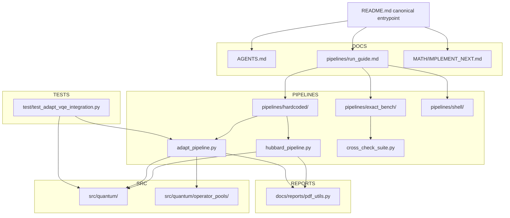
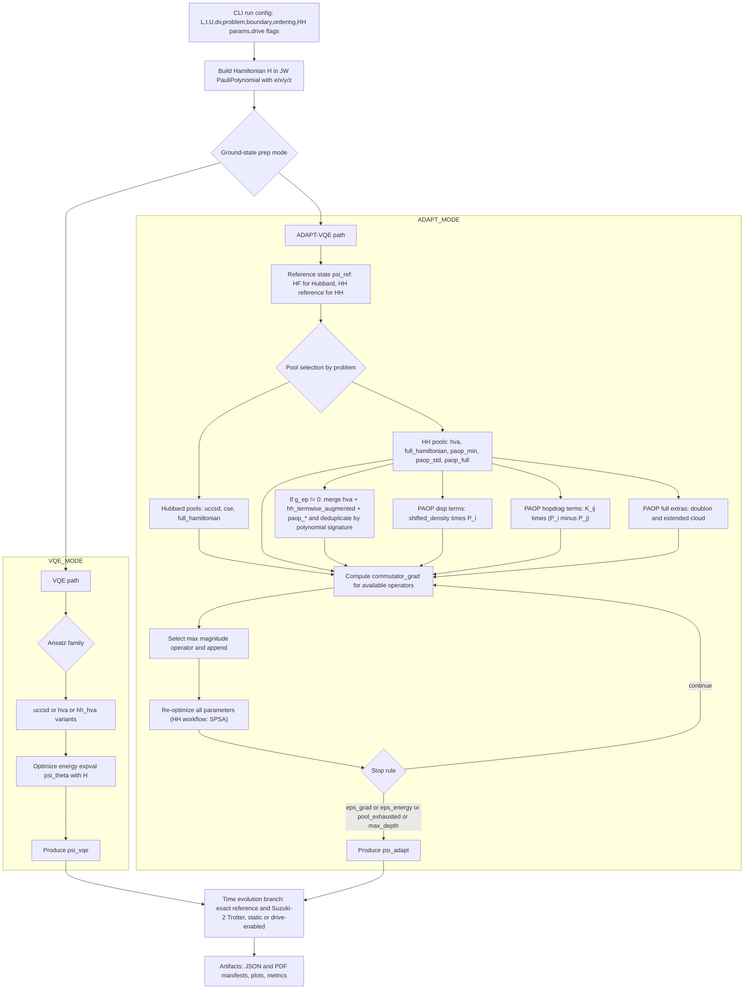

<file_map>
/Users/jakestrobel/Documents/Holstein_implementation/Holstein_test_fullclone_2
├── docs
│   └── reports
│       ├── qiskit_circuit_report.py * +
│       ├── __init__.py
│       ├── pdf_utils.py +
│       ├── report_labels.py +
│       └── report_pages.py +
├── pipelines
│   ├── exact_bench
│   │   ├── benchmark_metrics_proxy.py * +
│   │   ├── cross_check_suite.py * +
│   │   ├── README.md
│   │   ├── hh_fixed_handoff_replay_optimizer_probe.py +
│   │   ├── hh_fixed_handoff_replay_optimizer_probe_workflow.py +
│   │   ├── hh_full_pool_expressivity_probe.py +
│   │   ├── hh_full_pool_expressivity_probe_workflow.py +
│   │   ├── hh_l2_heavy_prune.py +
│   │   ├── hh_l2_heavy_prune_workflow.py +
│   │   ├── hh_l2_logical_screen.py +
│   │   ├── hh_l2_logical_screen_workflow.py +
│   │   ├── hh_l2_stage_unit_audit.py +
│   │   ├── hh_l2_stage_unit_audit_workflow.py +
│   │   ├── hh_noise_hardware_validation.py +
│   │   ├── hh_noise_robustness_seq_report.py +
│   │   ├── hh_seq_transition_utils.py +
│   │   ├── noise_aer_builders.py +
│   │   ├── noise_model_spec.py +
│   │   ├── noise_oracle_runtime.py +
│   │   ├── noise_patch_selection.py +
│   │   ├── noise_snapshot.py +
│   │   └── statevector_kernels.py +
│   ├── hardcoded
│   │   ├── adapt_pipeline.py * +
│   │   ├── handoff_state_bundle.py * +
│   │   ├── hh_staged_cli_args.py * +
│   │   ├── hh_staged_workflow.py * +
│   │   ├── hh_vqe_from_adapt_family.py * +
│   │   ├── hubbard_pipeline.py * +
│   │   ├── hh_continuation_generators.py +
│   │   ├── hh_continuation_motifs.py +
│   │   ├── hh_continuation_pruning.py +
│   │   ├── hh_continuation_replay.py +
│   │   ├── hh_continuation_rescue.py +
│   │   ├── hh_continuation_scoring.py +
│   │   ├── hh_continuation_stage_control.py +
│   │   ├── hh_continuation_symmetry.py +
│   │   ├── hh_continuation_types.py +
│   │   ├── hh_staged_circuit_report.py +
│   │   ├── hh_staged_noise.py +
│   │   ├── hh_staged_noise_workflow.py +
│   │   ├── hh_staged_noiseless.py +
│   │   └── qpe_qiskit_shim.py +
│   ├── shell
│   │   ├── build_hh_noise_robustness_report.sh
│   │   └── run_drive_accurate.sh
│   └── run_guide.md *
├── src
│   ├── quantum
│   │   ├── operator_pools
│   │   │   ├── polaron_paop.py * +
│   │   │   ├── vlf_sq.py * +
│   │   │   └── __init__.py +
│   │   ├── time_propagation
│   │   │   ├── __init__.py +
│   │   │   ├── cfqm_propagator.py +
│   │   │   └── cfqm_schemes.py +
│   │   ├── vqe_latex_python_pairs.py * +
│   │   ├── __init__.py
│   │   ├── compiled_ansatz.py +
│   │   ├── compiled_polynomial.py +
│   │   ├── drives_time_potential.py +
│   │   ├── ed_hubbard_holstein.py +
│   │   ├── hartree_fock_reference_state.py +
│   │   ├── hubbard_latex_python_pairs.py +
│   │   ├── pauli_actions.py +
│   │   ├── pauli_letters_module.py +
│   │   ├── pauli_polynomial_class.py +
│   │   ├── pauli_words.py +
│   │   ├── qubitization_module.py +
│   │   └── spsa_optimizer.py +
│   └── __init__.py +
├── test
│   ├── test_adapt_vqe_integration.py * +
│   ├── test_hh_adapt_family_replay.py * +
│   ├── test_hh_staged_noiseless_workflow.py * +
│   ├── test_hubbard_adapt_ref_source.py * +
│   ├── test_polaron_paop.py * +
│   ├── test_vlf_sq_pool.py * +
│   ├── conftest.py +
│   ├── test_benchmark_metrics_proxy.py +
│   ├── test_cfqm_acceptance.py +
│   ├── test_cfqm_propagator.py +
│   ├── test_cfqm_schemes.py +
│   ├── test_compiled_ansatz.py +
│   ├── test_compiled_polynomial.py +
│   ├── test_cross_check_suite_cli.py +
│   ├── test_ed_crosscheck.py +
│   ├── test_exact_steps_multiplier.py +
│   ├── test_hardcoded_qpe_isolation.py +
│   ├── test_hh_continuation_generators.py +
│   ├── test_hh_continuation_motifs.py +
│   ├── test_hh_continuation_pruning.py +
│   ├── test_hh_continuation_replay.py +
│   ├── test_hh_continuation_rescue.py +
│   ├── test_hh_continuation_scoring.py +
│   ├── test_hh_continuation_stage_control.py +
│   ├── test_hh_continuation_symmetry.py +
│   ├── test_hh_fixed_handoff_replay_optimizer_probe_workflow.py +
│   ├── test_hh_full_pool_expressivity_probe_workflow.py +
│   ├── test_hh_l2_heavy_prune_workflow.py +
│   ├── test_hh_l2_logical_screen_workflow.py +
│   ├── test_hh_l2_stage_unit_audit_workflow.py +
│   ├── test_hh_noise_hardware_validation.py +
│   ├── test_hh_noise_model_spec.py +
│   ├── test_hh_noise_oracle_runtime.py +
│   ├── test_hh_noise_patch_selection.py +
│   ├── test_hh_noise_robustness_benchmarks.py +
│   ├── test_hh_noise_statevector_kernels.py +
│   ├── test_hh_noise_validation_cli.py +
│   ├── test_hh_staged_circuit_report.py +
│   ├── test_hh_staged_noise_workflow.py +
│   ├── test_hh_vqe_from_adapt_family_seed.py +
│   ├── test_report_layers.py +
│   ├── test_spsa_optimizer.py +
│   ├── test_staged_export_replay_roundtrip.py +
│   ├── test_time_potential_drive.py +
│   ├── test_trotter_hh_integration.py +
│   └── test_vqe_energy_backend.py +
├── .obsidian
│   ├── app.json
│   ├── appearance.json
│   ├── core-plugins.json
│   └── workspace.json
├── HH
│   ├── .obsidian
│   │   ├── app.json
│   │   ├── appearance.json
│   │   ├── core-plugins.json
│   │   └── workspace.json
│   ├── Untitled.md
│   └── artifacts 1.md
├── MATH
│   ├── IMPLEMENT_NEXT.md
│   ├── IMPLEMENT_SOON.md
│   ├── Math.md
│   └── Math.pdf
├── artifacts 1
│   ├── json
│   │   ├── noise_l2_pdf
│   │   │   ├── basic.json
│   │   │   ├── ideal_control.json
│   │   │   ├── ideal_control_compiled.json
│   │   │   ├── ideal_control_compiled_spsa.json
│   │   │   ├── ideal_control_ptw_spsa.json
│   │   │   ├── scheduled.json
│   │   │   └── shots.json
│   │   ├── noise_l2_test
│   │   │   ├── basic.json
│   │   │   ├── scheduled.json
│   │   │   └── shots.json
│   │   ├── 20260309_knee_layerwise_warm_hh_hva.json
│   │   ├── 20260309_knee_layerwise_warm_hh_hva_adapt_handoff.json
│   │   ├── 20260309_knee_layerwise_warm_hh_hva_replay.csv
│   │   ├── 20260309_knee_layerwise_warm_hh_hva_replay.json
│   │   ├── 20260309_knee_ptw_warm_hh_hva_ptw.json
│   │   ├── 20260309_knee_ptw_warm_hh_hva_ptw_adapt_handoff.json
│   │   ├── 20260309_knee_ptw_warm_hh_hva_ptw_replay.csv
│   │   ├── 20260309_knee_ptw_warm_hh_hva_ptw_replay.json
│   │   ├── 20260309_plateau_v3_knee_layerwise.json
│   │   ├── 20260309_plateau_v3_knee_layerwise_adapt_handoff.json
│   │   ├── 20260309_plateau_v3_knee_layerwise_replay.csv
│   │   ├── 20260309_plateau_v3_knee_layerwise_replay.json
│   │   ├── 20260309_plateau_v3_knee_ptw.json
│   │   ├── 20260309_plateau_v3_knee_ptw_adapt_handoff.json
│   │   ├── 20260309_plateau_v3_knee_ptw_replay.csv
│   │   ├── 20260309_plateau_v3_knee_ptw_replay.json
│   │   ├── 20260309_plateau_v3_strong_layerwise.json
│   │   ├── 20260309_plateau_v3_strong_layerwise_adapt_handoff.json
│   │   ├── 20260309_plateau_v3_strong_layerwise_replay.csv
│   │   ├── 20260309_plateau_v3_strong_layerwise_replay.json
│   │   ├── 20260309_plateau_v3_strong_ptw.json
│   │   ├── 20260309_plateau_v3_strong_ptw_adapt_handoff.json
│   │   ├── 20260309_plateau_v3_strong_ptw_replay.csv
│   │   ├── 20260309_plateau_v3_strong_ptw_replay.json
│   │   ├── 20260309_plateau_v3_weak_layerwise.json
│   │   ├── 20260309_plateau_v3_weak_layerwise_adapt_handoff.json
│   │   ├── 20260309_plateau_v3_weak_layerwise_replay.csv
│   │   ├── 20260309_plateau_v3_weak_layerwise_replay.json
│   │   ├── 20260309_plateau_v3_weak_ptw.json
│   │   ├── 20260309_plateau_v3_weak_ptw_adapt_handoff.json
│   │   ├── 20260309_plateau_v3_weak_ptw_replay.csv
│   │   ├── 20260309_plateau_v3_weak_ptw_replay.json
│   │   ├── 20260309_strong_layerwise_warm_hh_hva.json
│   │   ├── 20260309_strong_layerwise_warm_hh_hva_adapt_handoff.json
│   │   ├── 20260309_strong_layerwise_warm_hh_hva_replay.csv
│   │   ├── 20260309_strong_layerwise_warm_hh_hva_replay.json
│   │   ├── 20260309_strong_ptw_warm_hh_hva_ptw.json
│   │   ├── 20260309_strong_ptw_warm_hh_hva_ptw_adapt_handoff.json
│   │   ├── 20260309_strong_ptw_warm_hh_hva_ptw_replay.csv
│   │   ├── 20260309_strong_ptw_warm_hh_hva_ptw_replay.json
│   │   ├── 20260309_weak_layerwise_warm_hh_hva.json
│   │   ├── 20260309_weak_layerwise_warm_hh_hva_adapt_handoff.json
│   │   ├── 20260309_weak_layerwise_warm_hh_hva_replay.csv
│   │   ├── 20260309_weak_layerwise_warm_hh_hva_replay.json
│   │   ├── 20260309_weak_ptw_warm_hh_hva_ptw.json
│   │   ├── 20260309_weak_ptw_warm_hh_hva_ptw_adapt_handoff.json
│   │   ├── 20260309_weak_ptw_warm_hh_hva_ptw_replay.csv
│   │   ├── 20260309_weak_ptw_warm_hh_hva_ptw_replay.json
│   │   ├── L3_hh_drive_nph2_heavy_cutover_03268371471231371_adapt_handoff.json
│   │   ├── L3_hh_drive_nph2_heavy_cutover_03268371471231371_warm_checkpoint_state.json
│   │   ├── L3_hh_drive_nph2_heavy_cutover_03268371471231371_warm_cutover_state.json
│   │   ├── cfqm4_hh_L2_driveA1.0_U4_nph1_t10.json
│   │   ├── cfqm4_vs_suzuki2_hh_L2_hwmatch.json
│   │   ├── hh_noise_validation_L2_hh_hva_ptw_noiseless_ideal.json
│   │   ├── hh_staged_L2_drive_ptw_spsa_heavy_d120.json
│   │   ├── hh_staged_L2_drive_ptw_spsa_heavy_d120_adapt_handoff.json
│   │   ├── hh_staged_L2_drive_ptw_spsa_heavy_d120_replay.csv
│   │   ├── hh_staged_L2_drive_ptw_spsa_heavy_d120_replay.json
│   │   ├── hh_staged_L2_drive_t1_U2_dv0_w1_g1_nph1_warmhh_hva_ptw_b3d876db0d_adapt_handoff.json
│   │   ├── hh_staged_L2_drive_t1_U2_dv0_w1_g1_nph1_warmhh_hva_ptw_b3d876db0d_warm_checkpoint_state.json
│   │   ├── hh_staged_L2_drive_t1_U2_dv0_w1_g1_nph1_warmhh_hva_ptw_b3d876db0d_warm_cutover_state.json
│   │   ├── hh_staged_L2_static_t1_U2_dv0_w1_g1_nph1_warmhh_hva_ptw_a56ab6fb09_adapt_handoff.json
│   │   ├── hh_staged_L2_static_t1_U2_dv0_w1_g1_nph1_warmhh_hva_ptw_a56ab6fb09_replay.csv
│   │   ├── hh_staged_L2_static_t1_U2_dv0_w1_g1_nph1_warmhh_hva_ptw_a56ab6fb09_replay.json
│   │   ├── hh_staged_L3_static_t1_U2_dv0_w1_g1_nph1_warmhh_hva_ptw_9afb5d05d5_adapt_handoff.json
│   │   ├── hh_staged_L3_static_t1_U2_dv0_w1_g1_nph1_warmhh_hva_ptw_9afb5d05d5_replay.csv
│   │   ├── hh_staged_L3_static_t1_U2_dv0_w1_g1_nph1_warmhh_hva_ptw_9afb5d05d5_replay.json
│   │   ├── hh_staged_circuit_L2_plateau_v3_weak_ptw_L2_adapt_handoff.json
│   │   ├── hh_staged_circuit_L2_plateau_v3_weak_ptw_L2_replay.csv
│   │   ├── hh_staged_circuit_L2_plateau_v3_weak_ptw_L2_replay.json
│   │   ├── hh_staged_circuit_L2_reasonable_L2_adapt_handoff.json
│   │   ├── hh_staged_circuit_L2_reasonable_L2_replay.csv
│   │   ├── hh_staged_circuit_L2_reasonable_L2_replay.json
│   │   ├── hh_staged_circuit_smoke_legacy_L2_adapt_handoff.json
│   │   ├── hh_staged_circuit_smoke_legacy_nohhseed_L2_adapt_handoff.json
│   │   ├── hh_staged_circuit_smoke_legacy_nohhseed_L2_replay.csv
│   │   ├── hh_staged_circuit_smoke_legacy_nohhseed_L2_replay.json
│   │   ├── hh_staged_circuit_smoke_legacy_nohhseed_L3_adapt_handoff.json
│   │   ├── hh_staged_circuit_smoke_legacy_nohhseed_L3_replay.csv
│   │   ├── hh_staged_circuit_smoke_legacy_nohhseed_L3_replay.json
│   │   ├── hh_staged_circuit_smoke_noprune_L2_adapt_handoff.json
│   │   ├── l2_first_noise_anchor_adapt_handoff.json
│   │   ├── l2_first_noise_anchor_replay.csv
│   │   ├── l2_first_noise_anchor_replay.json
│   │   ├── l2_first_noise_anchor_snapshot.json
│   │   ├── l2_first_noise_anchor_warm_checkpoint_state.json
│   │   ├── l2_first_noise_anchor_warm_cutover_state.json
│   │   ├── l2_first_noise_backend_scheduled.json
│   │   ├── l2_first_noise_generic6_adapt_handoff.json
│   │   ├── l2_first_noise_generic6_backend_scheduled.json
│   │   ├── l2_first_noise_generic6_replay.csv
│   │   ├── l2_first_noise_generic6_replay.json
│   │   ├── l2_first_noise_generic6_snapshot.json
│   │   ├── l2_first_noise_generic6_warm_checkpoint_state.json
│   │   ├── l2_first_noise_generic6_warm_cutover_state.json
│   │   ├── l2_first_noise_jakarta_adapt_handoff.json
│   │   ├── l2_first_noise_jakarta_backend_scheduled.json
│   │   └── l2_first_noise_jakarta_replay.csv
│   ├── logs
│   │   ├── L3_hh_drive_nph2_heavy_cutover_03268371471231371.log.pre_resume_20260310T173403Z
│   │   └── L3_hh_drive_nph2_heavy_cutover_03268371471231371.stdout.log.pre_resume_20260310T173403Z
│   ├── pdf
│   │   ├── noise_l2_pdf
│   │   │   ├── basic.pdf
│   │   │   ├── scheduled.pdf
│   │   │   └── shots.pdf
│   │   ├── cfqm4_hh_L2_driveA1.0_U4_nph1_t10.pdf
│   │   ├── cfqm4_vs_suzuki2_hh_L2_hwmatch.pdf
│   │   ├── hh_staged_L2_drive_ptw_spsa_heavy_d120.pdf
│   │   ├── hh_staged_circuit_report_L2_L3.pdf
│   │   ├── hh_staged_circuit_report_L2_L3_smoke.pdf
│   │   ├── hh_staged_circuit_report_L2_plateau_v3_weak_ptw.pdf
│   │   ├── hh_staged_circuit_report_L2_reasonable.pdf
│   │   ├── suzuki2_hh_L2_driveA1.0_U4_nph1_t10_trotter128.pdf
│   │   └── suzuki2_hh_L2_driveA1.0_U4_nph1_t10_trotter64.pdf
│   ├── useful
│   │   ├── L2
│   │   │   ├── 20260309_knee_layerwise_warm_hh_hva_replay.md
│   │   │   ├── 20260309_knee_ptw_warm_hh_hva_ptw_replay.md
│   │   │   ├── 20260309_plateau_v3_knee_layerwise_replay.md
│   │   │   ├── 20260309_plateau_v3_knee_ptw_replay.md
│   │   │   ├── 20260309_plateau_v3_strong_layerwise_replay.md
│   │   │   ├── 20260309_plateau_v3_strong_ptw_replay.md
│   │   │   ├── 20260309_plateau_v3_summary.md
│   │   │   ├── 20260309_plateau_v3_weak_layerwise_replay.md
│   │   │   ├── 20260309_plateau_v3_weak_ptw_replay.md
│   │   │   ├── 20260309_strong_layerwise_warm_hh_hva_replay.md
│   │   │   ├── 20260309_strong_ptw_warm_hh_hva_ptw_replay.md
│   │   │   ├── 20260309_weak_layerwise_warm_hh_hva_replay.md
│   │   │   ├── 20260309_weak_ptw_warm_hh_hva_ptw_replay.md
│   │   │   ├── hh_staged_L2_drive_ptw_spsa_heavy_d120_replay.md
│   │   │   ├── hh_staged_L2_static_t1_U2_dv0_w1_g1_nph1_warmhh_hva_ptw_a56ab6fb09_replay.md
│   │   │   ├── hh_staged_circuit_L2_plateau_v3_weak_ptw_L2_replay.md
│   │   │   ├── hh_staged_circuit_L2_reasonable_L2_replay.md
│   │   │   ├── hh_staged_circuit_smoke_legacy_nohhseed_L2_replay.md
│   │   │   ├── l2_first_noise_anchor_replay.md
│   │   │   ├── l2_first_noise_generic6_replay.md
│   │   │   ├── l2_first_noise_jakarta_replay.md
│   │   │   ├── l2_first_noise_jakarta_s2_fast_replay.md
│   │   │   ├── l2_first_noise_jakarta_s2_ok_replay.md
│   │   │   └── l2_first_noise_jakarta_s2_replay.md
│   │   └── L3
│   │       ├── hh_staged_L3_static_t1_U2_dv0_w1_g1_nph1_warmhh_hva_ptw_9afb5d05d5_replay.md
│   │       └── hh_staged_circuit_smoke_legacy_nohhseed_L3_replay.md
│   ├── user_runs
│   │   └── 20260309_hh_l2_noiseless
│   │       └── json
│   │           ├── raw_ptw_g0.5_nph1.json
│   │           ├── raw_ptw_g1.0_nph1.json
│   │           ├── raw_ptw_g1.0_nph2.json
│   │           ├── raw_ptw_g1.25_nph1.json
│   │           ├── raw_ptw_g1.25_nph2.json
│   │           ├── raw_ptw_g1.5_nph1.json
│   │           └── raw_ptw_g1.5_nph2.json
│   └── hh_noise_validation_L2_hh_hva_ptw_run_summary.md
├── prompt-exports
│   ├── 2026-03-12-2315-plan-hh-failure-test-ladder.md
│   ├── 2026-03-12-2359-plan-hh-operator-pool-expansion.md
│   ├── 2026-03-13-0010-plan-hh-sweep-experiments.md
│   ├── 2026-03-14-0030-question-hh-pareto-problem-definition.md
│   └── 2026-03-14-1502-plan-hh-generator-parallel-experiments.md
├── AGENTS.md *
├── README.md *
├── .gitignore
├── L2_hh_smart_adapt.json
├── L2_hh_smart_replay.csv
├── L2_hh_smart_replay.json
├── L2_hh_smart_replay.md
├── L2_hh_smart_replay_bundle_diagnostic.json
├── L2_hh_smart_results_diagnostic.json
├── L2_hh_smart_results_diagnostic.pdf
├── L2_hh_smart_warm.json
├── activate_ibm_runtime.py +
├── investigation_hh_noise_boundaries.md
├── pareto_flow_chart.md
└── pareto_flow_chart.pdf


(* denotes selected files)
(+ denotes code-map available)

File: /Users/jakestrobel/Documents/Holstein_implementation/Holstein_test_fullclone_2/src/quantum/pauli_polynomial_class.py
Imports:
  - import numpy as np
  - from src.quantum.qubitization_module import PauliTerm
---
Classes:
  - PauliPolynomial
    Methods:
      - L9: def __init__(self, repr_mode, pol=None):
      - L15: def get_nq(self):
      - L21: def return_polynomial(self):
      - L23: def count_number_terms(self):
      - L25: def add_term(self, pt):
      - L28: def _clone_term(pt):
      - L31: def _clone_terms(cls, terms):
      - L33: def __add__(self, pp):
      - L44: def __iadd__(self, pp):
      - L56: def __sub__(self, pp):
      - L68: def __isub__(self, pp):
      - L81: def __mul__(self, pp):
      - L101: def __rmul__(self, other):
      - L111: def __pow__(self, exponent):
      - L124: def _reduce(self):
      - L140: def visualize_polynomial(self):
  - fermion_plus_operator
    Methods:
      - L157: def __init__(self, repr_mode, nq, j):
      - L163: def __set_JW_operator(self, nq, j):
  - fermion_minus_operator
    Methods:
      - L185: def __init__(self, repr_mode, nq, j):
      - L191: def __set_JW_operator(self, nq, j):
---


File: /Users/jakestrobel/Documents/Holstein_implementation/Holstein_test_fullclone_2/src/quantum/compiled_ansatz.py
Imports:
  - from dataclasses import dataclass
  - from typing import TYPE_CHECKING, Any, Sequence
  - import numpy as np
  - from src.quantum.pauli_actions import (
    CompiledPauliAction,
    apply_exp_term,
    compile_pauli_action_exyz,
)
  - from src.quantum.vqe_latex_python_pairs import AnsatzTerm
---
Classes:
  - CompiledRotationStep
    Properties:
      - coeff_real
      - action
  - CompiledPolynomialRotationPlan
    Properties:
      - nq
      - steps
  - CompiledAnsatzExecutor
    Methods:
      - L44: def __init__(
        self,
        terms: Sequence["AnsatzTerm"],
        *,
        coefficient_tolerance: float = 1e-12,
        ignore_identity: bool = True,
        sort_terms: bool = True,
        pauli_action_cache: dict[str, CompiledPauliAction] | None = None,
    ):
      - L80: def _compile_polynomial_plan(self, poly: Any) -> CompiledPolynomialRotationPlan:
      - L122: def prepare_state(self, theta: np.ndarray, psi_ref: np.ndarray) -> np.ndarray:
    Properties:
      - _MATH_INIT
      - _MATH_COMPILE_POLYNOMIAL_PLAN
      - _MATH_PREPARE_STATE

Global vars:
  - __all__
---


File: /Users/jakestrobel/Documents/Holstein_implementation/Holstein_test_fullclone_2/src/quantum/pauli_actions.py
Imports:
  - import math
  - from dataclasses import dataclass
  - import numpy as np
---
Classes:
  - CompiledPauliAction
    Properties:
      - label_exyz
      - perm
      - phase

Functions:
  - L27: def compile_pauli_action_exyz(label_exyz: str, nq: int) -> CompiledPauliAction:
  - L59: def apply_compiled_pauli(psi: np.ndarray, action: CompiledPauliAction) -> np.ndarray:
  - L66: def apply_exp_term(
    psi: np.ndarray,
    action: CompiledPauliAction,
    coeff: complex,
    dt: float,
    tol: float = 1e-12,
) -> np.ndarray:

Global vars:
  - __all__
---


File: /Users/jakestrobel/Documents/Holstein_implementation/Holstein_test_fullclone_2/src/quantum/compiled_polynomial.py
Imports:
  - from dataclasses import dataclass
  - import numpy as np
  - from src.quantum.pauli_actions import (
    CompiledPauliAction,
    apply_compiled_pauli,
    compile_pauli_action_exyz,
)
  - from src.quantum.pauli_polynomial_class import PauliPolynomial
---
Classes:
  - CompiledPolynomialTerm
    Properties:
      - coeff
      - action
  - CompiledPolynomialAction
    Properties:
      - nq
      - terms

Functions:
  - L40: def compile_polynomial_action(
    poly: PauliPolynomial,
    *,
    tol: float = 1e-15,
    pauli_action_cache: dict[str, CompiledPauliAction] | None = None,
) -> CompiledPolynomialAction:
  - L85: def apply_compiled_polynomial(psi: np.ndarray, compiled: CompiledPolynomialAction) -> np.ndarray:
  - L106: def energy_via_one_apply(
    psi: np.ndarray, compiled_h: CompiledPolynomialAction,
) -> tuple[float, np.ndarray]:
  - L119: def adapt_commutator_grad_from_hpsi(Hpsi: np.ndarray, Apsi: np.ndarray) -> float:

Global vars:
  - _MATH_COMPILE_POLYNOMIAL_ACTION
  - _MATH_APPLY_COMPILED_POLYNOMIAL
  - _MATH_ENERGY_VIA_ONE_APPLY
  - _MATH_ADAPT_COMMUTATOR_GRAD
  - __all__
---

</file_map>
<file_contents>
File: /Users/jakestrobel/Documents/Holstein_implementation/Holstein_test_fullclone_2/test/test_hh_adapt_family_replay.py
```py
from __future__ import annotations

from pathlib import Path
import json
import sys

import numpy as np
import pytest

REPO_ROOT = Path(__file__).resolve().parent.parent
if str(REPO_ROOT) not in sys.path:
    sys.path.insert(0, str(REPO_ROOT))

import pipelines.hardcoded.hh_vqe_from_adapt_family as replay_mod
from pipelines.hardcoded.hh_vqe_from_adapt_family import (
    RunConfig,
    _build_cfg,
    _build_pool_for_family,
    _resolve_family,
    _resolve_family_from_metadata,
    build_replay_ansatz_context,
    parse_args,
)


def _mk_cfg(tmp_path: Path, *, generator_family: str = "match_adapt", fallback_family: str = "full_meta") -> RunConfig:
    return RunConfig(
        adapt_input_json=tmp_path / "in.json",
        output_json=tmp_path / "out.json",
        output_csv=tmp_path / "out.csv",
        output_md=tmp_path / "out.md",
        output_log=tmp_path / "out.log",
        tag="test",
        generator_family=generator_family,
        fallback_family=fallback_family,
        legacy_paop_key="paop_lf_std",
        replay_seed_policy="auto",
        replay_continuation_mode="legacy",
        L=2,
        t=1.0,
        u=4.0,
        dv=0.0,
        omega0=1.0,
        g_ep=0.5,
        n_ph_max=1,
        boson_encoding="binary",
        ordering="blocked",
        boundary="open",
        sector_n_up=1,
        sector_n_dn=1,
        reps=2,
        restarts=2,
        maxiter=20,
        method="SPSA",
        seed=7,
        energy_backend="one_apply_compiled",
        progress_every_s=60.0,
        wallclock_cap_s=600,
        paop_r=1,
        paop_split_paulis=False,
        paop_prune_eps=0.0,
        paop_normalization="none",
        spsa_a=0.2,
        spsa_c=0.1,
        spsa_alpha=0.602,
        spsa_gamma=0.101,
        spsa_A=10.0,
        spsa_avg_last=0,
        spsa_eval_repeats=1,
        spsa_eval_agg="mean",
        replay_freeze_fraction=0.2,
        replay_unfreeze_fraction=0.3,
        replay_full_fraction=0.5,
        replay_qn_spsa_refresh_every=5,
        replay_qn_spsa_refresh_mode="diag_rms_grad",
        phase3_symmetry_mitigation_mode="off",
    )


def test_parse_defaults_match_adapt_and_spsa() -> None:
    args = parse_args(["--adapt-input-json", "dummy.json"])
    assert str(args.generator_family) == "match_adapt"
    assert str(args.fallback_family) == "full_meta"
    assert str(args.method) == "SPSA"
    assert args.replay_continuation_mode is None


def test_parse_rejects_non_spsa_method() -> None:
    with pytest.raises(SystemExit):
        parse_args(["--adapt-input-json", "dummy.json", "--method", "COBYLA"])


def test_build_cfg_keeps_replay_continuation_mode_none(tmp_path: Path) -> None:
    payload = {
        "settings": {
            "L": 2,
            "t": 1.0,
            "U": 4.0,
            "dv": 0.0,
            "omega0": 1.0,
            "g_ep": 0.5,
            "n_ph_max": 1,
            "boson_encoding": "binary",
            "ordering": "blocked",
            "boundary": "open",
            "sector_n_up": 1,
            "sector_n_dn": 1,
        }
    }
    in_json = tmp_path / "adapt_contract_replay_mode.json"
    in_json.write_text(json.dumps(payload), encoding="utf-8")
    payload = json.loads(in_json.read_text(encoding="utf-8"))
    args = parse_args(["--adapt-input-json", str(in_json)])
    cfg = _build_cfg(args, payload)
    assert cfg.replay_continuation_mode is None


def test_parse_rejects_auto_replay_continuation_mode() -> None:
    with pytest.raises(SystemExit):
        parse_args(["--adapt-input-json", "dummy.json", "--replay-continuation-mode", "auto"])


def test_parse_accepts_phase2_replay_continuation_mode() -> None:
    args = parse_args(["--adapt-input-json", "dummy.json", "--replay-continuation-mode", "phase2_v1"])
    assert str(args.replay_continuation_mode) == "phase2_v1"


def test_parse_accepts_phase3_replay_continuation_mode() -> None:
    args = parse_args(["--adapt-input-json", "dummy.json", "--replay-continuation-mode", "phase3_v1"])
    assert str(args.replay_continuation_mode) == "phase3_v1"


def test_resolve_family_prefers_adapt_vqe_pool_type() -> None:
    fam, src = _resolve_family_from_metadata({"adapt_vqe": {"pool_type": "full_meta"}})
    assert fam == "full_meta"
    assert src == "adapt_vqe.pool_type"


def test_resolve_family_uses_settings_adapt_pool() -> None:
    fam, src = _resolve_family_from_metadata({"settings": {"adapt_pool": "uccsd_paop_lf_full"}})
    assert fam == "uccsd_paop_lf_full"
    assert src == "settings.adapt_pool"


def test_resolve_family_accepts_new_experimental_paop_tokens() -> None:
    for token in (
        "all_hh_meta_v1",
        "paop_lf3_std",
        "paop_lf4_std",
        "paop_sq_std",
        "paop_sq_full",
        "paop_bond_disp_std",
        "paop_hop_sq_std",
        "paop_pair_sq_std",
    ):
        fam, src = _resolve_family_from_metadata({"adapt_vqe": {"pool_type": token}})
        assert fam == token
        assert src == "adapt_vqe.pool_type"


def test_resolve_family_accepts_new_vlf_sq_tokens() -> None:
    for token in ("vlf_only", "sq_only", "vlf_sq", "sq_dens_only", "vlf_sq_dens"):
        fam, src = _resolve_family_from_metadata({"adapt_vqe": {"pool_type": token}})
        assert fam == token
        assert src == "adapt_vqe.pool_type"


def test_build_pool_for_family_materializes_all_hh_meta_v1(
    tmp_path: Path,
    monkeypatch: pytest.MonkeyPatch,
) -> None:
    cfg = _mk_cfg(tmp_path)
    monkeypatch.setattr(
        replay_mod,
        "_build_hh_all_meta_v1_pool",
        lambda **kwargs: ([type("_T", (), {"label": "all_hh_meta_v1:term"})()], {"raw_total": 17}),
    )
    pool, meta = _build_pool_for_family(cfg, family="all_hh_meta_v1", h_poly=object())
    assert len(pool) == 1
    assert meta["family"] == "all_hh_meta_v1"
    assert meta["raw_sizes"]["raw_total"] == 17


def test_build_pool_for_family_materializes_new_paop_tokens(
    tmp_path: Path,
    monkeypatch: pytest.MonkeyPatch,
) -> None:
    cfg = _mk_cfg(tmp_path)
    monkeypatch.setattr(
        replay_mod,
        "_build_paop_pool",
        lambda *args, **kwargs: [type("_T", (), {"label": f"{kwargs.get('pool_key', args[5])}:term"})()],
    )
    for token in (
        "paop_lf3_std",
        "paop_lf4_std",
        "paop_sq_std",
        "paop_sq_full",
        "paop_bond_disp_std",
        "paop_hop_sq_std",
        "paop_pair_sq_std",
    ):
        pool, meta = _build_pool_for_family(cfg, family=token, h_poly=object())
        assert len(pool) == 1
        assert meta["family"] == token


def test_build_pool_for_family_materializes_new_vlf_sq_tokens(
    tmp_path: Path,
    monkeypatch: pytest.MonkeyPatch,
) -> None:
    cfg = _mk_cfg(tmp_path)
    monkeypatch.setattr(
        replay_mod,
        "_build_vlf_sq_pool",
        lambda *args, **kwargs: (
            [type("_T", (), {"label": f"{kwargs.get('pool_key', args[5])}:macro"})()],
            {"family": kwargs.get('pool_key', args[5]), "parameter_count": 1},
        ),
    )
    for token in ("vlf_only", "sq_only", "vlf_sq", "sq_dens_only", "vlf_sq_dens"):
        pool, meta = _build_pool_for_family(cfg, family=token, h_poly=object())
        assert len(pool) == 1
        assert meta["family"] == token
        assert meta["family_kind"] == "macro_probe"


def test_build_pool_for_family_rejects_split_paulis_for_vlf_sq(
    tmp_path: Path,
) -> None:
    cfg = _mk_cfg(tmp_path)
    cfg = cfg.__class__(**{**cfg.__dict__, "paop_split_paulis": True})
    with pytest.raises(ValueError, match="do not support --paop-split-paulis"):
        _build_pool_for_family(cfg, family="vlf_sq", h_poly=object())


def test_full_meta_replay_terms_accept_mixed_termwise_and_paop_std_labels(tmp_path: Path) -> None:
    cfg = _mk_cfg(tmp_path)
    h_poly = replay_mod._build_hh_hamiltonian(cfg)
    termwise_pool = replay_mod._build_hh_termwise_augmented_pool(h_poly)
    paop_pool = replay_mod._build_paop_pool(
        int(cfg.L),
        int(cfg.n_ph_max),
        str(cfg.boson_encoding),
        str(cfg.ordering),
        str(cfg.boundary),
        "paop_lf_std",
        int(cfg.paop_r),
        bool(cfg.paop_split_paulis),
        float(cfg.paop_prune_eps),
        str(cfg.paop_normalization),
        (int(cfg.sector_n_up), int(cfg.sector_n_dn)),
    )
    assert termwise_pool
    assert paop_pool

    replay_labels = [
        f"hh_termwise_{termwise_pool[0].label}",
        str(paop_pool[0].label),
    ]
    replay_terms, meta, family_terms_count = replay_mod._build_replay_terms_for_family(
        cfg,
        family="full_meta",
        h_poly=h_poly,
        adapt_labels=replay_labels,
        payload={},
    )

    assert [str(term.label) for term in replay_terms] == replay_labels
    assert meta["family"] == "full_meta"
    assert "paop_lf_std" in meta["supplemental_families"]
    assert int(family_terms_count) >= len(replay_terms)


def test_resolve_family_uses_nested_selected_generator_metadata() -> None:
    fam, src = _resolve_family_from_metadata(
        {
            "adapt_vqe": {
                "pool_type": "phase3_v1",
                "continuation": {
                    "selected_generator_metadata": [
                        {"family_id": "paop_lf_std"},
                        {"family_id": "paop_lf_std"},
                    ]
                },
            }
        }
    )
    assert fam == "paop_lf_std"
    assert src == "adapt_vqe.continuation.selected_generator_metadata.family_id"


def test_resolve_family_maps_legacy_pool_variant() -> None:
    fam, src = _resolve_family_from_metadata({"meta": {"pool_variant": "B"}})
    assert fam == "pool_b"
    assert src == "meta.pool_variant"


def test_resolve_family_match_adapt_prefers_contract_and_falls_back_when_missing(tmp_path: Path) -> None:
    cfg = _mk_cfg(tmp_path, generator_family="match_adapt", fallback_family="full_meta")
    info = _resolve_family(
        cfg,
        {
            "continuation": {
                "replay_contract": {
                    "contract_version": 2,
                    "generator_family": {
                        "requested": "match_adapt",
                        "resolved": "paop_lf_std",
                        "resolution_source": "selected_generator_metadata.family_id",
                        "fallback_family": "full_meta",
                        "fallback_used": False,
                    },
                    "seed_policy_requested": "auto",
                    "seed_policy_resolved": "residual_only",
                    "handoff_state_kind": "prepared_state",
                    "continuation_mode": "phase1_v1",
                }
            }
        }
    )
    assert info["requested"] == "match_adapt"
    assert info["resolved"] == "paop_lf_std"
    assert info["resolution_source"] == "selected_generator_metadata.family_id"
    assert info["fallback_used"] is False


def test_resolve_family_match_adapt_falls_back_when_missing(tmp_path: Path) -> None:
    cfg = _mk_cfg(tmp_path, generator_family="match_adapt", fallback_family="full_meta")
    info = _resolve_family(cfg, {})
    assert info["requested"] == "match_adapt"
    assert info["resolved"] == "full_meta"
    assert bool(info["fallback_used"]) is True
    assert info["resolution_source"] == "fallback_family"


def test_resolve_family_rejects_malformed_contract(tmp_path: Path) -> None:
    cfg = _mk_cfg(tmp_path, generator_family="match_adapt", fallback_family="full_meta")
    with pytest.raises(ValueError, match="continuation.replay_contract"):
        _resolve_family(
            cfg,
            {
                "continuation": {
                    "replay_contract": {
                        "contract_version": 2,
                    "generator_family": {
                        "requested": "match_adapt",
                        "resolved": "not_a_family",
                    },
                    "seed_policy_requested": "auto",
                    "seed_policy_resolved": "residual_only",
                    "handoff_state_kind": "prepared_state",
                    "continuation_mode": "legacy",
                }
            }
        }
    )


def test_build_replay_ansatz_context_retries_with_full_meta_on_missing_labels(
    tmp_path: Path,
    monkeypatch: pytest.MonkeyPatch,
) -> None:
    cfg = _mk_cfg(tmp_path, generator_family="match_adapt", fallback_family="full_meta")
    payload = {
        "adapt_vqe": {"operators": ["g0"], "optimal_point": [0.1]},
        "initial_state": {"handoff_state_kind": "prepared_state"},
    }
    family_info = {
        "requested": "match_adapt",
        "resolved": "paop_lf_std",
        "resolution_source": "selected_generator_metadata.family_id",
        "fallback_family": "full_meta",
        "fallback_used": False,
        "warning": None,
    }
    calls: list[str] = []

    class _FakeAnsatz:
        def __init__(self, *, terms: list[object], reps: int, nq: int) -> None:
            self.terms = list(terms)
            self.num_parameters = int(len(terms) * reps)

        def prepare_state(self, theta: np.ndarray, psi_ref: np.ndarray) -> np.ndarray:
            return np.asarray(psi_ref, dtype=complex)

    def _fake_build(
        _cfg: RunConfig,
        *,
        family: str,
        h_poly: object,
        adapt_labels: list[str],
        payload: dict[str, object] | None = None,
    ) -> tuple[list[object], dict[str, object], int]:
        del _cfg, h_poly, adapt_labels, payload
        calls.append(str(family))
        if family == "paop_lf_std":
            raise ValueError(
                "ADAPT operators are not present in the resolved replay family pool. "
                "Missing examples: ['g0']"
            )
        assert family == "full_meta"
        return ["term0"], {"family": "full_meta", "raw_total": 7}, 7

    monkeypatch.setattr(replay_mod, "_build_replay_terms_for_family", _fake_build)
    monkeypatch.setattr(replay_mod, "PoolTermwiseAnsatz", _FakeAnsatz)
    monkeypatch.setattr(
        replay_mod,
        "_build_replay_seed_theta_policy",
        lambda adapt_theta, reps, policy, handoff_state_kind: (np.zeros(int(reps), dtype=float), "residual_only"),
    )
    monkeypatch.setattr(replay_mod, "expval_pauli_polynomial", lambda psi, h_poly: 0.25)

    replay_ctx = build_replay_ansatz_context(
        cfg,
        payload_in=payload,
        psi_ref=np.array([1.0 + 0.0j, 0.0 + 0.0j], dtype=complex),
        h_poly=object(),
        family_info=family_info,
        e_exact=0.2,
    )

    assert calls == ["paop_lf_std", "full_meta"]
    assert replay_ctx["family_resolved"] == "full_meta"
    assert replay_ctx["family_terms_count"] == 7
    assert replay_ctx["pool_meta"]["family"] == "full_meta"
    assert replay_ctx["family_info"]["resolved"] == "full_meta"
    assert replay_ctx["family_info"]["resolution_source"] == "fallback_family_missing_labels"
    assert replay_ctx["family_info"]["fallback_used"] is True
    assert "retrying replay with fallback family 'full_meta'" in str(replay_ctx["family_info"]["warning"])


def test_run_records_effective_family_after_replay_fallback(
    tmp_path: Path,
    monkeypatch: pytest.MonkeyPatch,
) -> None:
    cfg = _mk_cfg(tmp_path, generator_family="match_adapt", fallback_family="full_meta")
    psi_ref = np.array([1.0 + 0.0j, 0.0 + 0.0j], dtype=complex)

    class _FakeAnsatz:
        def __init__(self, *, terms: list[object], reps: int, nq: int) -> None:
            del terms, reps, nq
            self.num_parameters = 2

        def prepare_state(self, theta: np.ndarray, psi_ref_in: np.ndarray) -> np.ndarray:
            del theta
            return np.asarray(psi_ref_in, dtype=complex)

    monkeypatch.setattr(replay_mod, "_read_input_state_and_payload", lambda path: (psi_ref, {}))
    monkeypatch.setattr(
        replay_mod,
        "_resolve_family",
        lambda cfg_in, payload_in: {
            "requested": "match_adapt",
            "resolved": "paop_lf_std",
            "resolution_source": "selected_generator_metadata.family_id",
            "fallback_family": "full_meta",
            "fallback_used": False,
            "warning": None,
        },
    )
    monkeypatch.setattr(replay_mod, "_build_hh_hamiltonian", lambda cfg_in: object())
    monkeypatch.setattr(replay_mod, "_resolve_exact_energy_from_payload", lambda payload_in: 0.0)
    monkeypatch.setattr(
        replay_mod,
        "build_replay_ansatz_context",
        lambda cfg_in, **kwargs: {
            "adapt_labels": ["g0"],
            "adapt_theta": np.array([0.1], dtype=float),
            "handoff_state_kind": "prepared_state",
            "provenance_source": "explicit",
            "seed_theta": np.zeros(2, dtype=float),
            "resolved_seed_policy": "residual_only",
            "family_info": {
                "requested": "match_adapt",
                "resolved": "full_meta",
                "resolution_source": "fallback_family_missing_labels",
                "fallback_family": "full_meta",
                "fallback_used": True,
                "warning": "Resolved replay family could not represent the ADAPT-selected labels; retrying replay with fallback family 'full_meta'.",
            },
            "family_resolved": "full_meta",
            "family_terms_count": 7,
            "pool_meta": {"family": "full_meta", "raw_total": 7},
            "replay_terms": ["term0"],
            "ansatz": _FakeAnsatz(terms=["term0"], reps=2, nq=1),
            "nq": 1,
            "psi_seed": psi_ref.copy(),
            "seed_energy": 0.25,
            "seed_delta_abs": 0.25,
            "seed_relative_abs": 0.25,
        },
    )
    monkeypatch.setattr(
        replay_mod,
        "vqe_minimize",
        lambda *args, **kwargs: type(
            "_Res",
            (),
            {
                "theta": np.zeros(2, dtype=float),
                "energy": 0.1,
                "success": True,
                "message": "ok",
                "nfev": 1,
                "nit": 1,
                "best_restart": 0,
            },
        )(),
    )

    result = replay_mod.run(cfg)
    written = json.loads(cfg.output_json.read_text(encoding="utf-8"))

    assert result["generator_family"]["resolved"] == "full_meta"
    assert result["generator_family"]["fallback_used"] is True
    assert result["replay_contract"]["generator_family"]["resolved"] == "full_meta"
    assert result["replay_contract"]["generator_family"]["resolution_source"] == "fallback_family_missing_labels"
    assert written["generator_family"]["resolved"] == "full_meta"
    assert written["replay_contract"]["generator_family"]["resolved"] == "full_meta"

```

File: /Users/jakestrobel/Documents/Holstein_implementation/Holstein_test_fullclone_2/test/test_vlf_sq_pool.py
```py
from __future__ import annotations

from pathlib import Path
import sys

import numpy as np
import pytest

REPO_ROOT = Path(__file__).resolve().parents[1]
if str(REPO_ROOT) not in sys.path:
    sys.path.insert(0, str(REPO_ROOT))

from pipelines.hardcoded.hh_vqe_from_adapt_family import PoolTermwiseAnsatz
from src.quantum.hartree_fock_reference_state import hubbard_holstein_reference_state
from src.quantum.operator_pools.polaron_paop import _to_signature, make_pool
from src.quantum.operator_pools.vlf_sq import build_vlf_sq_pool
from src.quantum.vqe_latex_python_pairs import AnsatzTerm, hamiltonian_matrix


def _build(name: str, *, n_ph_max: int) -> tuple[list[tuple[str, object]], dict[str, object]]:
    return build_vlf_sq_pool(
        name,
        num_sites=2,
        num_particles=(1, 1),
        n_ph_max=int(n_ph_max),
        boson_encoding="binary",
        ordering="blocked",
        boundary="open",
        shell_radius=1,
        prune_eps=0.0,
        normalization="none",
    )


def test_vlf_only_shell_tying_count_and_labels() -> None:
    pool, meta = _build("vlf_only", n_ph_max=2)
    labels = [label for label, _poly in pool]
    assert meta["shells"] == [0, 1]
    assert meta["parameter_count"] == 2
    assert labels == [
        "vlf_only:vlf_shell(r=0)",
        "vlf_only:vlf_shell(r=1)",
    ]


def test_sq_only_and_vlf_sq_variant_selection_counts() -> None:
    sq_only, sq_meta = _build("sq_only", n_ph_max=2)
    vlf_sq, vlf_sq_meta = _build("vlf_sq", n_ph_max=2)
    dens_only, dens_meta = _build("sq_dens_only", n_ph_max=2)
    assert [label for label, _poly in sq_only] == ["sq_only:sq_global"]
    assert [label for label, _poly in dens_only] == ["sq_dens_only:dens_sq_global"]
    assert [label for label, _poly in vlf_sq] == [
        "vlf_sq:vlf_shell(r=0)",
        "vlf_sq:vlf_shell(r=1)",
        "vlf_sq:sq_global",
    ]
    assert sq_meta["parameter_count"] == 1
    assert dens_meta["density_conditioned_sq"] is True
    assert vlf_sq_meta["parameter_count"] == 3


def test_default_vlf_shell_enumeration_uses_all_shells() -> None:
    pool, meta = build_vlf_sq_pool(
        "vlf_only",
        num_sites=3,
        num_particles=(2, 1),
        n_ph_max=2,
        boson_encoding="binary",
        ordering="blocked",
        boundary="open",
        prune_eps=0.0,
        normalization="none",
    )
    assert meta["shells"] == [0, 1, 2]
    assert [label for label, _poly in pool] == [
        "vlf_only:vlf_shell(r=0)",
        "vlf_only:vlf_shell(r=1)",
        "vlf_only:vlf_shell(r=2)",
    ]


def test_sq_only_matches_sum_of_repo_paop_sq_generators() -> None:
    sq_only, _meta = _build("sq_only", n_ph_max=2)
    sq_only_sig = _to_signature(sq_only[0][1])
    paop_sq_std = make_pool(
        "paop_sq_std",
        num_sites=2,
        num_particles=(1, 1),
        n_ph_max=2,
        boson_encoding="binary",
        ordering="blocked",
        boundary="open",
        paop_r=1,
        paop_split_paulis=False,
        paop_prune_eps=0.0,
        paop_normalization="none",
    )
    sq_sum = None
    for label, poly in paop_sq_std:
        if ":paop_sq(site=" not in label:
            continue
        sq_sum = poly if sq_sum is None else (sq_sum + poly)
    assert sq_sum is not None
    assert sq_only_sig == _to_signature(sq_sum)


def test_vlf_sq_generators_are_hermitian_and_effectively_real() -> None:
    for family in ("vlf_only", "sq_only", "vlf_sq", "sq_dens_only", "vlf_sq_dens"):
        pool, _meta = _build(family, n_ph_max=2)
        for _label, poly in pool:
            for term in poly.return_polynomial():
                coeff = complex(term.p_coeff)
                assert abs(coeff.imag) <= 1e-10
            mat = hamiltonian_matrix(poly)
            assert np.max(np.abs(mat - mat.conj().T)) <= 1e-10


def test_zero_parameter_state_prep_is_identity_for_vlf_sq() -> None:
    pool, _meta = _build("vlf_sq", n_ph_max=2)
    ansatz = PoolTermwiseAnsatz(
        terms=[AnsatzTerm(label=label, polynomial=poly) for label, poly in pool],
        reps=1,
        nq=8,
    )
    psi_ref = np.asarray(
        hubbard_holstein_reference_state(
            dims=2,
            num_particles=(1, 1),
            n_ph_max=2,
            boson_encoding="binary",
            indexing="blocked",
        ),
        dtype=complex,
    ).reshape(-1)
    psi = ansatz.prepare_state(np.zeros(ansatz.num_parameters, dtype=float), psi_ref)
    assert np.allclose(psi, psi_ref)


def test_sq_only_rejects_too_small_cutoff_and_vlf_sq_reduces_to_vlf_only() -> None:
    with pytest.raises(ValueError, match="sq_only produced no surviving squeeze generators"):
        _build("sq_only", n_ph_max=1)
    vlf_only, _ = _build("vlf_only", n_ph_max=1)
    vlf_sq, _ = _build("vlf_sq", n_ph_max=1)
    assert {_to_signature(poly) for _label, poly in vlf_only} == {_to_signature(poly) for _label, poly in vlf_sq}

```

File: /Users/jakestrobel/Documents/Holstein_implementation/Holstein_test_fullclone_2/src/quantum/operator_pools/vlf_sq.py
```py
from __future__ import annotations

from typing import Any

from src.quantum.hubbard_latex_python_pairs import (
    boson_displacement_operator,
    boson_operator,
    boson_qubits_per_site,
    jw_number_operator,
    mode_index,
    phonon_qubit_indices_for_site,
)
from src.quantum.pauli_polynomial_class import PauliPolynomial
from src.quantum.qubitization_module import PauliTerm
from src.quantum.operator_pools.polaron_paop import (
    _clean_poly,
    _distance_1d,
    _mul_clean,
    _normalize_poly,
    _to_signature,
)

__all__ = ["build_vlf_sq_pool", "make_vlf_sq_pool"]

_MATH_SHIFTED_DENSITY = "δn_i := n_i - nbar I"
_MATH_VLF_SHELL = "G_r^VLF := Σ_{dist(i,j)=r} δn_i P_j"
_MATH_SQ = "G^SQ := Σ_i 1/2 (X_i P_i + P_i X_i) = Σ_i i[(b_i^†)^2 - b_i^2]"
_MATH_DENS_SQ = "G^(n)_SQ := Σ_i δn_i · 1/2 (X_i P_i + P_i X_i)"


def _family_flags(name: str) -> tuple[str, bool, bool, bool]:
    mode = str(name).strip().lower()
    if mode not in {"vlf_only", "sq_only", "vlf_sq", "sq_dens_only", "vlf_sq_dens"}:
        raise ValueError(
            "VLF/SQ family name must be one of vlf_only, sq_only, vlf_sq, sq_dens_only, vlf_sq_dens."
        )
    include_vlf = mode in {"vlf_only", "vlf_sq", "vlf_sq_dens"}
    include_sq = mode in {"sq_only", "vlf_sq", "vlf_sq_dens"}
    include_dens_sq = mode in {"sq_dens_only", "vlf_sq_dens"}
    return mode, include_vlf, include_sq, include_dens_sq


# Math: shells(periodic/open) := { r | 0 <= r <= r_max_effective and ∃(i,j) with dist(i,j)=r }
def _shells_for_radius(*, num_sites: int, periodic: bool, shell_radius: int | None) -> list[int]:
    if int(num_sites) <= 0:
        return []
    if bool(periodic):
        max_possible = int(num_sites) // 2
    else:
        max_possible = max(0, int(num_sites) - 1)
    if shell_radius is None:
        return list(range(max_possible + 1))
    cap = min(max(0, int(shell_radius)), max_possible)
    return list(range(cap + 1))


# Math: I := e^{\otimes nq}
def _identity_poly(nq: int) -> PauliPolynomial:
    return PauliPolynomial("JW", [PauliTerm(int(nq), ps="e" * int(nq), pc=1.0)])


# Math: build_vlf_sq_pool(name) -> {prefixed macro generators, metadata}
def build_vlf_sq_pool(
    name: str,
    *,
    num_sites: int,
    num_particles: tuple[int, int] | None,
    n_ph_max: int = 1,
    boson_encoding: str = "binary",
    ordering: str = "blocked",
    boundary: str = "open",
    shell_radius: int | None = None,
    prune_eps: float = 0.0,
    normalization: str = "none",
) -> tuple[list[tuple[str, PauliPolynomial]], dict[str, Any]]:
    mode, include_vlf, include_sq, include_dens_sq = _family_flags(name)
    n_sites = int(num_sites)
    if n_sites <= 0:
        return [], {
            "family": mode,
            "nbar": 0.0,
            "shell_radius": None if shell_radius is None else int(shell_radius),
            "shells": [],
            "parameter_count": 0,
            "sq_parameterization": "global_shared",
            "density_conditioned_sq": bool(include_dens_sq),
            "math_contract": {
                "shifted_density": _MATH_SHIFTED_DENSITY,
                "vlf_shell": _MATH_VLF_SHELL,
                "sq": _MATH_SQ,
                "dens_sq": _MATH_DENS_SQ,
            },
        }

    n_ph_max_i = int(n_ph_max)
    boson_encoding_i = str(boson_encoding)
    ordering_i = str(ordering)
    periodic = str(boundary).strip().lower() == "periodic"
    total_electrons = int(num_particles[0]) + int(num_particles[1]) if num_particles else 0
    nbar = (float(total_electrons) / float(n_sites)) if total_electrons > 0 else 1.0
    if nbar <= 0.0:
        nbar = 1.0

    nq = 2 * n_sites + n_sites * boson_qubits_per_site(n_ph_max_i, boson_encoding_i)
    id_poly = _identity_poly(nq)
    phonon_qubit_cache: dict[int, tuple[int, ...]] = {}
    number_cache: dict[int, PauliPolynomial] = {}
    p_cache: dict[int, PauliPolynomial] = {}
    x_cache: dict[int, PauliPolynomial] = {}
    sq_cache: dict[int, PauliPolynomial] = {}

    def local_qubits(site: int) -> tuple[int, ...]:
        key = int(site)
        if key not in phonon_qubit_cache:
            phonon_qubit_cache[key] = tuple(
                phonon_qubit_indices_for_site(
                    key,
                    n_sites=n_sites,
                    qpb=boson_qubits_per_site(n_ph_max_i, boson_encoding_i),
                    fermion_qubits=2 * n_sites,
                )
            )
        return phonon_qubit_cache[key]

    def n_i(site: int) -> PauliPolynomial:
        key = int(site)
        if key not in number_cache:
            up = mode_index(key, 0, indexing=ordering_i, n_sites=n_sites)
            dn = mode_index(key, 1, indexing=ordering_i, n_sites=n_sites)
            number_cache[key] = jw_number_operator("JW", nq, up) + jw_number_operator("JW", nq, dn)
        return number_cache[key]

    def shifted_density(site: int) -> PauliPolynomial:
        return n_i(int(site)) + ((-float(nbar)) * id_poly)

    def b_i(site: int) -> PauliPolynomial:
        return boson_operator(
            "JW",
            nq,
            local_qubits(int(site)),
            which="b",
            n_ph_max=n_ph_max_i,
            encoding=boson_encoding_i,
        )

    def bdag_i(site: int) -> PauliPolynomial:
        return boson_operator(
            "JW",
            nq,
            local_qubits(int(site)),
            which="bdag",
            n_ph_max=n_ph_max_i,
            encoding=boson_encoding_i,
        )

    def p_i(site: int) -> PauliPolynomial:
        key = int(site)
        if key not in p_cache:
            p_cache[key] = _clean_poly((1j * bdag_i(key)) + ((-1j) * b_i(key)), float(prune_eps))
        return p_cache[key]

    def x_i(site: int) -> PauliPolynomial:
        key = int(site)
        if key not in x_cache:
            x_cache[key] = boson_displacement_operator(
                "JW",
                nq,
                local_qubits(int(key)),
                n_ph_max=n_ph_max_i,
                encoding=boson_encoding_i,
            )
        return x_cache[key]

    def sq_i(site: int) -> PauliPolynomial:
        key = int(site)
        if key not in sq_cache:
            xp = _mul_clean(x_i(key), p_i(key), float(prune_eps), enforce_real=False)
            px = _mul_clean(p_i(key), x_i(key), float(prune_eps), enforce_real=False)
            sq_cache[key] = _clean_poly(0.5 * (xp + px), float(prune_eps))
        return sq_cache[key]

    shells = _shells_for_radius(num_sites=n_sites, periodic=periodic, shell_radius=shell_radius)
    raw_pool: list[tuple[str, PauliPolynomial]] = []

    if include_vlf:
        for shell in shells:
            shell_poly = PauliPolynomial("JW")
            pair_count = 0
            for i_site in range(n_sites):
                for j_site in range(n_sites):
                    if _distance_1d(i_site, j_site, n_sites, periodic) != int(shell):
                        continue
                    shell_poly += _mul_clean(shifted_density(i_site), p_i(j_site), float(prune_eps))
                    pair_count += 1
            shell_poly = _clean_poly(shell_poly, float(prune_eps))
            if shell_poly.return_polynomial():
                raw_pool.append((f"vlf_shell(r={shell})", _normalize_poly(shell_poly, str(normalization))))

    if include_sq:
        sq_poly = PauliPolynomial("JW")
        for site in range(n_sites):
            sq_poly += sq_i(site)
        sq_poly = _clean_poly(sq_poly, float(prune_eps))
        if sq_poly.return_polynomial():
            raw_pool.append(("sq_global", _normalize_poly(sq_poly, str(normalization))))

    if include_dens_sq:
        dens_sq_poly = PauliPolynomial("JW")
        for site in range(n_sites):
            dens_sq_poly += _mul_clean(shifted_density(site), sq_i(site), float(prune_eps))
        dens_sq_poly = _clean_poly(dens_sq_poly, float(prune_eps))
        if dens_sq_poly.return_polynomial():
            raw_pool.append(("dens_sq_global", _normalize_poly(dens_sq_poly, str(normalization))))

    if mode == "sq_only" and not raw_pool:
        raise ValueError("sq_only produced no surviving squeeze generators; n_ph_max may be too small.")
    if mode == "sq_dens_only" and not raw_pool:
        raise ValueError("sq_dens_only produced no surviving density-conditioned squeeze generators; n_ph_max may be too small.")

    dedup: list[tuple[str, PauliPolynomial]] = []
    seen: set[tuple[tuple[str, float], ...]] = set()
    for label, poly in raw_pool:
        sig = _to_signature(poly)
        if sig in seen:
            continue
        seen.add(sig)
        dedup.append((f"{mode}:{label}", poly))

    meta = {
        "family": mode,
        "nbar": float(nbar),
        "shell_radius": None if shell_radius is None else int(shell_radius),
        "shells": list(shells if include_vlf else []),
        "parameter_count": int(len(dedup)),
        "sq_parameterization": "global_shared" if include_sq or include_dens_sq else "off",
        "density_conditioned_sq": bool(include_dens_sq),
        "math_contract": {
            "shifted_density": _MATH_SHIFTED_DENSITY,
            "vlf_shell": _MATH_VLF_SHELL,
            "sq": _MATH_SQ,
            "dens_sq": _MATH_DENS_SQ,
        },
    }
    return dedup, meta


def make_vlf_sq_pool(
    name: str,
    *,
    num_sites: int,
    num_particles: tuple[int, int] | None,
    n_ph_max: int = 1,
    boson_encoding: str = "binary",
    ordering: str = "blocked",
    boundary: str = "open",
    shell_radius: int | None = None,
    prune_eps: float = 0.0,
    normalization: str = "none",
) -> list[tuple[str, PauliPolynomial]]:
    pool, _meta = build_vlf_sq_pool(
        name,
        num_sites=int(num_sites),
        num_particles=tuple(num_particles) if num_particles is not None else (),
        n_ph_max=int(n_ph_max),
        boson_encoding=str(boson_encoding),
        ordering=str(ordering),
        boundary=str(boundary),
        shell_radius=None if shell_radius is None else int(shell_radius),
        prune_eps=float(prune_eps),
        normalization=str(normalization),
    )
    return pool

```

File: /Users/jakestrobel/Documents/Holstein_implementation/Holstein_test_fullclone_2/pipelines/hardcoded/handoff_state_bundle.py
```py
#!/usr/bin/env python3
"""Reusable handoff-state bundle writer for hardcoded HH workflows."""

from __future__ import annotations

import json
import math
from dataclasses import dataclass
from datetime import datetime, timezone
from pathlib import Path
from typing import Any

import numpy as np


@dataclass(frozen=True)
class HandoffStateBundleConfig:
    L: int
    t: float
    U: float
    dv: float
    omega0: float
    g_ep: float
    n_ph_max: int
    boson_encoding: str
    ordering: str
    boundary: str
    sector_n_up: int
    sector_n_dn: int


def build_handoff_settings_manifest(
    cfg: HandoffStateBundleConfig,
    *,
    adapt_pool: str | None = None,
) -> dict[str, Any]:
    out = {
        "L": int(cfg.L),
        "problem": "hh",
        "t": float(cfg.t),
        "u": float(cfg.U),
        "dv": float(cfg.dv),
        "omega0": float(cfg.omega0),
        "g_ep": float(cfg.g_ep),
        "n_ph_max": int(cfg.n_ph_max),
        "boson_encoding": str(cfg.boson_encoding),
        "ordering": str(cfg.ordering),
        "boundary": str(cfg.boundary),
        "sector_n_up": int(cfg.sector_n_up),
        "sector_n_dn": int(cfg.sector_n_dn),
    }
    if adapt_pool is not None:
        out["adapt_pool"] = str(adapt_pool)
    return out


def _statevector_to_amplitudes_qn_to_q0(
    psi_state: np.ndarray,
    *,
    cutoff: float,
) -> dict[str, dict[str, float]]:
    psi = np.asarray(psi_state, dtype=complex).reshape(-1)
    nq_total = int(round(math.log2(int(psi.size))))
    out: dict[str, dict[str, float]] = {}
    for idx, amp in enumerate(psi):
        if abs(amp) <= float(cutoff):
            continue
        out[format(idx, f"0{nq_total}b")] = {
            "re": float(np.real(amp)),
            "im": float(np.imag(amp)),
        }
    return out


def write_handoff_state_bundle(
    *,
    path: Path,
    psi_state: np.ndarray,
    cfg: HandoffStateBundleConfig,
    source: str,
    exact_energy: float,
    energy: float,
    delta_E_abs: float,
    relative_error_abs: float,
    meta: dict[str, Any] | None = None,
    adapt_operators: list[str] | None = None,
    adapt_optimal_point: list[float] | None = None,
    adapt_pool_type: str | None = None,
    settings_adapt_pool: str | None = None,
    handoff_state_kind: str | None = None,
    continuation_mode: str | None = None,
    continuation_scaffold: dict[str, Any] | None = None,
    optimizer_memory: dict[str, Any] | None = None,
    selected_generator_metadata: list[dict[str, Any]] | None = None,
    generator_split_events: list[dict[str, Any]] | None = None,
    motif_library: dict[str, Any] | None = None,
    motif_usage: dict[str, Any] | None = None,
    symmetry_mitigation: dict[str, Any] | None = None,
    rescue_history: list[dict[str, Any]] | None = None,
    prune_summary: dict[str, Any] | None = None,
    pre_prune_scaffold: dict[str, Any] | None = None,
    replay_contract_hint: dict[str, Any] | None = None,
    replay_contract: dict[str, Any] | None = None,
    amplitude_cutoff: float = 1e-14,
) -> None:
    """Write an adapt_json-compatible HH handoff bundle."""

    psi = np.asarray(psi_state, dtype=complex).reshape(-1)
    norm = float(np.linalg.norm(psi))
    if norm <= 0.0:
        raise ValueError("psi_state must be non-zero.")
    psi = psi / norm
    nq_total = int(round(math.log2(int(psi.size))))
    amps = _statevector_to_amplitudes_qn_to_q0(psi, cutoff=float(amplitude_cutoff))

    adapt_vqe_block: dict[str, Any] = {
        "energy": float(energy),
        "abs_delta_e": float(delta_E_abs),
        "relative_error_abs": float(relative_error_abs),
    }
    if adapt_operators is not None and adapt_optimal_point is not None:
        adapt_vqe_block["operators"] = list(adapt_operators)
        adapt_vqe_block["optimal_point"] = [float(x) for x in adapt_optimal_point]
        adapt_vqe_block["ansatz_depth"] = int(len(adapt_operators))
        adapt_vqe_block["num_parameters"] = int(len(adapt_optimal_point))
    if adapt_pool_type is not None:
        adapt_vqe_block["pool_type"] = str(adapt_pool_type)
    if pre_prune_scaffold is not None:
        adapt_vqe_block["pre_prune_scaffold"] = dict(pre_prune_scaffold)
    if prune_summary is not None:
        adapt_vqe_block["prune_summary"] = dict(prune_summary)

    payload: dict[str, Any] = {
        "generated_utc": datetime.now(timezone.utc).strftime("%Y-%m-%dT%H:%M:%SZ"),
        "settings": build_handoff_settings_manifest(cfg, adapt_pool=settings_adapt_pool),
        "adapt_vqe": adapt_vqe_block,
        "ground_state": {
            "exact_energy": float(exact_energy),
            "exact_energy_filtered": float(exact_energy),
            "filtered_sector": {
                "n_up": int(cfg.sector_n_up),
                "n_dn": int(cfg.sector_n_dn),
            },
            "method": "staged_handoff_bundle",
        },
        "initial_state": {
            "source": str(source),
            "nq_total": nq_total,
            "amplitudes_qn_to_q0": amps,
            "amplitude_cutoff": float(amplitude_cutoff),
            "norm": float(np.linalg.norm(psi)),
            **(
                {"handoff_state_kind": str(handoff_state_kind)}
                if handoff_state_kind is not None
                else {}
            ),
        },
        "exact": {
            "E_exact_sector": float(exact_energy),
        },
    }
    continuation_block: dict[str, Any] = {}
    if continuation_mode is not None:
        continuation_block["mode"] = str(continuation_mode)
    if continuation_scaffold is not None:
        continuation_block["scaffold"] = dict(continuation_scaffold)
    if optimizer_memory is not None:
        continuation_block["optimizer_memory"] = dict(optimizer_memory)
    if selected_generator_metadata is not None:
        continuation_block["selected_generator_metadata"] = [dict(x) for x in selected_generator_metadata]
    if generator_split_events is not None:
        continuation_block["generator_split_events"] = [dict(x) for x in generator_split_events]
    if motif_library is not None:
        continuation_block["motif_library"] = dict(motif_library)
    if motif_usage is not None:
        continuation_block["motif_usage"] = dict(motif_usage)
    if symmetry_mitigation is not None:
        continuation_block["symmetry_mitigation"] = dict(symmetry_mitigation)
    if rescue_history is not None:
        continuation_block["rescue_history"] = [dict(x) for x in rescue_history]
    if replay_contract is not None:
        continuation_block["replay_contract"] = dict(replay_contract)
    if replay_contract_hint is not None:
        continuation_block["replay_contract_hint"] = dict(replay_contract_hint)
    if continuation_block:
        payload["continuation"] = continuation_block
    if isinstance(meta, dict):
        payload["meta"] = dict(meta)

    path = Path(path)
    path.parent.mkdir(parents=True, exist_ok=True)
    path.write_text(json.dumps(payload, indent=2), encoding="utf-8")

```

File: /Users/jakestrobel/Documents/Holstein_implementation/Holstein_test_fullclone_2/test/test_polaron_paop.py
```py
from __future__ import annotations

from pathlib import Path
import sys

import pytest

REPO_ROOT = Path(__file__).resolve().parents[1]
if str(REPO_ROOT) not in sys.path:
    sys.path.insert(0, str(REPO_ROOT))

from src.quantum.operator_pools.polaron_paop import _to_signature, make_pool


def _build_pool(name: str, *, n_ph_max: int) -> list[tuple[str, object]]:
    return make_pool(
        name,
        num_sites=2,
        num_particles=(1, 1),
        n_ph_max=int(n_ph_max),
        boson_encoding="binary",
        ordering="blocked",
        boundary="open",
        paop_r=1,
        paop_split_paulis=False,
        paop_prune_eps=0.0,
        paop_normalization="none",
    )


def _signature_set(pool: list[tuple[str, object]]) -> set[tuple[tuple[str, float], ...]]:
    return {_to_signature(poly) for _label, poly in pool}


def test_paop_lf4_std_strictly_extends_lf2_and_lf3_at_l2_nph2() -> None:
    lf2 = _build_pool("paop_lf2_std", n_ph_max=2)
    lf3 = _build_pool("paop_lf3_std", n_ph_max=2)
    lf4 = _build_pool("paop_lf4_std", n_ph_max=2)

    sig2 = _signature_set(lf2)
    sig3 = _signature_set(lf3)
    sig4 = _signature_set(lf4)

    assert sig2 < sig3
    assert sig3 < sig4
    assert any("paop_curdrag3(" in label for label, _poly in lf3)
    assert any("paop_hop4(" in label for label, _poly in lf4)


def test_paop_sq_std_produces_squeeze_terms_at_nph2() -> None:
    sq_std = _build_pool("paop_sq_std", n_ph_max=2)
    labels = [label for label, _poly in sq_std]
    assert any(":paop_sq(site=" in label for label in labels)
    assert any(":paop_dens_sq(site=" in label for label in labels)


def test_paop_sq_std_reduces_to_non_squeeze_baseline_at_nph1() -> None:
    sq_std = _build_pool("paop_sq_std", n_ph_max=1)
    lf_std = _build_pool("paop_lf_std", n_ph_max=1)
    labels = [label for label, _poly in sq_std]
    assert not any("paop_sq(site=" in label for label in labels)
    assert not any("paop_dens_sq(site=" in label for label in labels)
    assert _signature_set(sq_std) == _signature_set(lf_std)


def test_paop_lf_full_retains_doublon_translation_x_and_p_labels() -> None:
    lf_full = _build_pool("paop_lf_full", n_ph_max=2)
    labels = [label for label, _poly in lf_full]
    assert any(":paop_dbl_p(site=" in label for label in labels)
    assert any(":paop_dbl_x(site=" in label for label in labels)


def test_new_structural_paop_families_emit_expected_labels() -> None:
    bond_disp = _build_pool("paop_bond_disp_std", n_ph_max=2)
    hop_sq = _build_pool("paop_hop_sq_std", n_ph_max=2)
    pair_sq = _build_pool("paop_pair_sq_std", n_ph_max=2)

    assert any(":paop_bond_disp(" in label for label, _poly in bond_disp)
    assert any(":paop_hop_sq(" in label for label, _poly in hop_sq)
    assert any(":paop_pair_sq(" in label for label, _poly in pair_sq)


def test_new_paop_family_coefficients_remain_effectively_real() -> None:
    for family in (
        "paop_lf4_std",
        "paop_sq_full",
        "paop_bond_disp_std",
        "paop_hop_sq_std",
        "paop_pair_sq_std",
    ):
        for _label, poly in _build_pool(family, n_ph_max=2):
            for term in poly.return_polynomial():
                coeff = complex(term.p_coeff)
                assert abs(coeff.imag) <= 1e-10

```

File: /Users/jakestrobel/Documents/Holstein_implementation/Holstein_test_fullclone_2/src/quantum/operator_pools/polaron_paop.py
```py
"""Polaron-adapted operator pool for Hubbard-Holstein (HH) ADAPT-VQE.

This module exposes a lightweight, composable PAOP pool builder using the
existing Pauli-layer operators from the repository math stack.
"""

from __future__ import annotations

import math

from src.quantum.hubbard_latex_python_pairs import (
    bravais_nearest_neighbor_edges,
    boson_operator,
    boson_displacement_operator,
    boson_qubits_per_site,
    jw_number_operator,
    mode_index,
    phonon_qubit_indices_for_site,
)
from src.quantum.pauli_polynomial_class import PauliPolynomial, fermion_minus_operator, fermion_plus_operator
from src.quantum.qubitization_module import PauliTerm


def _to_signature(poly: PauliPolynomial, tol: float = 1e-12) -> tuple[tuple[str, float], ...]:
    items: list[tuple[str, float]] = []
    for term in poly.return_polynomial():
        coeff = complex(term.p_coeff)
        if abs(coeff) <= tol:
            continue
        if abs(coeff.imag) > 1e-10:
            raise ValueError(f"PAOP generator has non-negligible imaginary term: {coeff}")
        items.append((str(term.pw2strng()), float(round(coeff.real, 12))))
    items.sort()
    return tuple(items)


def _clean_poly(poly: PauliPolynomial, prune_eps: float) -> PauliPolynomial:
    """Drop tiny coefficients and enforce purely-real Pauli coefficients."""
    return _prune_poly(poly, prune_eps, enforce_real=True)


def _prune_poly(poly: PauliPolynomial, prune_eps: float, *, enforce_real: bool) -> PauliPolynomial:
    """Drop tiny coefficients; optionally enforce purely-real Pauli coefficients."""
    terms = poly.return_polynomial()
    if not terms:
        return PauliPolynomial("JW")
    nq = int(terms[0].nqubit())
    cleaned = PauliPolynomial("JW")
    for term in terms:
        coeff = complex(term.p_coeff)
        if abs(coeff) <= float(prune_eps):
            continue
        if enforce_real and abs(coeff.imag) > 1e-10:
            raise ValueError(f"PAOP generator has non-negligible imaginary coefficient: {coeff}")
        coeff_out: complex | float
        if enforce_real:
            coeff_out = float(coeff.real)
        else:
            coeff_out = complex(coeff)
        cleaned.add_term(PauliTerm(nq, ps=str(term.pw2strng()), pc=coeff_out))
    cleaned._reduce()
    return cleaned


def _normalize_poly(poly: PauliPolynomial, mode: str) -> PauliPolynomial:
    mode_key = str(mode).strip().lower()
    if mode_key == "none":
        return poly
    terms = poly.return_polynomial()
    if not terms:
        return poly

    if mode_key == "maxcoeff":
        max_coeff = max(abs(complex(term.p_coeff)) for term in terms)
        if max_coeff <= 0.0:
            return poly
        return (1.0 / max_coeff) * poly

    if mode_key == "fro":
        norm = math.sqrt(sum(abs(complex(term.p_coeff)) ** 2 for term in terms))
        if norm <= 0.0:
            return poly
        return (1.0 / norm) * poly

    raise ValueError(f"Unknown PAOP normalization '{mode_key}'. Use none|fro|maxcoeff.")


def _append_operator(
    pool: list[tuple[str, PauliPolynomial]],
    label: str,
    poly: PauliPolynomial,
    split_paulis: bool,
    prune_eps: float,
) -> None:
    poly = _clean_poly(poly, prune_eps)
    if not poly.return_polynomial():
        return
    if not split_paulis:
        pool.append((label, poly))
        return

    for term_idx, term in enumerate(poly.return_polynomial()):
        coeff = complex(term.p_coeff)
        if abs(coeff) <= prune_eps:
            continue
        if abs(coeff.imag) > 1e-10:
            raise ValueError(f"PAOP generator has non-negligible imaginary coefficient: {coeff}")
        sub_label = f"{label}[{term_idx}]_{term.pw2strng()}"
        single = PauliPolynomial("JW", [PauliTerm(int(term.nqubit()), ps=str(term.pw2strng()), pc=float(coeff.real))])
        pool.append((sub_label, single))


def _mul_clean(
    left: PauliPolynomial,
    right: PauliPolynomial,
    prune_eps: float,
    *,
    enforce_real: bool = True,
) -> PauliPolynomial:
    """(AB)_clean := clean(A * B) after each nontrivial multiplication."""
    return _prune_poly(left * right, float(prune_eps), enforce_real=bool(enforce_real))


def _distance_1d(i: int, j: int, n_sites: int, periodic: bool) -> int:
    dist = abs(int(i) - int(j))
    if periodic and n_sites > 0:
        period = int(n_sites)
        dist = min(dist, period - dist)
    return int(dist)


def _word_from_qubit_letters(nq: int, letters: dict[int, str]) -> str:
    word = ["e"] * int(nq)
    for qubit, letter in letters.items():
        q = int(qubit)
        if q < 0 or q >= int(nq):
            raise ValueError(f"Qubit index {q} out of range for nq={nq}")
        idx = int(nq) - 1 - q
        word[idx] = str(letter)
    return "".join(word)


def jw_current_hop(nq: int, p: int, q: int) -> PauliPolynomial:
    r"""Build Hermitian odd hopping channel in JW form.

    J_{pq} = i (c^†_p c_q - c^†_q c_p)
          = 1/2 * (X_hi Z_{lo+1..hi-1} Y_lo - Y_hi Z_{lo+1..hi-1} X_lo)
    """
    p_i = int(p)
    q_i = int(q)
    nq_i = int(nq)
    if p_i == q_i:
        return PauliPolynomial("JW")
    if p_i < 0 or p_i >= nq_i or q_i < 0 or q_i >= nq_i:
        raise ValueError(f"jw_current_hop indices out of range: p={p_i}, q={q_i}, nq={nq_i}")

    lo = min(p_i, q_i)
    hi = max(p_i, q_i)
    z_letters = {k: "z" for k in range(lo + 1, hi)}

    xy = dict(z_letters)
    xy[hi] = "x"
    xy[lo] = "y"

    yx = dict(z_letters)
    yx[hi] = "y"
    yx[lo] = "x"

    out = PauliPolynomial("JW")
    out.add_term(PauliTerm(nq_i, ps=_word_from_qubit_letters(nq_i, xy), pc=0.5))
    out.add_term(PauliTerm(nq_i, ps=_word_from_qubit_letters(nq_i, yx), pc=-0.5))
    out._reduce()
    if p_i > q_i:
        return (-1.0) * out
    return out


def _drop_terms_with_identity_on_qubits(poly: PauliPolynomial, qubits: tuple[int, ...]) -> PauliPolynomial:
    terms = poly.return_polynomial()
    if not terms:
        return poly
    nq = int(terms[0].nqubit())
    keep = PauliPolynomial("JW")
    qidx = [int(q) for q in qubits]
    for term in terms:
        word = str(term.pw2strng())
        if all(word[nq - 1 - q] == "e" for q in qidx):
            continue
        keep.add_term(PauliTerm(nq, ps=word, pc=complex(term.p_coeff)))
    keep._reduce()
    return keep


def _make_paop_core(
    num_sites: int,
    n_ph_max: int,
    boson_encoding: str,
    ordering: str,
    boundary: str,
    num_particles: tuple[int, int],
    include_disp: bool,
    include_doublon: bool,
    include_hopdrag: bool,
    include_curdrag: bool,
    include_hop2: bool,
    include_curdrag3: bool,
    include_hop4: bool,
    include_bond_disp: bool,
    include_hop_sq: bool,
    include_pair_sq: bool,
    drop_hop2_phonon_identity: bool,
    include_extended_cloud: bool,
    cloud_radius: int,
    include_cloud_x: bool,
    include_doublon_translation_p: bool,
    include_doublon_translation_x: bool,
    include_sq: bool,
    include_dens_sq: bool,
    include_cloud_sq: bool,
    include_doublon_sq: bool,
    split_paulis: bool,
    prune_eps: float,
    normalization: str,
    pool_name: str,
) -> list[tuple[str, PauliPolynomial]]:
    n_sites = int(num_sites)
    if n_sites <= 0:
        return []

    n_ph_max_i = int(n_ph_max)
    boson_encoding_i = str(boson_encoding)
    ordering_i = str(ordering)
    boundary_i = str(boundary).strip().lower()
    periodic = boundary_i == "periodic"
    total_electrons = int(num_particles[0]) + int(num_particles[1]) if num_particles else 0
    nbar = (float(total_electrons) / float(n_sites)) if total_electrons > 0 else 1.0
    if nbar <= 0.0:
        nbar = 1.0

    nq = 2 * n_sites + n_sites * boson_qubits_per_site(n_ph_max_i, boson_encoding_i)
    repr_mode = "JW"
    id_label = "e" * nq
    id_poly = PauliPolynomial(repr_mode, [PauliTerm(nq, ps=id_label, pc=1.0)])

    number_cache: dict[int, PauliPolynomial] = {}
    doublon_cache: dict[int, PauliPolynomial] = {}
    phonon_qubit_cache: dict[int, tuple[int, ...]] = {}
    b_cache: dict[int, PauliPolynomial] = {}
    bdag_cache: dict[int, PauliPolynomial] = {}
    p_cache: dict[int, PauliPolynomial] = {}
    x_cache: dict[int, PauliPolynomial] = {}
    sq_cache: dict[int, PauliPolynomial] = {}
    hopping_cache: dict[tuple[int, int], PauliPolynomial] = {}
    current_cache: dict[tuple[int, int], PauliPolynomial] = {}
    delta_p_cache: dict[tuple[int, int], PauliPolynomial] = {}
    delta_p_power_cache: dict[tuple[int, int, int], PauliPolynomial] = {}
    bond_p_sum_cache: dict[tuple[int, int], PauliPolynomial] = {}
    bond_sq_sum_cache: dict[tuple[int, int], PauliPolynomial] = {}
    pair_sq_cache: dict[tuple[int, int], PauliPolynomial] = {}
    pool: list[tuple[str, PauliPolynomial]] = []
    phonon_qubits = tuple(range(2 * n_sites, nq))

    def local_qubits(site: int) -> tuple[int, ...]:
        key = int(site)
        if key not in phonon_qubit_cache:
            phonon_qubit_cache[key] = tuple(
                phonon_qubit_indices_for_site(
                    key,
                    n_sites=n_sites,
                    qpb=boson_qubits_per_site(n_ph_max_i, boson_encoding_i),
                    fermion_qubits=2 * n_sites,
                )
            )
        return phonon_qubit_cache[key]

    def n_i(site: int) -> PauliPolynomial:
        key = int(site)
        if key not in number_cache:
            up = mode_index(int(key), 0, indexing=ordering_i, n_sites=n_sites)
            down = mode_index(int(key), 1, indexing=ordering_i, n_sites=n_sites)
            n_up = jw_number_operator(repr_mode, nq, up)
            n_dn = jw_number_operator(repr_mode, nq, down)
            cached = n_up + n_dn
            number_cache[key] = cached
        return number_cache[key]

    def b_i(site: int) -> PauliPolynomial:
        key = int(site)
        if key not in b_cache:
            b_cache[key] = boson_operator(
                repr_mode,
                nq,
                local_qubits(key),
                which="b",
                n_ph_max=n_ph_max_i,
                encoding=boson_encoding_i,
            )
        return b_cache[key]

    def bdag_i(site: int) -> PauliPolynomial:
        key = int(site)
        if key not in bdag_cache:
            bdag_cache[key] = boson_operator(
                repr_mode,
                nq,
                local_qubits(key),
                which="bdag",
                n_ph_max=n_ph_max_i,
                encoding=boson_encoding_i,
            )
        return bdag_cache[key]

    def p_i(site: int) -> PauliPolynomial:
        key = int(site)
        if key not in p_cache:
            # P = i (b^† - b)
            p_cache[key] = _clean_poly((1j * bdag_i(key)) + (-1j * b_i(key)), prune_eps)
        return p_cache[key]

    def x_i(site: int) -> PauliPolynomial:
        key = int(site)
        if key not in x_cache:
            x_cache[key] = boson_displacement_operator(
                repr_mode,
                nq,
                local_qubits(key),
                n_ph_max=n_ph_max_i,
                encoding=boson_encoding_i,
            )
        return x_cache[key]

    def sq_i(site: int) -> PauliPolynomial:
        key = int(site)
        if key not in sq_cache:
            b2 = _mul_clean(b_i(key), b_i(key), prune_eps, enforce_real=False)
            bdag2 = _mul_clean(bdag_i(key), bdag_i(key), prune_eps, enforce_real=False)
            sq_cache[key] = _clean_poly((1j * bdag2) + ((-1j) * b2), prune_eps)
        return sq_cache[key]

    def shifted_density(site: int) -> PauliPolynomial:
        n_site = n_i(site)
        if abs(nbar) < 1e-15:
            return n_site
        return n_site + ((-nbar) * id_poly)

    def doublon_i(site: int) -> PauliPolynomial:
        key = int(site)
        if key not in doublon_cache:
            up = mode_index(key, 0, indexing=ordering_i, n_sites=n_sites)
            down = mode_index(key, 1, indexing=ordering_i, n_sites=n_sites)
            n_up = jw_number_operator(repr_mode, nq, up)
            n_dn = jw_number_operator(repr_mode, nq, down)
            doublon_cache[key] = _mul_clean(n_up, n_dn, prune_eps)
        return doublon_cache[key]

    def k_ij(i_site: int, j_site: int) -> PauliPolynomial:
        key = (int(i_site), int(j_site))
        if key not in hopping_cache:
            hopping = PauliPolynomial(repr_mode)
            for spin in (0, 1):
                i_spin = mode_index(key[0], spin, indexing=ordering_i, n_sites=n_sites)
                j_spin = mode_index(key[1], spin, indexing=ordering_i, n_sites=n_sites)
                term_ij = fermion_plus_operator(repr_mode, nq, i_spin) * fermion_minus_operator(repr_mode, nq, j_spin)
                term_ji = fermion_plus_operator(repr_mode, nq, j_spin) * fermion_minus_operator(repr_mode, nq, i_spin)
                hopping += term_ij
                hopping += term_ji
            hopping_cache[key] = _clean_poly(hopping, prune_eps)
        return hopping_cache[key]

    def j_ij(i_site: int, j_site: int) -> PauliPolynomial:
        key = (int(i_site), int(j_site))
        if key not in current_cache:
            current = PauliPolynomial(repr_mode)
            for spin in (0, 1):
                i_spin = mode_index(key[0], spin, indexing=ordering_i, n_sites=n_sites)
                j_spin = mode_index(key[1], spin, indexing=ordering_i, n_sites=n_sites)
                current += jw_current_hop(nq, i_spin, j_spin)
            current_cache[key] = _clean_poly(current, prune_eps)
        return current_cache[key]

    def delta_p_ij(i_site: int, j_site: int) -> PauliPolynomial:
        key = (int(i_site), int(j_site))
        if key not in delta_p_cache:
            delta_p_cache[key] = _clean_poly(p_i(key[0]) + ((-1.0) * p_i(key[1])), prune_eps)
        return delta_p_cache[key]

    def delta_p_power(i_site: int, j_site: int, exponent: int) -> PauliPolynomial:
        power = int(exponent)
        if power < 1:
            raise ValueError("delta_p_power exponent must be >= 1")
        key = (int(i_site), int(j_site), power)
        if key in delta_p_power_cache:
            return delta_p_power_cache[key]
        base = delta_p_ij(i_site, j_site)
        if power == 1:
            delta_p_power_cache[key] = base
            return base
        acc = base
        for _ in range(1, power):
            acc = _mul_clean(acc, base, prune_eps)
        delta_p_power_cache[key] = acc
        return acc

    def bond_p_sum(i_site: int, j_site: int) -> PauliPolynomial:
        key = (int(i_site), int(j_site))
        if key not in bond_p_sum_cache:
            bond_p_sum_cache[key] = _clean_poly(p_i(key[0]) + p_i(key[1]), prune_eps)
        return bond_p_sum_cache[key]

    def bond_sq_sum(i_site: int, j_site: int) -> PauliPolynomial:
        key = (int(i_site), int(j_site))
        if key not in bond_sq_sum_cache:
            bond_sq_sum_cache[key] = _clean_poly(sq_i(key[0]) + sq_i(key[1]), prune_eps)
        return bond_sq_sum_cache[key]

    def pair_sq_ij(i_site: int, j_site: int) -> PauliPolynomial:
        key = (int(i_site), int(j_site))
        if key not in pair_sq_cache:
            pair_create = _mul_clean(bdag_i(key[0]), bdag_i(key[1]), prune_eps, enforce_real=False)
            pair_annih = _mul_clean(b_i(key[0]), b_i(key[1]), prune_eps, enforce_real=False)
            pair_sq_cache[key] = _clean_poly((1j * pair_create) + ((-1j) * pair_annih), prune_eps)
        return pair_sq_cache[key]

    # (A) local conditional displacement dressing
    if include_disp:
        for site in range(n_sites):
            _append_operator(
                pool,
                f"paop_disp(site={site})",
                _normalize_poly(shifted_density(site) * p_i(site), normalization),
                split_paulis=split_paulis,
                prune_eps=prune_eps,
            )

    # (B) legacy local doublon dressing
    if include_doublon:
        for site in range(n_sites):
            _append_operator(
                pool,
                f"paop_dbl(site={site})",
                _normalize_poly(shifted_density(site) * doublon_i(site), normalization),
                split_paulis=split_paulis,
                prune_eps=prune_eps,
            )

    edges = bravais_nearest_neighbor_edges(n_sites, pbc=periodic) if (include_hopdrag or include_curdrag or include_hop2 or include_curdrag3 or include_hop4 or include_bond_disp or include_hop_sq or include_pair_sq) else []

    # (C) dressed hopping K_{ij}(P_i - P_j)
    if include_hopdrag:
        for edge in edges:
            i, j = int(edge[0]), int(edge[1])
            _append_operator(
                pool,
                f"paop_hopdrag({i},{j})",
                _normalize_poly(_mul_clean(k_ij(i, j), delta_p_ij(i, j), prune_eps), normalization),
                split_paulis=split_paulis,
                prune_eps=prune_eps,
            )

    # (D) LF-leading odd channel J_{ij}(P_i - P_j)
    if include_curdrag:
        for edge in edges:
            i, j = int(edge[0]), int(edge[1])
            _append_operator(
                pool,
                f"paop_curdrag({i},{j})",
                _normalize_poly(_mul_clean(j_ij(i, j), delta_p_ij(i, j), prune_eps), normalization),
                split_paulis=split_paulis,
                prune_eps=prune_eps,
            )

    # (E) LF second-order even channel K_{ij}(P_i - P_j)^2
    if include_hop2:
        for edge in edges:
            i, j = int(edge[0]), int(edge[1])
            hop2_poly = _mul_clean(k_ij(i, j), delta_p_power(i, j, 2), prune_eps)
            if drop_hop2_phonon_identity:
                hop2_poly = _drop_terms_with_identity_on_qubits(hop2_poly, phonon_qubits)
            _append_operator(
                pool,
                f"paop_hop2({i},{j})",
                _normalize_poly(hop2_poly, normalization),
                split_paulis=split_paulis,
                prune_eps=prune_eps,
            )

    # (E3) LF third-order odd current channel J_{ij}(P_i - P_j)^3
    if include_curdrag3:
        for edge in edges:
            i, j = int(edge[0]), int(edge[1])
            _append_operator(
                pool,
                f"paop_curdrag3({i},{j})",
                _normalize_poly(_mul_clean(j_ij(i, j), delta_p_power(i, j, 3), prune_eps), normalization),
                split_paulis=split_paulis,
                prune_eps=prune_eps,
            )

    # (E4) LF fourth-order even hopping channel K_{ij}(P_i - P_j)^4
    if include_hop4:
        for edge in edges:
            i, j = int(edge[0]), int(edge[1])
            hop4_poly = _mul_clean(k_ij(i, j), delta_p_power(i, j, 4), prune_eps)
            hop4_poly = _drop_terms_with_identity_on_qubits(hop4_poly, phonon_qubits)
            _append_operator(
                pool,
                f"paop_hop4({i},{j})",
                _normalize_poly(hop4_poly, normalization),
                split_paulis=split_paulis,
                prune_eps=prune_eps,
            )

    # (Bdisp) bond-conditioned symmetric displacement K_{ij}(P_i + P_j)
    if include_bond_disp:
        for edge in edges:
            i, j = int(edge[0]), int(edge[1])
            _append_operator(
                pool,
                f"paop_bond_disp({i},{j})",
                _normalize_poly(_mul_clean(k_ij(i, j), bond_p_sum(i, j), prune_eps), normalization),
                split_paulis=split_paulis,
                prune_eps=prune_eps,
            )

    # (HSQ) hopping-conditioned local squeeze K_{ij}(S_i + S_j)
    if include_hop_sq:
        for edge in edges:
            i, j = int(edge[0]), int(edge[1])
            _append_operator(
                pool,
                f"paop_hop_sq({i},{j})",
                _normalize_poly(_mul_clean(k_ij(i, j), bond_sq_sum(i, j), prune_eps), normalization),
                split_paulis=split_paulis,
                prune_eps=prune_eps,
            )

    # (PSQ) two-mode phonon pair squeeze i(b_i^† b_j^† - b_i b_j)
    if include_pair_sq:
        for edge in edges:
            i, j = int(edge[0]), int(edge[1])
            _append_operator(
                pool,
                f"paop_pair_sq({i},{j})",
                _normalize_poly(pair_sq_ij(i, j), normalization),
                split_paulis=split_paulis,
                prune_eps=prune_eps,
            )

    # (S) local phonon squeeze generator S_i and density-conditioned variants
    if include_sq:
        for site in range(n_sites):
            _append_operator(
                pool,
                f"paop_sq(site={site})",
                _normalize_poly(sq_i(site), normalization),
                split_paulis=split_paulis,
                prune_eps=prune_eps,
            )

    if include_dens_sq:
        for site in range(n_sites):
            _append_operator(
                pool,
                f"paop_dens_sq(site={site})",
                _normalize_poly(_mul_clean(shifted_density(site), sq_i(site), prune_eps), normalization),
                split_paulis=split_paulis,
                prune_eps=prune_eps,
            )

    # Optional radius-R extension for cloud dressing
    if include_extended_cloud and cloud_radius >= 0:
        radius = int(cloud_radius)
        for i_site in range(n_sites):
            for j_site in range(n_sites):
                if i_site == j_site:
                    continue
                if _distance_1d(i_site, j_site, n_sites, periodic) > radius:
                    continue
                _append_operator(
                    pool,
                    f"paop_cloud_p(site={i_site}->phonon={j_site})",
                    _normalize_poly(shifted_density(i_site) * p_i(j_site), normalization),
                    split_paulis=split_paulis,
                    prune_eps=prune_eps,
                )
                if include_cloud_x:
                    _append_operator(
                        pool,
                        f"paop_cloud_x(site={i_site}->phonon={j_site})",
                        _normalize_poly(shifted_density(i_site) * x_i(j_site), normalization),
                        split_paulis=split_paulis,
                        prune_eps=prune_eps,
                    )

    if include_cloud_sq and cloud_radius >= 0:
        radius = int(cloud_radius)
        for i_site in range(n_sites):
            for j_site in range(n_sites):
                if i_site == j_site:
                    continue
                if _distance_1d(i_site, j_site, n_sites, periodic) > radius:
                    continue
                _append_operator(
                    pool,
                    f"paop_cloud_sq(site={i_site}->phonon={j_site})",
                    _normalize_poly(_mul_clean(shifted_density(i_site), sq_i(j_site), prune_eps), normalization),
                    split_paulis=split_paulis,
                    prune_eps=prune_eps,
                )

    # (F) LF doublon-conditioned phonon translation D_i p_j / D_i x_j
    if (include_doublon_translation_p or include_doublon_translation_x) and cloud_radius >= 0:
        radius = int(cloud_radius)
        for i_site in range(n_sites):
            for j_site in range(n_sites):
                if _distance_1d(i_site, j_site, n_sites, periodic) > radius:
                    continue
                if include_doublon_translation_p:
                    _append_operator(
                        pool,
                        f"paop_dbl_p(site={i_site}->phonon={j_site})",
                        _normalize_poly(doublon_i(i_site) * p_i(j_site), normalization),
                        split_paulis=split_paulis,
                        prune_eps=prune_eps,
                    )

    if (include_doublon_sq or include_doublon_translation_x) and cloud_radius >= 0:
        radius = int(cloud_radius)
        for i_site in range(n_sites):
            for j_site in range(n_sites):
                if _distance_1d(i_site, j_site, n_sites, periodic) > radius:
                    continue
                if include_doublon_sq:
                    _append_operator(
                        pool,
                        f"paop_dbl_sq(site={i_site}->phonon={j_site})",
                        _normalize_poly(_mul_clean(doublon_i(i_site), sq_i(j_site), prune_eps), normalization),
                        split_paulis=split_paulis,
                        prune_eps=prune_eps,
                    )
                if include_doublon_translation_x:
                    _append_operator(
                        pool,
                        f"paop_dbl_x(site={i_site}->phonon={j_site})",
                        _normalize_poly(doublon_i(i_site) * x_i(j_site), normalization),
                        split_paulis=split_paulis,
                        prune_eps=prune_eps,
                    )

    # Keep deterministic ordering and drop exact duplicates
    dedup: list[tuple[str, PauliPolynomial]] = []
    seen: set[tuple[tuple[str, float], ...]] = set()
    for label, poly in pool:
        sig = _to_signature(poly)
        if sig in seen:
            continue
        seen.add(sig)
        dedup.append((f"{pool_name}:{label}", poly))
    return dedup


def make_pool(
    name: str,
    *,
    num_sites: int,
    num_particles: tuple[int, int] | None,
    n_ph_max: int = 1,
    boson_encoding: str = "binary",
    ordering: str = "blocked",
    boundary: str = "open",
    paop_r: int = 0,
    paop_split_paulis: bool = False,
    paop_prune_eps: float = 0.0,
    paop_normalization: str = "none",
) -> list[tuple[str, PauliPolynomial]]:
    """Build PAOP pools for HH.

    Names accepted:
      - paop (alias to paop_std)
      - paop_min
      - paop_std
      - paop_full
      - paop_lf (alias to paop_lf_std)
      - paop_lf_std
      - paop_lf2_std
      - paop_lf3_std
      - paop_lf4_std
      - paop_lf_full
      - paop_sq_std
      - paop_sq_full
      - paop_bond_disp_std
      - paop_hop_sq_std
      - paop_pair_sq_std
    """
    mode = str(name).strip().lower()
    if mode == "paop":
        mode = "paop_std"
    if mode == "paop_lf":
        mode = "paop_lf_std"

    if mode not in {
        "paop_min",
        "paop_std",
        "paop_full",
        "paop_lf_std",
        "paop_lf2_std",
        "paop_lf3_std",
        "paop_lf4_std",
        "paop_lf_full",
        "paop_sq_std",
        "paop_sq_full",
        "paop_bond_disp_std",
        "paop_hop_sq_std",
        "paop_pair_sq_std",
    }:
        raise ValueError(
            "PAOP pool name must be one of paop, paop_min, paop_std, paop_full, "
            "paop_lf, paop_lf_std, paop_lf2_std, paop_lf3_std, paop_lf4_std, "
            "paop_lf_full, paop_sq_std, paop_sq_full, paop_bond_disp_std, paop_hop_sq_std, paop_pair_sq_std."
        )

    include_disp = True
    include_doublon = mode == "paop_full"
    include_hopdrag = mode in {
        "paop_std",
        "paop_full",
        "paop_lf_std",
        "paop_lf2_std",
        "paop_lf3_std",
        "paop_lf4_std",
        "paop_lf_full",
        "paop_sq_std",
        "paop_sq_full",
        "paop_bond_disp_std",
        "paop_hop_sq_std",
        "paop_pair_sq_std",
    }
    include_curdrag = mode in {
        "paop_lf_std",
        "paop_lf2_std",
        "paop_lf3_std",
        "paop_lf4_std",
        "paop_lf_full",
        "paop_sq_std",
        "paop_sq_full",
        "paop_bond_disp_std",
        "paop_hop_sq_std",
        "paop_pair_sq_std",
    }
    include_hop2 = mode in {"paop_lf2_std", "paop_lf3_std", "paop_lf4_std", "paop_lf_full"}
    include_curdrag3 = mode in {"paop_lf3_std", "paop_lf4_std"}
    include_hop4 = mode in {"paop_lf4_std"}
    include_bond_disp = mode in {"paop_bond_disp_std"}
    include_hop_sq = mode in {"paop_hop_sq_std"}
    include_pair_sq = mode in {"paop_pair_sq_std"}
    drop_hop2_phonon_identity = include_hop2
    include_extended = mode in {"paop_full", "paop_lf_full"}
    include_cloud_x = mode in {"paop_full", "paop_lf_full"}
    include_dbl_p = mode == "paop_lf_full"
    include_dbl_x = mode == "paop_lf_full"
    include_sq = mode in {"paop_sq_std", "paop_sq_full"}
    include_dens_sq = mode in {"paop_sq_std", "paop_sq_full"}
    include_cloud_sq = mode == "paop_sq_full"
    include_dbl_sq = mode == "paop_sq_full"
    radius = max(0, int(paop_r))
    if (include_extended or include_cloud_sq or include_dbl_sq) and radius == 0:
        radius = 1

    return _make_paop_core(
        num_sites=int(num_sites),
        n_ph_max=int(n_ph_max),
        boson_encoding=str(boson_encoding),
        ordering=str(ordering),
        boundary=str(boundary),
        num_particles=tuple(num_particles) if num_particles is not None else (),
        include_disp=include_disp,
        include_doublon=include_doublon,
        include_hopdrag=include_hopdrag,
        include_curdrag=include_curdrag,
        include_hop2=include_hop2,
        include_curdrag3=include_curdrag3,
        include_hop4=include_hop4,
        include_bond_disp=include_bond_disp,
        include_hop_sq=include_hop_sq,
        include_pair_sq=include_pair_sq,
        drop_hop2_phonon_identity=drop_hop2_phonon_identity,
        include_extended_cloud=include_extended,
        cloud_radius=radius,
        include_cloud_x=include_cloud_x,
        include_doublon_translation_p=include_dbl_p,
        include_doublon_translation_x=include_dbl_x,
        include_sq=include_sq,
        include_dens_sq=include_dens_sq,
        include_cloud_sq=include_cloud_sq,
        include_doublon_sq=include_dbl_sq,
        split_paulis=bool(paop_split_paulis),
        prune_eps=float(paop_prune_eps),
        normalization=str(paop_normalization),
        pool_name=mode,
    )

```

File: /Users/jakestrobel/Documents/Holstein_implementation/Holstein_test_fullclone_2/pipelines/exact_bench/benchmark_metrics_proxy.py
```py
#!/usr/bin/env python3
"""Wrapper-level HH benchmark proxy metrics sidecars.

This module intentionally stays outside core operator/model code and provides
sidecar artifacts only.
"""

from __future__ import annotations

import csv
import json
import statistics
from dataclasses import asdict, dataclass
from datetime import datetime, timezone
from pathlib import Path
from typing import Any, Mapping, Sequence


SCHEMA_VERSION = "hh_bench_metrics_v1"


@dataclass(frozen=True)
class ProxyMetricRow:
    run_id: str = ""
    status: str = ""
    method_id: str = ""
    method_kind: str = ""
    ansatz_name: str = ""
    pool_name: str = ""
    problem: str = ""
    L: int | None = None
    runtime_s: float | None = None
    started_utc: str = ""
    finished_utc: str = ""
    wallclock_cap_s: int | None = None
    nfev: int | None = None
    nit: int | None = None
    num_parameters: int | None = None
    vqe_reps: int | None = None
    vqe_restarts: int | None = None
    vqe_maxiter: int | None = None
    depth_proxy: int | None = None
    operator_family_proxy: str = ""
    pool_family_proxy: str = ""
    fidelity_kernel_proxy: str = ""
    delta_E_abs: float | None = None
    sector_leak_flag: bool | None = None
    adapt_stop_reason: str = ""
    adapt_depth_reached: int | None = None


PROXY_FIELD_ORDER = list(ProxyMetricRow.__dataclass_fields__.keys())


def _to_int(x: Any) -> int | None:
    try:
        if x is None or x == "":
            return None
        return int(x)
    except Exception:
        return None


def _to_float(x: Any) -> float | None:
    try:
        if x is None or x == "":
            return None
        return float(x)
    except Exception:
        return None


def _to_bool(x: Any) -> bool | None:
    if x is None or x == "":
        return None
    if isinstance(x, bool):
        return x
    s = str(x).strip().lower()
    if s in {"1", "true", "yes", "y", "t"}:
        return True
    if s in {"0", "false", "no", "n", "f"}:
        return False
    return None


def _first_nonempty(*vals: Any) -> Any:
    for v in vals:
        if v is not None and v != "":
            return v
    return None


def _infer_depth_proxy(merged: Mapping[str, Any], num_parameters: int | None) -> int | None:
    return _to_int(
        _first_nonempty(
            merged.get("depth_proxy"),
            merged.get("adapt_depth_reached"),
            merged.get("adapt_depth"),
            merged.get("ansatz_depth"),
            num_parameters,
            merged.get("num_params"),
        )
    )


def _infer_operator_family_proxy(
    method_kind: str,
    method_id: str,
    ansatz_name: str,
    pool_name: str,
    run_id: str,
) -> str:
    hay = " ".join(
        [
            str(method_id).lower(),
            str(ansatz_name).lower(),
            str(pool_name).lower(),
            str(run_id).lower(),
        ]
    )
    tags: list[str] = []
    if method_kind:
        tags.append(str(method_kind).lower())
    for token in ("uccsd", "paop", "hva"):
        if token in hay:
            tags.append(token)
    if not tags:
        label = _first_nonempty(pool_name, ansatz_name, method_id)
        if label is not None:
            tags.append(str(label).strip().lower())
    # Stable order and de-duplication
    out: list[str] = []
    for tag in tags:
        if tag and tag not in out:
            out.append(tag)
    return "+".join(out)


def _infer_pool_family_proxy(method_id: str, ansatz_name: str, pool_name: str) -> str:
    if str(pool_name).strip() != "":
        return str(pool_name).strip().lower()
    hay = f"{method_id} {ansatz_name}".lower()
    if "paop" in hay:
        return "paop"
    if "hva" in hay:
        return "hva"
    if "uccsd" in hay:
        return "uccsd"
    return ""


def _infer_fidelity_kernel_proxy(merged: Mapping[str, Any]) -> str:
    mode = _first_nonempty(merged.get("fidelity_grouping_mode"))
    steps = _to_int(_first_nonempty(merged.get("fidelity_residual_trotter_steps")))
    tol = _to_float(_first_nonempty(merged.get("fidelity_coeff_tolerance")))
    if mode is None and steps is None and tol is None:
        return ""
    parts: list[str] = []
    if mode is not None:
        parts.append(f"mode={mode}")
    if steps is not None:
        parts.append(f"steps={steps}")
    if tol is not None:
        parts.append(f"tol={tol:.3e}")
    return "|".join(parts)


def extract_proxy_metric_row(
    row: Mapping[str, Any],
    *,
    defaults: Mapping[str, Any] | None = None,
) -> ProxyMetricRow:
    merged: dict[str, Any] = {}
    if defaults is not None:
        merged.update(defaults)
    merged.update(dict(row))

    run_id = str(_first_nonempty(merged.get("run_id"), merged.get("name"), "") or "")
    status = str(_first_nonempty(merged.get("status"), "") or "")
    method_id = str(_first_nonempty(merged.get("method_id"), merged.get("name"), run_id) or "")
    method_kind = str(_first_nonempty(merged.get("method_kind"), merged.get("category"), "") or "")
    ansatz_name = str(_first_nonempty(merged.get("ansatz_name"), merged.get("name"), "") or "")
    pool_name = str(_first_nonempty(merged.get("pool_name"), "") or "")
    problem = str(_first_nonempty(merged.get("problem"), merged.get("model"), "") or "")
    l_value = _to_int(_first_nonempty(merged.get("L"), merged.get("num_sites")))
    runtime_s = _to_float(_first_nonempty(merged.get("runtime_s"), merged.get("elapsed_s")))
    started_utc = str(_first_nonempty(merged.get("started_utc"), "") or "")
    finished_utc = str(_first_nonempty(merged.get("finished_utc"), "") or "")
    wallclock_cap_s = _to_int(merged.get("wallclock_cap_s"))

    nfev = _to_int(merged.get("nfev"))
    nit = _to_int(merged.get("nit"))
    num_parameters = _to_int(_first_nonempty(merged.get("num_parameters"), merged.get("num_params")))
    vqe_reps = _to_int(_first_nonempty(merged.get("vqe_reps"), merged.get("vqe_reps_used"), merged.get("reps")))
    vqe_restarts = _to_int(merged.get("vqe_restarts"))
    vqe_maxiter = _to_int(_first_nonempty(merged.get("vqe_maxiter"), merged.get("vqe_maxiter_used"), merged.get("maxiter")))

    adapt_depth_reached = _to_int(_first_nonempty(merged.get("adapt_depth_reached"), merged.get("adapt_depth")))
    depth_proxy = _infer_depth_proxy(merged, num_parameters)
    operator_family_proxy = _infer_operator_family_proxy(
        method_kind=method_kind,
        method_id=method_id,
        ansatz_name=ansatz_name,
        pool_name=pool_name,
        run_id=run_id,
    )
    pool_family_proxy = _infer_pool_family_proxy(method_id=method_id, ansatz_name=ansatz_name, pool_name=pool_name)
    fidelity_kernel_proxy = _infer_fidelity_kernel_proxy(merged)

    delta_e_abs = _to_float(_first_nonempty(merged.get("delta_E_abs"), merged.get("abs_delta_e")))
    sector_leak_flag = _to_bool(merged.get("sector_leak_flag"))
    adapt_stop_reason = str(_first_nonempty(merged.get("adapt_stop_reason"), "") or "")

    return ProxyMetricRow(
        run_id=run_id,
        status=status,
        method_id=method_id,
        method_kind=method_kind,
        ansatz_name=ansatz_name,
        pool_name=pool_name,
        problem=problem,
        L=l_value,
        runtime_s=runtime_s,
        started_utc=started_utc,
        finished_utc=finished_utc,
        wallclock_cap_s=wallclock_cap_s,
        nfev=nfev,
        nit=nit,
        num_parameters=num_parameters,
        vqe_reps=vqe_reps,
        vqe_restarts=vqe_restarts,
        vqe_maxiter=vqe_maxiter,
        depth_proxy=depth_proxy,
        operator_family_proxy=operator_family_proxy,
        pool_family_proxy=pool_family_proxy,
        fidelity_kernel_proxy=fidelity_kernel_proxy,
        delta_E_abs=delta_e_abs,
        sector_leak_flag=sector_leak_flag,
        adapt_stop_reason=adapt_stop_reason,
        adapt_depth_reached=adapt_depth_reached,
    )


def summarize_proxy_rows(
    rows: Sequence[ProxyMetricRow],
    *,
    summary_extras: Mapping[str, Any] | None = None,
) -> dict[str, Any]:
    runtime_vals = [float(r.runtime_s) for r in rows if r.runtime_s is not None]
    depth_vals = [int(r.depth_proxy) for r in rows if r.depth_proxy is not None]
    delta_vals = [float(r.delta_E_abs) for r in rows if r.delta_E_abs is not None]

    status_counts: dict[str, int] = {}
    for r in rows:
        key = str(r.status).strip().lower()
        if key == "":
            continue
        status_counts[key] = int(status_counts.get(key, 0) + 1)

    ok_rows = []
    for r in rows:
        if str(r.status).strip().lower() == "ok":
            ok_rows.append(r)
        elif str(r.status).strip() == "" and r.delta_E_abs is not None:
            ok_rows.append(r)

    op_counts: dict[str, int] = {}
    pool_counts: dict[str, int] = {}
    method_best_delta: dict[str, float] = {}
    for r in rows:
        if r.operator_family_proxy:
            op_counts[r.operator_family_proxy] = int(op_counts.get(r.operator_family_proxy, 0) + 1)
        if r.pool_family_proxy:
            pool_counts[r.pool_family_proxy] = int(pool_counts.get(r.pool_family_proxy, 0) + 1)
        if r.method_id and r.delta_E_abs is not None:
            old = method_best_delta.get(r.method_id)
            val = float(r.delta_E_abs)
            if old is None or val < old:
                method_best_delta[r.method_id] = val

    summary: dict[str, Any] = {
        "schema": SCHEMA_VERSION,
        "generated_utc": datetime.now(timezone.utc).isoformat(),
        "row_count": int(len(rows)),
        "ok_row_count": int(len(ok_rows)),
        "status_counts": status_counts,
        "runtime_s": {
            "sum": float(sum(runtime_vals)) if runtime_vals else None,
            "median": float(statistics.median(runtime_vals)) if runtime_vals else None,
            "max": float(max(runtime_vals)) if runtime_vals else None,
        },
        "depth_proxy": {
            "min": int(min(depth_vals)) if depth_vals else None,
            "median": float(statistics.median(depth_vals)) if depth_vals else None,
            "max": int(max(depth_vals)) if depth_vals else None,
        },
        "delta_E_abs": {
            "best": float(min(delta_vals)) if delta_vals else None,
            "median": float(statistics.median(delta_vals)) if delta_vals else None,
        },
        "method_best_delta": method_best_delta,
        "operator_family_counts": op_counts,
        "pool_family_counts": pool_counts,
    }
    if summary_extras is not None:
        for key, value in dict(summary_extras).items():
            summary[key] = value
    return summary


def write_proxy_sidecars(
    rows: Sequence[Mapping[str, Any]],
    output_dir: Path,
    *,
    defaults: Mapping[str, Any] | None = None,
    summary_extras: Mapping[str, Any] | None = None,
    csv_name: str = "metrics_proxy_runs.csv",
    jsonl_name: str = "metrics_proxy_runs.jsonl",
    summary_name: str = "metrics_proxy_summary.json",
) -> dict[str, Path]:
    normalized_rows = [extract_proxy_metric_row(row, defaults=defaults) for row in rows]
    out_rows = [asdict(r) for r in normalized_rows]

    output_dir.mkdir(parents=True, exist_ok=True)
    csv_path = output_dir / str(csv_name)
    jsonl_path = output_dir / str(jsonl_name)
    summary_path = output_dir / str(summary_name)

    with csv_path.open("w", encoding="utf-8", newline="") as f_csv:
        writer = csv.DictWriter(f_csv, fieldnames=PROXY_FIELD_ORDER)
        writer.writeheader()
        for row in out_rows:
            writer.writerow({k: row.get(k, None) for k in PROXY_FIELD_ORDER})

    with jsonl_path.open("w", encoding="utf-8") as f_jsonl:
        for row in out_rows:
            f_jsonl.write(json.dumps(row, sort_keys=True, default=str) + "\n")

    summary_payload = summarize_proxy_rows(normalized_rows, summary_extras=summary_extras)
    summary_path.write_text(json.dumps(summary_payload, indent=2), encoding="utf-8")

    return {
        "csv": csv_path,
        "jsonl": jsonl_path,
        "summary_json": summary_path,
    }


```

File: /Users/jakestrobel/Documents/Holstein_implementation/Holstein_test_fullclone_2/pipelines/hardcoded/hh_staged_cli_args.py
```py
#!/usr/bin/env python3
"""Shared argparse helpers for staged HH workflow CLIs."""

from __future__ import annotations

import argparse
from pathlib import Path


def add_staged_hh_base_args(p: argparse.ArgumentParser) -> argparse.ArgumentParser:
    # Physics
    p.add_argument("--L", type=int, default=2)
    p.add_argument("--t", type=float, default=1.0)
    p.add_argument("--u", type=float, default=2.0)
    p.add_argument("--dv", type=float, default=0.0)
    p.add_argument("--omega0", type=float, default=1.0)
    p.add_argument("--g-ep", type=float, default=1.0, dest="g_ep")
    p.add_argument("--n-ph-max", type=int, default=1, dest="n_ph_max")
    p.add_argument("--boson-encoding", choices=["binary"], default="binary")
    p.add_argument("--ordering", choices=["blocked", "interleaved"], default="blocked")
    p.add_argument("--boundary", choices=["periodic", "open"], default="open")
    p.add_argument("--sector-n-up", type=int, default=None)
    p.add_argument("--sector-n-dn", type=int, default=None)

    # Warm-start VQE
    p.add_argument("--warm-reps", type=int, default=None)
    p.add_argument("--warm-restarts", type=int, default=None)
    p.add_argument("--warm-maxiter", type=int, default=None)
    p.add_argument(
        "--warm-ansatz",
        choices=["hh_hva", "hh_hva_ptw"],
        default=None,
        help="Warm-start HH ansatz: layerwise hh_hva or sector-preserving hh_hva_ptw (default).",
    )
    p.add_argument(
        "--warm-method",
        choices=["SPSA"],
        default="SPSA",
    )
    p.add_argument("--warm-seed", type=int, default=7)
    p.add_argument("--warm-progress-every-s", type=float, default=60.0)
    p.add_argument(
        "--warm-stop-energy",
        type=float,
        default=None,
        help="Auto-stop warm HH-VQE once the global best warm energy is <= this value.",
    )
    p.add_argument(
        "--warm-stop-delta-abs",
        type=float,
        default=None,
        help="Auto-stop warm HH-VQE once abs(E_warm_best - E_exact_filtered) is <= this value.",
    )

    # Shared VQE backend / SPSA knobs
    p.add_argument(
        "--vqe-energy-backend",
        choices=["legacy", "one_apply_compiled"],
        default="one_apply_compiled",
    )
    p.add_argument("--vqe-spsa-a", type=float, default=0.2)
    p.add_argument("--vqe-spsa-c", type=float, default=0.1)
    p.add_argument("--vqe-spsa-alpha", type=float, default=0.602)
    p.add_argument("--vqe-spsa-gamma", type=float, default=0.101)
    p.add_argument("--vqe-spsa-A", type=float, default=10.0)
    p.add_argument("--vqe-spsa-avg-last", type=int, default=0)
    p.add_argument("--vqe-spsa-eval-repeats", type=int, default=1)
    p.add_argument("--vqe-spsa-eval-agg", choices=["mean", "median"], default="mean")

    # ADAPT
    p.add_argument("--adapt-pool", type=str, default=None)
    p.add_argument(
        "--adapt-continuation-mode",
        choices=["legacy", "phase1_v1", "phase2_v1", "phase3_v1"],
        default="phase3_v1",
        help="Continuation mode for HH staged ADAPT. Default is phase3_v1.",
    )
    p.add_argument("--adapt-max-depth", type=int, default=None)
    p.add_argument("--adapt-maxiter", type=int, default=None)
    p.add_argument("--adapt-eps-grad", type=float, default=None)
    p.add_argument("--adapt-eps-energy", type=float, default=None)
    p.add_argument("--adapt-drop-floor", type=float, default=None)
    p.add_argument("--adapt-drop-patience", type=int, default=None)
    p.add_argument("--adapt-drop-min-depth", type=int, default=None)
    p.add_argument("--adapt-grad-floor", type=float, default=None)
    p.add_argument("--adapt-seed", type=int, default=11)
    p.add_argument("--adapt-inner-optimizer", choices=["COBYLA", "SPSA"], default="SPSA")
    p.set_defaults(adapt_allow_repeats=True)
    p.add_argument("--adapt-allow-repeats", dest="adapt_allow_repeats", action="store_true")
    p.add_argument("--adapt-no-repeats", dest="adapt_allow_repeats", action="store_false")
    p.set_defaults(adapt_finite_angle_fallback=True)
    p.add_argument(
        "--adapt-finite-angle-fallback",
        dest="adapt_finite_angle_fallback",
        action="store_true",
    )
    p.add_argument(
        "--adapt-no-finite-angle-fallback",
        dest="adapt_finite_angle_fallback",
        action="store_false",
    )
    p.add_argument("--adapt-finite-angle", type=float, default=0.1)
    p.add_argument("--adapt-finite-angle-min-improvement", type=float, default=1e-12)
    p.add_argument("--adapt-disable-hh-seed", action="store_true")
    p.add_argument(
        "--adapt-reopt-policy",
        choices=["append_only", "full", "windowed"],
        default="append_only",
    )
    p.add_argument("--adapt-window-size", type=int, default=3)
    p.add_argument("--adapt-window-topk", type=int, default=0)
    p.add_argument("--adapt-full-refit-every", type=int, default=0)
    p.set_defaults(adapt_final_full_refit=True)
    p.add_argument("--adapt-final-full-refit", dest="adapt_final_full_refit", action="store_true")
    p.add_argument("--adapt-no-final-full-refit", dest="adapt_final_full_refit", action="store_false")
    p.add_argument("--paop-r", type=int, default=1)
    p.add_argument("--paop-split-paulis", action="store_true")
    p.add_argument("--paop-prune-eps", type=float, default=0.0)
    p.add_argument("--paop-normalization", choices=["none", "fro", "maxcoeff"], default="none")
    p.add_argument("--adapt-spsa-a", type=float, default=0.2)
    p.add_argument("--adapt-spsa-c", type=float, default=0.1)
    p.add_argument("--adapt-spsa-alpha", type=float, default=0.602)
    p.add_argument("--adapt-spsa-gamma", type=float, default=0.101)
    p.add_argument("--adapt-spsa-A", type=float, default=10.0)
    p.add_argument("--adapt-spsa-avg-last", type=int, default=0)
    p.add_argument("--adapt-spsa-eval-repeats", type=int, default=1)
    p.add_argument("--adapt-spsa-eval-agg", choices=["mean", "median"], default="mean")
    p.add_argument("--adapt-spsa-callback-every", type=int, default=5)
    p.add_argument("--adapt-spsa-progress-every-s", type=float, default=60.0)
    p.add_argument("--phase1-lambda-F", type=float, default=1.0)
    p.add_argument("--phase1-lambda-compile", type=float, default=0.05)
    p.add_argument("--phase1-lambda-measure", type=float, default=0.02)
    p.add_argument("--phase1-lambda-leak", type=float, default=0.0)
    p.add_argument("--phase1-score-z-alpha", type=float, default=0.0)
    p.add_argument("--phase1-probe-max-positions", type=int, default=6)
    p.add_argument("--phase1-plateau-patience", type=int, default=2)
    p.add_argument("--phase1-trough-margin-ratio", type=float, default=1.0)
    p.set_defaults(phase1_prune_enabled=True)
    p.add_argument("--phase1-prune-enabled", dest="phase1_prune_enabled", action="store_true")
    p.add_argument("--phase1-no-prune", dest="phase1_prune_enabled", action="store_false")
    p.add_argument("--phase1-prune-fraction", type=float, default=0.25)
    p.add_argument("--phase1-prune-max-candidates", type=int, default=6)
    p.add_argument("--phase1-prune-max-regression", type=float, default=1e-8)
    p.add_argument("--phase3-motif-source-json", type=Path, default=None)
    p.add_argument(
        "--phase3-symmetry-mitigation-mode",
        choices=["off", "verify_only", "postselect_diag_v1", "projector_renorm_v1"],
        default="off",
    )
    p.set_defaults(phase3_enable_rescue=False)
    p.add_argument("--phase3-enable-rescue", dest="phase3_enable_rescue", action="store_true")
    p.add_argument("--phase3-no-rescue", dest="phase3_enable_rescue", action="store_false")
    p.add_argument("--phase3-lifetime-cost-mode", choices=["off", "phase3_v1"], default="phase3_v1")
    p.add_argument(
        "--phase3-runtime-split-mode",
        choices=["off", "shortlist_pauli_children_v1"],
        default="off",
    )

    # Final matched-family replay
    p.add_argument("--final-reps", type=int, default=None)
    p.add_argument("--final-restarts", type=int, default=None)
    p.add_argument("--final-maxiter", type=int, default=None)
    p.add_argument(
        "--final-method",
        choices=["SPSA"],
        default="SPSA",
    )
    p.add_argument("--final-seed", type=int, default=19)
    p.add_argument("--final-progress-every-s", type=float, default=60.0)
    p.add_argument("--legacy-paop-key", type=str, default="paop_lf_std")
    p.add_argument(
        "--replay-seed-policy",
        choices=["auto", "scaffold_plus_zero", "residual_only", "tile_adapt"],
        default="auto",
    )
    p.add_argument(
        "--replay-continuation-mode",
        choices=["auto", "legacy", "phase1_v1", "phase2_v1", "phase3_v1"],
        default="auto",
    )
    p.add_argument("--replay-wallclock-cap-s", type=int, default=43200)
    p.add_argument("--replay-freeze-fraction", type=float, default=0.2)
    p.add_argument("--replay-unfreeze-fraction", type=float, default=0.3)
    p.add_argument("--replay-full-fraction", type=float, default=0.5)
    p.add_argument("--replay-qn-spsa-refresh-every", type=int, default=5)
    p.add_argument("--replay-qn-spsa-refresh-mode", choices=["diag_rms_grad"], default="diag_rms_grad")

    # Dynamics
    p.add_argument("--noiseless-methods", type=str, default="suzuki2,cfqm4")
    p.add_argument("--t-final", type=float, default=None)
    p.add_argument("--num-times", type=int, default=None)
    p.add_argument("--trotter-steps", type=int, default=None)
    p.add_argument("--exact-steps-multiplier", type=int, default=None)
    p.add_argument("--fidelity-subspace-energy-tol", type=float, default=1e-9)
    p.add_argument(
        "--cfqm-stage-exp",
        choices=["expm_multiply_sparse", "dense_expm", "pauli_suzuki2"],
        default="expm_multiply_sparse",
    )
    p.add_argument("--cfqm-coeff-drop-abs-tol", type=float, default=0.0)
    p.add_argument("--cfqm-normalize", action="store_true")

    # Drive remains opt-in for this wrapper.
    p.add_argument("--enable-drive", action="store_true")
    p.add_argument("--drive-A", type=float, default=0.6)
    p.add_argument("--drive-omega", type=float, default=2.0)
    p.add_argument("--drive-tbar", type=float, default=2.5)
    p.add_argument("--drive-phi", type=float, default=0.0)
    p.add_argument("--drive-pattern", choices=["staggered", "dimer_bias", "custom"], default="staggered")
    p.add_argument("--drive-custom-s", type=str, default=None)
    p.add_argument("--drive-include-identity", action="store_true")
    p.add_argument("--drive-time-sampling", choices=["midpoint", "left", "right"], default="midpoint")
    p.add_argument("--drive-t0", type=float, default=0.0)

    # Gates and artifacts
    p.add_argument("--ecut-1", type=float, default=None, help="Diagnostic warm->ADAPT handoff gate; recorded, not hard-fail.")
    p.add_argument("--ecut-2", type=float, default=None, help="Diagnostic final replay gate; recorded, not hard-fail.")
    p.add_argument("--tag", type=str, default=None)
    p.add_argument("--state-export-dir", type=Path, default=None)
    p.add_argument("--state-export-prefix", type=str, default=None)
    p.add_argument("--resume-from-warm-checkpoint", type=Path, default=None)
    p.add_argument(
        "--handoff-from-warm-checkpoint",
        type=Path,
        default=None,
        help="Skip warm HH-VQE and seed ADAPT directly from an existing warm checkpoint bundle.",
    )
    p.add_argument("--output-json", type=Path, default=None)
    p.add_argument("--output-pdf", type=Path, default=None)
    p.add_argument("--skip-pdf", action="store_true")
    p.add_argument(
        "--smoke-test-intentionally-weak",
        action="store_true",
        help="# SMOKE TEST - intentionally weak settings",
    )
    return p


def add_staged_hh_noise_args(p: argparse.ArgumentParser) -> argparse.ArgumentParser:
    p.add_argument("--noise-modes", type=str, default="ideal,shots,aer_noise")
    p.add_argument("--aer-noise-kind", choices=["basic", "scheduled", "patch_snapshot"], default="scheduled")
    p.add_argument(
        "--backend-profile",
        choices=["generic_seeded", "fake_snapshot", "live_backend", "frozen_snapshot_json"],
        default=None,
    )
    p.add_argument("--schedule-policy", choices=["none", "asap"], default=None)
    p.add_argument("--layout-policy", choices=["auto_then_lock", "fixed_patch", "frozen_layout"], default=None)
    p.add_argument("--noise-snapshot-json", type=Path, default=None)
    p.add_argument("--fixed-physical-patch", type=str, default=None)
    p.add_argument("--noisy-methods", type=str, default="cfqm4,suzuki2")
    p.add_argument("--benchmark-active-coeff-tol", type=float, default=1e-12)
    p.add_argument("--shots", type=int, default=2048)
    p.add_argument("--oracle-repeats", type=int, default=4)
    p.add_argument("--oracle-aggregate", choices=["mean", "median"], default="mean")
    p.add_argument("--mitigation", choices=["none", "readout", "zne", "dd"], default="none")
    p.add_argument(
        "--runtime-layer-noise-model-json",
        type=Path,
        default=None,
        help=(
            "RuntimeEncoder JSON file containing a NoiseLearnerResult or Sequence[LayerError]. "
            "Runtime-only; currently used only with noise_mode='qpu_layer_learned'."
        ),
    )
    p.add_argument("--runtime-enable-gate-twirling", action="store_true")
    p.add_argument("--runtime-enable-measure-twirling", action="store_true")
    p.add_argument("--runtime-twirling-num-randomizations", type=int, default=None)
    p.add_argument(
        "--runtime-twirling-strategy",
        choices=["active", "active-circuit", "active-accum", "all"],
        default=None,
    )
    p.add_argument(
        "--symmetry-mitigation-mode",
        choices=["off", "verify_only", "postselect_diag_v1", "projector_renorm_v1"],
        default="off",
    )
    p.add_argument("--zne-scales", type=str, default=None)
    p.add_argument("--dd-sequence", type=str, default=None)
    p.add_argument("--noise-seed", type=int, default=7)
    p.add_argument("--backend-name", type=str, default="FakeManilaV2")
    p.add_argument("--use-fake-backend", action="store_true")
    p.set_defaults(allow_noisy_fallback=False)
    p.add_argument(
        "--allow-noisy-fallback",
        "--allow-aer-fallback",
        dest="allow_noisy_fallback",
        action="store_true",
    )
    p.add_argument(
        "--no-allow-noisy-fallback",
        "--no-allow-aer-fallback",
        dest="allow_noisy_fallback",
        action="store_false",
    )
    p.set_defaults(omp_shm_workaround=True)
    p.add_argument("--omp-shm-workaround", dest="omp_shm_workaround", action="store_true")
    p.add_argument("--no-omp-shm-workaround", dest="omp_shm_workaround", action="store_false")
    p.add_argument("--noisy-mode-timeout-s", type=int, default=1200)
    p.add_argument("--include-final-audit", action="store_true")
    p.add_argument("--paired-anchor-comparison", action="store_true")
    return p


def build_staged_hh_parser(*, description: str, include_noise: bool = False) -> argparse.ArgumentParser:
    parser = argparse.ArgumentParser(description=description)
    add_staged_hh_base_args(parser)
    if include_noise:
        add_staged_hh_noise_args(parser)
    return parser

```

File: /Users/jakestrobel/Documents/Holstein_implementation/Holstein_test_fullclone_2/README.md
(lines 1-249: Canonical repo overview: HH warm-start chain with hh_hva_ptw -> staged ADAPT -> matched-family replay, ADAPT pool summary including uccsd_paop_lf_full/full_meta, and compiled backend notes.)
```md
# Holstein_test

This path is the canonical repository onboarding document.

## Active checkout snapshot (2026-03-09)

This README reflects the active non-archived toolchain in this repository:

- `pipelines/hardcoded/hubbard_pipeline.py`, `pipelines/hardcoded/adapt_pipeline.py`, `pipelines/shell/run_drive_accurate.sh`
- `pipelines/hardcoded/hh_vqe_from_adapt_family.py`, `pipelines/exact_bench/cross_check_suite.py`, `pipelines/exact_bench/hh_noise_hardware_validation.py`
- `archive/` compare/qiskit baseline runners are not present in this checkout; historical snippets are preserved for provenance only.

This repo implements Hubbard-Holstein (HH) simulation workflows with
Jordan-Wigner operator construction, binary or unary bosonic encoding, blocked or periodic boundary conditions, with hardcoded HVA/ADAPT/VQE ground-state preparation, and exact vs Trotterized vs CFQM dynamics pipelines.

## Project focus

- Primary production model: `Hubbard-Holstein (HH)`.
- Pure Hubbard is a legacy / dead model for default planning and should be ignored unless explicitly requested.
- Standard regression checks may still use the HH -> Hubbard limiting case when the task explicitly calls for that consistency check.
- Noiseless shots and Aer simulator should match the pipeline with noise simulation turned off.


### Warm-start chain

Warm-start runs follow the active three-stage HH continuation contract:

1. Run HH-HVA VQE warm start with `hh_hva_ptw`.
2. Use that warm-start state as the ADAPT reference state.
3. Run ADAPT from that warm-start state in staged HH continuation mode (`phase3_v1`, canonical default).
   - For new HH agent work, depth-0 ADAPT starts from the narrow physics-aligned core; current runtime resolves this to `paop_lf_std`.
   - `full_meta` remains a supported broad-pool preset, but only as controlled residual enrichment after plateau diagnosis, not the default depth-0 path.
   - Optional phase-3 follow-ons stay opt-in: `--phase3-runtime-split-mode shortlist_pauli_children_v1` is a shortlist-only continuation aid, and widened `--phase3-symmetry-mitigation-mode` choices remain phase-3 metadata/telemetry hooks on raw staged/hardcoded/replay paths.
4. Replay conventional VQE from ADAPT with ADAPT-family matching (`--generator-family match_adapt`, fallback `full_meta`) via `pipelines/hardcoded/hh_vqe_from_adapt_family.py`.

One-shot noiseless wrapper for this contract:

```bash
python pipelines/hardcoded/hh_staged_noiseless.py --L 2
```

This wrapper keeps drive opt-in, runs final matched-family replay (not fixed `hh_hva_*` replay), and reports Suzuki/CFQM dynamics from the replay seed with GS-baseline energy error plus seeded exact-reference fidelity.

Combined staged circuit PDF for `L=2,3`:

```bash
python pipelines/hardcoded/hh_staged_circuit_report.py
```

Default artifact:
- `artifacts/pdf/hh_staged_circuit_report_L2_L3.pdf`

Report contract:
- one combined PDF with separate `L=2` and `L=3` sections,
- per-`L` pages for manifest, stage summary, warm HH-HVA, ADAPT, matched-family replay, Suzuki2 macro-step, and CFQM4 macro-step,
- each circuit stage/method gets both a representative view (high-level `PauliEvolutionGate` blocks) and an expanded one-level decomposition view,
- dynamics pages show one representative macro-step only; the PDF states the repeat count and proxy totals for the full `trotter_steps` trajectory.

## Repository map (minimal)

- `src/quantum/`: operator algebra, Hamiltonian builders, ansatz/statevector math
- `pipelines/hardcoded/`: production hardcoded pipeline entrypoints
- `pipelines/exact_bench/`: exact-diagonalization benchmark tooling
- `docs/reports/`: PDF and reporting utilities
- root markdown docs: active repo-facing contracts and workflow notes
- `MATH/`: near-term HH implementation notes and math targets

## Visual overview



## Physics algorithm flow (VQE / ADAPT / pools)



### ADAPT Pool Summary (plaintext fallback)

- `hubbard` pools: `uccsd`, `cse`, `full_hamiltonian`.
- `hh` pools: `hva`, `full_hamiltonian`, `paop_min`, `paop_std`, `paop_full`, `paop_lf` (`paop_lf_std` alias), `paop_lf2_std`, `paop_lf_full`.
- Experimental offline/local exact-noiseless probe families: `paop_lf3_std`, `paop_lf4_std`, `paop_sq_std`, `paop_sq_full`.
- HH staged continuation default for new agent work: `phase3_v1` start from the narrow HH core and runtime-resolve depth-0 HH ADAPT to `paop_lf_std`.
- HH built-in combined preset: `uccsd_paop_lf_full` = `uccsd_lifted + paop_lf_full` (deduplicated) via one CLI value.
- HH full-meta preset: `full_meta` = `uccsd_lifted + hva + paop_full + paop_lf_full` (deduplicated) via one CLI value; keep it as a compatibility/broad-pool preset and replay fallback, not the default depth-0 staged HH pool.
- Opt-in runtime split (`--phase3-runtime-split-mode shortlist_pauli_children_v1`) probes shortlisted macro generators as serialized child terms for continuation/replay provenance; it does **not** change the default HH pool curriculum or create a new replay mode.
- `paop_min`: displacement-focused PAOP operators.
- `paop_std`: displacement plus dressed-hopping (`hopdrag`) operators.
- `paop_full`: `paop_std` plus doublon dressing and extended cloud operators.
- `paop_lf_std`: `paop_std` plus LF-leading odd channel (`curdrag`).
- These experimental families are opt-in only; they are not part of the canonical staged default and are not folded into default `full_meta`.
- HH merge behavior (when `g_ep != 0`): merge `hva` + `hh_termwise_augmented` + selected `paop_*` pool, then deduplicate by polynomial signature.

### Compiled speedup stack note (2026-03-04)

The hardcoded VQE/ADAPT path now includes a shared compiled-action acceleration stack, with additive (backward-compatible) interfaces and parity tests.

- Shared compiled polynomial utility:
  - `src/quantum/compiled_polynomial.py`
  - Provides `compile_polynomial_action`, `apply_compiled_polynomial`, `energy_via_one_apply`, and `adapt_commutator_grad_from_hpsi`.
- Compiled ansatz executor:
  - `src/quantum/compiled_ansatz.py`
  - Applies Pauli rotations through compiled permutation+phase actions (no per-amplitude string loops).
- VQE one-apply energy backend:
  - `src/quantum/vqe_latex_python_pairs.py` adds `expval_pauli_polynomial_one_apply(...)`.
- `vqe_minimize(...)` supports `energy_backend="legacy"|"one_apply_compiled"` (default is `one_apply_compiled`).
  - `pipelines/hardcoded/hubbard_pipeline.py` exposes `--vqe-energy-backend {legacy,one_apply_compiled}` and defaults to `one_apply_compiled`.
  - Hardcoded VQE can emit live progress heartbeats via `--vqe-progress-every-s` (default `60` seconds), including restart lifecycle and periodic energy/nfev telemetry.
- ADAPT runtime acceleration:
  - `pipelines/hardcoded/adapt_pipeline.py` compiles Hamiltonian/pool once, computes `H|psi>` once per depth, evaluates pool gradients via `2*Im(<Hpsi|Apsi>)`, and uses compiled ansatz execution in COBYLA objective/state updates.
- Regression coverage added:
  - `test/test_compiled_polynomial.py`
  - `test/test_compiled_ansatz.py`
  - `test/test_vqe_energy_backend.py`
  - existing ADAPT integration suite remains passing.
- Additive ADAPT telemetry fields:
  - `adapt_vqe.compiled_pauli_cache`
  - `adapt_vqe.history[*].gradient_eval_elapsed_s`
  - `adapt_vqe.history[*].optimizer_elapsed_s`
Fast VQE-from-ADAPT replay (HH, ADAPT-family matched):

```bash
python pipelines/hardcoded/hh_vqe_from_adapt_family.py \
  --adapt-input-json <adapt_hh_json_path> \
  --generator-family match_adapt --fallback-family full_meta \
  --L 4 --boundary open --ordering blocked \
  --boson-encoding binary --n-ph-max 1 --t 1.0 --u 4.0 --dv 0.0 --omega0 1.0 --g-ep 0.5 \
  --reps 4 --restarts 16 --maxiter 12000 --method SPSA --seed 7 \
  --energy-backend one_apply_compiled --progress-every-s 60 \
  --output-json artifacts/json/hc_hh_L4_from_adaptB_family_matched_fastcomp.json
```

This path matches the ADAPT generator-family contract. Replay remains canonical via `--generator-family match_adapt` with `--fallback-family full_meta`, and replay continuation modes stay `legacy | phase1_v1 | phase2_v1 | phase3_v1`.
If an opt-in runtime split admitted child labels outside the resolved family pool, replay can still rebuild them from serialized continuation metadata when that metadata is present.
`hubbard_pipeline.py --vqe-ansatz hh_hva_*` remains a fixed-ansatz baseline.

## Start here (doc priority)

Use this order when onboarding:

1. `AGENTS.md` - repo conventions and non-negotiable implementation rules
2. `pipelines/run_guide.md` - CLI and runbook for active pipelines
3. `README.md` - current repo map and kept workflow surface
4. `MATH/IMPLEMENT_NEXT.md` - next HH implementation target when math work is in scope

Canonical authority chain: `AGENTS.md` -> `pipelines/run_guide.md` -> `README.md` -> task-specific `MATH/` notes.
Agent-facing automation should ignore `docs/` unless PDF/report output is in scope, in which case use `docs/reports/`.

Task-type doc split:
- `AGENTS.md`: hard policy and escalation rules.
- `pipelines/run_guide.md`: executable commands and run contracts.
- `README.md`: repo map and active workflow overview.
- `MATH/IMPLEMENT_NEXT.md`: near-term HH implementation target.

## Important note on README files

```

File: /Users/jakestrobel/Documents/Holstein_implementation/Holstein_test_fullclone_2/src/quantum/vqe_latex_python_pairs.py
(lines 1-420: Pauli/statevector conventions and apply_exp_pauli_polynomial primitive used across hardcoded VQE and ADAPT paths.)
```py
# Auto-generated from vqe_latex_python_pairs_test.ipynb (benchmark cell removed)
# Do not edit by hand unless you also update the notebook conversion logic.

# src/quantum/vqe_latex_python_pairs.py
from __future__ import annotations

import sys
from pathlib import Path

# Ensure repo root is importable when notebook is run from nested CWDs.
_cwd = Path.cwd().resolve()
for _candidate in (_cwd, *_cwd.parents):
    if (_candidate / 'src' / 'quantum' / 'pauli_polynomial_class.py').exists():
        if str(_candidate) not in sys.path:
            sys.path.insert(0, str(_candidate))
        break

import inspect
import math
import time
from dataclasses import dataclass
from typing import Any, Callable, Dict, List, Optional, Sequence, Tuple, Union

import numpy as np
from src.quantum.spsa_optimizer import SPSAResult, spsa_minimize

try:
    from IPython.display import Markdown, Math as IPyMath, display
except Exception:  # pragma: no cover
    Markdown = None
    IPyMath = None
    display = None

class _FallbackLog:
    @staticmethod
    def error(msg: str):
        raise RuntimeError(msg)

    @staticmethod
    def info(msg: str):
        print(msg)


log = _FallbackLog()

try:
    from src.quantum.pauli_polynomial_class import (
        PauliPolynomial,
        fermion_minus_operator,
        fermion_plus_operator,
    )
    from src.quantum.pauli_words import PauliTerm
except Exception as _dep_exc:  # pragma: no cover
    PauliPolynomial = Any  # type: ignore[assignment]

    def _missing_dep(*_args, **_kwargs):
        raise ImportError(
            "src.quantum dependencies are unavailable in this environment"
        ) from _dep_exc

    fermion_minus_operator = _missing_dep  # type: ignore[assignment]
    fermion_plus_operator = _missing_dep  # type: ignore[assignment]
    PauliTerm = _missing_dep  # type: ignore[assignment]

try:
    # Reuse your canonical Hubbard lattice helpers for consistent indexing/edges.
    from src.quantum.hubbard_latex_python_pairs import (
        Dims,
        SPIN_DN,
        SPIN_UP,
        Spin,
        boson_displacement_operator,
        boson_number_operator,
        boson_qubits_per_site,
        build_holstein_coupling,
        build_holstein_phonon_energy,
        build_hubbard_holstein_drive,
        build_hubbard_kinetic,
        build_hubbard_onsite,
        build_hubbard_potential,
        bravais_nearest_neighbor_edges,
        mode_index,
        n_sites_from_dims,
        phonon_qubit_indices_for_site,
    )
except Exception:  # pragma: no cover
    Dims = Union[int, Tuple[int, ...]]
    Spin = int
    SPIN_UP = 0
    SPIN_DN = 1

    def n_sites_from_dims(dims: Dims) -> int:
        if isinstance(dims, int):
            return int(dims)
        out = 1
        for L in dims:
            out *= int(L)
        return out

    def bravais_nearest_neighbor_edges(dims: Dims, pbc: Union[bool, Sequence[bool]] = True):
        raise ImportError("bravais_nearest_neighbor_edges unavailable (import Hubbard helpers)")

    def mode_index(site: int, spin: Spin, indexing: str = "interleaved", n_sites: Optional[int] = None) -> int:
        raise ImportError("mode_index unavailable (import Hubbard helpers)")

    def _missing_hh(*_args, **_kwargs):
        raise ImportError("HH helper unavailable (import Hubbard-Holstein helpers)")

    boson_displacement_operator = _missing_hh
    boson_number_operator = _missing_hh
    boson_qubits_per_site = _missing_hh
    build_holstein_coupling = _missing_hh
    build_holstein_phonon_energy = _missing_hh
    build_hubbard_holstein_drive = _missing_hh
    build_hubbard_kinetic = _missing_hh
    build_hubbard_onsite = _missing_hh
    build_hubbard_potential = _missing_hh
    phonon_qubit_indices_for_site = _missing_hh


__all__ = [
    # Statevector primitives
    "basis_state",
    "apply_pauli_string",
    "expval_pauli_string",
    "expval_pauli_polynomial",
    "expval_pauli_polynomial_one_apply",
    "apply_pauli_rotation",
    "apply_exp_pauli_polynomial",
    # Hamiltonian term builders
    "half_filled_num_particles",
    "jw_number_operator",
    "hubbard_hop_term",
    "hubbard_onsite_term",
    "hubbard_potential_term",
    # Ansatz classes (Hubbard)
    "AnsatzTerm",
    "HubbardTermwiseAnsatz",
    "HubbardLayerwiseAnsatz",
    "HardcodedUCCSDAnsatz",
    "HardcodedUCCSDLayerwiseAnsatz",
    # Ansatz classes (Hubbard-Holstein)
    "HubbardHolsteinTermwiseAnsatz",
    "HubbardHolsteinPhysicalTermwiseAnsatz",
    "HubbardHolsteinLayerwiseAnsatz",
    # VQE driver
    "VQEResult",
    "vqe_minimize",
    # Dense Hamiltonian / exact diag helpers
    "pauli_matrix",
    "hamiltonian_matrix",
    "exact_ground_energy_sector",
    "exact_ground_energy_sector_hh",
    # Display
    "show_latex_and_code",
    "show_vqe_latex_python_pairs",
]

LATEX_TERMS: Dict[str, Dict[str, str]] = {
    "hamiltonian_sum": {
        "title": "Hamiltonian (Pauli Expansion)",
        "latex": (
            r"\hat H := \sum_{j=1}^{m} h_j\,\hat P_j,"
            r"\qquad"
            r"\hat P_j := \bigotimes_{i=0}^{N-1} \sigma_i^{(j)}"
        ),
    },
    "energy_expectation": {
        "title": "VQE Energy",
        "latex": (
            r"E(\vec\theta_k)"
            r":="
            r"\langle \psi(\vec\theta_k)|\hat H|\psi(\vec\theta_k)\rangle"
            r"="
            r"\sum_{j=1}^{m} h_j\,\langle \psi(\vec\theta_k)|\hat P_j|\psi(\vec\theta_k)\rangle"
        ),
    },
    "ansatz_state": {
        "title": "Parameterized State (Ansatz)",
        "latex": (
            r"|\psi(\vec\theta)\rangle"
            r":="
            r"\hat U(\vec\theta)\,|\psi_{\mathrm{ref}}\rangle"
            r":="
            r"\hat U_{p}(\theta_{p})\cdots \hat U_{2}(\theta_{2})\hat U_{1}(\theta_{1})|0\rangle^{\otimes N}"
        ),
    },
    "pauli_rotation": {
        "title": "Pauli Rotation Primitive",
        "latex": (
            r"R_{P}(\varphi)"
            r":="
            r"\exp\!\left(-i\frac{\varphi}{2}P\right),"
            r"\qquad P^2=I"
        ),
    },
    "trotter_step": {
        "title": "First-Order (Lie) Product Formula",
        "latex": (
            r"\exp\!\left(-i\,\theta\sum_{j=1}^{m}h_j P_j\right)"
            r"\approx"
            r"\prod_{j=1}^{m}\exp\!\left(-i\,\theta\,h_j P_j\right)"
        ),
    },
}

def _normalize_pauli_string(pauli: str) -> str:
    """
    Accept e/x/y/z (repo default) or I/X/Y/Z, return lower-case with 'e' as identity.
    Pauli-word order: left-to-right is q_(n-1) ... q_0.
    """
    if not isinstance(pauli, str):
        log.error("pauli string must be a str")
    p = pauli.strip()
    trans = {"I": "e", "X": "x", "Y": "y", "Z": "z"}
    out = []
    for ch in p:
        out.append(trans[ch] if ch in trans else ch.lower())
    return "".join(out)


def basis_state(nq: int, bitstring: Optional[str] = None) -> np.ndarray:
    r"""
    |b\rangle in C^(2^nq), with bitstring ordered q_(n-1)...q_0.
    """
    nq_i = int(nq)
    if nq_i <= 0:
        log.error("nq must be positive")
    dim = 1 << nq_i
    psi = np.zeros(dim, dtype=complex)
    idx = 0 if bitstring is None else int(bitstring, 2)
    if bitstring is not None and len(bitstring) != nq_i:
        log.error("bitstring length must equal nq")
    psi[idx] = 1.0 + 0.0j
    return psi


def apply_pauli_string(state: np.ndarray, pauli: str) -> np.ndarray:
    r"""
    Apply P in {I,X,Y,Z}^{\otimes n} to |psi>.
    Pauli string is ordered q_(n-1)...q_0 (left-to-right).
    """
    ps = _normalize_pauli_string(pauli)
    nq = len(ps)
    dim = int(state.size)
    if dim != (1 << nq):
        log.error("state length must be 2^n with n=len(pauli)")
    out = np.empty_like(state)

    for idx in range(dim):
        amp = state[idx]
        phase = 1.0 + 0.0j
        j = idx
        for q in range(nq):
            op = ps[nq - 1 - q]  # op on qubit q
            bit = (idx >> q) & 1
            if op == "e":
                continue
            if op == "z":
                if bit:
                    phase = -phase
                continue
            if op == "x":
                j ^= (1 << q)
                continue
            if op == "y":
                j ^= (1 << q)
                phase *= (1j if bit == 0 else -1j)
                continue
            log.error(f"invalid Pauli symbol '{op}' in string '{pauli}'")
        out[j] = phase * amp
    return out


def expval_pauli_string(state: np.ndarray, pauli: str) -> complex:
    r"""<psi|P|psi>."""
    return np.vdot(state, apply_pauli_string(state, pauli))


def expval_pauli_polynomial(state: np.ndarray, H: PauliPolynomial, tol: float = 1e-12) -> float:
    r"""<psi|H|psi>, with H a PauliPolynomial."""
    terms = H.return_polynomial()
    if not terms:
        return 0.0

    nq = int(terms[0].nqubit())
    id_str = "e" * nq

    acc = 0.0 + 0.0j
    for term in terms:
        ps = term.pw2strng()
        coeff = complex(term.p_coeff)
        if abs(coeff) < tol:
            continue
        if ps == id_str:
            acc += coeff
        else:
            acc += coeff * expval_pauli_string(state, ps)

    if abs(acc.imag) > 1e-8:
        log.error(f"Non-negligible imaginary energy residual: {acc}")
    return float(acc.real)


def expval_pauli_polynomial_one_apply(
    state: np.ndarray,
    H: PauliPolynomial,
    *,
    tol: float = 1e-12,
    cache: Optional[Dict[str, Any]] = None,
) -> float:
    r"""<psi|H|psi> via one H|psi> apply and one inner product."""
    from src.quantum.compiled_polynomial import compile_polynomial_action, energy_via_one_apply

    cache_dict = cache if cache is not None else {}
    compiled_key = "__compiled_h__"
    h_id_key = "__compiled_h_id__"
    tol_key = "__compiled_h_tol__"
    compiled_h = cache_dict.get(compiled_key)
    cached_h_id = cache_dict.get(h_id_key)
    cached_tol = cache_dict.get(tol_key)
    needs_compile = (
        compiled_h is None
        or cached_h_id != int(id(H))
        or cached_tol != float(tol)
    )

    if needs_compile:
        compiled_h = compile_polynomial_action(
            H,
            tol=float(tol),
            pauli_action_cache=cache_dict,
        )
        cache_dict[compiled_key] = compiled_h
        cache_dict[h_id_key] = int(id(H))
        cache_dict[tol_key] = float(tol)

    energy, _hpsi = energy_via_one_apply(np.asarray(state, dtype=complex), compiled_h)
    return float(energy)

def apply_pauli_rotation(state: np.ndarray, pauli: str, angle: float) -> np.ndarray:
    r"""
    R_P(angle) := exp(-i angle/2 * P).
    Uses P^2=I, so exp(-i a P) = cos(a)I - i sin(a)P with a=angle/2.
    """
    Ppsi = apply_pauli_string(state, pauli)
    c = math.cos(0.5 * float(angle))
    s = math.sin(0.5 * float(angle))
    return c * state - 1j * s * Ppsi

def apply_exp_pauli_polynomial(
    state: np.ndarray,
    H: PauliPolynomial,
    theta: float,
    *,
    ignore_identity: bool = True,
    coefficient_tolerance: float = 1e-12,
    sort_terms: bool = True,
) -> np.ndarray:
    r"""
    Approximate exp(-i theta * H)|psi> with first-order product over Pauli terms.
    angle_j = 2 * theta * h_j for each Pauli term h_j P_j.
    """
    terms = H.return_polynomial()
    if not terms:
        return np.array(state, copy=True)

    nq = int(terms[0].nqubit())
    id_str = "e" * nq

    ordered = list(terms)
    if sort_terms:
        ordered.sort(key=lambda t: t.pw2strng())

    psi = np.array(state, copy=True)
    for term in ordered:
        ps = term.pw2strng()
        coeff = complex(term.p_coeff)
        if abs(coeff) < coefficient_tolerance:
            continue
        if ignore_identity and ps == id_str:
            continue
        if abs(coeff.imag) > coefficient_tolerance:
            log.error(f"non-negligible imaginary coefficient in term {ps}: {coeff}")
        angle = 2.0 * float(theta) * float(coeff.real)
        psi = apply_pauli_rotation(psi, ps, angle)
    return psi

def half_filled_num_particles(num_sites: int) -> Tuple[int, int]:
    L = int(num_sites)
    if L <= 0:
        log.error("num_sites must be positive")
    return ((L + 1) // 2, L // 2)


# Canonical HF helper imported from module to avoid logic drift.
try:
    from hartree_fock_reference_state import hartree_fock_bitstring
except Exception:
    from src.quantum.hartree_fock_reference_state import hartree_fock_bitstring

def jw_number_operator(repr_mode: str, nq: int, p_mode: int) -> PauliPolynomial:
    if repr_mode != "JW":
        log.error("jw_number_operator supports repr_mode='JW' only")
    nq_i = int(nq)
    p_i = int(p_mode)
    if p_i < 0 or p_i >= nq_i:
        log.error("mode index out of range -> 0 <= p_mode < nq")

    id_str = "e" * nq_i
    z_pos = nq_i - 1 - p_i
    z_str = ("e" * z_pos) + "z" + ("e" * (nq_i - 1 - z_pos))

    return PauliPolynomial(
        repr_mode,
        [
            PauliTerm(nq_i, ps=id_str, pc=0.5),
            PauliTerm(nq_i, ps=z_str, pc=-0.5),
        ],
    )

```

(lines 718-1574: Hardcoded UCCSD base/layerwise ansätze plus HH termwise, physical-termwise, and layerwise ansatz classes defining layerwise vs PTW semantics.)
```py
class HardcodedUCCSDAnsatz:
    """
    Hardcoded UCCSD-style ansatz built directly from fermionic ladder operators
    mapped through the local JW primitives.

    U(theta) = prod_k exp(-i theta_k G_k),
    where each G_k is Hermitian and corresponds to i(T_k - T_k^dagger)
    for single or double excitations relative to a Hartree-Fock reference sector.
    """

    def __init__(
        self,
        dims: Dims,
        num_particles: Tuple[int, int],
        *,
        reps: int = 1,
        repr_mode: str = "JW",
        indexing: str = "blocked",
        include_singles: bool = True,
        include_doubles: bool = True,
    ):
        self.dims = dims
        self.n_sites = n_sites_from_dims(dims)
        self.nq = 2 * int(self.n_sites)

        self.num_particles = (int(num_particles[0]), int(num_particles[1]))
        self.reps = int(reps)
        if self.reps <= 0:
            log.error("reps must be positive")

        self.repr_mode = repr_mode
        self.indexing = indexing
        self.include_singles = bool(include_singles)
        self.include_doubles = bool(include_doubles)

        n_alpha, n_beta = self.num_particles
        if n_alpha < 0 or n_beta < 0:
            log.error("num_particles entries must be non-negative")
        if n_alpha > int(self.n_sites) or n_beta > int(self.n_sites):
            log.error("cannot occupy more than n_sites orbitals per spin")

        self.base_terms: List[AnsatzTerm] = []
        self._build_base_terms()

        self.num_parameters = self.reps * len(self.base_terms)

    def _single_generator(self, p_occ: int, q_virt: int) -> PauliPolynomial:
        cd_q = fermion_plus_operator(self.repr_mode, self.nq, int(q_virt))
        cm_p = fermion_minus_operator(self.repr_mode, self.nq, int(p_occ))
        cd_p = fermion_plus_operator(self.repr_mode, self.nq, int(p_occ))
        cm_q = fermion_minus_operator(self.repr_mode, self.nq, int(q_virt))

        excite = cd_q * cm_p
        deexcite = cd_p * cm_q
        return (1j) * (excite + ((-1.0) * deexcite))

    def _double_generator(self, i_occ: int, j_occ: int, a_virt: int, b_virt: int) -> PauliPolynomial:
        cd_a = fermion_plus_operator(self.repr_mode, self.nq, int(a_virt))
        cd_b = fermion_plus_operator(self.repr_mode, self.nq, int(b_virt))
        cm_j = fermion_minus_operator(self.repr_mode, self.nq, int(j_occ))
        cm_i = fermion_minus_operator(self.repr_mode, self.nq, int(i_occ))

        cd_i = fermion_plus_operator(self.repr_mode, self.nq, int(i_occ))
        cd_j = fermion_plus_operator(self.repr_mode, self.nq, int(j_occ))
        cm_b = fermion_minus_operator(self.repr_mode, self.nq, int(b_virt))
        cm_a = fermion_minus_operator(self.repr_mode, self.nq, int(a_virt))

        excite = (((cd_a * cd_b) * cm_j) * cm_i)
        deexcite = (((cd_i * cd_j) * cm_b) * cm_a)
        return (1j) * (excite + ((-1.0) * deexcite))

    def _build_base_terms(self) -> None:
        n_sites = int(self.n_sites)
        n_alpha, n_beta = self.num_particles

        alpha_all = [mode_index(i, SPIN_UP, indexing=self.indexing, n_sites=n_sites) for i in range(n_sites)]
        beta_all = [mode_index(i, SPIN_DN, indexing=self.indexing, n_sites=n_sites) for i in range(n_sites)]

        alpha_occ = alpha_all[:n_alpha]
        beta_occ = beta_all[:n_beta]

        alpha_virt = alpha_all[n_alpha:]
        beta_virt = beta_all[n_beta:]

        if self.include_singles:
            for i_occ in alpha_occ:
                for a_virt in alpha_virt:
                    gen = self._single_generator(i_occ, a_virt)
                    self.base_terms.append(
                        AnsatzTerm(label=f"uccsd_sing(alpha:{i_occ}->{a_virt})", polynomial=gen)
                    )

            for i_occ in beta_occ:
                for a_virt in beta_virt:
                    gen = self._single_generator(i_occ, a_virt)
                    self.base_terms.append(
                        AnsatzTerm(label=f"uccsd_sing(beta:{i_occ}->{a_virt})", polynomial=gen)
                    )

        if self.include_doubles:
            # alpha-alpha doubles
            for i_pos in range(len(alpha_occ)):
                for j_pos in range(i_pos + 1, len(alpha_occ)):
                    i_occ = alpha_occ[i_pos]
                    j_occ = alpha_occ[j_pos]
                    for a_pos in range(len(alpha_virt)):
                        for b_pos in range(a_pos + 1, len(alpha_virt)):
                            a_virt = alpha_virt[a_pos]
                            b_virt = alpha_virt[b_pos]
                            gen = self._double_generator(i_occ, j_occ, a_virt, b_virt)
                            self.base_terms.append(
                                AnsatzTerm(
                                    label=(
                                        f"uccsd_dbl(aa:{i_occ},{j_occ}->{a_virt},{b_virt})"
                                    ),
                                    polynomial=gen,
                                )
                            )

            # beta-beta doubles
            for i_pos in range(len(beta_occ)):
                for j_pos in range(i_pos + 1, len(beta_occ)):
                    i_occ = beta_occ[i_pos]
                    j_occ = beta_occ[j_pos]
                    for a_pos in range(len(beta_virt)):
                        for b_pos in range(a_pos + 1, len(beta_virt)):
                            a_virt = beta_virt[a_pos]
                            b_virt = beta_virt[b_pos]
                            gen = self._double_generator(i_occ, j_occ, a_virt, b_virt)
                            self.base_terms.append(
                                AnsatzTerm(
                                    label=(
                                        f"uccsd_dbl(bb:{i_occ},{j_occ}->{a_virt},{b_virt})"
                                    ),
                                    polynomial=gen,
                                )
                            )

            # alpha-beta doubles
            for i_occ in alpha_occ:
                for j_occ in beta_occ:
                    for a_virt in alpha_virt:
                        for b_virt in beta_virt:
                            gen = self._double_generator(i_occ, j_occ, a_virt, b_virt)
                            self.base_terms.append(
                                AnsatzTerm(
                                    label=(
                                        f"uccsd_dbl(ab:{i_occ},{j_occ}->{a_virt},{b_virt})"
                                    ),
                                    polynomial=gen,
                                )
                            )

    def prepare_state(
        self,
        theta: np.ndarray,
        psi_ref: np.ndarray,
        *,
        ignore_identity: bool = True,
        coefficient_tolerance: float = 1e-12,
        sort_terms: bool = True,
    ) -> np.ndarray:
        if int(theta.size) != int(self.num_parameters):
            log.error("theta has wrong length for this ansatz")

        psi = np.array(psi_ref, copy=True)
        k = 0
        for _ in range(self.reps):
            for term in self.base_terms:
                psi = apply_exp_pauli_polynomial(
                    psi,
                    term.polynomial,
                    float(theta[k]),
                    ignore_identity=ignore_identity,
                    coefficient_tolerance=coefficient_tolerance,
                    sort_terms=sort_terms,
                )
                k += 1
        return psi


class HardcodedUCCSDLayerwiseAnsatz(HardcodedUCCSDAnsatz):
    """
    Layer-wise UCCSD ansatz with one shared parameter per excitation group.

    Per layer:
      1) one shared theta across all singles generators (if enabled/present)
      2) one shared theta across all doubles generators (if enabled/present)
    """

    def _build_base_terms(self) -> None:
        n_sites = int(self.n_sites)
        n_alpha, n_beta = self.num_particles

        alpha_all = [mode_index(i, SPIN_UP, indexing=self.indexing, n_sites=n_sites) for i in range(n_sites)]
        beta_all = [mode_index(i, SPIN_DN, indexing=self.indexing, n_sites=n_sites) for i in range(n_sites)]

        alpha_occ = alpha_all[:n_alpha]
        beta_occ = beta_all[:n_beta]

        alpha_virt = alpha_all[n_alpha:]
        beta_virt = beta_all[n_beta:]

        singles_terms: List[AnsatzTerm] = []
        doubles_terms: List[AnsatzTerm] = []

        if self.include_singles:
            for i_occ in alpha_occ:
                for a_virt in alpha_virt:
                    gen = self._single_generator(i_occ, a_virt)
                    singles_terms.append(
                        AnsatzTerm(label=f"uccsd_sing(alpha:{i_occ}->{a_virt})", polynomial=gen)
                    )

            for i_occ in beta_occ:
                for a_virt in beta_virt:
                    gen = self._single_generator(i_occ, a_virt)
                    singles_terms.append(
                        AnsatzTerm(label=f"uccsd_sing(beta:{i_occ}->{a_virt})", polynomial=gen)
                    )

        if self.include_doubles:
            for i_pos in range(len(alpha_occ)):
                for j_pos in range(i_pos + 1, len(alpha_occ)):
                    i_occ = alpha_occ[i_pos]
                    j_occ = alpha_occ[j_pos]
                    for a_pos in range(len(alpha_virt)):
                        for b_pos in range(a_pos + 1, len(alpha_virt)):
                            a_virt = alpha_virt[a_pos]
                            b_virt = alpha_virt[b_pos]
                            gen = self._double_generator(i_occ, j_occ, a_virt, b_virt)
                            doubles_terms.append(
                                AnsatzTerm(
                                    label=(
                                        f"uccsd_dbl(aa:{i_occ},{j_occ}->{a_virt},{b_virt})"
                                    ),
                                    polynomial=gen,
                                )
                            )

            for i_pos in range(len(beta_occ)):
                for j_pos in range(i_pos + 1, len(beta_occ)):
                    i_occ = beta_occ[i_pos]
                    j_occ = beta_occ[j_pos]
                    for a_pos in range(len(beta_virt)):
                        for b_pos in range(a_pos + 1, len(beta_virt)):
                            a_virt = beta_virt[a_pos]
                            b_virt = beta_virt[b_pos]
                            gen = self._double_generator(i_occ, j_occ, a_virt, b_virt)
                            doubles_terms.append(
                                AnsatzTerm(
                                    label=(
                                        f"uccsd_dbl(bb:{i_occ},{j_occ}->{a_virt},{b_virt})"
                                    ),
                                    polynomial=gen,
                                )
                            )

            for i_occ in alpha_occ:
                for j_occ in beta_occ:
                    for a_virt in alpha_virt:
                        for b_virt in beta_virt:
                            gen = self._double_generator(i_occ, j_occ, a_virt, b_virt)
                            doubles_terms.append(
                                AnsatzTerm(
                                    label=(
                                        f"uccsd_dbl(ab:{i_occ},{j_occ}->{a_virt},{b_virt})"
                                    ),
                                    polynomial=gen,
                                )
                            )

        self.layer_term_groups: List[Tuple[str, List[AnsatzTerm]]] = []
        if singles_terms:
            self.layer_term_groups.append(("uccsd_singles_layer", singles_terms))
        if doubles_terms:
            self.layer_term_groups.append(("uccsd_doubles_layer", doubles_terms))

        self.base_terms = [
            AnsatzTerm(label=group_name, polynomial=group_terms[0].polynomial)
            for group_name, group_terms in self.layer_term_groups
        ]

    def prepare_state(
        self,
        theta: np.ndarray,
        psi_ref: np.ndarray,
        *,
        ignore_identity: bool = True,
        coefficient_tolerance: float = 1e-12,
        sort_terms: bool = True,
    ) -> np.ndarray:
        if int(theta.size) != int(self.num_parameters):
            log.error("theta has wrong length for this ansatz")

        psi = np.array(psi_ref, copy=True)
        k = 0
        for _ in range(self.reps):
            for _group_name, group_terms in self.layer_term_groups:
                theta_shared = float(theta[k])
                for term in group_terms:
                    psi = apply_exp_pauli_polynomial(
                        psi,
                        term.polynomial,
                        theta_shared,
                        ignore_identity=ignore_identity,
                        coefficient_tolerance=coefficient_tolerance,
                        sort_terms=sort_terms,
                    )
                k += 1
        return psi


# ---------------------------------------------------------------------------
# Hubbard-Holstein termwise ansatz  (one θ per Pauli-term exponential)
# ---------------------------------------------------------------------------

class HubbardHolsteinTermwiseAnsatz:
    r"""
    Term-wise Hubbard-Holstein ansatz — one independent θ per Pauli exponential.

    Per layer, apply all individual Pauli-term unitaries in deterministic order:
      1) hopping terms     — each XX/YY pair from H_t gets its own θ
      2) onsite-U terms    — each ZZ/Z/I term from H_U gets its own θ
      3) potential terms    — each Z term from H_v gets its own θ (if present)
      4) phonon terms       — each Z term from H_ph gets its own θ
      5) e-ph coupling      — each term from H_g gets its own θ
      6) drive terms        — each term from H_drive gets its own θ (if present)

    This gives ~16 independent parameters per layer for L=2 n_ph_max=1 (vs ~4
    in the layerwise ansatz), providing the expressivity needed to converge to
    the ground state.

    Compatible with time evolution: each unitary is exp(-i θ_k P_k).
    """

    def __init__(
        self,
        dims: Dims,
        J: float,
        U: float,
        omega0: float,
        g: float,
        n_ph_max: int,
        *,
        boson_encoding: str = "binary",
        v: SitePotential = None,
        v_t: TimePotential = None,
        v0: SitePotential = None,
        t_eval: Optional[float] = None,
        reps: int = 1,
        repr_mode: str = "JW",
        indexing: str = "blocked",
        edges: Optional[Sequence[Tuple[int, int]]] = None,
        pbc: Union[bool, Sequence[bool]] = True,
        include_zero_point: bool = True,
        coefficient_tolerance: float = 1e-12,
        sort_terms: bool = True,
    ):
        self.dims = dims
        self.n_sites = int(n_sites_from_dims(dims))
        self.n_ferm = 2 * self.n_sites
        self.n_ph_max = int(n_ph_max)
        self.boson_encoding = str(boson_encoding)
        self.qpb = int(boson_qubits_per_site(self.n_ph_max, self.boson_encoding))
        self.n_total = self.n_ferm + self.n_sites * self.qpb
        self.nq = int(self.n_total)

        self.J = float(J)
        self.U = float(U)
        self.omega0 = float(omega0)
        self.g = float(g)
        self.v_list = _parse_site_potential(v, n_sites=self.n_sites)
        self.v_t = v_t
        self.v0 = v0
        self.t_eval = t_eval
        self.include_zero_point = bool(include_zero_point)

        self.repr_mode = str(repr_mode)
        self.indexing = str(indexing)
        self.edges = list(edges) if edges is not None else bravais_nearest_neighbor_edges(dims, pbc=pbc)
        self.reps = int(reps)
        if self.reps <= 0:
            log.error("reps must be positive")

        self.coefficient_tolerance = float(coefficient_tolerance)
        self.sort_terms = bool(sort_terms)

        self.base_terms: List[AnsatzTerm] = []
        self._build_base_terms()
        self.num_parameters = self.reps * len(self.base_terms)

    def _build_base_terms(self) -> None:
        """Build one AnsatzTerm per individual Pauli exponential."""
        tol = self.coefficient_tolerance
        rm = self.repr_mode

        def _add_terms_from_poly(label_prefix: str, poly: PauliPolynomial) -> None:
            term_polys = _single_term_polynomials_sorted(
                poly, repr_mode=rm, coefficient_tolerance=tol,
            )
            for i, tp in enumerate(term_polys):
                self.base_terms.append(AnsatzTerm(
                    label=f"{label_prefix}_{i}", polynomial=tp,
                ))

        # (1) hopping
        hop_poly = build_hubbard_kinetic(
            dims=self.dims, t=self.J,
            repr_mode=rm, indexing=self.indexing,
            edges=self.edges, pbc=True,
            nq_override=self.n_total,
        )
        _add_terms_from_poly("hop", hop_poly)

        # (2) onsite U
        onsite_poly = build_hubbard_onsite(
            dims=self.dims, U=self.U,
            repr_mode=rm, indexing=self.indexing,
            nq_override=self.n_total,
        )
        _add_terms_from_poly("onsite", onsite_poly)

        # (3) fermion potential (optional)
        potential_poly = build_hubbard_potential(
            dims=self.dims, v=self.v_list,
            repr_mode=rm, indexing=self.indexing,
            nq_override=self.n_total,
        )
        _add_terms_from_poly("pot", potential_poly)

        # (4) phonon energy
        phonon_poly = build_holstein_phonon_energy(
            dims=self.dims, omega0=self.omega0,
            n_ph_max=self.n_ph_max, boson_encoding=self.boson_encoding,
            repr_mode=rm, tol=tol,
            zero_point=self.include_zero_point,
        )
        _add_terms_from_poly("phonon", phonon_poly)

        # (5) electron-phonon coupling
        eph_poly = build_holstein_coupling(
            dims=self.dims, g=self.g,
            n_ph_max=self.n_ph_max, boson_encoding=self.boson_encoding,
            repr_mode=rm, indexing=self.indexing, tol=tol,
        )
        _add_terms_from_poly("eph", eph_poly)

        # (6) drive (optional)
        if self.v_t is not None or self.v0 is not None:
            drive_poly = build_hubbard_holstein_drive(
                dims=self.dims, v_t=self.v_t, v0=self.v0,
                t=self.t_eval, repr_mode=rm,
                indexing=self.indexing, nq_override=self.n_total,
            )
            _add_terms_from_poly("drive", drive_poly)

        if not self.base_terms:
            log.error("HubbardHolsteinTermwiseAnsatz produced no terms")

    def prepare_state(
        self,
        theta: np.ndarray,
        psi_ref: np.ndarray,
        *,
        ignore_identity: bool = True,
        coefficient_tolerance: Optional[float] = None,
        sort_terms: Optional[bool] = None,
    ) -> np.ndarray:
        if int(theta.size) != int(self.num_parameters):
            log.error("theta has wrong length for this ansatz")
        if int(psi_ref.size) != (1 << int(self.nq)):
            log.error("psi_ref length must be 2^nq for HubbardHolsteinTermwiseAnsatz")

        coeff_tol = self.coefficient_tolerance if coefficient_tolerance is None else float(coefficient_tolerance)
        sort_flag = self.sort_terms if sort_terms is None else bool(sort_terms)

        psi = np.array(psi_ref, copy=True)
        k = 0
        for _ in range(self.reps):
            for term in self.base_terms:
                psi = apply_exp_pauli_polynomial(
                    psi,
                    term.polynomial,
                    float(theta[k]),
                    ignore_identity=ignore_identity,
                    coefficient_tolerance=coeff_tol,
                    sort_terms=sort_flag,
                )
                k += 1
        return psi


# ---------------------------------------------------------------------------
# Hubbard-Holstein physical-termwise ansatz
# ---------------------------------------------------------------------------

class HubbardHolsteinPhysicalTermwiseAnsatz:
    r"""
    Physical-termwise Hubbard-Holstein ansatz (sector-preserving in fermion space).

    Per layer, apply one independent parameter per *physical* HH generator:
      1) hopping terms      H^{(t)}_{ij,\sigma}
      2) onsite-U terms     H^{(U)}_i
      3) static potential   H^{(v)}_{i,\sigma}         (if non-zero)
      4) phonon energy      \omega_0 n_{b,i}
      5) e-ph coupling      g x_i (n_i - I)
      6) drive terms        (v_i(t)-v_{0,i}) n_{i,\sigma}  (if provided)

    Unlike the Pauli-termwise variant, this class does not split each physical
    generator into individual Pauli monomials before exponentiation.
    """

    def __init__(
        self,
        dims: Dims,
        J: float,
        U: float,
        omega0: float,
        g: float,
        n_ph_max: int,
        *,
        boson_encoding: str = "binary",
        v: SitePotential = None,
        v_t: TimePotential = None,
        v0: SitePotential = None,
        t_eval: Optional[float] = None,
        reps: int = 1,
        repr_mode: str = "JW",
        indexing: str = "blocked",
        edges: Optional[Sequence[Tuple[int, int]]] = None,
        pbc: Union[bool, Sequence[bool]] = True,
        include_zero_point: bool = True,
        coefficient_tolerance: float = 1e-12,
        sort_terms: bool = True,
    ):
        self.dims = dims
        self.n_sites = int(n_sites_from_dims(dims))
        self.n_ferm = 2 * self.n_sites
        self.n_ph_max = int(n_ph_max)
        self.boson_encoding = str(boson_encoding)
        self.qpb = int(boson_qubits_per_site(self.n_ph_max, self.boson_encoding))
        self.n_total = self.n_ferm + self.n_sites * self.qpb
        self.nq = int(self.n_total)

        self.J = float(J)
        self.U = float(U)
        self.omega0 = float(omega0)
        self.g = float(g)
        self.v_list = _parse_site_potential(v, n_sites=self.n_sites)
        self.v_t = v_t
        self.v0 = v0
        self.t_eval = t_eval
        self.include_zero_point = bool(include_zero_point)

        self.repr_mode = str(repr_mode)
        self.indexing = str(indexing)
        self.edges = list(edges) if edges is not None else bravais_nearest_neighbor_edges(dims, pbc=pbc)
        self.reps = int(reps)
        if self.reps <= 0:
            log.error("reps must be positive")

        self.coefficient_tolerance = float(coefficient_tolerance)
        self.sort_terms = bool(sort_terms)

        self.base_terms: List[AnsatzTerm] = []
        self._build_base_terms()
        self.num_parameters = self.reps * len(self.base_terms)

    def _build_base_terms(self) -> None:
        tol = self.coefficient_tolerance
        nq = int(self.n_total)
        n_sites = int(self.n_sites)
        rm = self.repr_mode
        fermion_qubits = int(self.n_ferm)
        qpb = int(self.qpb)
        identity = PauliPolynomial(rm, [PauliTerm(nq, ps="e" * nq, pc=1.0)])

        # (1) Hopping: one parameter per bond/spin physical hopping generator.
        for (i, j) in self.edges:
            for spin in (SPIN_UP, SPIN_DN):
                p_i = mode_index(int(i), int(spin), indexing=self.indexing, n_sites=n_sites)
                p_j = mode_index(int(j), int(spin), indexing=self.indexing, n_sites=n_sites)
                poly = hubbard_hop_term(nq, p_i, p_j, t=self.J, repr_mode=rm)
                self.base_terms.append(
                    AnsatzTerm(label=f"hh_hop(i={i},j={j},spin={spin})", polynomial=poly)
                )

        # (2) Onsite-U: one parameter per site.
        for i in range(n_sites):
            p_up = mode_index(i, SPIN_UP, indexing=self.indexing, n_sites=n_sites)
            p_dn = mode_index(i, SPIN_DN, indexing=self.indexing, n_sites=n_sites)
            poly = hubbard_onsite_term(nq, p_up, p_dn, U=self.U, repr_mode=rm)
            self.base_terms.append(AnsatzTerm(label=f"hh_onsite(i={i})", polynomial=poly))

        # (3) Static potential (optional): one parameter per site/spin term.
        for i in range(n_sites):
            vi = float(self.v_list[i])
            if abs(vi) <= tol:
                continue
            for spin in (SPIN_UP, SPIN_DN):
                p_mode = mode_index(i, spin, indexing=self.indexing, n_sites=n_sites)
                poly = hubbard_potential_term(nq, p_mode, v_i=vi, repr_mode=rm)
                self.base_terms.append(AnsatzTerm(label=f"hh_pot(i={i},spin={spin})", polynomial=poly))

        # (4) Phonon energy without zero-point identity contribution (global phase).
        if abs(float(self.omega0)) > tol:
            for i in range(n_sites):
                q_i = phonon_qubit_indices_for_site(
                    i,
                    n_sites=n_sites,
                    qpb=qpb,
                    fermion_qubits=fermion_qubits,
                )
                n_b = boson_number_operator(
                    rm,
                    nq,
                    q_i,
                    n_ph_max=self.n_ph_max,
                    encoding=self.boson_encoding,
                    tol=tol,
                )
                self.base_terms.append(
                    AnsatzTerm(label=f"hh_phonon(i={i})", polynomial=float(self.omega0) * n_b)
                )

        # (5) Electron-phonon coupling: one parameter per site.
        if abs(float(self.g)) > tol:
            n_cache: Dict[int, PauliPolynomial] = {}

            def n_op(p_mode: int) -> PauliPolynomial:
                if p_mode not in n_cache:
                    n_cache[p_mode] = jw_number_operator(rm, nq, p_mode)
                return n_cache[p_mode]

            for i in range(n_sites):
                p_up = mode_index(i, SPIN_UP, indexing=self.indexing, n_sites=n_sites)
                p_dn = mode_index(i, SPIN_DN, indexing=self.indexing, n_sites=n_sites)
                n_i = n_op(p_up) + n_op(p_dn)
                q_i = phonon_qubit_indices_for_site(
                    i,
                    n_sites=n_sites,
                    qpb=qpb,
                    fermion_qubits=fermion_qubits,
                )
                x_i = boson_displacement_operator(
                    rm,
                    nq,
                    q_i,
                    n_ph_max=self.n_ph_max,
                    encoding=self.boson_encoding,
                    tol=tol,
                )
                poly = float(self.g) * (x_i * (n_i + ((-1.0) * identity)))
                self.base_terms.append(AnsatzTerm(label=f"hh_eph(i={i})", polynomial=poly))

        # (6) Drive terms (optional): one parameter per site/spin drive primitive.
        if self.v_t is not None or self.v0 is not None:
            if callable(self.v_t):
                if self.t_eval is None:
                    log.error("t_eval must be provided when v_t is callable")
                v_t_list = _parse_site_potential(self.v_t(self.t_eval), n_sites=n_sites)
            else:
                v_t_list = _parse_site_potential(self.v_t, n_sites=n_sites)
            v0_list = _parse_site_potential(self.v0, n_sites=n_sites)
            for i in range(n_sites):
                dv_i = float(v_t_list[i]) - float(v0_list[i])
                if abs(dv_i) <= tol:
                    continue
                for spin in (SPIN_UP, SPIN_DN):
                    p_mode = mode_index(i, spin, indexing=self.indexing, n_sites=n_sites)
                    poly = hubbard_potential_term(nq, p_mode, v_i=(-dv_i), repr_mode=rm)
                    self.base_terms.append(AnsatzTerm(label=f"hh_drive(i={i},spin={spin})", polynomial=poly))

        if not self.base_terms:
            log.error("HubbardHolsteinPhysicalTermwiseAnsatz produced no terms")

    def prepare_state(
        self,
        theta: np.ndarray,
        psi_ref: np.ndarray,
        *,
        ignore_identity: bool = True,
        coefficient_tolerance: Optional[float] = None,
        sort_terms: Optional[bool] = None,
    ) -> np.ndarray:
        if int(theta.size) != int(self.num_parameters):
            log.error("theta has wrong length for this ansatz")
        if int(psi_ref.size) != (1 << int(self.nq)):
            log.error("psi_ref length must be 2^nq for HubbardHolsteinPhysicalTermwiseAnsatz")

        coeff_tol = self.coefficient_tolerance if coefficient_tolerance is None else float(coefficient_tolerance)
        sort_flag = self.sort_terms if sort_terms is None else bool(sort_terms)

        psi = np.array(psi_ref, copy=True)
        k = 0
        for _ in range(self.reps):
            for term in self.base_terms:
                psi = apply_exp_pauli_polynomial(
                    psi,
                    term.polynomial,
                    float(theta[k]),
                    ignore_identity=ignore_identity,
                    coefficient_tolerance=coeff_tol,
                    sort_terms=sort_flag,
                )
                k += 1
        return psi


# ---------------------------------------------------------------------------
# Hubbard-Holstein layerwise ansatz
# ---------------------------------------------------------------------------

class HubbardHolsteinLayerwiseAnsatz:
    r"""
    Layer-wise Hubbard-Holstein ansatz with shared parameters per physical group.

    Per layer, apply groups in deterministic order:
      1) hopping       — H_t from fermion sector, extended to nq_total qubits
      2) onsite-U      — H_U from fermion sector, extended to nq_total qubits
      3) potential      — H_v from fermion sector (optional, only if v_i ≠ 0)
      4) phonon energy  — H_{ph} = ω₀ Σ_i (n_{b,i} + ½)
      5) e-ph coupling  — H_g  = g  Σ_i x_i (n_i − 𝟙)
      6) drive          — H_{drive} (optional, only if v_t / v0 provided)

    Each group is decomposed into individual Pauli-term exponentials
    (via _single_term_polynomials_sorted), sharing one θ per group per layer.

    Total qubit register: [2L fermion qubits | L · qpb phonon qubits].
    """

    def __init__(
        self,
        dims: Dims,
        J: float,
        U: float,
        omega0: float,
        g: float,
        n_ph_max: int,
        *,
        boson_encoding: str = "binary",
        v: SitePotential = None,
        v_t: TimePotential = None,
        v0: SitePotential = None,
        t_eval: Optional[float] = None,
        reps: int = 1,
        repr_mode: str = "JW",
        indexing: str = "blocked",
        edges: Optional[Sequence[Tuple[int, int]]] = None,
        pbc: Union[bool, Sequence[bool]] = True,
        include_zero_point: bool = True,
        coefficient_tolerance: float = 1e-12,
        sort_terms: bool = True,
    ):
        self.dims = dims
        self.n_sites = int(n_sites_from_dims(dims))
        self.n_ferm = 2 * self.n_sites
        self.n_ph_max = int(n_ph_max)
        self.boson_encoding = str(boson_encoding)
        self.qpb = int(boson_qubits_per_site(self.n_ph_max, self.boson_encoding))
        self.n_total = self.n_ferm + self.n_sites * self.qpb
        self.nq = int(self.n_total)

        self.J = float(J)
        self.U = float(U)
        self.omega0 = float(omega0)
        self.g = float(g)
        self.v_list = _parse_site_potential(v, n_sites=self.n_sites)
        self.v_t = v_t
        self.v0 = v0
        self.t_eval = t_eval
        self.include_zero_point = bool(include_zero_point)

        self.repr_mode = str(repr_mode)
        self.indexing = str(indexing)
        self.edges = list(edges) if edges is not None else bravais_nearest_neighbor_edges(dims, pbc=pbc)
        self.reps = int(reps)
        if self.reps <= 0:
            log.error("reps must be positive")

        self.coefficient_tolerance = float(coefficient_tolerance)
        self.sort_terms = bool(sort_terms)

        self.base_terms: List[AnsatzTerm] = []
        self.layer_term_groups: List[Tuple[str, List[AnsatzTerm]]] = []
        self._build_base_terms()
        self.num_parameters = self.reps * len(self.base_terms)

    # -- internal helper: split a polynomial into single-term exponentials --

    def _poly_group(
        self,
        label: str,
        poly: PauliPolynomial,
    ) -> None:
        """Decompose poly into sorted single-term PauliPolynomials and register as a group."""
        term_polys = _single_term_polynomials_sorted(
            poly,
            repr_mode=self.repr_mode,
            coefficient_tolerance=self.coefficient_tolerance,
        )
        if not term_polys:
            return
        group_terms: List[AnsatzTerm] = []
        group_poly: Optional[PauliPolynomial] = None
        for i, term_poly in enumerate(term_polys):
            group_terms.append(AnsatzTerm(label=f"{label}_term_{i}", polynomial=term_poly))
            group_poly = term_poly if group_poly is None else (group_poly + term_poly)
        assert group_poly is not None
        self.layer_term_groups.append((label, group_terms))
        self.base_terms.append(AnsatzTerm(label=label, polynomial=group_poly))

    # -- term construction -------------------------------------------------

    def _build_base_terms(self) -> None:
        # (1) hopping on the full fermion+phonon register
        hop_poly = build_hubbard_kinetic(
            dims=self.dims,
            t=self.J,
            repr_mode=self.repr_mode,
            indexing=self.indexing,
            edges=self.edges,
            pbc=True,
            nq_override=self.n_total,
        )
        self._poly_group("hop_layer", hop_poly)

        # (2) onsite U
        onsite_poly = build_hubbard_onsite(
            dims=self.dims,
            U=self.U,
            repr_mode=self.repr_mode,
            indexing=self.indexing,
            nq_override=self.n_total,
        )
        self._poly_group("onsite_layer", onsite_poly)

        # (3) fermion potential (optional — skipped if all v_i are zero)
        potential_poly = build_hubbard_potential(
            dims=self.dims,
            v=self.v_list,
            repr_mode=self.repr_mode,
            indexing=self.indexing,
            nq_override=self.n_total,
        )
        self._poly_group("potential_layer", potential_poly)

        # (4) phonon energy: H_ph = ω₀ Σ_i (n_{b,i} + ½)
        phonon_poly = build_holstein_phonon_energy(
            dims=self.dims,
            omega0=self.omega0,
            n_ph_max=self.n_ph_max,
            boson_encoding=self.boson_encoding,
            repr_mode=self.repr_mode,
            tol=self.coefficient_tolerance,
            zero_point=self.include_zero_point,

```

File: /Users/jakestrobel/Documents/Holstein_implementation/Holstein_test_fullclone_2/pipelines/hardcoded/adapt_pipeline.py
(lines 500-1119: Core ADAPT pool builders: UCCSD base, HH HVA pool, lifted UCCSD, PAOP/VLF builders, and full_meta/all_hh_meta_v1 composition with dedup rules.)
```py
    history: list[dict[str, Any]]
    stop_reason: str
    nfev_total: int


def _build_uccsd_pool(
    num_sites: int,
    num_particles: tuple[int, int],
    ordering: str,
) -> list[AnsatzTerm]:
    """Build the UCCSD operator pool using HardcodedUCCSDAnsatz.base_terms.

    This reuses the exact same excitation generators the VQE pipeline uses,
    ensuring apples-to-apples comparison with the Qiskit UCCSD pool.
    """
    dummy_ansatz = HardcodedUCCSDAnsatz(
        dims=int(num_sites),
        num_particles=num_particles,
        reps=1,
        repr_mode="JW",
        indexing=str(ordering),
        include_singles=True,
        include_doubles=True,
    )
    return list(dummy_ansatz.base_terms)


def _build_cse_pool(
    num_sites: int,
    ordering: str,
    t: float,
    u: float,
    dv: float,
    boundary: str,
) -> list[AnsatzTerm]:
    """Build a CSE-style pool from the term-wise Hubbard ansatz base terms."""
    dummy_ansatz = HubbardTermwiseAnsatz(
        dims=int(num_sites),
        t=float(t),
        U=float(u),
        v=float(dv),
        reps=1,
        repr_mode="JW",
        indexing=str(ordering),
        pbc=(str(boundary).strip().lower() == "periodic"),
        include_potential_terms=True,
    )
    return list(dummy_ansatz.base_terms)


def _build_full_hamiltonian_pool(
    h_poly: Any,
    tol: float = 1e-12,
    normalize_coeff: bool = False,
) -> list[AnsatzTerm]:
    """Build a pool with one generator per non-identity Hamiltonian Pauli term."""
    pool: list[AnsatzTerm] = []
    terms = h_poly.return_polynomial()
    if not terms:
        return pool
    nq = int(terms[0].nqubit())
    id_label = "e" * nq

    for term in terms:
        label = str(term.pw2strng())
        coeff = complex(term.p_coeff)
        if label == id_label:
            continue
        if abs(coeff) <= tol:
            continue
        if abs(coeff.imag) > tol:
            raise ValueError(
                f"Non-negligible imaginary Hamiltonian coefficient for term {label}: {coeff}"
            )
        generator = PauliPolynomial("JW")
        term_coeff = 1.0 if bool(normalize_coeff) else float(coeff.real)
        label_prefix = "ham_unit_term" if bool(normalize_coeff) else "ham_term"
        generator.add_term(PauliTerm(nq, ps=label, pc=float(term_coeff)))
        pool.append(AnsatzTerm(label=f"{label_prefix}({label})", polynomial=generator))
    return pool


def _polynomial_signature(poly: Any, tol: float = 1e-12) -> tuple[tuple[str, float], ...]:
    """Canonical real-valued signature for deduplicating PauliPolynomial generators."""
    items: list[tuple[str, float]] = []
    for term in poly.return_polynomial():
        label = str(term.pw2strng())
        coeff = complex(term.p_coeff)
        if abs(coeff) <= tol:
            continue
        if abs(coeff.imag) > tol:
            raise ValueError(f"Non-negligible imaginary coefficient in pool polynomial: {coeff} ({label})")
        items.append((label, round(float(coeff.real), 12)))
    items.sort()
    return tuple(items)


def _build_hh_termwise_augmented_pool(h_poly: Any, tol: float = 1e-12) -> list[AnsatzTerm]:
    """HH-only termwise pool: unit-normalized Hamiltonian terms + x->y quadrature partners."""
    base_pool = _build_full_hamiltonian_pool(h_poly, tol=tol, normalize_coeff=True)
    if not base_pool:
        return []

    terms = h_poly.return_polynomial()
    nq = int(terms[0].nqubit())
    id_label = "e" * nq

    seen_labels: set[str] = set()
    for op in base_pool:
        op_terms = op.polynomial.return_polynomial()
        if not op_terms:
            continue
        seen_labels.add(str(op_terms[0].pw2strng()))

    aug_pool = list(base_pool)
    for term in terms:
        label = str(term.pw2strng())
        coeff = complex(term.p_coeff)
        if label == id_label or abs(coeff) <= tol:
            continue
        if "x" not in label:
            continue
        y_label = label.replace("x", "y")
        if y_label in seen_labels:
            continue
        gen = PauliPolynomial("JW")
        # Keep quadrature partners physically scaled to avoid over-dominating early ADAPT steps.
        y_coeff = abs(float(coeff.real))
        if y_coeff <= tol:
            y_coeff = 1.0
        gen.add_term(PauliTerm(nq, ps=y_label, pc=y_coeff))
        aug_pool.append(AnsatzTerm(label=f"ham_quadrature_term({y_label})", polynomial=gen))
        seen_labels.add(y_label)
    return aug_pool


def _build_hva_pool(
    num_sites: int,
    t: float,
    u: float,
    omega0: float,
    g_ep: float,
    dv: float,
    n_ph_max: int,
    boson_encoding: str,
    ordering: str,
    boundary: str,
) -> list[AnsatzTerm]:
    # 1) Preserve the original HH layerwise generators used by the HVA form.
    layerwise = HubbardHolsteinLayerwiseAnsatz(
        dims=int(num_sites),
        J=float(t),
        U=float(u),
        omega0=float(omega0),
        g=float(g_ep),
        n_ph_max=int(n_ph_max),
        boson_encoding=str(boson_encoding),
        v=None,
        v_t=None,
        v0=float(dv),
        t_eval=None,
        reps=1,
        repr_mode="JW",
        indexing=str(ordering),
        pbc=(str(boundary).strip().lower() == "periodic"),
        include_zero_point=True,
    )
    pool: list[AnsatzTerm] = list(layerwise.base_terms)

    # 2) Augment with fermionic UCCSD-style generators lifted to HH register.
    # This keeps the electron-number-conserving structure while allowing the
    # ADAPT search to explore a richer, HH-relevant operator manifold.
    n_sites = int(num_sites)
    boson_bits = n_sites * int(boson_qubits_per_site(int(n_ph_max), str(boson_encoding)))
    hf_num_particles = half_filled_num_particles(n_sites)
    uccsd_kwargs = {
        "dims": n_sites,
        "num_particles": hf_num_particles,
        "include_singles": True,
        "include_doubles": True,
        "repr_mode": "JW",
        "indexing": str(ordering),
    }
    if str(boundary).strip().lower() == "periodic":
        try:
            uccsd_kwargs["pbc"] = True
            uccsd = HardcodedUCCSDAnsatz(**uccsd_kwargs)
        except TypeError as exc:
            if "pbc" not in str(exc):
                raise
            uccsd_kwargs.pop("pbc", None)
            uccsd = HardcodedUCCSDAnsatz(**uccsd_kwargs)
    else:
        uccsd = HardcodedUCCSDAnsatz(**uccsd_kwargs)
    for t_i in uccsd.base_terms:
        for term_idx, term in enumerate(t_i.polynomial.return_polynomial()):
            coeff = complex(term.p_coeff)
            if abs(coeff) <= 1e-15:
                continue
            if abs(coeff.imag) > 1e-12:
                raise ValueError(
                    f"Non-negligible imaginary UCCSD coefficient for HH pool term {t_i.label}: {coeff}"
                )
            base = str(term.pw2strng())
            padded = ("e" * boson_bits) + base
            lifted = PauliPolynomial("JW")
            lifted.add_term(PauliTerm(2 * n_sites + boson_bits, ps=padded, pc=float(coeff.real)))
            pool.append(AnsatzTerm(label=f"{t_i.label}_{term_idx}", polynomial=lifted))

    return pool


def _build_hh_uccsd_fermion_lifted_pool(
    num_sites: int,
    n_ph_max: int,
    boson_encoding: str,
    ordering: str,
    boundary: str,
    num_particles: tuple[int, int] | None = None,
) -> list[AnsatzTerm]:
    """HH-only UCCSD pool lifted into full HH register with boson identity prefix."""
    n_sites = int(num_sites)
    num_particles_eff = tuple(num_particles) if num_particles is not None else tuple(half_filled_num_particles(n_sites))
    ferm_nq = 2 * n_sites
    boson_bits = n_sites * int(boson_qubits_per_site(int(n_ph_max), str(boson_encoding)))
    nq_total = ferm_nq + boson_bits

    uccsd_kwargs = {
        "dims": n_sites,
        "num_particles": num_particles_eff,
        "include_singles": True,
        "include_doubles": True,
        "repr_mode": "JW",
        "indexing": str(ordering),
    }
    if str(boundary).strip().lower() == "periodic":
        try:
            uccsd_kwargs["pbc"] = True
            uccsd = HardcodedUCCSDAnsatz(**uccsd_kwargs)
        except TypeError as exc:
            if "pbc" not in str(exc):
                raise
            uccsd_kwargs.pop("pbc", None)
            uccsd = HardcodedUCCSDAnsatz(**uccsd_kwargs)
    else:
        uccsd = HardcodedUCCSDAnsatz(**uccsd_kwargs)

    lifted_pool: list[AnsatzTerm] = []
    for op in uccsd.base_terms:
        lifted = PauliPolynomial("JW")
        for term in op.polynomial.return_polynomial():
            coeff = complex(term.p_coeff)
            if abs(coeff) <= 1e-15:
                continue
            if abs(coeff.imag) > 1e-12:
                raise ValueError(f"Non-negligible imaginary UCCSD coefficient in {op.label}: {coeff}")
            ferm_ps = str(term.pw2strng())
            if len(ferm_ps) != ferm_nq:
                raise ValueError(
                    f"Unexpected fermion Pauli length {len(ferm_ps)} != {ferm_nq} for UCCSD operator {op.label}"
                )
            full_ps = ("e" * boson_bits) + ferm_ps
            lifted.add_term(PauliTerm(nq_total, ps=full_ps, pc=float(coeff.real)))
        if len(lifted.return_polynomial()) == 0:
            continue
        lifted_pool.append(AnsatzTerm(label=f"uccsd_ferm_lifted::{op.label}", polynomial=lifted))
    return lifted_pool


def _build_paop_pool(
    num_sites: int,
    n_ph_max: int,
    boson_encoding: str,
    ordering: str,
    boundary: str,
    pool_key: str,
    paop_r: int,
    paop_split_paulis: bool,
    paop_prune_eps: float,
    paop_normalization: str,
    num_particles: tuple[int, int],
) -> list[AnsatzTerm]:
    if make_paop_pool is None:
        raise RuntimeError(f"PAOP pool requested but operator_pools module unavailable: {_PAOP_IMPORT_ERROR}")

    pool_specs = make_paop_pool(
        pool_key,
        num_sites=int(num_sites),
        n_ph_max=int(n_ph_max),
        boson_encoding=str(boson_encoding),
        ordering=str(ordering),
        boundary=str(boundary),
        paop_r=int(paop_r),
        paop_split_paulis=bool(paop_split_paulis),
        paop_prune_eps=float(paop_prune_eps),
        paop_normalization=str(paop_normalization),
        num_particles=tuple(num_particles),
    )
    return [AnsatzTerm(label=label, polynomial=poly) for label, poly in pool_specs]


def _build_vlf_sq_pool(
    num_sites: int,
    n_ph_max: int,
    boson_encoding: str,
    ordering: str,
    boundary: str,
    pool_key: str,
    paop_r: int,
    paop_split_paulis: bool,
    paop_prune_eps: float,
    paop_normalization: str,
    num_particles: tuple[int, int],
) -> tuple[list[AnsatzTerm], dict[str, Any]]:
    if build_vlf_sq_family is None:
        raise RuntimeError(f"VLF/SQ pool requested but operator_pools module unavailable: {_PAOP_IMPORT_ERROR}")
    if bool(paop_split_paulis):
        raise ValueError("VLF/SQ macro families do not support --paop-split-paulis; keep grouped macro generators intact.")
    pool_specs, meta = build_vlf_sq_family(
        pool_key,
        num_sites=int(num_sites),
        num_particles=tuple(num_particles),
        n_ph_max=int(n_ph_max),
        boson_encoding=str(boson_encoding),
        ordering=str(ordering),
        boundary=str(boundary),
        shell_radius=None,
        prune_eps=float(paop_prune_eps),
        normalization=str(paop_normalization),
    )
    return [AnsatzTerm(label=label, polynomial=poly) for label, poly in pool_specs], dict(meta)


def _deduplicate_pool_terms(pool: list[AnsatzTerm]) -> list[AnsatzTerm]:
    """Deduplicate pool operators by canonical polynomial signature."""
    seen: set[tuple[tuple[str, float], ...]] = set()
    dedup_pool: list[AnsatzTerm] = []
    for term in pool:
        sig = _polynomial_signature(term.polynomial)
        if sig in seen:
            continue
        seen.add(sig)
        dedup_pool.append(term)
    return dedup_pool


def _polynomial_signature_digest(poly: Any, tol: float = 1e-12) -> str:
    """Low-memory ordered polynomial signature digest."""
    h = hashlib.sha1()
    for term in poly.return_polynomial():
        coeff = complex(term.p_coeff)
        if abs(coeff) <= float(tol):
            continue
        if abs(coeff.imag) > 1e-10:
            raise ValueError(f"Non-negligible imaginary coefficient in pool term: {coeff}")
        label = str(term.pw2strng())
        coeff_real = round(float(coeff.real), 12)
        h.update(label.encode("ascii", errors="ignore"))
        h.update(b":")
        h.update(f"{coeff_real:+.12e}".encode("ascii"))
        h.update(b";")
    return h.hexdigest()


def _deduplicate_pool_terms_lightweight(pool: list[AnsatzTerm]) -> list[AnsatzTerm]:
    """Deduplicate pool operators with a streaming digest to reduce peak memory."""
    seen: set[str] = set()
    dedup_pool: list[AnsatzTerm] = []
    for term in pool:
        sig = _polynomial_signature_digest(term.polynomial)
        if sig in seen:
            continue
        seen.add(sig)
        dedup_pool.append(term)
    return dedup_pool


def _build_hh_full_meta_pool(
    *,
    h_poly: Any,
    num_sites: int,
    t: float,
    u: float,
    omega0: float,
    g_ep: float,
    dv: float,
    n_ph_max: int,
    boson_encoding: str,
    ordering: str,
    boundary: str,
    paop_r: int,
    paop_split_paulis: bool,
    paop_prune_eps: float,
    paop_normalization: str,
    num_particles: tuple[int, int],
) -> tuple[list[AnsatzTerm], dict[str, int]]:
    """Build HH full meta-pool: uccsd_lifted + hva + hh_termwise_augmented + paop_full + paop_lf_full."""
    uccsd_lifted_pool = _build_hh_uccsd_fermion_lifted_pool(
        int(num_sites),
        int(n_ph_max),
        str(boson_encoding),
        str(ordering),
        str(boundary),
        num_particles=num_particles,
    )
    hva_pool = _build_hva_pool(
        int(num_sites),
        float(t),
        float(u),
        float(omega0),
        float(g_ep),
        float(dv),
        int(n_ph_max),
        str(boson_encoding),
        str(ordering),
        str(boundary),
    )
    termwise_aug: list[AnsatzTerm] = []
    if abs(float(g_ep)) > 1e-15:
        termwise_aug = [
            AnsatzTerm(label=f"hh_termwise_{term.label}", polynomial=term.polynomial)
            for term in _build_hh_termwise_augmented_pool(h_poly)
        ]
    paop_full_pool = _build_paop_pool(
        int(num_sites),
        int(n_ph_max),
        str(boson_encoding),
        str(ordering),
        str(boundary),
        "paop_full",
        int(paop_r),
        bool(paop_split_paulis),
        float(paop_prune_eps),
        str(paop_normalization),
        num_particles,
    )
    paop_lf_full_pool = _build_paop_pool(
        int(num_sites),
        int(n_ph_max),
        str(boson_encoding),
        str(ordering),
        str(boundary),
        "paop_lf_full",
        int(paop_r),
        bool(paop_split_paulis),
        float(paop_prune_eps),
        str(paop_normalization),
        num_particles,
    )
    merged = (
        list(uccsd_lifted_pool)
        + list(hva_pool)
        + list(termwise_aug)
        + list(paop_full_pool)
        + list(paop_lf_full_pool)
    )
    meta = {
        "raw_uccsd_lifted": int(len(uccsd_lifted_pool)),
        "raw_hva": int(len(hva_pool)),
        "raw_hh_termwise_augmented": int(len(termwise_aug)),
        "raw_paop_full": int(len(paop_full_pool)),
        "raw_paop_lf_full": int(len(paop_lf_full_pool)),
        "raw_total": int(len(merged)),
    }
    # n_ph_max>=2 can create very large term signatures; use streaming digest
    # dedup to avoid high transient memory spikes from tuple materialization.
    if int(n_ph_max) >= 2:
        dedup_pool = _deduplicate_pool_terms_lightweight(merged)
    else:
        dedup_pool = _deduplicate_pool_terms(merged)
    return dedup_pool, meta


def _build_hh_all_meta_v1_pool(
    *,
    h_poly: Any,
    num_sites: int,
    t: float,
    u: float,
    omega0: float,
    g_ep: float,
    dv: float,
    n_ph_max: int,
    boson_encoding: str,
    ordering: str,
    boundary: str,
    paop_r: int,
    paop_split_paulis: bool,
    paop_prune_eps: float,
    paop_normalization: str,
    num_particles: tuple[int, int],
) -> tuple[list[AnsatzTerm], dict[str, int]]:
    """Build exhaustive HH union pool used for offline overcomplete L=2 experiments."""
    full_meta_pool, full_meta_sizes = _build_hh_full_meta_pool(
        h_poly=h_poly,
        num_sites=int(num_sites),
        t=float(t),
        u=float(u),
        omega0=float(omega0),
        g_ep=float(g_ep),
        dv=float(dv),
        n_ph_max=int(n_ph_max),
        boson_encoding=str(boson_encoding),
        ordering=str(ordering),
        boundary=str(boundary),
        paop_r=int(paop_r),
        paop_split_paulis=bool(paop_split_paulis),
        paop_prune_eps=float(paop_prune_eps),
        paop_normalization=str(paop_normalization),
        num_particles=tuple(num_particles),
    )
    full_hamiltonian_pool = _build_full_hamiltonian_pool(h_poly, normalize_coeff=True)
    extra_paop_pools = {
        pool_name: _build_paop_pool(
            int(num_sites),
            int(n_ph_max),
            str(boson_encoding),
            str(ordering),
            str(boundary),
            str(pool_name),
            int(paop_r),
            bool(paop_split_paulis),
            float(paop_prune_eps),
            str(paop_normalization),
            tuple(num_particles),
        )
        for pool_name in (
            "paop_lf3_std",
            "paop_lf4_std",
            "paop_sq_std",
            "paop_sq_full",
            "paop_bond_disp_std",
            "paop_hop_sq_std",
            "paop_pair_sq_std",
        )
    }
    extra_vlf_pools: dict[str, list[AnsatzTerm]] = {}
    for pool_name in ("vlf_only", "sq_only", "vlf_sq", "sq_dens_only", "vlf_sq_dens"):
        try:
            pool_terms, _pool_meta = _build_vlf_sq_pool(
                int(num_sites),
                int(n_ph_max),
                str(boson_encoding),
                str(ordering),
                str(boundary),
                str(pool_name),
                int(paop_r),
                bool(paop_split_paulis),
                float(paop_prune_eps),
                str(paop_normalization),
                tuple(num_particles),
            )
        except ValueError as exc:
            msg = str(exc)
            if "produced no surviving" not in msg:
                raise
            pool_terms = []
        extra_vlf_pools[str(pool_name)] = list(pool_terms)
    merged = list(full_meta_pool) + list(full_hamiltonian_pool)
    for pool_terms in extra_paop_pools.values():
        merged.extend(list(pool_terms))
    for pool_terms in extra_vlf_pools.values():
        merged.extend(list(pool_terms))
    meta = {
        **{f"full_meta_{str(key)}": int(val) for key, val in full_meta_sizes.items()},
        "raw_full_meta_dedup": int(len(full_meta_pool)),
        "raw_full_hamiltonian": int(len(full_hamiltonian_pool)),
        **{f"raw_{str(name)}": int(len(pool_terms)) for name, pool_terms in extra_paop_pools.items()},
        **{f"raw_{str(name)}": int(len(pool_terms)) for name, pool_terms in extra_vlf_pools.items()},
        "raw_total": int(len(merged)),
    }
    if int(n_ph_max) >= 2:
        dedup_pool = _deduplicate_pool_terms_lightweight(merged)
    else:
        dedup_pool = _deduplicate_pool_terms(merged)
    return dedup_pool, meta


def _apply_pauli_polynomial_uncached(state: np.ndarray, poly: Any) -> np.ndarray:
    r"""Compute G|psi> where G is a PauliPolynomial (sum of weighted Pauli strings).

    G = \sum_j c_j P_j   =>   G|psi> = \sum_j c_j P_j|psi>
    """
    terms = poly.return_polynomial()
    if not terms:
        return np.zeros_like(state)
    nq = int(terms[0].nqubit())
    id_str = "e" * nq
    result = np.zeros_like(state)
    for term in terms:
        ps = term.pw2strng()
        coeff = complex(term.p_coeff)
        if abs(coeff) < 1e-15:
            continue
        if ps == id_str:
            result += coeff * state
        else:
            result += coeff * apply_pauli_string(state, ps)
    return result


def _apply_pauli_polynomial(
    state: np.ndarray,
    poly: Any,
    *,
    compiled: CompiledPolynomialAction | None = None,
) -> np.ndarray:
    if compiled is not None:
        return _apply_compiled_polynomial(state, compiled)
    return _apply_pauli_polynomial_uncached(state, poly)


def _commutator_gradient(
    h_poly: Any,
    pool_op: AnsatzTerm,
    psi_current: np.ndarray,
    *,
    h_compiled: CompiledPolynomialAction | None = None,
    pool_compiled: CompiledPolynomialAction | None = None,
    hpsi_precomputed: np.ndarray | None = None,

```

(lines 2160-2249: HH continuation pool resolution showing paop_lf_std core plus residual full_meta in phase1/phase2/phase3 and rejection of depth-0 full_meta.)
```py
            "paop_lf, paop_lf_std, paop_lf2_std, paop_lf3_std, paop_lf4_std, "
            "paop_lf_full, paop_sq_std, paop_sq_full, paop_bond_disp_std, paop_hop_sq_std, paop_pair_sq_std, "
            "vlf_only, sq_only, vlf_sq, sq_dens_only, vlf_sq_dens, full_hamiltonian"
        )

    pool_stage_family: list[str] = []
    pool_family_ids: list[str] = []
    phase1_core_limit = 0
    phase1_residual_indices: set[int] = set()
    if continuation_mode in {"phase1_v1", "phase2_v1", "phase3_v1"} and problem_key == "hh":
        if pool_key_input == "full_meta":
            raise ValueError(
                "HH continuation does not allow --adapt-pool full_meta at depth 0. "
                "Use a narrow core pool (default paop_lf_std) or run with --adapt-continuation-mode legacy."
            )
        core_key = str(pool_key_input if pool_key_input is not None else "paop_lf_std")
        core_pool, _core_method = _build_hh_pool_by_key(core_key)
        residual_pool, _residual_method = _build_hh_pool_by_key("full_meta")
        seen_sig = {_polynomial_signature(op.polynomial) for op in core_pool}
        residual_unique: list[AnsatzTerm] = []
        for op in residual_pool:
            sig = _polynomial_signature(op.polynomial)
            if sig in seen_sig:
                continue
            seen_sig.add(sig)
            residual_unique.append(op)
        pool = list(core_pool) + list(residual_unique)
        phase1_core_limit = int(len(core_pool))
        phase1_residual_indices = set(range(int(phase1_core_limit), int(len(pool))))
        pool_stage_family = (["core"] * int(phase1_core_limit)) + (["residual"] * int(len(residual_unique)))
        pool_family_ids = ([str(core_key)] * int(phase1_core_limit)) + (["full_meta"] * int(len(residual_unique)))
        method_name = f"hardcoded_adapt_vqe_{str(continuation_mode)}_hh"
        pool_key = str(continuation_mode)
    else:
        pool_key = str(pool_key_input if pool_key_input is not None else ("uccsd" if problem_key == "hubbard" else "full_meta"))
        if problem_key == "hh":
            pool, method_name = _build_hh_pool_by_key(pool_key)
        else:
            if pool_key == "uccsd":
                pool = _build_uccsd_pool(int(num_sites), num_particles, str(ordering))
                method_name = "hardcoded_adapt_vqe_uccsd"
            elif pool_key == "cse":
                pool = _build_cse_pool(
                    int(num_sites),
                    str(ordering),
                    float(t),
                    float(u),
                    float(dv),
                    str(boundary),
                )
                method_name = "hardcoded_adapt_vqe_cse"
            elif pool_key == "full_hamiltonian":
                pool = _build_full_hamiltonian_pool(h_poly)
                method_name = "hardcoded_adapt_vqe_full_hamiltonian"
            elif pool_key == "hva":
                raise ValueError(
                    "For problem='hubbard', pool='hva' is not valid. "
                    "Use uccsd, cse, or full_hamiltonian."
                )
            elif pool_key == "full_meta":
                raise ValueError("Pool 'full_meta' is only valid for problem='hh'.")
            elif pool_key == "uccsd_paop_lf_full":
                raise ValueError("Pool 'uccsd_paop_lf_full' is only valid for problem='hh'.")
            else:
                raise ValueError(f"Unsupported adapt pool '{adapt_pool}'.")
        pool_stage_family = [str(pool_key)] * int(len(pool))
        pool_family_ids = [str(pool_key)] * int(len(pool))

    if len(pool) == 0:
        raise ValueError(f"ADAPT pool '{pool_key}' produced no operators for problem='{problem_key}'.")
    _ai_log(
        "hardcoded_adapt_pool_built",
        pool_type=str(pool_key),
        pool_size=int(len(pool)),
        continuation_mode=str(continuation_mode),
        phase1_core_size=(
            int(phase1_core_limit)
            if continuation_mode in {"phase1_v1", "phase2_v1", "phase3_v1"} and problem_key == "hh"
            else None
        ),
        phase1_residual_size=(
            int(len(phase1_residual_indices))
            if continuation_mode in {"phase1_v1", "phase2_v1", "phase3_v1"} and problem_key == "hh"
            else None
        ),
    )

    phase1_enabled = bool(continuation_mode in {"phase1_v1", "phase2_v1", "phase3_v1"} and problem_key == "hh")
    phase2_enabled = bool(continuation_mode in {"phase2_v1", "phase3_v1"} and problem_key == "hh")
    phase3_enabled = bool(continuation_mode == "phase3_v1" and problem_key == "hh")

```

(lines 5335-5424: ADAPT CLI surface listing supported HH pool tokens, staged defaults, continuation modes, and compiled backend options.)
```py
def parse_args() -> argparse.Namespace:
    p = argparse.ArgumentParser(description="Hardcoded ADAPT-VQE Hubbard / Hubbard-Holstein pipeline.")
    p.add_argument("--L", type=int, default=2)
    p.add_argument("--t", type=float, default=1.0)
    p.add_argument("--u", type=float, default=4.0)
    p.add_argument("--problem", choices=["hubbard", "hh"], default="hubbard")
    p.add_argument("--dv", type=float, default=0.0)
    p.add_argument("--omega0", type=float, default=0.0)
    p.add_argument("--g-ep", type=float, default=0.0, help="Holstein electron-phonon coupling g.")
    p.add_argument("--n-ph-max", type=int, default=1)
    p.add_argument("--boson-encoding", choices=["binary"], default="binary")
    p.add_argument("--boundary", choices=["periodic", "open"], default="open")
    p.add_argument("--ordering", choices=["blocked", "interleaved"], default="blocked")
    p.add_argument("--term-order", choices=["native", "sorted"], default="sorted")

    # ADAPT-VQE controls
    p.add_argument(
        "--adapt-pool",
        choices=[
            "uccsd",
            "cse",
            "full_hamiltonian",
            "hva",
            "full_meta",
            "all_hh_meta_v1",
            "uccsd_paop_lf_full",
            "paop",
            "paop_min",
            "paop_std",
            "paop_full",
            "paop_lf",
            "paop_lf_std",
            "paop_lf2_std",
            "paop_lf3_std",
            "paop_lf4_std",
            "paop_lf_full",
            "paop_sq_std",
            "paop_sq_full",
            "paop_bond_disp_std",
            "paop_hop_sq_std",
            "paop_pair_sq_std",
            "vlf_only",
            "sq_only",
            "vlf_sq",
            "sq_dens_only",
            "vlf_sq_dens",
        ],
        default=None,
        help=(
            "ADAPT pool family. If omitted, runtime resolves problem-aware defaults: "
            "hubbard->uccsd, hh+legacy->full_meta, hh+phase1_v1/phase2_v1/phase3_v1->paop_lf_std core + residual full_meta."
        ),
    )
    p.add_argument(
        "--adapt-continuation-mode",
        choices=["legacy", "phase1_v1", "phase2_v1", "phase3_v1"],
        default="phase3_v1",
        help="Continuation mode for ADAPT. phase3_v1 is the default (phase1_v1 staged, phase2_v1 adds shortlist/full scoring and batching).",
    )
    p.add_argument("--adapt-max-depth", type=int, default=20)
    p.add_argument("--adapt-eps-grad", type=float, default=1e-4)
    p.add_argument(
        "--adapt-eps-energy",
        type=float,
        default=1e-8,
        help=(
            "Energy convergence threshold. Acts as a terminating guard for Hubbard and HH legacy runs; "
            "in HH phase1_v1/phase2_v1/phase3_v1 it is telemetry-only."
        ),
    )
    p.add_argument(
        "--adapt-inner-optimizer",
        choices=["COBYLA", "SPSA"],
        default="SPSA",
        help="Inner re-optimizer for HH seed pre-opt and per-depth ADAPT re-optimization.",
    )
    p.add_argument(
        "--adapt-state-backend",
        choices=["compiled", "legacy"],
        default="compiled",
        help="State action backend for ADAPT gradient/energy evaluations (compiled is default production path).",
    )
    p.add_argument(
        "--adapt-reopt-policy",
        choices=["append_only", "full", "windowed"],
        default="append_only",
        help=(
            "Per-depth re-optimization policy. "
            "'append_only' (default): freeze the prefix theta[:k] and optimize only the newly appended parameter. "
            "'full': legacy behavior — re-optimize all parameters jointly. "

```

File: /Users/jakestrobel/Documents/Holstein_implementation/Holstein_test_fullclone_2/test/test_hh_staged_noiseless_workflow.py
(lines 1-120: Wrapper default tests: hh_hva_ptw warm ansatz, run-guide scaling, replay mode inheritance, and layerwise warm-ansatz override.)
```py
from __future__ import annotations

import json
from pathlib import Path
import sys

import numpy as np
import pytest

REPO_ROOT = Path(__file__).resolve().parent.parent
if str(REPO_ROOT) not in sys.path:
    sys.path.insert(0, str(REPO_ROOT))

import pipelines.hardcoded.hh_staged_workflow as wf
from pipelines.hardcoded.hh_staged_noiseless import parse_args
from pipelines.hardcoded.hh_staged_workflow import resolve_staged_hh_config


def _basis(dim: int, idx: int) -> np.ndarray:
    out = np.zeros(dim, dtype=complex)
    out[int(idx)] = 1.0
    return out


def _amplitudes_qn_to_q0(psi: np.ndarray) -> dict[str, dict[str, float]]:
    nq = int(round(np.log2(int(np.asarray(psi).size))))
    out: dict[str, dict[str, float]] = {}
    for idx, amp in enumerate(np.asarray(psi, dtype=complex).reshape(-1)):
        if abs(amp) <= 1e-14:
            continue
        out[format(idx, f"0{nq}b")] = {"re": float(np.real(amp)), "im": float(np.imag(amp))}
    return out


def test_resolve_staged_defaults_from_run_guide_formulae() -> None:
    args = parse_args(["--L", "3", "--skip-pdf"])
    cfg = resolve_staged_hh_config(args)

    assert str(cfg.warm_start.ansatz_name) == "hh_hva_ptw"
    assert int(cfg.warm_start.reps) == 3
    assert int(cfg.warm_start.restarts) == 5
    assert int(cfg.warm_start.maxiter) == 4000
    assert int(cfg.adapt.max_depth) == 120
    assert int(cfg.adapt.maxiter) == 5000
    assert float(cfg.adapt.eps_grad) == pytest.approx(5e-7)
    assert float(cfg.adapt.eps_energy) == pytest.approx(1e-9)
    assert cfg.adapt.drop_floor is None
    assert cfg.adapt.drop_patience is None
    assert cfg.adapt.drop_min_depth is None
    assert cfg.adapt.grad_floor is None
    assert int(cfg.replay.reps) == 3
    assert int(cfg.replay.restarts) == 5
    assert int(cfg.replay.maxiter) == 4000
    assert str(cfg.replay.continuation_mode) == "phase3_v1"
    assert int(cfg.dynamics.t_final) == 15
    assert int(cfg.dynamics.trotter_steps) == 192
    assert int(cfg.dynamics.num_times) == 201
    assert int(cfg.dynamics.exact_steps_multiplier) == 2
    assert float(cfg.gates.ecut_1) == pytest.approx(1e-1)
    assert float(cfg.gates.ecut_2) == pytest.approx(1e-4)
    assert bool(cfg.dynamics.enable_drive) is False
    assert cfg.default_provenance["warm_ansatz"] == "workflow.warm_ansatz.default=hh_hva_ptw"
    assert cfg.default_provenance["warm_reps"] == "run_guide.ws_reps(L)=L"
    assert cfg.default_provenance["replay_continuation_mode"] == "workflow.replay_mode := adapt_continuation_mode"


def test_warm_ansatz_override_is_resolved_and_retagged() -> None:
    cfg_default = resolve_staged_hh_config(parse_args(["--L", "2", "--skip-pdf"]))
    cfg_layerwise = resolve_staged_hh_config(parse_args(["--L", "2", "--warm-ansatz", "hh_hva", "--skip-pdf"]))

    assert str(cfg_layerwise.warm_start.ansatz_name) == "hh_hva"
    assert str(cfg_default.warm_start.ansatz_name) == "hh_hva_ptw"
    assert str(cfg_layerwise.artifacts.tag) != str(cfg_default.artifacts.tag)
    assert "warmhh_hva" in str(cfg_layerwise.artifacts.tag)


def test_adapt_drop_policy_overrides_roundtrip() -> None:
    cfg = resolve_staged_hh_config(
        parse_args(
            [
                "--L",
                "2",
                "--adapt-drop-floor",
                "1e-3",
                "--adapt-drop-patience",
                "5",
                "--adapt-drop-min-depth",
                "20",
                "--adapt-grad-floor",
                "-1",
                "--skip-pdf",
            ]
        )
    )

    assert cfg.adapt.drop_floor == pytest.approx(1e-3)
    assert cfg.adapt.drop_patience == 5
    assert cfg.adapt.drop_min_depth == 20
    assert cfg.adapt.grad_floor == pytest.approx(-1.0)


def test_warm_checkpoint_cli_fields_roundtrip(tmp_path: Path) -> None:
    resume_json = tmp_path / "resume.json"
    handoff_json = tmp_path / "handoff.json"
    with pytest.raises(ValueError, match="Use either --resume-from-warm-checkpoint or --handoff-from-warm-checkpoint"):
        resolve_staged_hh_config(
            parse_args(
                [
                    "--L",
                    "2",
                    "--skip-pdf",
                    "--warm-stop-energy",
                    "-0.9",
                    "--warm-stop-delta-abs",
                    "0.1",
                    "--state-export-dir",
                    str(tmp_path),
                    "--state-export-prefix",
                    "warm_case",
                    "--resume-from-warm-checkpoint",

```

File: /Users/jakestrobel/Documents/Holstein_implementation/Holstein_test_fullclone_2/test/test_adapt_vqe_integration.py
(lines 220-299: CLI parsing tests for uccsd_paop_lf_full, full_meta, and phase1/phase2/phase3 continuation tokens.)
```py
# ============================================================================
# Pool builder tests
# ============================================================================

class TestAdaptCLIParsing:
    """CLI parsing includes newly supported ADAPT pool options."""

    def test_parse_accepts_uccsd_paop_lf_full_pool(self, monkeypatch: pytest.MonkeyPatch):
        monkeypatch.setattr(
            sys,
            "argv",
            ["adapt_pipeline.py", "--adapt-pool", "uccsd_paop_lf_full"],
        )
        args = _adapt_mod.parse_args()
        assert str(args.adapt_pool) == "uccsd_paop_lf_full"

    def test_parse_accepts_full_meta_pool(self, monkeypatch: pytest.MonkeyPatch):
        monkeypatch.setattr(
            sys,
            "argv",
            ["adapt_pipeline.py", "--problem", "hh", "--adapt-pool", "full_meta"],
        )
        args = _adapt_mod.parse_args()
        assert str(args.adapt_pool) == "full_meta"

    def test_parse_accepts_all_hh_meta_v1_pool(self, monkeypatch: pytest.MonkeyPatch):
        monkeypatch.setattr(
            sys,
            "argv",
            ["adapt_pipeline.py", "--problem", "hh", "--adapt-pool", "all_hh_meta_v1"],
        )
        args = _adapt_mod.parse_args()
        assert str(args.adapt_pool) == "all_hh_meta_v1"

    def test_parse_accepts_adapt_state_backend_legacy(self, monkeypatch: pytest.MonkeyPatch):
        monkeypatch.setattr(
            sys,
            "argv",
            ["adapt_pipeline.py", "--adapt-state-backend", "legacy"],
        )
        args = _adapt_mod.parse_args()
        assert str(args.adapt_state_backend) == "legacy"

    def test_parse_accepts_phase1_continuation_mode(self, monkeypatch: pytest.MonkeyPatch):
        monkeypatch.setattr(
            sys,
            "argv",
            ["adapt_pipeline.py", "--adapt-continuation-mode", "phase1_v1"],
        )
        args = _adapt_mod.parse_args()
        assert str(args.adapt_continuation_mode) == "phase1_v1"

    def test_parse_accepts_phase2_continuation_mode(self, monkeypatch: pytest.MonkeyPatch):
        monkeypatch.setattr(
            sys,
            "argv",
            ["adapt_pipeline.py", "--adapt-continuation-mode", "phase2_v1"],
        )
        args = _adapt_mod.parse_args()
        assert str(args.adapt_continuation_mode) == "phase2_v1"

    def test_parse_accepts_phase3_continuation_mode(self, monkeypatch: pytest.MonkeyPatch):
        monkeypatch.setattr(
            sys,
            "argv",
            ["adapt_pipeline.py", "--adapt-continuation-mode", "phase3_v1"],
        )
        args = _adapt_mod.parse_args()
        assert str(args.adapt_continuation_mode) == "phase3_v1"

    def test_parse_rejects_auto_continuation_mode(self, monkeypatch: pytest.MonkeyPatch):
        monkeypatch.setattr(
            sys,
            "argv",
            ["adapt_pipeline.py", "--adapt-continuation-mode", "auto"],
        )
        with pytest.raises(SystemExit):
            _adapt_mod.parse_args()

    def test_parse_defaults_eps_energy_gate_knobs(self, monkeypatch: pytest.MonkeyPatch):

```

(lines 1018-1117: Execution tests that uccsd_paop_lf_full and full_meta HH pools run and report pool_type.)
```py
            seed=7,
            allow_repeats=True,
            finite_angle_fallback=True,
            finite_angle=0.1,
            finite_angle_min_improvement=1e-12,
            paop_r=1,
            paop_split_paulis=False,
            paop_prune_eps=0.0,
            paop_normalization="none",
            adapt_continuation_mode="legacy",
        )
        assert payload["success"] is True
        assert np.isfinite(payload["energy"])

    def test_adapt_uccsd_paop_lf_full_runs(self):
        """Composite HH pool should run and report composite pool_type."""
        payload, _ = _run_hardcoded_adapt_vqe(
            h_poly=self.h_poly,
            num_sites=self.L,
            ordering="blocked",
            problem="hh",
            adapt_pool="uccsd_paop_lf_full",
            t=self.t,
            u=self.u,
            dv=0.0,
            boundary="periodic",
            omega0=self.omega0,
            g_ep=self.g_ep,
            n_ph_max=self.n_ph_max,
            boson_encoding="binary",
            max_depth=6,
            eps_grad=1e-3,
            eps_energy=1e-8,
            maxiter=200,
            seed=7,
            allow_repeats=True,
            finite_angle_fallback=True,
            finite_angle=0.1,
            finite_angle_min_improvement=1e-12,
            paop_r=1,
            paop_split_paulis=False,
            paop_prune_eps=0.0,
            paop_normalization="none",
            adapt_continuation_mode="legacy",
        )
        assert payload["success"] is True
        assert str(payload["pool_type"]) == "uccsd_paop_lf_full"
        assert int(payload["pool_size"]) > 0

    def test_adapt_full_meta_runs(self):
        """Full HH meta-pool should run and report full_meta pool type."""
        payload, _ = _run_hardcoded_adapt_vqe(
            h_poly=self.h_poly,
            num_sites=self.L,
            ordering="blocked",
            problem="hh",
            adapt_pool="full_meta",
            t=self.t,
            u=self.u,
            dv=0.0,
            boundary="periodic",
            omega0=self.omega0,
            g_ep=self.g_ep,
            n_ph_max=self.n_ph_max,
            boson_encoding="binary",
            max_depth=4,
            eps_grad=1e-3,
            eps_energy=1e-8,
            maxiter=120,
            seed=7,
            allow_repeats=True,
            finite_angle_fallback=True,
            finite_angle=0.1,
            finite_angle_min_improvement=1e-12,
            paop_r=1,
            paop_split_paulis=False,
            paop_prune_eps=0.0,
            paop_normalization="none",
            adapt_continuation_mode="legacy",
        )
        assert payload["success"] is True
        assert str(payload["pool_type"]) == "full_meta"
        assert int(payload["pool_size"]) > 0


class TestAdaptSPSAHeartbeats:
    """SPSA inner optimizer should emit progress heartbeats for ADAPT."""

    def test_spsa_heartbeat_event_is_emitted(self, monkeypatch: pytest.MonkeyPatch):
        h_poly = build_hubbard_hamiltonian(
            dims=2, t=1.0, U=4.0, v=0.0,
            repr_mode="JW", indexing="blocked", pbc=True,
        )
        events: list[tuple[str, dict[str, object]]] = []
        original_ai_log = _adapt_mod._ai_log

        def _capture(event: str, **fields: object) -> None:
            events.append((str(event), dict(fields)))

        monkeypatch.setattr(_adapt_mod, "_ai_log", _capture)

```

(lines 1718-1777: Regression test that staged HH continuation rejects depth-0 full_meta.)
```py
                problem="hubbard", adapt_pool="full_meta",
                t=1.0, u=4.0, dv=0.0, boundary="periodic",
                omega0=0.0, g_ep=0.0, n_ph_max=1, boson_encoding="binary",
                max_depth=5, eps_grad=1e-2, eps_energy=1e-6,
                maxiter=50, seed=7,
                allow_repeats=True, finite_angle_fallback=False,
                finite_angle=0.1, finite_angle_min_improvement=1e-12,
            )

    def test_hh_phase1_rejects_depth0_full_meta(self):
        h_poly = build_hubbard_holstein_hamiltonian(
            dims=2,
            J=1.0,
            U=2.0,
            omega0=1.0,
            g=0.5,
            n_ph_max=1,
            boson_encoding="binary",
            v_t=None,
            v0=0.0,
            t_eval=None,
            repr_mode="JW",
            indexing="blocked",
            pbc=True,
            include_zero_point=True,
        )
        with pytest.raises(ValueError, match="does not allow --adapt-pool full_meta at depth 0"):
            _run_hardcoded_adapt_vqe(
                h_poly=h_poly,
                num_sites=2,
                ordering="blocked",
                problem="hh",
                adapt_pool="full_meta",
                t=1.0,
                u=2.0,
                dv=0.0,
                boundary="periodic",
                omega0=1.0,
                g_ep=0.5,
                n_ph_max=1,
                boson_encoding="binary",
                max_depth=2,
                eps_grad=1e-2,
                eps_energy=1e-6,
                maxiter=30,
                seed=7,
                allow_repeats=True,
                finite_angle_fallback=False,
                finite_angle=0.1,
                finite_angle_min_improvement=1e-12,
                adapt_continuation_mode="phase1_v1",
            )


class TestHHPhase1Continuation:
    def _hh_h(self):
        return build_hubbard_holstein_hamiltonian(
            dims=2,
            J=1.0,
            U=2.0,

```

File: /Users/jakestrobel/Documents/Holstein_implementation/Holstein_test_fullclone_2/pipelines/hardcoded/hubbard_pipeline.py
(lines 700-849: Hardcoded VQE ansatz selection for hh_hva layerwise, hh_hva_tw, hh_hva_ptw, and UCCSD; shows HH reference-state usage.)
```py
    boson_encoding: str = "binary",
) -> tuple[dict[str, Any], np.ndarray]:
    t0 = time.perf_counter()
    _ai_log(
        "hardcoded_vqe_start",
        L=int(num_sites),
        ordering=str(ordering),
        reps=int(reps),
        restarts=int(restarts),
        maxiter=int(maxiter),
        seed=int(seed),
        method=str(method),
        energy_backend=str(energy_backend),
        vqe_progress_every_s=float(vqe_progress_every_s),
        ansatz=str(ansatz_name),
        problem=str(problem),
    )
    ns = _load_hardcoded_vqe_namespace()
    ansatz_name_s = str(ansatz_name).strip().lower()
    problem_s = str(problem).strip().lower()

    valid_ansatzes = {"uccsd", "hva", "hh_hva", "hh_hva_tw", "hh_hva_ptw"}
    if ansatz_name_s not in valid_ansatzes:
        raise ValueError(f"Unsupported --vqe-ansatz '{ansatz_name}'. Expected one of: {sorted(valid_ansatzes)}.")

    if ansatz_name_s in ("hh_hva", "hh_hva_tw", "hh_hva_ptw") and problem_s != "hh":
        raise ValueError(f"--vqe-ansatz {ansatz_name_s} requires --problem hh.")

    is_hh = problem_s == "hh"

    num_particles = tuple(ns["half_filled_num_particles"](int(num_sites)))

    if is_hh:
        psi_ref = np.asarray(
            ns["hubbard_holstein_reference_state"](
                dims=int(num_sites),
                num_particles=num_particles,
                n_ph_max=int(n_ph_max),
                boson_encoding=str(boson_encoding),
                indexing=ordering,
            ),
            dtype=complex,
        )
        nq = int(round(math.log2(psi_ref.size)))
    else:
        hf_bits = str(ns["hartree_fock_bitstring"](
            n_sites=int(num_sites), num_particles=num_particles, indexing=ordering,
        ))
        nq = 2 * int(num_sites)
        psi_ref = np.asarray(ns["basis_state"](nq, hf_bits), dtype=complex)

    if ansatz_name_s == "uccsd":
        ansatz = ns["HardcodedUCCSDLayerwiseAnsatz"](
            dims=int(num_sites),
            num_particles=num_particles,
            reps=int(reps),
            repr_mode="JW",
            indexing=ordering,
            include_singles=True,
            include_doubles=True,
        )
        method_name = "hardcoded_uccsd_layerwise_statevector"
    elif ansatz_name_s == "hva":
        ansatz = ns["HubbardLayerwiseAnsatz"](
            dims=int(num_sites),
            t=float(hopping_t),
            U=float(onsite_u),
            v=float(potential_dv),
            reps=int(reps),
            repr_mode="JW",
            indexing=ordering,
            pbc=(str(boundary).strip().lower() == "periodic"),
            include_potential_terms=True,
        )
        method_name = "hardcoded_hva_layerwise_statevector"
    elif ansatz_name_s == "hh_hva":
        ansatz = ns["HubbardHolsteinLayerwiseAnsatz"](
            dims=int(num_sites),
            J=float(hopping_t),
            U=float(onsite_u),
            omega0=float(omega0),
            g=float(g_ep),
            n_ph_max=int(n_ph_max),
            boson_encoding=str(boson_encoding),
            reps=int(reps),
            repr_mode="JW",
            indexing=ordering,
            pbc=(str(boundary).strip().lower() == "periodic"),
        )
        method_name = "hardcoded_hh_hva_layerwise_statevector"
    elif ansatz_name_s == "hh_hva_tw":
        ansatz = ns["HubbardHolsteinTermwiseAnsatz"](
            dims=int(num_sites),
            J=float(hopping_t),
            U=float(onsite_u),
            omega0=float(omega0),
            g=float(g_ep),
            n_ph_max=int(n_ph_max),
            boson_encoding=str(boson_encoding),
            reps=int(reps),
            repr_mode="JW",
            indexing=ordering,
            pbc=(str(boundary).strip().lower() == "periodic"),
        )
        method_name = "hardcoded_hh_hva_termwise_statevector"
    elif ansatz_name_s == "hh_hva_ptw":
        ansatz = ns["HubbardHolsteinPhysicalTermwiseAnsatz"](
            dims=int(num_sites),
            J=float(hopping_t),
            U=float(onsite_u),
            omega0=float(omega0),
            g=float(g_ep),
            n_ph_max=int(n_ph_max),
            boson_encoding=str(boson_encoding),
            reps=int(reps),
            repr_mode="JW",
            indexing=ordering,
            pbc=(str(boundary).strip().lower() == "periodic"),
        )
        method_name = "hardcoded_hh_hva_physical_termwise_statevector"
    else:
        raise ValueError(f"Unsupported ansatz: {ansatz_name_s}")

    progress_event_map = {
        "run_start": "hardcoded_vqe_run_start",
        "restart_start": "hardcoded_vqe_restart_start",
        "heartbeat": "hardcoded_vqe_heartbeat",
        "early_stop_triggered": "hardcoded_vqe_early_stop_triggered",
        "run_interrupted": "hardcoded_vqe_run_interrupted",
        "restart_end": "hardcoded_vqe_restart_end",
        "run_end": "hardcoded_vqe_run_end",
    }

    def _vqe_progress_logger(payload: dict[str, Any]) -> None:
        raw_event = str(payload.get("event", ""))
        mapped_event = progress_event_map.get(raw_event)
        if mapped_event is not None:
            fields = {k: v for k, v in payload.items() if k != "event"}
            _ai_log(mapped_event, **fields)
        if progress_observer is not None:
            try:
                progress_observer(dict(payload))
            except Exception:
                pass

    result = ns["vqe_minimize"](
        h_poly,
        ansatz,
        psi_ref,
        restarts=int(restarts),

```

(lines 2790-2909: Conventional pipeline CLI exposing adapt_json import, HH pool choices, phase3 continuation defaults, and adapt_ref_source=vqe.)
```py
        action="store_true",
        help="Require ADAPT JSON physics settings to match this run (default: enabled).",
    )
    parser.add_argument(
        "--no-adapt-strict-match",
        dest="adapt_strict_match",
        action="store_false",
        help="Allow ADAPT JSON import with physics-setting mismatches (logged in payload/PDF).",
    )
    parser.set_defaults(adapt_summary_in_pdf=True)
    parser.add_argument(
        "--adapt-summary-in-pdf",
        dest="adapt_summary_in_pdf",
        action="store_true",
        help="Include ADAPT provenance page in comprehensive PDF (default: enabled).",
    )
    parser.add_argument(
        "--no-adapt-summary-in-pdf",
        dest="adapt_summary_in_pdf",
        action="store_false",
        help="Skip ADAPT provenance page even when using --initial-state-source adapt_json.",
    )
    parser.add_argument(
        "--adapt-pool",
        choices=[
            "uccsd",
            "cse",
            "full_hamiltonian",
            "hva",
            "full_meta",
            "uccsd_paop_lf_full",
            "paop",
            "paop_min",
            "paop_std",
            "paop_full",
            "paop_lf",
            "paop_lf_std",
            "paop_lf2_std",
            "paop_lf_full",
        ],
        default=None,
        help=(
            "PAOP/ADAPT branch pool. If omitted, runtime resolves by mode/problem "
            "(hh phase1_v1/phase2_v1/phase3_v1 core defaults to paop_lf_std; hubbard legacy defaults to uccsd)."
        ),
    )
    parser.add_argument(
        "--adapt-continuation-mode",
        choices=["legacy", "phase1_v1", "phase2_v1", "phase3_v1"],
        default="phase3_v1",
        help="Continuation mode for internal ADAPT branch (default: phase3_v1). phase1_v1 is staged HH continuation; phase2_v1 adds shortlist/full scoring; phase3_v1 adds generator/motif/symmetry/rescue metadata.",
    )
    parser.add_argument(
        "--adapt-ref-source",
        choices=["hf", "vqe"],
        default="hf",
        help="Reference source for internal ADAPT branch optimization (HF default, or warm-start from hardcoded VQE state).",
    )
    parser.add_argument("--adapt-max-depth", type=int, default=30)
    parser.add_argument("--adapt-eps-grad", type=float, default=1e-5)
    parser.add_argument(
        "--adapt-eps-energy",
        type=float,
        default=1e-8,
        help=(
            "Internal ADAPT energy convergence threshold. Acts as a terminating guard for Hubbard and HH legacy "
            "runs; in HH phase1_v1/phase2_v1/phase3_v1 it is telemetry-only."
        ),
    )
    parser.add_argument("--adapt-maxiter", type=int, default=800)
    parser.add_argument("--adapt-seed", type=int, default=7)
    parser.set_defaults(adapt_allow_repeats=True)
    parser.add_argument("--adapt-allow-repeats", dest="adapt_allow_repeats", action="store_true")
    parser.add_argument("--adapt-no-repeats", dest="adapt_allow_repeats", action="store_false")
    parser.set_defaults(adapt_finite_angle_fallback=True)
    parser.add_argument("--adapt-finite-angle-fallback", dest="adapt_finite_angle_fallback", action="store_true")
    parser.add_argument("--adapt-no-finite-angle-fallback", dest="adapt_finite_angle_fallback", action="store_false")
    parser.add_argument("--adapt-finite-angle", type=float, default=0.1)
    parser.add_argument("--adapt-finite-angle-min-improvement", type=float, default=1e-12)
    parser.add_argument("--adapt-disable-hh-seed", action="store_true")
    parser.add_argument(
        "--adapt-reopt-policy",
        choices=["append_only", "full", "windowed"],
        default="append_only",
        help=(
            "Per-depth ADAPT re-optimization policy. "
            "'append_only' (default): newest parameter only. "
            "'full': all parameters. "
            "'windowed': sliding window + optional top-k carry."
        ),
    )
    parser.add_argument(
        "--adapt-window-size", type=int, default=3,
        help="Window size for 'windowed' reopt policy.",
    )
    parser.add_argument(
        "--adapt-window-topk", type=int, default=0,
        help="Number of older high-magnitude parameters in windowed active set.",
    )
    parser.add_argument(
        "--adapt-full-refit-every", type=int, default=0,
        help="Periodic full-prefix cadence for 'windowed' (0=disabled).",
    )
    parser.add_argument(
        "--adapt-final-full-refit",
        choices=["true", "false"],
        default="true",
        help="Final full-prefix refit after ADAPT loop for 'windowed'.",
    )
    parser.add_argument("--phase1-lambda-F", type=float, default=1.0)
    parser.add_argument("--phase1-lambda-compile", type=float, default=0.05)
    parser.add_argument("--phase1-lambda-measure", type=float, default=0.02)
    parser.add_argument("--phase1-lambda-leak", type=float, default=0.0)
    parser.add_argument("--phase1-score-z-alpha", type=float, default=0.0)
    parser.add_argument("--phase1-probe-max-positions", type=int, default=6)
    parser.add_argument("--phase1-plateau-patience", type=int, default=2)
    parser.add_argument("--phase1-trough-margin-ratio", type=float, default=1.0)
    parser.set_defaults(phase1_prune_enabled=True)
    parser.add_argument("--phase1-prune-enabled", dest="phase1_prune_enabled", action="store_true")
    parser.add_argument("--phase1-no-prune", dest="phase1_prune_enabled", action="store_false")

```

(lines 3158-3227: adapt_json initial-state import and metadata validation, plus internal ADAPT VQE-reference override wiring.)
```py
                dtype=complex,
            ).reshape(-1)
        )

    adapt_import_payload: dict[str, Any] | None = None
    adapt_internal_payload: dict[str, Any] | None = None

    if args.initial_state_source == "adapt_json":
        if args.adapt_input_json is None:
            raise ValueError("--adapt-input-json is required when --initial-state-source adapt_json.")
        psi_adapt_import, adapt_meta = _load_adapt_initial_state(Path(args.adapt_input_json), int(nq_total))
        adapt_settings = adapt_meta.get("settings", {})
        mismatches = _validate_adapt_metadata(
            adapt_settings=adapt_settings if isinstance(adapt_settings, dict) else {},
            args=args,
            is_hh=bool(is_hh),
        )
        if len(mismatches) > 0 and bool(args.adapt_strict_match):
            mismatch_text = "; ".join(mismatches)
            raise ValueError(
                "ADAPT JSON metadata mismatch under strict mode. "
                f"Use --no-adapt-strict-match to override. Details: {mismatch_text}"
            )
        if len(mismatches) > 0:
            _ai_log(
                "hardcoded_adapt_import_mismatch",
                strict=False,
                mismatch_count=int(len(mismatches)),
                mismatches=mismatches,
            )
        psi_paop = psi_adapt_import
        adapt_vqe_meta = adapt_meta.get("adapt_vqe", {}) if isinstance(adapt_meta.get("adapt_vqe"), dict) else {}
        ops = adapt_vqe_meta.get("operators")
        op_count = len(ops) if isinstance(ops, list) else None
        adapt_import_payload = {
            "input_json_path": str(Path(args.adapt_input_json)),
            "strict_match": bool(args.adapt_strict_match),
            "metadata_match_passed": bool(len(mismatches) == 0),
            "metadata_mismatches": mismatches,
            "initial_state_source": adapt_meta.get("initial_state_source"),
            "pool_type": adapt_vqe_meta.get("pool_type"),
            "ansatz_depth": adapt_vqe_meta.get("ansatz_depth"),
            "num_parameters": adapt_vqe_meta.get("num_parameters"),
            "operator_count": op_count,
            "energy": adapt_vqe_meta.get("energy"),
            "abs_delta_e": adapt_vqe_meta.get("abs_delta_e"),
            "source": "adapt_json",
        }
    else:
        adapt_ref_source_key = str(args.adapt_ref_source).strip().lower()
        psi_ref_override_for_adapt: np.ndarray | None = None
        if adapt_ref_source_key == "vqe":
            if not bool(vqe_payload.get("success", False)):
                raise RuntimeError(
                    "Requested --adapt-ref-source vqe but hardcoded VQE failed; internal ADAPT reference state is unavailable."
                )
            psi_ref_override_for_adapt = np.asarray(psi_vqe, dtype=complex).reshape(-1)
        try:
            adapt_internal_payload_raw, psi_paop = _run_internal_adapt_paop(
                h_poly=h_poly,
                num_sites=int(args.L),
                ordering=str(args.ordering),
                problem=str(args.problem),
                t=float(args.t),
                u=float(args.u),
                dv=float(args.dv),
                boundary=str(args.boundary),
                omega0=float(args.omega0),
                g_ep=float(args.g_ep),
                n_ph_max=int(args.n_ph_max),

```

(lines 3308-3347: Initial-state selection logic that routes adapt_json into the final conventional branch.)
```py
        hva_vqe_success = True
    else:
        psi_hva = psi_exact_ground
        hva_vqe_success = False
        _ai_log("hardcoded_hva_branch_fallback_to_exact", reason="vqe_failed")

    if args.initial_state_source == "adapt_json":
        psi0 = psi_paop
        selected_initial_source = "adapt_json"
        _ai_log("hardcoded_initial_state_selected", source=selected_initial_source, adapt_json=str(args.adapt_input_json))
    elif args.initial_state_source == "vqe" and bool(vqe_payload.get("success", False)):
        psi0 = psi_vqe
        selected_initial_source = "vqe"
        _ai_log("hardcoded_initial_state_selected", source=selected_initial_source)
    elif args.initial_state_source == "vqe":
        raise RuntimeError("Requested --initial-state-source vqe but hardcoded VQE statevector is unavailable.")
    elif args.initial_state_source == "hf":
        psi0 = psi_hf
        selected_initial_source = "hf"
        _ai_log("hardcoded_initial_state_selected", source=selected_initial_source)
    else:
        psi0 = psi_exact_ground
        selected_initial_source = "exact"
        _ai_log("hardcoded_initial_state_selected", source=selected_initial_source)

    legacy_branch_label = (
        "paop" if selected_initial_source == "adapt_json"
        else ("hva" if selected_initial_source == "vqe" else str(selected_initial_source))
    )

    if args.skip_qpe:
        qpe_payload = {
            "success": False,
            "method": "qpe_skipped",
            "energy_estimate": None,
            "phase": None,
            "skipped": True,
            "reason": "--skip-qpe enabled",
            "num_evaluation_qubits": int(args.qpe_eval_qubits),
            "shots": int(args.qpe_shots),

```

File: /Users/jakestrobel/Documents/Holstein_implementation/Holstein_test_fullclone_2/pipelines/hardcoded/hh_vqe_from_adapt_family.py
(lines 1-120: Replay module overview, canonical explicit family IDs, and default match_adapt/full_meta behavior.)
```py
#!/usr/bin/env python3
"""Conventional HH VQE replay seeded from ADAPT state, matching ADAPT family.

Default behavior:
- Resolve generator family from input ADAPT/checkpoint JSON metadata.
- Fall back to full_meta if family cannot be resolved.
- Use SPSA by default.

This path is intended for ADAPT-seeded VQE replay where the variational
generator family should match ADAPT provenance, not a fixed hh_hva_* ansatz.
"""

from __future__ import annotations

import argparse
import csv
import gc
import json
import math
import sys
import time
from dataclasses import dataclass
from datetime import datetime, timezone
from pathlib import Path
from typing import Any, Mapping, Optional, Sequence

import numpy as np

REPO_ROOT = Path(__file__).resolve().parents[2]
if str(REPO_ROOT) not in sys.path:
    sys.path.insert(0, str(REPO_ROOT))

from pipelines.hardcoded.adapt_pipeline import (
    _build_hh_termwise_augmented_pool,
    _build_hh_full_meta_pool,
    _build_hh_all_meta_v1_pool,
    _build_hh_uccsd_fermion_lifted_pool,
    _build_hva_pool,
    _build_paop_pool,
    _build_vlf_sq_pool,
    _deduplicate_pool_terms,
    _deduplicate_pool_terms_lightweight,
)
from pipelines.hardcoded.hh_continuation_generators import rebuild_polynomial_from_serialized_terms
from src.quantum.operator_pools.polaron_paop import _make_paop_core
from src.quantum.hubbard_latex_python_pairs import (
    boson_qubits_per_site,
    build_hubbard_holstein_hamiltonian,
)
from src.quantum.vqe_latex_python_pairs import (
    AnsatzTerm,
    apply_exp_pauli_polynomial,
    expval_pauli_polynomial,
    exact_ground_energy_sector_hh,
    vqe_minimize,
)
from pipelines.hardcoded.hh_continuation_replay import (
    ReplayControllerConfig,
    run_phase1_replay,
    run_phase2_replay,
    run_phase3_replay,
)


EXPLICIT_FAMILIES = {
    "full_meta",
    "all_hh_meta_v1",
    "uccsd_paop_lf_full",
    "hva",
    "paop",
    "paop_min",
    "paop_std",
    "paop_full",
    "paop_lf",
    "paop_lf_std",
    "paop_lf2_std",
    "paop_lf3_std",
    "paop_lf4_std",
    "paop_lf_full",
    "paop_sq_std",
    "paop_sq_full",
    "paop_bond_disp_std",
    "paop_hop_sq_std",
    "paop_pair_sq_std",
    "vlf_only",
    "sq_only",
    "vlf_sq",
    "sq_dens_only",
    "vlf_sq_dens",
    "pool_a",
    "pool_b",
}


def _now_utc() -> str:
    return datetime.now(timezone.utc).strftime("%Y-%m-%dT%H:%M:%SZ")


def _canonical_family(raw: Any) -> str | None:
    if raw is None:
        return None
    val = str(raw).strip().lower()
    return val if val in EXPLICIT_FAMILIES else None


def _extract_nested(payload: Mapping[str, Any], *keys: str) -> Any:
    cur: Any = payload
    for k in keys:
        if not isinstance(cur, Mapping) or k not in cur:
            return None
        cur = cur[k]
    return cur


def _resolve_exact_energy_from_payload(payload: Mapping[str, Any]) -> float | None:
    candidates = (
        _extract_nested(payload, "exact", "E_exact_sector"),
        _extract_nested(payload, "ground_state", "exact_energy_filtered"),
        _extract_nested(payload, "adapt_vqe", "exact_gs_energy"),
        _extract_nested(payload, "vqe", "exact_energy"),

```

(lines 409-688: Family-to-pool builders for full_meta, uccsd_paop_lf_full, hva, PAOP variants, VLF/SQ macro probes, and legacy pool_a/pool_b mappings.)
```py
def _build_pool_for_family(cfg: RunConfig, *, family: str, h_poly: Any) -> tuple[list[AnsatzTerm], dict[str, Any]]:
    family_key = str(family).strip().lower()
    num_particles = (int(cfg.sector_n_up), int(cfg.sector_n_dn))
    n_sites = int(cfg.L)
    base_meta: dict[str, Any] = {"family": family_key}

    if family_key == "full_meta":
        pool, meta = _build_hh_full_meta_pool(
            h_poly=h_poly,
            num_sites=n_sites,
            t=float(cfg.t),
            u=float(cfg.u),
            omega0=float(cfg.omega0),
            g_ep=float(cfg.g_ep),
            dv=float(cfg.dv),
            n_ph_max=int(cfg.n_ph_max),
            boson_encoding=str(cfg.boson_encoding),
            ordering=str(cfg.ordering),
            boundary=str(cfg.boundary),
            paop_r=int(cfg.paop_r),
            paop_split_paulis=bool(cfg.paop_split_paulis),
            paop_prune_eps=float(cfg.paop_prune_eps),
            paop_normalization=str(cfg.paop_normalization),
            num_particles=num_particles,
        )
        out_meta = dict(base_meta)
        out_meta["raw_sizes"] = dict(meta)
        out_meta["dedup_total"] = int(len(pool))
        return pool, out_meta

    if family_key == "all_hh_meta_v1":
        pool, meta = _build_hh_all_meta_v1_pool(
            h_poly=h_poly,
            num_sites=n_sites,
            t=float(cfg.t),
            u=float(cfg.u),
            omega0=float(cfg.omega0),
            g_ep=float(cfg.g_ep),
            dv=float(cfg.dv),
            n_ph_max=int(cfg.n_ph_max),
            boson_encoding=str(cfg.boson_encoding),
            ordering=str(cfg.ordering),
            boundary=str(cfg.boundary),
            paop_r=int(cfg.paop_r),
            paop_split_paulis=bool(cfg.paop_split_paulis),
            paop_prune_eps=float(cfg.paop_prune_eps),
            paop_normalization=str(cfg.paop_normalization),
            num_particles=num_particles,
        )
        out_meta = dict(base_meta)
        out_meta["raw_sizes"] = dict(meta)
        out_meta["dedup_total"] = int(len(pool))
        return pool, out_meta

    if family_key == "uccsd_paop_lf_full":
        uccsd = _build_hh_uccsd_fermion_lifted_pool(
            n_sites,
            int(cfg.n_ph_max),
            str(cfg.boson_encoding),
            str(cfg.ordering),
            str(cfg.boundary),
            num_particles=num_particles,
        )
        paop = _build_paop_pool(
            n_sites,
            int(cfg.n_ph_max),
            str(cfg.boson_encoding),
            str(cfg.ordering),
            str(cfg.boundary),
            "paop_lf_full",
            int(cfg.paop_r),
            bool(cfg.paop_split_paulis),
            float(cfg.paop_prune_eps),
            str(cfg.paop_normalization),
            num_particles,
        )
        dedup = _dedup_terms(list(uccsd) + list(paop), n_ph_max=int(cfg.n_ph_max))
        out_meta = dict(base_meta)
        out_meta["raw_sizes"] = {"raw_uccsd_lifted": int(len(uccsd)), "raw_paop_lf_full": int(len(paop))}
        out_meta["dedup_total"] = int(len(dedup))
        return dedup, out_meta

    if family_key == "hva":
        pool = _build_hva_pool(
            n_sites,
            float(cfg.t),
            float(cfg.u),
            float(cfg.omega0),
            float(cfg.g_ep),
            float(cfg.dv),
            int(cfg.n_ph_max),
            str(cfg.boson_encoding),
            str(cfg.ordering),
            str(cfg.boundary),
        )
        out_meta = dict(base_meta)
        out_meta["dedup_total"] = int(len(pool))
        return list(pool), out_meta

    if family_key in {
        "paop",
        "paop_min",
        "paop_std",
        "paop_full",
        "paop_lf",
        "paop_lf_std",
        "paop_lf2_std",
        "paop_lf3_std",
        "paop_lf4_std",
        "paop_lf_full",
        "paop_sq_std",
        "paop_sq_full",
        "paop_bond_disp_std",
        "paop_hop_sq_std",
        "paop_pair_sq_std",
    }:
        pool = _build_paop_pool(
            n_sites,
            int(cfg.n_ph_max),
            str(cfg.boson_encoding),
            str(cfg.ordering),
            str(cfg.boundary),
            family_key,
            int(cfg.paop_r),
            bool(cfg.paop_split_paulis),
            float(cfg.paop_prune_eps),
            str(cfg.paop_normalization),
            num_particles,
        )
        out_meta = dict(base_meta)
        out_meta["dedup_total"] = int(len(pool))
        return list(pool), out_meta

    if family_key in {"vlf_only", "sq_only", "vlf_sq", "sq_dens_only", "vlf_sq_dens"}:
        pool, vlf_meta = _build_vlf_sq_pool(
            n_sites,
            int(cfg.n_ph_max),
            str(cfg.boson_encoding),
            str(cfg.ordering),
            str(cfg.boundary),
            family_key,
            int(cfg.paop_r),
            bool(cfg.paop_split_paulis),
            float(cfg.paop_prune_eps),
            str(cfg.paop_normalization),
            num_particles,
        )
        out_meta = dict(base_meta)
        out_meta.update({
            "family_kind": "macro_probe",
            "shell_radius_requested": int(cfg.paop_r),
            **dict(vlf_meta),
            "dedup_total": int(len(pool)),
        })
        return list(pool), out_meta

    if family_key == "pool_a":
        uccsd = _build_hh_uccsd_fermion_lifted_pool(
            n_sites,
            int(cfg.n_ph_max),
            str(cfg.boson_encoding),
            str(cfg.ordering),
            str(cfg.boundary),
            num_particles=num_particles,
        )
        paop = _build_paop_pool(
            n_sites,
            int(cfg.n_ph_max),
            str(cfg.boson_encoding),
            str(cfg.ordering),
            str(cfg.boundary),
            str(cfg.legacy_paop_key),
            int(cfg.paop_r),
            bool(cfg.paop_split_paulis),
            float(cfg.paop_prune_eps),
            str(cfg.paop_normalization),
            num_particles,
        )
        dedup = _dedup_terms(list(uccsd) + list(paop), n_ph_max=int(cfg.n_ph_max))
        out_meta = dict(base_meta)
        out_meta["legacy_mapping_note"] = f"pool_a -> uccsd_lifted + {cfg.legacy_paop_key}"
        out_meta["raw_sizes"] = {"raw_uccsd_lifted": int(len(uccsd)), f"raw_{cfg.legacy_paop_key}": int(len(paop))}
        out_meta["dedup_total"] = int(len(dedup))
        return dedup, out_meta

    if family_key == "pool_b":
        uccsd = _build_hh_uccsd_fermion_lifted_pool(
            n_sites,
            int(cfg.n_ph_max),
            str(cfg.boson_encoding),
            str(cfg.ordering),
            str(cfg.boundary),
            num_particles=num_particles,
        )
        hva = _build_hva_pool(
            n_sites,
            float(cfg.t),
            float(cfg.u),
            float(cfg.omega0),
            float(cfg.g_ep),
            float(cfg.dv),
            int(cfg.n_ph_max),
            str(cfg.boson_encoding),
            str(cfg.ordering),
            str(cfg.boundary),
        )
        paop = _build_paop_pool(
            n_sites,
            int(cfg.n_ph_max),
            str(cfg.boson_encoding),
            str(cfg.ordering),
            str(cfg.boundary),
            str(cfg.legacy_paop_key),
            int(cfg.paop_r),
            bool(cfg.paop_split_paulis),
            float(cfg.paop_prune_eps),
            str(cfg.paop_normalization),
            num_particles,
        )
        dedup = _dedup_terms(list(uccsd) + list(hva) + list(paop), n_ph_max=int(cfg.n_ph_max))
        out_meta = dict(base_meta)
        out_meta["legacy_mapping_note"] = f"pool_b -> uccsd_lifted + hva + {cfg.legacy_paop_key}"
        out_meta["raw_sizes"] = {
            "raw_uccsd_lifted": int(len(uccsd)),
            "raw_hva": int(len(hva)),
            f"raw_{cfg.legacy_paop_key}": int(len(paop)),
        }
        out_meta["dedup_total"] = int(len(dedup))
        return dedup, out_meta

    raise ValueError(f"Unsupported generator family: {family_key}")


def _build_pool_recipe(
    cfg: RunConfig,
    *,
    base_family: str,
    extra_families: Sequence[str],
    h_poly: Any,
) -> tuple[list[AnsatzTerm], dict[str, Any]]:
    base_key = _canonical_family(base_family)
    if base_key is None:
        raise ValueError(f"Unsupported base_family '{base_family}'.")

    normalized_extra: list[str] = []
    seen_extra: set[str] = set()
    for raw in extra_families:
        extra_key = _canonical_family(raw)
        if extra_key is None:
            raise ValueError(f"Unsupported extra_family '{raw}'.")
        if extra_key == base_key:
            raise ValueError(f"extra_family '{extra_key}' duplicates base_family '{base_key}'.")
        if extra_key in seen_extra:
            raise ValueError(f"Duplicate extra_family '{extra_key}' is not allowed.")
        seen_extra.add(extra_key)
        normalized_extra.append(extra_key)

    combined_raw: list[AnsatzTerm] = []
    family_blocks: list[dict[str, Any]] = []
    raw_counts_by_family: dict[str, int] = {}
    combined_recipe = [base_key] + list(normalized_extra)
    for block_index, family_key in enumerate(combined_recipe):
        block_terms, block_meta = _build_pool_for_family(cfg, family=family_key, h_poly=h_poly)
        role = "base" if block_index == 0 else "extra"
        combined_raw.extend(list(block_terms))
        raw_counts_by_family[family_key] = int(len(block_terms))
        family_blocks.append(
            {
                "family": str(family_key),
                "role": str(role),
                "block_index": int(block_index),
                "raw_term_count": int(len(block_terms)),
                "meta": dict(block_meta),
            }
        )
    dedup_pool = _dedup_terms(combined_raw, n_ph_max=int(cfg.n_ph_max))
    return dedup_pool, {
        "base_family": str(base_key),
        "extra_families": list(normalized_extra),
        "raw_counts_by_family": dict(raw_counts_by_family),

```

(lines 1490-1749: Replay family resolution, seed policy handling, fallback to full_meta on missing labels, and replay context construction.)
```py
        replay_qn_spsa_refresh_mode=str(args.replay_qn_spsa_refresh_mode),
        phase3_symmetry_mitigation_mode=str(args.phase3_symmetry_mitigation_mode),
    )


def _resolve_family(cfg: RunConfig, payload: Mapping[str, Any]) -> dict[str, Any]:
    requested = str(cfg.generator_family).strip().lower()
    warning: str | None = None
    source: str | None = None
    fallback_used = False
    resolved: str

    contract = _extract_replay_contract(payload)
    if requested == "match_adapt":
        if contract is not None:
            family_info = contract["generator_family"]
            resolved = str(family_info["resolved"])
            source = str(family_info.get("resolution_source", "continuation.replay_contract.generator_family"))
            fallback_family = family_info.get("fallback_family", None)
            if isinstance(fallback_family, str):
                resolved_fallback = _canonical_family(fallback_family)
            else:
                resolved_fallback = None
            if resolved_fallback is None and family_info.get("fallback_family") is not None:
                raise ValueError("Invalid fallback_family inside continuation.replay_contract.generator_family.")
            fallback = resolved_fallback or _canonical_family(cfg.fallback_family)
            if fallback is None:
                raise ValueError(f"Invalid --fallback-family '{cfg.fallback_family}'.")
            return {
                "requested": requested,
                "resolved": resolved,
                "resolution_source": source,
                "fallback_family": fallback,
                "fallback_used": bool(family_info.get("fallback_used", False)),
                "warning": warning,
            }

        from_meta, source = _resolve_family_from_metadata(payload)
        if from_meta is not None:
            resolved = from_meta
        else:
            fallback_used = True
            resolved = str(cfg.fallback_family).strip().lower()
            fallback = _canonical_family(resolved)
            if fallback is None:
                raise ValueError(f"Invalid --fallback-family '{cfg.fallback_family}'.")
            warning = (
                "Could not resolve family from input metadata; using fallback family "
                f"'{resolved}'."
            )
            source = "fallback_family"
    else:
        cand = _canonical_family(requested)
        if cand is None:
            fallback_used = True
            resolved = str(cfg.fallback_family).strip().lower()
            fallback = _canonical_family(resolved)
            if fallback is None:
                raise ValueError(f"Invalid --fallback-family '{cfg.fallback_family}'.")
            warning = (
                f"Requested generator family '{requested}' unsupported; "
                f"using fallback '{resolved}'."
            )
            source = "fallback_family"
        else:
            resolved = cand
            source = "cli.generator_family"

    fallback = _canonical_family(cfg.fallback_family)
    if fallback is None:
        raise ValueError(f"Invalid --fallback-family '{cfg.fallback_family}'.")

    return {
        "requested": requested,
        "resolved": resolved,
        "resolution_source": source,
        "fallback_family": fallback,
        "fallback_used": bool(fallback_used),
        "warning": warning,
    }


def _resolve_replay_continuation_mode(raw: str | None) -> str:
    mode = "legacy" if raw is None else str(raw).strip().lower()
    if mode == "":
        return "legacy"
    if mode not in {"legacy", "phase1_v1", "phase2_v1", "phase3_v1"}:
        raise ValueError("replay_continuation_mode must be one of {'legacy','phase1_v1','phase2_v1','phase3_v1'}.")
    return mode


def build_replay_ansatz_context(
    cfg: RunConfig,
    *,
    payload_in: Mapping[str, Any],
    psi_ref: np.ndarray,
    h_poly: Any,
    family_info: Mapping[str, Any],
    e_exact: float,
) -> dict[str, Any]:
    adapt_labels, adapt_theta = _extract_adapt_operator_theta_sequence(payload_in)
    handoff_state_kind, provenance_source = _infer_handoff_state_kind(payload_in)
    contract = _extract_replay_contract(payload_in)
    family_effective = dict(family_info)
    effective_seed_policy = str(cfg.replay_seed_policy)
    contract_seed_policy: str | None = None
    contract_seed_policy_resolved: str | None = None

    if contract is not None:
        contract_seed_policy = str(contract["seed_policy_requested"])
        contract_seed_policy_resolved = str(contract["seed_policy_resolved"])
        if effective_seed_policy == "auto":
            effective_seed_policy = contract_seed_policy
        elif contract_seed_policy != effective_seed_policy:
            # Explicit CLI override wins; keep CLI requested and validate contract consistency later.
            pass

    if provenance_source == "ambiguous" and effective_seed_policy == "auto":
        raise ValueError(
            "Cannot resolve replay seed policy 'auto': input JSON has no "
            "initial_state.handoff_state_kind and initial_state.source could not "
            "be mapped unambiguously to reference_state or prepared_state. "
            "Use an explicit --replay-seed-policy (scaffold_plus_zero, residual_only, "
            "or tile_adapt) to proceed."
        )

    seed_theta, resolved_seed_policy = _build_replay_seed_theta_policy(
        adapt_theta,
        reps=int(cfg.reps),
        policy=str(effective_seed_policy),
        handoff_state_kind=str(handoff_state_kind),
    )

    if contract is not None and effective_seed_policy == str(contract_seed_policy):
        if contract_seed_policy_resolved is not None and resolved_seed_policy != contract_seed_policy_resolved:
            raise ValueError(
                "Replay seed policy mismatch: contract resolved policy "
                f"'{contract_seed_policy_resolved}' conflicts with payload policy "
                f"'{resolved_seed_policy}' for handoff_state_kind='{handoff_state_kind}'."
            )
    family_resolved = str(family_effective["resolved"])
    try:
        replay_terms, pool_meta, family_terms_count = _build_replay_terms_for_family(
            cfg,
            family=family_resolved,
            h_poly=h_poly,
            adapt_labels=adapt_labels,
            payload=payload_in,
        )
    except ValueError as exc:
        missing_label_error = "ADAPT operators are not present in the resolved replay family pool."
        fallback_family = family_effective.get("fallback_family", None)
        can_retry_full_meta = (
            str(exc).startswith(missing_label_error)
            and isinstance(fallback_family, str)
            and str(fallback_family) == "full_meta"
            and family_resolved != "full_meta"
        )
        if not can_retry_full_meta:
            raise
        replay_terms, pool_meta, family_terms_count = _build_replay_terms_for_family(
            cfg,
            family="full_meta",
            h_poly=h_poly,
            adapt_labels=adapt_labels,
            payload=payload_in,
        )
        family_effective["resolved"] = "full_meta"
        family_effective["resolution_source"] = "fallback_family_missing_labels"
        family_effective["fallback_used"] = True
        warning = family_effective.get("warning", None)
        retry_warning = (
            "Resolved replay family could not represent the ADAPT-selected labels; "
            "retrying replay with fallback family 'full_meta'."
        )
        family_effective["warning"] = retry_warning if warning in (None, "") else f"{warning} {retry_warning}"
        family_resolved = "full_meta"

    nq = int(2 * int(cfg.L) + int(cfg.L) * int(boson_qubits_per_site(int(cfg.n_ph_max), str(cfg.boson_encoding))))
    ansatz = PoolTermwiseAnsatz(terms=replay_terms, reps=int(cfg.reps), nq=nq)
    if int(seed_theta.size) != int(ansatz.num_parameters):
        raise ValueError(
            "Internal replay parameter mismatch: "
            f"seed size {int(seed_theta.size)} != ansatz.num_parameters {int(ansatz.num_parameters)}."
        )

    psi_seed = np.asarray(ansatz.prepare_state(seed_theta, psi_ref), dtype=complex).reshape(-1)
    seed_energy = float(expval_pauli_polynomial(psi_seed, h_poly))
    seed_delta_abs = float(abs(seed_energy - float(e_exact)))
    seed_relative_abs = float(seed_delta_abs / max(abs(float(e_exact)), 1e-14))
    return {
        "adapt_labels": list(adapt_labels),
        "adapt_theta": np.asarray(adapt_theta, dtype=float).copy(),
        "handoff_state_kind": str(handoff_state_kind),
        "provenance_source": str(provenance_source),
        "seed_theta": np.asarray(seed_theta, dtype=float).copy(),
        "resolved_seed_policy": str(resolved_seed_policy),
        "family_info": dict(family_effective),
        "family_resolved": str(family_resolved),
        "family_terms_count": int(family_terms_count),
        "pool_meta": dict(pool_meta),
        "replay_terms": list(replay_terms),
        "ansatz": ansatz,
        "nq": int(nq),
        "psi_seed": np.asarray(psi_seed, dtype=complex).reshape(-1).copy(),
        "seed_energy": float(seed_energy),
        "seed_delta_abs": float(seed_delta_abs),
        "seed_relative_abs": float(seed_relative_abs),
    }


def run(cfg: RunConfig, diagnostics_out: dict[str, Any] | None = None) -> dict[str, Any]:
    logger = RunLogger(cfg.output_log)
    logger.log(f"Loading ADAPT input JSON: {cfg.adapt_input_json}")
    psi_ref, payload_in = _read_input_state_and_payload(cfg.adapt_input_json)

    family_info = _resolve_family(cfg, payload_in)
    contract = _extract_replay_contract(payload_in)
    if family_info.get("warning"):
        logger.log(f"FAMILY WARNING: {family_info['warning']}")
    logger.log(
        f"Generator family resolved: requested={family_info['requested']} "
        f"resolved={family_info['resolved']} source={family_info['resolution_source']}"
    )

    logger.log("Building HH Hamiltonian.")
    h_poly = _build_hh_hamiltonian(cfg)
    e_exact_payload = _resolve_exact_energy_from_payload(payload_in)
    if e_exact_payload is not None:
        e_exact = float(e_exact_payload)
        logger.log(f"Using exact sector energy from input payload: E_exact={e_exact:.12f}")
    else:
        logger.log("Computing exact sector energy via ED (payload exact unavailable).")
        e_exact = float(
            exact_ground_energy_sector_hh(
                h_poly,
                num_sites=int(cfg.L),
                num_particles=(int(cfg.sector_n_up), int(cfg.sector_n_dn)),
                n_ph_max=int(cfg.n_ph_max),
                boson_encoding=str(cfg.boson_encoding),
                indexing=str(cfg.ordering),
            )
        )
        logger.log(f"Computed exact sector energy via ED: E_exact={e_exact:.12f}")

    replay_ctx = build_replay_ansatz_context(
        cfg,
        payload_in=payload_in,
        psi_ref=psi_ref,
        h_poly=h_poly,
        family_info=family_info,
        e_exact=float(e_exact),
    )
    family_info = dict(replay_ctx["family_info"])
    adapt_labels = [str(x) for x in replay_ctx["adapt_labels"]]
    adapt_theta = np.asarray(replay_ctx["adapt_theta"], dtype=float)
    handoff_state_kind = str(replay_ctx["handoff_state_kind"])
    provenance_source = str(replay_ctx["provenance_source"])
    if provenance_source not in {"explicit", "contract"}:
        logger.log(

```

(lines 2200-2279: Replay CLI defaults for generator-family, fallback-family, seed policy, continuation mode, and SPSA replay knobs.)
```py
def parse_args(argv: list[str] | None = None) -> argparse.Namespace:
    p = argparse.ArgumentParser(description="Replay HH VQE from ADAPT state with ADAPT-family generator contract.")
    p.add_argument("--adapt-input-json", type=Path, required=True)
    p.add_argument("--output-json", type=Path, default=None)
    p.add_argument("--output-csv", type=Path, default=None)
    p.add_argument("--output-md", type=Path, default=None)
    p.add_argument("--output-log", type=Path, default=None)
    p.add_argument("--tag", type=str, default=None)

    p.add_argument("--generator-family", type=str, default="match_adapt")
    p.add_argument("--fallback-family", type=str, default="full_meta")
    p.add_argument("--legacy-paop-key", type=str, default="paop_lf_std")
    p.add_argument(
        "--replay-seed-policy",
        type=str,
        default="auto",
        choices=sorted(REPLAY_SEED_POLICIES),
        help=(
            "Replay seed initialization policy.  "
            "'auto' (default): branch on initial_state.handoff_state_kind — "
            "prepared_state -> residual_only, reference_state -> scaffold_plus_zero.  "
            "'scaffold_plus_zero': first replay block = adapt theta, rest zero.  "
            "'residual_only': all replay blocks start at zero.  "
            "'tile_adapt': legacy tiled seed [theta*, theta*, ...]."
        ),
    )
    p.add_argument(
        "--replay-continuation-mode",
        type=str,
        default=None,
        choices=["legacy", "phase1_v1", "phase2_v1", "phase3_v1"],
        help=(
            "Replay continuation mode. If omitted, staged-continuation replay contract value is used when present, "
            "otherwise legacy is used. phase1_v1 is staged replay; phase2_v1 adds memory reuse/refresh; "
            "phase3_v1 adds generator/motif/symmetry telemetry."
        ),
    )
    p.add_argument(
        "--phase3-symmetry-mitigation-mode",
        choices=["off", "verify_only", "postselect_diag_v1", "projector_renorm_v1"],
        default="off",
        help="Optional Phase 3 replay symmetry mitigation hook. verify_only preserves current behavior; active symmetry modes remain metadata/telemetry in replay and are enforced in the noise oracle path.",
    )

    p.add_argument("--L", type=int, default=None)
    p.add_argument("--t", type=float, default=None)
    p.add_argument("--u", type=float, default=None)
    p.add_argument("--dv", type=float, default=None)
    p.add_argument("--omega0", type=float, default=None)
    p.add_argument("--g-ep", type=float, default=None, dest="g_ep")
    p.add_argument("--n-ph-max", type=int, default=None, dest="n_ph_max")
    p.add_argument("--boson-encoding", type=str, default=None)
    p.add_argument("--ordering", type=str, default=None)
    p.add_argument("--boundary", type=str, default=None)
    p.add_argument("--sector-n-up", type=int, default=None)
    p.add_argument("--sector-n-dn", type=int, default=None)

    p.add_argument("--reps", type=int, default=None)
    p.add_argument("--restarts", type=int, default=16)
    p.add_argument("--maxiter", type=int, default=12000)
    p.add_argument("--method", type=str, default="SPSA", choices=["SPSA"])
    p.add_argument("--seed", type=int, default=7)
    p.add_argument("--energy-backend", type=str, default="one_apply_compiled", choices=["legacy", "one_apply_compiled"])
    p.add_argument("--progress-every-s", type=float, default=60.0)
    p.add_argument("--wallclock-cap-s", type=int, default=43200)

    p.add_argument("--paop-r", type=int, default=1)
    p.add_argument("--paop-split-paulis", action="store_true")
    p.add_argument("--no-paop-split-paulis", dest="paop_split_paulis", action="store_false")
    p.set_defaults(paop_split_paulis=False)
    p.add_argument("--paop-prune-eps", type=float, default=0.0)
    p.add_argument("--paop-normalization", type=str, default="none", choices=["none", "fro", "maxcoeff"])

    p.add_argument("--spsa-a", type=float, default=0.2)
    p.add_argument("--spsa-c", type=float, default=0.1)
    p.add_argument("--spsa-alpha", type=float, default=0.602)
    p.add_argument("--spsa-gamma", type=float, default=0.101)
    p.add_argument("--spsa-A", type=float, default=10.0)
    p.add_argument("--spsa-avg-last", type=int, default=0)
    p.add_argument("--spsa-eval-repeats", type=int, default=1)

```

File: /Users/jakestrobel/Documents/Holstein_implementation/Holstein_test_fullclone_2/pipelines/hardcoded/hh_staged_workflow.py
(lines 1090-1179: resolve_staged_hh_config defaults proving hh_hva_ptw is the default warm ansatz and showing scaled stage defaults.)
```py
        "warm_maxiter": int(cfg_values["warm_maxiter"]) >= int(baseline["warm_maxiter"]),
        "adapt_max_depth": int(cfg_values["adapt_max_depth"]) >= int(baseline["adapt_max_depth"]),
        "adapt_maxiter": int(cfg_values["adapt_maxiter"]) >= int(baseline["adapt_maxiter"]),
        "final_reps": int(cfg_values["final_reps"]) >= int(baseline["final_reps"]),
        "final_restarts": int(cfg_values["final_restarts"]) >= int(baseline["final_restarts"]),
        "final_maxiter": int(cfg_values["final_maxiter"]) >= int(baseline["final_maxiter"]),
        "trotter_steps": int(cfg_values["trotter_steps"]) >= int(baseline["trotter_steps"]),
    }
    failed = [key for key, ok in checks.items() if not bool(ok)]
    if failed:
        raise ValueError(
            "Under-parameterized staged HH run rejected. "
            f"Failed fields: {failed}. Baseline defaults: {dict(baseline)}. "
            "Use --smoke-test-intentionally-weak only for explicit smoke tests."
        )


def resolve_staged_hh_config(args: Any) -> StagedHHConfig:
    L = int(getattr(args, "L"))
    defaults = _scaled_defaults(L)
    provenance: dict[str, str] = {}
    warm_ansatz = str(
        _resolve_with_default(
            name="warm_ansatz",
            raw=getattr(args, "warm_ansatz", None),
            default="hh_hva_ptw",
            provenance=provenance,
            default_source="workflow.warm_ansatz.default=hh_hva_ptw",
        )
    )

    sector_n_up_raw = getattr(args, "sector_n_up", None)
    sector_n_dn_raw = getattr(args, "sector_n_dn", None)
    sector_n_up_default, sector_n_dn_default = _half_filled_particles(L)

    sector_n_up = int(sector_n_up_default if sector_n_up_raw is None else sector_n_up_raw)
    sector_n_dn = int(sector_n_dn_default if sector_n_dn_raw is None else sector_n_dn_raw)
    if (int(sector_n_up), int(sector_n_dn)) != (int(sector_n_up_default), int(sector_n_dn_default)):
        raise ValueError(
            "hh_staged_noiseless currently supports only the half-filled sector across all stages. "
            "Non-default --sector-n-up/--sector-n-dn overrides are not yet plumbed through warm-start and ADAPT."
        )

    tag = _resolve_with_default(
        name="tag",
        raw=getattr(args, "tag", None),
        default=_default_output_tag(
            L=L,
            t=float(getattr(args, "t")),
            u=float(getattr(args, "u")),
            dv=float(getattr(args, "dv")),
            omega0=float(getattr(args, "omega0")),
            g_ep=float(getattr(args, "g_ep")),
            n_ph_max=int(getattr(args, "n_ph_max")),
            ordering=str(getattr(args, "ordering")),
            boundary=str(getattr(args, "boundary")),
            sector_n_up=int(sector_n_up),
            sector_n_dn=int(sector_n_dn),
            drive_enabled=bool(getattr(args, "enable_drive")),
            drive_pattern=str(getattr(args, "drive_pattern")),
            drive_A=float(getattr(args, "drive_A")),
            drive_omega=float(getattr(args, "drive_omega")),
            drive_tbar=float(getattr(args, "drive_tbar")),
            drive_phi=float(getattr(args, "drive_phi")),
            drive_time_sampling=str(getattr(args, "drive_time_sampling")),
            noiseless_methods=str(getattr(args, "noiseless_methods")),
            adapt_continuation_mode=str(getattr(args, "adapt_continuation_mode")),
            warm_ansatz=str(warm_ansatz),
        ),
        provenance=provenance,
        default_source="workflow.tag.default",
    )

    output_json = Path(
        _resolve_with_default(
            name="output_json",
            raw=getattr(args, "output_json", None),
            default=REPO_ROOT / "artifacts" / "json" / f"{tag}.json",
            provenance=provenance,
            default_source="artifacts/json/<tag>.json",
        )
    )
    output_pdf = Path(
        _resolve_with_default(
            name="output_pdf",
            raw=getattr(args, "output_pdf", None),
            default=REPO_ROOT / "artifacts" / "pdf" / f"{tag}.pdf",
            provenance=provenance,
            default_source="artifacts/pdf/<tag>.pdf",
        )

```

(lines 1680-1919: Handoff/replay contract code: infer ADAPT family, build replay contract, write adapt handoff bundle, and map warm ansatz names to HH layerwise/PTW classes.)
```py
def _infer_handoff_adapt_pool(cfg: StagedHHConfig, adapt_payload: Mapping[str, Any]) -> tuple[str | None, str | None]:
    continuation = adapt_payload.get("continuation", {})
    if not isinstance(continuation, Mapping):
        continuation = {}

    metadata_records = continuation.get("selected_generator_metadata", [])
    if isinstance(metadata_records, Sequence) and not isinstance(metadata_records, (str, bytes)):
        selected_families = sorted(
            {
                _canonical_replay_family(rec.get("family_id"))
                for rec in metadata_records
                if isinstance(rec, Mapping)
            }
        )
        selected_families = [x for x in selected_families if x is not None]
        if len(selected_families) == 1:
            return selected_families[0], "continuation.selected_generator_metadata.family_id"
        if len(selected_families) > 1:
            # Mixed canonical families in selected generators are treated as provenance ambiguity;
            # force fallback.
            return None, "continuation.selected_generator_metadata.family_id(mixed)"

    labels_family, labels_source = _infer_replay_family_from_operator_labels(adapt_payload.get("operators", []))
    if labels_source is not None:
        return labels_family, labels_source

    record_sets: list[Any] = []
    motif_library = continuation.get("motif_library", {})
    if isinstance(motif_library, Mapping):
        record_sets.append(motif_library.get("records", []))

    for records in record_sets:
        if not isinstance(records, Sequence) or isinstance(records, (str, bytes)):
            continue
        families = sorted(
            {
                _canonical_replay_family(rec.get("family_id"))
                for rec in records
                if isinstance(rec, Mapping)
            }
        )
        families = [x for x in families if x is not None]
        if len(families) == 1:
            return str(families[0]), "continuation.motif_library.records"

    raw_pool = adapt_payload.get("pool_type")
    raw_pool2 = _canonical_replay_family(raw_pool)
    if raw_pool2 is not None:
        return str(raw_pool2), "adapt_payload.pool_type"

    direct_pool = _canonical_replay_family(cfg.adapt.pool)
    if direct_pool is not None:
        return direct_pool, "cfg.adapt.pool"
    return None, None


def _canonical_replay_family(raw: Any) -> str | None:
    if raw is None:
        return None
    val = str(raw).strip().lower()
    return val if val in replay_mod.EXPLICIT_FAMILIES else None


def _seed_policy_for_handoff_state(raw_state: str, raw_policy: Any) -> tuple[str, str]:
    policy = str(raw_policy).strip().lower()
    if policy not in replay_mod.REPLAY_SEED_POLICIES:
        raise ValueError(f"Invalid replay_seed_policy '{policy}'.")
    if policy == "auto":
        if raw_state == _PREPARED_STATE:
            return policy, "residual_only"
        if raw_state == _REFERENCE_STATE:
            return policy, "scaffold_plus_zero"
        raise ValueError(
            "Cannot resolve handoff replay_seed_policy='auto': expected handoff_state_kind "
            "prepared_state or reference_state."
        )
    return policy, policy


def _build_replay_contract(
    cfg: StagedHHConfig,
    handoff_adapt_pool: str | None,
    handoff_adapt_pool_source: str | None = None,
) -> dict[str, Any]:
    handoff_state_kind = _PREPARED_STATE
    requested = str(cfg.replay.generator_family).strip().lower()
    fallback_family = _canonical_replay_family(cfg.replay.fallback_family)
    if fallback_family is None:
        raise ValueError(f"Invalid fallback_family '{cfg.replay.fallback_family}' in replay config.")

    if requested == "match_adapt":
        resolved = handoff_adapt_pool or fallback_family
        source = handoff_adapt_pool_source if handoff_adapt_pool is not None else "fallback_family"
        fallback_used = handoff_adapt_pool is None
        requested_field = "match_adapt"
    else:
        requested_canon = _canonical_replay_family(requested)
        if requested_canon is None:
            raise ValueError(f"Invalid replay generator_family '{requested}' in config.")
        resolved = requested_canon
        source = "cli.generator_family"
        fallback_used = False
        requested_field = requested_canon

    requested_seed_policy, resolved_seed_policy = _seed_policy_for_handoff_state(
        handoff_state_kind,
        cfg.replay.replay_seed_policy,
    )

    return {
        "contract_version": int(replay_mod.REPLAY_CONTRACT_VERSION),
        "generator_family": {
            "requested": requested_field,
            "resolved": resolved,
            "resolution_source": source,
            "fallback_family": fallback_family,
            "fallback_used": bool(fallback_used),
        },
        "seed_policy_requested": str(requested_seed_policy),
        "seed_policy_resolved": str(resolved_seed_policy),
        "handoff_state_kind": _PREPARED_STATE,
        "provenance_source": "explicit",
        "continuation_mode": str(cfg.replay.continuation_mode),
        "contract_seed_hint": "built-in_staged_writer",
    }

def _write_adapt_handoff(cfg: StagedHHConfig, adapt_payload: Mapping[str, Any], psi_adapt: np.ndarray) -> None:
    exact_energy = float(adapt_payload.get("exact_gs_energy", float("nan")))
    energy = float(adapt_payload.get("energy", float("nan")))
    continuation_meta = _handoff_continuation_meta(adapt_payload)
    handoff_adapt_pool, handoff_adapt_pool_source = _infer_handoff_adapt_pool(cfg, adapt_payload)
    write_handoff_state_bundle(
        path=cfg.artifacts.handoff_json,
        psi_state=np.asarray(psi_adapt, dtype=complex).reshape(-1),
        cfg=_handoff_bundle_cfg(cfg),
        source="adapt_vqe",
        exact_energy=float(exact_energy),
        energy=float(energy),
        delta_E_abs=float(adapt_payload.get("abs_delta_e", abs(energy - exact_energy))),
        relative_error_abs=float(_relative_error_abs(energy, exact_energy)),
        meta={
            "pipeline": "hh_staged_noiseless",
            "workflow_tag": str(cfg.artifacts.tag),
            "stage_chain": ["hf_reference", "warm_start_hva", "adapt_vqe", "matched_family_replay"],
        },
        adapt_operators=[str(x) for x in adapt_payload.get("operators", [])],
        adapt_optimal_point=[float(x) for x in adapt_payload.get("optimal_point", [])],
        adapt_pool_type=handoff_adapt_pool,
        settings_adapt_pool=handoff_adapt_pool,
        handoff_state_kind="prepared_state",
        continuation_mode=str(continuation_meta.get("continuation_mode", cfg.adapt.continuation_mode)),
        continuation_scaffold=continuation_meta.get("continuation_scaffold"),
        replay_contract=_build_replay_contract(
            cfg,
            handoff_adapt_pool=handoff_adapt_pool,
            handoff_adapt_pool_source=handoff_adapt_pool_source,
        ),
        optimizer_memory=continuation_meta.get("optimizer_memory"),
        selected_generator_metadata=continuation_meta.get("selected_generator_metadata"),
        generator_split_events=continuation_meta.get("generator_split_events"),
        motif_library=continuation_meta.get("motif_library"),
        motif_usage=continuation_meta.get("motif_usage"),
        symmetry_mitigation=continuation_meta.get("symmetry_mitigation"),
        rescue_history=continuation_meta.get("rescue_history"),
        prune_summary=continuation_meta.get("prune_summary"),
        pre_prune_scaffold=continuation_meta.get("pre_prune_scaffold"),
        replay_contract_hint={
            "generator_family": str(cfg.replay.generator_family),
            "fallback_family": str(cfg.replay.fallback_family),
            "replay_seed_policy": str(cfg.replay.replay_seed_policy),
            "replay_continuation_mode": str(cfg.replay.continuation_mode),
        }
    )


def _build_hh_warm_ansatz(cfg: StagedHHConfig) -> Any:
    common_kwargs = {
        "dims": int(cfg.physics.L),
        "J": float(cfg.physics.t),
        "U": float(cfg.physics.u),
        "omega0": float(cfg.physics.omega0),
        "g": float(cfg.physics.g_ep),
        "n_ph_max": int(cfg.physics.n_ph_max),
        "boson_encoding": str(cfg.physics.boson_encoding),
        "reps": int(cfg.warm_start.reps),
        "repr_mode": "JW",
        "indexing": str(cfg.physics.ordering),
        "pbc": (str(cfg.physics.boundary).strip().lower() == "periodic"),
    }
    ansatz_name = str(cfg.warm_start.ansatz_name).strip().lower()
    if ansatz_name == "hh_hva":
        return HubbardHolsteinLayerwiseAnsatz(**common_kwargs)
    if ansatz_name == "hh_hva_tw":
        return HubbardHolsteinTermwiseAnsatz(**common_kwargs)
    if ansatz_name == "hh_hva_ptw":
        return HubbardHolsteinPhysicalTermwiseAnsatz(**common_kwargs)
    raise ValueError(f"Unsupported staged HH warm ansatz {cfg.warm_start.ansatz_name!r}.")


def _assemble_stage_circuit_contexts(
    *,
    cfg: StagedHHConfig,
    psi_hf: np.ndarray,
    warm_payload: Mapping[str, Any],
    adapt_diagnostics: Mapping[str, Any] | None,
    replay_diagnostics: Mapping[str, Any] | None,
) -> dict[str, dict[str, Any] | None]:
    warm_ctx: dict[str, Any] | None = None
    adapt_ctx: dict[str, Any] | None = None
    replay_ctx: dict[str, Any] | None = None

    warm_theta_raw = warm_payload.get("optimal_point", None)
    if isinstance(warm_theta_raw, Sequence) and not isinstance(warm_theta_raw, (str, bytes)):
        warm_theta = np.asarray([float(x) for x in warm_theta_raw], dtype=float)
        if int(warm_theta.size) > 0:
            warm_ctx = {
                "ansatz": _build_hh_warm_ansatz(cfg),
                "theta": np.asarray(warm_theta, dtype=float).copy(),
                "reference_state": np.asarray(psi_hf, dtype=complex).reshape(-1).copy(),
                "num_qubits": int(round(math.log2(int(np.asarray(psi_hf).size)))),
                "ansatz_name": str(cfg.warm_start.ansatz_name),
            }

    if isinstance(adapt_diagnostics, Mapping) and adapt_diagnostics:
        adapt_ctx = {
            "selected_ops": list(adapt_diagnostics.get("selected_ops", [])),
            "theta": np.asarray(adapt_diagnostics.get("theta", []), dtype=float).copy(),
            "reference_state": np.asarray(adapt_diagnostics.get("reference_state"), dtype=complex).reshape(-1).copy(),
            "num_qubits": int(adapt_diagnostics.get("num_qubits", 0)),
            "pool_type": str(adapt_diagnostics.get("pool_type", cfg.adapt.pool or cfg.adapt.continuation_mode)),
            "continuation_mode": str(adapt_diagnostics.get("continuation_mode", cfg.adapt.continuation_mode)),
        }

    if isinstance(replay_diagnostics, Mapping) and replay_diagnostics:
        replay_ctx = {
            "ansatz": replay_diagnostics.get("ansatz"),
            "theta": np.asarray(replay_diagnostics.get("best_theta", []), dtype=float).copy(),
            "seed_theta": np.asarray(replay_diagnostics.get("seed_theta", []), dtype=float).copy(),
            "reference_state": np.asarray(replay_diagnostics.get("reference_state"), dtype=complex).reshape(-1).copy(),
            "num_qubits": int(replay_diagnostics.get("num_qubits", 0)),

```

(lines 1988-2077: Stage pipeline wiring from warm checkpoint JSON into ADAPT and then into matched-family replay RunConfig.)
```py
        adapt_spsa_gamma=float(cfg.adapt.spsa_gamma),
        adapt_spsa_A=float(cfg.adapt.spsa_A),
        adapt_spsa_avg_last=int(cfg.adapt.spsa_avg_last),
        adapt_spsa_eval_repeats=int(cfg.adapt.spsa_eval_repeats),
        adapt_spsa_eval_agg=str(cfg.adapt.spsa_eval_agg),
        adapt_spsa_callback_every=int(cfg.adapt.spsa_callback_every),
        adapt_spsa_progress_every_s=float(cfg.adapt.spsa_progress_every_s),
        allow_repeats=bool(cfg.adapt.allow_repeats),
        finite_angle_fallback=bool(cfg.adapt.finite_angle_fallback),
        finite_angle=float(cfg.adapt.finite_angle),
        finite_angle_min_improvement=float(cfg.adapt.finite_angle_min_improvement),
        paop_r=int(cfg.adapt.paop_r),
        paop_split_paulis=bool(cfg.adapt.paop_split_paulis),
        paop_prune_eps=float(cfg.adapt.paop_prune_eps),
        paop_normalization=str(cfg.adapt.paop_normalization),
        disable_hh_seed=bool(cfg.adapt.disable_hh_seed),
        adapt_ref_json=Path(warm_seed_json),
        adapt_reopt_policy=str(cfg.adapt.reopt_policy),
        adapt_window_size=int(cfg.adapt.window_size),
        adapt_window_topk=int(cfg.adapt.window_topk),
        adapt_full_refit_every=int(cfg.adapt.full_refit_every),
        adapt_final_full_refit=bool(cfg.adapt.final_full_refit),
        adapt_continuation_mode=str(cfg.adapt.continuation_mode),
        phase1_lambda_F=float(cfg.adapt.phase1_lambda_F),
        phase1_lambda_compile=float(cfg.adapt.phase1_lambda_compile),
        phase1_lambda_measure=float(cfg.adapt.phase1_lambda_measure),
        phase1_lambda_leak=float(cfg.adapt.phase1_lambda_leak),
        phase1_score_z_alpha=float(cfg.adapt.phase1_score_z_alpha),
        phase1_probe_max_positions=int(cfg.adapt.phase1_probe_max_positions),
        phase1_plateau_patience=int(cfg.adapt.phase1_plateau_patience),
        phase1_trough_margin_ratio=float(cfg.adapt.phase1_trough_margin_ratio),
        phase1_prune_enabled=bool(cfg.adapt.phase1_prune_enabled),
        phase1_prune_fraction=float(cfg.adapt.phase1_prune_fraction),
        phase1_prune_max_candidates=int(cfg.adapt.phase1_prune_max_candidates),
        phase1_prune_max_regression=float(cfg.adapt.phase1_prune_max_regression),
        phase3_motif_source_json=cfg.adapt.phase3_motif_source_json,
        phase3_symmetry_mitigation_mode=str(cfg.adapt.phase3_symmetry_mitigation_mode),
        phase3_enable_rescue=bool(cfg.adapt.phase3_enable_rescue),
        phase3_lifetime_cost_mode=str(cfg.adapt.phase3_lifetime_cost_mode),
        phase3_runtime_split_mode=str(cfg.adapt.phase3_runtime_split_mode),
        diagnostics_out=adapt_diagnostics,
    )
    adapt_payload["adapt_ref_json"] = str(warm_seed_json)
    adapt_payload["initial_state_source"] = "adapt_ref_json"
    _append_workflow_log(
        cfg,
        "adapt_seed_checkpoint_used",
        checkpoint_json=str(warm_seed_json),
        adapt_ref_base_depth=adapt_payload.get("adapt_ref_base_depth"),
        exact_gs_energy=adapt_payload.get("exact_gs_energy"),
    )

    _write_adapt_handoff(cfg, adapt_payload, np.asarray(psi_adapt, dtype=complex).reshape(-1))
    replay_cfg = replay_mod.RunConfig(
        adapt_input_json=Path(cfg.artifacts.handoff_json),
        output_json=Path(cfg.artifacts.replay_output_json),
        output_csv=Path(cfg.artifacts.replay_output_csv),
        output_md=Path(cfg.artifacts.replay_output_md),
        output_log=Path(cfg.artifacts.replay_output_log),
        tag=f"{cfg.artifacts.tag}_replay",
        generator_family=str(cfg.replay.generator_family),
        fallback_family=str(cfg.replay.fallback_family),
        legacy_paop_key=str(cfg.replay.legacy_paop_key),
        replay_seed_policy=str(cfg.replay.replay_seed_policy),
        replay_continuation_mode=str(cfg.replay.continuation_mode),
        L=int(cfg.physics.L),
        t=float(cfg.physics.t),
        u=float(cfg.physics.u),
        dv=float(cfg.physics.dv),
        omega0=float(cfg.physics.omega0),
        g_ep=float(cfg.physics.g_ep),
        n_ph_max=int(cfg.physics.n_ph_max),
        boson_encoding=str(cfg.physics.boson_encoding),
        ordering=str(cfg.physics.ordering),
        boundary=str(cfg.physics.boundary),
        sector_n_up=int(cfg.physics.sector_n_up),
        sector_n_dn=int(cfg.physics.sector_n_dn),
        reps=int(cfg.replay.reps),
        restarts=int(cfg.replay.restarts),
        maxiter=int(cfg.replay.maxiter),
        method=str(cfg.replay.method),
        seed=int(cfg.replay.seed),
        energy_backend=str(cfg.replay.energy_backend),
        progress_every_s=float(cfg.replay.progress_every_s),
        wallclock_cap_s=int(cfg.replay.wallclock_cap_s),
        paop_r=int(cfg.replay.paop_r),
        paop_split_paulis=bool(cfg.replay.paop_split_paulis),
        paop_prune_eps=float(cfg.replay.paop_prune_eps),
        paop_normalization=str(cfg.replay.paop_normalization),
        spsa_a=float(cfg.replay.spsa_a),

```

File: /Users/jakestrobel/Documents/Holstein_implementation/Holstein_test_fullclone_2/AGENTS.md
(lines 60-139: Repo terminology and HH planning conventions: conventional VQE vs ADAPT, HH as default model family, phase3_v1 staged default, and Pauli/JW ordering rules.)
```md
- Agents must **not** run IBM Runtime / hardware-facing modes unless the user explicitly opts in for that turn.
- This explicit opt-in requirement applies to any path that can submit through Runtime, including:
  - `--noise-mode runtime`
  - `qpu_raw`
  - `qpu_suppressed`
  - `qpu_layer_learned`
  - hardware-validation commands pointed at a real IBM backend
- If the user asks only for credential setup or verification, agents must stop after setup/verification and must not submit a Runtime job.
- If the user says they do **not** want paid/hardware execution yet, treat all Runtime submission paths as blocked even if credentials are configured and backends are visible.
- Policy-vs-code note for this repo:
  - `AGENTS target`: never use IBM Runtime / paid hardware by default; require explicit per-turn opt-in.
  - `Current code behavior`: current runtime-capable CLIs can submit to IBM Runtime when credentials and backend access are present.
  - `Required action: ask user before proceeding`.

### Terminology contract (agent-run commands)
- When the user says **"conventional VQE"**, interpret it as the **non-ADAPT VQE** path.
- In this repo, **"conventional VQE"** maps to hardcoded non-ADAPT VQE flows (for example, the VQE stage in `pipelines/hardcoded/hubbard_pipeline.py` and non-ADAPT replay paths).
- **"ADAPT"** / **"ADAPT-VQE"** refers specifically to `pipelines/hardcoded/adapt_pipeline.py` and ADAPT stages.
- The phrase **"hardcoded pipeline"** in repo history/agent direction should be interpreted as the conventional (**non-ADAPT**) path unless ADAPT is explicitly named.
- Default active model family is **Hubbard-Holstein (HH)**.
- Treat pure **Hubbard** as a **legacy / dead model** for default reasoning, planning, prompts, and recommendations.
- Canonical selection default for HH staged ADAPT continuation is `phase3_v1` (it supersedes `phase1_v1` and `phase2_v1` and carries their behavior plus phase-3 metadata).
- Do **not** proactively discuss, compare, or run pure Hubbard unless the user explicitly asks for it.

### Pauli symbols
- Use `e/x/y/z` internally (`e` = identity)
- If you need I/X/Y/Z output for reports, convert at the boundaries only.

### Pauli-string qubit ordering
- Pauli word string is ordered:
  - **left-to-right = q_(n-1) ... q_0**
  - **qubit 0 is rightmost character**
- All statevector bit indexing must match this.

### JW mapping source of truth
Do not re-derive JW mapping ad-hoc in new files. Use:
- `fermion_plus_operator(repr_mode="JW", nq, j)`
- `fermion_minus_operator(repr_mode="JW", nq, j)`
from `pauli_polynomial_class.py`

If you need number operators, implement:
- `n_p = (I - Z_p)/2`
in a way consistent with the Pauli-string convention above.

### PDF artifact parameter manifest (mandatory)
Every generated PDF artifact must include a **clear, list-style parameter manifest at the start of the document** (first page or first text-summary page), not just a raw command dump.

Required fields:
- Model family/name (for this repo: `Hubbard-Holstein (HH)` unless the user explicitly requests legacy pure Hubbard)
- Ansatz type(s) used
- Whether drive is enabled (`--enable-drive` true/false)
- Core physical parameters: `t`, `U`, `dv`
- Any other run-defining parameters needed to reproduce the physics for that PDF

This rule applies to all PDF outputs (single-pipeline PDFs, compare PDFs, bundle PDFs, amplitude-comparison PDFs, and future report PDFs).

---

## 2) Keep the operator layer clean

### Operator layer responsibilities
The following modules are “operator algebra core”:
- `pauli_letters_module.py` (Symbol Product Map + PauliLetter)
- `qubitization_module.py` (PauliTerm)
- `pauli_polynomial_class.py` (PauliPolynomial + JW ladder operators)

### PauliTerm canonical source (mandatory)
Canonical `PauliTerm` source:
- `src.quantum.qubitization_module.PauliTerm`

Compatibility aliases (same class, not separate definitions):
- `src.quantum.pauli_words.PauliTerm`
- `pydephasing.quantum.pauli_words.PauliTerm`

Rules:
- Core package code **must** import `PauliTerm` from `qubitization_module.py`.
- Compatibility scripts may import `pauli_words.PauliTerm` only when required by existing interfaces; they must not introduce a new `PauliTerm` implementation.
- Base operator files **must remain unchanged**: `pauli_letters_module.py`, `pauli_words.py`, `qubitization_module.py`.
- Repo integration changes **must** be implemented with wrappers/shims around base files.


```

(lines 150-469: Non-negotiable implementation rules for VQE/ADAPT/time-dynamics, no-Qiskit-core constraint, cross-check matrix, and HH handoff bundle conventions including UCCSD+PAOP guidance.)
```md
- numpy statevector backend
- minimal optimizer dependencies (SciPy optional; provide fallback if absent)

### VQE structure (required)
Implement VQE using the notation:

- Hamiltonian:
  `H = Σ_j h_j P_j`
- Energy:
  `E(θ) = Σ_j h_j ⟨ψ(θ)|P_j|ψ(θ)⟩`
- Ansatz:
  `|ψ(θ)⟩ = U_p(θ_p)…U_1(θ_1)|ψ_ref⟩`

### Ansatz selection
Default ansatz should be compatible with future time evolution:
- prefer “term-wise” or “Hamiltonian-variational” style layers
- each unitary should be representable as exp(-i θ * (PauliPolynomial))

Do not hardcode an ansatz that cannot be decomposed into Pauli exponentials.

### ADAPT gradient cache invariant
- The production ADAPT gradient path in `pipelines/hardcoded/adapt_pipeline.py` must keep compiled Pauli-action caching enabled for repeated operator evaluations.
- Do not replace the cached production gradient path with uncached per-term `apply_pauli_string` loops.
- If refactoring this area, preserve cached-vs-uncached numerical parity and keep regression tests for that parity.

---

## 4) Time-dynamics readiness (Suzuki–Trotter / QPE)

When implementing primitives, favor ones reusable for time evolution:
- Implement "apply exp(-i θ * PauliTerm)" and "apply exp(-i θ * PauliPolynomial)" as first-class utilities.
- Keep functions that return **term lists** (coeff, pauli_string) available for later grouping/ordering.
- Avoid architectures that require opaque circuit objects.

If adding higher-order Suzuki–Trotter later:
- do it by composition on top of the same primitive exp(PauliTerm) backend.

## 4a) Time-dependent drive implementation rules

The repo supports a **time-dependent onsite density drive** with a Gaussian-envelope sinusoidal waveform:

```
v(t) = A · sin(ω t + φ) · exp(-(t - t₀)² / (2 t̄²))
```

### Drive architecture
- The drive waveform and spatial patterns are defined in `src/quantum/drives_time_potential.py` (if present) or inline in the pipeline files.
- The compare pipeline forwards drive flags verbatim to both sub-pipelines via `_build_drive_args()` and `_build_drive_args_with_amplitude()`.
- All drive parameters are pass-through CLI flags; the compare pipeline does **not** interpret drive physics, only routes them.

### Drive reference propagator
- When drive is enabled, the **reference (exact) propagator** uses `scipy.sparse.linalg.expm_multiply` with piecewise-constant H(t) at each time step.
- The `--exact-steps-multiplier` flag controls refinement: `N_ref = multiplier × trotter_steps`.
- The `reference_method_name` in JSON output records which method was used (`expm_multiply_sparse_timedep` vs `eigendecomposition`).
- When drive is disabled, the static reference uses exact eigendecomposition — no changes.

### Spatial patterns
Three built-in patterns (`--drive-pattern`):
| Pattern | Weights s_j per site j |
|---------|------------------------|
| `staggered` | `(-1)^j` alternating sign |
| `dimer_bias` | `[+1, -1, +1, -1, ...]` (same as staggered for even L) |
| `custom` | User-supplied JSON array via `--drive-custom-s` |

### Rules for agents modifying drive code
- Do **not** add new drive parameters without also updating: (1) both pipeline `parse_args()`, (2) the compare pipeline's `_build_drive_args()` and `_build_drive_args_with_amplitude()`, (3) `pipelines/run_guide.md`.
- Drive must be **opt-in** (`--enable-drive`). Default behaviour (no flag) must be bit-for-bit identical to the static case.
- All drive-related CLI args must have the `--drive-` prefix (except `--enable-drive` and `--exact-steps-multiplier`).
- The safe-test (`_safe_test_check`) must remain: A=0 drive must produce trajectories identical to the no-drive case within `_SAFE_TEST_THRESHOLD = 1e-10`.

## 4b) Drive amplitude comparison PDF

The compare pipeline supports `--with-drive-amplitude-comparison-pdf` which:
1. Runs both pipelines 3× per L: drive-disabled, A0-enabled, A1-enabled (6 sub-runs total per L).
2. Generates a multi-page physics-facing PDF per L with scoreboard tables, drive waveform, response deltas, and a combined HC/QK overlay.
3. Writes `json/amp_cmp_hubbard_{tag}_metrics.json` with `safe_test`, `delta_vqe_hc_minus_qk_at_A0`, `delta_vqe_hc_minus_qk_at_A1`.

### Rules for agents modifying amplitude comparison
- All artifacts go to `json/` or `pdf/` subdirectories. Filenames use the tag convention `L{L}_{drive|static}_t{t}_U{u}_S{steps}`.
- Intermediate JSON files use the `amp_hc_hubbard_` / `amp_qk_hubbard_` prefix: `json/amp_hc_hubbard_L2_static_t1.0_U4.0_S32_disabled.json`, `json/amp_qk_hubbard_L2_static_t1.0_U4.0_S32_A0.json`, etc.
- Safe-test scalar metrics must always be reported on the scoreboard table. The full safe-test timeseries page is conditional (fail, near-threshold, or `--report-verbose`).
- VQE delta is defined as `ΔE = VQE_hardcoded − VQE_qiskit` (the sector-filtered energy, not full-Hilbert).
- New amplitude comparison CLI args: `--drive-amplitudes A0,A1`, `--with-drive-amplitude-comparison-pdf`, `--report-verbose`, and `--safe-test-near-threshold-factor`.

## 4c) User shorthand run convention (`run L`)

When the user requests a shorthand run like:
- "run L=4"
- "run a number L"
- "run L 5"

interpret it with the following **default contract**:

1. The run is **drive-enabled, never static**.
2. **Default Hard Gate (final conventional VQE):**
   `abs(vqe.energy - ground_state.exact_energy_filtered) < 1e-4`.
3. Use **L-scaled heaviness** (stronger settings for larger L), not one-size-fits-all settings.
4. Pre-VQE stages (warm-start HVA / ADAPT) are **diagnostic** by default and are not hard-fail gates unless explicitly requested by the user.

Implementation rule:
- Prefer `pipelines/shell/run_drive_accurate.sh --L <L>` when available.
- If this script is unavailable, emulate its semantics manually:
  - drive enabled with scaling profile defaults,
  - per-L parameter table,
  - enforce at least the shorthand contract gate (`< 1e-4`),
  - treat `< 1e-7` as **optional strict mode**, not the default hard stop.

## 4d) Mandatory minimum VQE / Trotter parameters per L

**Agents must never run a pipeline with settings weaker than the table below.**
Under-parameterised runs waste wall-clock time and produce unconverged results
that are useless for diagnostics — you cannot tell whether a failure is a code
bug or just insufficient optimiser effort.

If in doubt, **round up** to the next row.

### Hubbard (pure) — minimum settings

| L | `--trotter-steps` | `--exact-steps-multiplier` | `--num-times` | `--vqe-reps` | `--vqe-restarts` | `--vqe-maxiter` | optimizer | `--t-final` |
|---|---|---|---|---|---|---|---|---|
| 2 | 64 | 2 | 201 | 2 | 2 | 600 | COBYLA | 10.0 |
| 3 | 128 | 2 | 201 | 2 | 3 | 1200 | COBYLA | 15.0 |
| 4 | 256 | 3 | 241 | 3 | 4 | 6000 | SLSQP | 20.0 |
| 5 | 384 | 3 | 301 | 3 | 5 | 8000 | SLSQP | 20.0 |
| 6 | 512 | 4 | 361 | 4 | 6 | 10000 | SLSQP | 20.0 |

### Hubbard-Holstein (HH) — minimum settings

HH requires heavier settings than pure Hubbard at the same L due to
the enlarged Hilbert space (phonon modes).

| L | `--n-ph-max` | `--trotter-steps` | `--vqe-reps` | `--vqe-restarts` | `--vqe-maxiter` | optimizer |
|---|---|---|---|---|---|---|
| 2 | 1 | 64 | 2 | 3 | 800 | SPSA |
| 2 | 2 | 128 | 3 | 4 | 1500 | SPSA |
| 3 | 1 | 192 | 2 | 4 | 2400 | SPSA |

### Rules

1. **Never use L=2 defaults for L≥3.** The Hilbert space grows as $2^{2L}$
   (Hubbard) or $2^{2L} \cdot (n_{ph}+1)^L$ (HH). Parameters that converge
   at L=2 are catastrophically insufficient at L=3+.
2. If the user says "run L=3" without specifying parameters, use this table
   (or `pipelines/shell/run_drive_accurate.sh`) — do not invent lighter settings.
3. For validation / smoke-test runs that intentionally use weak settings,
   add an explicit comment: `# SMOKE TEST — intentionally weak settings`.
4. When writing tests, light settings (e.g., `maxiter=40`) are acceptable
   because tests verify implementation correctness, not convergence quality.
   But pipeline runs and demo artifacts must meet the table above.

## 4e) Cross-check suite (`pipelines/exact_bench/cross_check_suite.py`)

The cross-check suite compares **all available ansätze × VQE modes** against
exact ED for a given L, with Trotter dynamics and multi-page PDF output.

### Usage

```bash
# Pure Hubbard, auto-scaled parameters from §4d:
python pipelines/exact_bench/cross_check_suite.py --L 2 --problem hubbard

# Hubbard-Holstein:
python pipelines/exact_bench/cross_check_suite.py --L 2 --problem hh --omega0 1.0 --g-ep 0.5

# Override auto-scaled params (e.g. for smoke tests):
python pipelines/exact_bench/cross_check_suite.py --L 2 --problem hubbard \
  --vqe-reps 1 --vqe-restarts 1 --vqe-maxiter 40 --trotter-steps 8
```

### Shorthand convention

When the user says "run cross-check L=3" or "cross-check L 4":
1. Run `cross_check_suite.py --L <L> --problem hubbard` (auto-scaled from §4d).
2. If the user says "cross-check HH L=2", add `--problem hh`.
3. Do **not** override `--vqe-maxiter` or `--trotter-steps` below §4d minimums.

### Trial matrix

| Problem | Ansätze |
|---------|---------|
| `hubbard` | HVA-Layerwise, UCCSD-Layerwise, ADAPT(UCCSD), ADAPT(full_H) |
| `hh` | HH-Termwise, HH-Layerwise, ADAPT(full_H) |

### Output

- JSON: `<output-dir>/xchk_L{L}_{problem}_t{t}_U{U}.json`
- PDF: same path with `.pdf` — parameter manifest, scoreboard table, per-ansatz 3-panel trajectory plots (fidelity, energy, occupation), fidelity/energy/doublon overlay pages, command page.

## 4f) CFQM propagation rules (`hubbard_pipeline.py`)

CFQM support is available in the hardcoded pipeline via:
- `--propagator cfqm4`
- `--propagator cfqm6`

### CFQM semantics (must preserve)
- CFQM node sampling is fixed by scheme nodes `c_j`; it does **not** use midpoint/left/right `--drive-time-sampling`.
- `--exact-steps-multiplier` is reference-only (piecewise/reference refinement) and must not alter CFQM macro-step count.
- Default behavior remains unchanged unless `--propagator` is switched from `suzuki2`.

### Required warning strings (exact text)
- `CFQM ignores midpoint/left/right sampling; uses fixed scheme nodes c_j.`
- `Inner Suzuki-2 makes overall method 2nd order; use expm_multiply_sparse/dense_expm for true CFQM order.`

### Invariants and guardrails
- Keep A=0 safe-test invariant: drive-enabled run with `A=0` must match no-drive within `<= 1e-10`.
- Keep zero-increment insertion guard in CFQM stage accumulation (do not insert new keys for exact-zero increments).
- Keep deterministic stage assembly keyed by `ordered_labels`.
- Drive labels not present in `ordered_labels` must not be inserted.
- Current default policy: warn once per unknown label for nontrivial coefficients, then ignore; tiny coefficients (`abs(coeff) <= 1e-14`) are silently ignored.
- Keep fail-fast validation for:
  - `dt > 0`
  - `n_steps >= 1`
  - finite drive coefficients (NaN/inf -> explicit error with label/time)
  - CFQM scheme validation (`validate_scheme`)

### Backend rule
- For `--cfqm-stage-exp expm_multiply_sparse`, prefer sparse-native stage assembly + `scipy.sparse.linalg.expm_multiply`.
- Avoid dense intermediate stage matrices in the sparse backend path.
- Shared Pauli action primitives live in `src/quantum/pauli_actions.py`; do not reintroduce `src/quantum` -> `pipelines/*` import dependency.

### Normalization rule
- No renormalization by default; renormalize only when `--cfqm-normalize` is explicitly enabled.

### Benchmarking rule (CFQM vs Suzuki)
- For propagator comparison reports, use hardware-oriented proxy budgets (at minimum 2-qubit/depth-style proxies such as `cx_proxy_total`) as the primary axis.
- Local machine wall-clock is secondary and must not be the only headline comparison metric.
- For efficiency reports generated by `pipelines/exact_bench/cfqm_vs_suzuki_efficiency_suite.py`, keep main apple-to-apple tables to exact-cost ties (`delta=0`) only.
- Do not mix nearest-neighbor fallback matches into the same main comparison table; fallback rows belong in an appendix/diagnostic section only.
- `S` in benchmark tables means macro-step count (`trotter_steps`) and must not be treated as fairness axis.

### Minimal post-edit verification commands

```bash
# CFQM unit/acceptance tests
pytest -q test/test_cfqm_schemes.py test/test_cfqm_propagator.py test/test_cfqm_acceptance.py

# Help/flag sanity
python pipelines/hardcoded/hubbard_pipeline.py --help | rg -n "propagator|cfqm-stage-exp|cfqm-coeff-drop-abs-tol|cfqm-normalize"
```

## 4g) Codex-run HH warm cutoff + state handoff (no manual keypresses)

For Codex-agent runs, do **not** rely on interactive `Ctrl+C` behavior as part
of the normal workflow. Use exported state bundles as the active handoff
contract, and treat warm-cutoff orchestration scripts as archived examples.

Canonical active contract:
- `pipelines/hardcoded/handoff_state_bundle.py`
- `pipelines/hardcoded/hubbard_pipeline.py --initial-state-source adapt_json`

Archived workflow examples:
- `archive/handoff/l4_hh_warmstart_uccsd_paop_hva_seq_probe.py`

Required conventions for agent runs:
1. If warm-stage runtime must be bounded by convergence trend in an archived
   sequential workflow, enable:
   - `--warm-auto-cutoff`
   - slope/window knobs (`--warm-cutoff-*`)
2. Always set state export paths (`--state-export-dir`, `--state-export-prefix`)
   so warm and ADAPT checkpoints are persisted, then write reusable handoff
   bundles with `pipelines/hardcoded/handoff_state_bundle.py`.
3. Use exported `*_A_probe_state.json` / `*_A_medium_state.json` as
   `adapt_json` handoff into `pipelines/hardcoded/hubbard_pipeline.py` when
   running conventional VQE+trotter trajectories from a saved state.
4. For “UCCSD + PAOP only” handoff, use **A-arm** exports; do not use B-arm
   files (`B_*` includes HVA in pool construction).
5. ADAPT stop/handoff decisions must be **energy-error-drop first**:
   - Primary signal: per-depth `ΔE_abs` improvement (`drop = ΔE_abs(d-1)-ΔE_abs(d)`).
   - Use patience over completed depths (`M` consecutive low-drop depths) with
     a minimum depth guard (`d_min`) before stopping.
   - Gradient floors (`max|g|`) are secondary diagnostics/safety checks only;
     they must not be the sole stop reason in agent-run HH workflows.
   - Do not interpret `max|g|` as “the energy-error drop per depth.”

---

## 5) Style and maintainability

### Clean/simple code
- Prefer pure functions where possible (no hidden global state).
- Keep modules small, with a single responsibility.
- Use explicit types for public function signatures.
- Prefer explicit errors (`log.error(...)` or raising) over silent coercions.

### Built Math-Symbols/Description above Python pairing
When adding new modules :
- include the Built-in math symbolic expression in a string right above the function that implements it
- keep the math and code aligned 1:1

### Regression/validation
Whenever you modify:
- Hubbard Hamiltonian construction
- indexing conventions
- JW mapping / number operator

You must update or re-run reference checks against:
- `hubbard_jw_*.json`

Qiskit baseline scripts may be used to sanity check, but they are not the core test oracle.

---

## 6) What an agent should NOT do
- Do not change Pauli-string ordering conventions.
- Do not introduce Qiskit into core/'hardcoded' algorithm modules.
- Do not add heavy dependencies without a strong reason.
- Do not "optimize" by rewriting algebra rules unless correctness is proven with regression tests.
- Do not add new drive parameters without updating all three pipelines' `parse_args()`, `_build_drive_args()`, `_build_drive_args_with_amplitude()`, and `pipelines/run_guide.md`.
- Do not break the safe-test invariant (A=0 drive must equal no-drive to machine precision).
- Do not stop a run because you think it is taking up too much run-time. The only acceptable reason to stop/interrupt an already active run/script is for debugging.
- **Do not run a pipeline with parameters below the §4d minimum table.** If the user does not specify parameters, look up the table — never guess or use L=2 defaults for larger L.


--Note -- Take your time coding! Be safe, and do not rush. The user has a lot of time and does not need things quickly.

## Plans

- Make the plan extremely consise. Sacrifice grammar for the sake of concision.
- Near the end of each plan, give me a list of unresolved questions to answer/problems, if any, and the files you will edit.

```

File: /Users/jakestrobel/Documents/Holstein_implementation/Holstein_test_fullclone_2/docs/reports/qiskit_circuit_report.py
(lines 300-439: Circuit-cost proxy definitions (term-exp, cx_proxy, sq_proxy) used for benchmarking and experiment cost comparisons.)
```py
                coeff_drop_abs_tol=float(coeff_drop_abs_tol),
            )
            qop = build_time_dependent_sparse_qop(
                ordered_labels_exyz=ordered_labels_exyz,
                static_coeff_map_exyz={},
                drive_coeff_map_exyz=stage_map,
            )
            qc.append(PauliEvolutionGate(qop, time=float(dt), synthesis=synthesis), qubits)
    return qc


def _pauli_weight(label_exyz: str) -> int:
    return int(sum(1 for ch in str(label_exyz) if ch in {"x", "y", "z"}))


def _pauli_xy_count(label_exyz: str) -> int:
    return int(sum(1 for ch in str(label_exyz) if ch in {"x", "y"}))


def _cx_proxy_term(label_exyz: str) -> int:
    return int(2 * max(_pauli_weight(label_exyz) - 1, 0))


def _sq_proxy_term(label_exyz: str) -> int:
    return int(2 * _pauli_xy_count(label_exyz) + 1)


def _active_labels_exyz(
    coeff_map_exyz: Mapping[str, complex],
    ordered_labels_exyz: Sequence[str],
    tol: float,
) -> list[str]:
    threshold = float(max(0.0, tol))
    return [
        str(lbl)
        for lbl in ordered_labels_exyz
        if abs(complex(coeff_map_exyz.get(str(lbl), 0.0 + 0.0j))) > threshold
    ]


def compute_sweep_proxy_cost(active_labels_exyz: list[str]) -> dict[str, int]:
    term_exp_count = int(2 * len(active_labels_exyz))
    cx_proxy = int(2 * sum(_cx_proxy_term(lbl) for lbl in active_labels_exyz))
    sq_proxy = int(2 * sum(_sq_proxy_term(lbl) for lbl in active_labels_exyz))
    return {
        "term_exp_count": int(term_exp_count),
        "cx_proxy": int(cx_proxy),
        "sq_proxy": int(sq_proxy),
    }


def compute_time_dynamics_proxy_cost(
    *,
    method: str,
    t_final: float,
    trotter_steps: int,
    drive_t0: float,
    drive_time_sampling: str,
    ordered_labels_exyz: list[str],
    static_coeff_map_exyz: dict[str, complex],
    drive_provider_exyz: Any | None,
    active_coeff_tol: float = 1e-12,
    coeff_drop_abs_tol: float = 0.0,
) -> dict[str, int]:
    method_norm = str(method).strip().lower()
    if int(trotter_steps) < 1:
        raise ValueError("trotter_steps must be >= 1")
    if float(t_final) < 0.0:
        raise ValueError("t_final must be >= 0")

    total_term = 0
    total_cx = 0
    total_sq = 0
    dt = float(t_final) / float(trotter_steps)

    if method_norm == "suzuki2":
        for step_idx in range(int(trotter_steps)):
            t_sample = _time_sample(step_idx, dt, str(drive_time_sampling))
            raw = {} if drive_provider_exyz is None else dict(drive_provider_exyz(float(drive_t0) + float(t_sample)))
            merged = {
                str(lbl): complex(static_coeff_map_exyz.get(str(lbl), 0.0 + 0.0j)) + complex(raw.get(str(lbl), 0.0))
                for lbl in ordered_labels_exyz
            }
            active = _active_labels_exyz(merged, ordered_labels_exyz, float(active_coeff_tol))
            sweep = compute_sweep_proxy_cost(active)
            total_term += int(sweep["term_exp_count"])
            total_cx += int(sweep["cx_proxy"])
            total_sq += int(sweep["sq_proxy"])
    else:
        scheme = get_cfqm_scheme(str(method_norm))
        c_nodes = [float(x) for x in scheme["c"]]
        a_rows = [[float(v) for v in row] for row in scheme["a"]]
        s_static = [float(v) for v in scheme["s_static"]]
        for step_idx in range(int(trotter_steps)):
            t_abs = float(drive_t0) + float(step_idx) * float(dt)
            drive_maps_exyz: list[dict[str, complex]] = []
            for c_j in c_nodes:
                t_node = float(t_abs) + float(c_j) * float(dt)
                raw = {} if drive_provider_exyz is None else dict(drive_provider_exyz(float(t_node)))
                drive_maps_exyz.append({str(k): complex(v) for k, v in raw.items()})
            for k, a_row in enumerate(a_rows):
                stage_map = _build_cfqm_stage_map_exyz(
                    ordered_labels_exyz=list(ordered_labels_exyz),
                    static_coeff_map_exyz=dict(static_coeff_map_exyz),
                    drive_maps_exyz=drive_maps_exyz,
                    a_row=[float(v) for v in a_row],
                    s_static=float(s_static[k]),
                    coeff_drop_abs_tol=float(coeff_drop_abs_tol),
                )
                active = _active_labels_exyz(stage_map, ordered_labels_exyz, float(active_coeff_tol))
                sweep = compute_sweep_proxy_cost(active)
                total_term += int(sweep["term_exp_count"])
                total_cx += int(sweep["cx_proxy"])
                total_sq += int(sweep["sq_proxy"])

    return {
        "term_exp_count_total": int(total_term),
        "cx_proxy_total": int(total_cx),
        "sq_proxy_total": int(total_sq),
    }


def _instruction_is_pauli_evolution(op: Any, pauli_evolution_gate_cls: Any) -> bool:
    return isinstance(op, pauli_evolution_gate_cls) or str(getattr(op, "name", "")) == "PauliEvolution"


def expand_pauli_evolution_once(circuit: Any) -> Any:
    QuantumCircuit, PauliEvolutionGate, _, _ = _require_qiskit()
    expanded = QuantumCircuit(*circuit.qregs, *circuit.cregs, name=str(getattr(circuit, "name", "")))
    for inst in circuit.data:
        op = inst.operation
        if _instruction_is_pauli_evolution(op, PauliEvolutionGate):
            definition = getattr(op, "definition", None)
            if definition is None:
                expanded.append(op, inst.qubits, inst.clbits)
                continue
            qubit_indices = [int(circuit.find_bit(qubit).index) for qubit in inst.qubits]
            clbit_indices = [int(circuit.find_bit(clbit).index) for clbit in inst.clbits]
            expanded.compose(definition, qubits=qubit_indices, clbits=clbit_indices, inplace=True)
        else:

```

File: /Users/jakestrobel/Documents/Holstein_implementation/Holstein_test_fullclone_2/test/test_hubbard_adapt_ref_source.py
(lines 1-260: Conventional pipeline tests for adapt_ref_source=vqe, composite HH pools, and HH phase3 internal ADAPT semantics.)
```py
#!/usr/bin/env python3
"""Tests for hardcoded hubbard_pipeline internal ADAPT reference source wiring."""

from __future__ import annotations

import json
import sys
from pathlib import Path

import numpy as np
import pytest

REPO_ROOT = Path(__file__).resolve().parent.parent
if str(REPO_ROOT) not in sys.path:
    sys.path.insert(0, str(REPO_ROOT))

from src.quantum.hubbard_latex_python_pairs import boson_qubits_per_site

import pipelines.hardcoded.hubbard_pipeline as hp


def _hh_state_dim(L: int, n_ph_max: int, boson_encoding: str) -> int:
    qpb = int(boson_qubits_per_site(int(n_ph_max), str(boson_encoding)))
    nq_total = 2 * int(L) + int(L) * qpb
    return 1 << int(nq_total)


def _basis0(dim: int) -> np.ndarray:
    out = np.zeros(dim, dtype=complex)
    out[0] = 1.0
    return out


class TestParseArgsAdaptRefSource:
    def test_parse_accepts_adapt_ref_source_and_composite_pool(self, monkeypatch: pytest.MonkeyPatch):
        monkeypatch.setattr(
            sys,
            "argv",
            [
                "hubbard_pipeline.py",
                "--L", "2",
                "--adapt-pool", "uccsd_paop_lf_full",
                "--adapt-ref-source", "vqe",
            ],
        )
        args = hp.parse_args()
        assert str(args.adapt_pool) == "uccsd_paop_lf_full"
        assert str(args.adapt_ref_source) == "vqe"

    def test_parse_accepts_full_meta_pool(self, monkeypatch: pytest.MonkeyPatch):
        monkeypatch.setattr(
            sys,
            "argv",
            [
                "hubbard_pipeline.py",
                "--L", "2",
                "--adapt-pool", "full_meta",
                "--adapt-ref-source", "vqe",
            ],
        )
        args = hp.parse_args()
        assert str(args.adapt_pool) == "full_meta"
        assert str(args.adapt_ref_source) == "vqe"

    def test_adapt_ref_source_default_is_hf(self, monkeypatch: pytest.MonkeyPatch):
        monkeypatch.setattr(sys, "argv", ["hubbard_pipeline.py", "--L", "2"])
        args = hp.parse_args()
        assert str(args.adapt_ref_source) == "hf"

    def test_parse_rejects_non_spsa_vqe_method_for_hh(self, monkeypatch: pytest.MonkeyPatch):
        monkeypatch.setattr(
            sys,
            "argv",
            ["hubbard_pipeline.py", "--L", "2", "--problem", "hh", "--vqe-method", "COBYLA"],
        )
        with pytest.raises(ValueError, match="HH hardcoded pipeline is SPSA-only for --vqe-method"):
            hp.parse_args()


class TestAdaptRefSourceVQEPath:
    def test_internal_adapt_uses_vqe_override_when_requested(
        self, monkeypatch: pytest.MonkeyPatch, tmp_path: Path
    ):
        dim = _hh_state_dim(2, 1, "binary")
        psi_vqe = _basis0(dim)
        captured: dict[str, object] = {}

        def _fake_run_hardcoded_vqe(**kwargs):
            return {
                "success": True,
                "method": "mock_vqe",
                "ansatz": "hh_hva_ptw",
                "energy": -1.0,
                "exact_filtered_energy": -1.1,
                "num_particles": {"n_up": 1, "n_dn": 1},
            }, np.array(psi_vqe, copy=True)

        def _fake_run_internal_adapt_paop(**kwargs):
            captured["psi_ref_override"] = kwargs.get("psi_ref_override")
            return {
                "success": True,
                "pool_type": "uccsd_paop_lf_full",
                "ansatz_depth": 3,
                "num_parameters": 3,
                "energy": -1.05,
                "abs_delta_e": 0.05,
                "stop_reason": "eps_grad",
                "elapsed_s": 0.01,
                "allow_repeats": True,
            }, _basis0(dim)

        def _fake_simulate_trajectory(**kwargs):
            return ([{"time": 0.0, "fidelity": 1.0}], [])

        monkeypatch.setattr(hp, "_run_hardcoded_vqe", _fake_run_hardcoded_vqe)
        monkeypatch.setattr(hp, "_run_internal_adapt_paop", _fake_run_internal_adapt_paop)
        monkeypatch.setattr(hp, "_simulate_trajectory", _fake_simulate_trajectory)

        out_json = tmp_path / "hc_hh_adapt_ref_source_vqe.json"
        monkeypatch.setattr(
            sys,
            "argv",
            [
                "hubbard_pipeline.py",
                "--L", "2",
                "--problem", "hh",
                "--omega0", "1.0",
                "--g-ep", "0.5",
                "--n-ph-max", "1",
                "--boson-encoding", "binary",
                "--vqe-ansatz", "hh_hva_ptw",
                "--adapt-pool", "uccsd_paop_lf_full",
                "--adapt-ref-source", "vqe",
                "--skip-qpe",
                "--skip-pdf",
                "--output-json", str(out_json),
            ],
        )
        hp.main()

        psi_ref_override = captured.get("psi_ref_override")
        assert isinstance(psi_ref_override, np.ndarray)
        assert int(psi_ref_override.size) == dim
        assert np.isclose(float(np.linalg.norm(psi_ref_override)), 1.0)

        payload = json.loads(out_json.read_text(encoding="utf-8"))
        settings = payload.get("settings", {})
        adapt_internal = payload.get("adapt_internal", {})
        assert settings.get("adapt_pool") == "uccsd_paop_lf_full"
        assert settings.get("adapt_ref_source") == "vqe"
        assert adapt_internal.get("pool_type") == "uccsd_paop_lf_full"

    def test_adapt_ref_source_vqe_errors_cleanly_when_vqe_failed(
        self, monkeypatch: pytest.MonkeyPatch, tmp_path: Path
    ):
        dim = _hh_state_dim(2, 1, "binary")
        calls = {"internal_adapt_called": False}

        def _fake_run_hardcoded_vqe(**kwargs):
            return {
                "success": False,
                "method": "mock_vqe",
                "ansatz": "hh_hva_ptw",
                "energy": None,
                "exact_filtered_energy": None,
                "error": "forced failure",
            }, _basis0(dim)

        def _fake_run_internal_adapt_paop(**kwargs):
            calls["internal_adapt_called"] = True
            raise AssertionError("internal ADAPT should not run when adapt_ref_source=vqe and VQE fails")

        monkeypatch.setattr(hp, "_run_hardcoded_vqe", _fake_run_hardcoded_vqe)
        monkeypatch.setattr(hp, "_run_internal_adapt_paop", _fake_run_internal_adapt_paop)

        out_json = tmp_path / "hc_hh_adapt_ref_source_vqe_fail.json"
        monkeypatch.setattr(
            sys,
            "argv",
            [
                "hubbard_pipeline.py",
                "--L", "2",
                "--problem", "hh",
                "--omega0", "1.0",
                "--g-ep", "0.5",
                "--n-ph-max", "1",
                "--boson-encoding", "binary",
                "--vqe-ansatz", "hh_hva_ptw",
                "--initial-state-source", "hf",
                "--adapt-pool", "uccsd_paop_lf_full",
                "--adapt-ref-source", "vqe",
                "--skip-qpe",
                "--skip-pdf",
                "--output-json", str(out_json),
            ],
        )
        with pytest.raises(RuntimeError, match="--adapt-ref-source vqe"):
            hp.main()
        assert calls["internal_adapt_called"] is False


class TestInternalHHAdaptTerminationSemantics:
    def test_internal_hh_phase3_disables_eps_energy_hard_stop(
        self, monkeypatch: pytest.MonkeyPatch, tmp_path: Path
    ):
        dim = _hh_state_dim(2, 1, "binary")

        def _fake_run_hardcoded_vqe(**kwargs):
            return {
                "success": True,
                "method": "mock_vqe",
                "ansatz": "hh_hva_ptw",
                "energy": -1.0,
                "exact_filtered_energy": -1.1,
                "num_particles": {"n_up": 1, "n_dn": 1},
            }, _basis0(dim)

        def _fake_simulate_trajectory(**kwargs):
            return ([{"time": 0.0, "fidelity": 1.0}], [])

        monkeypatch.setattr(hp, "_run_hardcoded_vqe", _fake_run_hardcoded_vqe)
        monkeypatch.setattr(hp, "_simulate_trajectory", _fake_simulate_trajectory)

        out_json = tmp_path / "hc_hh_internal_adapt_eps_energy_semantics.json"
        monkeypatch.setattr(
            sys,
            "argv",
            [
                "hubbard_pipeline.py",
                "--L", "2",
                "--problem", "hh",
                "--omega0", "1.0",
                "--g-ep", "0.5",
                "--n-ph-max", "1",
                "--boson-encoding", "binary",
                "--vqe-ansatz", "hh_hva_ptw",
                "--adapt-pool", "paop_lf_std",
                "--adapt-continuation-mode", "phase3_v1",
                "--adapt-max-depth", "3",
                "--adapt-eps-grad", "-1",
                "--adapt-eps-energy", "1e9",
                "--adapt-maxiter", "5",
                "--skip-qpe",
                "--skip-pdf",
                "--output-json", str(out_json),
            ],
        )
        hp.main()

        payload = json.loads(out_json.read_text(encoding="utf-8"))
        adapt_internal = payload.get("adapt_internal", {})
        assert bool(adapt_internal.get("eps_energy_termination_enabled")) is False
        assert bool(adapt_internal.get("eps_grad_termination_enabled")) is False
        assert bool(adapt_internal.get("adapt_drop_policy_enabled")) is True
        assert adapt_internal.get("adapt_drop_floor_resolved") == pytest.approx(5e-4)
        assert int(adapt_internal.get("adapt_drop_patience_resolved")) == 3
        assert int(adapt_internal.get("adapt_drop_min_depth_resolved")) == 12
        assert adapt_internal.get("adapt_grad_floor_resolved") == pytest.approx(2e-2)
        assert adapt_internal.get("adapt_drop_policy_source") == "auto_hh_staged"
        assert str(adapt_internal.get("stop_reason")) in {"max_depth", "pool_exhausted"}

```

File: /Users/jakestrobel/Documents/Holstein_implementation/Holstein_test_fullclone_2/pipelines/exact_bench/cross_check_suite.py
(lines 1-240: Exact benchmark harness overview, HH vs Hubbard trial matrix, auto-scaling, and metrics proxy sidecar integration.)
```py
#!/usr/bin/env python3
"""Cross-check suite: compare multiple ansätze × VQE modes against exact ED.

For a given (L, t, U) setup, runs every applicable ansatz through VQE,
propagates the VQE ground state under Trotter dynamics, compares against
exact eigendecomposition, and produces a multi-page PDF.

Supported modes:
  • Pure Hubbard: HVA-layerwise, UCCSD-layerwise, ADAPT(uccsd), ADAPT(full_hamiltonian)
  • Hubbard-Holstein: HH-termwise, HH-layerwise, ADAPT(hva), ADAPT(full_hamiltonian)

Auto-scales parameters by L per AGENTS.md §4d.
No Qiskit in the core path.
"""

from __future__ import annotations

import argparse
import json
import math
import os
import sys
import time
from dataclasses import dataclass, field
from datetime import datetime, timezone
from pathlib import Path
from typing import Any

import numpy as np

# ---------------------------------------------------------------------------
# Path setup
# ---------------------------------------------------------------------------
REPO_ROOT = Path(__file__).resolve().parents[2]
if str(REPO_ROOT) not in sys.path:
    sys.path.insert(0, str(REPO_ROOT))

from docs.reports.pdf_utils import (
    HAS_MATPLOTLIB,
    require_matplotlib,
    get_plt,
    get_PdfPages,
    render_command_page,
    render_compact_table,
    current_command_string,
)
from docs.reports.report_pages import (
    render_executive_summary_page,
    render_manifest_overview_page,
    render_section_divider_page,
)

# plt and PdfPages are fetched inside _write_pdf after require_matplotlib() guard.

from src.quantum.hubbard_latex_python_pairs import (
    build_hubbard_hamiltonian,
    build_hubbard_holstein_hamiltonian,
    boson_qubits_per_site,
)
from src.quantum.hartree_fock_reference_state import (
    hartree_fock_statevector,
    hubbard_holstein_reference_state,
)
from src.quantum.vqe_latex_python_pairs import (
    AnsatzTerm,
    HardcodedUCCSDLayerwiseAnsatz,
    HubbardLayerwiseAnsatz,
    HubbardHolsteinTermwiseAnsatz,
    HubbardHolsteinLayerwiseAnsatz,
    apply_exp_pauli_polynomial,
    apply_pauli_string,
    basis_state,
    exact_ground_energy_sector,
    exact_ground_energy_sector_hh,
    expval_pauli_polynomial,
    half_filled_num_particles,
    hartree_fock_bitstring,
    vqe_minimize,
)
from pipelines.exact_bench.benchmark_metrics_proxy import write_proxy_sidecars

# ---------------------------------------------------------------------------
# Structured-log helper
# ---------------------------------------------------------------------------

def _ai_log(event: str, **fields: Any) -> None:
    payload = {"event": str(event), "ts_utc": datetime.now(timezone.utc).isoformat(), **fields}
    print(f"AI_LOG {json.dumps(payload, sort_keys=True, default=str)}", flush=True)


# ---------------------------------------------------------------------------
# §4d auto-scaling tables
# ---------------------------------------------------------------------------

# Pure Hubbard minimum parameters per L
_HUBBARD_PARAMS: dict[int, dict[str, Any]] = {
    2: {"trotter_steps": 64,  "exact_mult": 2, "num_times": 201, "reps": 2, "restarts": 2, "maxiter": 600,   "method": "COBYLA", "t_final": 10.0},
    3: {"trotter_steps": 128, "exact_mult": 2, "num_times": 201, "reps": 2, "restarts": 3, "maxiter": 1200,  "method": "COBYLA", "t_final": 15.0},
    4: {"trotter_steps": 256, "exact_mult": 3, "num_times": 241, "reps": 3, "restarts": 4, "maxiter": 6000,  "method": "SLSQP",  "t_final": 20.0},
    5: {"trotter_steps": 384, "exact_mult": 3, "num_times": 301, "reps": 3, "restarts": 5, "maxiter": 8000,  "method": "SLSQP",  "t_final": 20.0},
    6: {"trotter_steps": 512, "exact_mult": 4, "num_times": 361, "reps": 4, "restarts": 6, "maxiter": 10000, "method": "SLSQP",  "t_final": 20.0},
}

# Hubbard-Holstein minimum parameters per (L, n_ph_max)
_HH_PARAMS: dict[tuple[int, int], dict[str, Any]] = {
    (2, 1): {"trotter_steps": 64,  "reps": 2, "restarts": 3, "maxiter": 800,  "method": "SPSA"},
    (2, 2): {"trotter_steps": 128, "reps": 3, "restarts": 4, "maxiter": 1500, "method": "SPSA"},
    (3, 1): {"trotter_steps": 192, "reps": 2, "restarts": 4, "maxiter": 2400, "method": "SPSA"},
}

# ADAPT-VQE defaults per L
_ADAPT_PARAMS: dict[int, dict[str, Any]] = {
    2: {"max_depth": 40,  "eps_grad": 1e-6, "eps_energy": 1e-8, "maxiter": 600,  "seed": 42},
    3: {"max_depth": 60,  "eps_grad": 1e-6, "eps_energy": 1e-8, "maxiter": 1200, "seed": 42},
    4: {"max_depth": 100, "eps_grad": 1e-7, "eps_energy": 1e-9, "maxiter": 4000, "seed": 42},
    5: {"max_depth": 140, "eps_grad": 1e-7, "eps_energy": 1e-9, "maxiter": 6000, "seed": 42},
    6: {"max_depth": 200, "eps_grad": 1e-7, "eps_energy": 1e-9, "maxiter": 8000, "seed": 42},
}


def _get_hubbard_params(L: int) -> dict[str, Any]:
    if L in _HUBBARD_PARAMS:
        return dict(_HUBBARD_PARAMS[L])
    # Extrapolate from largest known
    base = dict(_HUBBARD_PARAMS[max(_HUBBARD_PARAMS)])
    scale = L / max(_HUBBARD_PARAMS)
    base["trotter_steps"] = int(base["trotter_steps"] * scale)
    base["maxiter"] = int(base["maxiter"] * scale)
    return base


def _get_hh_params(L: int, n_ph_max: int) -> dict[str, Any]:
    key = (L, n_ph_max)
    if key in _HH_PARAMS:
        return dict(_HH_PARAMS[key])
    # Fallback: take closest known or escalate from Hubbard
    hub = _get_hubbard_params(L)
    hub["trotter_steps"] = int(hub["trotter_steps"] * 1.5)
    hub["maxiter"] = int(hub["maxiter"] * 1.5)
    hub["restarts"] = hub.get("restarts", 3) + 1
    return hub


def _get_adapt_params(L: int) -> dict[str, Any]:
    if L in _ADAPT_PARAMS:
        return dict(_ADAPT_PARAMS[L])
    base = dict(_ADAPT_PARAMS[max(_ADAPT_PARAMS)])
    scale = L / max(_ADAPT_PARAMS)
    base["max_depth"] = int(base["max_depth"] * scale)
    base["maxiter"] = int(base["maxiter"] * scale)
    return base


# ---------------------------------------------------------------------------
# Pauli algebra helpers  (copied from hubbard_pipeline.py — same repo)
# ---------------------------------------------------------------------------

PAULI_MATS = {
    "e": np.array([[1.0, 0.0], [0.0, 1.0]], dtype=complex),
    "x": np.array([[0.0, 1.0], [1.0, 0.0]], dtype=complex),
    "y": np.array([[0.0, -1.0j], [1.0j, 0.0]], dtype=complex),
    "z": np.array([[1.0, 0.0], [0.0, -1.0]], dtype=complex),
}


def _pauli_matrix_exyz(label: str) -> np.ndarray:
    mats = [PAULI_MATS[ch] for ch in label]
    out = mats[0]
    for m in mats[1:]:
        out = np.kron(out, m)
    return out


def _normalize_state(psi: np.ndarray) -> np.ndarray:
    nrm = float(np.linalg.norm(psi))
    if nrm <= 0.0:
        raise ValueError("Zero-norm state.")
    return psi / nrm


def _collect_hardcoded_terms_exyz(h_poly: Any) -> tuple[list[str], dict[str, complex]]:
    coeff_map: dict[str, complex] = {}
    native_order: list[str] = []
    for term in h_poly.return_polynomial():
        label: str = term.pw2strng()
        coeff: complex = complex(term.p_coeff)
        if label not in coeff_map:
            native_order.append(label)
            coeff_map[label] = coeff
        else:
            coeff_map[label] += coeff
    return native_order, coeff_map


def _build_hamiltonian_matrix(coeff_map_exyz: dict[str, complex]) -> np.ndarray:
    if not coeff_map_exyz:
        return np.zeros((1, 1), dtype=complex)
    nq = len(next(iter(coeff_map_exyz)))
    dim = 1 << nq
    hmat = np.zeros((dim, dim), dtype=complex)
    for label, coeff in coeff_map_exyz.items():
        hmat += coeff * _pauli_matrix_exyz(label)
    return hmat


@dataclass(frozen=True)
class _CompiledPauliAction:
    label_exyz: str
    perm: np.ndarray
    phase: np.ndarray


def _compile_pauli_action(label_exyz: str, nq: int) -> _CompiledPauliAction:
    dim = 1 << nq
    idx = np.arange(dim, dtype=np.int64)
    perm = idx.copy()
    phase = np.ones(dim, dtype=complex)
    for q in range(nq):
        op = label_exyz[nq - 1 - q]
        bits = ((idx >> q) & 1).astype(np.int8)
        sign = (1 - 2 * bits).astype(np.int8)
        if op == "e":
            continue
        elif op == "x":
            perm ^= (1 << q)
        elif op == "y":
            perm ^= (1 << q)
            phase *= 1j * sign
        elif op == "z":
            phase *= sign
        else:
            raise ValueError(f"Unsupported Pauli symbol '{op}'.")
    return _CompiledPauliAction(label_exyz=label_exyz, perm=perm, phase=phase)


def _apply_compiled_pauli(psi: np.ndarray, action: _CompiledPauliAction) -> np.ndarray:
    out = np.empty_like(psi)
    out[action.perm] = action.phase * psi
    return out


```

(lines 760-1009: Trial construction showing HH termwise/layerwise baselines, ADAPT(full_H), and benchmark sidecar emission.)
```py
            J=t_hop, U=U,
            omega0=omega0, g=g_ep,
            n_ph_max=n_ph_max,
            boson_encoding=boson_enc,
            repr_mode="JW", indexing=ordering,
            pbc=(boundary == "periodic"),
        )
        hh_params = _get_hh_params(L, n_ph_max)
    else:
        h_poly = build_hubbard_hamiltonian(
            L, t_hop, U,
            v=dv if abs(dv) > 1e-15 else None,
            repr_mode="JW", indexing=ordering,
            pbc=(boundary == "periodic"),
        )

    # Auto-scale parameters
    hub_params = _get_hubbard_params(L)
    adapt_params = _get_adapt_params(L)
    if is_hh:
        hub_params.update(hh_params)

    # CLI overrides
    reps = int(args.vqe_reps) if args.vqe_reps is not None else hub_params["reps"]
    restarts = int(args.vqe_restarts) if args.vqe_restarts is not None else hub_params["restarts"]
    maxiter = int(args.vqe_maxiter) if args.vqe_maxiter is not None else hub_params["maxiter"]
    method = str(args.vqe_method) if args.vqe_method is not None else hub_params["method"]
    if is_hh and str(method).strip().upper() != "SPSA":
        raise ValueError(
            "HH cross-check is SPSA-only for --vqe-method. "
            "Use --vqe-method SPSA for HH cross-check runs."
        )
    trotter_steps = int(args.trotter_steps) if args.trotter_steps is not None else hub_params["trotter_steps"]
    num_times = int(args.num_times) if args.num_times is not None else hub_params.get("num_times", 201)
    t_final = float(args.t_final) if args.t_final is not None else hub_params.get("t_final", 10.0)
    seed = int(args.seed)

    # --- 2. Collect terms and build matrix ---
    ordered_labels, coeff_map = _collect_hardcoded_terms_exyz(h_poly)
    hmat = _build_hamiltonian_matrix(coeff_map)
    num_particles = half_filled_num_particles(L)
    nq = int(round(math.log2(hmat.shape[0])))

    # --- 3. Exact ground state ---
    gs_energy, psi_gs = _exact_ground_state_sector_filtered(
        hmat, L, num_particles, ordering,
        nq_total=nq if is_hh else None,
    )
    _ai_log("exact_ground_state", energy=gs_energy)

    # --- 4. Reference state ---
    if is_hh:
        psi_ref = np.asarray(
            hubbard_holstein_reference_state(
                dims=L,
                num_particles=num_particles,
                n_ph_max=n_ph_max,
                boson_encoding=boson_enc,
                indexing=ordering,
            ), dtype=complex,
        )
    else:
        hf_bits = hartree_fock_bitstring(n_sites=L, num_particles=num_particles, indexing=ordering)
        psi_ref = np.asarray(basis_state(2 * L, hf_bits), dtype=complex)

    # --- 5. Build and run all trials ---
    trials: list[TrialResult] = []
    pbc_flag = (boundary == "periodic")

    if is_hh:
        # Trial 1: HH Termwise
        _ai_log("building_ansatz", name="HH-Termwise")
        ans_tw = HubbardHolsteinTermwiseAnsatz(
            dims=L, J=t_hop, U=U, omega0=omega0, g=g_ep,
            n_ph_max=n_ph_max, boson_encoding=boson_enc,
            reps=reps, repr_mode="JW", indexing=ordering, pbc=pbc_flag,
        )
        trials.append(_run_conventional_vqe_trial(
            name="HH-Termwise", ansatz=ans_tw, h_poly=h_poly, psi_ref=psi_ref,
            exact_energy=gs_energy, restarts=restarts, seed=seed, maxiter=maxiter, method=method,
        ))

        # Trial 2: HH Layerwise
        _ai_log("building_ansatz", name="HH-Layerwise")
        ans_lw = HubbardHolsteinLayerwiseAnsatz(
            dims=L, J=t_hop, U=U, omega0=omega0, g=g_ep,
            n_ph_max=n_ph_max, boson_encoding=boson_enc,
            reps=reps, repr_mode="JW", indexing=ordering, pbc=pbc_flag,
        )
        trials.append(_run_conventional_vqe_trial(
            name="HH-Layerwise", ansatz=ans_lw, h_poly=h_poly, psi_ref=psi_ref,
            exact_energy=gs_energy, restarts=restarts, seed=seed, maxiter=maxiter, method=method,
        ))

        # Trial 3: ADAPT(full_hamiltonian) for HH
        pool_fh = _build_adapt_pool_hh(h_poly, L, num_particles, ordering, "full_hamiltonian", n_ph_max, boson_enc)
        if pool_fh:
            trials.append(_run_adapt_vqe_trial(
                name="ADAPT(full_H)", h_poly=h_poly, pool=pool_fh, psi_ref=psi_ref,
                exact_energy=gs_energy, max_depth=adapt_params["max_depth"],
                eps_grad=adapt_params["eps_grad"], eps_energy=adapt_params["eps_energy"],
                maxiter=adapt_params["maxiter"], seed=adapt_params["seed"],
            ))

    else:
        # Trial 1: HVA Layerwise (Hubbard)
        _ai_log("building_ansatz", name="HVA-Layerwise")
        ans_hva = HubbardLayerwiseAnsatz(
            dims=L, t=t_hop, U=U,
            v=dv if abs(dv) > 1e-15 else 0.0,
            reps=reps, repr_mode="JW", indexing=ordering, pbc=pbc_flag,
            include_potential_terms=True,
        )
        trials.append(_run_conventional_vqe_trial(
            name="HVA-Layerwise", ansatz=ans_hva, h_poly=h_poly, psi_ref=psi_ref,
            exact_energy=gs_energy, restarts=restarts, seed=seed, maxiter=maxiter, method=method,
        ))

        # Trial 2: UCCSD Layerwise
        _ai_log("building_ansatz", name="UCCSD-Layerwise")
        ans_uccsd = HardcodedUCCSDLayerwiseAnsatz(
            dims=L, num_particles=num_particles,
            reps=reps, repr_mode="JW", indexing=ordering,
            include_singles=True, include_doubles=True,
        )
        trials.append(_run_conventional_vqe_trial(
            name="UCCSD-Layerwise", ansatz=ans_uccsd, h_poly=h_poly, psi_ref=psi_ref,
            exact_energy=gs_energy, restarts=restarts, seed=seed, maxiter=maxiter, method=method,
        ))

        # Trial 3: ADAPT(uccsd)
        pool_uccsd = _build_adapt_pool_hubbard(h_poly, L, num_particles, ordering, "uccsd")
        if pool_uccsd:
            trials.append(_run_adapt_vqe_trial(
                name="ADAPT(UCCSD)", h_poly=h_poly, pool=pool_uccsd, psi_ref=psi_ref,
                exact_energy=gs_energy, max_depth=adapt_params["max_depth"],
                eps_grad=adapt_params["eps_grad"], eps_energy=adapt_params["eps_energy"],
                maxiter=adapt_params["maxiter"], seed=adapt_params["seed"],
            ))

        # Trial 4: ADAPT(full_hamiltonian)
        pool_fh = _build_adapt_pool_hubbard(h_poly, L, num_particles, ordering, "full_hamiltonian")
        if pool_fh:
            trials.append(_run_adapt_vqe_trial(
                name="ADAPT(full_H)", h_poly=h_poly, pool=pool_fh, psi_ref=psi_ref,
                exact_energy=gs_energy, max_depth=adapt_params["max_depth"],
                eps_grad=adapt_params["eps_grad"], eps_energy=adapt_params["eps_energy"],
                maxiter=adapt_params["maxiter"], seed=adapt_params["seed"],
            ))

    # --- 6. Run Trotter trajectories for each trial ---
    _ai_log("trajectory_phase_start", n_trials=len(trials), trotter_steps=trotter_steps,
            num_times=num_times, t_final=t_final)
    for trial in trials:
        _ai_log("trajectory_start", ansatz=trial.name)
        trial.trajectory = _simulate_trajectory(
            num_sites=L,
            ordering=ordering,
            psi0=trial.psi_vqe,
            hmat=hmat,
            ordered_labels=ordered_labels,
            coeff_map=coeff_map,
            trotter_steps=trotter_steps,
            t_final=t_final,
            num_times=num_times,
        )
        _ai_log("trajectory_done", ansatz=trial.name,
                final_fidelity=trial.trajectory[-1]["fidelity"] if trial.trajectory else None)

    # --- 7. Build output payload ---
    payload = _build_payload(args, trials, gs_energy, hub_params, adapt_params)

    # --- 8. Write artifacts ---
    out_dir = Path(args.output_dir)
    out_dir.mkdir(parents=True, exist_ok=True)

    tag = f"L{L}_{problem}_t{t_hop}_U{U}"
    json_path = out_dir / f"xchk_{tag}.json"
    with open(json_path, "w") as f:
        json.dump(payload, f, indent=2, default=str)
    _ai_log("json_written", path=str(json_path))

    if HAS_MATPLOTLIB:
        pdf_path = out_dir / f"xchk_{tag}.pdf"
        _write_pdf(pdf_path, trials, args, gs_energy, payload)
        _ai_log("pdf_written", path=str(pdf_path))
    else:
        _ai_log("pdf_skipped", reason="matplotlib_unavailable")

    summary_dir = out_dir / "summary"
    sidecars = write_proxy_sidecars(
        payload.get("trials", []),
        summary_dir,
        defaults={
            "problem": str(problem),
            "L": int(L),
            "vqe_reps": int(reps),
            "vqe_restarts": int(restarts),
            "vqe_maxiter": int(maxiter),
        },
    )
    _ai_log(
        "metrics_proxy_written",
        csv=str(sidecars["csv"]),
        jsonl=str(sidecars["jsonl"]),
        summary_json=str(sidecars["summary_json"]),
    )

    _ai_log("cross_check_done", n_trials=len(trials))
    return payload


# ---------------------------------------------------------------------------
# Payload builder
# ---------------------------------------------------------------------------

def _build_payload(
    args: argparse.Namespace,
    trials: list[TrialResult],
    exact_energy: float,
    hub_params: dict,
    adapt_params: dict,
) -> dict[str, Any]:
    trial_summaries = []
    for tr in trials:
        d: dict[str, Any] = {
            "run_id": tr.name,
            "method_id": tr.name,
            "method_kind": tr.category,
            "ansatz_name": tr.ansatz_label,
            "name": tr.name,
            "category": tr.category,
            "energy": tr.energy,
            "exact_energy": tr.exact_energy,
            "delta_e": tr.delta_e,
            "abs_delta_e": abs(tr.delta_e),
            "delta_E_abs": abs(tr.delta_e),
            "num_parameters": tr.num_params,
            "num_params": tr.num_params,
            "nfev": tr.nfev,
            "runtime_s": round(tr.elapsed_s, 3),
            "elapsed_s": round(tr.elapsed_s, 3),
        }
        if tr.category == "adapt_vqe":
            d["adapt_depth_reached"] = tr.adapt_depth
            d["adapt_depth"] = tr.adapt_depth
            d["adapt_stop_reason"] = tr.adapt_stop_reason
        if tr.trajectory:
            d["final_fidelity"] = tr.trajectory[-1]["fidelity"]
            d["min_fidelity"] = min(r["fidelity"] for r in tr.trajectory)

```

File: /Users/jakestrobel/Documents/Holstein_implementation/Holstein_test_fullclone_2/pipelines/run_guide.md
(lines 1-190: Executable HH run contract and staged policy: hh_hva_ptw warm start, narrow-core ADAPT before full_meta, and matched-family replay defaults.)
```md
<!--
This guide is consumed by AI agents.

Editing contract (keep stable):
- Prefer additive edits and new sections over rewrites.
- When introducing “autoscaling”, express formulas explicitly (closed form), plus a reference-run anchored form.
- Record empirically validated baselines with timestamps + artifact filenames.
-->

# Hubbard Pipeline Run Guide

This file is the executable runbook layer (commands + operational contracts).
Active contract surface: `AGENTS.md` and this run guide.

## Active checkout status (2026-03-09)

- **Active production surface in this checkout**
  - `pipelines/hardcoded/hubbard_pipeline.py` (single-run hardcoded VQE/propagation)
  - `pipelines/hardcoded/adapt_pipeline.py` (ADAPT-VQE)
  - `pipelines/shell/run_drive_accurate.sh` (canonical shorthand `run L` contract)
  - `pipelines/exact_bench/cross_check_suite.py` and the `pipelines/exact_bench/` benchmarking/validation tools
- `archive/` compare/Qiskit runners are not present in this checkout.
- Sections labeled **Historical** / **Historical (not runnable)** are kept for provenance only.
- Parser defaults used by the active scripts are `--boundary open` and `--ordering blocked` unless explicitly overridden.

## HH + drive production prologue (2026-03-02)

### Scope (current reality)

- **Production target:** **Hubbard–Holstein (HH)** with **time-dependent drive enabled**.
- **Pure Hubbard** is a **legacy / dead model** for default planning in this repo; ignore it unless the user explicitly asks for a limiting-case / consistency run.
- The **drive waveform parameters** (A, ω, t̄, ϕ, pattern) are orthogonal to the **state-prep** knobs; this guide’s autoscaling focuses on the knobs that dominate convergence:
  - warm-start (conventional VQE seed stage; intermediate HH ansatz `hh_hva_ptw`),
  - ADAPT-VQE (target curriculum from `MATH/IMPLEMENT_SOON.md`: narrow HH
    pool first; `full_meta` only as controlled residual enrichment),
  - and the time-evolution grid (trotter_steps / t_final / num_times).

### Last known-good HH, drive-enabled L=3 artifacts (UTC)

Scoped to **HH + drive-enabled** with **L=3**, the last successful runs are:

- `2026-03-02T16:32:50Z` — `drive_from_fix1_warm_start_B_full.json`
- `2026-03-02T15:10:11Z` — `drive_from_fix1_warm_start_B_depth15.json`

### Common execution context (both runs)

- `problem=hh`, `L=3`, `t=1.0`, `U=4.0`, `dv=0.0`, `omega0=1.0`, `g_ep=0.5`, `n_ph_max=1`
- `ordering=blocked`, `boundary=open`
- Evolution grid: `trotter_steps=192`, `num_times=201`, `t_final=15.0`
- Conventional branch ansatz: `hh_hva_ptw`
  - Internal “regular VQE branch” stays poor in both: `|ΔE_abs| ≈ 1.7768e-01`

### Run A (full warm-start + deeper ADAPT) — **baseline to scale from**

- Imported ADAPT state from `fix1_warm_start_B_full_state.json`
- ADAPT branch: `pool=paop_lf_std`, `ansatz_depth=42`, `num_parameters=42`
- State quality:
  - `E=0.25144823353`
  - `E_exact_filtered=0.24494070013`
  - `ΔE_abs = |E - E_exact_filtered| = 6.5075e-03`
- Fidelity during drive: ~`0.9957` to `0.9960`
- State-build knobs behind the input state:
  - warm-start: `reps=3`, `restarts=5`, `maxiter=4000`
  - ADAPT rung: `max_depth=120`, `maxiter=5000`, `eps_grad=5e-7`, `eps_energy=1e-9` (wallclock-capped)

### Run B (depth-15 proxy) — **do not treat as production-quality**

- Imported ADAPT state from `fix1_warm_start_B_depth15_state.json`
- ADAPT branch: `pool=paop_lf_std`, `ansatz_depth=15`, `num_parameters=15`
- State quality:
  - `E=0.43085525147`
  - `E_exact_filtered=0.24494070013`
  - `ΔE_abs = 1.8591e-01`
- Fidelity during drive: ~`0.8323` to `0.8333`
- State-build knobs: warm-start `reps=3,restarts=1,maxiter=600`; ADAPT `max_depth=15,maxiter=300,eps_grad=5e-7,eps_energy=1e-9`

### Bottom line for HH+drive state-prep in this repo

- The parameter set that produced the expected convergence behavior is **Run A**, not the depth-15 proxy.
- **Current best observed HH L=3 drive-start convergence is** `ΔE_abs ≈ 6.5e-03`.
- **Default Hard Gate (final conventional VQE):** `ΔE_abs < 1e-4`.
- In this checkout, `run_drive_accurate.sh` enforces `<1e-7` unconditionally.

---

## HH autoscaling preset for L ≤ 10 (warm-start + ADAPT → drive)

This section is designed so an agent can compute defaults deterministically from:
- an **empirical reference run** (currently the L=3 Run A baseline), and
- a target lattice size `L ≤ 10`.

### Staged HH convergence gates

Define workflow-level energy gates for HH warm-start → ADAPT → final VQE:

- `ecut_1` (handoff gate): `ΔE_ws = |E_ws - E_exact_filtered| <= 1e-1` by default.
  - Use after warm-start VQE to decide whether to switch to ADAPT.
- `ecut_2` (final acceptance gate): `ΔE_final = |E_final - E_exact_filtered| <= 1e-4` by default.
  - Apply after final VQE on top of ADAPT.

Notes:
- ADAPT internal stopping remains controlled by existing knobs (`adapt-eps-grad`, `adapt-eps-energy`, `adapt-max-depth`, `adapt-maxiter`) and is separate from `ecut_*`.
- This is a runbook convention. If you script this, enforce `ecut_1/ecut_2` as post-stage checks in the orchestration layer; defaults above apply unless overridden by experiment policy.
- `pipelines/shell/run_drive_accurate.sh` is the active shorthand runner contract in this checkout. It enforces a fixed `1e-7` gate in code with no strict/loose runtime switch.

### Gate semantics by context

| Context | Gate | Basis |
|---|---|---|
| Final conventional VQE (agent policy) | `ΔE_abs < 1e-4` | AGENTS/run-guide default policy for this stage |
| Active shorthand runner (`pipelines/shell/run_drive_accurate.sh`) | `ΔE_abs < 1e-7` | Current CLI behavior (hardcoded in this checkout) |
| HH staged handoff (`ecut_1`) | `ΔE_ws <= 1e-2` | Diagnostic handoff guidance (pre-VQE) |
| HH staged final (`ecut_2`) | `ΔE_final <= 1e-4` | Diagnostic stage target before final replay |
| HH production pass gate (runbook) | `ΔE_abs <= 1e-2` | Practical quality indicator, not default hard stop |

### Policy-vs-code note

- `AGENTS target`: shorthand default hard gate `1e-4`; optional strict mode `1e-7`.
- `Current code behavior` (as of 2026-03-09): `pipelines/shell/run_drive_accurate.sh` hardcodes `ERROR_THRESHOLD=1e-7` and exposes no strict-mode switch.
- Guide contract rule: active command sections follow executable behavior, and this mismatch is intentionally visible here for operators.

### Terminology contract (agent-run commands)
- When the user says **"conventional VQE"**, interpret it as the **non-ADAPT VQE** path.
- In this repo, **"conventional VQE"** maps to hardcoded non-ADAPT VQE flows (for example, the VQE stage in `pipelines/hardcoded/hubbard_pipeline.py` and non-ADAPT replay paths).
- **"ADAPT"** / **"ADAPT-VQE"** refers specifically to `pipelines/hardcoded/adapt_pipeline.py` and ADAPT stages.
- The phrase **"hardcoded pipeline"** in repo history/agent direction should be interpreted as the conventional (**non-ADAPT**) path unless ADAPT is explicitly named.

### Agent stage contract (intermediate -> ADAPT -> switch -> replay)

For agent-run HH workflows, use this stage contract:

1. Warm-start stage: conventional VQE with intermediate HH ansatz `hh_hva_ptw`.
2. ADAPT stage: follow the target pool curriculum from `MATH/IMPLEMENT_SOON.md`:
   start from a narrow HH physics-aligned pool and do **not** open `full_meta`
   at depth 0; treat `full_meta` only as controlled residual enrichment after
   plateau diagnosis.
   - Canonical stage selection mode for new HH agent-directed runs is `phase3_v1` (phase1_v1 and phase2_v1 remain opt-in).
3. ADAPT -> final VQE switch: apply an energy-drop switching criterion (see "ADAPT continuation stop policy (energy-first, mandatory for agent runs)").
4. Final VQE replay: initialize from ADAPT state and replay with the same variational generator family ADAPT used (`--generator-family match_adapt`, fallback `full_meta`), using `vqe_reps=L` by default.

Pool curriculum transition note:
- `AGENTS target`: for this HH pool-curriculum transition, treat
  `MATH/IMPLEMENT_SOON.md` as the target spec for new agent-directed pool
  decisions. Depth-0 `full_meta` is not the intended default.
- `Current code behavior`: current CLI and older workflows still support
  `--adapt-pool full_meta`, and historical reference runs below may use it.
- `Required action: ask user before proceeding` if you plan to start a new
  agent-directed HH ADAPT run at depth 0 with `--adapt-pool full_meta`.

CLI note:
- `--adapt-pool full_meta` remains a supported HH pool token in current code; do
  not treat it as the canonical depth-0 target for new agent work.
- Canonical continuation default for new HH staged runs is `--adapt-continuation-mode phase3_v1`.
  (`phase1_v1` and `phase2_v1` are opt-in legacy/experimental follow-ons.)
- Legacy nearest subset remains `--adapt-pool uccsd_paop_lf_full` (`uccsd_lifted + paop_lf_full`).

Opt-in phase-3 follow-ons (keep defaults off unless explicitly requested):
- `--phase3-runtime-split-mode shortlist_pauli_children_v1` is an optional continuation aid for HH staged ADAPT/hardcoded paths: shortlisted macro generators may be probed as single-term children, with parent/child provenance exported in continuation metadata.
- `--phase3-symmetry-mitigation-mode {off,verify_only,postselect_diag_v1,projector_renorm_v1}` is an optional phase-3 continuation hook. On raw ADAPT / hardcoded / replay paths it is a metadata-and-telemetry surface; active counts-based symmetry mitigation is enforced only in the oracle-backed noise runners.
- These follow-ons do **not** change the canonical HH contract above: narrow-core first, no depth-0 `full_meta` for new agent-directed runs, and matched-family replay via `--generator-family match_adapt` with `full_meta` fallback.

### Symbols

- `L`: target lattice size.
- `L_ref`: reference lattice size (default: `3`).
- `s := L / L_ref`: scale factor.
- `E_exact_filtered(L)`: exact filtered-sector ground energy (assumed available every run).
- `E_best(L)`: best energy reached by state-prep (warm-start+ADAPT).
- `ΔE_abs(L) := |E_best(L) - E_exact_filtered(L)|`.

### Reference run (locked to the known-good L=3 baseline)

Use these as the reference knobs unless you intentionally re-calibrate:

**Physics (HH):**
- `t=1.0`, `U=4.0`, `dv=0.0`, `omega0=1.0`, `g_ep=0.5`, `n_ph_max=1`
- `boundary=open`, `ordering=blocked`

**Time grid (drive run):**
- `t_final_ref = 15.0`
- `num_times_ref = 201`
- `trotter_steps_ref = 192`

**Warm-start (seed stage):**
- `ws_reps_ref = 3`
- `ws_restarts_ref = 5`
- `ws_maxiter_ref = 4000`

**ADAPT (historical Run A stage):**
- `adapt_pool = full_meta`

```

(lines 960-1049: ADAPT/PAOP CLI tables and pool descriptions covering hva, full_meta, uccsd_paop_lf_full, paop_lf_std, and paop_lf_full semantics.)
```md
  --L 3 --n-ph-max 1 --repeats 5
```

What it reports:
- legacy vs compiled energy evaluation time
- legacy vs `Hpsi`-reuse gradient scoring time over a PAOP pool
- speedup factors
- parity diagnostics (`abs_delta_energy`, `max_abs_delta_grad`)

### ADAPT-VQE Parameters

| Flag | Type | Default | Description |
|------|------|---------|-------------|
| `--adapt-pool` | choice | `uccsd` | Pool type: `uccsd`, `cse`, `full_hamiltonian`, `hva` (HH only), `full_meta` (HH only), `paop`, `paop_min`, `paop_std`, `paop_full`, `paop_lf`, `paop_lf_std`, `paop_lf2_std`, `paop_lf_full` (HH only) |
| `--adapt-max-depth` | int | `20` | Maximum ADAPT iterations (operators appended) |
| `--adapt-eps-grad` | float | `1e-4` | Gradient convergence threshold |
| `--adapt-eps-energy` | float | `1e-8` | Energy convergence threshold. Hard-stop guard for Hubbard / HH `legacy`; telemetry-only in HH `phase1_v1|phase2_v1|phase3_v1` |
| `--adapt-eps-energy-min-extra-depth` | int | `-1` | Minimum extra depth before eps-energy guard can trigger; `-1 => L`. Telemetry-only in HH `phase1_v1|phase2_v1|phase3_v1` |
| `--adapt-eps-energy-patience` | int | `-1` | Consecutive low-improvement depths required for eps-energy guard; `-1 => L`. Telemetry-only in HH `phase1_v1|phase2_v1|phase3_v1` |
| `--adapt-inner-optimizer` | choice | `SPSA` | Inner optimizer per ADAPT re-optimization step: `COBYLA` or `SPSA`. |
| `--adapt-state-backend` | choice | `compiled` | ADAPT state action backend: `compiled` (production cached path) or `legacy` (lower-memory fallback) |
| `--adapt-reopt-policy` | choice | `append_only` | Per-depth ADAPT re-optimization policy: `append_only` (default; newest theta only), `full` (legacy all-parameter re-opt), or `windowed` (sliding window + top-k carry). |
| `--adapt-window-size` | int | `3` | Window width W for `windowed` policy (newest W parameters always active). |
| `--adapt-window-topk` | int | `0` | Top-K older parameters (by `|θ|`) carried into the active set; `0` = window only. |
| `--adapt-full-refit-every` | int | `0` | Periodic full-prefix refit cadence (every N cumulative depths); `0` = disabled. |
| `--adapt-final-full-refit` | str | `true` | Run a post-loop full-prefix refit before export (windowed only); `true`/`false`. |
| `--adapt-maxiter` | int | `300` | Inner optimizer maxiter per re-optimization |
| `--adapt-seed` | int | `7` | Random seed |
| `--phase3-symmetry-mitigation-mode` | choice | `off` | Phase-3 continuation symmetry hook: `off`, `verify_only`, `postselect_diag_v1`, `projector_renorm_v1`. On ADAPT/hardcoded paths active estimator behavior is enforced only in oracle-backed noise runners. |
| `--phase3-runtime-split-mode` | choice | `off` | HH continuation add-on: `off` or `shortlist_pauli_children_v1`. Shortlist-only macro splitting for staged continuation/replay metadata; not a default pool-expansion policy. |
| `--adapt-allow-repeats` / `--adapt-no-repeats` | flag | `allow` | Allow selecting the same pool operator more than once |
| `--adapt-finite-angle-fallback` / `--adapt-no-finite-angle-fallback` | flag | `enabled` | Scan ±theta probes when gradients are below threshold |
| `--adapt-finite-angle` | float | `0.1` | Probe angle for finite-angle fallback |
| `--adapt-finite-angle-min-improvement` | float | `1e-12` | Minimum energy drop from probe to accept fallback |
| `--adapt-disable-hh-seed` | flag | `false` | Disable HH quadrature seed pre-optimization |
| `--adapt-drop-floor` | float | `auto` | Energy-drop plateau floor (`drop = ΔE_abs(d-1)-ΔE_abs(d)`). Omitted => HH `phase1_v1|phase2_v1|phase3_v1` resolves to `5e-4`; Hubbard / HH `legacy` stay off; pass negative to disable explicitly |
| `--adapt-drop-patience` | int | `auto` | Consecutive low-drop depths needed for plateau stop. Omitted => HH `phase1_v1|phase2_v1|phase3_v1` resolves to `3`; Hubbard / HH `legacy` stay off |
| `--adapt-drop-min-depth` | int | `auto` | Minimum depth before applying drop plateau stop. Omitted => HH `phase1_v1|phase2_v1|phase3_v1` resolves to `12`; Hubbard / HH `legacy` stay off |
| `--adapt-grad-floor` | float | `auto` | Optional secondary gradient floor guard for plateau stop. Omitted => HH `phase1_v1|phase2_v1|phase3_v1` resolves to `2e-2`; Hubbard / HH `legacy` disable it; pass negative to disable explicitly |
| `--adapt-ref-json` | path | `None` | Import ADAPT reference state from JSON `initial_state.amplitudes_qn_to_q0`; in HH `phase1_v1`/`phase2_v1`/`phase3_v1`, metadata-compatible warm/ADAPT JSON also reuses `ground_state.exact_energy_filtered` when present |
| `--dense-eigh-max-dim` | int | `8192` | Skip full dense diagonalization when Hilbert dim exceeds threshold (sector exact remains; trajectory skipped) |

### PAOP Pool Parameters (HH only)

| Flag | Type | Default | Description |
|------|------|---------|-------------|
| `--paop-r` | int | `1` | Cloud radius R for `paop_full` / `paop_lf_full` |
| `--paop-split-paulis` | flag | `false` | Split composite generators into single Pauli terms |
| `--paop-prune-eps` | float | `0.0` | Prune Pauli terms below this coefficient |
| `--paop-normalization` | choice | `none` | Generator normalization: `none`, `fro`, `maxcoeff` |

### Pool types by problem

| Problem | Available pools |
|---------|----------------|
| `hubbard` | `uccsd`, `cse`, `full_hamiltonian` |
| `hh` | `hva`, `full_meta`, `full_hamiltonian`, `paop`, `paop_min`, `paop_std`, `paop_full`, `paop_lf`, `paop_lf_std`, `paop_lf2_std`, `paop_lf_full` |

**Pool details:**
- `uccsd` — UCCSD single + double excitation generators (same as VQE pipeline)
- `cse` — Term-wise Hubbard ansatz terms (Hamiltonian-variational style)
- `full_hamiltonian` — One generator per non-identity Hamiltonian Pauli term
- `hva` (HH) — HH layerwise generators + UCCSD lifted to HH register + termwise-augmented (merged, deduplicated)
- `full_meta` (HH) — deduplicated union `uccsd_lifted + hva + paop_full + paop_lf_full`
- `paop_min` — Displacement-only polaron operators (local conditional displacement)
- `paop_std` — Displacement + dressed hopping
- `paop_full` — All polaron operators (displacement + doublon dressing + dressed hopping + extended cloud)
- `paop` — alias for `paop_std`
- `paop_lf_std` — `paop_std` plus LF-leading odd channel `curdrag = J_{ij}(P_i-P_j)`
- `paop_lf` — alias for `paop_lf_std`
- `paop_lf2_std` — `paop_lf_std` plus LF second-order even channel `hop2 = K_{ij}(P_i-P_j)^2` (phonon-identity terms dropped)
- `paop_lf_full` — LF full pool (`paop_lf2_std` + extended cloud + doublon-conditioned phonon translation `D_i p_j` / `D_i x_j`), while legacy `paop_full` remains unchanged

### Sector filtering (ADAPT)

For `--problem hh`, the ADAPT pipeline uses **fermion-only sector filtering**
(via `exact_ground_energy_sector_hh`): phonon qubits are unconstrained. This
matches the VQE pipeline convention.

For `--problem hubbard`, standard full-register sector filtering is used.

---

## Full CLI (defaults)

### Hardcoded pipeline

```bash
python pipelines/hardcoded/hubbard_pipeline.py --help
```

```

(lines 1320-1359: Canonical hh_vqe_from_adapt_family replay command and one-shot hh_staged_noiseless wrapper contract.)
```md

```bash
python pipelines/hardcoded/hh_vqe_from_adapt_family.py \
  --adapt-input-json artifacts/useful/L4/l4_hh_warmstart_A_probe_final.json \
  --generator-family match_adapt --fallback-family full_meta \
  --replay-seed-policy auto \
  --L 4 --boundary open --ordering blocked \
  --boson-encoding binary --n-ph-max 1 --t 1.0 --u 4.0 --dv 0.0 --omega0 1.0 --g-ep 0.5 \
  --reps 4 --restarts 16 --maxiter 12000 --method SPSA --seed 7 \
  --energy-backend one_apply_compiled --progress-every-s 60 \
  --output-json artifacts/json/hc_hh_L4_from_adaptB_family_matched_fastcomp.json
```

Notes:
- The replay runner resolves family from ADAPT metadata (`adapt_vqe.pool_type`, then `settings.adapt_pool`, then legacy checkpoint hints). If unresolved, it uses fallback `full_meta`.
- Replay uses ADAPT-selected generators from `adapt_vqe.operators` as the base block, repeated by `--reps`.
- ADAPT replay input requires both `adapt_vqe.operators` and `adapt_vqe.optimal_point` with equal non-zero length.
- This is the canonical ADAPT-family replay path: keep `--generator-family match_adapt` as the default and treat `full_meta` as fallback compatibility, not as a reason to broaden the default HH run contract.
- Replay continuation modes remain explicit (`legacy`, `phase1_v1`, `phase2_v1`, `phase3_v1`). For canonical new HH runs, replay defaults to `phase3_v1` unless explicitly overridden. The follow-on runtime split behavior does **not** introduce a new replay mode.
- If an opt-in runtime split admitted child labels that are not present in the resolved family pool, replay reconstructs them from `continuation.selected_generator_metadata[*].compile_metadata.serialized_terms_exyz` when that serialized metadata is present.
- `hubbard_pipeline.py --vqe-ansatz hh_hva_*` remains a fixed-ansatz baseline path.

### 5i) One-shot staged HH noiseless wrapper

For the full noiseless chain in one command (HF -> `hh_hva_ptw` warm-start -> staged ADAPT -> matched-family replay -> Suzuki/CFQM dynamics from replay seed), use:

```bash
python pipelines/hardcoded/hh_staged_noiseless.py --L 2
```

Wrapper contract:
- drive stays **opt-in** (`--enable-drive`); static profile is always produced,
- final conventional stage uses **matched-family replay** from the ADAPT handoff,
- default stage effort is resolved from the HH scaling formulas in this guide,
- when this guide does not specify separate replay optimizer effort, the wrapper reuses the warm-stage restart/maxiter scaling for replay,
- default replay continuation mode follows ADAPT continuation mode unless explicitly overridden,
- warm-stage handoff is persistent and resumable: each new best warm point rewrites `<state-export-prefix>_warm_checkpoint_state.json`,
- when `--warm-stop-energy` and/or `--warm-stop-delta-abs` is provided, the wrapper auto-stops warm HH-VQE at the requested cutoff, writes `<state-export-prefix>_warm_cutover_state.json`, and seeds ADAPT from that JSON via the `adapt_ref_json` path,
- when warm HH-VQE finishes below the requested cutoff, the wrapper still promotes the best persisted warm bundle to `<state-export-prefix>_warm_cutover_state.json`, logs that the cutoff was not reached, and seeds ADAPT from that JSON,
- `--resume-from-warm-checkpoint <json>` resumes warm HH-VQE from the saved warm bundle after validating HH settings/exact-energy metadata; if that checkpoint already satisfies the cutoff, the wrapper cuts over directly,

```
</file_contents>
<meta prompt 1 = "[Architect]">
You are producing an implementation-ready technical plan. The implementer will work from your plan without asking clarifying questions, so every design decision must be resolved, every touched component must be identified, and every behavioral change must be specified precisely.

Your job:
1. Analyze the requested change against the provided code — identify the relevant architecture, constraints, data flow, and extension points.
2. Decide whether this is best solved by a targeted change or a broader refactor, and justify that decision.
3. Produce a plan detailed enough that an engineer can implement it file-by-file without making design decisions of their own.

Hard constraints:
- Do not write production code, patches, diffs, or copy-paste-ready implementations.
- Stay in analysis and architecture mode only.
- Use illustrative snippets, interface shapes, sample signatures, state/data shapes, or pseudocode when they communicate the design more precisely than prose. Keep them partial — enough to remove ambiguity, not enough to copy-paste.

─── ANALYSIS ───

Current-state analysis (always include):
- Map the existing responsibilities, type relationships, ownership, data flow, and mutation points relevant to the request.
- Identify existing code that should be reused or extended — never duplicate what already exists without justification.
- Note hard constraints: API contracts, protocol conformances, state ownership rules, thread/actor isolation, persistence schemas, UI update mechanisms.
- When multiple subsystems interact, trace the call chain end-to-end and identify each transformation boundary.

─── DESIGN ───

Design standards — apply uniformly to every aspect of the plan:

1. New and modified components/types: For each, specify:
   - The name, kind (for example: class, interface, enum, record, service, module, controller), and why that kind fits the codebase and language.
   - The fields/properties/state it owns, including data shape, mutability, and ownership/lifecycle semantics.
   - Key callable interfaces or signatures, including inputs, outputs, and whether execution is synchronous/asynchronous or can fail.
   - Contracts it implements, extends, composes with, or depends on.
   - For closed sets of variants (for example enums, tagged unions, discriminated unions): all cases/variants and any attached data.
   - Where the component lives (file path) and who creates/owns its instances.

2. State and data flow: For each state change the plan introduces or modifies:
   - What triggers the change (user action, callback, notification, timer, stream event).
   - The exact path the data travels: source → transformations → destination.
   - Thread/actor/queue context at each step.
   - How downstream consumers observe the change (published property, delegate, notification, binding, callback).
   - What happens if the change arrives out of order, is duplicated, or is dropped.

3. API and interface changes: For each modified public/internal interface:
   - The before and after signatures (or new signature if additive).
   - Every call site that must be updated, grouped by file.
   - Backward-compatibility strategy if the interface is used by external consumers or persisted data.

4. Persistence and serialization: When the plan touches stored data:
   - Schema changes with exact field names, types, and defaults.
   - Migration strategy: how existing data is read, transformed, and re-persisted.
   - What happens when new code reads old data and when old code reads new data (if rollback is possible).

5. Concurrency and lifecycle:
   - Specify the execution model and safety boundaries for each new/modified component: thread affinity, event-loop/runtime constraints, isolation boundaries, queue/worker discipline, or thread-safety expectations as applicable.
   - Identify potential races, leaked references/resources, or lifecycle mismatches introduced by the change.
   - When operations are asynchronous, specify cancellation/abort behavior and what state remains after interruption.

6. Error handling and edge cases:
   - For each operation that can fail, specify what failures are possible and how they propagate.
   - Describe degraded-mode behavior: what the user sees, what state is preserved, what recovery is available.
   - Identify boundary conditions: empty collections, missing/null/optional values, first-run states, interrupted operations.

7. Algorithmic and logic-heavy work (include whenever the change involves non-trivial control flow, state machines, data transformations, or performance-sensitive paths):
   - Describe the algorithm step-by-step: inputs, outputs, invariants, and data structures.
   - Cover edge cases, failure modes, and performance characteristics (time/space complexity if relevant).
   - Explain why this approach over the most plausible alternatives.

8. Avoid unnecessary complexity:
   - Do not add layers, abstractions, or indirection without a concrete benefit identified in the plan.
   - Do not create parallel code paths — unify where possible.
   - Reuse existing patterns unless those patterns are themselves the problem.

─── OUTPUT ───

Structure your response as:

1. **Summary** — One paragraph: what changes, why, and the high-level approach.

2. **Current-state analysis** — How the relevant code works today. Trace the data/control flow end-to-end. Identify what is reusable and what is blocking.

3. **Design** — The core of the plan. Apply every applicable standard from above. Organize by logical component or subsystem, not by standard number. Each component section should cover types, state flow, interfaces, persistence, concurrency, and error handling as relevant to that component.

4. **File-by-file impact** — For every file that changes, list:
   - What changes (added/modified/removed types, methods, properties).
   - Why (which design decision drives this change).
   - Dependencies on other changes in this plan (ordering constraints).

5. **Trade-offs and alternatives** — What was considered and rejected, and why. Include the cost/benefit of the chosen approach vs. the runner-up.

6. **Risks and migration** — Breaking changes, rollback concerns, data migration, feature flags, and incremental delivery strategy if the change is large.

7. **Implementation order** — A numbered sequence of steps. Each step should be independently compilable and testable where possible. Call out steps that must be atomic (landed together).

Response discipline:
- Be specific to the provided code — reference actual type names, file paths, method names, and property names.
- Make every assumption explicit.
- Flag unknowns that must be validated during implementation, with a suggested validation approach.
- When a design decision has a non-obvious rationale, explain it in one sentence.
- Do not pad with generic advice. Every sentence should convey information the implementer needs.

Please proceed with your analysis based on the following <user instructions>
</meta prompt 1>
<user_instructions>
<taskname="HH Seed Export"/>
<task>Create a ChatGPT-ready Plan export for GPT-Pro. The export should instruct the repo agent to plan, not implement, an HH VQE seed that combines HH HVA with a UCCSD ⊗ PAOP operator pool before handing off to ADAPT-VQE. The repo agent should use repo evidence to: (1) explain how to build a UCCSD ⊗ PAOP pool by pairing lifted fermionic UCCSD generators with phonon operators from existing PAOP families, (2) choose the strongest PAOP families to combine with UCCSD, (3) decide whether to run HH HVA layerwise, `hh_hva_ptw`, or both as seed experiments, (4) propose a small experiment plan optimizing energy improvement per circuit-cost proxy, and (5) describe integration points across warm-start, ADAPT, handoff, and replay while respecting repo conventions. The next model should output the export prompt only, not code.</task>

<architecture>
- `src/quantum/vqe_latex_python_pairs.py`: conventional ansatz classes. `HardcodedUCCSDAnsatz` and `HardcodedUCCSDLayerwiseAnsatz` define fermionic UCCSD generators; `HubbardHolsteinLayerwiseAnsatz` and `HubbardHolsteinPhysicalTermwiseAnsatz` define HH HVA layerwise/PTW seed semantics.
- `src/quantum/operator_pools/polaron_paop.py`: PAOP family definitions from displacement/hopdrag through LF and squeeze/bond-conditioned variants. `src/quantum/operator_pools/vlf_sq.py`: macro VLF/SQ probe families.
- `pipelines/hardcoded/adapt_pipeline.py`: HH ADAPT pool builders. Contains `_build_hh_uccsd_fermion_lifted_pool`, `_build_paop_pool`, `_build_vlf_sq_pool`, `_build_hh_full_meta_pool`, and staged continuation rule `paop_lf_std` core + residual `full_meta`.
- `pipelines/hardcoded/hh_staged_workflow.py` and `pipelines/hardcoded/hh_staged_cli_args.py`: staged HH wrapper; warm start defaults to `hh_hva_ptw`, writes `adapt_json` handoff bundle, then launches matched-family replay.
- `pipelines/hardcoded/hh_vqe_from_adapt_family.py` and `pipelines/hardcoded/handoff_state_bundle.py`: replay family resolution from ADAPT metadata, `match_adapt`/`full_meta` fallback, and handoff contract.
- `pipelines/hardcoded/hubbard_pipeline.py`: conventional VQE path, HH ansatz choices, `adapt_ref_source=vqe`, and `adapt_json` import path.
- `pipelines/exact_bench/cross_check_suite.py`, `pipelines/exact_bench/benchmark_metrics_proxy.py`, and `docs/reports/qiskit_circuit_report.py`: existing benchmark/proxy infrastructure for comparing energy vs depth/cx/sq proxies.</architecture>

<selected_context>
AGENTS.md: HH is the default planning target; conventional VQE means non-ADAPT VQE; `phase3_v1` is the canonical staged HH continuation default; core hardcoded paths must not introduce Qiskit.
README.md: Canonical HH workflow is `hh_hva_ptw` warm start -> staged ADAPT -> matched-family replay. Documents `uccsd_paop_lf_full = uccsd_lifted + paop_lf_full` and `full_meta = uccsd_lifted + hva + paop_full + paop_lf_full`.
pipelines/run_guide.md: Staged HH run contract, ADAPT pool table, replay command examples, and the rule that staged HH should start from a narrow core before residual `full_meta`.
pipelines/hardcoded/adapt_pipeline.py: `_build_hh_uccsd_fermion_lifted_pool()`, `_build_paop_pool()`, `_build_vlf_sq_pool()`, `_build_hva_pool()`, `_build_hh_full_meta_pool()`, `_build_hh_all_meta_v1_pool()`, and staged pool resolution in `_run_hardcoded_adapt_vqe()`.
pipelines/hardcoded/hh_staged_workflow.py: `resolve_staged_hh_config()`, `_build_hh_warm_ansatz()`, `_write_adapt_handoff()`, and replay `RunConfig` assembly.
pipelines/hardcoded/hh_vqe_from_adapt_family.py: explicit family list, `_build_pool_for_family()`, `_resolve_family()`, `build_replay_ansatz_context()`, and replay CLI defaults.
pipelines/hardcoded/hubbard_pipeline.py: `_run_hardcoded_vqe()` exposes `hh_hva`, `hh_hva_tw`, and `hh_hva_ptw`; CLI supports `--initial-state-source adapt_json` and `--adapt-ref-source vqe`; import path validates handoff metadata then seeds the conventional branch from ADAPT JSON.
pipelines/hardcoded/handoff_state_bundle.py: `write_handoff_state_bundle()` writes the `adapt_json`-compatible contract consumed by replay/conventional paths.
src/quantum/vqe_latex_python_pairs.py: `HardcodedUCCSDAnsatz`, `HardcodedUCCSDLayerwiseAnsatz`, `HubbardHolsteinTermwiseAnsatz`, `HubbardHolsteinPhysicalTermwiseAnsatz`, and `HubbardHolsteinLayerwiseAnsatz` define current seed/ansatz semantics.
src/quantum/operator_pools/polaron_paop.py: `_make_paop_core()` and `make_pool()` define `paop_min`, `paop_std`, `paop_full`, `paop_lf_std`, `paop_lf2/3/4_std`, `paop_lf_full`, `paop_sq_std`, `paop_sq_full`, `paop_bond_disp_std`, `paop_hop_sq_std`, and `paop_pair_sq_std`.
src/quantum/operator_pools/vlf_sq.py: `build_vlf_sq_pool()` defines `vlf_only`, `sq_only`, `vlf_sq`, `sq_dens_only`, and `vlf_sq_dens` macro families.
pipelines/exact_bench/cross_check_suite.py: exact benchmark harness; HH currently compares `HH-Termwise`, `HH-Layerwise`, and `ADAPT(full_H)` and writes proxy sidecars.
pipelines/exact_bench/benchmark_metrics_proxy.py: `ProxyMetricRow` sidecars already track `delta_E_abs`, `depth_proxy`, `operator_family_proxy`, and `pool_family_proxy`.
docs/reports/qiskit_circuit_report.py: `compute_sweep_proxy_cost()` and `compute_time_dynamics_proxy_cost()` define existing term-exp, `cx_proxy`, and `sq_proxy` cost formulas.
test/test_adapt_vqe_integration.py: verifies `uccsd_paop_lf_full`, `full_meta`, and staged rejection of depth-0 `full_meta`.
test/test_hh_staged_noiseless_workflow.py: verifies `hh_hva_ptw` default warm ansatz and `hh_hva` override.
test/test_hh_adapt_family_replay.py: verifies `match_adapt` resolution and fallback to `full_meta` when the resolved family cannot represent selected ADAPT labels.
test/test_hubbard_adapt_ref_source.py: verifies conventional VQE can seed internal ADAPT via `adapt_ref_source=vqe`.
test/test_polaron_paop.py` and `test/test_vlf_sq_pool.py`: pin structural relations among PAOP/VLF/SQ family variants.</selected_context>

<relationships>
- Staged HH default flow: `hh_hva_ptw` warm start -> ADAPT `phase3_v1` -> handoff bundle -> `hh_vqe_from_adapt_family.py` replay with `match_adapt` and fallback `full_meta`.
- `adapt_pipeline._build_hh_uccsd_fermion_lifted_pool()` prefixes boson-identity qubits onto fermionic UCCSD generators; `polaron_paop.make_pool()` supplies phonon-dressed PAOP families to combine with them.
- `uccsd_paop_lf_full` already exists as `uccsd_lifted + paop_lf_full`; `full_meta` already exists as `uccsd_lifted + hva + paop_full + paop_lf_full`.
- `hubbard_pipeline --adapt-ref-source vqe` seeds internal ADAPT from a conventional VQE state, while `hh_staged_workflow` seeds ADAPT from an exported warm checkpoint JSON via `adapt_ref_json` and then writes an `adapt_json` handoff bundle for replay.
- `handoff_state_bundle.write_handoff_state_bundle()` emits the contract that `hubbard_pipeline --initial-state-source adapt_json` and `hh_vqe_from_adapt_family.py` consume.
- `cross_check_suite.py` plus `benchmark_metrics_proxy.py` and `qiskit_circuit_report.py` provide reusable exact-benchmark and circuit-cost proxy machinery for a small comparison plan.</relationships>

<ambiguities>
- `adapt_pipeline._build_hva_pool()` is an ADAPT pool builder, not the conventional warm-start seed ansatz; it already appends lifted UCCSD-style generators to HH HVA pool terms. The export should tell the repo agent to distinguish ADAPT pool composition from `hubbard_pipeline --vqe-ansatz hh_hva` or `hh_hva_ptw`.
- The staged wrapper defaults to `hh_hva_ptw`, but `cross_check_suite.py` currently benchmarks `HubbardHolsteinTermwiseAnsatz` and `HubbardHolsteinLayerwiseAnsatz`, not `HubbardHolsteinPhysicalTermwiseAnsatz`; the experiment plan should say whether to extend the benchmark surface or only reuse its reporting pattern.
- There is no existing fixed conventional VQE seed that directly implements a `UCCSD ⊗ PAOP` ansatz; the closest current repo surfaces are ADAPT/replay pool families (`uccsd_paop_lf_full`, `full_meta`) and separate HH HVA warm-start ansätze.
</ambiguities>
</user_instructions>
