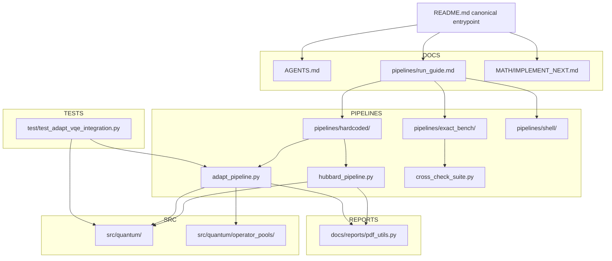
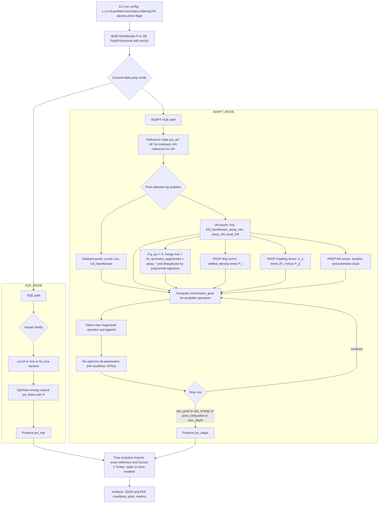

<file_map>
/Users/jakestrobel/Documents/Holstein_implementation/Holstein_test_fullclone_2
├── pipelines
│   ├── exact_bench
│   │   ├── hh_l2_heavy_prune_workflow.py * +
│   │   ├── README.md
│   │   ├── benchmark_metrics_proxy.py +
│   │   ├── cross_check_suite.py +
│   │   ├── hh_fixed_handoff_replay_optimizer_probe.py +
│   │   ├── hh_fixed_handoff_replay_optimizer_probe_workflow.py +
│   │   ├── hh_fixed_seed_qpu_prep_sweep.py +
│   │   ├── hh_full_pool_expressivity_probe.py +
│   │   ├── hh_full_pool_expressivity_probe_workflow.py +
│   │   ├── hh_l2_heavy_prune.py +
│   │   ├── hh_l2_logical_screen.py +
│   │   ├── hh_l2_logical_screen_workflow.py +
│   │   ├── hh_l2_stage_unit_audit.py +
│   │   ├── hh_l2_stage_unit_audit_workflow.py +
│   │   ├── hh_noise_hardware_validation.py +
│   │   ├── hh_noise_robustness_seq_report.py +
│   │   ├── hh_seq_transition_utils.py +
│   │   ├── noise_aer_builders.py +
│   │   ├── noise_model_spec.py +
│   │   ├── noise_oracle_runtime.py +
│   │   ├── noise_patch_selection.py +
│   │   ├── noise_snapshot.py +
│   │   └── statevector_kernels.py +
│   ├── hardcoded
│   │   ├── adapt_pipeline.py * +
│   │   ├── handoff_state_bundle.py * +
│   │   ├── hh_continuation_generators.py * +
│   │   ├── hh_continuation_motifs.py * +
│   │   ├── hh_continuation_pruning.py * +
│   │   ├── hh_continuation_replay.py * +
│   │   ├── hh_continuation_rescue.py * +
│   │   ├── hh_continuation_scoring.py * +
│   │   ├── hh_continuation_stage_control.py * +
│   │   ├── hh_continuation_symmetry.py * +
│   │   ├── hh_continuation_types.py * +
│   │   ├── hh_staged_workflow.py * +
│   │   ├── hh_vqe_from_adapt_family.py * +
│   │   ├── hh_staged_circuit_report.py +
│   │   ├── hh_staged_cli_args.py +
│   │   ├── hh_staged_noise.py +
│   │   ├── hh_staged_noise_workflow.py +
│   │   ├── hh_staged_noiseless.py +
│   │   ├── hubbard_pipeline.py +
│   │   └── qpe_qiskit_shim.py +
│   ├── shell
│   │   ├── build_hh_noise_robustness_report.sh
│   │   └── run_drive_accurate.sh
│   └── run_guide.md *
├── src
│   ├── quantum
│   │   ├── operator_pools
│   │   │   ├── __init__.py +
│   │   │   ├── polaron_paop.py +
│   │   │   └── vlf_sq.py +
│   │   ├── time_propagation
│   │   │   ├── __init__.py +
│   │   │   ├── cfqm_propagator.py +
│   │   │   └── cfqm_schemes.py +
│   │   ├── compiled_ansatz.py * +
│   │   ├── compiled_polynomial.py * +
│   │   ├── vqe_latex_python_pairs.py * +
│   │   ├── __init__.py
│   │   ├── drives_time_potential.py +
│   │   ├── ed_hubbard_holstein.py +
│   │   ├── hartree_fock_reference_state.py +
│   │   ├── hubbard_latex_python_pairs.py +
│   │   ├── pauli_actions.py +
│   │   ├── pauli_letters_module.py +
│   │   ├── pauli_polynomial_class.py +
│   │   ├── pauli_words.py +
│   │   ├── qubitization_module.py +
│   │   └── spsa_optimizer.py +
│   └── __init__.py +
├── test
│   ├── test_adapt_vqe_integration.py * +
│   ├── test_hh_continuation_generators.py * +
│   ├── test_hh_continuation_replay.py * +
│   ├── test_hh_continuation_scoring.py * +
│   ├── test_hh_continuation_stage_control.py * +
│   ├── test_hh_staged_noiseless_workflow.py * +
│   ├── test_hh_vqe_from_adapt_family_seed.py * +
│   ├── test_staged_export_replay_roundtrip.py * +
│   ├── conftest.py +
│   ├── test_benchmark_metrics_proxy.py +
│   ├── test_cfqm_acceptance.py +
│   ├── test_cfqm_propagator.py +
│   ├── test_cfqm_schemes.py +
│   ├── test_compiled_ansatz.py +
│   ├── test_compiled_polynomial.py +
│   ├── test_cross_check_suite_cli.py +
│   ├── test_ed_crosscheck.py +
│   ├── test_exact_steps_multiplier.py +
│   ├── test_hardcoded_qpe_isolation.py +
│   ├── test_hh_adapt_family_replay.py +
│   ├── test_hh_continuation_motifs.py +
│   ├── test_hh_continuation_pruning.py +
│   ├── test_hh_continuation_rescue.py +
│   ├── test_hh_continuation_symmetry.py +
│   ├── test_hh_fixed_handoff_replay_optimizer_probe_workflow.py +
│   ├── test_hh_fixed_seed_qpu_prep_sweep.py +
│   ├── test_hh_full_pool_expressivity_probe_workflow.py +
│   ├── test_hh_l2_heavy_prune_workflow.py +
│   ├── test_hh_l2_logical_screen_workflow.py +
│   ├── test_hh_l2_stage_unit_audit_workflow.py +
│   ├── test_hh_noise_hardware_validation.py +
│   ├── test_hh_noise_model_spec.py +
│   ├── test_hh_noise_oracle_runtime.py +
│   ├── test_hh_noise_patch_selection.py +
│   ├── test_hh_noise_robustness_benchmarks.py +
│   ├── test_hh_noise_statevector_kernels.py +
│   ├── test_hh_noise_validation_cli.py +
│   ├── test_hh_staged_circuit_report.py +
│   ├── test_hh_staged_noise_workflow.py +
│   ├── test_hubbard_adapt_ref_source.py +
│   ├── test_polaron_paop.py +
│   ├── test_report_layers.py +
│   ├── test_spsa_optimizer.py +
│   ├── test_time_potential_drive.py +
│   ├── test_trotter_hh_integration.py +
│   ├── test_vlf_sq_pool.py +
│   └── test_vqe_energy_backend.py +
├── .obsidian
│   ├── app.json
│   ├── appearance.json
│   ├── core-plugins.json
│   └── workspace.json
├── HH
│   ├── .obsidian
│   │   ├── app.json
│   │   ├── appearance.json
│   │   ├── core-plugins.json
│   │   └── workspace.json
│   ├── Untitled.md
│   └── artifacts 1.md
├── MATH
│   ├── IMPLEMENT_NEXT.md
│   ├── IMPLEMENT_SOON.md
│   ├── Math.md
│   └── Math.pdf
├── artifacts 1
│   ├── json
│   │   ├── noise_l2_pdf
│   │   │   ├── basic.json
│   │   │   ├── ideal_control.json
│   │   │   ├── ideal_control_compiled.json
│   │   │   ├── ideal_control_compiled_spsa.json
│   │   │   ├── ideal_control_ptw_spsa.json
│   │   │   ├── scheduled.json
│   │   │   └── shots.json
│   │   ├── noise_l2_test
│   │   │   ├── basic.json
│   │   │   ├── scheduled.json
│   │   │   └── shots.json
│   │   ├── 20260309_knee_layerwise_warm_hh_hva.json
│   │   ├── 20260309_knee_layerwise_warm_hh_hva_adapt_handoff.json
│   │   ├── 20260309_knee_layerwise_warm_hh_hva_replay.csv
│   │   ├── 20260309_knee_layerwise_warm_hh_hva_replay.json
│   │   ├── 20260309_knee_ptw_warm_hh_hva_ptw.json
│   │   ├── 20260309_knee_ptw_warm_hh_hva_ptw_adapt_handoff.json
│   │   ├── 20260309_knee_ptw_warm_hh_hva_ptw_replay.csv
│   │   ├── 20260309_knee_ptw_warm_hh_hva_ptw_replay.json
│   │   ├── 20260309_plateau_v3_knee_layerwise.json
│   │   ├── 20260309_plateau_v3_knee_layerwise_adapt_handoff.json
│   │   ├── 20260309_plateau_v3_knee_layerwise_replay.csv
│   │   ├── 20260309_plateau_v3_knee_layerwise_replay.json
│   │   ├── 20260309_plateau_v3_knee_ptw.json
│   │   ├── 20260309_plateau_v3_knee_ptw_adapt_handoff.json
│   │   ├── 20260309_plateau_v3_knee_ptw_replay.csv
│   │   ├── 20260309_plateau_v3_knee_ptw_replay.json
│   │   ├── 20260309_plateau_v3_strong_layerwise.json
│   │   ├── 20260309_plateau_v3_strong_layerwise_adapt_handoff.json
│   │   ├── 20260309_plateau_v3_strong_layerwise_replay.csv
│   │   ├── 20260309_plateau_v3_strong_layerwise_replay.json
│   │   ├── 20260309_plateau_v3_strong_ptw.json
│   │   ├── 20260309_plateau_v3_strong_ptw_adapt_handoff.json
│   │   ├── 20260309_plateau_v3_strong_ptw_replay.csv
│   │   ├── 20260309_plateau_v3_strong_ptw_replay.json
│   │   ├── 20260309_plateau_v3_weak_layerwise.json
│   │   ├── 20260309_plateau_v3_weak_layerwise_adapt_handoff.json
│   │   ├── 20260309_plateau_v3_weak_layerwise_replay.csv
│   │   ├── 20260309_plateau_v3_weak_layerwise_replay.json
│   │   ├── 20260309_plateau_v3_weak_ptw.json
│   │   ├── 20260309_plateau_v3_weak_ptw_adapt_handoff.json
│   │   ├── 20260309_plateau_v3_weak_ptw_replay.csv
│   │   ├── 20260309_plateau_v3_weak_ptw_replay.json
│   │   ├── 20260309_strong_layerwise_warm_hh_hva.json
│   │   ├── 20260309_strong_layerwise_warm_hh_hva_adapt_handoff.json
│   │   ├── 20260309_strong_layerwise_warm_hh_hva_replay.csv
│   │   ├── 20260309_strong_layerwise_warm_hh_hva_replay.json
│   │   ├── 20260309_strong_ptw_warm_hh_hva_ptw.json
│   │   ├── 20260309_strong_ptw_warm_hh_hva_ptw_adapt_handoff.json
│   │   ├── 20260309_strong_ptw_warm_hh_hva_ptw_replay.csv
│   │   ├── 20260309_strong_ptw_warm_hh_hva_ptw_replay.json
│   │   ├── 20260309_weak_layerwise_warm_hh_hva.json
│   │   ├── 20260309_weak_layerwise_warm_hh_hva_adapt_handoff.json
│   │   ├── 20260309_weak_layerwise_warm_hh_hva_replay.csv
│   │   ├── 20260309_weak_layerwise_warm_hh_hva_replay.json
│   │   ├── 20260309_weak_ptw_warm_hh_hva_ptw.json
│   │   ├── 20260309_weak_ptw_warm_hh_hva_ptw_adapt_handoff.json
│   │   ├── 20260309_weak_ptw_warm_hh_hva_ptw_replay.csv
│   │   ├── 20260309_weak_ptw_warm_hh_hva_ptw_replay.json
│   │   ├── L3_hh_drive_nph2_heavy_cutover_03268371471231371_adapt_handoff.json
│   │   ├── L3_hh_drive_nph2_heavy_cutover_03268371471231371_warm_checkpoint_state.json
│   │   ├── L3_hh_drive_nph2_heavy_cutover_03268371471231371_warm_cutover_state.json
│   │   ├── cfqm4_hh_L2_driveA1.0_U4_nph1_t10.json
│   │   ├── cfqm4_vs_suzuki2_hh_L2_hwmatch.json
│   │   ├── hh_noise_validation_L2_hh_hva_ptw_noiseless_ideal.json
│   │   ├── hh_staged_L2_drive_ptw_spsa_heavy_d120.json
│   │   ├── hh_staged_L2_drive_ptw_spsa_heavy_d120_adapt_handoff.json
│   │   ├── hh_staged_L2_drive_ptw_spsa_heavy_d120_replay.csv
│   │   ├── hh_staged_L2_drive_ptw_spsa_heavy_d120_replay.json
│   │   ├── hh_staged_L2_drive_t1_U2_dv0_w1_g1_nph1_warmhh_hva_ptw_b3d876db0d_adapt_handoff.json
│   │   ├── hh_staged_L2_drive_t1_U2_dv0_w1_g1_nph1_warmhh_hva_ptw_b3d876db0d_warm_checkpoint_state.json
│   │   ├── hh_staged_L2_drive_t1_U2_dv0_w1_g1_nph1_warmhh_hva_ptw_b3d876db0d_warm_cutover_state.json
│   │   ├── hh_staged_L2_static_t1_U2_dv0_w1_g1_nph1_warmhh_hva_ptw_a56ab6fb09_adapt_handoff.json
│   │   ├── hh_staged_L2_static_t1_U2_dv0_w1_g1_nph1_warmhh_hva_ptw_a56ab6fb09_replay.csv
│   │   ├── hh_staged_L2_static_t1_U2_dv0_w1_g1_nph1_warmhh_hva_ptw_a56ab6fb09_replay.json
│   │   ├── hh_staged_L3_static_t1_U2_dv0_w1_g1_nph1_warmhh_hva_ptw_9afb5d05d5_adapt_handoff.json
│   │   ├── hh_staged_L3_static_t1_U2_dv0_w1_g1_nph1_warmhh_hva_ptw_9afb5d05d5_replay.csv
│   │   ├── hh_staged_L3_static_t1_U2_dv0_w1_g1_nph1_warmhh_hva_ptw_9afb5d05d5_replay.json
│   │   ├── hh_staged_circuit_L2_plateau_v3_weak_ptw_L2_adapt_handoff.json
│   │   ├── hh_staged_circuit_L2_plateau_v3_weak_ptw_L2_replay.csv
│   │   ├── hh_staged_circuit_L2_plateau_v3_weak_ptw_L2_replay.json
│   │   ├── hh_staged_circuit_L2_reasonable_L2_adapt_handoff.json
│   │   ├── hh_staged_circuit_L2_reasonable_L2_replay.csv
│   │   ├── hh_staged_circuit_L2_reasonable_L2_replay.json
│   │   ├── hh_staged_circuit_smoke_legacy_L2_adapt_handoff.json
│   │   ├── hh_staged_circuit_smoke_legacy_nohhseed_L2_adapt_handoff.json
│   │   ├── hh_staged_circuit_smoke_legacy_nohhseed_L2_replay.csv
│   │   ├── hh_staged_circuit_smoke_legacy_nohhseed_L2_replay.json
│   │   ├── hh_staged_circuit_smoke_legacy_nohhseed_L3_adapt_handoff.json
│   │   ├── hh_staged_circuit_smoke_legacy_nohhseed_L3_replay.csv
│   │   ├── hh_staged_circuit_smoke_legacy_nohhseed_L3_replay.json
│   │   ├── hh_staged_circuit_smoke_noprune_L2_adapt_handoff.json
│   │   ├── l2_first_noise_anchor_adapt_handoff.json
│   │   ├── l2_first_noise_anchor_replay.csv
│   │   ├── l2_first_noise_anchor_replay.json
│   │   ├── l2_first_noise_anchor_snapshot.json
│   │   ├── l2_first_noise_anchor_warm_checkpoint_state.json
│   │   ├── l2_first_noise_anchor_warm_cutover_state.json
│   │   ├── l2_first_noise_backend_scheduled.json
│   │   ├── l2_first_noise_generic6_adapt_handoff.json
│   │   ├── l2_first_noise_generic6_backend_scheduled.json
│   │   ├── l2_first_noise_generic6_replay.csv
│   │   ├── l2_first_noise_generic6_replay.json
│   │   ├── l2_first_noise_generic6_snapshot.json
│   │   ├── l2_first_noise_generic6_warm_checkpoint_state.json
│   │   ├── l2_first_noise_generic6_warm_cutover_state.json
│   │   ├── l2_first_noise_jakarta_adapt_handoff.json
│   │   ├── l2_first_noise_jakarta_backend_scheduled.json
│   │   └── l2_first_noise_jakarta_replay.csv
│   ├── logs
│   │   ├── L3_hh_drive_nph2_heavy_cutover_03268371471231371.log.pre_resume_20260310T173403Z
│   │   └── L3_hh_drive_nph2_heavy_cutover_03268371471231371.stdout.log.pre_resume_20260310T173403Z
│   ├── pdf
│   │   ├── noise_l2_pdf
│   │   │   ├── basic.pdf
│   │   │   ├── scheduled.pdf
│   │   │   └── shots.pdf
│   │   ├── cfqm4_hh_L2_driveA1.0_U4_nph1_t10.pdf
│   │   ├── cfqm4_vs_suzuki2_hh_L2_hwmatch.pdf
│   │   ├── hh_staged_L2_drive_ptw_spsa_heavy_d120.pdf
│   │   ├── hh_staged_circuit_report_L2_L3.pdf
│   │   ├── hh_staged_circuit_report_L2_L3_smoke.pdf
│   │   ├── hh_staged_circuit_report_L2_plateau_v3_weak_ptw.pdf
│   │   ├── hh_staged_circuit_report_L2_reasonable.pdf
│   │   ├── suzuki2_hh_L2_driveA1.0_U4_nph1_t10_trotter128.pdf
│   │   └── suzuki2_hh_L2_driveA1.0_U4_nph1_t10_trotter64.pdf
│   ├── useful
│   │   ├── L2
│   │   │   ├── 20260309_knee_layerwise_warm_hh_hva_replay.md
│   │   │   ├── 20260309_knee_ptw_warm_hh_hva_ptw_replay.md
│   │   │   ├── 20260309_plateau_v3_knee_layerwise_replay.md
│   │   │   ├── 20260309_plateau_v3_knee_ptw_replay.md
│   │   │   ├── 20260309_plateau_v3_strong_layerwise_replay.md
│   │   │   ├── 20260309_plateau_v3_strong_ptw_replay.md
│   │   │   ├── 20260309_plateau_v3_summary.md
│   │   │   ├── 20260309_plateau_v3_weak_layerwise_replay.md
│   │   │   ├── 20260309_plateau_v3_weak_ptw_replay.md
│   │   │   ├── 20260309_strong_layerwise_warm_hh_hva_replay.md
│   │   │   ├── 20260309_strong_ptw_warm_hh_hva_ptw_replay.md
│   │   │   ├── 20260309_weak_layerwise_warm_hh_hva_replay.md
│   │   │   ├── 20260309_weak_ptw_warm_hh_hva_ptw_replay.md
│   │   │   ├── hh_staged_L2_drive_ptw_spsa_heavy_d120_replay.md
│   │   │   ├── hh_staged_L2_static_t1_U2_dv0_w1_g1_nph1_warmhh_hva_ptw_a56ab6fb09_replay.md
│   │   │   ├── hh_staged_circuit_L2_plateau_v3_weak_ptw_L2_replay.md
│   │   │   ├── hh_staged_circuit_L2_reasonable_L2_replay.md
│   │   │   ├── hh_staged_circuit_smoke_legacy_nohhseed_L2_replay.md
│   │   │   ├── l2_first_noise_anchor_replay.md
│   │   │   ├── l2_first_noise_generic6_replay.md
│   │   │   ├── l2_first_noise_jakarta_replay.md
│   │   │   ├── l2_first_noise_jakarta_s2_fast_replay.md
│   │   │   ├── l2_first_noise_jakarta_s2_ok_replay.md
│   │   │   └── l2_first_noise_jakarta_s2_replay.md
│   │   └── L3
│   │       ├── hh_staged_L3_static_t1_U2_dv0_w1_g1_nph1_warmhh_hva_ptw_9afb5d05d5_replay.md
│   │       └── hh_staged_circuit_smoke_legacy_nohhseed_L3_replay.md
│   ├── user_runs
│   │   └── 20260309_hh_l2_noiseless
│   │       └── json
│   │           ├── raw_ptw_g0.5_nph1.json
│   │           ├── raw_ptw_g1.0_nph1.json
│   │           ├── raw_ptw_g1.0_nph2.json
│   │           ├── raw_ptw_g1.25_nph1.json
│   │           ├── raw_ptw_g1.25_nph2.json
│   │           ├── raw_ptw_g1.5_nph1.json
│   │           └── raw_ptw_g1.5_nph2.json
│   └── hh_noise_validation_L2_hh_hva_ptw_run_summary.md
├── docs
│   └── reports
│       ├── __init__.py
│       ├── pdf_utils.py +
│       ├── qiskit_circuit_report.py +
│       ├── report_labels.py +
│       └── report_pages.py +
├── prompt-exports
│   ├── 2026-03-12-2315-plan-hh-failure-test-ladder.md
│   ├── 2026-03-12-2359-plan-hh-operator-pool-expansion.md
│   ├── 2026-03-13-0010-plan-hh-sweep-experiments.md
│   ├── 2026-03-14-0030-question-hh-pareto-problem-definition.md
│   ├── 2026-03-14-140128-plan-hh-uccsd-paop-seed-adapt-workflow.md
│   └── 2026-03-14-1502-plan-hh-generator-parallel-experiments.md
├── AGENTS.md *
├── README.md *
├── .gitignore
├── L2_hh_smart_adapt.json
├── L2_hh_smart_replay.csv
├── L2_hh_smart_replay.json
├── L2_hh_smart_replay.md
├── L2_hh_smart_replay_bundle_diagnostic.json
├── L2_hh_smart_results_diagnostic.json
├── L2_hh_smart_results_diagnostic.pdf
├── L2_hh_smart_warm.json
├── activate_ibm_runtime.py +
├── investigation_hh_noise_boundaries.md
├── pareto_flow_chart.md
└── pareto_flow_chart.pdf


(* denotes selected files)
(+ denotes code-map available)

File: /Users/jakestrobel/Documents/Holstein_implementation/Holstein_test_fullclone_2/src/quantum/pauli_actions.py
Imports:
  - import math
  - from dataclasses import dataclass
  - import numpy as np
---
Classes:
  - CompiledPauliAction
    Properties:
      - label_exyz
      - perm
      - phase

Functions:
  - L27: def compile_pauli_action_exyz(label_exyz: str, nq: int) -> CompiledPauliAction:
  - L59: def apply_compiled_pauli(psi: np.ndarray, action: CompiledPauliAction) -> np.ndarray:
  - L66: def apply_exp_term(
    psi: np.ndarray,
    action: CompiledPauliAction,
    coeff: complex,
    dt: float,
    tol: float = 1e-12,
) -> np.ndarray:

Global vars:
  - __all__
---


File: /Users/jakestrobel/Documents/Holstein_implementation/Holstein_test_fullclone_2/src/quantum/pauli_polynomial_class.py
Imports:
  - import numpy as np
  - from src.quantum.qubitization_module import PauliTerm
---
Classes:
  - PauliPolynomial
    Methods:
      - L9: def __init__(self, repr_mode, pol=None):
      - L15: def get_nq(self):
      - L21: def return_polynomial(self):
      - L23: def count_number_terms(self):
      - L25: def add_term(self, pt):
      - L28: def _clone_term(pt):
      - L31: def _clone_terms(cls, terms):
      - L33: def __add__(self, pp):
      - L44: def __iadd__(self, pp):
      - L56: def __sub__(self, pp):
      - L68: def __isub__(self, pp):
      - L81: def __mul__(self, pp):
      - L101: def __rmul__(self, other):
      - L111: def __pow__(self, exponent):
      - L124: def _reduce(self):
      - L140: def visualize_polynomial(self):
  - fermion_plus_operator
    Methods:
      - L157: def __init__(self, repr_mode, nq, j):
      - L163: def __set_JW_operator(self, nq, j):
  - fermion_minus_operator
    Methods:
      - L185: def __init__(self, repr_mode, nq, j):
      - L191: def __set_JW_operator(self, nq, j):
---

</file_map>
<file_contents>
File: /Users/jakestrobel/Documents/Holstein_implementation/Holstein_test_fullclone_2/pipelines/hardcoded/hh_vqe_from_adapt_family.py
(lines 327-380: PoolTermwiseAnsatz representation used by matched-family replay: repeated list of ADAPT-selected AnsatzTerm generators with prepare_state over theta blocks.)
```py
    def __init__(self, path: Path) -> None:
        self.path = Path(path)
        self.path.parent.mkdir(parents=True, exist_ok=True)
        self.path.write_text("", encoding="utf-8")

    def log(self, msg: str) -> None:
        line = f"[{_now_utc()}] {msg}"
        print(line, flush=True)
        with self.path.open("a", encoding="utf-8") as f:
            f.write(line + "\n")


class PoolTermwiseAnsatz:
    """Fixed ansatz built from a list of generators, repeated by layers."""

    def __init__(self, *, terms: list[AnsatzTerm], reps: int, nq: int) -> None:
        if int(reps) < 1:
            raise ValueError("reps must be >= 1.")
        self.base_terms = list(terms)
        self.reps = int(reps)
        self.nq = int(nq)
        self.num_parameters = int(len(self.base_terms)) * int(self.reps)

    def prepare_state(
        self,
        theta: np.ndarray,
        psi_ref: np.ndarray,
        *,
        ignore_identity: bool = True,
        coefficient_tolerance: Optional[float] = None,
        sort_terms: Optional[bool] = None,
    ) -> np.ndarray:
        arr = np.asarray(theta, dtype=float).reshape(-1)
        if int(arr.size) != int(self.num_parameters):
            raise ValueError(
                f"theta length {int(arr.size)} does not match num_parameters={int(self.num_parameters)}"
            )
        psi = np.asarray(psi_ref, dtype=complex).reshape(-1)
        if int(psi.size) != (1 << int(self.nq)):
            raise ValueError(f"psi_ref length {int(psi.size)} does not match 2^nq={1 << int(self.nq)}")

        out = np.array(psi, copy=True)
        tol = 1e-12 if coefficient_tolerance is None else float(coefficient_tolerance)
        sflag = True if sort_terms is None else bool(sort_terms)
        idx = 0
        for _ in range(self.reps):
            for term in self.base_terms:
                out = apply_exp_pauli_polynomial(
                    out,
                    term.polynomial,
                    float(arr[idx]),
                    ignore_identity=ignore_identity,
                    coefficient_tolerance=tol,
                    sort_terms=sflag,

```

(lines 680-899: Replay input parsing, extraction of adapt_vqe operators/theta, runtime-split child reconstruction from continuation metadata, and replay seed policy constants/contracts.)
```py
                "raw_term_count": int(len(block_terms)),
                "meta": dict(block_meta),
            }
        )
    dedup_pool = _dedup_terms(combined_raw, n_ph_max=int(cfg.n_ph_max))
    return dedup_pool, {
        "base_family": str(base_key),
        "extra_families": list(normalized_extra),
        "raw_counts_by_family": dict(raw_counts_by_family),
        "family_blocks": family_blocks,
        "combined_raw_total": int(len(combined_raw)),
        "combined_dedup_total": int(len(dedup_pool)),
    }


def _read_input_state_and_payload(path: Path) -> tuple[np.ndarray, dict[str, Any]]:
    payload = json.loads(Path(path).read_text(encoding="utf-8"))
    init = payload.get("initial_state", {})
    if not isinstance(init, Mapping):
        raise ValueError("Input JSON missing 'initial_state' payload.")
    amps = init.get("amplitudes_qn_to_q0", None)
    if not isinstance(amps, Mapping):
        raise ValueError("Input JSON missing initial_state.amplitudes_qn_to_q0.")

    nq_total_raw = init.get("nq_total", None)
    nq_total = int(nq_total_raw) if nq_total_raw is not None else len(next(iter(amps.keys()), ""))
    if int(nq_total) <= 0:
        raise ValueError("Could not infer nq_total from input JSON state amplitudes.")
    state = _amplitudes_qn_to_q0_to_statevector(amps, nq=int(nq_total))
    return state, payload


def _extract_adapt_operator_theta_sequence(payload: Mapping[str, Any]) -> tuple[list[str], np.ndarray]:
    adapt = payload.get("adapt_vqe", None)
    if not isinstance(adapt, Mapping):
        raise ValueError(
            "Input JSON missing object key 'adapt_vqe'; replay requires "
            "adapt_vqe.operators and adapt_vqe.optimal_point."
        )
    ops_raw = adapt.get("operators", None)
    theta_raw = adapt.get("optimal_point", None)

    if not isinstance(ops_raw, list) or len(ops_raw) == 0:
        raise ValueError("Input JSON missing non-empty list adapt_vqe.operators.")
    if not isinstance(theta_raw, list) or len(theta_raw) == 0:
        raise ValueError("Input JSON missing non-empty list adapt_vqe.optimal_point.")
    if len(ops_raw) != len(theta_raw):
        raise ValueError(
            "Length mismatch between adapt_vqe.operators and adapt_vqe.optimal_point: "
            f"{len(ops_raw)} vs {len(theta_raw)}."
        )

    labels: list[str] = []
    for i, raw_label in enumerate(ops_raw):
        label = str(raw_label).strip()
        if len(label) == 0:
            raise ValueError(f"Invalid empty operator label at adapt_vqe.operators[{i}].")
        labels.append(label)

    theta_vals: list[float] = []
    for i, raw_theta in enumerate(theta_raw):
        try:
            val = float(raw_theta)
        except Exception as exc:
            raise ValueError(
                f"Invalid theta value at adapt_vqe.optimal_point[{i}]={raw_theta!r}; expected float."
            ) from exc
        if not np.isfinite(val):
            raise ValueError(
                f"Non-finite theta value at adapt_vqe.optimal_point[{i}]={raw_theta!r}."
            )
        theta_vals.append(float(val))

    theta = np.asarray(theta_vals, dtype=float)
    return labels, theta


def _inject_replay_terms_from_payload(
    label_to_term: dict[str, AnsatzTerm],
    payload: Mapping[str, Any] | None,
) -> None:
    if not isinstance(payload, Mapping):
        return
    continuation = payload.get("continuation", {})
    if not isinstance(continuation, Mapping):
        return
    raw_selected_meta = continuation.get("selected_generator_metadata", [])
    if not isinstance(raw_selected_meta, Sequence):
        return
    for raw_meta in raw_selected_meta:
        if not isinstance(raw_meta, Mapping):
            continue
        lbl = str(raw_meta.get("candidate_label", "")).strip()
        if lbl == "" or lbl in label_to_term:
            continue
        compile_meta = raw_meta.get("compile_metadata", {})
        serialized_terms = (
            compile_meta.get("serialized_terms_exyz", [])
            if isinstance(compile_meta, Mapping)
            else []
        )
        if not isinstance(serialized_terms, Sequence):
            continue
        try:
            poly = rebuild_polynomial_from_serialized_terms(serialized_terms)
        except Exception:
            continue
        label_to_term[lbl] = AnsatzTerm(label=str(lbl), polynomial=poly)


def _build_replay_terms_from_adapt_labels(
    family_pool: Sequence[AnsatzTerm],
    adapt_labels: Sequence[str],
    payload: Mapping[str, Any] | None = None,
) -> list[AnsatzTerm]:
    label_to_term: dict[str, AnsatzTerm] = {}
    duplicate_labels: list[str] = []
    for term in family_pool:
        lbl = str(term.label)
        if lbl in label_to_term:
            duplicate_labels.append(lbl)
            continue
        label_to_term[lbl] = term
    if duplicate_labels:
        dup_preview = sorted(set(duplicate_labels))[:8]
        raise ValueError(
            "Resolved family pool has duplicate operator labels; replay mapping is ambiguous. "
            f"Examples: {dup_preview}"
        )

    _inject_replay_terms_from_payload(label_to_term, payload)

    replay_terms: list[AnsatzTerm] = []
    missing: list[str] = []
    for lbl in adapt_labels:
        term = label_to_term.get(str(lbl), None)
        if term is None:
            missing.append(str(lbl))
            continue
        replay_terms.append(term)
    if missing:
        miss_preview = missing[:8]
        raise ValueError(
            "ADAPT operators are not present in the resolved replay family pool. "
            f"Missing examples: {miss_preview}"
        )
    return replay_terms


def _build_replay_seed_theta(adapt_theta: np.ndarray, *, reps: int) -> np.ndarray:
    if int(reps) < 1:
        raise ValueError("reps must be >= 1 for replay seed construction.")
    base = np.asarray(adapt_theta, dtype=float).reshape(-1)
    if int(base.size) == 0:
        raise ValueError("adapt_theta must be non-empty for replay seed construction.")
    if not np.all(np.isfinite(base)):
        raise ValueError("adapt_theta contains non-finite values.")
    return np.tile(base, int(reps)).astype(float, copy=False)


# ── Replay seed policy (v2 contract) ────────────────────────────────────
REPLAY_SEED_POLICIES = {"auto", "scaffold_plus_zero", "residual_only", "tile_adapt"}
REPLAY_CONTRACT_VERSION = 2

# Handoff-state kind constants
_PREPARED_STATE = "prepared_state"
_REFERENCE_STATE = "reference_state"

# Sources that map unambiguously to reference_state in legacy payloads.
_LEGACY_REFERENCE_SOURCES = {"hf", "exact"}
# Source suffixes that map to prepared_state in legacy staged exports.
_LEGACY_PREPARED_FINAL_SUFFIXES = ("_final",)
# Source values that map to prepared_state in legacy payloads.
_LEGACY_PREPARED_SOURCES = {"adapt_vqe"}


def _coerce_bool(value: Any, path: str) -> bool:
    if isinstance(value, bool):
        return bool(value)
    if isinstance(value, (int, float)):
        return bool(value)
    if isinstance(value, str):
        sval = value.strip().lower()
        if sval in {"1", "true", "yes", "on", "y"}:
            return True
        if sval in {"0", "false", "no", "off", "n"}:
            return False
    raise ValueError(f"{path} must be a boolean-like value.")


def _extract_replay_contract(payload: Mapping[str, Any]) -> dict[str, Any] | None:
    """Return parsed replay contract from continuation when present.

    Modern staged artifacts treat continuation.replay_contract as authoritative.
    If the field is present but malformed, this raises a ValueError rather than
    silently falling back to legacy metadata.
    """
    continuation = payload.get("continuation", None)
    if not isinstance(continuation, Mapping):
        return None

    raw_contract = continuation.get("replay_contract", None)
    if raw_contract is None:
        return None
    if not isinstance(raw_contract, Mapping):
        raise ValueError("continuation.replay_contract must be a JSON object/map.")

    version_raw = raw_contract.get("contract_version", raw_contract.get("version", None))
    if version_raw is None:
        raise ValueError("continuation.replay_contract must include contract_version.")
    try:
        version = int(version_raw)
    except Exception as exc:
        raise ValueError("continuation.replay_contract.contract_version must be int.") from exc
    if version != int(REPLAY_CONTRACT_VERSION):
        raise ValueError(
            f"Unsupported continuation.replay_contract.contract_version={version}; "
            f"expected {REPLAY_CONTRACT_VERSION}."
        )


```

(lines 1030-2109: Handoff-state inference, seed-theta policy resolution, replay family resolution, build_replay_ansatz_context, and run() orchestration for legacy/phase1/phase2/phase3 replay modes with optimizer-memory and generator/motif metadata.)
```py
        "handoff_state_kind": str(handoff_state_kind),
        "continuation_mode": str(continuation_mode),
        "provenance_source": str(raw_contract.get("provenance_source", "explicit")),
    }


def _canonical_seed_policy(raw: Any) -> str | None:
    if raw is None:
        return None
    val = str(raw).strip().lower()
    return val if val in REPLAY_SEED_POLICIES else None


def _infer_handoff_state_kind(
    payload: Mapping[str, Any],
) -> tuple[str, str]:
    """Return (handoff_state_kind, provenance_source).

    provenance_source is one of:
      "contract"           – "continuation.replay_contract.handoff_state_kind" was present.
      "explicit"          – ``initial_state.handoff_state_kind`` was present.
      "inferred_source"   – inferred from ``initial_state.source`` legacy field.
      "ambiguous"         – could not resolve; caller must raise.
    """
    contract = _extract_replay_contract(payload)
    if contract is not None:
        return str(contract["handoff_state_kind"]), "contract"

    init = payload.get("initial_state", {})
    if not isinstance(init, Mapping):
        init = {}

    explicit = init.get("handoff_state_kind", None)
    if isinstance(explicit, str) and explicit in {_PREPARED_STATE, _REFERENCE_STATE}:
        return str(explicit), "explicit"

    # Legacy inference from initial_state.source
    source_raw = init.get("source", None)
    if isinstance(source_raw, str):
        source = str(source_raw).strip().lower()
        if source in _LEGACY_REFERENCE_SOURCES:
            return _REFERENCE_STATE, "inferred_source"
        if source in _LEGACY_PREPARED_SOURCES:
            return _PREPARED_STATE, "inferred_source"
        # Staged final exports use suffixes like A_probe_final, B_medium_final
        for suffix in _LEGACY_PREPARED_FINAL_SUFFIXES:
            if source.endswith(suffix):
                return _PREPARED_STATE, "inferred_source"
        # Warm-start exports
        if "warm_start" in source:
            return _PREPARED_STATE, "inferred_source"

    return "ambiguous", "ambiguous"


def _build_replay_seed_theta_policy(
    adapt_theta: np.ndarray,
    *,
    reps: int,
    policy: str,
    handoff_state_kind: str,
) -> tuple[np.ndarray, str]:
    """Build replay seed theta according to the given policy.

    Returns (seed_theta, resolved_policy_name).
    """
    base = np.asarray(adapt_theta, dtype=float).reshape(-1)
    if int(base.size) == 0:
        raise ValueError("adapt_theta must be non-empty for replay seed construction.")
    if not np.all(np.isfinite(base)):
        raise ValueError("adapt_theta contains non-finite values.")
    if int(reps) < 1:
        raise ValueError("reps must be >= 1 for replay seed construction.")

    adapt_depth = int(base.size)
    total_params = adapt_depth * int(reps)

    if policy == "auto":
        if handoff_state_kind == _PREPARED_STATE:
            resolved = "residual_only"
        elif handoff_state_kind == _REFERENCE_STATE:
            resolved = "scaffold_plus_zero"
        else:
            raise ValueError(
                "Cannot resolve replay seed policy 'auto': handoff_state_kind is "
                f"'{handoff_state_kind}'. Provide an explicit --replay-seed-policy or "
                "ensure the input JSON has initial_state.handoff_state_kind."
            )
    else:
        resolved = str(policy)

    if resolved == "tile_adapt":
        seed = np.tile(base, int(reps)).astype(float, copy=False)
    elif resolved == "scaffold_plus_zero":
        seed = np.zeros(total_params, dtype=float)
        seed[:adapt_depth] = base
    elif resolved == "residual_only":
        seed = np.zeros(total_params, dtype=float)
    else:
        raise ValueError(f"Unknown replay seed policy: '{resolved}'")

    return seed, resolved


def _extract_canonical_label_family(label: str) -> str | None:
    raw = str(label).strip()
    if ":" not in raw:
        return None
    prefix, _ = raw.split(":", 1)
    return _canonical_family(prefix)


def _build_exact_label_subset_for_family(
    cfg: RunConfig,
    *,
    family: str,
    h_poly: Any,
    needed_labels: Sequence[str],
) -> tuple[list[AnsatzTerm], int]:
    family_key = _canonical_family(family)
    if family_key is None or family_key == "full_meta":
        return [], 0
    needed = {str(lbl) for lbl in needed_labels}
    if not needed:
        return [], 0
    pool, _ = _build_pool_for_family(cfg, family=family_key, h_poly=h_poly)
    subset: list[AnsatzTerm] = []
    for term in pool:
        if str(term.label) in needed:
            subset.append(term)
    return subset, int(len(pool))


def _build_full_meta_replay_terms_sparse(
    cfg: RunConfig,
    *,
    h_poly: Any,
    adapt_labels: Sequence[str],
    payload: Mapping[str, Any] | None = None,
) -> tuple[list[AnsatzTerm], dict[str, Any]]:
    """Resolve only needed replay labels from full_meta plus exact-family supplements."""
    needed_order = [str(lbl) for lbl in adapt_labels]
    needed_set = set(needed_order)
    selected: dict[str, AnsatzTerm] = {}
    raw_sizes: dict[str, int] = {
        "raw_uccsd_lifted": 0,
        "raw_hva": 0,
        "raw_hh_termwise_augmented": 0,
        "raw_paop_full": 0,
        "raw_paop_lf_full": 0,
    }
    num_particles = (int(cfg.sector_n_up), int(cfg.sector_n_dn))
    n_sites = int(cfg.L)

    def _consume(component_key: str, terms: Sequence[AnsatzTerm], *, raw_count: int | None = None) -> None:
        raw_sizes[component_key] = int(raw_count if raw_count is not None else len(terms))
        for term in terms:
            lbl = str(term.label)
            if lbl in needed_set and lbl not in selected:
                selected[lbl] = term

    def _build_paop_subset(pool_name: str) -> tuple[list[AnsatzTerm], int]:
        prefix = f"{pool_name}:"
        local_needed = {lbl[len(prefix):] for lbl in needed_set if lbl.startswith(prefix)}
        if not local_needed:
            return [], 0

        known_prefixes = (
            "paop_disp(",
            "paop_dbl(",
            "paop_hopdrag(",
            "paop_curdrag(",
            "paop_hop2(",
            "paop_cloud_p(",
            "paop_cloud_x(",
            "paop_dbl_p(",
            "paop_dbl_x(",
        )
        unknown = [lbl for lbl in local_needed if not any(lbl.startswith(pfx) for pfx in known_prefixes)]
        if unknown:
            full_pool = _build_paop_pool(
                n_sites,
                int(cfg.n_ph_max),
                str(cfg.boson_encoding),
                str(cfg.ordering),
                str(cfg.boundary),
                pool_name,
                int(cfg.paop_r),
                bool(cfg.paop_split_paulis),
                float(cfg.paop_prune_eps),
                str(cfg.paop_normalization),
                num_particles,
            )
            return list(full_pool), int(len(full_pool))

        include_disp = any(lbl.startswith("paop_disp(") for lbl in local_needed)
        include_doublon = any(lbl.startswith("paop_dbl(") for lbl in local_needed)
        include_hopdrag = any(lbl.startswith("paop_hopdrag(") for lbl in local_needed)
        include_curdrag = any(lbl.startswith("paop_curdrag(") for lbl in local_needed)
        include_hop2 = any(lbl.startswith("paop_hop2(") for lbl in local_needed)
        include_cloud_p = any(lbl.startswith("paop_cloud_p(") for lbl in local_needed)
        include_cloud_x = any(lbl.startswith("paop_cloud_x(") for lbl in local_needed)
        include_dbl_p = any(lbl.startswith("paop_dbl_p(") for lbl in local_needed)
        include_dbl_x = any(lbl.startswith("paop_dbl_x(") for lbl in local_needed)
        include_extended_cloud = bool(include_cloud_p or include_cloud_x)
        cloud_radius = int(cfg.paop_r)
        if (include_extended_cloud or include_dbl_p or include_dbl_x) and cloud_radius == 0:
            cloud_radius = 1

        specs = _make_paop_core(
            num_sites=n_sites,
            n_ph_max=int(cfg.n_ph_max),
            boson_encoding=str(cfg.boson_encoding),
            ordering=str(cfg.ordering),
            boundary=str(cfg.boundary),
            num_particles=num_particles,
            include_disp=bool(include_disp),
            include_doublon=bool(include_doublon),
            include_hopdrag=bool(include_hopdrag),
            include_curdrag=bool(include_curdrag),
            include_hop2=bool(include_hop2),
            drop_hop2_phonon_identity=bool(include_hop2),
            include_extended_cloud=bool(include_extended_cloud),
            cloud_radius=int(cloud_radius),
            include_cloud_x=bool(include_cloud_x),
            include_doublon_translation_p=bool(include_dbl_p),
            include_doublon_translation_x=bool(include_dbl_x),
            split_paulis=bool(cfg.paop_split_paulis),
            prune_eps=float(cfg.paop_prune_eps),
            normalization=str(cfg.paop_normalization),
            pool_name=pool_name,
        )
        needed_prefixed = {f"{pool_name}:{lbl}" for lbl in local_needed}
        subset = [AnsatzTerm(label=label, polynomial=poly) for label, poly in specs if label in needed_prefixed]
        return subset, int(len(specs))

    uccsd = _build_hh_uccsd_fermion_lifted_pool(
        n_sites,
        int(cfg.n_ph_max),
        str(cfg.boson_encoding),
        str(cfg.ordering),
        str(cfg.boundary),
        num_particles=num_particles,
    )
    _consume("raw_uccsd_lifted", uccsd)
    del uccsd
    gc.collect()

    hva = _build_hva_pool(
        n_sites,
        float(cfg.t),
        float(cfg.u),
        float(cfg.omega0),
        float(cfg.g_ep),
        float(cfg.dv),
        int(cfg.n_ph_max),
        str(cfg.boson_encoding),
        str(cfg.ordering),
        str(cfg.boundary),
    )
    _consume("raw_hva", hva)
    del hva
    gc.collect()

    if any(lbl.startswith("hh_termwise_") for lbl in needed_set):
        termwise_aug = [
            AnsatzTerm(label=f"hh_termwise_{term.label}", polynomial=term.polynomial)
            for term in _build_hh_termwise_augmented_pool(h_poly)
        ]
        _consume("raw_hh_termwise_augmented", termwise_aug)
        del termwise_aug
        gc.collect()

    if any(lbl.startswith("paop_full:") for lbl in needed_set):
        paop_full, paop_full_raw = _build_paop_subset("paop_full")
        _consume("raw_paop_full", paop_full, raw_count=paop_full_raw)
        del paop_full
        gc.collect()

    if any(lbl.startswith("paop_lf_full:") for lbl in needed_set):
        paop_lf_full, paop_lf_full_raw = _build_paop_subset("paop_lf_full")
        _consume("raw_paop_lf_full", paop_lf_full, raw_count=paop_lf_full_raw)
        del paop_lf_full
        gc.collect()

    _inject_replay_terms_from_payload(selected, payload)

    supplemental_families: list[str] = []
    missing = [lbl for lbl in needed_order if lbl not in selected]
    supplemental_family_keys = sorted(
        {
            family_key
            for family_key in (_extract_canonical_label_family(lbl) for lbl in missing)
            if family_key is not None and family_key != "full_meta"
        }
    )
    for family_key in supplemental_family_keys:
        family_needed = [lbl for lbl in missing if _extract_canonical_label_family(lbl) == family_key]
        subset, raw_count = _build_exact_label_subset_for_family(
            cfg,
            family=family_key,
            h_poly=h_poly,
            needed_labels=family_needed,
        )
        raw_sizes[f"raw_{family_key}"] = int(raw_count)
        for term in subset:
            lbl = str(term.label)
            if lbl not in selected:
                selected[lbl] = term
        if subset:
            supplemental_families.append(str(family_key))

    missing = [lbl for lbl in needed_order if lbl not in selected]
    if missing:
        miss_preview = missing[:8]
        raise ValueError(
            "ADAPT operators are not present in sparse full_meta component pools or serialized replay metadata. "
            f"Missing examples: {miss_preview}"
        )

    replay_terms = [selected[lbl] for lbl in needed_order]
    meta: dict[str, Any] = {
        "family": "full_meta",
        "selection_mode": "sparse_label_lookup",
        "raw_sizes": dict(raw_sizes),
        "raw_total": int(sum(raw_sizes.values())),
        "selected_unique_labels": int(len(set(needed_order))),
        "replay_terms": int(len(replay_terms)),
        "supplemental_families": list(supplemental_families),
    }
    return replay_terms, meta


def _build_replay_terms_for_family(
    cfg: RunConfig,
    *,
    family: str,
    h_poly: Any,
    adapt_labels: Sequence[str],
    payload: Mapping[str, Any] | None = None,
) -> tuple[list[AnsatzTerm], dict[str, Any], int]:
    resolved_family = str(family)
    if resolved_family == "full_meta":
        replay_terms, pool_meta = _build_full_meta_replay_terms_sparse(
            cfg,
            h_poly=h_poly,
            adapt_labels=adapt_labels,
            payload=payload,
        )
        family_terms_count = int(pool_meta.get("raw_total", 0))
    else:
        pool, pool_meta = _build_pool_for_family(cfg, family=resolved_family, h_poly=h_poly)
        replay_terms = _build_replay_terms_from_adapt_labels(pool, adapt_labels, payload=payload)
        family_terms_count = int(len(pool))
    return replay_terms, dict(pool_meta), int(family_terms_count)


def _write_json(path: Path, payload: Mapping[str, Any]) -> None:
    path.parent.mkdir(parents=True, exist_ok=True)
    path.write_text(json.dumps(payload, indent=2), encoding="utf-8")


def _write_csv(path: Path, row: Mapping[str, Any]) -> None:
    path.parent.mkdir(parents=True, exist_ok=True)
    keys = list(row.keys())
    with path.open("w", encoding="utf-8", newline="") as f:
        writer = csv.DictWriter(f, fieldnames=keys)
        writer.writeheader()
        writer.writerow(dict(row))


def _write_md(path: Path, lines: list[str]) -> None:
    path.parent.mkdir(parents=True, exist_ok=True)
    path.write_text("\n".join(lines) + "\n", encoding="utf-8")


def _build_cfg(args: argparse.Namespace, payload: Mapping[str, Any]) -> RunConfig:
    settings = payload.get("settings", {})
    if not isinstance(settings, Mapping):
        settings = {}

    L = int(_require("L", args.L if args.L is not None else _parse_int_setting(settings, "L")))
    t = float(_require("t", args.t if args.t is not None else _parse_float_setting(settings, "t")))
    u = float(_require("u", args.u if args.u is not None else _parse_float_setting(settings, "u", fallback_key="U")))
    dv = float(_require("dv", args.dv if args.dv is not None else _parse_float_setting(settings, "dv")))
    omega0 = float(_require("omega0", args.omega0 if args.omega0 is not None else _parse_float_setting(settings, "omega0")))
    g_ep = float(_require("g_ep", args.g_ep if args.g_ep is not None else _parse_float_setting(settings, "g_ep")))
    n_ph_max = int(_require("n_ph_max", args.n_ph_max if args.n_ph_max is not None else _parse_int_setting(settings, "n_ph_max")))
    boson_encoding = str(args.boson_encoding if args.boson_encoding is not None else settings.get("boson_encoding", "binary"))
    ordering = str(args.ordering if args.ordering is not None else settings.get("ordering", "blocked"))
    boundary = str(args.boundary if args.boundary is not None else settings.get("boundary", "open"))

    n_up_default, n_dn_default = _half_filled_particles(int(L))
    n_up = int(args.sector_n_up if args.sector_n_up is not None else settings.get("sector_n_up", n_up_default))
    n_dn = int(args.sector_n_dn if args.sector_n_dn is not None else settings.get("sector_n_dn", n_dn_default))

    reps = int(args.reps if args.reps is not None else int(L))
    tag = str(args.tag if args.tag is not None else f"hh_adapt_family_{datetime.now(timezone.utc).strftime('%Y%m%dT%H%M%SZ')}")

    out_json = Path(args.output_json) if args.output_json is not None else Path(f"artifacts/json/{tag}.json")
    out_csv = Path(args.output_csv) if args.output_csv is not None else Path(f"artifacts/json/{tag}.csv")
    out_md = Path(args.output_md) if args.output_md is not None else Path(f"artifacts/useful/L{int(L)}/{tag}.md")
    out_log = Path(args.output_log) if args.output_log is not None else Path(f"artifacts/logs/{tag}.log")

    if str(args.method).strip().upper() != "SPSA":
        raise ValueError(
            "HH ADAPT-family replay is SPSA-only for --method. "
            "Use --method SPSA."
        )

    return RunConfig(
        adapt_input_json=Path(args.adapt_input_json),
        output_json=out_json,
        output_csv=out_csv,
        output_md=out_md,
        output_log=out_log,
        tag=tag,
        generator_family=str(args.generator_family),
        fallback_family=str(args.fallback_family),
        legacy_paop_key=str(args.legacy_paop_key),
        replay_seed_policy=str(args.replay_seed_policy),
        replay_continuation_mode=(
            None if args.replay_continuation_mode is None else str(args.replay_continuation_mode)
        ),
        L=int(L),
        t=float(t),
        u=float(u),
        dv=float(dv),
        omega0=float(omega0),
        g_ep=float(g_ep),
        n_ph_max=int(n_ph_max),
        boson_encoding=str(boson_encoding),
        ordering=str(ordering),
        boundary=str(boundary),
        sector_n_up=int(n_up),
        sector_n_dn=int(n_dn),
        reps=int(reps),
        restarts=int(args.restarts),
        maxiter=int(args.maxiter),
        method=str(args.method),
        seed=int(args.seed),
        energy_backend=str(args.energy_backend),
        progress_every_s=float(args.progress_every_s),
        wallclock_cap_s=int(args.wallclock_cap_s),
        paop_r=int(args.paop_r),
        paop_split_paulis=bool(args.paop_split_paulis),
        paop_prune_eps=float(args.paop_prune_eps),
        paop_normalization=str(args.paop_normalization),
        spsa_a=float(args.spsa_a),
        spsa_c=float(args.spsa_c),
        spsa_alpha=float(args.spsa_alpha),
        spsa_gamma=float(args.spsa_gamma),
        spsa_A=float(args.spsa_A),
        spsa_avg_last=int(args.spsa_avg_last),
        spsa_eval_repeats=int(args.spsa_eval_repeats),
        spsa_eval_agg=str(args.spsa_eval_agg),
        replay_freeze_fraction=float(args.replay_freeze_fraction),
        replay_unfreeze_fraction=float(args.replay_unfreeze_fraction),
        replay_full_fraction=float(args.replay_full_fraction),
        replay_qn_spsa_refresh_every=int(args.replay_qn_spsa_refresh_every),
        replay_qn_spsa_refresh_mode=str(args.replay_qn_spsa_refresh_mode),
        phase3_symmetry_mitigation_mode=str(args.phase3_symmetry_mitigation_mode),
    )


def _resolve_family(cfg: RunConfig, payload: Mapping[str, Any]) -> dict[str, Any]:
    requested = str(cfg.generator_family).strip().lower()
    warning: str | None = None
    source: str | None = None
    fallback_used = False
    resolved: str

    contract = _extract_replay_contract(payload)
    if requested == "match_adapt":
        if contract is not None:
            family_info = contract["generator_family"]
            resolved = str(family_info["resolved"])
            source = str(family_info.get("resolution_source", "continuation.replay_contract.generator_family"))
            fallback_family = family_info.get("fallback_family", None)
            if isinstance(fallback_family, str):
                resolved_fallback = _canonical_family(fallback_family)
            else:
                resolved_fallback = None
            if resolved_fallback is None and family_info.get("fallback_family") is not None:
                raise ValueError("Invalid fallback_family inside continuation.replay_contract.generator_family.")
            fallback = resolved_fallback or _canonical_family(cfg.fallback_family)
            if fallback is None:
                raise ValueError(f"Invalid --fallback-family '{cfg.fallback_family}'.")
            return {
                "requested": requested,
                "resolved": resolved,
                "resolution_source": source,
                "fallback_family": fallback,
                "fallback_used": bool(family_info.get("fallback_used", False)),
                "warning": warning,
            }

        from_meta, source = _resolve_family_from_metadata(payload)
        if from_meta is not None:
            resolved = from_meta
        else:
            fallback_used = True
            resolved = str(cfg.fallback_family).strip().lower()
            fallback = _canonical_family(resolved)
            if fallback is None:
                raise ValueError(f"Invalid --fallback-family '{cfg.fallback_family}'.")
            warning = (
                "Could not resolve family from input metadata; using fallback family "
                f"'{resolved}'."
            )
            source = "fallback_family"
    else:
        cand = _canonical_family(requested)
        if cand is None:
            fallback_used = True
            resolved = str(cfg.fallback_family).strip().lower()
            fallback = _canonical_family(resolved)
            if fallback is None:
                raise ValueError(f"Invalid --fallback-family '{cfg.fallback_family}'.")
            warning = (
                f"Requested generator family '{requested}' unsupported; "
                f"using fallback '{resolved}'."
            )
            source = "fallback_family"
        else:
            resolved = cand
            source = "cli.generator_family"

    fallback = _canonical_family(cfg.fallback_family)
    if fallback is None:
        raise ValueError(f"Invalid --fallback-family '{cfg.fallback_family}'.")

    return {
        "requested": requested,
        "resolved": resolved,
        "resolution_source": source,
        "fallback_family": fallback,
        "fallback_used": bool(fallback_used),
        "warning": warning,
    }


def _resolve_replay_continuation_mode(raw: str | None) -> str:
    mode = "legacy" if raw is None else str(raw).strip().lower()
    if mode == "":
        return "legacy"
    if mode not in {"legacy", "phase1_v1", "phase2_v1", "phase3_v1"}:
        raise ValueError("replay_continuation_mode must be one of {'legacy','phase1_v1','phase2_v1','phase3_v1'}.")
    return mode


def build_replay_ansatz_context(
    cfg: RunConfig,
    *,
    payload_in: Mapping[str, Any],
    psi_ref: np.ndarray,
    h_poly: Any,
    family_info: Mapping[str, Any],
    e_exact: float,
) -> dict[str, Any]:
    adapt_labels, adapt_theta = _extract_adapt_operator_theta_sequence(payload_in)
    handoff_state_kind, provenance_source = _infer_handoff_state_kind(payload_in)
    contract = _extract_replay_contract(payload_in)
    family_effective = dict(family_info)
    effective_seed_policy = str(cfg.replay_seed_policy)
    contract_seed_policy: str | None = None
    contract_seed_policy_resolved: str | None = None

    if contract is not None:
        contract_seed_policy = str(contract["seed_policy_requested"])
        contract_seed_policy_resolved = str(contract["seed_policy_resolved"])
        if effective_seed_policy == "auto":
            effective_seed_policy = contract_seed_policy
        elif contract_seed_policy != effective_seed_policy:
            # Explicit CLI override wins; keep CLI requested and validate contract consistency later.
            pass

    if provenance_source == "ambiguous" and effective_seed_policy == "auto":
        raise ValueError(
            "Cannot resolve replay seed policy 'auto': input JSON has no "
            "initial_state.handoff_state_kind and initial_state.source could not "
            "be mapped unambiguously to reference_state or prepared_state. "
            "Use an explicit --replay-seed-policy (scaffold_plus_zero, residual_only, "
            "or tile_adapt) to proceed."
        )

    seed_theta, resolved_seed_policy = _build_replay_seed_theta_policy(
        adapt_theta,
        reps=int(cfg.reps),
        policy=str(effective_seed_policy),
        handoff_state_kind=str(handoff_state_kind),
    )

    if contract is not None and effective_seed_policy == str(contract_seed_policy):
        if contract_seed_policy_resolved is not None and resolved_seed_policy != contract_seed_policy_resolved:
            raise ValueError(
                "Replay seed policy mismatch: contract resolved policy "
                f"'{contract_seed_policy_resolved}' conflicts with payload policy "
                f"'{resolved_seed_policy}' for handoff_state_kind='{handoff_state_kind}'."
            )
    family_resolved = str(family_effective["resolved"])
    try:
        replay_terms, pool_meta, family_terms_count = _build_replay_terms_for_family(
            cfg,
            family=family_resolved,
            h_poly=h_poly,
            adapt_labels=adapt_labels,
            payload=payload_in,
        )
    except ValueError as exc:
        missing_label_error = "ADAPT operators are not present in the resolved replay family pool."
        fallback_family = family_effective.get("fallback_family", None)
        can_retry_full_meta = (
            str(exc).startswith(missing_label_error)
            and isinstance(fallback_family, str)
            and str(fallback_family) == "full_meta"
            and family_resolved != "full_meta"
        )
        if not can_retry_full_meta:
            raise
        replay_terms, pool_meta, family_terms_count = _build_replay_terms_for_family(
            cfg,
            family="full_meta",
            h_poly=h_poly,
            adapt_labels=adapt_labels,
            payload=payload_in,
        )
        family_effective["resolved"] = "full_meta"
        family_effective["resolution_source"] = "fallback_family_missing_labels"
        family_effective["fallback_used"] = True
        warning = family_effective.get("warning", None)
        retry_warning = (
            "Resolved replay family could not represent the ADAPT-selected labels; "
            "retrying replay with fallback family 'full_meta'."
        )
        family_effective["warning"] = retry_warning if warning in (None, "") else f"{warning} {retry_warning}"
        family_resolved = "full_meta"

    nq = int(2 * int(cfg.L) + int(cfg.L) * int(boson_qubits_per_site(int(cfg.n_ph_max), str(cfg.boson_encoding))))
    ansatz = PoolTermwiseAnsatz(terms=replay_terms, reps=int(cfg.reps), nq=nq)
    if int(seed_theta.size) != int(ansatz.num_parameters):
        raise ValueError(
            "Internal replay parameter mismatch: "
            f"seed size {int(seed_theta.size)} != ansatz.num_parameters {int(ansatz.num_parameters)}."
        )

    psi_seed = np.asarray(ansatz.prepare_state(seed_theta, psi_ref), dtype=complex).reshape(-1)
    seed_energy = float(expval_pauli_polynomial(psi_seed, h_poly))
    seed_delta_abs = float(abs(seed_energy - float(e_exact)))
    seed_relative_abs = float(seed_delta_abs / max(abs(float(e_exact)), 1e-14))
    return {
        "adapt_labels": list(adapt_labels),
        "adapt_theta": np.asarray(adapt_theta, dtype=float).copy(),
        "handoff_state_kind": str(handoff_state_kind),
        "provenance_source": str(provenance_source),
        "seed_theta": np.asarray(seed_theta, dtype=float).copy(),
        "resolved_seed_policy": str(resolved_seed_policy),
        "family_info": dict(family_effective),
        "family_resolved": str(family_resolved),
        "family_terms_count": int(family_terms_count),
        "pool_meta": dict(pool_meta),
        "replay_terms": list(replay_terms),
        "ansatz": ansatz,
        "nq": int(nq),
        "psi_seed": np.asarray(psi_seed, dtype=complex).reshape(-1).copy(),
        "seed_energy": float(seed_energy),
        "seed_delta_abs": float(seed_delta_abs),
        "seed_relative_abs": float(seed_relative_abs),
    }


def run(cfg: RunConfig, diagnostics_out: dict[str, Any] | None = None) -> dict[str, Any]:
    logger = RunLogger(cfg.output_log)
    logger.log(f"Loading ADAPT input JSON: {cfg.adapt_input_json}")
    psi_ref, payload_in = _read_input_state_and_payload(cfg.adapt_input_json)

    family_info = _resolve_family(cfg, payload_in)
    contract = _extract_replay_contract(payload_in)
    if family_info.get("warning"):
        logger.log(f"FAMILY WARNING: {family_info['warning']}")
    logger.log(
        f"Generator family resolved: requested={family_info['requested']} "
        f"resolved={family_info['resolved']} source={family_info['resolution_source']}"
    )

    logger.log("Building HH Hamiltonian.")
    h_poly = _build_hh_hamiltonian(cfg)
    e_exact_payload = _resolve_exact_energy_from_payload(payload_in)
    if e_exact_payload is not None:
        e_exact = float(e_exact_payload)
        logger.log(f"Using exact sector energy from input payload: E_exact={e_exact:.12f}")
    else:
        logger.log("Computing exact sector energy via ED (payload exact unavailable).")
        e_exact = float(
            exact_ground_energy_sector_hh(
                h_poly,
                num_sites=int(cfg.L),
                num_particles=(int(cfg.sector_n_up), int(cfg.sector_n_dn)),
                n_ph_max=int(cfg.n_ph_max),
                boson_encoding=str(cfg.boson_encoding),
                indexing=str(cfg.ordering),
            )
        )
        logger.log(f"Computed exact sector energy via ED: E_exact={e_exact:.12f}")

    replay_ctx = build_replay_ansatz_context(
        cfg,
        payload_in=payload_in,
        psi_ref=psi_ref,
        h_poly=h_poly,
        family_info=family_info,
        e_exact=float(e_exact),
    )
    family_info = dict(replay_ctx["family_info"])
    adapt_labels = [str(x) for x in replay_ctx["adapt_labels"]]
    adapt_theta = np.asarray(replay_ctx["adapt_theta"], dtype=float)
    handoff_state_kind = str(replay_ctx["handoff_state_kind"])
    provenance_source = str(replay_ctx["provenance_source"])
    if provenance_source not in {"explicit", "contract"}:
        logger.log(
            f"PROVENANCE WARNING: handoff_state_kind inferred as '{handoff_state_kind}' "
            f"from legacy metadata (source='{provenance_source}'). "
            "Consider regenerating input JSON with explicit handoff_state_kind."
        )
    logger.log(
        f"Provenance: handoff_state_kind={handoff_state_kind} "
        f"provenance_source={provenance_source} "
        f"replay_seed_policy={cfg.replay_seed_policy}"
    )
    seed_theta = np.asarray(replay_ctx["seed_theta"], dtype=float)
    resolved_seed_policy = str(replay_ctx["resolved_seed_policy"])
    family_resolved = str(replay_ctx["family_resolved"])
    family_terms_count = int(replay_ctx["family_terms_count"])
    pool_meta = dict(replay_ctx["pool_meta"])
    replay_terms = list(replay_ctx["replay_terms"])
    ansatz = replay_ctx["ansatz"]
    nq = int(replay_ctx["nq"])
    if bool(family_info.get("fallback_used", False)) and str(family_info.get("resolved")) != str(family_resolved):
        family_info["resolved"] = str(family_resolved)
    if str(family_info.get("resolved")) == "full_meta" and str(family_info.get("resolution_source")) == "fallback_family_missing_labels":
        logger.log(
            "Replay family fallback applied: initial resolved family could not represent "
            "the ADAPT-selected labels; using full_meta for replay reconstruction."
        )
    logger.log(
        f"Pool built: family={family_resolved} family_terms={family_terms_count} "
        f"adapt_depth={len(adapt_labels)} replay_terms={len(replay_terms)} npar={ansatz.num_parameters}"
    )
    psi_seed = np.asarray(replay_ctx["psi_seed"], dtype=complex).reshape(-1)
    seed_energy = float(replay_ctx["seed_energy"])
    seed_delta_abs = float(replay_ctx["seed_delta_abs"])
    seed_relative_abs = float(replay_ctx["seed_relative_abs"])
    logger.log(
        f"Seed baseline (policy={resolved_seed_policy}): "
        f"E={seed_energy:.12f} |DeltaE|={seed_delta_abs:.6e}"
    )

    progress_tail: list[dict[str, Any]] = []
    run_t0 = time.perf_counter()
    wall_hit = False
    contract_mode = None if contract is None else str(contract.get("continuation_mode", "legacy"))
    replay_mode = _resolve_replay_continuation_mode(
        cfg.replay_continuation_mode if cfg.replay_continuation_mode is not None else contract_mode
    )
    incoming_optimizer_memory = None
    incoming_generator_metadata = None
    incoming_motif_library = None
    if isinstance(payload_in.get("continuation"), Mapping):
        incoming_optimizer_memory = payload_in.get("continuation", {}).get("optimizer_memory", None)
        incoming_generator_metadata = payload_in.get("continuation", {}).get("selected_generator_metadata", None)
        incoming_motif_library = payload_in.get("continuation", {}).get("motif_library", None)

    def _progress_logger(ev: dict[str, Any]) -> None:
        nonlocal progress_tail
        row = dict(ev)
        e_cur = row.get("energy_current", None)
        e_best = row.get("energy_best_global", None)
        if isinstance(e_cur, (int, float)):
            row["delta_abs_current"] = float(abs(float(e_cur) - float(e_exact)))
        if isinstance(e_best, (int, float)):
            row["delta_abs_best"] = float(abs(float(e_best) - float(e_exact)))
        progress_tail.append(row)
        if len(progress_tail) > 200:
            progress_tail = progress_tail[-200:]
        if str(row.get("event", "")) in {"heartbeat", "restart_end", "run_end", "early_stop_triggered"}:
            logger.log(
                f"VQE {row.get('event')} elapsed_s={float(row.get('elapsed_s', 0.0)):.1f} "
                f"nfev={int(row.get('nfev_so_far', 0))} "
                f"delta_abs_best={row.get('delta_abs_best')}"
            )

    def _early_stop_checker(ev: dict[str, Any]) -> bool:
        nonlocal wall_hit
        elapsed = float(ev.get("elapsed_s", 0.0))
        if elapsed >= float(cfg.wallclock_cap_s):
            wall_hit = True
            return True
        return False

    common_opt_kwargs = {
        "spsa_a": float(cfg.spsa_a),
        "spsa_c": float(cfg.spsa_c),
        "spsa_alpha": float(cfg.spsa_alpha),
        "spsa_gamma": float(cfg.spsa_gamma),
        "spsa_A": float(cfg.spsa_A),
        "spsa_avg_last": int(cfg.spsa_avg_last),
        "spsa_eval_repeats": int(cfg.spsa_eval_repeats),
        "spsa_eval_agg": str(cfg.spsa_eval_agg),
        "energy_backend": str(cfg.energy_backend),
    }
    replay_phase_history: list[dict[str, Any]] = []
    replay_phase_config: dict[str, Any] = {}
    if replay_mode == "legacy":
        vqe_res = vqe_minimize(
            h_poly,
            ansatz,
            psi_ref,
            restarts=int(cfg.restarts),
            seed=int(cfg.seed),
            initial_point=seed_theta,
            use_initial_point_first_restart=True,
            method=str(cfg.method),
            maxiter=int(cfg.maxiter),
            progress_logger=_progress_logger,
            progress_every_s=float(cfg.progress_every_s),
            progress_label="hh_vqe_from_adapt_family",
            track_history=False,
            emit_theta_in_progress=False,
            return_best_on_keyboard_interrupt=True,
            early_stop_checker=_early_stop_checker,
            **common_opt_kwargs,
        )
        theta_best = np.asarray(vqe_res.theta, dtype=float)
        e_best = float(vqe_res.energy)
        vqe_success = bool(vqe_res.success)
        vqe_message = str(vqe_res.message)
        vqe_nfev = int(vqe_res.nfev)
        vqe_nit = int(vqe_res.nit)
        best_restart = int(vqe_res.best_restart)
    elif replay_mode == "phase1_v1":
        replay_cfg = ReplayControllerConfig(
            freeze_fraction=float(cfg.replay_freeze_fraction),
            unfreeze_fraction=float(cfg.replay_unfreeze_fraction),
            full_fraction=float(cfg.replay_full_fraction),
        )
        theta_best, replay_phase_history, replay_meta = run_phase1_replay(
            vqe_minimize_fn=vqe_minimize,
            h_poly=h_poly,
            ansatz=ansatz,
            psi_ref=psi_ref,
            seed_theta=np.asarray(seed_theta, dtype=float),
            scaffold_block_size=int(len(adapt_labels)),
            seed_policy_resolved=str(resolved_seed_policy),
            handoff_state_kind=str(handoff_state_kind),
            cfg=replay_cfg,
            restarts=int(cfg.restarts),
            seed=int(cfg.seed),
            maxiter=int(cfg.maxiter),
            method=str(cfg.method),
            progress_every_s=float(cfg.progress_every_s),
            exact_energy=float(e_exact),
            kwargs=common_opt_kwargs,
        )
        replay_phase_config = dict(replay_meta.get("replay_phase_config", {}))
        e_best = float(replay_meta.get("result", {}).get("energy", float("nan")))
        vqe_success = bool(replay_meta.get("result", {}).get("success", False))
        vqe_message = str(replay_meta.get("result", {}).get("message", ""))
        vqe_nfev = int(replay_meta.get("result", {}).get("nfev", 0))
        vqe_nit = int(replay_meta.get("result", {}).get("nit", 0))
        best_restart = 0
    elif replay_mode == "phase2_v1":
        replay_cfg = ReplayControllerConfig(
            freeze_fraction=float(cfg.replay_freeze_fraction),
            unfreeze_fraction=float(cfg.replay_unfreeze_fraction),
            full_fraction=float(cfg.replay_full_fraction),
            qn_spsa_refresh_every=int(max(0, cfg.replay_qn_spsa_refresh_every)),
            qn_spsa_refresh_mode=str(cfg.replay_qn_spsa_refresh_mode),
            symmetry_mitigation_mode="off",
        )
        theta_best, replay_phase_history, replay_meta = run_phase2_replay(
            vqe_minimize_fn=vqe_minimize,
            h_poly=h_poly,
            ansatz=ansatz,
            psi_ref=psi_ref,
            seed_theta=np.asarray(seed_theta, dtype=float),
            scaffold_block_size=int(len(adapt_labels)),
            seed_policy_resolved=str(resolved_seed_policy),
            handoff_state_kind=str(handoff_state_kind),
            cfg=replay_cfg,
            restarts=int(cfg.restarts),
            seed=int(cfg.seed),
            maxiter=int(cfg.maxiter),
            method=str(cfg.method),
            progress_every_s=float(cfg.progress_every_s),
            exact_energy=float(e_exact),
            kwargs=common_opt_kwargs,
            incoming_optimizer_memory=(
                dict(incoming_optimizer_memory)
                if isinstance(incoming_optimizer_memory, Mapping)
                else None
            ),
        )
        replay_phase_config = dict(replay_meta.get("replay_phase_config", {}))
        e_best = float(replay_meta.get("result", {}).get("energy", float("nan")))
        vqe_success = bool(replay_meta.get("result", {}).get("success", False))
        vqe_message = str(replay_meta.get("result", {}).get("message", ""))
        vqe_nfev = int(replay_meta.get("result", {}).get("nfev", 0))
        vqe_nit = int(replay_meta.get("result", {}).get("nit", 0))
        best_restart = 0
    else:
        replay_cfg = ReplayControllerConfig(
            freeze_fraction=float(cfg.replay_freeze_fraction),
            unfreeze_fraction=float(cfg.replay_unfreeze_fraction),
            full_fraction=float(cfg.replay_full_fraction),
            qn_spsa_refresh_every=int(max(0, cfg.replay_qn_spsa_refresh_every)),
            qn_spsa_refresh_mode=str(cfg.replay_qn_spsa_refresh_mode),
            symmetry_mitigation_mode=str(cfg.phase3_symmetry_mitigation_mode),
        )
        theta_best, replay_phase_history, replay_meta = run_phase3_replay(
            vqe_minimize_fn=vqe_minimize,
            h_poly=h_poly,
            ansatz=ansatz,
            psi_ref=psi_ref,
            seed_theta=np.asarray(seed_theta, dtype=float),
            scaffold_block_size=int(len(adapt_labels)),
            seed_policy_resolved=str(resolved_seed_policy),
            handoff_state_kind=str(handoff_state_kind),
            cfg=replay_cfg,
            restarts=int(cfg.restarts),
            seed=int(cfg.seed),
            maxiter=int(cfg.maxiter),
            method=str(cfg.method),
            progress_every_s=float(cfg.progress_every_s),
            exact_energy=float(e_exact),
            kwargs=common_opt_kwargs,
            incoming_optimizer_memory=(
                dict(incoming_optimizer_memory)
                if isinstance(incoming_optimizer_memory, Mapping)
                else None
            ),
            generator_ids=[
                str(meta.get("generator_id", ""))
                for meta in incoming_generator_metadata
                if isinstance(meta, Mapping)
            ] if isinstance(incoming_generator_metadata, Sequence) else None,
            motif_reference_ids=[
                str(rec.get("motif_id", ""))
                for rec in incoming_motif_library.get("records", [])
                if isinstance(rec, Mapping)
            ] if isinstance(incoming_motif_library, Mapping) and isinstance(incoming_motif_library.get("records", []), Sequence) else None,
        )
        replay_phase_config = dict(replay_meta.get("replay_phase_config", {}))
        e_best = float(replay_meta.get("result", {}).get("energy", float("nan")))
        vqe_success = bool(replay_meta.get("result", {}).get("success", False))
        vqe_message = str(replay_meta.get("result", {}).get("message", ""))
        vqe_nfev = int(replay_meta.get("result", {}).get("nfev", 0))
        vqe_nit = int(replay_meta.get("result", {}).get("nit", 0))
        best_restart = 0

    runtime_s = float(time.perf_counter() - run_t0)
    psi_best = np.asarray(ansatz.prepare_state(theta_best, psi_ref), dtype=complex).reshape(-1)
    psi_best = psi_best / np.linalg.norm(psi_best)
    delta_abs = float(abs(e_best - float(e_exact)))
    rel_abs = float(delta_abs / max(abs(float(e_exact)), 1e-14))
    gate_pass = bool(delta_abs <= 1e-2)
    stop_reason = "wallclock_cap" if bool(wall_hit) else ("converged" if bool(vqe_success) else str(vqe_message))

    result = {
        "generated_utc": _now_utc(),
        "pipeline": "hh_vqe_from_adapt_family",
        "settings": {
            "problem": "hh",
            "L": int(cfg.L),
            "t": float(cfg.t),
            "u": float(cfg.u),
            "dv": float(cfg.dv),
            "omega0": float(cfg.omega0),
            "g_ep": float(cfg.g_ep),
            "n_ph_max": int(cfg.n_ph_max),
            "boson_encoding": str(cfg.boson_encoding),
            "ordering": str(cfg.ordering),
            "boundary": str(cfg.boundary),
            "sector_n_up": int(cfg.sector_n_up),
            "sector_n_dn": int(cfg.sector_n_dn),
            "reps": int(cfg.reps),
            "restarts": int(cfg.restarts),
            "maxiter": int(cfg.maxiter),
            "method": str(cfg.method),
            "seed": int(cfg.seed),
            "energy_backend": str(cfg.energy_backend),
            "progress_every_s": float(cfg.progress_every_s),
            "wallclock_cap_s": int(cfg.wallclock_cap_s),
            "paop_r": int(cfg.paop_r),
            "paop_split_paulis": bool(cfg.paop_split_paulis),
            "paop_prune_eps": float(cfg.paop_prune_eps),
            "paop_normalization": str(cfg.paop_normalization),
            "replay_seed_policy": str(cfg.replay_seed_policy),
            "replay_continuation_mode": str(replay_mode),
            "replay_freeze_fraction": float(cfg.replay_freeze_fraction),
            "replay_unfreeze_fraction": float(cfg.replay_unfreeze_fraction),
            "replay_full_fraction": float(cfg.replay_full_fraction),
            "replay_qn_spsa_refresh_every": int(cfg.replay_qn_spsa_refresh_every),
            "replay_qn_spsa_refresh_mode": str(cfg.replay_qn_spsa_refresh_mode),
            "phase3_symmetry_mitigation_mode": str(cfg.phase3_symmetry_mitigation_mode),
        },
        "generator_family": family_info,
        "pool": pool_meta,
        "replay_contract": {
            "contract_version": int(REPLAY_CONTRACT_VERSION),
            "continuation_mode": str(replay_mode),
            "generator_family": {
                "requested": str(family_info.get("requested")),
                "resolved": str(family_info.get("resolved")),
                "resolution_source": str(family_info.get("resolution_source", "continuation.replay_contract")),
                "fallback_family": family_info.get("fallback_family"),
                "fallback_used": bool(family_info.get("fallback_used", False)),
            },
            "seed_policy_requested": str(cfg.replay_seed_policy),
            "seed_policy_resolved": str(resolved_seed_policy),
            "handoff_state_kind": str(handoff_state_kind),
            "provenance_source": str(provenance_source),
            "adapt_depth": int(len(adapt_labels)),
            "reps": int(cfg.reps),
            "derived_num_parameters_formula": "adapt_depth * reps",
            "derived_num_parameters": int(ansatz.num_parameters),
            "replay_block_source": "adapt_vqe.operators",
            "seed_source": "adapt_vqe.optimal_point",
        },
        "seed_baseline": {
            "theta_policy": str(resolved_seed_policy),
            "energy": float(seed_energy),
            "abs_delta_e": float(seed_delta_abs),
            "relative_error_abs": float(seed_relative_abs),
        },
        "exact": {"E_exact_sector": float(e_exact)},
        "vqe": {
            "success": bool(vqe_success),
            "message": str(vqe_message),
            "energy": float(e_best),
            "abs_delta_e": float(delta_abs),
            "relative_error_abs": float(rel_abs),
            "best_restart": int(best_restart),
            "nfev": int(vqe_nfev),
            "nit": int(vqe_nit),
            "num_parameters": int(ansatz.num_parameters),
            "runtime_s": float(runtime_s),
            "stop_reason": str(stop_reason),
            "gate_pass_1e2": bool(gate_pass),
        },
        "initial_state": {
            "source": "adapt_input_json",
            "input_json_path": str(cfg.adapt_input_json),
            "nq_total": int(nq),
            "amplitudes_qn_to_q0": _statevector_to_amplitudes_qn_to_q0(psi_ref),
        },
        "best_state": {
            "amplitudes_qn_to_q0": _statevector_to_amplitudes_qn_to_q0(psi_best),
            "best_theta": [float(x) for x in theta_best.tolist()],
        },
        "progress_events_tail": progress_tail[-40:],
    }
    if replay_mode in {"phase1_v1", "phase2_v1", "phase3_v1"}:
        phase_payload = {
            "replay_phase_config": dict(replay_phase_config),
            "replay_phase_history": [dict(x) for x in replay_phase_history],
            "trust_radius_schedule": list(replay_phase_config.get("trust_radius_schedule", [])),
            "optimizer_memory_reused": bool(replay_phase_config.get("optimizer_memory_reused", False)),
            "qn_spsa_refresh": dict(
                replay_phase_config.get("qn_spsa_refresh", {"enabled": False, "refresh_points": []})
            ),
        }
        if replay_mode in {"phase2_v1", "phase3_v1"}:
            phase_payload.update(
                {
                    "optimizer_memory_source": str(replay_phase_config.get("optimizer_memory_source", "unavailable")),
                    "optimizer_memory": dict(replay_phase_config.get("optimizer_memory", {})),
                }
            )
        if replay_mode == "phase3_v1":
            phase_payload.update(

```

File: /Users/jakestrobel/Documents/Holstein_implementation/Holstein_test_fullclone_2/pipelines/hardcoded/handoff_state_bundle.py
```py
#!/usr/bin/env python3
"""Reusable handoff-state bundle writer for hardcoded HH workflows."""

from __future__ import annotations

import json
import math
from dataclasses import dataclass
from datetime import datetime, timezone
from pathlib import Path
from typing import Any

import numpy as np


@dataclass(frozen=True)
class HandoffStateBundleConfig:
    L: int
    t: float
    U: float
    dv: float
    omega0: float
    g_ep: float
    n_ph_max: int
    boson_encoding: str
    ordering: str
    boundary: str
    sector_n_up: int
    sector_n_dn: int


def build_handoff_settings_manifest(
    cfg: HandoffStateBundleConfig,
    *,
    adapt_pool: str | None = None,
) -> dict[str, Any]:
    out = {
        "L": int(cfg.L),
        "problem": "hh",
        "t": float(cfg.t),
        "u": float(cfg.U),
        "dv": float(cfg.dv),
        "omega0": float(cfg.omega0),
        "g_ep": float(cfg.g_ep),
        "n_ph_max": int(cfg.n_ph_max),
        "boson_encoding": str(cfg.boson_encoding),
        "ordering": str(cfg.ordering),
        "boundary": str(cfg.boundary),
        "sector_n_up": int(cfg.sector_n_up),
        "sector_n_dn": int(cfg.sector_n_dn),
    }
    if adapt_pool is not None:
        out["adapt_pool"] = str(adapt_pool)
    return out


def _statevector_to_amplitudes_qn_to_q0(
    psi_state: np.ndarray,
    *,
    cutoff: float,
) -> dict[str, dict[str, float]]:
    psi = np.asarray(psi_state, dtype=complex).reshape(-1)
    nq_total = int(round(math.log2(int(psi.size))))
    out: dict[str, dict[str, float]] = {}
    for idx, amp in enumerate(psi):
        if abs(amp) <= float(cutoff):
            continue
        out[format(idx, f"0{nq_total}b")] = {
            "re": float(np.real(amp)),
            "im": float(np.imag(amp)),
        }
    return out


def write_handoff_state_bundle(
    *,
    path: Path,
    psi_state: np.ndarray,
    cfg: HandoffStateBundleConfig,
    source: str,
    exact_energy: float,
    energy: float,
    delta_E_abs: float,
    relative_error_abs: float,
    meta: dict[str, Any] | None = None,
    adapt_operators: list[str] | None = None,
    adapt_optimal_point: list[float] | None = None,
    adapt_pool_type: str | None = None,
    settings_adapt_pool: str | None = None,
    handoff_state_kind: str | None = None,
    continuation_mode: str | None = None,
    continuation_scaffold: dict[str, Any] | None = None,
    optimizer_memory: dict[str, Any] | None = None,
    selected_generator_metadata: list[dict[str, Any]] | None = None,
    generator_split_events: list[dict[str, Any]] | None = None,
    motif_library: dict[str, Any] | None = None,
    motif_usage: dict[str, Any] | None = None,
    symmetry_mitigation: dict[str, Any] | None = None,
    rescue_history: list[dict[str, Any]] | None = None,
    prune_summary: dict[str, Any] | None = None,
    pre_prune_scaffold: dict[str, Any] | None = None,
    replay_contract_hint: dict[str, Any] | None = None,
    replay_contract: dict[str, Any] | None = None,
    amplitude_cutoff: float = 1e-14,
) -> None:
    """Write an adapt_json-compatible HH handoff bundle."""

    psi = np.asarray(psi_state, dtype=complex).reshape(-1)
    norm = float(np.linalg.norm(psi))
    if norm <= 0.0:
        raise ValueError("psi_state must be non-zero.")
    psi = psi / norm
    nq_total = int(round(math.log2(int(psi.size))))
    amps = _statevector_to_amplitudes_qn_to_q0(psi, cutoff=float(amplitude_cutoff))

    adapt_vqe_block: dict[str, Any] = {
        "energy": float(energy),
        "abs_delta_e": float(delta_E_abs),
        "relative_error_abs": float(relative_error_abs),
    }
    if adapt_operators is not None and adapt_optimal_point is not None:
        adapt_vqe_block["operators"] = list(adapt_operators)
        adapt_vqe_block["optimal_point"] = [float(x) for x in adapt_optimal_point]
        adapt_vqe_block["ansatz_depth"] = int(len(adapt_operators))
        adapt_vqe_block["num_parameters"] = int(len(adapt_optimal_point))
    if adapt_pool_type is not None:
        adapt_vqe_block["pool_type"] = str(adapt_pool_type)
    if pre_prune_scaffold is not None:
        adapt_vqe_block["pre_prune_scaffold"] = dict(pre_prune_scaffold)
    if prune_summary is not None:
        adapt_vqe_block["prune_summary"] = dict(prune_summary)

    payload: dict[str, Any] = {
        "generated_utc": datetime.now(timezone.utc).strftime("%Y-%m-%dT%H:%M:%SZ"),
        "settings": build_handoff_settings_manifest(cfg, adapt_pool=settings_adapt_pool),
        "adapt_vqe": adapt_vqe_block,
        "ground_state": {
            "exact_energy": float(exact_energy),
            "exact_energy_filtered": float(exact_energy),
            "filtered_sector": {
                "n_up": int(cfg.sector_n_up),
                "n_dn": int(cfg.sector_n_dn),
            },
            "method": "staged_handoff_bundle",
        },
        "initial_state": {
            "source": str(source),
            "nq_total": nq_total,
            "amplitudes_qn_to_q0": amps,
            "amplitude_cutoff": float(amplitude_cutoff),
            "norm": float(np.linalg.norm(psi)),
            **(
                {"handoff_state_kind": str(handoff_state_kind)}
                if handoff_state_kind is not None
                else {}
            ),
        },
        "exact": {
            "E_exact_sector": float(exact_energy),
        },
    }
    continuation_block: dict[str, Any] = {}
    if continuation_mode is not None:
        continuation_block["mode"] = str(continuation_mode)
    if continuation_scaffold is not None:
        continuation_block["scaffold"] = dict(continuation_scaffold)
    if optimizer_memory is not None:
        continuation_block["optimizer_memory"] = dict(optimizer_memory)
    if selected_generator_metadata is not None:
        continuation_block["selected_generator_metadata"] = [dict(x) for x in selected_generator_metadata]
    if generator_split_events is not None:
        continuation_block["generator_split_events"] = [dict(x) for x in generator_split_events]
    if motif_library is not None:
        continuation_block["motif_library"] = dict(motif_library)
    if motif_usage is not None:
        continuation_block["motif_usage"] = dict(motif_usage)
    if symmetry_mitigation is not None:
        continuation_block["symmetry_mitigation"] = dict(symmetry_mitigation)
    if rescue_history is not None:
        continuation_block["rescue_history"] = [dict(x) for x in rescue_history]
    if replay_contract is not None:
        continuation_block["replay_contract"] = dict(replay_contract)
    if replay_contract_hint is not None:
        continuation_block["replay_contract_hint"] = dict(replay_contract_hint)
    if continuation_block:
        payload["continuation"] = continuation_block
    if isinstance(meta, dict):
        payload["meta"] = dict(meta)

    path = Path(path)
    path.parent.mkdir(parents=True, exist_ok=True)
    path.write_text(json.dumps(payload, indent=2), encoding="utf-8")

```

File: /Users/jakestrobel/Documents/Holstein_implementation/Holstein_test_fullclone_2/pipelines/hardcoded/adapt_pipeline.py
(lines 1110-2597: Core ADAPT math and controller setup: commutator gradient, state/energy evaluation, exact references, reoptimization window helpers, continuation mode resolution, _run_hardcoded_adapt_vqe signature, pool/phase setup, compiled caches, optimizer-memory initialization, and HH seed preoptimization.)
```py


def _commutator_gradient(
    h_poly: Any,
    pool_op: AnsatzTerm,
    psi_current: np.ndarray,
    *,
    h_compiled: CompiledPolynomialAction | None = None,
    pool_compiled: CompiledPolynomialAction | None = None,
    hpsi_precomputed: np.ndarray | None = None,
) -> float:
    r"""Compute dE/dtheta at theta=0 for appending pool_op to the current state.

    E(theta) = <psi|exp(+i theta G) H exp(-i theta G)|psi>

    The analytic gradient at theta=0 is:
        dE/dtheta|_0 = i <psi|[H, G]|psi> = 2 Im(<psi|H G|psi>)

    Since H is Hermitian: <psi|H G|psi> = <H psi | G psi>.

    This is exact and works for multi-term PauliPolynomial generators
    (unlike the parameter-shift rule which requires single-Pauli generators).
    """
    g_psi = _apply_pauli_polynomial(psi_current, pool_op.polynomial, compiled=pool_compiled)
    h_psi = (
        np.asarray(hpsi_precomputed, dtype=complex)
        if hpsi_precomputed is not None
        else _apply_pauli_polynomial(psi_current, h_poly, compiled=h_compiled)
    )
    return adapt_commutator_grad_from_hpsi(h_psi, g_psi)


def _prepare_adapt_state(
    psi_ref: np.ndarray,
    selected_ops: list[AnsatzTerm],
    theta: np.ndarray,
) -> np.ndarray:
    """Apply the current ADAPT ansatz: prod_k exp(-i theta_k G_k) |ref>."""
    psi = np.array(psi_ref, copy=True)
    for k, op in enumerate(selected_ops):
        psi = apply_exp_pauli_polynomial(psi, op.polynomial, float(theta[k]))
    return psi


def _adapt_energy_fn(
    h_poly: Any,
    psi_ref: np.ndarray,
    selected_ops: list[AnsatzTerm],
    theta: np.ndarray,
    *,
    h_compiled: CompiledPolynomialAction | None = None,
) -> float:
    """Energy of the current ADAPT ansatz at parameters theta."""
    psi = _prepare_adapt_state(psi_ref, selected_ops, theta)
    if h_compiled is not None:
        energy, _hpsi = energy_via_one_apply(psi, h_compiled)
        return float(energy)
    return float(expval_pauli_polynomial(psi, h_poly))


def _exact_gs_energy_for_problem(
    h_poly: Any,
    *,
    problem: str,
    num_sites: int,
    num_particles: tuple[int, int],
    indexing: str,
    n_ph_max: int = 1,
    boson_encoding: str = "binary",
    t: float | None = None,
    u: float | None = None,
    dv: float | None = None,
    omega0: float | None = None,
    g_ep: float | None = None,
    boundary: str = "open",
) -> float:
    """Dispatch to the correct sector-filtered exact ground energy.

    For problem='hh', use fermion-only sector filtering (phonon qubits free).
    For problem='hubbard', use standard full-register sector filtering.
    """
    if str(problem).strip().lower() == "hh":
        if (
            t is not None
            and u is not None
            and dv is not None
            and omega0 is not None
            and g_ep is not None
        ):
            try:
                from src.quantum.ed_hubbard_holstein import build_hh_sector_hamiltonian_ed

                h_sector = build_hh_sector_hamiltonian_ed(
                    dims=int(num_sites),
                    J=float(t),
                    U=float(u),
                    omega0=float(omega0),
                    g=float(g_ep),
                    n_ph_max=int(n_ph_max),
                    num_particles=tuple(num_particles),
                    indexing=str(indexing),
                    boson_encoding=str(boson_encoding),
                    pbc=(str(boundary).strip().lower() == "periodic"),
                    delta_v=float(dv),
                    include_zero_point=True,
                    sparse=True,
                    return_basis=False,
                )
                try:
                    from scipy.sparse import spmatrix as _spmatrix
                    from scipy.sparse.linalg import eigsh as _eigsh

                    if isinstance(h_sector, _spmatrix):
                        eval0 = _eigsh(
                            h_sector,
                            k=1,
                            which="SA",
                            return_eigenvectors=False,
                            tol=1e-10,
                            maxiter=max(1000, 10 * int(h_sector.shape[0])),
                        )
                        return float(np.real(eval0[0]))
                except Exception:
                    pass

                h_dense = np.asarray(
                    h_sector.toarray() if hasattr(h_sector, "toarray") else h_sector,
                    dtype=complex,
                )
                evals = np.linalg.eigvalsh(h_dense)
                return float(np.min(np.real(evals)))
            except Exception as exc:
                _ai_log(
                    "hardcoded_adapt_hh_exact_sparse_fallback",
                    status="failed",
                    error=str(exc),
                )
        return exact_ground_energy_sector_hh(
            h_poly,
            num_sites=int(num_sites),
            num_particles=num_particles,
            n_ph_max=int(n_ph_max),
            boson_encoding=str(boson_encoding),
            indexing=str(indexing),
        )
    else:
        return exact_ground_energy_sector(
            h_poly,
            num_sites=int(num_sites),
            num_particles=num_particles,
            indexing=str(indexing),
        )


def _exact_reference_state_for_hh(
    *,
    num_sites: int,
    num_particles: tuple[int, int],
    indexing: str,
    n_ph_max: int,
    boson_encoding: str,
    t: float,
    u: float,
    dv: float,
    omega0: float,
    g_ep: float,
    boundary: str,
) -> np.ndarray | None:
    try:
        from src.quantum.ed_hubbard_holstein import build_hh_sector_hamiltonian_ed
        from scipy.sparse import spmatrix as _spmatrix
        from scipy.sparse.linalg import eigsh as _eigsh

        h_sector, basis = build_hh_sector_hamiltonian_ed(
            dims=int(num_sites),
            J=float(t),
            U=float(u),
            omega0=float(omega0),
            g=float(g_ep),
            n_ph_max=int(n_ph_max),
            num_particles=tuple(num_particles),
            indexing=str(indexing),
            boson_encoding=str(boson_encoding),
            pbc=(str(boundary).strip().lower() == "periodic"),
            delta_v=float(dv),
            include_zero_point=True,
            sparse=True,
            return_basis=True,
        )
        if isinstance(h_sector, _spmatrix):
            evals, evecs = _eigsh(
                h_sector,
                k=1,
                which="SA",
                return_eigenvectors=True,
                tol=1e-10,
                maxiter=max(1000, 10 * int(h_sector.shape[0])),
            )
            vec_sector = np.asarray(evecs[:, 0], dtype=complex).reshape(-1)
        else:
            dense = np.asarray(h_sector, dtype=complex)
            evals, evecs = np.linalg.eigh(dense)
            vec_sector = np.asarray(evecs[:, int(np.argmin(np.real(evals)))], dtype=complex).reshape(-1)
        psi_full = np.zeros(1 << int(basis.total_qubits), dtype=complex)
        for local_idx, basis_idx in enumerate(basis.basis_indices):
            psi_full[int(basis_idx)] = complex(vec_sector[int(local_idx)])
        return _normalize_state(psi_full)
    except Exception as exc:
        _ai_log(
            "hardcoded_adapt_exact_reference_state_unavailable",
            error=str(exc),
        )
        return None


# ---------------------------------------------------------------------------
# Windowed reopt helpers (pure, deterministic)
# ---------------------------------------------------------------------------

_VALID_REOPT_POLICIES = {"append_only", "full", "windowed"}


def _resolve_reopt_active_indices(
    *,
    policy: str,
    n: int,
    theta: np.ndarray,
    window_size: int = 3,
    window_topk: int = 0,
    periodic_full_refit_triggered: bool = False,
) -> tuple[list[int], str]:
    """Return (sorted_active_indices, effective_policy_name).

    Active-index selection contract (windowed):
      1. w_eff = min(window_size, n)
      2. newest = [n - w_eff, ..., n - 1]
      3. older  = [0, ..., n - w_eff - 1]
      4. If window_topk > 0, rank older by descending |theta[i]|,
         break ties by ascending index i.
      5. k_eff = min(window_topk, len(older))
      6. active = union(newest, top-k older)
      7. return sorted ascending

    For append_only: active = [n - 1]
    For full or periodic full-refit override: active = [0 .. n-1]
    """
    policy_key = str(policy).strip().lower()
    if n <= 0:
        return [], policy_key

    if policy_key == "append_only":
        return [n - 1], "append_only"

    if policy_key == "full":
        return list(range(n)), "full"

    if policy_key != "windowed":
        raise ValueError(f"Unknown reopt policy '{policy_key}'.")

    # Periodic full-refit override for this depth
    if periodic_full_refit_triggered:
        return list(range(n)), "windowed_periodic_full"

    w_eff = min(int(window_size), n)
    newest = list(range(n - w_eff, n))

    older_start = n - w_eff
    if older_start <= 0 or int(window_topk) <= 0:
        return sorted(newest), "windowed"

    older_candidates = list(range(0, older_start))
    # Rank by descending |theta[i]|, tie-break ascending index i
    older_ranked = sorted(
        older_candidates,
        key=lambda i: (-abs(float(theta[i])), i),
    )
    k_eff = min(int(window_topk), len(older_ranked))
    selected_older = older_ranked[:k_eff]
    active = sorted(set(newest) | set(selected_older))
    return active, "windowed"


def _make_reduced_objective(
    full_theta: np.ndarray,
    active_indices: list[int],
    obj_fn: Any,
) -> tuple[Any, np.ndarray]:
    """Build a reduced-variable objective and its initial point.

    Returns (reduced_obj, x0_reduced) where:
      - reduced_obj(x_active) reconstructs a full theta from frozen+active
        and calls obj_fn(full_theta)
      - x0_reduced = full_theta[active_indices]
    """
    frozen_theta = np.array(full_theta, copy=True)
    active_idx = list(active_indices)
    n_active = len(active_idx)
    x0 = np.array([float(frozen_theta[i]) for i in active_idx], dtype=float)

    if n_active == len(frozen_theta):
        # Full prefix — no wrapping needed
        return obj_fn, np.array(frozen_theta, copy=True)

    def _reduced(x_active: np.ndarray) -> float:
        full = np.array(frozen_theta, copy=True)
        x_arr = np.asarray(x_active, dtype=float).ravel()
        for k, idx in enumerate(active_idx):
            full[idx] = float(x_arr[k])
        return float(obj_fn(full))

    return _reduced, x0


def _resolve_adapt_continuation_mode(*, problem: str, requested_mode: str | None) -> str:
    mode_raw = "phase3_v1" if requested_mode is None else str(requested_mode).strip().lower()
    if mode_raw == "":
        return "phase3_v1"
    if mode_raw not in {"legacy", "phase1_v1", "phase2_v1", "phase3_v1"}:
        raise ValueError("adapt_continuation_mode must be one of {'legacy','phase1_v1','phase2_v1','phase3_v1'}.")
    return str(mode_raw)


@dataclass(frozen=True)
class ResolvedAdaptStopPolicy:
    adapt_drop_floor: float
    adapt_drop_patience: int
    adapt_drop_min_depth: int
    adapt_grad_floor: float
    adapt_drop_floor_source: str
    adapt_drop_patience_source: str
    adapt_drop_min_depth_source: str
    adapt_grad_floor_source: str
    drop_policy_enabled: bool
    drop_policy_source: str
    eps_energy_termination_enabled: bool
    eps_grad_termination_enabled: bool


def _resolve_adapt_stop_policy(
    *,
    problem: str,
    continuation_mode: str,
    adapt_drop_floor: float | None,
    adapt_drop_patience: int | None,
    adapt_drop_min_depth: int | None,
    adapt_grad_floor: float | None,
) -> ResolvedAdaptStopPolicy:
    staged_hh = bool(
        str(problem).strip().lower() == "hh"
        and str(continuation_mode).strip().lower() in _HH_STAGED_CONTINUATION_MODES
    )

    def _resolve_float(raw: float | None, *, staged_value: float, default_value: float) -> tuple[float, str]:
        if raw is None:
            if staged_hh:
                return float(staged_value), "auto_hh_staged"
            return float(default_value), "default_off"
        return float(raw), "explicit"

    def _resolve_int(raw: int | None, *, staged_value: int, default_value: int) -> tuple[int, str]:
        if raw is None:
            if staged_hh:
                return int(staged_value), "auto_hh_staged"
            return int(default_value), "default_off"
        return int(raw), "explicit"

    drop_floor_resolved, drop_floor_source = _resolve_float(
        adapt_drop_floor,
        staged_value=5e-4,
        default_value=-1.0,
    )
    drop_patience_resolved, drop_patience_source = _resolve_int(
        adapt_drop_patience,
        staged_value=3,
        default_value=0,
    )
    drop_min_depth_resolved, drop_min_depth_source = _resolve_int(
        adapt_drop_min_depth,
        staged_value=12,
        default_value=0,
    )
    grad_floor_resolved, grad_floor_source = _resolve_float(
        adapt_grad_floor,
        staged_value=2e-2,
        default_value=-1.0,
    )
    drop_policy_enabled = bool(drop_floor_resolved >= 0.0 and drop_patience_resolved > 0)
    if staged_hh and all(src == "auto_hh_staged" for src in (
        drop_floor_source,
        drop_patience_source,
        drop_min_depth_source,
        grad_floor_source,
    )):
        drop_policy_source = "auto_hh_staged"
    elif any(src == "explicit" for src in (
        drop_floor_source,
        drop_patience_source,
        drop_min_depth_source,
        grad_floor_source,
    )):
        drop_policy_source = "explicit"
    else:
        drop_policy_source = "default_off"

    return ResolvedAdaptStopPolicy(
        adapt_drop_floor=float(drop_floor_resolved),
        adapt_drop_patience=int(drop_patience_resolved),
        adapt_drop_min_depth=int(drop_min_depth_resolved),
        adapt_grad_floor=float(grad_floor_resolved),
        adapt_drop_floor_source=str(drop_floor_source),
        adapt_drop_patience_source=str(drop_patience_source),
        adapt_drop_min_depth_source=str(drop_min_depth_source),
        adapt_grad_floor_source=str(grad_floor_source),
        drop_policy_enabled=bool(drop_policy_enabled),
        drop_policy_source=str(drop_policy_source),
        eps_energy_termination_enabled=(not staged_hh),
        eps_grad_termination_enabled=(not staged_hh),
    )


def _phase1_repeated_family_flat(
    *,
    history: list[dict[str, Any]],
    candidate_family: str,
    patience: int,
    weak_drop_threshold: float,
) -> bool:
    if str(candidate_family).strip() == "":
        return False
    tail = [row for row in history if isinstance(row, dict) and row.get("candidate_family") is not None]
    need = max(0, int(patience) - 1)
    if need <= 0:
        return False
    if len(tail) < need:
        return False
    recent = tail[-need:]
    for row in recent:
        if str(row.get("candidate_family")) != str(candidate_family):
            return False
        drop = float(row.get("delta_abs_drop_from_prev", float("inf")))
        if not math.isfinite(drop) or drop > float(weak_drop_threshold):
            return False
    return True


def _splice_candidate_at_position(
    *,
    ops: list[AnsatzTerm],
    theta: np.ndarray,
    op: AnsatzTerm,
    position_id: int,
    init_theta: float = 0.0,
) -> tuple[list[AnsatzTerm], np.ndarray]:
    append_position = int(theta.size)
    pos = max(0, min(int(append_position), int(position_id)))
    new_ops = list(ops)
    new_ops.insert(pos, op)
    theta_arr = np.asarray(theta, dtype=float).reshape(-1)
    new_theta = np.insert(theta_arr, pos, float(init_theta))
    return new_ops, np.asarray(new_theta, dtype=float)


def _predict_reopt_window_for_position(
    *,
    theta: np.ndarray,
    position_id: int,
    policy: str,
    window_size: int,
    window_topk: int,
    periodic_full_refit_triggered: bool,
) -> list[int]:
    theta_arr = np.asarray(theta, dtype=float).reshape(-1)
    append_position = int(theta_arr.size)
    pos = max(0, min(int(append_position), int(position_id)))
    theta_hyp = np.insert(theta_arr, pos, 0.0)
    active, _name = _resolve_reopt_active_indices(
        policy=str(policy),
        n=int(theta_hyp.size),
        theta=np.asarray(theta_hyp, dtype=float),
        window_size=int(window_size),
        window_topk=int(window_topk),
        periodic_full_refit_triggered=bool(periodic_full_refit_triggered),
    )
    return [int(i) for i in active]


def _window_terms_for_position(
    *,
    selected_ops: list[AnsatzTerm],
    refit_window_indices: list[int],
    position_id: int,
) -> tuple[list[AnsatzTerm], list[str]]:
    window_terms: list[AnsatzTerm] = []
    window_labels: list[str] = []
    pos = int(position_id)
    for idx in refit_window_indices:
        j = int(idx)
        if j == pos:
            continue
        mapped = j if j < pos else j - 1
        if 0 <= int(mapped) < len(selected_ops):
            term = selected_ops[int(mapped)]
            window_terms.append(term)
            window_labels.append(str(term.label))
    return window_terms, window_labels


def _phase2_record_sort_key(record: Mapping[str, Any]) -> tuple[float, float, int, int]:
    return (
        -float(record.get("full_v2_score", float("-inf"))),
        -float(record.get("simple_score", float("-inf"))),
        int(record.get("candidate_pool_index", -1)),
        int(record.get("position_id", -1)),
    )


def _run_hardcoded_adapt_vqe(
    *,
    h_poly: Any,
    num_sites: int,
    ordering: str,
    problem: str,
    adapt_pool: str | None,
    t: float,
    u: float,
    dv: float,
    boundary: str,
    omega0: float,
    g_ep: float,
    n_ph_max: int,
    boson_encoding: str,
    max_depth: int,
    eps_grad: float,
    eps_energy: float,
    maxiter: int,
    seed: int,
    adapt_inner_optimizer: str = "SPSA",
    adapt_spsa_a: float = 0.2,
    adapt_spsa_c: float = 0.1,
    adapt_spsa_alpha: float = 0.602,
    adapt_spsa_gamma: float = 0.101,
    adapt_spsa_A: float = 10.0,
    adapt_spsa_avg_last: int = 0,
    adapt_spsa_eval_repeats: int = 1,
    adapt_spsa_eval_agg: str = "mean",
    adapt_spsa_callback_every: int = 1,
    adapt_spsa_progress_every_s: float = 60.0,
    allow_repeats: bool,
    finite_angle_fallback: bool,
    finite_angle: float,
    finite_angle_min_improvement: float,
    adapt_drop_floor: float | None = None,
    adapt_drop_patience: int | None = None,
    adapt_drop_min_depth: int | None = None,
    adapt_grad_floor: float | None = None,
    adapt_eps_energy_min_extra_depth: int = -1,
    adapt_eps_energy_patience: int = -1,
    adapt_ref_base_depth: int = 0,
    paop_r: int = 0,
    paop_split_paulis: bool = False,
    paop_prune_eps: float = 0.0,
    paop_normalization: str = "none",
    disable_hh_seed: bool = False,
    psi_ref_override: np.ndarray | None = None,
    adapt_ref_json: Path | None = None,
    adapt_gradient_parity_check: bool = False,
    adapt_state_backend: str = "compiled",
    adapt_reopt_policy: str = "append_only",
    adapt_window_size: int = 3,
    adapt_window_topk: int = 0,
    adapt_full_refit_every: int = 0,
    adapt_final_full_refit: bool = True,
    exact_gs_override: float | None = None,
    adapt_continuation_mode: str | None = "phase3_v1",
    phase1_lambda_F: float = 1.0,
    phase1_lambda_compile: float = 0.05,
    phase1_lambda_measure: float = 0.02,
    phase1_lambda_leak: float = 0.0,
    phase1_score_z_alpha: float = 0.0,
    phase1_probe_max_positions: int = 6,
    phase1_plateau_patience: int = 2,
    phase1_trough_margin_ratio: float = 1.0,
    phase1_prune_enabled: bool = True,
    phase1_prune_fraction: float = 0.25,
    phase1_prune_max_candidates: int = 6,
    phase1_prune_max_regression: float = 1e-8,
    phase2_shortlist_fraction: float = 0.2,
    phase2_shortlist_size: int = 12,
    phase2_lambda_H: float = 1e-6,
    phase2_rho: float = 0.25,
    phase2_gamma_N: float = 1.0,
    phase2_enable_batching: bool = True,
    phase2_batch_target_size: int = 2,
    phase2_batch_size_cap: int = 3,
    phase2_batch_near_degenerate_ratio: float = 0.9,
    phase3_motif_source_json: Path | None = None,
    phase3_symmetry_mitigation_mode: str = "off",
    phase3_enable_rescue: bool = False,
    phase3_lifetime_cost_mode: str = "phase3_v1",
    phase3_runtime_split_mode: str = "off",
    diagnostics_out: dict[str, Any] | None = None,
) -> tuple[dict[str, Any], np.ndarray]:
    """Run standard ADAPT-VQE and return (payload, psi_ground)."""
    if float(finite_angle) <= 0.0:
        raise ValueError("finite_angle must be > 0.")
    if float(finite_angle_min_improvement) < 0.0:
        raise ValueError("finite_angle_min_improvement must be >= 0.")
    adapt_state_backend_key = str(adapt_state_backend).strip().lower()
    if adapt_state_backend_key not in {"legacy", "compiled"}:
        raise ValueError("adapt_state_backend must be one of {'legacy','compiled'}.")
    adapt_reopt_policy_key = str(adapt_reopt_policy).strip().lower()
    if adapt_reopt_policy_key not in _VALID_REOPT_POLICIES:
        raise ValueError(f"adapt_reopt_policy must be one of {_VALID_REOPT_POLICIES}.")
    adapt_window_size_val = int(adapt_window_size)
    adapt_window_topk_val = int(adapt_window_topk)
    adapt_full_refit_every_val = int(adapt_full_refit_every)
    adapt_final_full_refit_val = bool(adapt_final_full_refit)
    if adapt_window_size_val < 1:
        raise ValueError("adapt_window_size must be >= 1.")
    if adapt_window_topk_val < 0:
        raise ValueError("adapt_window_topk must be >= 0.")
    if adapt_full_refit_every_val < 0:
        raise ValueError("adapt_full_refit_every must be >= 0.")
    adapt_inner_optimizer_key = str(adapt_inner_optimizer).strip().upper()
    if adapt_inner_optimizer_key not in {"COBYLA", "SPSA"}:
        raise ValueError("adapt_inner_optimizer must be one of {'COBYLA','SPSA'}.")
    adapt_spsa_eval_agg_key = str(adapt_spsa_eval_agg).strip().lower()
    if adapt_spsa_eval_agg_key not in {"mean", "median"}:
        raise ValueError("adapt_spsa_eval_agg must be one of {'mean','median'}.")
    if int(adapt_spsa_callback_every) < 1:
        raise ValueError("adapt_spsa_callback_every must be >= 1.")
    if float(adapt_spsa_progress_every_s) < 0.0:
        raise ValueError("adapt_spsa_progress_every_s must be >= 0.")
    if int(adapt_eps_energy_min_extra_depth) < -1:
        raise ValueError("adapt_eps_energy_min_extra_depth must be >= 0 or -1 (auto=L).")
    if int(adapt_eps_energy_patience) < -1 or int(adapt_eps_energy_patience) == 0:
        raise ValueError("adapt_eps_energy_patience must be >= 1 or -1 (auto=L).")
    if int(adapt_ref_base_depth) < 0:
        raise ValueError("adapt_ref_base_depth must be >= 0.")
    problem_key = str(problem).strip().lower()
    continuation_mode = _resolve_adapt_continuation_mode(
        problem=str(problem_key),
        requested_mode=adapt_continuation_mode,
    )
    stop_policy = _resolve_adapt_stop_policy(
        problem=str(problem_key),
        continuation_mode=str(continuation_mode),
        adapt_drop_floor=adapt_drop_floor,
        adapt_drop_patience=adapt_drop_patience,
        adapt_drop_min_depth=adapt_drop_min_depth,
        adapt_grad_floor=adapt_grad_floor,
    )
    adapt_drop_floor = float(stop_policy.adapt_drop_floor)
    adapt_drop_patience = int(stop_policy.adapt_drop_patience)
    adapt_drop_min_depth = int(stop_policy.adapt_drop_min_depth)
    adapt_grad_floor = float(stop_policy.adapt_grad_floor)
    drop_policy_enabled = bool(stop_policy.drop_policy_enabled)
    eps_energy_termination_enabled = bool(stop_policy.eps_energy_termination_enabled)
    eps_grad_termination_enabled = bool(stop_policy.eps_grad_termination_enabled)
    if float(adapt_drop_floor) >= 0.0 and int(adapt_drop_patience) < 1:
        raise ValueError("adapt_drop_patience must be >= 1 when adapt_drop_floor is enabled.")
    if float(adapt_drop_floor) >= 0.0 and int(adapt_drop_min_depth) < 1:
        raise ValueError("adapt_drop_min_depth must be >= 1 when adapt_drop_floor is enabled.")
    if int(adapt_drop_patience) < 0:
        raise ValueError("adapt_drop_patience must be >= 0.")
    if int(adapt_drop_min_depth) < 0:
        raise ValueError("adapt_drop_min_depth must be >= 0.")
    eps_energy_min_extra_depth_effective = (
        int(num_sites)
        if int(adapt_eps_energy_min_extra_depth) == -1
        else int(adapt_eps_energy_min_extra_depth)
    )
    eps_energy_patience_effective = (
        int(num_sites)
        if int(adapt_eps_energy_patience) == -1
        else int(adapt_eps_energy_patience)
    )
    if int(eps_energy_patience_effective) < 1:
        raise ValueError("resolved eps-energy patience must be >= 1.")
    if int(eps_energy_min_extra_depth_effective) < 0:
        raise ValueError("resolved eps-energy min extra depth must be >= 0.")
    phase3_symmetry_mitigation_mode_key = str(phase3_symmetry_mitigation_mode).strip().lower()
    if phase3_symmetry_mitigation_mode_key not in {"off", "verify_only", "postselect_diag_v1", "projector_renorm_v1"}:
        raise ValueError(
            "phase3_symmetry_mitigation_mode must be one of {'off','verify_only','postselect_diag_v1','projector_renorm_v1'}."
        )
    phase3_lifetime_cost_mode_key = str(phase3_lifetime_cost_mode).strip().lower()
    if phase3_lifetime_cost_mode_key not in {"off", "phase3_v1"}:
        raise ValueError("phase3_lifetime_cost_mode must be one of {'off','phase3_v1'}.")
    phase3_runtime_split_mode_key = str(phase3_runtime_split_mode).strip().lower()
    if phase3_runtime_split_mode_key not in {"off", "shortlist_pauli_children_v1"}:
        raise ValueError(
            "phase3_runtime_split_mode must be one of {'off','shortlist_pauli_children_v1'}."
        )
    pool_key_input = None if adapt_pool is None else str(adapt_pool).strip().lower()
    adapt_spsa_params = {
        "a": float(adapt_spsa_a),
        "c": float(adapt_spsa_c),
        "alpha": float(adapt_spsa_alpha),
        "gamma": float(adapt_spsa_gamma),
        "A": float(adapt_spsa_A),
        "avg_last": int(adapt_spsa_avg_last),
        "eval_repeats": int(adapt_spsa_eval_repeats),
        "eval_agg": str(adapt_spsa_eval_agg_key),
        "callback_every": int(adapt_spsa_callback_every),
        "progress_every_s": float(adapt_spsa_progress_every_s),
    }
    t0 = time.perf_counter()
    hf_bits = "N/A"
    if adapt_ref_json is not None and psi_ref_override is not None:
        raise ValueError("Provide at most one of adapt_ref_json or psi_ref_override.")
    adapt_ref_import: dict[str, Any] | None = None
    adapt_ref_meta: Mapping[str, Any] | None = None
    if adapt_ref_json is not None:
        nq_total_expected = (
            int(2 * int(num_sites) + int(num_sites) * int(boson_qubits_per_site(int(n_ph_max), str(boson_encoding))))
            if problem_key == "hh"
            else int(2 * int(num_sites))
        )
        psi_ref_override, adapt_ref_meta = _load_adapt_initial_state(
            Path(adapt_ref_json),
            int(nq_total_expected),
        )
        adapt_ref_vqe = adapt_ref_meta.get("adapt_vqe", {})
        if isinstance(adapt_ref_vqe, Mapping):
            ref_depth_raw = adapt_ref_vqe.get("ansatz_depth")
            try:
                ref_depth_val = int(ref_depth_raw)
                if ref_depth_val >= 0:
                    adapt_ref_base_depth = int(ref_depth_val)
            except (TypeError, ValueError):
                pass
        adapt_ref_import = {
            "path": str(Path(adapt_ref_json)),
            "initial_state_source": adapt_ref_meta.get("initial_state_source"),
            "settings": adapt_ref_meta.get("settings", {}),
            "adapt_vqe": adapt_ref_meta.get("adapt_vqe", {}),
            "adapt_ref_base_depth": int(adapt_ref_base_depth),
        }
        _ai_log(
            "hardcoded_adapt_ref_json_loaded",
            path=str(Path(adapt_ref_json)),
            initial_state_source=adapt_ref_meta.get("initial_state_source"),
            adapt_ref_base_depth=int(adapt_ref_base_depth),
        )
        if exact_gs_override is None:
            args_like = SimpleNamespace(
                L=int(num_sites),
                problem=str(problem_key),
                ordering=str(ordering),
                boundary=str(boundary),
                t=float(t),
                u=float(u),
                dv=float(dv),
                omega0=float(omega0),
                g_ep=float(g_ep),
                n_ph_max=int(n_ph_max),
                boson_encoding=str(boson_encoding),
            )
            exact_from_ref, exact_energy_source, exact_energy_reuse_mismatches = _resolve_exact_energy_override_from_adapt_ref(
                adapt_ref_meta=adapt_ref_meta,
                args=args_like,
                problem=str(problem_key),
                continuation_mode=str(continuation_mode),
            )
            if exact_from_ref is not None:
                exact_gs_override = float(exact_from_ref)
            adapt_ref_import["exact_energy_reused"] = bool(exact_energy_source == "adapt_ref_json")
            adapt_ref_import["exact_energy_reuse_mismatches"] = list(exact_energy_reuse_mismatches)
            if exact_energy_source == "adapt_ref_json":
                adapt_ref_import["reused_exact_energy"] = float(exact_gs_override)
                _ai_log(
                    "hardcoded_adapt_exact_energy_reused",
                    path=str(Path(adapt_ref_json)),
                    exact_energy=float(exact_gs_override),
                )
            elif (
                problem_key == "hh"
                and str(continuation_mode).strip().lower() in _HH_STAGED_CONTINUATION_MODES
            ):
                _ai_log(
                    "hardcoded_adapt_exact_energy_reuse_skipped",
                    path=str(Path(adapt_ref_json)),
                    mismatch_count=int(len(exact_energy_reuse_mismatches)),
                    has_candidate=bool(_resolve_exact_energy_from_payload(adapt_ref_meta or {})),
                )
    _ai_log(
        "hardcoded_adapt_vqe_start",
        L=int(num_sites),
        problem=str(problem),
        adapt_pool=(str(pool_key_input) if pool_key_input is not None else None),
        adapt_continuation_mode=str(continuation_mode),
        phase3_motif_source_json=(str(phase3_motif_source_json) if phase3_motif_source_json is not None else None),
        phase3_symmetry_mitigation_mode=str(phase3_symmetry_mitigation_mode_key),
        phase3_runtime_split_mode=str(phase3_runtime_split_mode_key),
        phase3_enable_rescue=bool(phase3_enable_rescue),
        max_depth=int(max_depth),
        maxiter=int(maxiter),
        adapt_inner_optimizer=str(adapt_inner_optimizer_key),
        finite_angle_fallback=bool(finite_angle_fallback),
        finite_angle=float(finite_angle),
        finite_angle_min_improvement=float(finite_angle_min_improvement),
        adapt_gradient_parity_check=bool(adapt_gradient_parity_check),
        adapt_state_backend=str(adapt_state_backend_key),
        adapt_drop_policy_enabled=bool(drop_policy_enabled),
        adapt_drop_floor=(float(adapt_drop_floor) if drop_policy_enabled else None),
        adapt_drop_patience=(int(adapt_drop_patience) if drop_policy_enabled else None),
        adapt_drop_min_depth=(int(adapt_drop_min_depth) if drop_policy_enabled else None),
        adapt_grad_floor=(float(adapt_grad_floor) if float(adapt_grad_floor) >= 0.0 else None),
        adapt_drop_floor_resolved=float(adapt_drop_floor),
        adapt_drop_patience_resolved=int(adapt_drop_patience),
        adapt_drop_min_depth_resolved=int(adapt_drop_min_depth),
        adapt_grad_floor_resolved=float(adapt_grad_floor),
        adapt_drop_floor_source=str(stop_policy.adapt_drop_floor_source),
        adapt_drop_patience_source=str(stop_policy.adapt_drop_patience_source),
        adapt_drop_min_depth_source=str(stop_policy.adapt_drop_min_depth_source),
        adapt_grad_floor_source=str(stop_policy.adapt_grad_floor_source),
        adapt_drop_policy_source=str(stop_policy.drop_policy_source),
        adapt_eps_energy_min_extra_depth=int(adapt_eps_energy_min_extra_depth),
        adapt_eps_energy_patience=int(adapt_eps_energy_patience),
        adapt_ref_base_depth=int(adapt_ref_base_depth),
        adapt_eps_energy_min_extra_depth_effective=int(eps_energy_min_extra_depth_effective),
        adapt_eps_energy_patience_effective=int(eps_energy_patience_effective),
        eps_energy_gate_cumulative_depth=int(adapt_ref_base_depth) + int(eps_energy_min_extra_depth_effective),
        eps_energy_termination_enabled=bool(eps_energy_termination_enabled),
        eps_grad_termination_enabled=bool(eps_grad_termination_enabled),
        adapt_reopt_policy=str(adapt_reopt_policy_key),
        adapt_window_size=int(adapt_window_size_val),
        adapt_window_topk=int(adapt_window_topk_val),
        adapt_full_refit_every=int(adapt_full_refit_every_val),
        adapt_final_full_refit=bool(adapt_final_full_refit_val),
        adapt_ref_json=(str(adapt_ref_json) if adapt_ref_json is not None else None),
    )

    num_particles = half_filled_num_particles(int(num_sites))
    if problem_key == "hh":
        psi_ref = np.asarray(
            hubbard_holstein_reference_state(
                dims=int(num_sites),
                num_particles=num_particles,
                n_ph_max=int(n_ph_max),
                boson_encoding=str(boson_encoding),
                indexing=str(ordering),
            ),
            dtype=complex,
        )
    else:
        hf_bits = str(hartree_fock_bitstring(
            n_sites=int(num_sites),
            num_particles=num_particles,
            indexing=str(ordering),
        ))
        nq = 2 * int(num_sites)
        psi_ref = np.asarray(basis_state(nq, hf_bits), dtype=complex)
    if psi_ref_override is not None:
        psi_ref_override_arr = np.asarray(psi_ref_override, dtype=complex).reshape(-1)
        if int(psi_ref_override_arr.size) != int(psi_ref.size):
            raise ValueError(
                f"psi_ref_override length mismatch: got {psi_ref_override_arr.size}, expected {psi_ref.size}"
            )
        psi_ref = _normalize_state(psi_ref_override_arr)
        _ai_log(
            "hardcoded_adapt_ref_override_applied",
            nq=int(round(math.log2(psi_ref.size))),
            dim=int(psi_ref.size),
        )

    # Build operator pool(s)
    def _build_hh_pool_by_key(pool_key_hh: str) -> tuple[list[AnsatzTerm], str]:
        key = str(pool_key_hh).strip().lower()
        if key == "hva":
            hva_pool = _build_hva_pool(
                int(num_sites),
                float(t),
                float(u),
                float(omega0),
                float(g_ep),
                float(dv),
                int(n_ph_max),
                str(boson_encoding),
                str(ordering),
                str(boundary),
            )
            if abs(float(g_ep)) <= 1e-15:
                return list(hva_pool), "hardcoded_adapt_vqe_hva_hh"
            ham_term_pool = _build_hh_termwise_augmented_pool(h_poly)
            merged_pool = list(hva_pool) + [
                AnsatzTerm(label=f"hh_termwise_{term.label}", polynomial=term.polynomial)
                for term in ham_term_pool
            ]
            seen: set[tuple[tuple[str, float], ...]] = set()
            dedup_pool: list[AnsatzTerm] = []
            for term in merged_pool:
                sig = _polynomial_signature(term.polynomial)
                if sig in seen:
                    continue
                seen.add(sig)
                dedup_pool.append(term)
            return dedup_pool, "hardcoded_adapt_vqe_hva_hh"
        if key == "full_meta":
            pool_full, full_meta_sizes = _build_hh_full_meta_pool(
                h_poly=h_poly,
                num_sites=int(num_sites),
                t=float(t),
                u=float(u),
                omega0=float(omega0),
                g_ep=float(g_ep),
                dv=float(dv),
                n_ph_max=int(n_ph_max),
                boson_encoding=str(boson_encoding),
                ordering=str(ordering),
                boundary=str(boundary),
                paop_r=int(paop_r),
                paop_split_paulis=bool(paop_split_paulis),
                paop_prune_eps=float(paop_prune_eps),
                paop_normalization=str(paop_normalization),
                num_particles=num_particles,
            )
            _ai_log(
                "hardcoded_adapt_full_meta_pool_built",
                **full_meta_sizes,
                dedup_total=int(len(pool_full)),
            )
            return list(pool_full), "hardcoded_adapt_vqe_full_meta"
        if key == "all_hh_meta_v1":
            pool_all, all_meta_sizes = _build_hh_all_meta_v1_pool(
                h_poly=h_poly,
                num_sites=int(num_sites),
                t=float(t),
                u=float(u),
                omega0=float(omega0),
                g_ep=float(g_ep),
                dv=float(dv),
                n_ph_max=int(n_ph_max),
                boson_encoding=str(boson_encoding),
                ordering=str(ordering),
                boundary=str(boundary),
                paop_r=int(paop_r),
                paop_split_paulis=bool(paop_split_paulis),
                paop_prune_eps=float(paop_prune_eps),
                paop_normalization=str(paop_normalization),
                num_particles=num_particles,
            )
            _ai_log(
                "hardcoded_adapt_all_hh_meta_v1_pool_built",
                **all_meta_sizes,
                dedup_total=int(len(pool_all)),
            )
            return list(pool_all), "hardcoded_adapt_vqe_all_hh_meta_v1"
        if key == "uccsd_paop_lf_full":
            uccsd_lifted_pool = _build_hh_uccsd_fermion_lifted_pool(
                int(num_sites),
                int(n_ph_max),
                str(boson_encoding),
                str(ordering),
                str(boundary),
                num_particles=num_particles,
            )
            paop_pool = _build_paop_pool(
                int(num_sites),
                int(n_ph_max),
                str(boson_encoding),
                str(ordering),
                str(boundary),
                "paop_lf_full",
                int(paop_r),
                bool(paop_split_paulis),
                float(paop_prune_eps),
                str(paop_normalization),
                num_particles,
            )
            return _deduplicate_pool_terms(list(uccsd_lifted_pool) + list(paop_pool)), "hardcoded_adapt_vqe_uccsd_paop_lf_full"
        if key in {
            "paop",
            "paop_min",
            "paop_std",
            "paop_full",
            "paop_lf",
            "paop_lf_std",
            "paop_lf2_std",
            "paop_lf3_std",
            "paop_lf4_std",
            "paop_lf_full",
            "paop_sq_std",
            "paop_sq_full",
            "paop_bond_disp_std",
            "paop_hop_sq_std",
            "paop_pair_sq_std",
        }:
            paop_pool = _build_paop_pool(
                int(num_sites),
                int(n_ph_max),
                str(boson_encoding),
                str(ordering),
                str(boundary),
                key,
                int(paop_r),
                bool(paop_split_paulis),
                float(paop_prune_eps),
                str(paop_normalization),
                num_particles,
            )
            if abs(float(g_ep)) <= 1e-15:
                return list(paop_pool), f"hardcoded_adapt_vqe_{key}"
            hva_pool = _build_hva_pool(
                int(num_sites),
                float(t),
                float(u),
                float(omega0),
                float(g_ep),
                float(dv),
                int(n_ph_max),
                str(boson_encoding),
                str(ordering),
                str(boundary),
            )
            ham_term_pool = _build_hh_termwise_augmented_pool(h_poly)
            merged_pool = list(hva_pool) + [
                AnsatzTerm(label=f"hh_termwise_{term.label}", polynomial=term.polynomial)
                for term in ham_term_pool
            ] + list(paop_pool)
            seen: set[tuple[tuple[str, float], ...]] = set()
            dedup_pool: list[AnsatzTerm] = []
            for term in merged_pool:
                sig = _polynomial_signature(term.polynomial)
                if sig in seen:
                    continue
                seen.add(sig)
                dedup_pool.append(term)
            return dedup_pool, f"hardcoded_adapt_vqe_{key}"
        if key in {"vlf_only", "sq_only", "vlf_sq", "sq_dens_only", "vlf_sq_dens"}:
            vlf_pool, _vlf_meta = _build_vlf_sq_pool(
                int(num_sites),
                int(n_ph_max),
                str(boson_encoding),
                str(ordering),
                str(boundary),
                key,
                int(paop_r),
                bool(paop_split_paulis),
                float(paop_prune_eps),
                str(paop_normalization),
                num_particles,
            )
            return list(vlf_pool), f"hardcoded_adapt_vqe_{key}"
        if key == "full_hamiltonian":
            return _build_full_hamiltonian_pool(h_poly, normalize_coeff=True), "hardcoded_adapt_vqe_full_hamiltonian_hh"
        raise ValueError(
            "For problem='hh', supported ADAPT pools are: "
            "hva, full_meta, all_hh_meta_v1, uccsd_paop_lf_full, paop, paop_min, paop_std, paop_full, "
            "paop_lf, paop_lf_std, paop_lf2_std, paop_lf3_std, paop_lf4_std, "
            "paop_lf_full, paop_sq_std, paop_sq_full, paop_bond_disp_std, paop_hop_sq_std, paop_pair_sq_std, "
            "vlf_only, sq_only, vlf_sq, sq_dens_only, vlf_sq_dens, full_hamiltonian"
        )

    pool_stage_family: list[str] = []
    pool_family_ids: list[str] = []
    phase1_core_limit = 0
    phase1_residual_indices: set[int] = set()
    if continuation_mode in {"phase1_v1", "phase2_v1", "phase3_v1"} and problem_key == "hh":
        if pool_key_input == "full_meta":
            raise ValueError(
                "HH continuation does not allow --adapt-pool full_meta at depth 0. "
                "Use a narrow core pool (default paop_lf_std) or run with --adapt-continuation-mode legacy."
            )
        core_key = str(pool_key_input if pool_key_input is not None else "paop_lf_std")
        core_pool, _core_method = _build_hh_pool_by_key(core_key)
        residual_pool, _residual_method = _build_hh_pool_by_key("full_meta")
        seen_sig = {_polynomial_signature(op.polynomial) for op in core_pool}
        residual_unique: list[AnsatzTerm] = []
        for op in residual_pool:
            sig = _polynomial_signature(op.polynomial)
            if sig in seen_sig:
                continue
            seen_sig.add(sig)
            residual_unique.append(op)
        pool = list(core_pool) + list(residual_unique)
        phase1_core_limit = int(len(core_pool))
        phase1_residual_indices = set(range(int(phase1_core_limit), int(len(pool))))
        pool_stage_family = (["core"] * int(phase1_core_limit)) + (["residual"] * int(len(residual_unique)))
        pool_family_ids = ([str(core_key)] * int(phase1_core_limit)) + (["full_meta"] * int(len(residual_unique)))
        method_name = f"hardcoded_adapt_vqe_{str(continuation_mode)}_hh"
        pool_key = str(continuation_mode)
    else:
        pool_key = str(pool_key_input if pool_key_input is not None else ("uccsd" if problem_key == "hubbard" else "full_meta"))
        if problem_key == "hh":
            pool, method_name = _build_hh_pool_by_key(pool_key)
        else:
            if pool_key == "uccsd":
                pool = _build_uccsd_pool(int(num_sites), num_particles, str(ordering))
                method_name = "hardcoded_adapt_vqe_uccsd"
            elif pool_key == "cse":
                pool = _build_cse_pool(
                    int(num_sites),
                    str(ordering),
                    float(t),
                    float(u),
                    float(dv),
                    str(boundary),
                )
                method_name = "hardcoded_adapt_vqe_cse"
            elif pool_key == "full_hamiltonian":
                pool = _build_full_hamiltonian_pool(h_poly)
                method_name = "hardcoded_adapt_vqe_full_hamiltonian"
            elif pool_key == "hva":
                raise ValueError(
                    "For problem='hubbard', pool='hva' is not valid. "
                    "Use uccsd, cse, or full_hamiltonian."
                )
            elif pool_key == "full_meta":
                raise ValueError("Pool 'full_meta' is only valid for problem='hh'.")
            elif pool_key == "uccsd_paop_lf_full":
                raise ValueError("Pool 'uccsd_paop_lf_full' is only valid for problem='hh'.")
            else:
                raise ValueError(f"Unsupported adapt pool '{adapt_pool}'.")
        pool_stage_family = [str(pool_key)] * int(len(pool))
        pool_family_ids = [str(pool_key)] * int(len(pool))

    if len(pool) == 0:
        raise ValueError(f"ADAPT pool '{pool_key}' produced no operators for problem='{problem_key}'.")
    _ai_log(
        "hardcoded_adapt_pool_built",
        pool_type=str(pool_key),
        pool_size=int(len(pool)),
        continuation_mode=str(continuation_mode),
        phase1_core_size=(
            int(phase1_core_limit)
            if continuation_mode in {"phase1_v1", "phase2_v1", "phase3_v1"} and problem_key == "hh"
            else None
        ),
        phase1_residual_size=(
            int(len(phase1_residual_indices))
            if continuation_mode in {"phase1_v1", "phase2_v1", "phase3_v1"} and problem_key == "hh"
            else None
        ),
    )

    phase1_enabled = bool(continuation_mode in {"phase1_v1", "phase2_v1", "phase3_v1"} and problem_key == "hh")
    phase2_enabled = bool(continuation_mode in {"phase2_v1", "phase3_v1"} and problem_key == "hh")
    phase3_enabled = bool(continuation_mode == "phase3_v1" and problem_key == "hh")
    qpb = int(boson_qubits_per_site(int(n_ph_max), str(boson_encoding))) if problem_key == "hh" else 1
    pool_symmetry_specs: list[dict[str, Any] | None] = [None] * int(len(pool))
    pool_generator_registry: dict[str, dict[str, Any]] = {}
    phase3_split_events: list[dict[str, Any]] = []
    phase3_input_motif_library: dict[str, Any] | None = None
    phase3_runtime_split_summary: dict[str, Any] = {
        "mode": (str(phase3_runtime_split_mode_key) if phase3_enabled else "off"),
        "probed_parent_count": 0,
        "evaluated_child_count": 0,
        "selected_child_count": 0,
        "selected_child_labels": [],
    }
    phase3_motif_usage: dict[str, Any] = {
        "enabled": False,
        "source_json": (str(phase3_motif_source_json) if phase3_motif_source_json is not None else None),
        "source_tag": None,
        "seeded_labels": [],
        "seeded_generator_ids": [],
        "seeded_motif_ids": [],
        "selected_match_count": 0,
    }
    phase3_rescue_history: list[dict[str, Any]] = []
    phase3_exact_reference_state: np.ndarray | None = None
    if phase3_enabled:
        pool_symmetry_specs = [
            dict(
                build_symmetry_spec(
                    family_id=str(pool_family_ids[idx] if idx < len(pool_family_ids) else "unknown"),
                    mitigation_mode=str(phase3_symmetry_mitigation_mode_key),
                ).__dict__
            )
            for idx in range(len(pool))
        ]
        pool_generator_registry = build_pool_generator_registry(
            terms=pool,
            family_ids=pool_family_ids,
            num_sites=int(num_sites),
            ordering=str(ordering),
            qpb=int(max(1, qpb)),
            symmetry_specs=pool_symmetry_specs,
            split_policy=("deliberate_split" if bool(paop_split_paulis) else "preserve"),
        )
        if phase3_motif_source_json is not None:
            phase3_input_motif_library = load_motif_library_from_json(Path(phase3_motif_source_json))
            if phase3_input_motif_library is not None:
                phase3_motif_usage["enabled"] = True
                phase3_motif_usage["source_tag"] = str(phase3_input_motif_library.get("source_tag", "payload"))
        if bool(phase3_enable_rescue):
            phase3_exact_reference_state = _exact_reference_state_for_hh(
                num_sites=int(num_sites),
                num_particles=num_particles,
                indexing=str(ordering),
                n_ph_max=int(n_ph_max),
                boson_encoding=str(boson_encoding),
                t=float(t),
                u=float(u),
                dv=float(dv),
                omega0=float(omega0),
                g_ep=float(g_ep),
                boundary=str(boundary),
            )
        _ai_log(
            "hardcoded_adapt_phase3_registry_ready",
            pool_size=int(len(pool)),
            generator_count=int(len(pool_generator_registry)),
            motif_source_enabled=bool(phase3_input_motif_library is not None),
            rescue_exact_state_available=bool(phase3_exact_reference_state is not None),
        )

    compile_cache_t0 = time.perf_counter()
    pauli_action_cache: dict[str, CompiledPauliAction] = {}
    h_compiled = _compile_polynomial_action(
        h_poly,
        pauli_action_cache=pauli_action_cache,
    )
    pool_compiled = [
        _compile_polynomial_action(
            op.polynomial,
            pauli_action_cache=pauli_action_cache,
        )
        for op in pool
    ]
    compile_cache_elapsed_s = float(time.perf_counter() - compile_cache_t0)
    pool_compiled_terms_total = int(sum(len(compiled_poly.terms) for compiled_poly in pool_compiled))
    _ai_log(
        "hardcoded_adapt_compiled_cache_ready",
        pool_size=int(len(pool)),
        h_terms=int(len(h_compiled.terms)),
        pool_terms_total=pool_compiled_terms_total,
        unique_pauli_actions=int(len(pauli_action_cache)),
        compile_elapsed_s=compile_cache_elapsed_s,
    )
    _ai_log(
        "hardcoded_adapt_compile_timing",
        pool_size=int(len(pool)),
        pool_terms_total=pool_compiled_terms_total,
        unique_pauli_actions=int(len(pauli_action_cache)),
        compile_elapsed_s=compile_cache_elapsed_s,
    )

    def _build_compiled_executor(ops: list[AnsatzTerm]) -> CompiledAnsatzExecutor:
        return CompiledAnsatzExecutor(
            ops,
            coefficient_tolerance=1e-12,
            ignore_identity=True,
            sort_terms=True,
            pauli_action_cache=pauli_action_cache,
        )

    # ADAPT-VQE main loop
    selected_ops: list[AnsatzTerm] = []
    theta = np.zeros(0, dtype=float)
    selected_executor: CompiledAnsatzExecutor | None = None
    history: list[dict[str, Any]] = []
    nfev_total = 0
    stop_reason = "max_depth"

    scipy_minimize = None
    if adapt_inner_optimizer_key == "COBYLA":
        from scipy.optimize import minimize as scipy_minimize

    # Pool availability tracking (for no-repeat mode)
    available_indices = (
        set(range(int(phase1_core_limit)))
        if phase1_enabled
        else set(range(len(pool)))
    )
    selection_counts = np.zeros(len(pool), dtype=np.int64)
    phase1_stage_cfg = StageControllerConfig(
        plateau_patience=int(max(1, phase1_plateau_patience)),
        weak_drop_threshold=(
            float(adapt_drop_floor)
            if bool(drop_policy_enabled)
            else float(max(float(eps_energy), 1e-12))
        ),
        probe_margin_ratio=float(max(0.0, phase1_trough_margin_ratio)),
        max_probe_positions=int(max(1, phase1_probe_max_positions)),
        append_admit_threshold=0.05,
        family_repeat_patience=int(max(1, phase1_plateau_patience)),
    )
    phase1_stage = StageController(phase1_stage_cfg)
    if phase1_enabled:
        phase1_stage.start_with_seed()
    phase1_score_cfg = SimpleScoreConfig(
        lambda_F=float(phase1_lambda_F),
        lambda_compile=float(phase1_lambda_compile),
        lambda_measure=float(phase1_lambda_measure),
        lambda_leak=float(phase1_lambda_leak),
        z_alpha=float(phase1_score_z_alpha),
        wD=float(phase1_lambda_compile),
        wG=float(phase1_lambda_measure),
        wC=float(phase1_lambda_measure),
        wc=float(phase1_lambda_measure),
        lifetime_cost_mode=(
            str(phase3_lifetime_cost_mode_key)
            if phase3_enabled and str(phase3_lifetime_cost_mode_key) != "off"
            else "off"
        ),
    )
    phase1_compile_oracle = Phase1CompileCostOracle()
    phase1_measure_cache = MeasurementCacheAudit(nominal_shots_per_group=1)
    phase2_score_cfg = FullScoreConfig(
        z_alpha=float(phase1_score_z_alpha),
        lambda_F=float(phase1_lambda_F),
        lambda_H=float(max(1e-12, phase2_lambda_H)),
        rho=float(max(1e-6, phase2_rho)),
        gamma_N=float(max(0.0, phase2_gamma_N)),
        shortlist_fraction=float(max(0.05, phase2_shortlist_fraction)),
        shortlist_size=int(max(1, phase2_shortlist_size)),
        batch_target_size=int(max(1, phase2_batch_target_size)),
        batch_size_cap=int(max(1, phase2_batch_size_cap)),
        batch_near_degenerate_ratio=float(max(0.0, min(1.0, phase2_batch_near_degenerate_ratio))),
        lifetime_cost_mode=(
            str(phase3_lifetime_cost_mode_key)
            if phase3_enabled and str(phase3_lifetime_cost_mode_key) != "off"
            else "off"
        ),
        remaining_evaluations_proxy_mode=(
            "remaining_depth"
            if phase3_enabled and str(phase3_lifetime_cost_mode_key) != "off"
            else "none"
        ),
    )
    phase2_novelty_oracle = Phase2NoveltyOracle()
    phase2_curvature_oracle = Phase2CurvatureOracle()
    phase2_memory_adapter = Phase2OptimizerMemoryAdapter()
    phase2_compiled_term_cache: dict[str, Any] = {}
    phase2_optimizer_memory = phase2_memory_adapter.unavailable(
        method=str(adapt_inner_optimizer_key),
        parameter_count=int(theta.size),
        reason="pre_seed_state",
    )
    phase1_residual_opened = False
    phase1_last_probe_reason = "none"
    phase1_last_positions_considered: list[int] = []
    phase1_last_trough_detected = False
    phase1_last_trough_probe_triggered = False
    phase1_last_selected_score: float | None = None
    phase1_features_history: list[dict[str, Any]] = []
    phase1_stage_events: list[dict[str, Any]] = []
    phase1_scaffold_pre_prune: dict[str, Any] | None = None
    phase2_last_shortlist_records: list[dict[str, Any]] = []
    phase2_last_batch_selected = False
    phase2_last_batch_penalty_total = 0.0
    phase2_last_optimizer_memory_reused = False
    phase2_last_optimizer_memory_source = "unavailable"
    phase2_last_shortlist_eval_records: list[dict[str, Any]] = []

    energy_current, _ = energy_via_one_apply(psi_ref, h_compiled)
    energy_current = float(energy_current)
    nfev_total += 1
    _ai_log("hardcoded_adapt_initial_energy", energy=energy_current)
    if exact_gs_override is None:
        exact_gs = _exact_gs_energy_for_problem(
            h_poly,
            problem=problem_key,
            num_sites=int(num_sites),
            num_particles=num_particles,
            indexing=str(ordering),
            n_ph_max=int(n_ph_max),
            boson_encoding=str(boson_encoding),
            t=float(t),
            u=float(u),
            dv=float(dv),
            omega0=float(omega0),
            g_ep=float(g_ep),
            boundary=str(boundary),
        )
    else:
        exact_gs = float(exact_gs_override)
        _ai_log("hardcoded_adapt_exact_override_used", exact_gs=exact_gs)
    drop_prev_delta_abs = float(abs(energy_current - exact_gs))
    drop_plateau_hits = 0
    eps_energy_low_streak = 0

    # HH preconditioning: optimize a compact boson-quadrature e-ph seed block
    # before greedy ADAPT selection. This helps avoid the weak-coupling basin
    # when g is moderate/strong.
    if (
        (not disable_hh_seed)
        and problem_key == "hh"
        and abs(float(g_ep)) > 1e-15
    ):
        n_sites = int(num_sites)
        boson_bits = n_sites * int(boson_qubits_per_site(int(n_ph_max), str(boson_encoding)))
        seed_indices: list[int] = []
        for idx, op in enumerate(pool):
            label = str(op.label)
            if not label.startswith("hh_termwise_ham_quadrature_term("):
                continue
            op_terms = op.polynomial.return_polynomial()
            if not op_terms:
                continue
            pw = str(op_terms[0].pw2strng())
            has_boson_y = any(ch == "y" for ch in pw[:boson_bits])
            has_electron_z = ("z" in pw[boson_bits:])
            if has_boson_y and has_electron_z:
                seed_indices.append(idx)

        if seed_indices:
            seed_ops = [pool[i] for i in seed_indices]
            theta_seed0 = np.zeros(len(seed_ops), dtype=float)
            seed_executor = (
                _build_compiled_executor(seed_ops)
                if adapt_state_backend_key == "compiled"
                else None
            )
            seed_opt_t0 = time.perf_counter()
            seed_cobyla_last_hb_t = seed_opt_t0
            seed_cobyla_nfev_so_far = 0
            seed_cobyla_best_fun = float("inf")

            def _seed_obj(x: np.ndarray) -> float:
                nonlocal seed_cobyla_last_hb_t, seed_cobyla_nfev_so_far, seed_cobyla_best_fun
                if seed_executor is not None:
                    psi_seed = seed_executor.prepare_state(np.asarray(x, dtype=float), psi_ref)
                    seed_energy, _ = energy_via_one_apply(psi_seed, h_compiled)
                    seed_energy_val = float(seed_energy)
                else:
                    seed_energy_val = _adapt_energy_fn(
                        h_poly,
                        psi_ref,
                        seed_ops,
                        x,
                        h_compiled=h_compiled,
                    )
                if adapt_inner_optimizer_key == "COBYLA":
                    seed_cobyla_nfev_so_far += 1
                    if seed_energy_val < seed_cobyla_best_fun:
                        seed_cobyla_best_fun = float(seed_energy_val)
                    now = time.perf_counter()
                    if (now - seed_cobyla_last_hb_t) >= float(adapt_spsa_progress_every_s):
                        _ai_log(
                            "hardcoded_adapt_cobyla_heartbeat",
                            stage="hh_seed_preopt",
                            depth=0,
                            nfev_opt_so_far=int(seed_cobyla_nfev_so_far),
                            best_fun=float(seed_cobyla_best_fun),
                            delta_abs_best=(
                                float(abs(seed_cobyla_best_fun - exact_gs))
                                if math.isfinite(seed_cobyla_best_fun)
                                else None
                            ),
                            elapsed_opt_s=float(now - seed_opt_t0),
                        )
                        seed_cobyla_last_hb_t = now
                return float(seed_energy_val)

            seed_maxiter = int(max(100, min(int(maxiter), 600)))
            if adapt_inner_optimizer_key == "SPSA":
                seed_last_hb_t = seed_opt_t0

                def _seed_spsa_callback(ev: dict[str, Any]) -> None:
                    nonlocal seed_last_hb_t
                    now = time.perf_counter()
                    if (now - seed_last_hb_t) < float(adapt_spsa_progress_every_s):
                        return
                    seed_best = float(ev.get("best_fun", float("nan")))
                    _ai_log(
                        "hardcoded_adapt_spsa_heartbeat",
                        stage="hh_seed_preopt",
                        depth=0,
                        iter=int(ev.get("iter", 0)),
                        nfev_opt_so_far=int(ev.get("nfev_so_far", 0)),
                        best_fun=seed_best,
                        delta_abs_best=float(abs(seed_best - exact_gs)) if math.isfinite(seed_best) else None,
                        elapsed_opt_s=float(now - seed_opt_t0),
                    )
                    seed_last_hb_t = now

                seed_result = spsa_minimize(
                    fun=_seed_obj,
                    x0=theta_seed0,
                    maxiter=int(seed_maxiter),
                    seed=int(seed) + 90000,
                    a=float(adapt_spsa_a),
                    c=float(adapt_spsa_c),
                    alpha=float(adapt_spsa_alpha),
                    gamma=float(adapt_spsa_gamma),
                    A=float(adapt_spsa_A),
                    bounds=None,
                    project="none",
                    eval_repeats=int(adapt_spsa_eval_repeats),
                    eval_agg=str(adapt_spsa_eval_agg_key),
                    avg_last=int(adapt_spsa_avg_last),
                    callback=_seed_spsa_callback,
                    callback_every=int(adapt_spsa_callback_every),
                )

```

(lines 2890-3949: Phase1/phase2 candidate scoring and selection loop: shortlist creation, full_v2 evaluation, runtime split children, single-record admission, insertion into selected_ops/theta, and reduced/windowed reoptimization with optimizer-memory remapping.)
```py
        )

        # 2b) Select candidate (legacy argmax or phase1_v1 simple score).
        selected_position = int(theta.size)
        stage_name = "legacy"
        phase1_feature_selected: dict[str, Any] | None = None
        phase1_stage_transition_reason = "legacy"
        append_position = int(theta.size)
        phase1_append_best_score = float("-inf")
        phase2_selected_records: list[dict[str, Any]] = []
        phase2_last_shortlist_records = []
        phase2_last_shortlist_eval_records = []
        phase2_last_batch_selected = False
        phase2_last_batch_penalty_total = 0.0
        if available_indices:
            max_grad = float(max(float(grad_magnitudes[i]) for i in available_indices))
        else:
            max_grad = 0.0
        if phase1_enabled and available_indices:
            stage_name = str(phase1_stage.stage_name)
            append_position = int(theta.size)
            available_sorted = sorted(list(available_indices), key=lambda i: -float(grad_magnitudes[i]))
            shortlist = available_sorted[: min(len(available_sorted), 64)]
            current_active_window_for_probe, _probe_window_name = _resolve_reopt_active_indices(
                policy=str(adapt_reopt_policy_key),
                n=int(max(1, append_position)),
                theta=(np.asarray(theta, dtype=float) if append_position > 0 else np.zeros(1, dtype=float)),
                window_size=int(adapt_window_size_val),
                window_topk=int(adapt_window_topk_val),
                periodic_full_refit_triggered=False,
            )
            candidate_metric_cache: dict[int, float] = {}
            family_repeat_cache: dict[str, float] = {}

            def _evaluate_phase1_positions(
                positions_considered_local: list[int],
                *,
                trough_probe_triggered_local: bool,
            ) -> dict[str, Any]:
                best_score_local = float("-inf")
                best_idx_local = int(shortlist[0]) if shortlist else int(max(available_indices))
                best_position_local = int(append_position)
                best_feat_local: dict[str, Any] | None = None
                append_best_score_local = float("-inf")
                append_best_g_lcb_local = 0.0
                append_best_family_local = ""
                best_non_append_score_local = float("-inf")
                best_non_append_g_lcb_local = 0.0
                records_local: list[dict[str, Any]] = []
                for idx in shortlist:
                    for pos in positions_considered_local:
                        active_window_guess = _predict_reopt_window_for_position(
                            theta=np.asarray(theta, dtype=float),
                            position_id=int(pos),
                            policy=str(adapt_reopt_policy_key),
                            window_size=int(adapt_window_size_val),
                            window_topk=int(adapt_window_topk_val),
                            periodic_full_refit_triggered=False,
                        )
                        inherited_window_guess = [
                            int(i) for i in active_window_guess if int(i) != int(pos)
                        ]
                        compile_est = phase1_compile_oracle.estimate(
                            candidate_term_count=int(len(pool_compiled[int(idx)].terms)),
                            position_id=int(pos),
                            append_position=int(append_position),
                            refit_active_count=int(len(inherited_window_guess)),
                        )
                        meas_stats = phase1_measure_cache.estimate([str(pool[int(idx)].label)])
                        is_residual_candidate = bool(int(idx) in phase1_residual_indices)
                        stage_gate_open = (
                            (stage_name == "residual")
                            or (not is_residual_candidate)
                        )
                        generator_meta = (
                            pool_generator_registry.get(str(pool[int(idx)].label))
                            if phase3_enabled
                            else None
                        )
                        symmetry_spec = (
                            pool_symmetry_specs[int(idx)]
                            if phase3_enabled and int(idx) < len(pool_symmetry_specs)
                            else None
                        )
                        metric_raw = candidate_metric_cache.get(int(idx))
                        if metric_raw is None:
                            apsi_metric = _apply_compiled_polynomial(
                                np.asarray(psi_current, dtype=complex),
                                pool_compiled[int(idx)],
                            )
                            mean_metric = complex(np.vdot(np.asarray(psi_current, dtype=complex), apsi_metric))
                            centered_metric = np.asarray(
                                apsi_metric - mean_metric * np.asarray(psi_current, dtype=complex),
                                dtype=complex,
                            )
                            metric_raw = float(max(0.0, np.real(np.vdot(centered_metric, centered_metric))))
                            candidate_metric_cache[int(idx)] = float(metric_raw)
                        family_id = str(pool_family_ids[int(idx)])
                        family_repeat_cost = family_repeat_cache.get(family_id)
                        if family_repeat_cost is None:
                            family_repeat_cost = float(
                                family_repeat_cost_from_history(
                                    history_rows=list(history),
                                    candidate_family=str(family_id),
                                )
                            )
                            family_repeat_cache[family_id] = float(family_repeat_cost)
                        feat_obj = build_candidate_features(
                            stage_name=str(stage_name),
                            candidate_label=str(pool[int(idx)].label),
                            candidate_family=str(family_id),
                            candidate_pool_index=int(idx),
                            position_id=int(pos),
                            append_position=int(append_position),
                            positions_considered=[int(x) for x in positions_considered_local],
                            gradient_signed=float(gradients[int(idx)]),
                            metric_proxy=float(metric_raw),
                            sigma_hat=0.0,
                            refit_window_indices=[int(i) for i in inherited_window_guess],
                            compile_cost=compile_est,
                            measurement_stats=meas_stats,
                            leakage_penalty=0.0,
                            stage_gate_open=bool(stage_gate_open),
                            leakage_gate_open=True,
                            trough_probe_triggered=bool(trough_probe_triggered_local),
                            trough_detected=False,
                            cfg=phase1_score_cfg,
                            generator_metadata=(dict(generator_meta) if isinstance(generator_meta, Mapping) else None),
                            symmetry_spec=(dict(symmetry_spec) if isinstance(symmetry_spec, Mapping) else None),
                            symmetry_mode=("shared_phase3_spec" if phase3_enabled else "none"),
                            symmetry_mitigation_mode=str(phase3_symmetry_mitigation_mode_key if phase3_enabled else "off"),
                            current_depth=int(depth),
                            max_depth=int(max_depth),
                            lifetime_cost_mode=(
                                str(phase3_lifetime_cost_mode_key)
                                if phase3_enabled
                                else "off"
                            ),
                            remaining_evaluations_proxy_mode=(
                                "remaining_depth"
                                if phase3_enabled and str(phase3_lifetime_cost_mode_key) != "off"
                                else "none"
                            ),
                            family_repeat_cost=float(family_repeat_cost),
                        )
                        window_terms, window_labels = _window_terms_for_position(
                            selected_ops=list(selected_ops),
                            refit_window_indices=[int(i) for i in inherited_window_guess],
                            position_id=int(pos),
                        )
                        feat = dict(feat_obj.__dict__)
                        score_val = float(feat.get("simple_score", float("-inf")))
                        records_local.append(
                            {
                                "feature": feat_obj,
                                "simple_score": float(score_val),
                                "candidate_pool_index": int(idx),
                                "position_id": int(pos),
                                "candidate_term": pool[int(idx)],
                                "window_terms": list(window_terms),
                                "window_labels": list(window_labels),
                            }
                        )
                        if int(pos) == int(append_position) and score_val > append_best_score_local:
                            append_best_score_local = float(score_val)
                            append_best_g_lcb_local = float(feat.get("g_lcb", 0.0))
                            append_best_family_local = str(feat.get("candidate_family", ""))
                        if int(pos) != int(append_position) and score_val > best_non_append_score_local:
                            best_non_append_score_local = float(score_val)
                            best_non_append_g_lcb_local = float(feat.get("g_lcb", 0.0))
                        if score_val > best_score_local:
                            best_score_local = float(score_val)
                            best_idx_local = int(idx)
                            best_position_local = int(pos)
                            best_feat_local = dict(feat)
                return {
                    "best_score": float(best_score_local),
                    "best_idx": int(best_idx_local),
                    "best_position": int(best_position_local),
                    "best_feat": (dict(best_feat_local) if isinstance(best_feat_local, dict) else None),
                    "append_best_score": float(append_best_score_local),
                    "append_best_g_lcb": float(append_best_g_lcb_local),
                    "append_best_family": str(append_best_family_local),
                    "best_non_append_score": float(best_non_append_score_local),
                    "best_non_append_g_lcb": float(best_non_append_g_lcb_local),
                    "records": list(records_local),
                }

            append_eval = _evaluate_phase1_positions(
                [int(append_position)],
                trough_probe_triggered_local=False,
            )
            phase1_append_best_score = float(append_eval["append_best_score"])
            positions_considered = [int(append_position)]
            score_eval = append_eval
            trough = False
            phase1_last_probe_reason = "append_only"
            phase1_last_positions_considered = [int(x) for x in positions_considered]
            phase1_last_trough_detected = False
            phase1_last_trough_probe_triggered = False
            phase1_last_selected_score = float(score_eval["best_score"])
            best_feat = score_eval["best_feat"]
            best_idx = int(score_eval["best_idx"])
            selected_position = int(score_eval["best_position"])
            selection_mode = "simple_v1"
            if phase2_enabled:
                cheap_records = shortlist_records(
                    [
                        {
                            **dict(rec),
                            "feature": rec["feature"],
                            "simple_score": float(rec.get("simple_score", float("-inf"))),
                            "candidate_pool_index": int(rec.get("candidate_pool_index", -1)),
                            "position_id": int(rec.get("position_id", append_position)),
                        }
                        for rec in score_eval.get("records", [])
                    ],
                    cfg=phase2_score_cfg,
                    score_key="simple_score",
                )
                full_records: list[dict[str, Any]] = []
                phase2_scaffold_context_cache: dict[tuple[int, ...], Any] = {}
                for rec in cheap_records:
                    feat_base = rec.get("feature")
                    if not isinstance(feat_base, CandidateFeatures):
                        continue
                    window_terms = list(rec.get("window_terms", []))
                    window_labels = [str(x) for x in rec.get("window_labels", [])]
                    parent_label = str(rec.get("candidate_term").label)
                    parent_generator_meta = (
                        dict(feat_base.generator_metadata)
                        if isinstance(feat_base.generator_metadata, Mapping)
                        else (
                            dict(pool_generator_registry.get(parent_label, {}))
                            if phase3_enabled and isinstance(pool_generator_registry.get(parent_label), Mapping)
                            else None
                        )
                    )
                    parent_symmetry_spec = (
                        dict(feat_base.symmetry_spec)
                        if isinstance(feat_base.symmetry_spec, Mapping)
                        else (
                            dict(pool_symmetry_specs[int(feat_base.candidate_pool_index)])
                            if phase3_enabled
                            and int(feat_base.candidate_pool_index) < len(pool_symmetry_specs)
                            and isinstance(pool_symmetry_specs[int(feat_base.candidate_pool_index)], Mapping)
                            else None
                        )
                    )

                    def _full_record_for_candidate(
                        *,
                        candidate_term: AnsatzTerm,
                        candidate_label: str,
                        generator_metadata: Mapping[str, Any] | None,
                        symmetry_spec_candidate: Mapping[str, Any] | None,
                        runtime_split_mode_value: str = "off",
                        runtime_split_parent_label_value: str | None = None,
                        runtime_split_child_index_value: int | None = None,
                        runtime_split_child_count_value: int | None = None,
                    ) -> dict[str, Any]:
                        compiled_candidate = phase2_compiled_term_cache.get(str(candidate_label))
                        if compiled_candidate is None:
                            compiled_candidate = _compile_polynomial_action(
                                candidate_term.polynomial,
                                pauli_action_cache=pauli_action_cache,
                            )
                            phase2_compiled_term_cache[str(candidate_label)] = compiled_candidate
                        apsi_candidate = _apply_compiled_polynomial(
                            np.asarray(psi_current, dtype=complex),
                            compiled_candidate,
                        )
                        grad_candidate = float(
                            adapt_commutator_grad_from_hpsi(
                                hpsi_current,
                                apsi_candidate,
                            )
                        )
                        mean_candidate = complex(np.vdot(np.asarray(psi_current, dtype=complex), apsi_candidate))
                        centered_candidate = np.asarray(
                            apsi_candidate - mean_candidate * np.asarray(psi_current, dtype=complex),
                            dtype=complex,
                        )
                        metric_candidate = float(max(0.0, np.real(np.vdot(centered_candidate, centered_candidate))))
                        compile_est_candidate = phase1_compile_oracle.estimate(
                            candidate_term_count=int(len(compiled_candidate.terms)),
                            position_id=int(feat_base.position_id),
                            append_position=int(feat_base.append_position),
                            refit_active_count=int(len(feat_base.refit_window_indices)),
                        )
                        measurement_stats_candidate = phase1_measure_cache.estimate([str(candidate_label)])
                        feat_candidate_base = build_candidate_features(
                            stage_name=str(feat_base.stage_name),
                            candidate_label=str(candidate_label),
                            candidate_family=str(feat_base.candidate_family),
                            candidate_pool_index=int(feat_base.candidate_pool_index),
                            position_id=int(feat_base.position_id),
                            append_position=int(feat_base.append_position),
                            positions_considered=[int(x) for x in feat_base.positions_considered],
                            gradient_signed=float(grad_candidate),
                            metric_proxy=float(metric_candidate),
                            sigma_hat=float(feat_base.sigma_hat),
                            refit_window_indices=[int(i) for i in feat_base.refit_window_indices],
                            compile_cost=compile_est_candidate,
                            measurement_stats=measurement_stats_candidate,
                            leakage_penalty=0.0,
                            stage_gate_open=bool(feat_base.stage_gate_open),
                            leakage_gate_open=True,
                            trough_probe_triggered=bool(feat_base.trough_probe_triggered),
                            trough_detected=bool(feat_base.trough_detected),
                            cfg=phase1_score_cfg,
                            generator_metadata=(
                                dict(generator_metadata) if isinstance(generator_metadata, Mapping) else None
                            ),
                            symmetry_spec=(
                                dict(symmetry_spec_candidate)
                                if isinstance(symmetry_spec_candidate, Mapping)
                                else None
                            ),
                            symmetry_mode=str(feat_base.symmetry_mode),
                            symmetry_mitigation_mode=str(feat_base.symmetry_mitigation_mode),
                            motif_metadata=(
                                dict(feat_base.motif_metadata)
                                if isinstance(feat_base.motif_metadata, Mapping)
                                else None
                            ),
                            motif_bonus=float(feat_base.motif_bonus or 0.0),
                            motif_source=str(feat_base.motif_source),
                            current_depth=int(depth),
                            max_depth=int(max_depth),
                            lifetime_cost_mode=str(feat_base.lifetime_cost_mode),
                            remaining_evaluations_proxy_mode=str(feat_base.remaining_evaluations_proxy_mode),
                            family_repeat_cost=float(feat_base.family_repeat_cost),
                        )
                        if str(runtime_split_mode_value) != "off":
                            feat_candidate_base = CandidateFeatures(
                                **{
                                    **feat_candidate_base.__dict__,
                                    "runtime_split_mode": str(runtime_split_mode_value),
                                    "runtime_split_parent_label": (
                                        str(runtime_split_parent_label_value)
                                        if runtime_split_parent_label_value is not None
                                        else None
                                    ),
                                    "runtime_split_child_index": (
                                        int(runtime_split_child_index_value)
                                        if runtime_split_child_index_value is not None
                                        else None
                                    ),
                                    "runtime_split_child_count": (
                                        int(runtime_split_child_count_value)
                                        if runtime_split_child_count_value is not None
                                        else None
                                    ),
                                }
                            )
                        active_memory = phase2_memory_adapter.select_active(
                            phase2_optimizer_memory,
                            active_indices=list(feat_candidate_base.refit_window_indices),
                            source=f"adapt.depth{int(depth + 1)}.window_subset",
                        )
                        scaffold_key = tuple(int(i) for i in feat_candidate_base.refit_window_indices)
                        scaffold_context = phase2_scaffold_context_cache.get(scaffold_key)
                        if scaffold_context is None:
                            scaffold_context = phase2_novelty_oracle.prepare_scaffold_context(
                                selected_ops=list(selected_ops),
                                theta=np.asarray(theta, dtype=float),
                                psi_ref=np.asarray(psi_ref, dtype=complex),
                                psi_state=np.asarray(psi_current, dtype=complex),
                                h_compiled=h_compiled,
                                hpsi_state=np.asarray(hpsi_current, dtype=complex),
                                refit_window_indices=list(feat_candidate_base.refit_window_indices),
                                pauli_action_cache=pauli_action_cache,
                            )
                            phase2_scaffold_context_cache[scaffold_key] = scaffold_context
                        feat_full = build_full_candidate_features(
                            base_feature=feat_candidate_base,
                            candidate_term=candidate_term,
                            cfg=phase2_score_cfg,
                            novelty_oracle=phase2_novelty_oracle,
                            curvature_oracle=phase2_curvature_oracle,
                            scaffold_context=scaffold_context,
                            h_compiled=h_compiled,
                            compiled_cache=phase2_compiled_term_cache,
                            pauli_action_cache=pauli_action_cache,
                            optimizer_memory=active_memory,
                            motif_library=(phase3_input_motif_library if phase3_enabled else None),
                            target_num_sites=int(num_sites),
                        )
                        return {
                            **dict(rec),
                            "feature": feat_full,
                            "simple_score": float(feat_full.simple_score or float("-inf")),
                            "full_v2_score": float(feat_full.full_v2_score or float("-inf")),
                            "candidate_pool_index": int(feat_full.candidate_pool_index),
                            "position_id": int(feat_full.position_id),
                            "candidate_term": candidate_term,
                        }

                    candidate_variants = [
                        _full_record_for_candidate(
                            candidate_term=rec["candidate_term"],
                            candidate_label=parent_label,
                            generator_metadata=parent_generator_meta,
                            symmetry_spec_candidate=parent_symmetry_spec,
                        )
                    ]
                    if (
                        phase3_enabled
                        and str(phase3_runtime_split_mode_key) == "shortlist_pauli_children_v1"
                        and isinstance(parent_generator_meta, Mapping)
                        and bool(parent_generator_meta.get("is_macro_generator", False))
                    ):
                        split_children = build_runtime_split_children(
                            parent_label=str(parent_label),
                            polynomial=rec["candidate_term"].polynomial,
                            family_id=str(feat_base.candidate_family),
                            num_sites=int(num_sites),
                            ordering=str(ordering),
                            qpb=int(max(1, qpb)),
                            split_mode=str(phase3_runtime_split_mode_key),
                            parent_generator_metadata=parent_generator_meta,
                            symmetry_spec=parent_symmetry_spec,
                        )
                        if split_children:
                            phase3_runtime_split_summary["probed_parent_count"] = int(
                                phase3_runtime_split_summary.get("probed_parent_count", 0)
                            ) + 1
                        for child in split_children:
                            child_label = str(child.get("child_label"))
                            child_poly = child.get("child_polynomial")
                            child_meta = child.get("child_generator_metadata")
                            if not isinstance(child_poly, PauliPolynomial):
                                continue
                            if not isinstance(child_meta, Mapping):
                                continue
                            pool_generator_registry[str(child_label)] = dict(child_meta)
                            phase3_runtime_split_summary["evaluated_child_count"] = int(
                                phase3_runtime_split_summary.get("evaluated_child_count", 0)
                            ) + 1
                            candidate_variants.append(
                                _full_record_for_candidate(
                                    candidate_term=AnsatzTerm(
                                        label=str(child_label),
                                        polynomial=child_poly,
                                    ),
                                    candidate_label=str(child_label),
                                    generator_metadata=dict(child_meta),
                                    symmetry_spec_candidate=(
                                        dict(child_meta.get("symmetry_spec", {}))
                                        if isinstance(child_meta.get("symmetry_spec"), Mapping)
                                        else parent_symmetry_spec
                                    ),
                                    runtime_split_mode_value=str(phase3_runtime_split_mode_key),
                                    runtime_split_parent_label_value=str(parent_label),
                                    runtime_split_child_index_value=(
                                        int(child.get("child_index"))
                                        if child.get("child_index") is not None
                                        else None
                                    ),
                                    runtime_split_child_count_value=(
                                        int(child.get("child_count"))
                                        if child.get("child_count") is not None
                                        else None
                                    ),
                                )
                            )
                    candidate_variants = sorted(candidate_variants, key=_phase2_record_sort_key)
                    if candidate_variants:
                        full_records.append(dict(candidate_variants[0]))
                full_records = sorted(full_records, key=_phase2_record_sort_key)
                phase2_last_shortlist_eval_records = [dict(rec) for rec in full_records]
                phase2_last_shortlist_records = [
                    dict(rec["feature"].__dict__)
                    for rec in full_records
                    if isinstance(rec.get("feature"), CandidateFeatures)
                ]
                eligible_full_records = [
                    dict(rec)
                    for rec in full_records
                    if float(rec.get("full_v2_score", float("-inf"))) > 0.0
                ]
                if eligible_full_records:
                    phase2_selected_records = [dict(eligible_full_records[0])]
                    phase2_last_batch_penalty_total = 0.0
                    phase2_last_batch_selected = False
                    top_feat = phase2_selected_records[0].get("feature")
                    if isinstance(top_feat, CandidateFeatures):
                        phase1_feature_selected = dict(top_feat.__dict__)
                        phase1_feature_selected["trough_detected"] = bool(trough)
                        phase1_last_selected_score = float(
                            top_feat.full_v2_score if top_feat.full_v2_score is not None else top_feat.simple_score or float("-inf")
                        )
                        best_idx = int(top_feat.candidate_pool_index)
                        selected_position = int(top_feat.position_id)
                        split_selected = bool(str(top_feat.runtime_split_mode) != "off")
                        selection_mode = "full_v2_split" if split_selected else "full_v2"
                elif best_feat is not None:
                    best_feat["trough_detected"] = bool(trough)
                    phase1_feature_selected = dict(best_feat)
                    phase1_last_selected_score = float(best_feat.get("simple_score", float("-inf")))
                    best_idx = int(best_feat.get("candidate_pool_index", best_idx))
                    selected_position = int(best_feat.get("position_id", selected_position))
                    selection_mode = "simple_v1_full_zero_fallback"
            elif best_feat is not None:
                best_feat["trough_detected"] = bool(trough)
                phase1_feature_selected = dict(best_feat)
            phase1_stage_now, phase1_stage_transition_reason = phase1_stage.resolve_stage_transition(
                drop_plateau_hits=int(drop_plateau_hits),
                trough_detected=bool(trough),
                residual_opened=bool(phase1_residual_opened),
            )
            if (
                phase1_stage_now == "residual"
                and (not phase1_residual_opened)
                and len(phase1_residual_indices) > 0
            ):
                phase1_residual_opened = True
                available_indices |= set(int(i) for i in phase1_residual_indices)
                phase1_stage_events.append(
                    {
                        "depth": int(depth + 1),
                        "stage_name": "residual",
                        "reason": str(phase1_stage_transition_reason),
                    }
                )
                _ai_log(
                    "hardcoded_adapt_phase1_residual_opened",
                    depth=int(depth + 1),
                    residual_count=int(len(phase1_residual_indices)),
                )
        else:
            if allow_repeats:
                repeat_bias = 1.5
                scores = grad_magnitudes / (1.0 + repeat_bias * selection_counts.astype(float))
                best_idx = int(np.argmax(scores))
            else:
                best_idx = int(np.argmax(grad_magnitudes))
            selection_mode = "gradient"

        _ai_log(
            "hardcoded_adapt_iter",
            depth=int(depth + 1),
            max_grad=float(max_grad),
            best_op=(
                str(phase2_selected_records[0].get("candidate_term").label)
                if phase1_enabled
                and phase2_enabled
                and len(phase2_selected_records) > 0
                and phase2_selected_records[0].get("candidate_term") is not None
                else (
                    str(phase1_feature_selected.get("candidate_label"))
                    if isinstance(phase1_feature_selected, dict)
                    and phase1_feature_selected.get("candidate_label") is not None
                    else str(pool[best_idx].label)
                )
            ),
            selected_position=int(selected_position),
            stage_name=str(stage_name),
            selection_score=(float(phase1_last_selected_score) if phase1_enabled else None),
            energy=float(energy_current),
        )

        # 3) Check gradient convergence (with optional finite-angle fallback)
        if not phase1_enabled:
            selection_mode = "gradient"
        init_theta = 0.0
        fallback_scan_size = 0
        fallback_best_probe_delta_e = None
        fallback_best_probe_theta = None
        if max_grad < float(eps_grad):
            if bool(finite_angle_fallback) and available_indices:
                fallback_scan_size = int(len(available_indices))
                best_probe_energy = float(energy_current)
                best_probe_idx = None
                best_probe_theta = None
                fallback_executor_cache: dict[int, CompiledAnsatzExecutor] = {}

                for idx in available_indices:
                    trial_ops = selected_ops + [pool[idx]]
                    for trial_theta in (float(finite_angle), -float(finite_angle)):
                        trial_theta_vec = np.append(theta, trial_theta)
                        if adapt_state_backend_key == "compiled":
                            trial_executor = fallback_executor_cache.get(int(idx))
                            if trial_executor is None:
                                trial_executor = _build_compiled_executor(trial_ops)
                                fallback_executor_cache[int(idx)] = trial_executor
                            psi_trial = trial_executor.prepare_state(trial_theta_vec, psi_ref)
                            probe_energy, _ = energy_via_one_apply(psi_trial, h_compiled)
                            probe_energy = float(probe_energy)
                        else:
                            probe_energy = _adapt_energy_fn(
                                h_poly,
                                psi_ref,
                                trial_ops,
                                trial_theta_vec,
                                h_compiled=h_compiled,
                            )
                        nfev_total += 1
                        if probe_energy < best_probe_energy:
                            best_probe_energy = float(probe_energy)
                            best_probe_idx = int(idx)
                            best_probe_theta = float(trial_theta)

                fallback_best_probe_delta_e = float(best_probe_energy - energy_current)
                fallback_best_probe_theta = float(best_probe_theta) if best_probe_theta is not None else None
                _ai_log(
                    "hardcoded_adapt_fallback_scan",
                    depth=int(depth + 1),
                    scan_size=int(fallback_scan_size),
                    finite_angle=float(finite_angle),
                    best_probe_idx=(int(best_probe_idx) if best_probe_idx is not None else None),
                    best_probe_op=(str(pool[best_probe_idx].label) if best_probe_idx is not None else None),
                    best_probe_delta_e=float(fallback_best_probe_delta_e),
                )

                if (
                    best_probe_idx is not None
                    and (energy_current - best_probe_energy) > float(finite_angle_min_improvement)
                ):
                    best_idx = int(best_probe_idx)
                    selected_position = int(append_position)
                    phase1_feature_selected = None
                    phase2_selected_records = []
                    phase1_last_selected_score = None
                    phase1_last_positions_considered = [int(append_position)]
                    selection_mode = "finite_angle_fallback"
                    init_theta = float(best_probe_theta)
                    _ai_log(
                        "hardcoded_adapt_fallback_selected",
                        depth=int(depth + 1),
                        selected_idx=int(best_idx),
                        selected_op=str(pool[best_idx].label),
                        init_theta=float(init_theta),
                        probe_delta_e=float(fallback_best_probe_delta_e),
                    )
                else:
                    if bool(eps_grad_termination_enabled):
                        stop_reason = "eps_grad"
                        _ai_log(
                            "hardcoded_adapt_converged_grad",
                            max_grad=float(max_grad),
                            eps_grad=float(eps_grad),
                            fallback_attempted=True,
                            fallback_best_probe_delta_e=float(fallback_best_probe_delta_e),
                            finite_angle_min_improvement=float(finite_angle_min_improvement),
                        )
                        break
                    selection_mode = "eps_grad_suppressed_continue"
                    _ai_log(
                        "hardcoded_adapt_eps_grad_termination_suppressed",
                        depth=int(depth + 1),
                        max_grad=float(max_grad),
                        eps_grad=float(eps_grad),
                        fallback_attempted=True,
                        fallback_best_probe_delta_e=float(fallback_best_probe_delta_e),
                        finite_angle_min_improvement=float(finite_angle_min_improvement),
                        continuation_mode=str(continuation_mode),
                        problem=str(problem_key),
                    )
            else:
                if bool(eps_grad_termination_enabled):
                    stop_reason = "eps_grad"
                    _ai_log("hardcoded_adapt_converged_grad", max_grad=float(max_grad), eps_grad=float(eps_grad))
                    break
                selection_mode = "eps_grad_suppressed_continue"
                _ai_log(
                    "hardcoded_adapt_eps_grad_termination_suppressed",
                    depth=int(depth + 1),
                    max_grad=float(max_grad),
                    eps_grad=float(eps_grad),
                    fallback_attempted=False,
                    continuation_mode=str(continuation_mode),
                    problem=str(problem_key),
                )

        # 4) Admit selected operator (append or insertion in continuation modes).
        selected_batch_records_for_history: list[dict[str, Any]] = []
        selected_batch_labels: list[str] = []
        selected_batch_positions: list[int] = []
        selected_batch_indices: list[int] = []
        if phase1_enabled and phase2_enabled and len(phase2_selected_records) > 0:
            original_positions_seen: list[int] = []
            for rec in phase2_selected_records:
                feat_rec = rec.get("feature")
                if not isinstance(feat_rec, CandidateFeatures):
                    continue
                idx_sel = int(feat_rec.candidate_pool_index)
                pos_orig = int(feat_rec.position_id)
                pos_eff = int(pos_orig + sum(1 for prev in original_positions_seen if prev <= pos_orig))
                admitted_term = rec.get("candidate_term")
                if not isinstance(admitted_term, AnsatzTerm):
                    admitted_term = pool[int(idx_sel)]
                if phase2_enabled:
                    phase2_optimizer_memory = phase2_memory_adapter.remap_insert(
                        phase2_optimizer_memory,
                        position_id=int(pos_eff),
                        count=1,
                    )
                selected_ops, theta = _splice_candidate_at_position(
                    ops=selected_ops,
                    theta=np.asarray(theta, dtype=float),
                    op=admitted_term,
                    position_id=int(pos_eff),
                    init_theta=0.0,
                )
                if (
                    phase3_enabled
                    and str(feat_rec.runtime_split_mode) != "off"
                    and feat_rec.parent_generator_id is not None
                    and feat_rec.generator_id is not None
                ):
                    phase3_split_events.append(
                        build_split_event(
                            parent_generator_id=str(feat_rec.parent_generator_id),
                            child_generator_ids=[str(feat_rec.generator_id)],
                            reason=f"depth{int(depth + 1)}_selected",
                            split_mode=str(feat_rec.runtime_split_mode),
                        )
                    )
                    phase3_runtime_split_summary["selected_child_count"] = int(
                        phase3_runtime_split_summary.get("selected_child_count", 0)
                    ) + 1
                    phase3_runtime_split_summary["selected_child_labels"] = [
                        *list(phase3_runtime_split_summary.get("selected_child_labels", [])),
                        str(admitted_term.label),
                    ]
                original_positions_seen.append(int(pos_orig))
                selection_counts[idx_sel] += 1
                if not allow_repeats:
                    available_indices.discard(idx_sel)
                selected_batch_records_for_history.append(dict(feat_rec.__dict__))
                selected_batch_labels.append(str(admitted_term.label))
                selected_batch_positions.append(int(pos_orig))
                selected_batch_indices.append(int(idx_sel))
            if selected_batch_indices:
                best_idx = int(selected_batch_indices[0])
                selected_position = int(selected_batch_positions[0])
        elif phase1_enabled:
            if phase2_enabled:
                phase2_optimizer_memory = phase2_memory_adapter.remap_insert(
                    phase2_optimizer_memory,
                    position_id=int(selected_position),
                    count=1,
                )
            selected_ops, theta = _splice_candidate_at_position(
                ops=selected_ops,
                theta=np.asarray(theta, dtype=float),
                op=pool[int(best_idx)],
                position_id=int(selected_position),
                init_theta=float(init_theta),
            )
            selection_counts[best_idx] += 1
            if not allow_repeats:
                available_indices.discard(best_idx)
            if isinstance(phase1_feature_selected, dict):
                selected_batch_records_for_history.append(dict(phase1_feature_selected))
            selected_batch_labels.append(str(pool[int(best_idx)].label))
            selected_batch_positions.append(int(selected_position))
            selected_batch_indices.append(int(best_idx))
        else:
            selected_ops.append(pool[best_idx])
            theta = np.append(theta, float(init_theta))
            selection_counts[best_idx] += 1
            if not allow_repeats:
                available_indices.discard(best_idx)
            selected_batch_labels.append(str(pool[int(best_idx)].label))
            selected_batch_positions.append(int(selected_position))
            selected_batch_indices.append(int(best_idx))
        if adapt_state_backend_key == "compiled":
            selected_executor = _build_compiled_executor(selected_ops)
        else:
            selected_executor = None

        # 5) Re-optimize parameters with selected inner optimizer
        # Policy: 'full' re-optimizes all parameters (legacy behavior),
        #         'append_only' freezes the prefix and optimizes only the
        #         newly appended parameter.
        energy_prev = energy_current
        theta_before_opt = np.array(theta, copy=True)
        optimizer_t0 = time.perf_counter()
        cobyla_last_hb_t = optimizer_t0
        cobyla_nfev_so_far = 0
        cobyla_best_fun = float("inf")

        def _obj(x: np.ndarray) -> float:
            nonlocal cobyla_last_hb_t, cobyla_nfev_so_far, cobyla_best_fun
            if adapt_state_backend_key == "compiled":
                assert selected_executor is not None
                psi_obj = selected_executor.prepare_state(np.asarray(x, dtype=float), psi_ref)
                energy_obj, _ = energy_via_one_apply(psi_obj, h_compiled)
                energy_obj_val = float(energy_obj)
            else:
                energy_obj_val = _adapt_energy_fn(
                    h_poly,
                    psi_ref,
                    selected_ops,
                    x,
                    h_compiled=h_compiled,
                )
            if adapt_inner_optimizer_key == "COBYLA":
                cobyla_nfev_so_far += 1
                if energy_obj_val < cobyla_best_fun:
                    cobyla_best_fun = float(energy_obj_val)
                now = time.perf_counter()
                if (now - cobyla_last_hb_t) >= float(adapt_spsa_progress_every_s):
                    _ai_log(
                        "hardcoded_adapt_cobyla_heartbeat",
                        stage="depth_opt",
                        depth=int(depth + 1),
                        nfev_opt_so_far=int(cobyla_nfev_so_far),
                        best_fun=float(cobyla_best_fun),
                        delta_abs_best=(
                            float(abs(cobyla_best_fun - exact_gs))
                            if math.isfinite(cobyla_best_fun)
                            else None
                        ),
                        elapsed_opt_s=float(now - optimizer_t0),
                    )
                    cobyla_last_hb_t = now
            return float(energy_obj_val)

        # -- Resolve active reopt indices for this depth --
        n_theta = int(theta.size)
        depth_local = int(depth + 1)
        depth_cumulative = int(adapt_ref_base_depth) + int(depth_local)
        periodic_full_refit_triggered = bool(
            adapt_reopt_policy_key == "windowed"
            and adapt_full_refit_every_val > 0
            and depth_cumulative % adapt_full_refit_every_val == 0
        )
        reopt_active_indices, reopt_policy_effective = _resolve_reopt_active_indices(
            policy=adapt_reopt_policy_key,
            n=n_theta,
            theta=theta,
            window_size=adapt_window_size_val,
            window_topk=adapt_window_topk_val,
            periodic_full_refit_triggered=periodic_full_refit_triggered,
        )
        inherited_reopt_indices = [
            int(i) for i in reopt_active_indices
            if (not phase1_enabled) or int(i) != int(selected_position)
        ]
        if phase1_enabled and isinstance(phase1_feature_selected, dict):
            phase1_feature_selected["refit_window_indices"] = [int(i) for i in inherited_reopt_indices]
        if phase1_enabled and selected_batch_records_for_history:
            for rec in selected_batch_records_for_history:
                rec["refit_window_indices"] = [int(i) for i in inherited_reopt_indices]
        _obj_opt, opt_x0 = _make_reduced_objective(theta, reopt_active_indices, _obj)
        phase2_active_memory = None
        phase2_last_optimizer_memory_reused = False
        phase2_last_optimizer_memory_source = "unavailable"
        if phase2_enabled and adapt_inner_optimizer_key == "SPSA":
            phase2_active_memory = phase2_memory_adapter.select_active(
                phase2_optimizer_memory,
                active_indices=list(reopt_active_indices),
                source=f"adapt.depth{int(depth + 1)}.opt_active",
            )
            phase2_last_optimizer_memory_reused = bool(phase2_active_memory.get("reused", False))
            phase2_last_optimizer_memory_source = str(phase2_active_memory.get("source", "unavailable"))

        if adapt_inner_optimizer_key == "SPSA":
            spsa_last_hb_t = optimizer_t0

            def _depth_spsa_callback(ev: dict[str, Any]) -> None:
                nonlocal spsa_last_hb_t
                now = time.perf_counter()
                if (now - spsa_last_hb_t) < float(adapt_spsa_progress_every_s):
                    return
                best_fun = float(ev.get("best_fun", float("nan")))
                _ai_log(
                    "hardcoded_adapt_spsa_heartbeat",
                    stage="depth_opt",
                    depth=int(depth + 1),
                    iter=int(ev.get("iter", 0)),
                    nfev_opt_so_far=int(ev.get("nfev_so_far", 0)),
                    best_fun=best_fun,
                    delta_abs_best=float(abs(best_fun - exact_gs)) if math.isfinite(best_fun) else None,
                    elapsed_opt_s=float(now - optimizer_t0),
                )
                spsa_last_hb_t = now

            result = spsa_minimize(
                fun=_obj_opt,
                x0=opt_x0,
                maxiter=int(maxiter),
                seed=int(seed) + int(depth),
                a=float(adapt_spsa_a),
                c=float(adapt_spsa_c),
                alpha=float(adapt_spsa_alpha),
                gamma=float(adapt_spsa_gamma),
                A=float(adapt_spsa_A),
                bounds=None,
                project="none",
                eval_repeats=int(adapt_spsa_eval_repeats),
                eval_agg=str(adapt_spsa_eval_agg_key),
                avg_last=int(adapt_spsa_avg_last),
                callback=_depth_spsa_callback,
                callback_every=int(adapt_spsa_callback_every),
                memory=(dict(phase2_active_memory) if isinstance(phase2_active_memory, Mapping) else None),
                refresh_every=0,
                precondition_mode=("diag_rms_grad" if phase2_enabled else "none"),
            )
            # Reconstruct full theta from reduced optimizer result
            if len(reopt_active_indices) == n_theta:
                theta = np.asarray(result.x, dtype=float)
            else:
                result_x = np.asarray(result.x, dtype=float).ravel()
                for k, idx in enumerate(reopt_active_indices):
                    theta[idx] = float(result_x[k])
            energy_current = float(result.fun)
            nfev_opt = int(result.nfev)
            nit_opt = int(result.nit)
            opt_success = bool(result.success)
            opt_message = str(result.message)
            if phase2_enabled:
                phase2_optimizer_memory = phase2_memory_adapter.merge_active(
                    phase2_optimizer_memory,
                    active_indices=list(reopt_active_indices),
                    active_state=phase2_memory_adapter.from_result(
                        result,
                        method=str(adapt_inner_optimizer_key),
                        parameter_count=int(len(reopt_active_indices)),
                        source=f"adapt.depth{int(depth + 1)}.spsa_result",
                    ),
                    source=f"adapt.depth{int(depth + 1)}.merge",
                )
        else:
            if scipy_minimize is None:
                raise RuntimeError("SciPy minimize is unavailable for COBYLA ADAPT inner optimizer.")
            result = scipy_minimize(
                _obj_opt,
                opt_x0,
                method="COBYLA",
                options={"maxiter": int(maxiter), "rhobeg": 0.3},
            )
            # Reconstruct full theta from reduced optimizer result
            if len(reopt_active_indices) == n_theta:
                theta = np.asarray(result.x, dtype=float)
            else:
                result_x = np.asarray(result.x, dtype=float).ravel()
                for k, idx in enumerate(reopt_active_indices):
                    theta[idx] = float(result_x[k])
            energy_current = float(result.fun)
            nfev_opt = int(getattr(result, "nfev", 0))
            nit_opt = int(getattr(result, "nit", 0))
            opt_success = bool(getattr(result, "success", False))
            opt_message = str(getattr(result, "message", ""))
            if phase2_enabled:
                phase2_optimizer_memory = phase2_memory_adapter.unavailable(
                    method=str(adapt_inner_optimizer_key),
                    parameter_count=int(theta.size),
                    reason="non_spsa_depth_opt",
                )

        # -- Depth-level non-improvement rollback guard --
        # If the optimizer returned an energy worse than the entry energy for
        # this depth, roll back to the pre-optimization parameters.  This
        # prevents stochastic optimizer noise from accumulating regressions.
        depth_rollback = False
        if float(energy_current) > float(energy_prev):
            _ai_log(
                "hardcoded_adapt_depth_rollback",
                depth=int(depth + 1),
                energy_before_opt=float(energy_prev),
                energy_after_opt=float(energy_current),
                regression=float(energy_current - energy_prev),
                opt_method=str(adapt_inner_optimizer_key),
            )
            theta = np.array(theta_before_opt, copy=True)
            energy_current = float(energy_prev)
            depth_rollback = True

        optimizer_elapsed_s = float(time.perf_counter() - optimizer_t0)
        nfev_total += int(nfev_opt)
        depth_local = int(depth + 1)
        depth_cumulative = int(adapt_ref_base_depth) + int(depth_local)
        delta_abs_prev = float(drop_prev_delta_abs)
        delta_abs_current = float(abs(energy_current - exact_gs))
        delta_abs_drop = float(delta_abs_prev - delta_abs_current)
        drop_prev_delta_abs = float(delta_abs_current)
        eps_energy_step_abs = float(abs(energy_current - energy_prev))
        eps_energy_low_step = bool(eps_energy_step_abs < float(eps_energy))
        eps_energy_gate_open = bool(depth_local >= int(eps_energy_min_extra_depth_effective))
        if eps_energy_gate_open:
            if eps_energy_low_step:
                eps_energy_low_streak += 1
            else:
                eps_energy_low_streak = 0
        else:
            eps_energy_low_streak = 0
        eps_energy_termination_condition = bool(eps_energy_gate_open) and (
            int(eps_energy_low_streak) >= int(eps_energy_patience_effective)
        )
        drop_low_signal = None
        drop_low_grad = None
        if drop_policy_enabled and int(depth_local) >= int(adapt_drop_min_depth):
            drop_low_signal = bool(delta_abs_drop < float(adapt_drop_floor))
            if float(adapt_grad_floor) >= 0.0:
                drop_low_grad = bool(float(max_grad) < float(adapt_grad_floor))
            else:
                drop_low_grad = True
            # HH staged policy is energy-drop first; grad floors remain diagnostic.
            if bool(drop_low_signal):
                drop_plateau_hits += 1
            else:
                drop_plateau_hits = 0
        _ai_log(
            "hardcoded_adapt_optimizer_timing",
            depth=int(depth + 1),
            opt_method=str(adapt_inner_optimizer_key),
            nfev_opt=int(nfev_opt),
            nit_opt=int(nit_opt),
            opt_success=bool(opt_success),
            opt_message=str(opt_message),
            optimizer_elapsed_s=float(optimizer_elapsed_s),
        )

        selected_primary_label = (
            str(selected_batch_labels[0])
            if selected_batch_labels
            else (
                str(phase1_feature_selected.get("candidate_label"))
                if isinstance(phase1_feature_selected, dict)
                and phase1_feature_selected.get("candidate_label") is not None
                else str(pool[best_idx].label)
            )
        )
        selected_grad_signed_value = (
            float(phase1_feature_selected.get("g_signed"))
            if isinstance(phase1_feature_selected, dict)
            and phase1_feature_selected.get("g_signed") is not None
            else float(gradients[best_idx])
        )
        selected_grad_abs_value = (
            float(phase1_feature_selected.get("g_abs"))
            if isinstance(phase1_feature_selected, dict)
            and phase1_feature_selected.get("g_abs") is not None
            else float(grad_magnitudes[best_idx])
        )
        history_row = {
            "depth": int(depth + 1),
            "selected_op": str(selected_primary_label),
            "pool_index": int(best_idx),
            "selected_ops": [str(x) for x in selected_batch_labels],
            "selected_pool_indices": [int(x) for x in selected_batch_indices],
            "selection_mode": str(selection_mode),
            "init_theta": float(init_theta),
            "max_grad": float(max_grad),
            "selected_grad_signed": float(selected_grad_signed_value),
            "selected_grad_abs": float(selected_grad_abs_value),
            "fallback_scan_size": int(fallback_scan_size),
            "fallback_best_probe_delta_e": (
                float(fallback_best_probe_delta_e) if fallback_best_probe_delta_e is not None else None
            ),
            "fallback_best_probe_theta": (
                float(fallback_best_probe_theta) if fallback_best_probe_theta is not None else None
            ),
            "energy_before_opt": float(energy_prev),
            "energy_after_opt": float(energy_current),

```

(lines 4520-5035: Post-selection pruning, final state construction, continuation payload export, scaffold fingerprint generation, optimizer/cache summaries, and diagnostics returned to staged workflow and replay.)
```py
    if phase1_enabled and bool(phase1_prune_enabled) and int(len(selected_ops)) > 1:
        phase1_scaffold_pre_prune = {
            "operators": [str(op.label) for op in selected_ops],
            "optimal_point": [float(x) for x in np.asarray(theta, dtype=float).tolist()],
            "energy": float(energy_current),
        }
        prune_cfg = PruneConfig(
            max_candidates=int(max(1, phase1_prune_max_candidates)),
            min_candidates=2,
            fraction_candidates=float(max(0.0, phase1_prune_fraction)),
            max_regression=float(max(0.0, phase1_prune_max_regression)),
        )

        def _reconstruct_phase1_proxy_benefits() -> list[float]:
            benefits: list[float] = []
            for row in history:
                if not isinstance(row, dict):
                    continue
                if row.get("continuation_mode") not in {"phase1_v1", "phase2_v1", "phase3_v1"}:
                    continue
                pos = int(row.get("selected_position", len(benefits)))
                pos = max(0, min(len(benefits), pos))
                benefit = row.get("full_v2_score", row.get("simple_score", None))
                if benefit is None:
                    benefit = row.get("metric_proxy", row.get("selected_grad_abs", float("inf")))
                benefit_f = float(benefit)
                if not math.isfinite(benefit_f):
                    benefit_f = float("inf")
                benefits.insert(pos, benefit_f)
            while len(benefits) < int(len(selected_ops)):
                benefits.append(float("inf"))
            return [float(x) for x in benefits[: int(len(selected_ops))]]

        pre_prune_ops = list(selected_ops)
        pre_prune_theta = np.asarray(theta, dtype=float).copy()
        pre_prune_energy = float(energy_current)
        pre_prune_memory = dict(phase2_optimizer_memory) if phase2_enabled else None
        pre_prune_generator_meta = (
            selected_generator_metadata_for_labels(
                [str(op.label) for op in pre_prune_ops],
                pool_generator_registry,
            )
            if phase3_enabled
            else []
        )
        prune_proxy_benefit = _reconstruct_phase1_proxy_benefits()
        candidate_indices = rank_prune_candidates(
            theta=np.asarray(theta, dtype=float),
            labels=[str(op.label) for op in selected_ops],
            marginal_proxy_benefit=list(prune_proxy_benefit),
            max_candidates=int(prune_cfg.max_candidates),
            min_candidates=int(prune_cfg.min_candidates),
            fraction_candidates=float(prune_cfg.fraction_candidates),
        )
        prune_summary["candidate_count"] = int(len(candidate_indices))
        prune_summary["marginal_proxy_benefit"] = [float(x) for x in prune_proxy_benefit]

        def _refit_given_ops(ops_refit: list[AnsatzTerm], theta0: np.ndarray) -> tuple[np.ndarray, float]:
            nonlocal phase2_optimizer_memory
            if len(ops_refit) == 0:
                return np.zeros(0, dtype=float), float(energy_current)
            executor_refit = _build_compiled_executor(ops_refit) if adapt_state_backend_key == "compiled" else None

            def _obj_prune(x: np.ndarray) -> float:
                if executor_refit is not None:
                    psi_obj = executor_refit.prepare_state(np.asarray(x, dtype=float), psi_ref)
                    e_obj, _ = energy_via_one_apply(psi_obj, h_compiled)
                    return float(e_obj)
                return float(_adapt_energy_fn(h_poly, psi_ref, ops_refit, x, h_compiled=h_compiled))

            x0 = np.asarray(theta0, dtype=float).reshape(-1)
            if adapt_inner_optimizer_key == "SPSA":
                refit_memory = None
                if phase2_enabled:
                    refit_memory = phase2_memory_adapter.select_active(
                        phase2_optimizer_memory,
                        active_indices=list(range(int(x0.size))),
                        source="adapt.post_prune_refit.active_subset",
                    )
                res = spsa_minimize(
                    fun=_obj_prune,
                    x0=x0,
                    maxiter=int(max(25, min(int(maxiter), 120))),
                    seed=int(seed) + 700000 + int(len(ops_refit)),
                    a=float(adapt_spsa_a),
                    c=float(adapt_spsa_c),
                    alpha=float(adapt_spsa_alpha),
                    gamma=float(adapt_spsa_gamma),
                    A=float(adapt_spsa_A),
                    bounds=None,
                    project="none",
                    eval_repeats=int(adapt_spsa_eval_repeats),
                    eval_agg=str(adapt_spsa_eval_agg_key),
                    avg_last=int(adapt_spsa_avg_last),
                    memory=(dict(refit_memory) if isinstance(refit_memory, Mapping) else None),
                    refresh_every=0,
                    precondition_mode=("diag_rms_grad" if phase2_enabled else "none"),
                )
                if phase2_enabled:
                    phase2_optimizer_memory = phase2_memory_adapter.merge_active(
                        phase2_optimizer_memory,
                        active_indices=list(range(int(x0.size))),
                        active_state=phase2_memory_adapter.from_result(
                            res,
                            method=str(adapt_inner_optimizer_key),
                            parameter_count=int(x0.size),
                            source="adapt.post_prune_refit.result",
                        ),
                        source="adapt.post_prune_refit.merge",
                    )
                return np.asarray(res.x, dtype=float), float(res.fun)
            if scipy_minimize is None:
                raise RuntimeError("SciPy minimize is unavailable for prune refit.")
            res = scipy_minimize(
                _obj_prune,
                x0,
                method="COBYLA",
                options={"maxiter": int(max(25, min(int(maxiter), 120))), "rhobeg": 0.3},
            )
            return np.asarray(res.x, dtype=float), float(res.fun)

        def _ops_from_labels(labels_cur: list[str]) -> list[AnsatzTerm]:
            buckets: dict[str, list[AnsatzTerm]] = {}
            for op_ref in selected_ops:
                key_ref = str(op_ref.label)
                buckets.setdefault(key_ref, []).append(op_ref)
            rebuilt: list[AnsatzTerm] = []
            for lbl in labels_cur:
                key_lbl = str(lbl)
                if key_lbl not in buckets or len(buckets[key_lbl]) == 0:
                    continue
                rebuilt.append(buckets[key_lbl].pop(0))
            return rebuilt

        def _eval_with_removal(
            idx_remove: int,
            theta_cur: np.ndarray,
            labels_cur: list[str],
        ) -> tuple[float, np.ndarray]:
            ops_trial = _ops_from_labels(list(labels_cur))
            del ops_trial[int(idx_remove)]
            theta_trial0 = np.delete(np.asarray(theta_cur, dtype=float), int(idx_remove))
            theta_trial_opt, e_trial = _refit_given_ops(ops_trial, theta_trial0)
            return float(e_trial), np.asarray(theta_trial_opt, dtype=float)

        theta_pruned, labels_pruned, prune_decisions, energy_after_prune = apply_pruning(
            theta=np.asarray(theta, dtype=float),
            labels=[str(op.label) for op in selected_ops],
            candidate_indices=[int(i) for i in candidate_indices],
            eval_with_removal=_eval_with_removal,
            energy_before=float(energy_current),
            max_regression=float(prune_cfg.max_regression),
        )
        accepted_count = int(sum(1 for d in prune_decisions if bool(d.accepted)))
        if accepted_count > 0:
            accepted_remove_indices = [int(d.index) for d in prune_decisions if bool(d.accepted)]
            if phase2_enabled:
                phase2_optimizer_memory = phase2_memory_adapter.remap_remove(
                    phase2_optimizer_memory,
                    indices=list(accepted_remove_indices),
                )
            label_to_ops: dict[str, list[AnsatzTerm]] = {}
            for op in selected_ops:
                key = str(op.label)
                label_to_ops.setdefault(key, []).append(op)
            rebuilt_ops: list[AnsatzTerm] = []
            for lbl in labels_pruned:
                key = str(lbl)
                bucket = label_to_ops.get(key, [])
                if not bucket:
                    continue
                rebuilt_ops.append(bucket.pop(0))
            selected_ops = list(rebuilt_ops)
            theta = np.asarray(theta_pruned, dtype=float)
            energy_current = float(energy_after_prune)
            if adapt_state_backend_key == "compiled":
                selected_executor = _build_compiled_executor(selected_ops) if len(selected_ops) > 0 else None
            else:
                selected_executor = None
            theta_post, e_post = post_prune_refit(
                theta=np.asarray(theta, dtype=float),
                refit_fn=lambda x: _refit_given_ops(list(selected_ops), np.asarray(x, dtype=float)),
            )
            theta = np.asarray(theta_post, dtype=float)
            energy_current = float(e_post)
            if adapt_state_backend_key == "compiled":
                selected_executor = _build_compiled_executor(selected_ops) if len(selected_ops) > 0 else None
            else:
                selected_executor = None
            prune_summary["post_refit_executed"] = True
            if phase3_enabled and str(phase3_symmetry_mitigation_mode_key) != "off":
                post_prune_generator_meta = selected_generator_metadata_for_labels(
                    [str(op.label) for op in selected_ops],
                    pool_generator_registry,
                )
                sym_pre = verify_symmetry_sequence(
                    generator_metadata=pre_prune_generator_meta,
                    mitigation_mode=str(phase3_symmetry_mitigation_mode_key),
                )
                sym_post = verify_symmetry_sequence(
                    generator_metadata=post_prune_generator_meta,
                    mitigation_mode=str(phase3_symmetry_mitigation_mode_key),
                )
                prune_summary["symmetry_mitigation"] = {
                    "mode": str(phase3_symmetry_mitigation_mode_key),
                    "pre_prune": dict(sym_pre),
                    "post_prune": dict(sym_post),
                }
                if (not bool(sym_post.get("passed", True))) or (
                    float(sym_post.get("max_leakage_risk", 0.0))
                    > float(sym_pre.get("max_leakage_risk", 0.0)) + 1e-12
                ):
                    selected_ops = list(pre_prune_ops)
                    theta = np.asarray(pre_prune_theta, dtype=float)
                    energy_current = float(pre_prune_energy)
                    if phase2_enabled and isinstance(pre_prune_memory, dict):
                        phase2_optimizer_memory = dict(pre_prune_memory)
                    if adapt_state_backend_key == "compiled":
                        selected_executor = _build_compiled_executor(selected_ops) if len(selected_ops) > 0 else None
                    else:
                        selected_executor = None
                    prune_summary["rolled_back"] = True
                    prune_summary["rollback_reason"] = "symmetry_verify_failed"
            if float(energy_current) > float(pre_prune_energy) + float(prune_cfg.max_regression):
                selected_ops = list(pre_prune_ops)
                theta = np.asarray(pre_prune_theta, dtype=float)
                energy_current = float(pre_prune_energy)
                if phase2_enabled and isinstance(pre_prune_memory, dict):
                    phase2_optimizer_memory = dict(pre_prune_memory)
                if adapt_state_backend_key == "compiled":
                    selected_executor = _build_compiled_executor(selected_ops) if len(selected_ops) > 0 else None
                else:
                    selected_executor = None
                prune_summary["rolled_back"] = True
                prune_summary["rollback_reason"] = "post_prune_regression_exceeded"

        prune_summary.update(
            {
                "executed": True,
                "accepted_count": int(accepted_count),
                "energy_after_prune": float(energy_after_prune),
                "energy_after_post_refit": float(energy_current),
                "decisions": [dict(d.__dict__) for d in prune_decisions],
            }
        )
        _ai_log(
            "hardcoded_adapt_phase1_prune_done",
            candidate_count=int(prune_summary["candidate_count"]),
            accepted_count=int(prune_summary["accepted_count"]),
            energy_after_post_refit=float(prune_summary["energy_after_post_refit"]),
        )

    # Build final state
    if adapt_state_backend_key == "compiled":
        if len(selected_ops) == 0:
            psi_adapt = np.array(psi_ref, copy=True)
        else:
            if selected_executor is None:
                selected_executor = _build_compiled_executor(selected_ops)
            psi_adapt = selected_executor.prepare_state(theta, psi_ref)
    else:
        psi_adapt = _prepare_adapt_state(psi_ref, selected_ops, theta)
    psi_adapt = _normalize_state(psi_adapt)

    elapsed = time.perf_counter() - t0
    selected_generator_metadata = (
        selected_generator_metadata_for_labels(
            [str(op.label) for op in selected_ops],
            pool_generator_registry,
        )
        if phase3_enabled
        else []
    )
    phase3_symmetry_summary = (
        verify_symmetry_sequence(
            generator_metadata=selected_generator_metadata,
            mitigation_mode=str(phase3_symmetry_mitigation_mode_key),
        )
        if phase3_enabled
        else None
    )
    phase3_output_motif_library = (
        extract_motif_library(
            generator_metadata=selected_generator_metadata,
            theta=[float(x) for x in np.asarray(theta, dtype=float).tolist()],
            source_num_sites=int(num_sites),
            source_tag=f"phase3_v1_L{int(num_sites)}",
            ordering=str(ordering),
            boson_encoding=str(boson_encoding),
        )
        if phase3_enabled and selected_generator_metadata
        else None
    )
    if phase3_enabled and isinstance(phase3_input_motif_library, Mapping):
        selected_match_count = 0
        source_records = phase3_input_motif_library.get("records", [])
        if isinstance(source_records, Sequence):
            for meta in selected_generator_metadata:
                matched = False
                for rec in source_records:
                    if not isinstance(rec, Mapping):
                        continue
                    if str(rec.get("family_id", "")) != str(meta.get("family_id", "")):
                        continue
                    if str(rec.get("template_id", "")) != str(meta.get("template_id", "")):
                        continue
                    if [int(x) for x in rec.get("support_site_offsets", [])] != [
                        int(x) for x in meta.get("support_site_offsets", [])
                    ]:
                        continue
                    matched = True
                    break
                if matched:
                    selected_match_count += 1
        phase3_motif_usage["selected_match_count"] = int(selected_match_count)

    continuation_payload: dict[str, Any] = {
        "mode": str(continuation_mode),
        "score_version": (
            str(phase2_score_cfg.score_version)
            if phase2_enabled
            else str(phase1_score_cfg.score_version)
        ),
        "stage_controller": {
            "plateau_patience": int(phase1_stage_cfg.plateau_patience),
            "probe_margin_ratio": float(phase1_stage_cfg.probe_margin_ratio),
            "max_probe_positions": int(phase1_stage_cfg.max_probe_positions),
            "append_admit_threshold": float(phase1_stage_cfg.append_admit_threshold),
        },
        "stage_events": [dict(row) for row in phase1_stage_events],
        "phase1_feature_rows": [dict(row) for row in phase1_features_history[-200:]],
        "last_probe_reason": str(phase1_last_probe_reason),
        "residual_opened": bool(phase1_residual_opened),
    }
    if phase2_enabled:
        continuation_payload.update(
            {
                "phase2_shortlist_rows": [dict(row) for row in phase2_last_shortlist_records[-200:]],
                "optimizer_memory": dict(phase2_optimizer_memory),
                "phase2": {
                    "shortlist_fraction": float(phase2_score_cfg.shortlist_fraction),
                    "shortlist_size": int(phase2_score_cfg.shortlist_size),
                    "batch_target_size": int(phase2_score_cfg.batch_target_size),
                    "batch_size_cap": int(phase2_score_cfg.batch_size_cap),
                    "batch_near_degenerate_ratio": float(phase2_score_cfg.batch_near_degenerate_ratio),
                },
            }
        )
    if phase3_enabled:
        continuation_payload.update(
            {
                "selected_generator_metadata": [dict(x) for x in selected_generator_metadata],
                "generator_split_events": [dict(x) for x in phase3_split_events],
                "runtime_split_summary": dict(phase3_runtime_split_summary),
                "motif_library": (
                    dict(phase3_output_motif_library)
                    if isinstance(phase3_output_motif_library, Mapping)
                    else None
                ),
                "motif_usage": dict(phase3_motif_usage),
                "symmetry_mitigation": (
                    dict(phase3_symmetry_summary)
                    if isinstance(phase3_symmetry_summary, Mapping)
                    else None
                ),
                "rescue_history": [dict(x) for x in phase3_rescue_history],
            }
        )

    payload = {
        "success": True,
        "method": method_name,
        "energy": float(energy_current),
        "exact_gs_energy": float(exact_gs),
        "delta_e": float(energy_current - exact_gs),
        "abs_delta_e": float(abs(energy_current - exact_gs)),
        "num_particles": {"n_up": int(num_particles[0]), "n_dn": int(num_particles[1])},
        "ansatz_depth": int(len(selected_ops)),
        "num_parameters": int(theta.size),
        "optimal_point": [float(x) for x in theta.tolist()],
        "operators": [str(op.label) for op in selected_ops],
        "pool_size": int(len(pool)),
        "pool_type": str(pool_key),
        "stop_reason": str(stop_reason),
        "nfev_total": int(nfev_total),
        "adapt_inner_optimizer": str(adapt_inner_optimizer_key),
        "adapt_reopt_policy": str(adapt_reopt_policy_key),
        "adapt_window_size": int(adapt_window_size_val),
        "adapt_window_topk": int(adapt_window_topk_val),
        "adapt_full_refit_every": int(adapt_full_refit_every_val),
        "adapt_final_full_refit": bool(adapt_final_full_refit_val),
        "allow_repeats": bool(allow_repeats),
        "finite_angle_fallback": bool(finite_angle_fallback),
        "finite_angle": float(finite_angle),
        "finite_angle_min_improvement": float(finite_angle_min_improvement),
        "adapt_drop_policy_enabled": bool(drop_policy_enabled),
        "adapt_drop_floor": (float(adapt_drop_floor) if drop_policy_enabled else None),
        "adapt_drop_patience": (int(adapt_drop_patience) if drop_policy_enabled else None),
        "adapt_drop_min_depth": (int(adapt_drop_min_depth) if drop_policy_enabled else None),
        "adapt_grad_floor": (float(adapt_grad_floor) if float(adapt_grad_floor) >= 0.0 else None),
        "adapt_drop_floor_resolved": float(adapt_drop_floor),
        "adapt_drop_patience_resolved": int(adapt_drop_patience),
        "adapt_drop_min_depth_resolved": int(adapt_drop_min_depth),
        "adapt_grad_floor_resolved": float(adapt_grad_floor),
        "adapt_drop_floor_source": str(stop_policy.adapt_drop_floor_source),
        "adapt_drop_patience_source": str(stop_policy.adapt_drop_patience_source),
        "adapt_drop_min_depth_source": str(stop_policy.adapt_drop_min_depth_source),
        "adapt_grad_floor_source": str(stop_policy.adapt_grad_floor_source),
        "adapt_drop_policy_source": str(stop_policy.drop_policy_source),
        "adapt_ref_base_depth": int(adapt_ref_base_depth),
        "adapt_eps_energy_min_extra_depth": int(adapt_eps_energy_min_extra_depth),
        "adapt_eps_energy_patience": int(adapt_eps_energy_patience),
        "eps_energy_min_extra_depth_effective": int(eps_energy_min_extra_depth_effective),
        "eps_energy_patience_effective": int(eps_energy_patience_effective),
        "eps_energy_gate_cumulative_depth": int(adapt_ref_base_depth) + int(eps_energy_min_extra_depth_effective),
        "eps_energy_termination_enabled": bool(eps_energy_termination_enabled),
        "eps_grad_termination_enabled": bool(eps_grad_termination_enabled),
        "eps_energy_low_streak_final": int(eps_energy_low_streak),
        "drop_plateau_hits_final": int(drop_plateau_hits),
        "adapt_gradient_parity_check": bool(adapt_gradient_parity_check),
        "adapt_state_backend": str(adapt_state_backend_key),
        "compiled_pauli_cache": {
            "enabled": True,
            "compile_elapsed_s": compile_cache_elapsed_s,
            "h_terms": int(len(h_compiled.terms)),
            "pool_terms_total": int(pool_compiled_terms_total),
            "unique_pauli_actions": int(len(pauli_action_cache)),
        },
        "history": history,
        "final_full_refit": dict(final_full_refit_meta),
        "continuation_mode": str(continuation_mode),
        "elapsed_s": float(elapsed),
        "hf_bitstring_qn_to_q0": str(hf_bits),
    }
    if phase1_enabled:
        measurement_plan = phase1_measure_cache.plan_for([])
        payload.update(
            {
                "continuation": dict(continuation_payload),
                "measurement_cache_summary": {
                    **dict(phase1_measure_cache.summary()),
                    "measurement_plan": dict(measurement_plan.__dict__),
                },
                "compile_cost_proxy_summary": {
                    "version": (
                        "phase3_v1_proxy"
                        if phase3_enabled
                        else ("phase2_v1_proxy" if phase2_enabled else "phase1_v1_proxy")
                    ),
                    "components": [
                        "new_pauli_actions",
                        "new_rotation_steps",
                        "position_shift_span",
                        "refit_active_count",
                    ],
                },
                "pre_prune_scaffold": (
                    dict(phase1_scaffold_pre_prune) if phase1_scaffold_pre_prune is not None else None
                ),
                "prune_summary": dict(prune_summary),
                "post_prune_refit": {
                    "executed": bool(prune_summary.get("post_refit_executed", False)),
                    "energy": float(prune_summary.get("energy_after_post_refit", energy_current)),
                },
                "scaffold_fingerprint_lite": ScaffoldFingerprintLite(
                    selected_operator_labels=[str(op.label) for op in selected_ops],
                    selected_generator_ids=[
                        str(meta.get("generator_id", ""))
                        for meta in selected_generator_metadata
                        if str(meta.get("generator_id", "")) != ""
                    ],
                    num_parameters=int(theta.size),
                    generator_family=str(pool_key),
                    continuation_mode=str(continuation_mode),
                    compiled_pauli_cache_size=int(len(pauli_action_cache)),
                    measurement_plan_version=str(measurement_plan.plan_version),
                    post_prune=bool(prune_summary.get("executed", False)),
                    split_event_count=int(len(phase3_split_events)),
                    motif_record_ids=(
                        [
                            str(rec.get("motif_id", ""))
                            for rec in phase3_output_motif_library.get("records", [])
                            if isinstance(rec, Mapping) and str(rec.get("motif_id", "")) != ""
                        ]
                        if isinstance(phase3_output_motif_library, Mapping)
                        else []
                    ),
                ).__dict__,
            }
        )
    if adapt_inner_optimizer_key == "SPSA":
        payload["adapt_spsa"] = dict(adapt_spsa_params)
    if adapt_ref_import is not None:
        payload["adapt_ref_import"] = dict(adapt_ref_import)

    _ai_log(
        "hardcoded_adapt_vqe_done",
        L=int(num_sites),
        adapt_inner_optimizer=str(adapt_inner_optimizer_key),
        energy=float(energy_current),
        exact_gs=float(exact_gs),
        abs_delta_e=float(abs(energy_current - exact_gs)),
        depth=int(len(selected_ops)),
        stop_reason=str(stop_reason),
        elapsed_sec=round(elapsed, 6),
    )
    if diagnostics_out is not None:
        diagnostics_out.clear()
        diagnostics_out.update(
            {
                "reference_state": np.asarray(psi_ref, dtype=complex).reshape(-1).copy(),
                "selected_ops": list(selected_ops),
                "selected_operator_labels": [str(op.label) for op in selected_ops],
                "theta": np.asarray(theta, dtype=float).copy(),
                "num_qubits": int(round(math.log2(int(np.asarray(psi_ref).size)))),
                "pool_type": str(pool_key),

```

File: /Users/jakestrobel/Documents/Holstein_implementation/Holstein_test_fullclone_2/pipelines/run_guide.md
(lines 1-190: Runbook contract for staged HH ADAPT, canonical phase3_v1 mode, narrow-core-first policy, and warm-start to ADAPT to replay workflow semantics.)
```md
<!--
This guide is consumed by AI agents.

Editing contract (keep stable):
- Prefer additive edits and new sections over rewrites.
- When introducing “autoscaling”, express formulas explicitly (closed form), plus a reference-run anchored form.
- Record empirically validated baselines with timestamps + artifact filenames.
-->

# Hubbard Pipeline Run Guide

This file is the executable runbook layer (commands + operational contracts).
Active contract surface: `AGENTS.md` and this run guide.

## Active checkout status (2026-03-09)

- **Active production surface in this checkout**
  - `pipelines/hardcoded/hubbard_pipeline.py` (single-run hardcoded VQE/propagation)
  - `pipelines/hardcoded/adapt_pipeline.py` (ADAPT-VQE)
  - `pipelines/shell/run_drive_accurate.sh` (canonical shorthand `run L` contract)
  - `pipelines/exact_bench/cross_check_suite.py` and the `pipelines/exact_bench/` benchmarking/validation tools
- `archive/` compare/Qiskit runners are not present in this checkout.
- Sections labeled **Historical** / **Historical (not runnable)** are kept for provenance only.
- Parser defaults used by the active scripts are `--boundary open` and `--ordering blocked` unless explicitly overridden.

## HH + drive production prologue (2026-03-02)

### Scope (current reality)

- **Production target:** **Hubbard–Holstein (HH)** with **time-dependent drive enabled**.
- **Pure Hubbard** is a **legacy / dead model** for default planning in this repo; ignore it unless the user explicitly asks for a limiting-case / consistency run.
- The **drive waveform parameters** (A, ω, t̄, ϕ, pattern) are orthogonal to the **state-prep** knobs; this guide’s autoscaling focuses on the knobs that dominate convergence:
  - warm-start (conventional VQE seed stage; intermediate HH ansatz `hh_hva_ptw`),
  - ADAPT-VQE (target curriculum from `MATH/IMPLEMENT_SOON.md`: narrow HH
    pool first; `full_meta` only as controlled residual enrichment),
  - and the time-evolution grid (trotter_steps / t_final / num_times).

### Last known-good HH, drive-enabled L=3 artifacts (UTC)

Scoped to **HH + drive-enabled** with **L=3**, the last successful runs are:

- `2026-03-02T16:32:50Z` — `drive_from_fix1_warm_start_B_full.json`
- `2026-03-02T15:10:11Z` — `drive_from_fix1_warm_start_B_depth15.json`

### Common execution context (both runs)

- `problem=hh`, `L=3`, `t=1.0`, `U=4.0`, `dv=0.0`, `omega0=1.0`, `g_ep=0.5`, `n_ph_max=1`
- `ordering=blocked`, `boundary=open`
- Evolution grid: `trotter_steps=192`, `num_times=201`, `t_final=15.0`
- Conventional branch ansatz: `hh_hva_ptw`
  - Internal “regular VQE branch” stays poor in both: `|ΔE_abs| ≈ 1.7768e-01`

### Run A (full warm-start + deeper ADAPT) — **baseline to scale from**

- Imported ADAPT state from `fix1_warm_start_B_full_state.json`
- ADAPT branch: `pool=paop_lf_std`, `ansatz_depth=42`, `num_parameters=42`
- State quality:
  - `E=0.25144823353`
  - `E_exact_filtered=0.24494070013`
  - `ΔE_abs = |E - E_exact_filtered| = 6.5075e-03`
- Fidelity during drive: ~`0.9957` to `0.9960`
- State-build knobs behind the input state:
  - warm-start: `reps=3`, `restarts=5`, `maxiter=4000`
  - ADAPT rung: `max_depth=120`, `maxiter=5000`, `eps_grad=5e-7`, `eps_energy=1e-9` (wallclock-capped)

### Run B (depth-15 proxy) — **do not treat as production-quality**

- Imported ADAPT state from `fix1_warm_start_B_depth15_state.json`
- ADAPT branch: `pool=paop_lf_std`, `ansatz_depth=15`, `num_parameters=15`
- State quality:
  - `E=0.43085525147`
  - `E_exact_filtered=0.24494070013`
  - `ΔE_abs = 1.8591e-01`
- Fidelity during drive: ~`0.8323` to `0.8333`
- State-build knobs: warm-start `reps=3,restarts=1,maxiter=600`; ADAPT `max_depth=15,maxiter=300,eps_grad=5e-7,eps_energy=1e-9`

### Bottom line for HH+drive state-prep in this repo

- The parameter set that produced the expected convergence behavior is **Run A**, not the depth-15 proxy.
- **Current best observed HH L=3 drive-start convergence is** `ΔE_abs ≈ 6.5e-03`.
- **Default Hard Gate (final conventional VQE):** `ΔE_abs < 1e-4`.
- In this checkout, `run_drive_accurate.sh` enforces `<1e-7` unconditionally.

---

## HH autoscaling preset for L ≤ 10 (warm-start + ADAPT → drive)

This section is designed so an agent can compute defaults deterministically from:
- an **empirical reference run** (currently the L=3 Run A baseline), and
- a target lattice size `L ≤ 10`.

### Staged HH convergence gates

Define workflow-level energy gates for HH warm-start → ADAPT → final VQE:

- `ecut_1` (handoff gate): `ΔE_ws = |E_ws - E_exact_filtered| <= 1e-1` by default.
  - Use after warm-start VQE to decide whether to switch to ADAPT.
- `ecut_2` (final acceptance gate): `ΔE_final = |E_final - E_exact_filtered| <= 1e-4` by default.
  - Apply after final VQE on top of ADAPT.

Notes:
- ADAPT internal stopping remains controlled by existing knobs (`adapt-eps-grad`, `adapt-eps-energy`, `adapt-max-depth`, `adapt-maxiter`) and is separate from `ecut_*`.
- This is a runbook convention. If you script this, enforce `ecut_1/ecut_2` as post-stage checks in the orchestration layer; defaults above apply unless overridden by experiment policy.
- `pipelines/shell/run_drive_accurate.sh` is the active shorthand runner contract in this checkout. It enforces a fixed `1e-7` gate in code with no strict/loose runtime switch.

### Gate semantics by context

| Context | Gate | Basis |
|---|---|---|
| Final conventional VQE (agent policy) | `ΔE_abs < 1e-4` | AGENTS/run-guide default policy for this stage |
| Active shorthand runner (`pipelines/shell/run_drive_accurate.sh`) | `ΔE_abs < 1e-7` | Current CLI behavior (hardcoded in this checkout) |
| HH staged handoff (`ecut_1`) | `ΔE_ws <= 1e-2` | Diagnostic handoff guidance (pre-VQE) |
| HH staged final (`ecut_2`) | `ΔE_final <= 1e-4` | Diagnostic stage target before final replay |
| HH production pass gate (runbook) | `ΔE_abs <= 1e-2` | Practical quality indicator, not default hard stop |

### Policy-vs-code note

- `AGENTS target`: shorthand default hard gate `1e-4`; optional strict mode `1e-7`.
- `Current code behavior` (as of 2026-03-09): `pipelines/shell/run_drive_accurate.sh` hardcodes `ERROR_THRESHOLD=1e-7` and exposes no strict-mode switch.
- Guide contract rule: active command sections follow executable behavior, and this mismatch is intentionally visible here for operators.

### Terminology contract (agent-run commands)
- When the user says **"conventional VQE"**, interpret it as the **non-ADAPT VQE** path.
- In this repo, **"conventional VQE"** maps to hardcoded non-ADAPT VQE flows (for example, the VQE stage in `pipelines/hardcoded/hubbard_pipeline.py` and non-ADAPT replay paths).
- **"ADAPT"** / **"ADAPT-VQE"** refers specifically to `pipelines/hardcoded/adapt_pipeline.py` and ADAPT stages.
- The phrase **"hardcoded pipeline"** in repo history/agent direction should be interpreted as the conventional (**non-ADAPT**) path unless ADAPT is explicitly named.

### Agent stage contract (intermediate -> ADAPT -> switch -> replay)

For agent-run HH workflows, use this stage contract:

1. Warm-start stage: conventional VQE with intermediate HH ansatz `hh_hva_ptw`.
2. ADAPT stage: follow the target pool curriculum from `MATH/IMPLEMENT_SOON.md`:
   start from a narrow HH physics-aligned pool and do **not** open `full_meta`
   at depth 0; treat `full_meta` only as controlled residual enrichment after
   plateau diagnosis.
   - Canonical stage selection mode for new HH agent-directed runs is `phase3_v1` (phase1_v1 and phase2_v1 remain opt-in).
3. ADAPT -> final VQE switch: apply an energy-drop switching criterion (see "ADAPT continuation stop policy (energy-first, mandatory for agent runs)").
4. Final VQE replay: initialize from ADAPT state and replay with the same variational generator family ADAPT used (`--generator-family match_adapt`, fallback `full_meta`), using `vqe_reps=L` by default.

Pool curriculum transition note:
- `AGENTS target`: for this HH pool-curriculum transition, treat
  `MATH/IMPLEMENT_SOON.md` as the target spec for new agent-directed pool
  decisions. Depth-0 `full_meta` is not the intended default.
- `Current code behavior`: current CLI and older workflows still support
  `--adapt-pool full_meta`, and historical reference runs below may use it.
- `Required action: ask user before proceeding` if you plan to start a new
  agent-directed HH ADAPT run at depth 0 with `--adapt-pool full_meta`.

CLI note:
- `--adapt-pool full_meta` remains a supported HH pool token in current code; do
  not treat it as the canonical depth-0 target for new agent work.
- Canonical continuation default for new HH staged runs is `--adapt-continuation-mode phase3_v1`.
  (`phase1_v1` and `phase2_v1` are opt-in legacy/experimental follow-ons.)
- Legacy nearest subset remains `--adapt-pool uccsd_paop_lf_full` (`uccsd_lifted + paop_lf_full`).

Opt-in phase-3 follow-ons (keep defaults off unless explicitly requested):
- `--phase3-runtime-split-mode shortlist_pauli_children_v1` is an optional continuation aid for HH staged ADAPT/hardcoded paths: shortlisted macro generators may be probed as single-term children, with parent/child provenance exported in continuation metadata.
- `--phase3-symmetry-mitigation-mode {off,verify_only,postselect_diag_v1,projector_renorm_v1}` is an optional phase-3 continuation hook. On raw ADAPT / hardcoded / replay paths it is a metadata-and-telemetry surface; active counts-based symmetry mitigation is enforced only in the oracle-backed noise runners.
- These follow-ons do **not** change the canonical HH contract above: narrow-core first, no depth-0 `full_meta` for new agent-directed runs, and matched-family replay via `--generator-family match_adapt` with `full_meta` fallback.

### Symbols

- `L`: target lattice size.
- `L_ref`: reference lattice size (default: `3`).
- `s := L / L_ref`: scale factor.
- `E_exact_filtered(L)`: exact filtered-sector ground energy (assumed available every run).
- `E_best(L)`: best energy reached by state-prep (warm-start+ADAPT).
- `ΔE_abs(L) := |E_best(L) - E_exact_filtered(L)|`.

### Reference run (locked to the known-good L=3 baseline)

Use these as the reference knobs unless you intentionally re-calibrate:

**Physics (HH):**
- `t=1.0`, `U=4.0`, `dv=0.0`, `omega0=1.0`, `g_ep=0.5`, `n_ph_max=1`
- `boundary=open`, `ordering=blocked`

**Time grid (drive run):**
- `t_final_ref = 15.0`
- `num_times_ref = 201`
- `trotter_steps_ref = 192`

**Warm-start (seed stage):**
- `ws_reps_ref = 3`
- `ws_restarts_ref = 5`
- `ws_maxiter_ref = 4000`

**ADAPT (historical Run A stage):**
- `adapt_pool = full_meta`

```

(lines 1338-1417: Replay continuation modes and seed-policy table defining scaffold_plus_zero, residual_only, and tile_adapt semantics for handoff state kinds.)
```md
- Replay continuation modes remain explicit (`legacy`, `phase1_v1`, `phase2_v1`, `phase3_v1`). For canonical new HH runs, replay defaults to `phase3_v1` unless explicitly overridden. The follow-on runtime split behavior does **not** introduce a new replay mode.
- If an opt-in runtime split admitted child labels that are not present in the resolved family pool, replay reconstructs them from `continuation.selected_generator_metadata[*].compile_metadata.serialized_terms_exyz` when that serialized metadata is present.
- `hubbard_pipeline.py --vqe-ansatz hh_hva_*` remains a fixed-ansatz baseline path.

### 5i) One-shot staged HH noiseless wrapper

For the full noiseless chain in one command (HF -> `hh_hva_ptw` warm-start -> staged ADAPT -> matched-family replay -> Suzuki/CFQM dynamics from replay seed), use:

```bash
python pipelines/hardcoded/hh_staged_noiseless.py --L 2
```

Wrapper contract:
- drive stays **opt-in** (`--enable-drive`); static profile is always produced,
- final conventional stage uses **matched-family replay** from the ADAPT handoff,
- default stage effort is resolved from the HH scaling formulas in this guide,
- when this guide does not specify separate replay optimizer effort, the wrapper reuses the warm-stage restart/maxiter scaling for replay,
- default replay continuation mode follows ADAPT continuation mode unless explicitly overridden,
- warm-stage handoff is persistent and resumable: each new best warm point rewrites `<state-export-prefix>_warm_checkpoint_state.json`,
- when `--warm-stop-energy` and/or `--warm-stop-delta-abs` is provided, the wrapper auto-stops warm HH-VQE at the requested cutoff, writes `<state-export-prefix>_warm_cutover_state.json`, and seeds ADAPT from that JSON via the `adapt_ref_json` path,
- when warm HH-VQE finishes below the requested cutoff, the wrapper still promotes the best persisted warm bundle to `<state-export-prefix>_warm_cutover_state.json`, logs that the cutoff was not reached, and seeds ADAPT from that JSON,
- `--resume-from-warm-checkpoint <json>` resumes warm HH-VQE from the saved warm bundle after validating HH settings/exact-energy metadata; if that checkpoint already satisfies the cutoff, the wrapper cuts over directly,
- `--handoff-from-warm-checkpoint <json>` skips warm HH-VQE and seeds staged ADAPT directly from the saved warm bundle after the same metadata validation,
- staged energy-error plots/tables use the replay exact-sector ground-state baseline, while fidelity remains against the seeded exact-reference trajectory,
- diagnostics record `ecut_1` / `ecut_2` in the workflow payload instead of stopping mid-run.

Primary artifacts:
- workflow JSON/PDF: `artifacts/json/<tag>.json`, `artifacts/pdf/<tag>.pdf`
- warm checkpoints/log: `<state-export-dir>/<state-export-prefix>_warm_checkpoint_state.json`, `<state-export-dir>/<state-export-prefix>_warm_cutover_state.json`, `artifacts/logs/<tag>.log`
- ADAPT handoff JSON: `artifacts/json/<tag>_adapt_handoff.json`
- replay sidecars: `artifacts/json/<tag>_replay.{json,csv}`, `artifacts/useful/L{L}/<tag>_replay.md`, `artifacts/logs/<tag>_replay.log`

### 5j) Combined staged HH circuit PDF (`L=2,3`)

For a combined circuit-facing PDF that runs the active staged HH chain for `L=2` and `L=3` and renders the workflow circuits directly, use:

```bash
python pipelines/hardcoded/hh_staged_circuit_report.py
```

Optional overrides:

```bash
python pipelines/hardcoded/hh_staged_circuit_report.py \
  --l-values 2,3 \
  --output-pdf artifacts/pdf/hh_staged_circuit_report_L2_L3.pdf
```

Default artifact:
- `artifacts/pdf/hh_staged_circuit_report_L2_L3.pdf`

Per-`L` section contents:
- parameter manifest,
- stage summary,
- warm HH-HVA circuit,
- ADAPT circuit,
- matched-family replay circuit,
- Suzuki2 dynamics circuit,
- CFQM4 dynamics circuit.

Circuit rendering semantics:
- each stage/method includes a representative view that keeps high-level `PauliEvolutionGate` blocks intact,
- each stage/method also includes an expanded view that performs one decomposition pass to expose readable term-level layers,
- dynamics pages show a single representative macro-step only, not the full unrolled `trotter_steps` chain,
- the PDF reports the full repeat count and proxy totals (`term_exp_count_total`, `cx_proxy_total`, `sq_proxy_total`) for the complete trajectory.

Current default scope:
- static / no-drive dynamics by default,
- drive remains opt-in through the shared staged HH flags, but the report still uses the same macro-step rendering contract.

#### Replay seed policy (`--replay-seed-policy`)

The replay seed policy controls how the initial parameter vector is built for VQE replay. Default is `auto`.

| Policy | Seed layout | When to use |
|--------|-------------|-------------|
| `auto` (default) | Branch on `initial_state.handoff_state_kind`: `prepared_state` → `residual_only`, `reference_state` → `scaffold_plus_zero` | Always use this for new runs. |
| `scaffold_plus_zero` | `[θ*, 0, 0, ...]` — first block = ADAPT theta, rest zero | Input is a reference/HF state; scaffold must be replayed explicitly. |
| `residual_only` | `[0, 0, 0, ...]` — all blocks start at zero | Input is an already-prepared state containing the ADAPT scaffold; replay blocks are residual capacity. |
| `tile_adapt` | `[θ*, θ*, θ*, ...]` — ADAPT theta tiled per rep (legacy) | Explicit legacy mode only. Not recommended for new runs. |

```

File: /Users/jakestrobel/Documents/Holstein_implementation/Holstein_test_fullclone_2/pipelines/exact_bench/hh_l2_heavy_prune_workflow.py
(lines 498-765: Exact-bench Pareto precedent outside the controller: replay-ablation rows, nondominated Pareto front over replay_delta_abs/CX/depth, and summary payload generation.)
```py
# math: pareto(rows) = nondominated rows under (delta_abs, cx, depth) minimization
def _pareto_rows(rows: Sequence[Mapping[str, Any]]) -> list[dict[str, Any]]:
    valid: list[dict[str, Any]] = []
    for row in rows:
        delta = row.get("replay_delta_abs", None)
        cx = row.get("replay_transpiled_cx_count", None)
        depth = row.get("replay_transpiled_depth", None)
        if delta is None or cx is None or depth is None:
            continue
        valid.append(dict(row))

    front: list[dict[str, Any]] = []
    for i, row_i in enumerate(valid):
        a = (
            float(row_i["replay_delta_abs"]),
            int(row_i["replay_transpiled_cx_count"]),
            int(row_i["replay_transpiled_depth"]),
        )
        dominated = False
        for j, row_j in enumerate(valid):
            if i == j:
                continue
            b = (
                float(row_j["replay_delta_abs"]),
                int(row_j["replay_transpiled_cx_count"]),
                int(row_j["replay_transpiled_depth"]),
            )
            if (
                b[0] <= a[0]
                and b[1] <= a[1]
                and b[2] <= a[2]
                and (b[0] < a[0] or b[1] < a[1] or b[2] < a[2])
            ):
                dominated = True
                break
        if not dominated:
            front.append(dict(row_i))
    front.sort(
        key=lambda row: (
            float(row.get("replay_delta_abs", float("inf"))),
            int(row.get("replay_transpiled_cx_count", 10**9)),
            int(row.get("replay_transpiled_depth", 10**9)),
            str(row.get("ablation_id", "")),
        )
    )
    return front


# math: row = flat heavy-prune metrics for one baseline/ablation replay outcome
def _build_heavy_prune_row(
    *,
    cfg: HeavyPruneConfig,
    stage_metrics: Mapping[str, Any],
    audit_ctx: Mapping[str, Any],
    baseline_payload: Mapping[str, Any],
    replay_payload: Mapping[str, Any],
    plan: HeavyPrunePlan,
    replay_output_json: Path,
    handoff_input_json: Path,
    replay_cost: Mapping[str, Any] | None,
    baseline_replay_cost: Mapping[str, Any] | None,
) -> dict[str, Any]:
    baseline_vqe = baseline_payload.get("vqe", {}) if isinstance(baseline_payload, Mapping) else {}
    replay_vqe = replay_payload.get("vqe", {}) if isinstance(replay_payload, Mapping) else {}
    replay_exact = replay_payload.get("exact", {}) if isinstance(replay_payload, Mapping) else {}
    removed_indices = [int(i) for i in plan.removed_operator_indices]
    removed_labels = []
    ranking_entries = [dict(item) for item in plan.ranking_entries]
    if ranking_entries:
        removed_labels = [str(item.get("base_label", item.get("unit_label", ""))) for item in ranking_entries]
    row = {
        "tag": str(cfg.tag),
        "t": float(cfg.t),
        "u": float(cfg.u),
        "dv": float(cfg.dv),
        "omega0": float(cfg.omega0),
        "g_ep": float(cfg.g_ep),
        "ordering": str(cfg.ordering),
        "boundary": str(cfg.boundary),
        "warm_seed": int(cfg.warm_seed),
        "adapt_seed": int(cfg.adapt_seed),
        "final_seed": int(cfg.final_seed),
        "ablation_id": str(plan.ablation_id),
        "ablation_kind": str(plan.ablation_kind),
        "ablation_description": str(plan.description),
        "keep_operator_count": int(len(plan.keep_operator_indices)),
        "removed_operator_count": int(len(plan.removed_operator_indices)),
        "removed_operator_indices": list(removed_indices),
        "removed_labels": list(removed_labels),
        "seed_prefix_depth": int(audit_ctx.get("seed_prefix_depth", 0)),
        "accepted_insertion_count": int(audit_ctx.get("accepted_insertion_count", 0)),
        "final_adapt_depth": int(stage_metrics.get("final_adapt_depth", 0)),
        "warm_delta_abs": float(stage_metrics.get("warm_delta_abs", float("nan"))),
        "adapt_delta_abs": float(stage_metrics.get("adapt_delta_abs", float("nan"))),
        "baseline_replay_delta_abs": float(baseline_vqe.get("abs_delta_e", float("nan"))),
        "replay_delta_abs": float(replay_vqe.get("abs_delta_e", float("nan"))),
        "replay_relative_error_abs": float(replay_vqe.get("relative_error_abs", float("nan"))),
        "replay_energy": float(replay_vqe.get("energy", float("nan"))),
        "replay_exact_energy": float(replay_exact.get("E_exact_sector", float("nan"))),
        "replay_num_parameters": int(replay_vqe.get("num_parameters", 0)),
        "replay_runtime_s": float(replay_vqe.get("runtime_s", float("nan"))),
        "replay_stop_reason": str(replay_vqe.get("stop_reason", replay_vqe.get("message", ""))),
        "replay_gate_pass_1e2": bool(replay_vqe.get("gate_pass_1e2", False)),
        "replay_delta_vs_baseline_abs_delta": float(
            float(replay_vqe.get("abs_delta_e", float("nan"))) - float(baseline_vqe.get("abs_delta_e", float("nan")))
        ),
        "audit_json": str(audit_ctx.get("audit_json", "")),
        "audit_csv": str(audit_ctx.get("audit_csv", "")),
        "handoff_input_json": str(handoff_input_json),
        "replay_output_json": str(replay_output_json),
        "ranking_entries": ranking_entries,
    }
    if isinstance(replay_cost, Mapping):
        tx = replay_cost.get("transpiled", {}) if isinstance(replay_cost.get("transpiled", {}), Mapping) else {}
        row.update(
            {
                "replay_transpiled_depth": int(tx.get("depth", 0)),
                "replay_transpiled_size": int(tx.get("size", 0)),
                "replay_transpiled_cx_count": int(tx.get("cx_count", 0)),
                "replay_transpiled_one_q_count": int(tx.get("one_q_count", 0)),
            }
        )
    else:
        row.update(
            {
                "replay_transpiled_depth": None,
                "replay_transpiled_size": None,
                "replay_transpiled_cx_count": None,
                "replay_transpiled_one_q_count": None,
            }
        )
    if isinstance(baseline_replay_cost, Mapping):
        tx0 = baseline_replay_cost.get("transpiled", {}) if isinstance(baseline_replay_cost.get("transpiled", {}), Mapping) else {}
        row.update(
            {
                "baseline_replay_transpiled_depth": int(tx0.get("depth", 0)),
                "baseline_replay_transpiled_cx_count": int(tx0.get("cx_count", 0)),
                "replay_depth_delta_vs_baseline": (
                    None if row["replay_transpiled_depth"] is None else int(row["replay_transpiled_depth"]) - int(tx0.get("depth", 0))
                ),
                "replay_cx_delta_vs_baseline": (
                    None if row["replay_transpiled_cx_count"] is None else int(row["replay_transpiled_cx_count"]) - int(tx0.get("cx_count", 0))
                ),
            }
        )
    return row


# math: heavy_prune = one heavy staged baseline + ranked replay ablations + Pareto summary
def run_hh_l2_heavy_prune(cfg: HeavyPruneConfig) -> dict[str, Any]:
    staged_cfg, audit_cfg, run_dir = build_heavy_prune_staged_cfg(cfg)
    stage_result = run_stage_pipeline(staged_cfg)
    audit_ctx = logical_wf._build_audit_context(
        stage_result=stage_result,
        staged_cfg=staged_cfg,
        audit_cfg=audit_cfg,
    )
    baseline_payload = dict(stage_result.replay_payload)
    stage_metrics = logical_wf._summarize_stage_baseline(stage_result, last_k=3)
    handoff_payload = logical_wf._load_json(Path(staged_cfg.artifacts.handoff_json))
    plans = _build_ranked_prune_plans(
        handoff_payload=handoff_payload,
        ranked_adapt_units=audit_ctx.get("ranked_adapt_units", []),
        seed_prefix_depth=int(audit_ctx.get("seed_prefix_depth", 0)),
        include_prefix_50=bool(cfg.include_prefix_50),
        weakest_single_count=int(cfg.weakest_single_count),
        weakest_cumulative_count=int(cfg.weakest_cumulative_count),
    )
    stage_costs = _build_stage_circuit_costs(stage_result, cfg)
    baseline_replay_cost = stage_costs.get("conventional_replay", None)

    rows: list[dict[str, Any]] = []
    baseline_plan = next(plan for plan in plans if str(plan.ablation_id) == "full_replay_baseline")
    rows.append(
        _build_heavy_prune_row(
            cfg=cfg,
            stage_metrics=stage_metrics,
            audit_ctx=audit_ctx,
            baseline_payload=baseline_payload,
            replay_payload=baseline_payload,
            plan=baseline_plan,
            replay_output_json=Path(staged_cfg.artifacts.replay_output_json),
            handoff_input_json=Path(staged_cfg.artifacts.handoff_json),
            replay_cost=baseline_replay_cost,
            baseline_replay_cost=baseline_replay_cost,
        )
    )

    for plan in plans:
        if str(plan.ablation_id) == "full_replay_baseline":
            continue
        handoff_path = Path(run_dir) / f"handoff_{plan.ablation_id}.json"
        _write_json(handoff_path, _build_heavy_prune_handoff_payload(handoff_payload, plan=plan))
        replay_cfg = logical_wf._build_replay_cfg(
            staged_cfg,
            adapt_input_json=handoff_path,
            run_dir=run_dir,
            ablation_id=str(plan.ablation_id),
        )
        replay_diag: dict[str, Any] = {}
        replay_payload = replay_mod.run(replay_cfg, diagnostics_out=replay_diag)
        replay_cost = _replay_circuit_cost_from_diagnostics(
            replay_diag,
            basis_gates=tuple(str(x) for x in cfg.basis_gates),
            optimization_level=int(cfg.transpile_optimization_level),
        )
        rows.append(
            _build_heavy_prune_row(
                cfg=cfg,
                stage_metrics=stage_metrics,
                audit_ctx=audit_ctx,
                baseline_payload=baseline_payload,
                replay_payload=replay_payload,
                plan=plan,
                replay_output_json=Path(replay_cfg.output_json),
                handoff_input_json=handoff_path,
                replay_cost=replay_cost,
                baseline_replay_cost=baseline_replay_cost,
            )
        )

    pareto_rows = _pareto_rows(rows)
    payload = {
        "generated_utc": _now_utc(),
        "pipeline": "hh_l2_heavy_prune",
        "model_family": "Hubbard-Holstein (HH)",
        "scope": {
            "local_only": True,
            "noiseless_only": True,
            "noise_enabled": False,
            "boundary_metrics_enabled": True,
            "pruning_level": "accepted_adapt_units_only",
            "native_gate_pruning_enabled": False,
        },
        "settings": asdict(cfg),
        "artifacts": {
            "output_json": str(cfg.output_json),
            "output_csv": str(cfg.output_csv),
            "run_root": str(cfg.run_root),
            "staged_workflow_json": str(staged_cfg.artifacts.output_json),
            "handoff_json": str(staged_cfg.artifacts.handoff_json),
            "audit_json": str(audit_cfg.output_json),
            "audit_csv": str(audit_cfg.output_csv),
        },
        "metric_semantics": {
            "ranking_entries": "Accepted ADAPT units ranked by (removal_penalty, delta_energy_from_previous, -final_order_index, unit_index).",
            "replay_delta_abs": "Final matched-family replay absolute energy error after ablation and replay refit.",
            "replay_transpiled_cx_count": "CX count after one PauliEvolution expansion pass and basis-gate transpilation.",
            "replay_transpiled_depth": "Circuit depth after one PauliEvolution expansion pass and basis-gate transpilation.",
            "pareto_front": "Nondominated rows under simultaneous minimization of (replay_delta_abs, replay_transpiled_cx_count, replay_transpiled_depth).",
        },
        "baseline": {
            "stage_metrics": dict(stage_metrics),
            "stage_circuit_costs": dict(stage_costs),
            "ranked_adapt_units": [dict(row) for row in audit_ctx.get("ranked_adapt_units", [])],
            "weakest_adapt_unit": (
                dict(audit_ctx["weakest_adapt_unit"])
                if isinstance(audit_ctx.get("weakest_adapt_unit"), Mapping)
                else None
            ),
            "seed_prefix_depth": int(audit_ctx.get("seed_prefix_depth", 0)),
            "accepted_insertion_count": int(audit_ctx.get("accepted_insertion_count", 0)),
        },
        "plans": [asdict(plan) for plan in plans],
        "rows": rows,
        "summary": {
            "plan_count": int(len(plans)),
            "pareto_front": pareto_rows,

```

File: /Users/jakestrobel/Documents/Holstein_implementation/Holstein_test_fullclone_2/pipelines/hardcoded/hh_staged_workflow.py
(lines 1790-2069: Staged workflow bridge from ADAPT to replay: extracts continuation metadata, infers replay family, builds replay contract, and writes the adapt handoff bundle consumed by hh_vqe_from_adapt_family.)
```py
                indexing=str(physics.ordering),
            ),
            dtype=complex,
        ).reshape(-1)
    )
    return h_poly, np.asarray(hmat, dtype=complex), list(ordered_labels_exyz), dict(coeff_map_exyz), psi_hf


def _handoff_continuation_meta(adapt_payload: Mapping[str, Any]) -> dict[str, Any]:
    continuation = adapt_payload.get("continuation", {})
    if not isinstance(continuation, Mapping):
        continuation = {}
    return {
        "continuation_mode": str(adapt_payload.get("continuation_mode", continuation.get("mode", "legacy"))),
        "continuation_scaffold": (
            dict(adapt_payload.get("scaffold_fingerprint_lite", {}))
            if isinstance(adapt_payload.get("scaffold_fingerprint_lite", {}), Mapping)
            else None
        ),
        "optimizer_memory": (
            dict(continuation.get("optimizer_memory", {}))
            if isinstance(continuation.get("optimizer_memory", {}), Mapping)
            else None
        ),
        "selected_generator_metadata": (
            [dict(x) for x in continuation.get("selected_generator_metadata", [])]
            if isinstance(continuation.get("selected_generator_metadata", []), Sequence)
            else None
        ),
        "generator_split_events": (
            [dict(x) for x in continuation.get("generator_split_events", [])]
            if isinstance(continuation.get("generator_split_events", []), Sequence)
            else None
        ),
        "motif_library": (
            dict(continuation.get("motif_library", {}))
            if isinstance(continuation.get("motif_library", {}), Mapping)
            else None
        ),
        "motif_usage": (
            dict(continuation.get("motif_usage", {}))
            if isinstance(continuation.get("motif_usage", {}), Mapping)
            else None
        ),
        "symmetry_mitigation": (
            dict(continuation.get("symmetry_mitigation", {}))
            if isinstance(continuation.get("symmetry_mitigation", {}), Mapping)
            else None
        ),
        "rescue_history": (
            [dict(x) for x in continuation.get("rescue_history", [])]
            if isinstance(continuation.get("rescue_history", []), Sequence)
            else None
        ),
        "prune_summary": (
            dict(adapt_payload.get("prune_summary", {}))
            if isinstance(adapt_payload.get("prune_summary", {}), Mapping)
            else None
        ),
        "pre_prune_scaffold": (
            dict(adapt_payload.get("pre_prune_scaffold", {}))
            if isinstance(adapt_payload.get("pre_prune_scaffold", {}), Mapping)
            else None
        ),
    }


def _infer_replay_family_from_operator_labels(labels: Any) -> tuple[str | None, str | None]:
    if not isinstance(labels, Sequence) or isinstance(labels, (str, bytes)):
        return None, None
    families: set[str] = set()
    for raw_label in labels:
        label = str(raw_label).strip()
        family: str | None = None
        if label.startswith("hh_termwise_"):
            family = "full_meta"
        elif ":" in label:
            family = _canonical_replay_family(label.split(":", 1)[0])
        if family is not None:
            families.add(str(family))
    if len(families) == 1:
        return next(iter(families)), "adapt_payload.operators"
    if len(families) > 1:
        return None, "adapt_payload.operators(mixed)"
    return None, None


def _infer_handoff_adapt_pool(cfg: StagedHHConfig, adapt_payload: Mapping[str, Any]) -> tuple[str | None, str | None]:
    continuation = adapt_payload.get("continuation", {})
    if not isinstance(continuation, Mapping):
        continuation = {}

    metadata_records = continuation.get("selected_generator_metadata", [])
    if isinstance(metadata_records, Sequence) and not isinstance(metadata_records, (str, bytes)):
        selected_families = sorted(
            {
                _canonical_replay_family(rec.get("family_id"))
                for rec in metadata_records
                if isinstance(rec, Mapping)
            }
        )
        selected_families = [x for x in selected_families if x is not None]
        if len(selected_families) == 1:
            return selected_families[0], "continuation.selected_generator_metadata.family_id"
        if len(selected_families) > 1:
            # Mixed canonical families in selected generators are treated as provenance ambiguity;
            # force fallback.
            return None, "continuation.selected_generator_metadata.family_id(mixed)"

    labels_family, labels_source = _infer_replay_family_from_operator_labels(adapt_payload.get("operators", []))
    if labels_source is not None:
        return labels_family, labels_source

    record_sets: list[Any] = []
    motif_library = continuation.get("motif_library", {})
    if isinstance(motif_library, Mapping):
        record_sets.append(motif_library.get("records", []))

    for records in record_sets:
        if not isinstance(records, Sequence) or isinstance(records, (str, bytes)):
            continue
        families = sorted(
            {
                _canonical_replay_family(rec.get("family_id"))
                for rec in records
                if isinstance(rec, Mapping)
            }
        )
        families = [x for x in families if x is not None]
        if len(families) == 1:
            return str(families[0]), "continuation.motif_library.records"

    raw_pool = adapt_payload.get("pool_type")
    raw_pool2 = _canonical_replay_family(raw_pool)
    if raw_pool2 is not None:
        return str(raw_pool2), "adapt_payload.pool_type"

    direct_pool = _canonical_replay_family(cfg.adapt.pool)
    if direct_pool is not None:
        return direct_pool, "cfg.adapt.pool"
    return None, None


def _canonical_replay_family(raw: Any) -> str | None:
    if raw is None:
        return None
    val = str(raw).strip().lower()
    return val if val in replay_mod.EXPLICIT_FAMILIES else None


def _seed_policy_for_handoff_state(raw_state: str, raw_policy: Any) -> tuple[str, str]:
    policy = str(raw_policy).strip().lower()
    if policy not in replay_mod.REPLAY_SEED_POLICIES:
        raise ValueError(f"Invalid replay_seed_policy '{policy}'.")
    if policy == "auto":
        if raw_state == _PREPARED_STATE:
            return policy, "residual_only"
        if raw_state == _REFERENCE_STATE:
            return policy, "scaffold_plus_zero"
        raise ValueError(
            "Cannot resolve handoff replay_seed_policy='auto': expected handoff_state_kind "
            "prepared_state or reference_state."
        )
    return policy, policy


def _build_replay_contract(
    cfg: StagedHHConfig,
    handoff_adapt_pool: str | None,
    handoff_adapt_pool_source: str | None = None,
) -> dict[str, Any]:
    handoff_state_kind = _PREPARED_STATE
    requested = str(cfg.replay.generator_family).strip().lower()
    fallback_family = _canonical_replay_family(cfg.replay.fallback_family)
    if fallback_family is None:
        raise ValueError(f"Invalid fallback_family '{cfg.replay.fallback_family}' in replay config.")

    if requested == "match_adapt":
        resolved = handoff_adapt_pool or fallback_family
        source = handoff_adapt_pool_source if handoff_adapt_pool is not None else "fallback_family"
        fallback_used = handoff_adapt_pool is None
        requested_field = "match_adapt"
    else:
        requested_canon = _canonical_replay_family(requested)
        if requested_canon is None:
            raise ValueError(f"Invalid replay generator_family '{requested}' in config.")
        resolved = requested_canon
        source = "cli.generator_family"
        fallback_used = False
        requested_field = requested_canon

    requested_seed_policy, resolved_seed_policy = _seed_policy_for_handoff_state(
        handoff_state_kind,
        cfg.replay.replay_seed_policy,
    )

    return {
        "contract_version": int(replay_mod.REPLAY_CONTRACT_VERSION),
        "generator_family": {
            "requested": requested_field,
            "resolved": resolved,
            "resolution_source": source,
            "fallback_family": fallback_family,
            "fallback_used": bool(fallback_used),
        },
        "seed_policy_requested": str(requested_seed_policy),
        "seed_policy_resolved": str(resolved_seed_policy),
        "handoff_state_kind": _PREPARED_STATE,
        "provenance_source": "explicit",
        "continuation_mode": str(cfg.replay.continuation_mode),
        "contract_seed_hint": "built-in_staged_writer",
    }

def _write_adapt_handoff(cfg: StagedHHConfig, adapt_payload: Mapping[str, Any], psi_adapt: np.ndarray) -> None:
    exact_energy = float(adapt_payload.get("exact_gs_energy", float("nan")))
    energy = float(adapt_payload.get("energy", float("nan")))
    continuation_meta = _handoff_continuation_meta(adapt_payload)
    handoff_adapt_pool, handoff_adapt_pool_source = _infer_handoff_adapt_pool(cfg, adapt_payload)
    write_handoff_state_bundle(
        path=cfg.artifacts.handoff_json,
        psi_state=np.asarray(psi_adapt, dtype=complex).reshape(-1),
        cfg=_handoff_bundle_cfg(cfg),
        source="adapt_vqe",
        exact_energy=float(exact_energy),
        energy=float(energy),
        delta_E_abs=float(adapt_payload.get("abs_delta_e", abs(energy - exact_energy))),
        relative_error_abs=float(_relative_error_abs(energy, exact_energy)),
        meta={
            "pipeline": "hh_staged_noiseless",
            "workflow_tag": str(cfg.artifacts.tag),
            "stage_chain": ["hf_reference", "warm_start_hva", "adapt_vqe", "matched_family_replay"],
        },
        adapt_operators=[str(x) for x in adapt_payload.get("operators", [])],
        adapt_optimal_point=[float(x) for x in adapt_payload.get("optimal_point", [])],
        adapt_pool_type=handoff_adapt_pool,
        settings_adapt_pool=handoff_adapt_pool,
        handoff_state_kind="prepared_state",
        continuation_mode=str(continuation_meta.get("continuation_mode", cfg.adapt.continuation_mode)),
        continuation_scaffold=continuation_meta.get("continuation_scaffold"),
        replay_contract=_build_replay_contract(
            cfg,
            handoff_adapt_pool=handoff_adapt_pool,
            handoff_adapt_pool_source=handoff_adapt_pool_source,
        ),
        optimizer_memory=continuation_meta.get("optimizer_memory"),
        selected_generator_metadata=continuation_meta.get("selected_generator_metadata"),
        generator_split_events=continuation_meta.get("generator_split_events"),
        motif_library=continuation_meta.get("motif_library"),
        motif_usage=continuation_meta.get("motif_usage"),
        symmetry_mitigation=continuation_meta.get("symmetry_mitigation"),
        rescue_history=continuation_meta.get("rescue_history"),
        prune_summary=continuation_meta.get("prune_summary"),
        pre_prune_scaffold=continuation_meta.get("pre_prune_scaffold"),
        replay_contract_hint={
            "generator_family": str(cfg.replay.generator_family),
            "fallback_family": str(cfg.replay.fallback_family),
            "replay_seed_policy": str(cfg.replay.replay_seed_policy),
            "replay_continuation_mode": str(cfg.replay.continuation_mode),
        }
    )


def _build_hh_warm_ansatz(cfg: StagedHHConfig) -> Any:
    common_kwargs = {
        "dims": int(cfg.physics.L),
        "J": float(cfg.physics.t),
        "U": float(cfg.physics.u),
        "omega0": float(cfg.physics.omega0),
        "g": float(cfg.physics.g_ep),
        "n_ph_max": int(cfg.physics.n_ph_max),
        "boson_encoding": str(cfg.physics.boson_encoding),
        "reps": int(cfg.warm_start.reps),
        "repr_mode": "JW",
        "indexing": str(cfg.physics.ordering),
        "pbc": (str(cfg.physics.boundary).strip().lower() == "periodic"),
    }
    ansatz_name = str(cfg.warm_start.ansatz_name).strip().lower()
    if ansatz_name == "hh_hva":
        return HubbardHolsteinLayerwiseAnsatz(**common_kwargs)
    if ansatz_name == "hh_hva_tw":

```

File: /Users/jakestrobel/Documents/Holstein_implementation/Holstein_test_fullclone_2/test/test_adapt_vqe_integration.py
(lines 1418-1555: Tests proving append_only freezes the theta prefix while full reoptimization changes earlier parameters.)
```py
    """append_only policy must freeze the theta prefix and only optimize the newest param."""

    def test_prefix_preserved_across_depths(self, monkeypatch: pytest.MonkeyPatch):
        """After depth k, theta[:k] must be identical before and after depth k+1 optimization."""
        h_poly = build_hubbard_hamiltonian(
            dims=2, t=1.0, U=4.0, v=0.0,
            repr_mode="JW", indexing="blocked", pbc=True,
        )
        events: list[tuple[str, dict[str, object]]] = []
        original_ai_log = _adapt_mod._ai_log

        def _capture(event: str, **fields: object) -> None:
            events.append((str(event), dict(fields)))

        monkeypatch.setattr(_adapt_mod, "_ai_log", _capture)
        try:
            payload, _ = _run_hardcoded_adapt_vqe(
                h_poly=h_poly,
                num_sites=2,
                ordering="blocked",
                problem="hubbard",
                adapt_pool="uccsd",
                t=1.0,
                u=4.0,
                dv=0.0,
                boundary="periodic",
                omega0=0.0,
                g_ep=0.0,
                n_ph_max=1,
                boson_encoding="binary",
                max_depth=3,
                eps_grad=1e-6,
                eps_energy=1e-10,
                maxiter=40,
                seed=11,
                adapt_inner_optimizer="COBYLA",
                allow_repeats=True,
                finite_angle_fallback=True,
                finite_angle=0.1,
                finite_angle_min_improvement=1e-12,
                adapt_reopt_policy="append_only",
            )
            assert payload["success"] is True
            assert int(payload["ansatz_depth"]) >= 2, "Need at least 2 depths to check prefix"
            assert str(payload.get("adapt_reopt_policy", "")) == "append_only"

            # Extract the optimal_point (full theta) from payload.
            # History rows record depth-by-depth results.
            history = payload.get("history", [])
            assert len(history) >= 2

            # For append_only: at each depth k (0-indexed), the prefix
            # theta[:k] must be exactly what it was after depth k-1.
            # We verify this by checking that optimal_point[:k] from
            # depth k's row matches optimal_point[:k] constructed from
            # previous depths.
            #
            # Since the payload only gives us the final optimal_point,
            # we verify via the invariant: after the run, each history
            # row's "energy_before_opt" and "energy_after_opt" are
            # computed consistently with frozen prefixes.
            # More directly: re-run with full policy and confirm the
            # prefix DOES change there (see full_legacy test below).
            final_theta = np.array(payload["optimal_point"], dtype=float)
            depth = int(payload["ansatz_depth"])
            assert final_theta.size == depth
        finally:
            monkeypatch.setattr(_adapt_mod, "_ai_log", original_ai_log)

    def test_append_only_vs_full_prefix_differs(self, monkeypatch: pytest.MonkeyPatch):
        """Running append_only vs full should produce different prefix values,
        proving append_only actually freezes and full actually changes them."""
        h_poly = build_hubbard_hamiltonian(
            dims=2, t=1.0, U=4.0, v=0.0,
            repr_mode="JW", indexing="blocked", pbc=True,
        )

        def _run_with_policy(policy: str) -> dict:
            original_ai_log = _adapt_mod._ai_log
            monkeypatch.setattr(_adapt_mod, "_ai_log", lambda event, **kw: None)
            try:
                payload, _ = _run_hardcoded_adapt_vqe(
                    h_poly=h_poly,
                    num_sites=2,
                    ordering="blocked",
                    problem="hubbard",
                    adapt_pool="uccsd",
                    t=1.0,
                    u=4.0,
                    dv=0.0,
                    boundary="periodic",
                    omega0=0.0,
                    g_ep=0.0,
                    n_ph_max=1,
                    boson_encoding="binary",
                    max_depth=3,
                    eps_grad=1e-6,
                    eps_energy=1e-10,
                    maxiter=80,
                    seed=7,
                    adapt_inner_optimizer="COBYLA",
                    allow_repeats=True,
                    finite_angle_fallback=True,
                    finite_angle=0.1,
                    finite_angle_min_improvement=1e-12,
                    adapt_reopt_policy=policy,
                )
                return payload
            finally:
                monkeypatch.setattr(_adapt_mod, "_ai_log", original_ai_log)

        payload_ao = _run_with_policy("append_only")
        payload_full = _run_with_policy("full")

        assert payload_ao["success"] is True
        assert payload_full["success"] is True

        theta_ao = np.array(payload_ao["optimal_point"], dtype=float)
        theta_full = np.array(payload_full["optimal_point"], dtype=float)

        # Both should produce valid results
        assert theta_ao.size >= 2
        assert theta_full.size >= 2

        # If both have at least 2 params, the first param should differ
        # (full re-optimizes it, append_only doesn't)
        min_len = min(theta_ao.size, theta_full.size)
        if min_len >= 2:
            # At least one prefix entry should differ between policies
            prefix_ao = theta_ao[:min_len - 1]
            prefix_full = theta_full[:min_len - 1]
            # They won't be exactly equal if full actually changes the prefix
            assert not np.allclose(prefix_ao, prefix_full, atol=1e-14), (
                "append_only and full produced identical prefix — "
                "policy difference is not effective"
            )


```

(lines 1838-2017: Phase1/phase2/phase3 continuation tests asserting single selected_position semantics, batch_selected=False, shortlist/full_v2 fields, and exported continuation metadata.)
```py
            boson_encoding="binary",
            max_depth=2,
            eps_grad=1e-3,
            eps_energy=1e-8,
            maxiter=20,
            seed=7,
            allow_repeats=True,
            finite_angle_fallback=False,
            finite_angle=0.1,
            finite_angle_min_improvement=1e-12,
            adapt_reopt_policy="windowed",
            adapt_window_size=1,
            adapt_window_topk=0,
            adapt_continuation_mode="phase1_v1",
        )
        assert payload["continuation"]["mode"] == "phase1_v1"
        assert "stage_events" in payload["continuation"]
        for row in payload.get("history", []):
            assert row["positions_considered"] == [row["selected_position"]]
            assert row["selected_positions"] == [row["selected_position"]]
            assert bool(row["batch_selected"]) is False
            assert row["selection_mode"] != "simple_v1_probe"
            assert row["refit_window_indices"] == [
                idx for idx in row["reopt_active_indices"] if idx != row["selected_position"]
            ]


class TestHHPhase2Continuation:
    def _hh_h(self):
        return build_hubbard_holstein_hamiltonian(
            dims=2,
            J=1.0,
            U=2.0,
            omega0=1.0,
            g=0.5,
            n_ph_max=1,
            boson_encoding="binary",
            v_t=None,
            v0=0.0,
            t_eval=None,
            repr_mode="JW",
            indexing="blocked",
            pbc=True,
            include_zero_point=True,
        )

    def test_phase2_emits_full_v2_and_memory_fields(self):
        payload, _ = _run_hardcoded_adapt_vqe(
            h_poly=self._hh_h(),
            num_sites=2,
            ordering="blocked",
            problem="hh",
            adapt_pool="paop_lf_std",
            t=1.0,
            u=2.0,
            dv=0.0,
            boundary="periodic",
            omega0=1.0,
            g_ep=0.5,
            n_ph_max=1,
            boson_encoding="binary",
            max_depth=2,
            eps_grad=1e-3,
            eps_energy=1e-8,
            maxiter=20,
            seed=7,
            allow_repeats=True,
            finite_angle_fallback=False,
            finite_angle=0.1,
            finite_angle_min_improvement=1e-12,
            adapt_reopt_policy="windowed",
            adapt_window_size=1,
            adapt_window_topk=0,
            adapt_continuation_mode="phase2_v1",
        )
        assert payload["continuation"]["mode"] == "phase2_v1"
        assert "optimizer_memory" in payload["continuation"]
        assert payload["continuation"]["optimizer_memory"]["parameter_count"] == payload["num_parameters"]
        for row in payload.get("history", []):
            assert row["positions_considered"] == [row["selected_position"]]
            assert row["selected_positions"] == [row["selected_position"]]
            assert bool(row["batch_selected"]) is False
            assert row["selection_mode"] not in {"full_v2_batch", "full_v2_batch_split"}
            assert row["refit_window_indices"] == [
                idx for idx in row["reopt_active_indices"] if idx != row["selected_position"]
            ]
            assert "full_v2_score" in row
            assert "shortlisted_records" in row
            assert "optimizer_memory_source" in row


class TestHHPhase3Continuation:
    def _hh_h(self):
        return build_hubbard_holstein_hamiltonian(
            dims=2,
            J=1.0,
            U=2.0,
            omega0=1.0,
            g=0.5,
            n_ph_max=1,
            boson_encoding="binary",
            v_t=None,
            v0=0.0,
            t_eval=None,
            repr_mode="JW",
            indexing="blocked",
            pbc=True,
            include_zero_point=True,
        )

    def test_phase3_emits_generator_motif_symmetry_and_lifetime_fields(self):
        payload, _ = _run_hardcoded_adapt_vqe(
            h_poly=self._hh_h(),
            num_sites=2,
            ordering="blocked",
            problem="hh",
            adapt_pool="paop_lf_std",
            t=1.0,
            u=2.0,
            dv=0.0,
            boundary="periodic",
            omega0=1.0,
            g_ep=0.5,
            n_ph_max=1,
            boson_encoding="binary",
            max_depth=2,
            eps_grad=1e-3,
            eps_energy=1e-8,
            maxiter=20,
            seed=7,
            allow_repeats=True,
            finite_angle_fallback=False,
            finite_angle=0.1,
            finite_angle_min_improvement=1e-12,
            adapt_reopt_policy="windowed",
            adapt_window_size=1,
            adapt_window_topk=0,
            adapt_continuation_mode="phase3_v1",
            phase3_symmetry_mitigation_mode="verify_only",
            phase3_enable_rescue=False,
            phase3_lifetime_cost_mode="phase3_v1",
        )
        continuation = payload["continuation"]
        assert continuation["mode"] == "phase3_v1"
        assert continuation["selected_generator_metadata"]
        assert "motif_library" in continuation
        assert continuation["symmetry_mitigation"]["mode"] == "verify_only"
        assert "rescue_history" in continuation
        assert payload["scaffold_fingerprint_lite"]["selected_generator_ids"]
        assert payload["compile_cost_proxy_summary"]["version"] == "phase3_v1_proxy"
        for row in payload.get("history", []):
            assert row["positions_considered"] == [row["selected_position"]]
            assert row["selected_positions"] == [row["selected_position"]]
            assert bool(row["batch_selected"]) is False
            assert row["selection_mode"] not in {"full_v2_batch", "full_v2_batch_split", "rescue_overlap", "rescue_overlap_split"}
            assert row["refit_window_indices"] == [
                idx for idx in row["reopt_active_indices"] if idx != row["selected_position"]
            ]
            assert "generator_id" in row
            assert "symmetry_mode" in row
            assert "lifetime_cost_mode" in row
            assert "remaining_evaluations_proxy" in row

    def test_phase3_eps_energy_is_telemetry_only_without_drop_policy(self, monkeypatch: pytest.MonkeyPatch):
        events: list[tuple[str, dict[str, object]]] = []
        original_ai_log = _adapt_mod._ai_log

        def _capture(event: str, **fields: object) -> None:
            events.append((str(event), dict(fields)))

        monkeypatch.setattr(_adapt_mod, "_ai_log", _capture)
        try:
            payload, _ = _run_hardcoded_adapt_vqe(
                h_poly=self._hh_h(),
                num_sites=2,
                ordering="blocked",
                problem="hh",
                adapt_pool="paop_lf_std",
                t=1.0,
                u=2.0,

```

(lines 2391-2775: Pure helper and integration tests for append_only/full/windowed reoptimization policies, periodic full refits, and payload validity under windowed control.)
```py
#  P2 — windowed reopt pure helpers
# ────────────────────────────────────────────────────────────────────

class TestResolveReoptActiveIndices:
    """Tests for _resolve_reopt_active_indices (pure deterministic helper)."""

    def test_append_only_returns_last(self):
        theta = np.array([0.1, 0.2, 0.3, 0.4])
        idx, name = _resolve_reopt_active_indices(
            policy="append_only", n=4, theta=theta,
            window_size=3, window_topk=0, periodic_full_refit_triggered=False,
        )
        assert idx == [3]
        assert name == "append_only"

    def test_full_returns_all(self):
        theta = np.array([0.1, 0.2, 0.3, 0.4])
        idx, name = _resolve_reopt_active_indices(
            policy="full", n=4, theta=theta,
            window_size=3, window_topk=0, periodic_full_refit_triggered=False,
        )
        assert idx == [0, 1, 2, 3]
        assert name == "full"

    def test_windowed_newest_window(self):
        theta = np.array([0.1, 0.2, 0.3, 0.4, 0.5])
        idx, name = _resolve_reopt_active_indices(
            policy="windowed", n=5, theta=theta,
            window_size=2, window_topk=0, periodic_full_refit_triggered=False,
        )
        assert idx == [3, 4]
        assert name == "windowed"

    def test_windowed_topk_selection(self):
        theta = np.array([0.9, 0.01, 0.02, 0.5, 0.6])
        idx, _name = _resolve_reopt_active_indices(
            policy="windowed", n=5, theta=theta,
            window_size=2, window_topk=1, periodic_full_refit_triggered=False,
        )
        # newest = [3,4]; older by |theta| desc: [0(0.9), 2(0.02), 1(0.01)]
        # topk=1 -> pick [0]
        assert 0 in idx
        assert 3 in idx
        assert 4 in idx

    def test_windowed_topk_tiebreak_ascending(self):
        theta = np.array([0.5, 0.5, 0.3, 0.4])
        idx, _name = _resolve_reopt_active_indices(
            policy="windowed", n=4, theta=theta,
            window_size=1, window_topk=1, periodic_full_refit_triggered=False,
        )
        # newest = [3]; older by |theta| desc = [0(0.5),1(0.5),2(0.3)]
        # tie at 0.5: ascending index -> pick 0
        assert idx == [0, 3]

    def test_windowed_sorted_ascending(self):
        theta = np.array([0.9, 0.01, 0.02, 0.5, 0.6])
        idx, _name = _resolve_reopt_active_indices(
            policy="windowed", n=5, theta=theta,
            window_size=2, window_topk=2, periodic_full_refit_triggered=False,
        )
        assert idx == sorted(idx)

    def test_windowed_window_larger_than_n(self):
        theta = np.array([0.1, 0.2])
        idx, _name = _resolve_reopt_active_indices(
            policy="windowed", n=2, theta=theta,
            window_size=10, window_topk=5, periodic_full_refit_triggered=False,
        )
        assert idx == [0, 1]

    def test_periodic_full_override(self):
        theta = np.array([0.1, 0.2, 0.3, 0.4, 0.5])
        idx, name = _resolve_reopt_active_indices(
            policy="windowed", n=5, theta=theta,
            window_size=2, window_topk=0, periodic_full_refit_triggered=True,
        )
        assert idx == [0, 1, 2, 3, 4]
        assert name == "windowed_periodic_full"

    def test_append_only_ignores_periodic_full(self):
        """append_only does not honour periodic_full — only windowed does."""
        theta = np.array([0.1, 0.2, 0.3])
        idx, name = _resolve_reopt_active_indices(
            policy="append_only", n=3, theta=theta,
            window_size=3, window_topk=0, periodic_full_refit_triggered=True,
        )
        assert idx == [2]
        assert name == "append_only"

    def test_n_zero_returns_empty(self):
        """n=0 is a degenerate case — returns empty list."""
        idx, _name = _resolve_reopt_active_indices(
            policy="windowed", n=0, theta=np.array([]),
            window_size=2, window_topk=0, periodic_full_refit_triggered=False,
        )
        assert idx == []

    def test_invalid_policy_raises(self):
        with pytest.raises(ValueError, match="Unknown reopt policy"):
            _resolve_reopt_active_indices(
                policy="bogus", n=1, theta=np.array([0.1]),
                window_size=2, window_topk=0, periodic_full_refit_triggered=False,
            )

    def test_n_equals_1(self):
        theta = np.array([0.42])
        idx, _name = _resolve_reopt_active_indices(
            policy="windowed", n=1, theta=theta,
            window_size=3, window_topk=2, periodic_full_refit_triggered=False,
        )
        assert idx == [0]


class TestMakeReducedObjective:
    """Tests for _make_reduced_objective (pure mapping helper)."""

    def test_full_prefix_passthrough(self):
        theta_full = np.array([0.1, 0.2, 0.3])
        active = [0, 1, 2]
        calls = []

        def fake_obj(t):
            calls.append(t.copy())
            return float(np.sum(t))

        obj_r, x0 = _make_reduced_objective(theta_full, active, fake_obj)
        np.testing.assert_array_equal(x0, theta_full)
        val = obj_r(x0)
        assert val == pytest.approx(0.6)
        np.testing.assert_array_equal(calls[-1], theta_full)

    def test_subset_freezes_inactive(self):
        theta_full = np.array([10.0, 0.2, 0.3, 20.0])
        active = [1, 2]
        calls = []

        def fake_obj(t):
            calls.append(t.copy())
            return float(np.sum(t))

        obj_r, x0 = _make_reduced_objective(theta_full, active, fake_obj)
        np.testing.assert_array_equal(x0, np.array([0.2, 0.3]))
        val = obj_r(np.array([0.5, 0.6]))
        expected_full = np.array([10.0, 0.5, 0.6, 20.0])
        np.testing.assert_array_equal(calls[-1], expected_full)
        assert val == pytest.approx(expected_full.sum())

    def test_multiple_active_indices(self):
        theta_full = np.array([1.0, 2.0, 3.0, 4.0, 5.0])
        active = [0, 2, 4]
        log = []

        def fake_obj(t):
            log.append(t.copy())
            return float(t[0] + t[2] + t[4])

        obj_r, x0 = _make_reduced_objective(theta_full, active, fake_obj)
        assert len(x0) == 3
        np.testing.assert_array_equal(x0, np.array([1.0, 3.0, 5.0]))


class TestValidReoptPoliciesSet:
    """Smoke test: constant matches spec."""

    def test_members(self):
        assert _VALID_REOPT_POLICIES == {"append_only", "full", "windowed"}


class TestAdaptCLIParsingWindowed:
    """CLI arg-parsing tests for windowed knobs."""

    def test_accepts_windowed(self, monkeypatch):
        monkeypatch.setattr(
            sys, "argv",
            ["adapt_pipeline.py", "--adapt-reopt-policy", "windowed"],
        )
        args = _adapt_mod.parse_args()
        assert args.adapt_reopt_policy == "windowed"

    def test_defaults(self, monkeypatch):
        monkeypatch.setattr(sys, "argv", ["adapt_pipeline.py"])
        args = _adapt_mod.parse_args()
        assert args.adapt_reopt_policy == "append_only"
        assert args.adapt_window_size == 3
        assert args.adapt_window_topk == 0
        assert args.adapt_full_refit_every == 0
        assert args.adapt_final_full_refit == "true"

    def test_overrides(self, monkeypatch):
        monkeypatch.setattr(
            sys, "argv",
            [
                "adapt_pipeline.py",
                "--adapt-reopt-policy", "windowed",
                "--adapt-window-size", "5",
                "--adapt-window-topk", "2",
                "--adapt-full-refit-every", "4",
                "--adapt-final-full-refit", "false",
            ],
        )
        args = _adapt_mod.parse_args()
        assert args.adapt_window_size == 5
        assert args.adapt_window_topk == 2
        assert args.adapt_full_refit_every == 4
        assert args.adapt_final_full_refit == "false"


class TestWindowedReoptValidation:
    """Validation guard tests (called via _run_hardcoded_adapt_vqe)."""

    @pytest.fixture()
    def tiny_h(self):
        return build_hubbard_hamiltonian(
            dims=2, t=1.0, U=4.0, v=0.0,
            repr_mode="JW", indexing="blocked", pbc=True,
        )

    def _call(self, h, **overrides):
        defaults = dict(
            h_poly=h, num_sites=2, ordering="blocked",
            problem="hubbard", adapt_pool="uccsd",
            t=1.0, u=4.0, dv=0.0, boundary="periodic",
            omega0=0.0, g_ep=0.0, n_ph_max=1, boson_encoding="binary",
            max_depth=1, eps_grad=1e-2, eps_energy=1e-6,
            maxiter=5, seed=7,
            allow_repeats=True, finite_angle_fallback=False,
            finite_angle=0.1, finite_angle_min_improvement=1e-12,
        )
        defaults.update(overrides)
        return _run_hardcoded_adapt_vqe(**defaults)

    def test_window_size_lt1_raises(self, tiny_h):
        with pytest.raises(ValueError, match="adapt_window_size"):
            self._call(tiny_h, adapt_reopt_policy="windowed",
                       adapt_window_size=0)

    def test_topk_negative_raises(self, tiny_h):
        with pytest.raises(ValueError, match="adapt_window_topk"):
            self._call(tiny_h, adapt_reopt_policy="windowed",
                       adapt_window_topk=-1)

    def test_refit_every_negative_raises(self, tiny_h):
        with pytest.raises(ValueError, match="adapt_full_refit_every"):
            self._call(tiny_h, adapt_reopt_policy="windowed",
                       adapt_full_refit_every=-1)

    def test_invalid_policy_raises(self, tiny_h):
        with pytest.raises(ValueError, match="adapt_reopt_policy"):
            self._call(tiny_h, adapt_reopt_policy="bogus")


class TestWindowedReoptIntegration:
    """End-to-end integration tests for windowed reopt."""

    @pytest.fixture()
    def tiny_h(self):
        return build_hubbard_hamiltonian(
            dims=2, t=1.0, U=4.0, v=0.0,
            repr_mode="JW", indexing="blocked", pbc=True,
        )

    def _run(self, h, **overrides):
        defaults = dict(
            h_poly=h, num_sites=2, ordering="blocked",
            problem="hubbard", adapt_pool="uccsd",
            t=1.0, u=4.0, dv=0.0, boundary="periodic",
            omega0=0.0, g_ep=0.0, n_ph_max=1, boson_encoding="binary",
            max_depth=3, eps_grad=1e-2, eps_energy=1e-6,
            maxiter=40, seed=7,
            allow_repeats=True, finite_angle_fallback=False,
            finite_angle=0.1, finite_angle_min_improvement=1e-12,
        )
        defaults.update(overrides)
        payload, _psi = _run_hardcoded_adapt_vqe(**defaults)
        return payload

    # -- payload schema --

    def test_windowed_payload_valid(self, tiny_h):
        res = self._run(tiny_h, adapt_reopt_policy="windowed",
                        adapt_window_size=2, adapt_window_topk=0)
        assert "adapt_window_size" in res
        assert "adapt_window_topk" in res
        assert "adapt_full_refit_every" in res
        assert "adapt_final_full_refit" in res
        assert "final_full_refit" in res

    def test_history_row_metadata(self, tiny_h):
        res = self._run(tiny_h, adapt_reopt_policy="windowed",
                        adapt_window_size=2, adapt_window_topk=0)
        for row in res.get("history", []):
            assert "reopt_policy_effective" in row
            assert "reopt_active_indices" in row
            assert "reopt_active_count" in row

    def test_active_count_bounded(self, tiny_h):
        res = self._run(tiny_h, adapt_reopt_policy="windowed",
                        adapt_window_size=1, adapt_window_topk=0)
        for row in res.get("history", []):
            assert row["reopt_active_count"] <= row.get("depth", 999)

    def test_periodic_trigger(self, tiny_h):
        res = self._run(tiny_h, adapt_reopt_policy="windowed",
                        adapt_window_size=1, adapt_window_topk=0,
                        adapt_full_refit_every=2, max_depth=4)
        triggered = [r["reopt_periodic_full_refit_triggered"]
                     for r in res.get("history", [])]
        # at least one True expected at some cumulative-depth % 2 == 0
        assert any(triggered) or len(triggered) < 2

    def test_final_refit_metadata(self, tiny_h):
        res = self._run(tiny_h, adapt_reopt_policy="windowed",
                        adapt_window_size=1, adapt_window_topk=0,
                        adapt_final_full_refit=True)
        ffr = res.get("final_full_refit", {})
        assert "executed" in ffr

    def test_final_refit_false_skips(self, tiny_h):
        res = self._run(tiny_h, adapt_reopt_policy="windowed",
                        adapt_window_size=1, adapt_window_topk=0,
                        adapt_final_full_refit=False)
        ffr = res.get("final_full_refit", {})
        assert ffr.get("executed") is False or ffr.get("skipped_reason") is not None

    def test_knobs_recorded(self, tiny_h):
        res = self._run(tiny_h, adapt_reopt_policy="windowed",
                        adapt_window_size=5, adapt_window_topk=2,
                        adapt_full_refit_every=3)
        assert res["adapt_window_size"] == 5
        assert res["adapt_window_topk"] == 2
        assert res["adapt_full_refit_every"] == 3

    # -- regression: existing policies unchanged --

    def test_append_only_regression(self, tiny_h):
        res = self._run(tiny_h, adapt_reopt_policy="append_only")
        for row in res.get("history", []):
            assert row["reopt_active_count"] == 1

    def test_full_regression(self, tiny_h):
        res = self._run(tiny_h, adapt_reopt_policy="full")
        for row in res.get("history", []):
            d = row.get("depth", 1)
            assert row["reopt_active_count"] == d

    def test_topk_carry(self, tiny_h):
        res = self._run(tiny_h, adapt_reopt_policy="windowed",
                        adapt_window_size=1, adapt_window_topk=1,
                        max_depth=3)
        for row in res.get("history", []):
            d = row.get("depth", 1)
            expected_max = min(1 + 1, d)  # window + topk, capped by depth
            assert row["reopt_active_count"] <= expected_max

    def test_replay_compat(self, tiny_h):
        """Windowed run must still emit replay-compatible fields."""
        res = self._run(tiny_h, adapt_reopt_policy="windowed",
                        adapt_window_size=2, adapt_window_topk=0)
        assert "operators" in res
        assert "optimal_point" in res


class TestPeriodicFullRefitCadence:
    """Edge cases for periodic full-refit triggering."""

    def test_periodic_full_returns_all(self):
        theta = np.array([0.1, 0.2, 0.3])
        # periodic_full_refit_triggered=True should override to full prefix
        idx, name = _resolve_reopt_active_indices(
            policy="windowed", n=3, theta=theta,
            window_size=1, window_topk=0, periodic_full_refit_triggered=True,
        )
        assert idx == [0, 1, 2]
        assert name == "windowed_periodic_full"

    def test_disabled_when_not_triggered(self):
        # periodic_full_refit_triggered=False with windowed stays windowed.
        theta = np.array([0.1, 0.2, 0.3, 0.4])
        idx, name = _resolve_reopt_active_indices(
            policy="windowed", n=4, theta=theta,
            window_size=2, window_topk=0, periodic_full_refit_triggered=False,
        )
        assert idx == [2, 3]
        assert name == "windowed"

```

File: /Users/jakestrobel/Documents/Holstein_implementation/Holstein_test_fullclone_2/src/quantum/compiled_polynomial.py
```py
"""Compiled PauliPolynomial helpers (exyz convention).

These utilities compile and apply PauliPolynomial operators using the shared
compiled-Pauli backend in ``src.quantum.pauli_actions``.
"""

from __future__ import annotations

from dataclasses import dataclass

import numpy as np

from src.quantum.pauli_actions import (
    CompiledPauliAction,
    apply_compiled_pauli,
    compile_pauli_action_exyz,
)
from src.quantum.pauli_polynomial_class import PauliPolynomial


@dataclass(frozen=True)
class CompiledPolynomialTerm:
    coeff: complex
    action: CompiledPauliAction | None


@dataclass(frozen=True)
class CompiledPolynomialAction:
    nq: int
    terms: tuple[CompiledPolynomialTerm, ...]


_MATH_COMPILE_POLYNOMIAL_ACTION = (
    r"C(H)=\{(c_\ell,A_\ell)\}_\ell,\ "
    r"A_\ell=\mathrm{compile\_pauli\_action\_exyz}(\ell,n_q),\ "
    r"H=\sum_\ell c_\ell P_\ell"
)


def compile_polynomial_action(
    poly: PauliPolynomial,
    *,
    tol: float = 1e-15,
    pauli_action_cache: dict[str, CompiledPauliAction] | None = None,
) -> CompiledPolynomialAction:
    """Compile a PauliPolynomial into reusable term actions."""
    terms = poly.return_polynomial()
    if not terms:
        raise ValueError("Cannot compile empty PauliPolynomial: unable to infer qubit count.")

    nq = int(terms[0].nqubit())
    id_label = "e" * nq
    coeff_by_label: dict[str, complex] = {}

    for term in terms:
        term_nq = int(term.nqubit())
        if term_nq != nq:
            raise ValueError(f"Inconsistent term qubit count: expected {nq}, got {term_nq}.")
        label = str(term.pw2strng())
        if len(label) != nq:
            raise ValueError(f"Invalid Pauli label length for '{label}': expected {nq}.")
        coeff_by_label[label] = coeff_by_label.get(label, 0.0 + 0.0j) + complex(term.p_coeff)

    cache = pauli_action_cache if pauli_action_cache is not None else {}
    compiled_terms: list[CompiledPolynomialTerm] = []
    for label, coeff in coeff_by_label.items():
        coeff_c = complex(coeff)
        if abs(coeff_c) <= float(tol):
            continue
        if label == id_label:
            compiled_terms.append(CompiledPolynomialTerm(coeff=coeff_c, action=None))
            continue
        action = cache.get(label)
        if action is None:
            action = compile_pauli_action_exyz(label, nq)
            cache[label] = action
        compiled_terms.append(CompiledPolynomialTerm(coeff=coeff_c, action=action))

    return CompiledPolynomialAction(nq=nq, terms=tuple(compiled_terms))


_MATH_APPLY_COMPILED_POLYNOMIAL = r"H|\psi\rangle=\sum_j c_j P_j|\psi\rangle"


def apply_compiled_polynomial(psi: np.ndarray, compiled: CompiledPolynomialAction) -> np.ndarray:
    """Apply a compiled PauliPolynomial action to a statevector."""
    psi_vec = np.asarray(psi, dtype=complex).reshape(-1)
    expected_dim = 1 << int(compiled.nq)
    if psi_vec.size != expected_dim:
        raise ValueError(
            f"Statevector length mismatch: got {psi_vec.size}, expected {expected_dim} for nq={compiled.nq}."
        )

    out = np.zeros_like(psi_vec, dtype=complex)
    for term in compiled.terms:
        if term.action is None:
            out += term.coeff * psi_vec
        else:
            out += term.coeff * apply_compiled_pauli(psi_vec, term.action)
    return out


_MATH_ENERGY_VIA_ONE_APPLY = r"E=\operatorname{Re}\langle\psi|H|\psi\rangle,\ H|\psi\rangle\text{ computed once}"


def energy_via_one_apply(
    psi: np.ndarray, compiled_h: CompiledPolynomialAction,
) -> tuple[float, np.ndarray]:
    """Compute energy via one compiled Hamiltonian apply and return (E, Hpsi)."""
    psi_vec = np.asarray(psi, dtype=complex).reshape(-1)
    hpsi = apply_compiled_polynomial(psi_vec, compiled_h)
    energy = float(np.real(np.vdot(psi_vec, hpsi)))
    return energy, hpsi


_MATH_ADAPT_COMMUTATOR_GRAD = r"g=\frac{dE}{d\theta}\big|_{\theta=0}=2\,\operatorname{Im}\langle H\psi|A\psi\rangle"


def adapt_commutator_grad_from_hpsi(Hpsi: np.ndarray, Apsi: np.ndarray) -> float:
    """Return the signed ADAPT commutator gradient from precomputed vectors."""
    hpsi_vec = np.asarray(Hpsi, dtype=complex).reshape(-1)
    apsi_vec = np.asarray(Apsi, dtype=complex).reshape(-1)
    if hpsi_vec.size != apsi_vec.size:
        raise ValueError(f"Vector size mismatch: {hpsi_vec.size} != {apsi_vec.size}.")
    return float(2.0 * np.imag(np.vdot(hpsi_vec, apsi_vec)))


__all__ = [
    "CompiledPolynomialTerm",
    "CompiledPolynomialAction",
    "compile_polynomial_action",
    "apply_compiled_polynomial",
    "energy_via_one_apply",
    "adapt_commutator_grad_from_hpsi",
]

```

File: /Users/jakestrobel/Documents/Holstein_implementation/Holstein_test_fullclone_2/README.md
(lines 1-228: Top-level HH workflow overview, canonical phase3_v1 staged continuation chain, ADAPT flow diagram, and runtime-split positioning.)
```md
# Holstein_test

This path is the canonical repository onboarding document.

## Active checkout snapshot (2026-03-09)

This README reflects the active non-archived toolchain in this repository:

- `pipelines/hardcoded/hubbard_pipeline.py`, `pipelines/hardcoded/adapt_pipeline.py`, `pipelines/shell/run_drive_accurate.sh`
- `pipelines/hardcoded/hh_vqe_from_adapt_family.py`, `pipelines/exact_bench/cross_check_suite.py`, `pipelines/exact_bench/hh_noise_hardware_validation.py`
- `archive/` compare/qiskit baseline runners are not present in this checkout; historical snippets are preserved for provenance only.

This repo implements Hubbard-Holstein (HH) simulation workflows with
Jordan-Wigner operator construction, binary or unary bosonic encoding, blocked or periodic boundary conditions, with hardcoded HVA/ADAPT/VQE ground-state preparation, and exact vs Trotterized vs CFQM dynamics pipelines.

## Project focus

- Primary production model: `Hubbard-Holstein (HH)`.
- Pure Hubbard is a legacy / dead model for default planning and should be ignored unless explicitly requested.
- Standard regression checks may still use the HH -> Hubbard limiting case when the task explicitly calls for that consistency check.
- Noiseless shots and Aer simulator should match the pipeline with noise simulation turned off.


### Warm-start chain

Warm-start runs follow the active three-stage HH continuation contract:

1. Run HH-HVA VQE warm start with `hh_hva_ptw`.
2. Use that warm-start state as the ADAPT reference state.
3. Run ADAPT from that warm-start state in staged HH continuation mode (`phase3_v1`, canonical default).
   - For new HH agent work, depth-0 ADAPT starts from the narrow physics-aligned core; current runtime resolves this to `paop_lf_std`.
   - `full_meta` remains a supported broad-pool preset, but only as controlled residual enrichment after plateau diagnosis, not the default depth-0 path.
   - Optional phase-3 follow-ons stay opt-in: `--phase3-runtime-split-mode shortlist_pauli_children_v1` is a shortlist-only continuation aid, and widened `--phase3-symmetry-mitigation-mode` choices remain phase-3 metadata/telemetry hooks on raw staged/hardcoded/replay paths.
4. Replay conventional VQE from ADAPT with ADAPT-family matching (`--generator-family match_adapt`, fallback `full_meta`) via `pipelines/hardcoded/hh_vqe_from_adapt_family.py`.

One-shot noiseless wrapper for this contract:

```bash
python pipelines/hardcoded/hh_staged_noiseless.py --L 2
```

This wrapper keeps drive opt-in, runs final matched-family replay (not fixed `hh_hva_*` replay), and reports Suzuki/CFQM dynamics from the replay seed with GS-baseline energy error plus seeded exact-reference fidelity.

Combined staged circuit PDF for `L=2,3`:

```bash
python pipelines/hardcoded/hh_staged_circuit_report.py
```

Default artifact:
- `artifacts/pdf/hh_staged_circuit_report_L2_L3.pdf`

Report contract:
- one combined PDF with separate `L=2` and `L=3` sections,
- per-`L` pages for manifest, stage summary, warm HH-HVA, ADAPT, matched-family replay, Suzuki2 macro-step, and CFQM4 macro-step,
- each circuit stage/method gets both a representative view (high-level `PauliEvolutionGate` blocks) and an expanded one-level decomposition view,
- dynamics pages show one representative macro-step only; the PDF states the repeat count and proxy totals for the full `trotter_steps` trajectory.

## Repository map (minimal)

- `src/quantum/`: operator algebra, Hamiltonian builders, ansatz/statevector math
- `pipelines/hardcoded/`: production hardcoded pipeline entrypoints
- `pipelines/exact_bench/`: exact-diagonalization benchmark tooling
- `docs/reports/`: PDF and reporting utilities
- root markdown docs: active repo-facing contracts and workflow notes
- `MATH/`: near-term HH implementation notes and math targets

## Visual overview



## Physics algorithm flow (VQE / ADAPT / pools)



### ADAPT Pool Summary (plaintext fallback)

- `hubbard` pools: `uccsd`, `cse`, `full_hamiltonian`.
- `hh` pools: `hva`, `full_hamiltonian`, `paop_min`, `paop_std`, `paop_full`, `paop_lf` (`paop_lf_std` alias), `paop_lf2_std`, `paop_lf_full`.
- Experimental offline/local exact-noiseless probe families: `paop_lf3_std`, `paop_lf4_std`, `paop_sq_std`, `paop_sq_full`.
- HH staged continuation default for new agent work: `phase3_v1` start from the narrow HH core and runtime-resolve depth-0 HH ADAPT to `paop_lf_std`.
- HH built-in combined preset: `uccsd_paop_lf_full` = `uccsd_lifted + paop_lf_full` (deduplicated) via one CLI value.
- HH full-meta preset: `full_meta` = `uccsd_lifted + hva + paop_full + paop_lf_full` (deduplicated) via one CLI value; keep it as a compatibility/broad-pool preset and replay fallback, not the default depth-0 staged HH pool.
- Opt-in runtime split (`--phase3-runtime-split-mode shortlist_pauli_children_v1`) probes shortlisted macro generators as serialized child terms for continuation/replay provenance; it does **not** change the default HH pool curriculum or create a new replay mode.
- `paop_min`: displacement-focused PAOP operators.
- `paop_std`: displacement plus dressed-hopping (`hopdrag`) operators.
- `paop_full`: `paop_std` plus doublon dressing and extended cloud operators.
- `paop_lf_std`: `paop_std` plus LF-leading odd channel (`curdrag`).
- These experimental families are opt-in only; they are not part of the canonical staged default and are not folded into default `full_meta`.
- HH merge behavior (when `g_ep != 0`): merge `hva` + `hh_termwise_augmented` + selected `paop_*` pool, then deduplicate by polynomial signature.

### Compiled speedup stack note (2026-03-04)

The hardcoded VQE/ADAPT path now includes a shared compiled-action acceleration stack, with additive (backward-compatible) interfaces and parity tests.

- Shared compiled polynomial utility:
  - `src/quantum/compiled_polynomial.py`
  - Provides `compile_polynomial_action`, `apply_compiled_polynomial`, `energy_via_one_apply`, and `adapt_commutator_grad_from_hpsi`.
- Compiled ansatz executor:
  - `src/quantum/compiled_ansatz.py`
  - Applies Pauli rotations through compiled permutation+phase actions (no per-amplitude string loops).
- VQE one-apply energy backend:
  - `src/quantum/vqe_latex_python_pairs.py` adds `expval_pauli_polynomial_one_apply(...)`.
- `vqe_minimize(...)` supports `energy_backend="legacy"|"one_apply_compiled"` (default is `one_apply_compiled`).
  - `pipelines/hardcoded/hubbard_pipeline.py` exposes `--vqe-energy-backend {legacy,one_apply_compiled}` and defaults to `one_apply_compiled`.
  - Hardcoded VQE can emit live progress heartbeats via `--vqe-progress-every-s` (default `60` seconds), including restart lifecycle and periodic energy/nfev telemetry.
- ADAPT runtime acceleration:
  - `pipelines/hardcoded/adapt_pipeline.py` compiles Hamiltonian/pool once, computes `H|psi>` once per depth, evaluates pool gradients via `2*Im(<Hpsi|Apsi>)`, and uses compiled ansatz execution in COBYLA objective/state updates.
- Regression coverage added:
  - `test/test_compiled_polynomial.py`
  - `test/test_compiled_ansatz.py`
  - `test/test_vqe_energy_backend.py`
  - existing ADAPT integration suite remains passing.
- Additive ADAPT telemetry fields:
  - `adapt_vqe.compiled_pauli_cache`
  - `adapt_vqe.history[*].gradient_eval_elapsed_s`
  - `adapt_vqe.history[*].optimizer_elapsed_s`
Fast VQE-from-ADAPT replay (HH, ADAPT-family matched):

```bash
python pipelines/hardcoded/hh_vqe_from_adapt_family.py \
  --adapt-input-json <adapt_hh_json_path> \
  --generator-family match_adapt --fallback-family full_meta \
  --L 4 --boundary open --ordering blocked \
  --boson-encoding binary --n-ph-max 1 --t 1.0 --u 4.0 --dv 0.0 --omega0 1.0 --g-ep 0.5 \
  --reps 4 --restarts 16 --maxiter 12000 --method SPSA --seed 7 \
  --energy-backend one_apply_compiled --progress-every-s 60 \
  --output-json artifacts/json/hc_hh_L4_from_adaptB_family_matched_fastcomp.json
```

This path matches the ADAPT generator-family contract. Replay remains canonical via `--generator-family match_adapt` with `--fallback-family full_meta`, and replay continuation modes stay `legacy | phase1_v1 | phase2_v1 | phase3_v1`.
If an opt-in runtime split admitted child labels outside the resolved family pool, replay can still rebuild them from serialized continuation metadata when that metadata is present.

```

File: /Users/jakestrobel/Documents/Holstein_implementation/Holstein_test_fullclone_2/AGENTS.md
(lines 1-131: Repo operating contract and HH workflow priorities that govern ADAPT, replay, and run-guide authority for this repo.)
```md
## Default working scope

Default focus for coding tasks:
- `src/`
- `pipelines/hardcoded/`
- `test/`
- `pipelines/run_guide.md`
- `AGENTS.md`
- `README.md`

Ignore by default unless the user explicitly asks for them:
- `.obsidian/`
- `.vscode-extensions/`
- `.vscode-home/`
- `.vscode-userdata/`
- `archive/`
- `docs/` except `docs/reports/` when PDF/report output is in scope
- `claude_code_adapt_wave/`

Use only when the task explicitly requires them:
- `MATH/`
- `docs/reports/`
- `pipelines/exact_bench/`
- `pipelines/shell/`

If the user narrows scope further (for example, “focus only on X and Y”), obey the user’s narrower scope over this default.

```markdown
<!-- agents.md -->

# Agent Instructions (Repo Rules of Engagement)

This file defines how automated coding agents (and humans) should modify this repository.

The priority is **correctness and consistency of operator conventions**, not “cleverness”.

---

## 1) Non-negotiable conventions

### Runbook authority for operational workflows
- For HH staging, run presets, and the new `ecut_1`/`ecut_2` interpretation, agents must consult `pipelines/run_guide.md` before editing pipeline invocation defaults, scaling tables, or manual run plans.
- Treat this as the canonical source for execution contracts that are not operator-level invariants (e.g., thresholds, gating policy, and recommended run ladders).
- Canonical doc order for agent decisions: `AGENTS.md` -> `pipelines/run_guide.md` -> `README.md` -> task-specific `MATH/` notes.
- Root-level supporting docs for agents: `README.md` and task-specific `MATH/` notes.
- Agents should ignore `docs/` unless the user explicitly asks for material from that folder or PDF/report output is in scope.
- Agents may use `docs/reports/` when repairing or extending PDF/report output.

### Policy-vs-code conflict rule (mandatory)
- If AGENTS policy and current code/CLI behavior diverge, agents must **stop and ask the user before proceeding**.
- In docs, when such a mismatch exists, present:
  - `AGENTS target`
  - `Current code behavior`
  - `Required action: ask user before proceeding`

### Paid Runtime / hardware safety (mandatory)
- Presence of IBM Runtime credentials (`.env`, shell env, saved Qiskit account, API key, instance CRN/SRN) does **not** imply permission to use paid/network Runtime execution.
- Default policy is **offline/local first**:
  - prefer noiseless statevector, local shots, local Aer noise, fake-backend snapshot replay, and local `patch_snapshot` replay before any Runtime submission.
- Agents must **not** run IBM Runtime / hardware-facing modes unless the user explicitly opts in for that turn.
- This explicit opt-in requirement applies to any path that can submit through Runtime, including:
  - `--noise-mode runtime`
  - `qpu_raw`
  - `qpu_suppressed`
  - `qpu_layer_learned`
  - hardware-validation commands pointed at a real IBM backend
- If the user asks only for credential setup or verification, agents must stop after setup/verification and must not submit a Runtime job.
- If the user says they do **not** want paid/hardware execution yet, treat all Runtime submission paths as blocked even if credentials are configured and backends are visible.
- Policy-vs-code note for this repo:
  - `AGENTS target`: never use IBM Runtime / paid hardware by default; require explicit per-turn opt-in.
  - `Current code behavior`: current runtime-capable CLIs can submit to IBM Runtime when credentials and backend access are present.
  - `Required action: ask user before proceeding`.

### Terminology contract (agent-run commands)
- When the user says **"conventional VQE"**, interpret it as the **non-ADAPT VQE** path.
- In this repo, **"conventional VQE"** maps to hardcoded non-ADAPT VQE flows (for example, the VQE stage in `pipelines/hardcoded/hubbard_pipeline.py` and non-ADAPT replay paths).
- **"ADAPT"** / **"ADAPT-VQE"** refers specifically to `pipelines/hardcoded/adapt_pipeline.py` and ADAPT stages.
- The phrase **"hardcoded pipeline"** in repo history/agent direction should be interpreted as the conventional (**non-ADAPT**) path unless ADAPT is explicitly named.
- Default active model family is **Hubbard-Holstein (HH)**.
- Treat pure **Hubbard** as a **legacy / dead model** for default reasoning, planning, prompts, and recommendations.
- Canonical selection default for HH staged ADAPT continuation is `phase3_v1` (it supersedes `phase1_v1` and `phase2_v1` and carries their behavior plus phase-3 metadata).
- Do **not** proactively discuss, compare, or run pure Hubbard unless the user explicitly asks for it.

### Pauli symbols
- Use `e/x/y/z` internally (`e` = identity)
- If you need I/X/Y/Z output for reports, convert at the boundaries only.

### Pauli-string qubit ordering
- Pauli word string is ordered:
  - **left-to-right = q_(n-1) ... q_0**
  - **qubit 0 is rightmost character**
- All statevector bit indexing must match this.

### JW mapping source of truth
Do not re-derive JW mapping ad-hoc in new files. Use:
- `fermion_plus_operator(repr_mode="JW", nq, j)`
- `fermion_minus_operator(repr_mode="JW", nq, j)`
from `pauli_polynomial_class.py`

If you need number operators, implement:
- `n_p = (I - Z_p)/2`
in a way consistent with the Pauli-string convention above.

### PDF artifact parameter manifest (mandatory)
Every generated PDF artifact must include a **clear, list-style parameter manifest at the start of the document** (first page or first text-summary page), not just a raw command dump.

Required fields:
- Model family/name (for this repo: `Hubbard-Holstein (HH)` unless the user explicitly requests legacy pure Hubbard)
- Ansatz type(s) used
- Whether drive is enabled (`--enable-drive` true/false)
- Core physical parameters: `t`, `U`, `dv`
- Any other run-defining parameters needed to reproduce the physics for that PDF

This rule applies to all PDF outputs (single-pipeline PDFs, compare PDFs, bundle PDFs, amplitude-comparison PDFs, and future report PDFs).

---

## 2) Keep the operator layer clean

### Operator layer responsibilities
The following modules are “operator algebra core”:
- `pauli_letters_module.py` (Symbol Product Map + PauliLetter)
- `qubitization_module.py` (PauliTerm)
- `pauli_polynomial_class.py` (PauliPolynomial + JW ladder operators)

### PauliTerm canonical source (mandatory)
Canonical `PauliTerm` source:
- `src.quantum.qubitization_module.PauliTerm`

Compatibility aliases (same class, not separate definitions):
- `src.quantum.pauli_words.PauliTerm`

```

File: /Users/jakestrobel/Documents/Holstein_implementation/Holstein_test_fullclone_2/pipelines/hardcoded/hh_continuation_scoring.py
(lines 340-1193)
```py

    F_red_raw = feat.F_red if feat.F_red is not None else feat.F_raw
    if F_red_raw is None:
        return 0.0, "missing_reduced_path_metric"
    h_eff = float(feat.h_eff if feat.h_eff is not None else (feat.h_raw if feat.h_raw is not None else 0.0))
    F_red = float(max(float(F_red_raw), float(cfg.metric_floor)))
    novelty = 1.0 if feat.novelty is None else float(min(1.0, max(0.0, feat.novelty)))
    if str(feat.curvature_mode).startswith("append_exact_metric_collapse") or novelty <= 0.0:
        return 0.0, "reduced_metric_collapse"
    delta_e = trust_region_drop(g_lcb, float(max(0.0, h_eff)), F_red, float(cfg.rho))
    if delta_e <= 0.0:
        return 0.0, "nonpositive_trust_region_drop"
    score = (float(novelty) ** float(cfg.gamma_N)) * float(delta_e) / float(_score_denominator(feat, cfg))
    if feat.ridge_used is not None and float(feat.ridge_used) > float(max(cfg.lambda_H, 0.0)):
        return float(score), "append_exact_reduced_path_ridge_grown"
    if len(feat.refit_window_indices) == 0:
        return float(score), "append_exact_empty_window"
    return float(score), "append_exact_reduced_path"


# ---------------------------------------------------------------------------
# Shortlist ranking helpers
# ---------------------------------------------------------------------------

def shortlist_records(
    records: Sequence[Mapping[str, Any]],
    *,
    cfg: FullScoreConfig,
    score_key: str = "simple_score",
) -> list[dict[str, Any]]:
    ranked = sorted(
        [dict(rec) for rec in records],
        key=lambda rec: (
            -float(rec.get(score_key, float("-inf"))),
            -float(rec.get("simple_score", float("-inf"))),
            int(rec.get("candidate_pool_index", -1)),
            int(rec.get("position_id", -1)),
        ),
    )
    if not ranked:
        return []
    total = int(len(ranked))
    target = int(max(1, min(total, cfg.shortlist_size, math.ceil(float(cfg.shortlist_fraction) * total))))
    out: list[dict[str, Any]] = []
    for idx, rec in enumerate(ranked[:target], start=1):
        updated = dict(rec)
        feat = updated.get("feature", None)
        if isinstance(feat, CandidateFeatures):
            updated["feature"] = _replace_feature(
                feat,
                shortlist_rank=int(idx),
                shortlist_size=int(target),
            )
        out.append(updated)
    return out


# ---------------------------------------------------------------------------
# Exact append-only reduced-path derivative helpers
# ---------------------------------------------------------------------------

def _executor_for_terms(
    terms: Sequence[Any],
    *,
    pauli_action_cache: dict[str, Any] | None,
) -> CompiledAnsatzExecutor:
    return CompiledAnsatzExecutor(
        list(terms),
        coefficient_tolerance=1e-12,
        ignore_identity=True,
        sort_terms=True,
        pauli_action_cache=pauli_action_cache,
    )


def _rotation_triplet(vec: np.ndarray, step: Any, theta: float) -> tuple[np.ndarray, np.ndarray, np.ndarray]:
    vec_arr = np.asarray(vec, dtype=complex).reshape(-1)
    coeff = float(step.coeff_real)
    pvec = apply_compiled_pauli(vec_arr, step.action)
    phi = float(theta) * coeff
    c = math.cos(phi)
    s = math.sin(phi)
    u_vec = c * vec_arr - 1j * s * pvec
    d_vec = -coeff * s * vec_arr - 1j * coeff * c * pvec
    s_vec = -(coeff * coeff) * u_vec
    return np.asarray(u_vec, dtype=complex), np.asarray(d_vec, dtype=complex), np.asarray(s_vec, dtype=complex)


def _horizontal_tangent(psi_state: np.ndarray, dpsi: np.ndarray) -> np.ndarray:
    psi = np.asarray(psi_state, dtype=complex).reshape(-1)
    dpsi_vec = np.asarray(dpsi, dtype=complex).reshape(-1)
    overlap = complex(np.vdot(psi, dpsi_vec))
    return np.asarray(dpsi_vec - overlap * psi, dtype=complex)


def _tangent_overlap_matrix(tangents: Sequence[np.ndarray]) -> np.ndarray:
    n = int(len(tangents))
    out = np.zeros((n, n), dtype=float)
    for i in range(n):
        for j in range(i, n):
            val = float(np.real(np.vdot(tangents[i], tangents[j])))
            out[i, j] = val
            out[j, i] = val
    return out


def _energy_hessian_entry(
    *,
    dpsi_left: np.ndarray,
    dpsi_right: np.ndarray,
    d2psi: np.ndarray,
    hpsi_state: np.ndarray,
    hdpsi_right: np.ndarray,
) -> float:
    return float(
        2.0
        * np.real(
            np.vdot(np.asarray(d2psi, dtype=complex), np.asarray(hpsi_state, dtype=complex))
            + np.vdot(np.asarray(dpsi_left, dtype=complex), np.asarray(hdpsi_right, dtype=complex))
        )
    )


def _propagate_executor_derivatives(
    *,
    executor: CompiledAnsatzExecutor,
    theta: np.ndarray,
    psi_ref: np.ndarray,
    active_indices: Sequence[int],
) -> tuple[np.ndarray, list[np.ndarray], list[list[np.ndarray]]]:
    theta_vec = np.asarray(theta, dtype=float).reshape(-1)
    active = [int(i) for i in active_indices]
    psi = np.asarray(psi_ref, dtype=complex).reshape(-1).copy()
    n_active = int(len(active))
    dpsi = [np.zeros_like(psi, dtype=complex) for _ in range(n_active)]
    d2psi = [[np.zeros_like(psi, dtype=complex) for _ in range(n_active)] for __ in range(n_active)]
    if n_active == 0:
        return executor.prepare_state(theta_vec, psi), dpsi, d2psi

    active_map = {int(global_idx): int(local_idx) for local_idx, global_idx in enumerate(active)}
    plans = list(getattr(executor, "_plans", []))
    if len(plans) != int(theta_vec.size):
        raise ValueError(f"theta length mismatch: got {theta_vec.size}, expected {len(plans)}.")

    for global_idx, plan in enumerate(plans):
        theta_k = float(theta_vec[global_idx])
        local = active_map.get(int(global_idx), None)
        for step in getattr(plan, "steps", ()):  # pragma: no branch - tuple in normal path
            old_psi = psi
            old_dpsi = dpsi
            old_d2psi = d2psi

            psi_u, psi_d, psi_s = _rotation_triplet(old_psi, step, theta_k)
            psi = psi_u

            next_dpsi: list[np.ndarray] = []
            d_old: list[np.ndarray] = []
            for idx in range(n_active):
                vec_u, vec_d, _vec_s = _rotation_triplet(old_dpsi[idx], step, theta_k)
                next_dpsi.append(vec_u)
                d_old.append(vec_d)
            if local is not None:
                next_dpsi[int(local)] = np.asarray(next_dpsi[int(local)] + psi_d, dtype=complex)

            next_d2psi: list[list[np.ndarray]] = [
                [np.zeros_like(psi, dtype=complex) for _ in range(n_active)]
                for __ in range(n_active)
            ]
            for row in range(n_active):
                for col in range(n_active):
                    vec_u, _vec_d, _vec_s = _rotation_triplet(old_d2psi[row][col], step, theta_k)
                    updated = vec_u
                    if local is not None:
                        if row == int(local):
                            updated = np.asarray(updated + d_old[col], dtype=complex)
                        if col == int(local):
                            updated = np.asarray(updated + d_old[row], dtype=complex)
                        if row == int(local) and col == int(local):
                            updated = np.asarray(updated + psi_s, dtype=complex)
                    next_d2psi[row][col] = np.asarray(updated, dtype=complex)

            dpsi = next_dpsi
            d2psi = next_d2psi

    return np.asarray(psi, dtype=complex), dpsi, d2psi


def _propagate_append_candidate(
    *,
    candidate_term: Any,
    psi_state: np.ndarray,
    window_dpsi: Sequence[np.ndarray],
    pauli_action_cache: dict[str, Any] | None,
) -> tuple[np.ndarray, np.ndarray, list[np.ndarray]]:
    cand_exec = _executor_for_terms([candidate_term], pauli_action_cache=pauli_action_cache)
    plan = list(getattr(cand_exec, "_plans", []))
    if not plan:
        zero = np.zeros_like(np.asarray(psi_state, dtype=complex).reshape(-1), dtype=complex)
        return zero, zero, [np.zeros_like(zero) for _ in window_dpsi]
    steps = list(getattr(plan[0], "steps", ()))
    psi = np.asarray(psi_state, dtype=complex).reshape(-1).copy()
    cand_dpsi = np.zeros_like(psi, dtype=complex)
    cand_d2psi = np.zeros_like(psi, dtype=complex)
    win_dpsi = [np.asarray(vec, dtype=complex).reshape(-1).copy() for vec in window_dpsi]
    cand_win_d2 = [np.zeros_like(psi, dtype=complex) for _ in window_dpsi]

    for step in steps:
        old_psi = psi
        old_cand_dpsi = cand_dpsi
        old_cand_d2psi = cand_d2psi
        old_win_dpsi = win_dpsi
        old_cand_win_d2 = cand_win_d2

        psi_u, psi_d, psi_s = _rotation_triplet(old_psi, step, 0.0)
        cand_u, cand_d, _cand_s = _rotation_triplet(old_cand_dpsi, step, 0.0)
        cand2_u, _cand2_d, _cand2_s = _rotation_triplet(old_cand_d2psi, step, 0.0)

        psi = psi_u
        cand_dpsi = np.asarray(cand_u + psi_d, dtype=complex)
        cand_d2psi = np.asarray(cand2_u + cand_d + cand_d + psi_s, dtype=complex)

        next_win_dpsi: list[np.ndarray] = []
        next_cand_win_d2: list[np.ndarray] = []
        for idx, win_vec in enumerate(old_win_dpsi):
            win_u, win_d, _win_s = _rotation_triplet(win_vec, step, 0.0)
            cross_u, _cross_d, _cross_s = _rotation_triplet(old_cand_win_d2[idx], step, 0.0)
            next_win_dpsi.append(np.asarray(win_u, dtype=complex))
            next_cand_win_d2.append(np.asarray(cross_u + win_d, dtype=complex))
        win_dpsi = next_win_dpsi
        cand_win_d2 = next_cand_win_d2

    return cand_dpsi, cand_d2psi, cand_win_d2


def _regularized_solve(
    matrix: np.ndarray,
    rhs: np.ndarray,
    *,
    base_ridge: float,
    growth_factor: float,
    max_steps: int,
    require_pd: bool,
) -> tuple[np.ndarray, float, np.ndarray]:
    mat = np.asarray(matrix, dtype=float)
    vec = np.asarray(rhs, dtype=float).reshape(-1)
    n = int(mat.shape[0])
    if n == 0:
        return np.zeros(0, dtype=float), float(max(base_ridge, 0.0)), np.zeros((0, 0), dtype=float)
    eye = np.eye(n, dtype=float)
    ridge = float(max(base_ridge, 0.0))
    if ridge == 0.0:
        ridge = 1e-12
    mat_sym = 0.5 * (mat + mat.T)
    for _ in range(int(max(1, max_steps))):
        trial = mat_sym + ridge * eye
        try:
            if require_pd:
                np.linalg.cholesky(trial)
            sol = np.linalg.solve(trial, vec)
            return np.asarray(sol, dtype=float), float(ridge), np.asarray(trial, dtype=float)
        except Exception:
            ridge *= float(max(growth_factor, 2.0))
    trial = mat_sym + ridge * eye
    if require_pd:
        np.linalg.cholesky(trial)
    sol = np.linalg.solve(trial, vec)
    return np.asarray(sol, dtype=float), float(ridge), np.asarray(trial, dtype=float)


class Phase2NoveltyOracle:
    """Exact ordered-state tangent context for append-only reduced-path scoring."""

    def prepare_scaffold_context(
        self,
        *,
        selected_ops: Sequence[Any],
        theta: np.ndarray,
        psi_ref: np.ndarray,
        psi_state: np.ndarray,
        h_compiled: CompiledPolynomialAction,
        hpsi_state: np.ndarray,
        refit_window_indices: Sequence[int],
        pauli_action_cache: dict[str, Any] | None = None,
    ) -> _ScaffoldDerivativeContext:
        inherited_window = [int(i) for i in refit_window_indices]
        psi_current = np.asarray(psi_state, dtype=complex).reshape(-1)
        hpsi_current = np.asarray(hpsi_state, dtype=complex).reshape(-1)
        if not inherited_window:
            return _ScaffoldDerivativeContext(
                psi_state=psi_current,
                hpsi_state=hpsi_current,
                refit_window_indices=tuple(),
                dpsi_window=tuple(),
                tangents_window=tuple(),
                Q_window=np.zeros((0, 0), dtype=float),
                H_window_hessian=np.zeros((0, 0), dtype=float),
            )

        executor = _executor_for_terms(selected_ops, pauli_action_cache=pauli_action_cache)
        _psi_final, dpsi_window, d2psi_window = _propagate_executor_derivatives(
            executor=executor,
            theta=np.asarray(theta, dtype=float),
            psi_ref=np.asarray(psi_ref, dtype=complex),
            active_indices=inherited_window,
        )
        tangents_window = [
            _horizontal_tangent(psi_current, dpsi_vec)
            for dpsi_vec in dpsi_window
        ]
        q_window = _tangent_overlap_matrix(tangents_window)
        hdpsi_window = [
            apply_compiled_polynomial(np.asarray(dpsi_vec, dtype=complex), h_compiled)
            for dpsi_vec in dpsi_window
        ]
        m = int(len(inherited_window))
        hess = np.zeros((m, m), dtype=float)
        for row in range(m):
            for col in range(m):
                hess[row, col] = _energy_hessian_entry(
                    dpsi_left=dpsi_window[row],
                    dpsi_right=dpsi_window[col],
                    d2psi=d2psi_window[row][col],
                    hpsi_state=hpsi_current,
                    hdpsi_right=hdpsi_window[col],
                )
        hess = 0.5 * (hess + hess.T)
        return _ScaffoldDerivativeContext(
            psi_state=psi_current,
            hpsi_state=hpsi_current,
            refit_window_indices=tuple(inherited_window),
            dpsi_window=tuple(np.asarray(x, dtype=complex) for x in dpsi_window),
            tangents_window=tuple(np.asarray(x, dtype=complex) for x in tangents_window),
            Q_window=np.asarray(q_window, dtype=float),
            H_window_hessian=np.asarray(hess, dtype=float),
        )

    def estimate(
        self,
        *,
        scaffold_context: _ScaffoldDerivativeContext,
        candidate_label: str,
        candidate_term: Any,
        compiled_cache: dict[str, CompiledPolynomialAction] | None = None,
        pauli_action_cache: dict[str, Any] | None = None,
        novelty_eps: float = 1e-6,
    ) -> Mapping[str, Any]:
        del compiled_cache, novelty_eps  # reduced-path novelty is completed after curvature correction.
        cand_dpsi, cand_d2psi, cand_window_d2 = _propagate_append_candidate(
            candidate_term=candidate_term,
            psi_state=scaffold_context.psi_state,
            window_dpsi=list(scaffold_context.dpsi_window),
            pauli_action_cache=pauli_action_cache,
        )
        cand_tangent = _horizontal_tangent(scaffold_context.psi_state, cand_dpsi)
        q_window = np.asarray(
            [
                float(np.real(np.vdot(tang_j, cand_tangent)))
                for tang_j in scaffold_context.tangents_window
            ],
            dtype=float,
        )
        F_raw = float(max(0.0, np.real(np.vdot(cand_tangent, cand_tangent))))
        return {
            "novelty_mode": "append_exact_tangent_context_v1",
            "candidate_dpsi": np.asarray(cand_dpsi, dtype=complex),
            "candidate_d2psi": np.asarray(cand_d2psi, dtype=complex),
            "candidate_window_d2": [np.asarray(x, dtype=complex) for x in cand_window_d2],
            "candidate_tangent": np.asarray(cand_tangent, dtype=complex),
            "F_raw": float(F_raw),
            "Q_window": np.asarray(scaffold_context.Q_window, dtype=float),
            "q_window": np.asarray(q_window, dtype=float),
        }


class Phase2CurvatureOracle:
    """Exact analytic Hessian blocks for the append-only reduced path."""

    def estimate(
        self,
        *,
        base_feature: CandidateFeatures,
        novelty_info: Mapping[str, Any],
        scaffold_context: _ScaffoldDerivativeContext,
        h_compiled: CompiledPolynomialAction,
        cfg: FullScoreConfig,
        optimizer_memory: Mapping[str, Any] | None = None,
    ) -> Mapping[str, Any]:
        del optimizer_memory
        F_raw = float(max(0.0, novelty_info.get("F_raw", base_feature.F_raw or base_feature.F_metric)))
        q_window = np.asarray(novelty_info.get("q_window", []), dtype=float).reshape(-1)
        Q_window = np.asarray(novelty_info.get("Q_window", scaffold_context.Q_window), dtype=float)
        cand_dpsi = np.asarray(novelty_info.get("candidate_dpsi"), dtype=complex).reshape(-1)
        cand_d2psi = np.asarray(novelty_info.get("candidate_d2psi"), dtype=complex).reshape(-1)
        cand_window_d2 = [
            np.asarray(x, dtype=complex).reshape(-1)
            for x in novelty_info.get("candidate_window_d2", [])
        ]
        hdpsi_candidate = apply_compiled_polynomial(cand_dpsi, h_compiled)
        h_raw = _energy_hessian_entry(
            dpsi_left=cand_dpsi,
            dpsi_right=cand_dpsi,
            d2psi=cand_d2psi,
            hpsi_state=scaffold_context.hpsi_state,
            hdpsi_right=hdpsi_candidate,
        )

        b_mixed = np.zeros(len(scaffold_context.refit_window_indices), dtype=float)
        for idx, dpsi_window in enumerate(scaffold_context.dpsi_window):
            if idx >= len(cand_window_d2):
                break
            b_mixed[idx] = _energy_hessian_entry(
                dpsi_left=dpsi_window,
                dpsi_right=cand_dpsi,
                d2psi=cand_window_d2[idx],
                hpsi_state=scaffold_context.hpsi_state,
                hdpsi_right=hdpsi_candidate,
            )

        H_window = np.asarray(scaffold_context.H_window_hessian, dtype=float)
        if H_window.size == 0:
            h_eff = float(h_raw)
            F_red = float(max(F_raw, float(cfg.metric_floor)))
            q_reduced = np.zeros(0, dtype=float)
            novelty = 1.0
            ridge_used = float(max(cfg.lambda_H, 0.0))
            M_window = np.zeros((0, 0), dtype=float)
            mode = "append_exact_empty_window"
        else:
            minv_b, ridge_used, M_window = _regularized_solve(
                H_window,
                b_mixed,
                base_ridge=float(max(cfg.lambda_H, 0.0)),
                growth_factor=float(max(cfg.ridge_growth_factor, 2.0)),
                max_steps=int(max(1, cfg.ridge_max_steps)),
                require_pd=True,
            )
            h_eff = float(h_raw - float(b_mixed.T @ minv_b))
            F_red_exact = float(
                F_raw
                - 2.0 * float(q_window.T @ minv_b)
                + float(minv_b.T @ Q_window @ minv_b)
            )
            F_red = float(max(F_red_exact, float(cfg.metric_floor)))
            q_reduced = np.asarray(q_window - Q_window @ minv_b, dtype=float)
            collapse_floor = max(
                float(cfg.metric_floor),
                float(cfg.reduced_metric_collapse_rel_tol) * float(max(F_raw, float(cfg.metric_floor))),
            )
            metric_collapse = bool(F_red_exact <= collapse_floor)
            if metric_collapse:
                novelty = 0.0
                mode = "append_exact_metric_collapse_v1"
            else:
                qsol, _nov_ridge, _Qreg = _regularized_solve(
                    Q_window,
                    q_reduced,
                    base_ridge=float(max(cfg.novelty_eps, 0.0)),
                    growth_factor=float(max(cfg.ridge_growth_factor, 2.0)),
                    max_steps=int(max(1, cfg.ridge_max_steps)),
                    require_pd=True,
                )
                novelty_raw = 1.0 - float(q_reduced.T @ qsol) / float(F_red)
                novelty = float(min(1.0, max(0.0, novelty_raw)))
                mode = (
                    "append_exact_window_hessian_ridge_grown_v1"
                    if float(ridge_used) > float(max(cfg.lambda_H, 0.0))
                    else "append_exact_window_hessian_v1"
                )

        return {
            "h_raw": float(h_raw),
            "b_mixed": [float(x) for x in b_mixed.tolist()],
            "H_window_hessian": [[float(x) for x in row] for row in H_window.tolist()],
            "M_window": [[float(x) for x in row] for row in np.asarray(M_window, dtype=float).tolist()],
            "h_eff": float(h_eff),
            "F_red": float(F_red),
            "q_reduced": [float(x) for x in q_reduced.tolist()],
            "novelty": float(novelty),
            "ridge_used": float(ridge_used),
            "curvature_mode": str(mode),
        }


# ---------------------------------------------------------------------------
# Feature builders
# ---------------------------------------------------------------------------

def build_full_candidate_features(
    *,
    base_feature: CandidateFeatures,
    candidate_term: Any,
    cfg: FullScoreConfig,
    novelty_oracle: NoveltyOracle,
    curvature_oracle: CurvatureOracle,
    scaffold_context: _ScaffoldDerivativeContext,
    h_compiled: CompiledPolynomialAction,
    compiled_cache: dict[str, CompiledPolynomialAction] | None = None,
    pauli_action_cache: dict[str, Any] | None = None,
    optimizer_memory: Mapping[str, Any] | None = None,
    motif_library: Mapping[str, Any] | None = None,
    target_num_sites: int | None = None,
) -> CandidateFeatures:
    novelty_info = novelty_oracle.estimate(
        scaffold_context=scaffold_context,
        candidate_label=str(base_feature.candidate_label),
        candidate_term=candidate_term,
        compiled_cache=compiled_cache,
        pauli_action_cache=pauli_action_cache,
        novelty_eps=float(cfg.novelty_eps),
    )
    curvature_info = curvature_oracle.estimate(
        base_feature=base_feature,
        novelty_info=novelty_info,
        scaffold_context=scaffold_context,
        h_compiled=h_compiled,
        cfg=cfg,
        optimizer_memory=optimizer_memory,
    )
    feat = _replace_feature(
        base_feature,
        novelty=float(curvature_info.get("novelty", 1.0)),
        novelty_mode=str(novelty_info.get("novelty_mode", "append_exact_tangent_context_v1")),
        curvature_mode=str(curvature_info.get("curvature_mode", "append_exact_window_hessian_v1")),
        F_metric=float(max(0.0, novelty_info.get("F_raw", base_feature.F_metric))),
        metric_proxy=float(max(0.0, novelty_info.get("F_raw", base_feature.metric_proxy))),
        F_raw=float(max(0.0, novelty_info.get("F_raw", base_feature.F_raw or base_feature.F_metric))),
        Q_window=[[float(x) for x in row] for row in np.asarray(novelty_info.get("Q_window", np.zeros((0, 0), dtype=float)), dtype=float).tolist()],
        q_window=[float(x) for x in np.asarray(novelty_info.get("q_window", []), dtype=float).tolist()],
        h_raw=float(curvature_info.get("h_raw", 0.0)),
        b_mixed=[float(x) for x in curvature_info.get("b_mixed", [])],
        H_window_hessian=[[float(x) for x in row] for row in curvature_info.get("H_window_hessian", [])],
        M_window=[[float(x) for x in row] for row in curvature_info.get("M_window", [])],
        h_eff=float(curvature_info.get("h_eff", 0.0)),
        F_red=float(curvature_info.get("F_red", novelty_info.get("F_raw", 0.0))),
        q_reduced=[float(x) for x in curvature_info.get("q_reduced", [])],
        ridge_used=float(curvature_info.get("ridge_used", max(cfg.lambda_H, 0.0))),
        h_hat=float(curvature_info.get("h_raw", 0.0)),
        b_hat=[float(x) for x in curvature_info.get("b_mixed", [])],
        H_window=[[float(x) for x in row] for row in curvature_info.get("H_window_hessian", [])],
        score_version=str(cfg.score_version),
        placeholder_hooks={
            **dict(base_feature.placeholder_hooks),
            "novelty_oracle": True,
            "curvature_oracle": True,
            "full_v2_score": True,
        },
    )
    if isinstance(base_feature.generator_metadata, Mapping) and isinstance(motif_library, Mapping):
        motif_bonus, motif_meta = motif_bonus_for_generator(
            generator_metadata=base_feature.generator_metadata,
            motif_library=motif_library,
            target_num_sites=int(max(0, target_num_sites or 0)),
        )
        feat = _replace_feature(
            feat,
            motif_bonus=float(motif_bonus),
            motif_source=(
                str(motif_library.get("source_tag", "payload"))
                if bool(motif_bonus) else str(feat.motif_source)
            ),
            motif_metadata=(dict(motif_meta) if isinstance(motif_meta, Mapping) else feat.motif_metadata),
        )
    feat = _replace_feature(
        feat,
        lifetime_weight_components=dict(lifetime_weight_components(feat, cfg)),
        lifetime_cost_mode=str(cfg.lifetime_cost_mode),
        remaining_evaluations_proxy_mode=str(cfg.remaining_evaluations_proxy_mode),
    )
    score, fallback_mode = full_v2_score(feat, cfg)
    return _replace_feature(
        feat,
        full_v2_score=float(score),
        actual_fallback_mode=str(fallback_mode),
    )


def build_candidate_features(
    *,
    stage_name: str,
    candidate_label: str,
    candidate_family: str,
    candidate_pool_index: int,
    position_id: int,
    append_position: int,
    positions_considered: list[int],
    gradient_signed: float,
    metric_proxy: float,
    sigma_hat: float,
    refit_window_indices: list[int],
    compile_cost: CompileCostEstimate,
    measurement_stats: MeasurementCacheStats,
    leakage_penalty: float,
    stage_gate_open: bool,
    leakage_gate_open: bool,
    trough_probe_triggered: bool,
    trough_detected: bool,
    cfg: SimpleScoreConfig,
    generator_metadata: Mapping[str, Any] | None = None,
    symmetry_spec: Mapping[str, Any] | None = None,
    symmetry_mode: str = "none",
    symmetry_mitigation_mode: str = "off",
    motif_metadata: Mapping[str, Any] | None = None,
    motif_bonus: float = 0.0,
    motif_source: str = "none",
    current_depth: int | None = None,
    max_depth: int | None = None,
    lifetime_cost_mode: str = "off",
    remaining_evaluations_proxy_mode: str = "none",
    family_repeat_cost: float = 0.0,
) -> CandidateFeatures:
    """Built-in math expression:
    g_lcb = max(|g| - z_alpha * sigma_hat, 0)
    """
    g_abs = float(abs(float(gradient_signed)))
    g_lcb = max(g_abs - float(cfg.z_alpha) * float(max(0.0, sigma_hat)), 0.0)
    raw_metric = float(max(0.0, metric_proxy))
    remaining_eval_proxy = remaining_evaluations_proxy(
        current_depth=current_depth,
        max_depth=max_depth,
        mode=str(remaining_evaluations_proxy_mode),
    )
    feat = CandidateFeatures(
        stage_name=str(stage_name),
        candidate_label=str(candidate_label),
        candidate_family=str(candidate_family),
        candidate_pool_index=int(candidate_pool_index),
        position_id=int(position_id),
        append_position=int(append_position),
        positions_considered=[int(x) for x in positions_considered],
        g_signed=float(gradient_signed),
        g_abs=float(g_abs),
        g_lcb=float(g_lcb),
        sigma_hat=float(max(0.0, sigma_hat)),
        F_metric=float(raw_metric),
        metric_proxy=float(raw_metric),
        novelty=None,
        curvature_mode="append_screen_only",
        novelty_mode="none",
        refit_window_indices=[int(i) for i in refit_window_indices],
        compiled_position_cost_proxy={
            "new_pauli_actions": float(compile_cost.new_pauli_actions),
            "new_rotation_steps": float(compile_cost.new_rotation_steps),
            "position_shift_span": float(compile_cost.position_shift_span),
            "refit_active_count": float(compile_cost.refit_active_count),
            "proxy_total": float(compile_cost.proxy_total),
        },
        measurement_cache_stats={
            "groups_total": float(measurement_stats.groups_total),
            "groups_reused": float(measurement_stats.groups_reused),
            "groups_new": float(measurement_stats.groups_new),
            "shots_reused": float(measurement_stats.shots_reused),
            "shots_new": float(measurement_stats.shots_new),
            "reuse_count_cost": float(measurement_stats.reuse_count_cost),
        },
        leakage_penalty=float(max(0.0, leakage_penalty)),
        stage_gate_open=bool(stage_gate_open),
        leakage_gate_open=bool(leakage_gate_open),
        trough_probe_triggered=bool(trough_probe_triggered),
        trough_detected=bool(trough_detected),
        simple_score=None,
        score_version=str(cfg.score_version),
        F_raw=float(raw_metric),
        depth_cost=float(compile_cost.new_pauli_actions + compile_cost.new_rotation_steps),
        new_group_cost=float(measurement_stats.groups_new),
        new_shot_cost=float(measurement_stats.shots_new),
        opt_dim_cost=float(len(refit_window_indices)),
        reuse_count_cost=float(measurement_stats.reuse_count_cost),
        family_repeat_cost=float(max(0.0, family_repeat_cost)),
        generator_id=(
            str(generator_metadata.get("generator_id"))
            if isinstance(generator_metadata, Mapping) and generator_metadata.get("generator_id") is not None
            else None
        ),
        template_id=(
            str(generator_metadata.get("template_id"))
            if isinstance(generator_metadata, Mapping) and generator_metadata.get("template_id") is not None
            else None
        ),
        is_macro_generator=bool(generator_metadata.get("is_macro_generator", False)) if isinstance(generator_metadata, Mapping) else False,
        parent_generator_id=(
            str(generator_metadata.get("parent_generator_id"))
            if isinstance(generator_metadata, Mapping) and generator_metadata.get("parent_generator_id") is not None
            else None
        ),
        generator_metadata=(dict(generator_metadata) if isinstance(generator_metadata, Mapping) else None),
        symmetry_spec=(dict(symmetry_spec) if isinstance(symmetry_spec, Mapping) else None),
        symmetry_mode=str(symmetry_mode),
        symmetry_mitigation_mode=str(symmetry_mitigation_mode),
        motif_metadata=(dict(motif_metadata) if isinstance(motif_metadata, Mapping) else None),
        motif_bonus=float(max(0.0, motif_bonus)),
        motif_source=str(motif_source),
        remaining_evaluations_proxy=float(remaining_eval_proxy),
        remaining_evaluations_proxy_mode=str(remaining_evaluations_proxy_mode),
        lifetime_cost_mode=str(lifetime_cost_mode),
        lifetime_weight_components={
            "remaining_evaluations_proxy": float(remaining_eval_proxy),
        },
        placeholder_hooks={
            "novelty_oracle": False,
            "curvature_oracle": False,
            "full_v2_score": False,
            "qn_spsa_refresh": False,
            "motif_metadata": False,
            "symmetry_metadata": bool(isinstance(symmetry_spec, Mapping)),
        },
    )
    score = simple_v1_score(feat, cfg)
    return _replace_feature(feat, simple_score=float(score))


# ---------------------------------------------------------------------------
# Legacy compatibility helpers (inactive in active append-only path)
# ---------------------------------------------------------------------------

def _pauli_labels_from_term(term: Any) -> list[str]:
    labels: list[str] = []
    if term is None or not hasattr(term, "polynomial"):
        return labels
    for poly_term in term.polynomial.return_polynomial():
        labels.append(str(poly_term.pw2strng()))
    return labels


def _support_set(term: Any) -> set[int]:
    support: set[int] = set()
    labels = _pauli_labels_from_term(term)
    for label in labels:
        for idx, ch in enumerate(str(label)):
            if ch != "e":
                support.add(int(idx))
    return support


def _pauli_strings_commute(lhs: str, rhs: str) -> bool:
    anticomm = 0
    for a, b in zip(str(lhs), str(rhs)):
        if a == "e" or b == "e" or a == b:
            continue
        anticomm += 1
    return bool((anticomm % 2) == 0)


def _polynomials_commute(term_a: Any, term_b: Any) -> bool:
    labels_a = _pauli_labels_from_term(term_a)
    labels_b = _pauli_labels_from_term(term_b)
    if not labels_a or not labels_b:
        return True
    for lhs in labels_a:
        for rhs in labels_b:
            if not _pauli_strings_commute(lhs, rhs):
                return False
    return True


def compatibility_penalty(
    *,
    record_a: Mapping[str, Any],
    record_b: Mapping[str, Any],
    cfg: FullScoreConfig,
    psi_state: np.ndarray | None = None,
    compiled_cache: dict[str, CompiledPolynomialAction] | None = None,
    pauli_action_cache: dict[str, Any] | None = None,
) -> dict[str, float]:
    del compiled_cache, pauli_action_cache
    feat_a = record_a.get("feature")
    feat_b = record_b.get("feature")
    term_a = record_a.get("candidate_term")
    term_b = record_b.get("candidate_term")
    if not isinstance(feat_a, CandidateFeatures) or not isinstance(feat_b, CandidateFeatures):
        return {"support_overlap": 0.0, "noncommutation": 0.0, "cross_curvature": 0.0, "schedule": 0.0, "total": 0.0}

    supp_a = _support_set(term_a)
    supp_b = _support_set(term_b)
    union = len(supp_a | supp_b)
    support_overlap = 0.0 if union == 0 else float(len(supp_a & supp_b) / union)
    noncomm = 0.0 if _polynomials_commute(term_a, term_b) else 1.0

    cross_curv = 0.0
    vec_a = np.asarray(
        feat_a.q_reduced if feat_a.q_reduced is not None else (feat_a.b_mixed if feat_a.b_mixed is not None else []),
        dtype=float,
    )
    vec_b = np.asarray(
        feat_b.q_reduced if feat_b.q_reduced is not None else (feat_b.b_mixed if feat_b.b_mixed is not None else []),
        dtype=float,
    )
    denom = float(np.linalg.norm(vec_a) * np.linalg.norm(vec_b))
    if denom > 0.0:
        cross_curv = float(min(1.0, abs(float(vec_a @ vec_b)) / denom))
    elif psi_state is not None:
        cross_curv = float(support_overlap)

    win_a = set(int(i) for i in feat_a.refit_window_indices)
    win_b = set(int(i) for i in feat_b.refit_window_indices)
    union_w = len(win_a | win_b)
    schedule = 0.0 if union_w == 0 else float(len(win_a & win_b) / union_w)
    total = (
        float(cfg.compat_overlap_weight) * float(support_overlap)
        + float(cfg.compat_comm_weight) * float(noncomm)
        + float(cfg.compat_curv_weight) * float(cross_curv)
        + float(cfg.compat_sched_weight) * float(schedule)
    )
    return {
        "support_overlap": float(support_overlap),
        "noncommutation": float(noncomm),
        "cross_curvature": float(cross_curv),
        "schedule": float(schedule),
        "total": float(total),
    }


class CompatibilityPenaltyOracle:
    def __init__(
        self,
        *,
        cfg: FullScoreConfig,
        psi_state: np.ndarray | None = None,
        compiled_cache: dict[str, CompiledPolynomialAction] | None = None,
        pauli_action_cache: dict[str, Any] | None = None,
    ) -> None:
        self.cfg = cfg
        self.psi_state = None if psi_state is None else np.asarray(psi_state, dtype=complex)
        self.compiled_cache = compiled_cache
        self.pauli_action_cache = pauli_action_cache

    def penalty(self, record_a: Mapping[str, Any], record_b: Mapping[str, Any]) -> dict[str, float]:
        return compatibility_penalty(
            record_a=record_a,
            record_b=record_b,
            cfg=self.cfg,
            psi_state=self.psi_state,
            compiled_cache=self.compiled_cache,
            pauli_action_cache=self.pauli_action_cache,
        )


def greedy_batch_select(
    ranked_records: Sequence[Mapping[str, Any]],
    compat_oracle: CompatibilityPenaltyOracle,
    cfg: FullScoreConfig,
) -> tuple[list[dict[str, Any]], float]:
    del compat_oracle, cfg
    ranked = sorted(
        [dict(rec) for rec in ranked_records],
        key=lambda rec: (
            -float(rec.get("full_v2_score", float("-inf"))),
            -float(rec.get("simple_score", float("-inf"))),
            int(rec.get("candidate_pool_index", -1)),
            int(rec.get("position_id", -1)),
        ),
    )
    if not ranked:
        return [], 0.0
    return [dict(ranked[0])], 0.0

```

File: /Users/jakestrobel/Documents/Holstein_implementation/Holstein_test_fullclone_2/test/test_hh_vqe_from_adapt_family_seed.py
(lines 1-260)
```py
from __future__ import annotations

from dataclasses import dataclass
from types import SimpleNamespace

import numpy as np
import pytest

from pipelines.hardcoded.hh_vqe_from_adapt_family import (
    PoolTermwiseAnsatz,
    REPLAY_CONTRACT_VERSION,
    REPLAY_SEED_POLICIES,
    _build_full_meta_replay_terms_sparse,
    _build_replay_seed_theta,
    _build_replay_seed_theta_policy,
    _build_replay_terms_from_adapt_labels,
    _extract_adapt_operator_theta_sequence,
    _extract_replay_contract,
    _infer_handoff_state_kind,
)
from src.quantum.hubbard_latex_python_pairs import build_hubbard_holstein_hamiltonian


@dataclass(frozen=True)
class _DummyTerm:
    label: str


def test_extract_adapt_operator_theta_sequence_valid() -> None:
    payload = {
        "adapt_vqe": {
            "operators": ["g0", "g1", "g2"],
            "optimal_point": [0.1, -0.2, 0.3],
        }
    }
    labels, theta = _extract_adapt_operator_theta_sequence(payload)
    assert labels == ["g0", "g1", "g2"]
    assert np.allclose(theta, np.array([0.1, -0.2, 0.3], dtype=float))


def test_extract_adapt_operator_theta_sequence_rejects_missing_block() -> None:
    with pytest.raises(ValueError, match="missing object key 'adapt_vqe'"):
        _extract_adapt_operator_theta_sequence({})


def test_extract_adapt_operator_theta_sequence_rejects_missing_operators() -> None:
    payload = {"adapt_vqe": {"optimal_point": [0.1]}}
    with pytest.raises(ValueError, match="adapt_vqe\\.operators"):
        _extract_adapt_operator_theta_sequence(payload)


def test_extract_adapt_operator_theta_sequence_rejects_missing_optimal_point() -> None:
    payload = {"adapt_vqe": {"operators": ["g0"]}}
    with pytest.raises(ValueError, match="adapt_vqe\\.optimal_point"):
        _extract_adapt_operator_theta_sequence(payload)


def test_extract_adapt_operator_theta_sequence_rejects_length_mismatch() -> None:
    payload = {
        "adapt_vqe": {
            "operators": ["g0", "g1"],
            "optimal_point": [0.1],
        }
    }
    with pytest.raises(ValueError, match="Length mismatch"):
        _extract_adapt_operator_theta_sequence(payload)


def test_extract_adapt_operator_theta_sequence_rejects_nonfinite_theta() -> None:
    payload = {
        "adapt_vqe": {
            "operators": ["g0"],
            "optimal_point": [float("nan")],
        }
    }
    with pytest.raises(ValueError, match="Non-finite theta value"):
        _extract_adapt_operator_theta_sequence(payload)


def test_build_replay_terms_preserves_operator_order_and_duplicates() -> None:
    pool = [_DummyTerm("a"), _DummyTerm("b"), _DummyTerm("c")]
    replay = _build_replay_terms_from_adapt_labels(pool, ["b", "a", "b", "c"])
    assert [str(t.label) for t in replay] == ["b", "a", "b", "c"]
    assert replay[0] is pool[1]
    assert replay[2] is pool[1]


def test_build_replay_terms_rejects_unknown_label() -> None:
    pool = [_DummyTerm("a"), _DummyTerm("b")]
    with pytest.raises(ValueError, match="not present"):
        _build_replay_terms_from_adapt_labels(pool, ["a", "missing"])


def test_build_replay_terms_reconstructs_runtime_split_children_from_payload() -> None:
    child_label = "macro::split[0]::eyeexy"
    replay = _build_replay_terms_from_adapt_labels(
        [],
        [child_label],
        payload={
            "continuation": {
                "selected_generator_metadata": [
                    {
                        "candidate_label": child_label,
                        "compile_metadata": {
                            "serialized_terms_exyz": [
                                {
                                    "pauli_exyz": "eyeexy",
                                    "coeff_re": 1.0,
                                    "coeff_im": 0.0,
                                    "nq": 6,
                                }
                            ]
                        },
                    }
                ]
            }
        },
    )
    assert len(replay) == 1
    assert str(replay[0].label) == child_label
    terms = list(replay[0].polynomial.return_polynomial())
    assert len(terms) == 1
    assert str(terms[0].pw2strng()) == "eyeexy"
    assert complex(terms[0].p_coeff) == pytest.approx(1.0 + 0.0j)


def test_sparse_full_meta_replay_terms_reconstruct_runtime_split_children_from_payload() -> None:
    child_label = "macro::split[0]::eeeeeexy"
    cfg = SimpleNamespace(
        L=2,
        t=1.0,
        u=4.0,
        dv=0.0,
        omega0=1.0,
        g_ep=0.5,
        n_ph_max=2,
        boson_encoding="binary",
        ordering="blocked",
        boundary="open",
        sector_n_up=1,
        sector_n_dn=1,
        paop_r=1,
        paop_split_paulis=False,
        paop_prune_eps=0.0,
        paop_normalization="none",
    )
    h_poly = build_hubbard_holstein_hamiltonian(
        dims=2,
        J=1.0,
        U=4.0,
        omega0=1.0,
        g=0.5,
        n_ph_max=2,
        boson_encoding="binary",
        v_t=None,
        v0=0.0,
        t_eval=None,
        repr_mode="JW",
        indexing="blocked",
        pbc=False,
        include_zero_point=True,
    )
    replay_terms, meta = _build_full_meta_replay_terms_sparse(
        cfg,
        h_poly=h_poly,
        adapt_labels=[child_label],
        payload={
            "continuation": {
                "selected_generator_metadata": [
                    {
                        "candidate_label": child_label,
                        "compile_metadata": {
                            "serialized_terms_exyz": [
                                {
                                    "pauli_exyz": "eeeeeexy",
                                    "coeff_re": 1.0,
                                    "coeff_im": 0.0,
                                    "nq": 8,
                                }
                            ]
                        },
                    }
                ]
            }
        },
    )
    assert meta["family"] == "full_meta"
    assert [str(term.label) for term in replay_terms] == [child_label]
    terms = list(replay_terms[0].polynomial.return_polynomial())
    assert len(terms) == 1
    assert str(terms[0].pw2strng()) == "eeeeeexy"


def test_build_replay_seed_theta_tiled_and_npar_matches_adapt_depth_times_reps() -> None:
    adapt_theta = np.array([0.2, -0.1, 0.05], dtype=float)
    reps = 4
    seed = _build_replay_seed_theta(adapt_theta, reps=reps)
    assert np.allclose(seed, np.tile(adapt_theta, reps))

    replay_terms = [_DummyTerm("g0"), _DummyTerm("g1"), _DummyTerm("g2")]
    ansatz = PoolTermwiseAnsatz(terms=replay_terms, reps=reps, nq=1)
    assert int(seed.size) == int(ansatz.num_parameters)


# ── Replay contract parser tests ───────────────────────────────────────────

def test_replay_contract_parses_match_adapt_mapping() -> None:
    contract_payload = {
        "continuation": {
            "replay_contract": {
                "contract_version": 2,
                "generator_family": {
                    "requested": "match_adapt",
                    "resolved": "paop_lf_std",
                    "resolution_source": "selected_generator_metadata.family_id",
                    "fallback_family": "full_meta",
                    "fallback_used": False,
                },
                "seed_policy_requested": "auto",
                "seed_policy_resolved": "residual_only",
                "handoff_state_kind": "prepared_state",
                "continuation_mode": "phase1_v1",
                "provenance_source": "test",
            }
        }
    }
    contract = _extract_replay_contract(contract_payload)
    assert contract is not None
    assert contract["generator_family"]["requested"] == "match_adapt"
    assert contract["generator_family"]["resolved"] == "paop_lf_std"
    assert contract["generator_family"]["fallback_family"] == "full_meta"
    assert contract["seed_policy_requested"] == "auto"
    assert contract["seed_policy_resolved"] == "residual_only"
    assert contract["handoff_state_kind"] == "prepared_state"


def test_replay_contract_parses_map_with_resolved_only() -> None:
    contract_payload = {
        "continuation": {
            "replay_contract": {
                "contract_version": 2,
                "generator_family": {
                    "resolved": "paop_lf_std",
                },
                "seed_policy_requested": "auto",
                "seed_policy_resolved": "residual_only",
                "handoff_state_kind": "prepared_state",
                "continuation_mode": "legacy",
            }
        }
    }
    contract = _extract_replay_contract(contract_payload)
    assert contract is not None
    assert contract["generator_family"]["requested"] == "match_adapt"
    assert contract["generator_family"]["resolved"] == "paop_lf_std"


def test_replay_contract_rejects_fallback_used_without_fallback_family() -> None:
    with pytest.raises(ValueError, match="fallback_used requires fallback_family"):
        _extract_replay_contract(

```

File: /Users/jakestrobel/Documents/Holstein_implementation/Holstein_test_fullclone_2/pipelines/hardcoded/hh_continuation_stage_control.py
```py
#!/usr/bin/env python3
"""Stage and position-probe policy for HH continuation Phase 1."""

from __future__ import annotations

from dataclasses import dataclass
from typing import Iterable


@dataclass(frozen=True)
class StageControllerConfig:
    plateau_patience: int = 2
    weak_drop_threshold: float = 1e-9
    probe_margin_ratio: float = 1.0
    max_probe_positions: int = 6
    append_admit_threshold: float = 0.05
    family_repeat_patience: int = 2


@dataclass(frozen=True)
class PositionProbeDecision:
    should_probe: bool
    reason: str
    positions: list[int]


def allowed_positions(
    *,
    n_params: int,
    append_position: int,
    active_window_indices: Iterable[int],
    max_positions: int,
) -> list[int]:
    positions = [int(append_position)]
    if int(n_params) <= 0:
        return [0]

    positions.append(0)
    for idx in active_window_indices:
        positions.append(int(idx))

    out: list[int] = []
    for p in positions:
        p_clamped = max(0, min(int(append_position), int(p)))
        if p_clamped not in out:
            out.append(p_clamped)
        if len(out) >= int(max_positions):
            break
    return out


def detect_trough(
    *,
    append_score: float,
    best_non_append_score: float,
    best_non_append_g_lcb: float,
    margin_ratio: float,
    append_admit_threshold: float,
) -> bool:
    if float(best_non_append_g_lcb) <= 0.0:
        return False
    if float(best_non_append_score) >= float(margin_ratio) * float(append_score):
        return True
    return (
        float(append_score) < float(append_admit_threshold)
        and float(best_non_append_score) >= float(append_admit_threshold)
    )


def should_probe_positions(
    *,
    stage_name: str,
    drop_plateau_hits: int,
    max_grad: float,
    eps_grad: float,
    append_score: float,
    finite_angle_flat: bool,
    repeated_family_flat: bool,
    cfg: StageControllerConfig,
) -> tuple[bool, str]:
    if str(stage_name) == "residual":
        return False, "residual_stage"
    if int(drop_plateau_hits) >= int(cfg.plateau_patience):
        return True, "drop_plateau"
    if float(max_grad) < float(eps_grad) and bool(finite_angle_flat):
        return True, "eps_grad_flat"
    if bool(repeated_family_flat):
        return True, "family_repeat_flat"
    return False, "default_append_only"


class StageController:
    def __init__(self, cfg: StageControllerConfig) -> None:
        self.cfg = cfg
        self._stage = "core"

    @property
    def stage_name(self) -> str:
        return str(self._stage)

    def start_with_seed(self) -> None:
        self._stage = "seed"

    def begin_core(self) -> None:
        self._stage = "core"

    def resolve_stage_transition(
        self,
        *,
        drop_plateau_hits: int,
        trough_detected: bool,
        residual_opened: bool,
    ) -> tuple[str, str]:
        if self._stage == "seed":
            self._stage = "core"
            return self._stage, "seed_complete"
        if self._stage == "core":
            if int(drop_plateau_hits) >= int(self.cfg.plateau_patience) and (not bool(trough_detected)):
                self._stage = "residual"
                return self._stage, "plateau_without_trough"
            return self._stage, "stay_core"
        if self._stage == "residual":
            if bool(residual_opened):
                return self._stage, "stay_residual"
            return self._stage, "residual_closed"
        return self._stage, "unknown_stage"

```

File: /Users/jakestrobel/Documents/Holstein_implementation/Holstein_test_fullclone_2/test/test_hh_continuation_replay.py
```py
from __future__ import annotations

from dataclasses import dataclass
import sys
from pathlib import Path

import numpy as np

REPO_ROOT = Path(__file__).resolve().parents[1]
if str(REPO_ROOT) not in sys.path:
    sys.path.insert(0, str(REPO_ROOT))

from pipelines.hardcoded.hh_continuation_replay import (
    ReplayControllerConfig,
    build_replay_plan,
    run_phase1_replay,
    run_phase2_replay,
    run_phase3_replay,
)


class _DummyAnsatz:
    def __init__(self, npar: int) -> None:
        self.num_parameters = int(npar)

    def prepare_state(self, theta: np.ndarray, psi_ref: np.ndarray) -> np.ndarray:
        # Deterministic, normalized return for tests.
        out = np.array(psi_ref, copy=True)
        out[0] = complex(1.0 + 0.0 * float(np.sum(theta)))
        return out / np.linalg.norm(out)


@dataclass
class _DummyRes:
    x: np.ndarray
    energy: float
    nfev: int
    nit: int
    success: bool
    message: str
    best_restart: int = 0
    restart_summaries: list[dict[str, float]] | None = None
    optimizer_memory: dict[str, object] | None = None


def _fake_vqe_minimize(_h, ansatz, _psi_ref, **kwargs):
    x0 = np.asarray(kwargs.get("initial_point", np.zeros(int(ansatz.num_parameters))), dtype=float)
    x = np.array(x0, copy=True)
    e = float(np.sum(x**2))
    return _DummyRes(
        x=x,
        energy=e,
        nfev=5,
        nit=3,
        success=True,
        message="ok",
        best_restart=0,
        restart_summaries=[{"best_energy": e + 0.1}],
        optimizer_memory={
            "version": "phase2_spsa_diag_memory_v1",
            "optimizer": "SPSA",
            "parameter_count": int(x.size),
            "available": True,
            "source": "dummy",
            "reused": True,
            "preconditioner_diag": [1.0] * int(x.size),
            "grad_sq_ema": [0.1] * int(x.size),
            "history_tail": [],
            "refresh_points": [2] if int(kwargs.get("spsa_refresh_every", 0)) > 0 else [],
            "remap_events": [],
        },
    )


def test_build_replay_plan_splits_steps() -> None:
    cfg = ReplayControllerConfig(freeze_fraction=0.2, unfreeze_fraction=0.3, full_fraction=0.5)
    plan = build_replay_plan(
        continuation_mode="phase1_v1",
        seed_policy_resolved="residual_only",
        handoff_state_kind="prepared_state",
        scaffold_block_indices=[0, 1],
        residual_block_indices=[2, 3, 4],
        maxiter=100,
        cfg=cfg,
    )
    assert plan.freeze_scaffold_steps > 0
    assert plan.unfreeze_steps > 0
    assert plan.full_replay_steps > 0
    assert len(plan.trust_radius_schedule) == 3
    assert plan.handoff_state_kind == "prepared_state"
    assert plan.scaffold_block_indices == [0, 1]
    assert plan.residual_block_indices == [2, 3, 4]


def test_run_phase1_replay_emits_phase_history() -> None:
    psi_ref = np.zeros(4, dtype=complex)
    psi_ref[0] = 1.0 + 0.0j
    theta, hist, meta = run_phase1_replay(
        vqe_minimize_fn=_fake_vqe_minimize,
        h_poly=None,
        ansatz=_DummyAnsatz(6),
        psi_ref=psi_ref,
        seed_theta=np.zeros(6, dtype=float),
        scaffold_block_size=2,
        seed_policy_resolved="residual_only",
        handoff_state_kind="prepared_state",
        cfg=ReplayControllerConfig(),
        restarts=2,
        seed=7,
        maxiter=60,
        method="SPSA",
        progress_every_s=60.0,
        exact_energy=None,
        kwargs={},
    )
    assert len(theta) == 6
    assert len(hist) == 3
    assert hist[0]["phase_name"] == "seed_burn_in"
    assert hist[1]["phase_name"] == "constrained_unfreeze"
    assert hist[2]["phase_name"] == "full_replay"
    assert "replay_phase_config" in meta
    cfg_out = meta["replay_phase_config"]
    assert cfg_out["handoff_state_kind"] == "prepared_state"
    assert cfg_out["scaffold_block_indices"] == [0, 1]
    assert cfg_out["residual_block_indices"] == [2, 3, 4, 5]
    assert "qn_spsa_refresh_every" in cfg_out


def test_run_phase2_replay_reuses_memory_and_logs_refresh() -> None:
    psi_ref = np.zeros(4, dtype=complex)
    psi_ref[0] = 1.0 + 0.0j
    theta, hist, meta = run_phase2_replay(
        vqe_minimize_fn=_fake_vqe_minimize,
        h_poly=None,
        ansatz=_DummyAnsatz(6),
        psi_ref=psi_ref,
        seed_theta=np.zeros(6, dtype=float),
        scaffold_block_size=2,
        seed_policy_resolved="scaffold_plus_zero",
        handoff_state_kind="reference_state",
        cfg=ReplayControllerConfig(qn_spsa_refresh_every=2),
        restarts=2,
        seed=7,
        maxiter=60,
        method="SPSA",
        progress_every_s=60.0,
        exact_energy=None,
        kwargs={},
        incoming_optimizer_memory={
            "version": "phase2_optimizer_memory_v1",
            "optimizer": "SPSA",
            "parameter_count": 2,
            "available": True,
            "source": "handoff",
            "reused": True,
            "preconditioner_diag": [1.0, 1.0],
            "grad_sq_ema": [0.1, 0.1],
            "history_tail": [],
            "refresh_points": [],
            "remap_events": [],
        },
    )
    assert len(theta) == 6
    assert len(hist) == 3
    cfg_out = meta["replay_phase_config"]
    assert cfg_out["continuation_mode"] == "phase2_v1"
    assert cfg_out["optimizer_memory_reused"] is True
    assert cfg_out["optimizer_memory_source"] in {"handoff_scaffold_expand", "handoff_full", "handoff_resized"}
    assert cfg_out["qn_spsa_refresh"]["enabled"] is True
    assert cfg_out["qn_spsa_refresh"]["refresh_points"] == [2]
    assert cfg_out["optimizer_memory"]["parameter_count"] == 6


def test_run_phase2_replay_missing_optimizer_memory_degrades_gracefully() -> None:
    psi_ref = np.zeros(4, dtype=complex)
    psi_ref[0] = 1.0 + 0.0j
    theta, hist, meta = run_phase2_replay(
        vqe_minimize_fn=_fake_vqe_minimize,
        h_poly=None,
        ansatz=_DummyAnsatz(6),
        psi_ref=psi_ref,
        seed_theta=np.zeros(6, dtype=float),
        scaffold_block_size=2,
        seed_policy_resolved="scaffold_plus_zero",
        handoff_state_kind="reference_state",
        cfg=ReplayControllerConfig(),
        restarts=2,
        seed=7,
        maxiter=60,
        method="SPSA",
        progress_every_s=60.0,
        exact_energy=None,
        kwargs={},
        incoming_optimizer_memory=None,
    )
    assert len(theta) == 6
    assert len(hist) == 3
    cfg_out = meta["replay_phase_config"]
    assert cfg_out["continuation_mode"] == "phase2_v1"
    assert cfg_out["optimizer_memory_source"] == "missing_handoff_optimizer_memory"
    assert cfg_out["optimizer_memory_reused"] is False
    assert cfg_out["optimizer_memory"]["parameter_count"] == 6
    assert cfg_out["optimizer_memory"]["available"] is True


def test_run_phase3_replay_emits_generator_motif_and_symmetry_fields() -> None:
    psi_ref = np.zeros(4, dtype=complex)
    psi_ref[0] = 1.0 + 0.0j
    theta, hist, meta = run_phase3_replay(
        vqe_minimize_fn=_fake_vqe_minimize,
        h_poly=None,
        ansatz=_DummyAnsatz(6),
        psi_ref=psi_ref,
        seed_theta=np.zeros(6, dtype=float),
        scaffold_block_size=2,
        seed_policy_resolved="scaffold_plus_zero",
        handoff_state_kind="reference_state",
        cfg=ReplayControllerConfig(
            qn_spsa_refresh_every=2,
            qn_spsa_refresh_mode="diag_rms_grad",
            symmetry_mitigation_mode="verify_only",
        ),
        restarts=2,
        seed=7,
        maxiter=60,
        method="SPSA",
        progress_every_s=60.0,
        exact_energy=None,
        kwargs={},
        incoming_optimizer_memory={
            "version": "phase2_optimizer_memory_v1",
            "optimizer": "SPSA",
            "parameter_count": 2,
            "available": True,
            "source": "handoff",
            "reused": True,
            "preconditioner_diag": [1.0, 1.0],
            "grad_sq_ema": [0.1, 0.1],
            "history_tail": [],
            "refresh_points": [],
            "remap_events": [],
        },
        generator_ids=["gen:a", "gen:b"],
        motif_reference_ids=["motif:1"],
    )
    assert len(theta) == 6
    assert len(hist) == 3
    cfg_out = meta["replay_phase_config"]
    assert cfg_out["continuation_mode"] == "phase3_v1"
    assert cfg_out["symmetry_mitigation_mode"] == "verify_only"
    assert cfg_out["generator_ids"] == ["gen:a", "gen:b"]
    assert cfg_out["motif_reference_ids"] == ["motif:1"]
    assert cfg_out["qn_spsa_refresh"]["enabled"] is True

```

File: /Users/jakestrobel/Documents/Holstein_implementation/Holstein_test_fullclone_2/pipelines/hardcoded/hh_continuation_generators.py
(lines 1-260)
```py
#!/usr/bin/env python3
"""Generator metadata helpers for HH continuation."""

from __future__ import annotations

from dataclasses import asdict
import hashlib
from typing import Any, Mapping, Sequence

from pipelines.hardcoded.hh_continuation_types import GeneratorMetadata, GeneratorSplitEvent
from src.quantum.pauli_polynomial_class import PauliPolynomial
from src.quantum.qubitization_module import PauliTerm


def _polynomial_signature(poly: Any, *, tol: float = 1e-12) -> tuple[tuple[str, float], ...]:
    items: list[tuple[str, float]] = []
    for term in poly.return_polynomial():
        coeff = complex(term.p_coeff)
        if abs(coeff) <= float(tol):
            continue
        if abs(coeff.imag) > 1e-10:
            raise ValueError(f"Non-negligible imaginary coefficient in generator polynomial: {coeff}")
        items.append((str(term.pw2strng()), float(round(coeff.real, 12))))
    items.sort()
    return tuple(items)


def _support_qubits(poly: Any) -> list[int]:
    support: set[int] = set()
    for term in poly.return_polynomial():
        word = str(term.pw2strng())
        nq = int(term.nqubit())
        for idx, ch in enumerate(word):
            if ch == "e":
                continue
            support.add(int(nq - 1 - idx))
    return sorted(int(q) for q in support)


def _qubit_to_site(
    qubit: int,
    *,
    num_sites: int,
    ordering: str,
    qpb: int,
) -> int:
    q = int(qubit)
    n_sites = int(num_sites)
    fermion_qubits = 2 * n_sites
    if q < fermion_qubits:
        ordering_key = str(ordering).strip().lower()
        if ordering_key == "interleaved":
            return int(q // 2)
        return int(q % n_sites)
    return int((q - fermion_qubits) // int(max(1, qpb)))


def _support_sites(
    support_qubits: Sequence[int],
    *,
    num_sites: int,
    ordering: str,
    qpb: int,
) -> list[int]:
    out = {
        _qubit_to_site(int(q), num_sites=int(num_sites), ordering=str(ordering), qpb=int(qpb))
        for q in support_qubits
    }
    return sorted(int(x) for x in out)


def _relative_site_offsets(sites: Sequence[int]) -> list[int]:
    if not sites:
        return []
    site_min = min(int(x) for x in sites)
    return [int(int(x) - site_min) for x in sites]


def _template_id(
    *,
    family_id: str,
    support_site_offsets: Sequence[int],
    n_poly_terms: int,
    has_boson_support: bool,
    has_fermion_support: bool,
    is_macro_generator: bool,
) -> str:
    parts = [
        str(family_id),
        "macro" if bool(is_macro_generator) else "atomic",
        f"terms{int(n_poly_terms)}",
        f"sites{','.join(str(int(x)) for x in support_site_offsets)}",
        f"bos{int(bool(has_boson_support))}",
        f"ferm{int(bool(has_fermion_support))}",
    ]
    return "|".join(parts)


def _serialize_polynomial_terms(poly: Any, *, tol: float = 1e-12) -> list[dict[str, Any]]:
    out: list[dict[str, Any]] = []
    for term in poly.return_polynomial():
        coeff = complex(term.p_coeff)
        if abs(coeff) <= float(tol):
            continue
        out.append(
            {
                "pauli_exyz": str(term.pw2strng()),
                "coeff_re": float(coeff.real),
                "coeff_im": float(coeff.imag),
                "nq": int(term.nqubit()),
            }
        )
    return out


def rebuild_polynomial_from_serialized_terms(
    serialized_terms: Sequence[Mapping[str, Any]],
) -> PauliPolynomial:
    pauli_terms: list[PauliTerm] = []
    nq_expected: int | None = None
    for raw in serialized_terms:
        if not isinstance(raw, Mapping):
            continue
        nq = int(raw.get("nq", 0))
        label = str(raw.get("pauli_exyz", ""))
        coeff = complex(float(raw.get("coeff_re", 0.0)), float(raw.get("coeff_im", 0.0)))
        if nq <= 0 or label == "":
            continue
        if nq_expected is None:
            nq_expected = int(nq)
        elif int(nq) != int(nq_expected):
            raise ValueError("Serialized runtime-split terms use inconsistent nq values.")
        pauli_terms.append(PauliTerm(int(nq), ps=label, pc=coeff))
    if nq_expected is None or not pauli_terms:
        raise ValueError("Serialized runtime-split terms are missing or invalid.")
    return PauliPolynomial("JW", list(pauli_terms))


def build_generator_metadata(
    *,
    label: str,
    polynomial: Any,
    family_id: str,
    num_sites: int,
    ordering: str,
    qpb: int,
    split_policy: str = "preserve",
    parent_generator_id: str | None = None,
    symmetry_spec: Mapping[str, Any] | None = None,
) -> GeneratorMetadata:
    signature = _polynomial_signature(polynomial)
    support_qubits = _support_qubits(polynomial)
    support_sites = _support_sites(
        support_qubits,
        num_sites=int(num_sites),
        ordering=str(ordering),
        qpb=int(qpb),
    )
    support_site_offsets = _relative_site_offsets(support_sites)
    has_fermion_support = any(int(q) < 2 * int(num_sites) for q in support_qubits)
    has_boson_support = any(int(q) >= 2 * int(num_sites) for q in support_qubits)
    n_poly_terms = int(len(list(polynomial.return_polynomial())))
    is_macro = bool(n_poly_terms > 1 and str(split_policy) != "deliberate_split")
    template_id = _template_id(
        family_id=str(family_id),
        support_site_offsets=support_site_offsets,
        n_poly_terms=int(n_poly_terms),
        has_boson_support=bool(has_boson_support),
        has_fermion_support=bool(has_fermion_support),
        is_macro_generator=bool(is_macro),
    )
    digest = hashlib.sha1(
        (
            f"{family_id}|{template_id}|{signature}|{split_policy}|{parent_generator_id or ''}"
        ).encode("utf-8")
    ).hexdigest()[:16]
    return GeneratorMetadata(
        generator_id=f"gen:{digest}",
        family_id=str(family_id),
        template_id=str(template_id),
        candidate_label=str(label),
        support_qubits=[int(x) for x in support_qubits],
        support_sites=[int(x) for x in support_sites],
        support_site_offsets=[int(x) for x in support_site_offsets],
        is_macro_generator=bool(is_macro),
        split_policy=str(split_policy),
        parent_generator_id=(str(parent_generator_id) if parent_generator_id is not None else None),
        symmetry_spec=(dict(symmetry_spec) if isinstance(symmetry_spec, Mapping) else None),
        compile_metadata={
            "num_polynomial_terms": int(n_poly_terms),
            "signature_size": int(len(signature)),
            "has_boson_support": bool(has_boson_support),
            "has_fermion_support": bool(has_fermion_support),
            "support_size": int(len(support_qubits)),
            "serialized_terms_exyz": _serialize_polynomial_terms(polynomial),
        },
    )


def build_pool_generator_registry(
    *,
    terms: Sequence[Any],
    family_ids: Sequence[str],
    num_sites: int,
    ordering: str,
    qpb: int,
    symmetry_specs: Sequence[Mapping[str, Any] | None] | None = None,
    split_policy: str = "preserve",
) -> dict[str, dict[str, Any]]:
    registry: dict[str, dict[str, Any]] = {}
    sym_specs = list(symmetry_specs) if symmetry_specs is not None else [None] * len(list(terms))
    for idx, term in enumerate(terms):
        family_id = str(family_ids[idx] if idx < len(family_ids) else "unknown")
        symmetry_spec = sym_specs[idx] if idx < len(sym_specs) else None
        meta = build_generator_metadata(
            label=str(term.label),
            polynomial=term.polynomial,
            family_id=str(family_id),
            num_sites=int(num_sites),
            ordering=str(ordering),
            qpb=int(qpb),
            split_policy=str(split_policy),
            symmetry_spec=symmetry_spec,
        )
        registry[str(term.label)] = asdict(meta)
    return registry


def build_runtime_split_children(
    *,
    parent_label: str,
    polynomial: Any,
    family_id: str,
    num_sites: int,
    ordering: str,
    qpb: int,
    split_mode: str,
    parent_generator_metadata: Mapping[str, Any] | None = None,
    symmetry_spec: Mapping[str, Any] | None = None,
    max_children: int | None = None,
    tol: float = 1e-12,
) -> list[dict[str, Any]]:
    serialized = _serialize_polynomial_terms(polynomial, tol=float(tol))
    total_children = int(len(serialized))
    if total_children <= 1:
        return []
    out: list[dict[str, Any]] = []
    parent_generator_id = None
    if isinstance(parent_generator_metadata, Mapping) and parent_generator_metadata.get("generator_id") is not None:
        parent_generator_id = str(parent_generator_metadata.get("generator_id"))
    child_limit = total_children if max_children is None or int(max_children) <= 0 else min(total_children, int(max_children))
    for child_index, term_info in enumerate(serialized[:child_limit]):
        child_poly = rebuild_polynomial_from_serialized_terms([term_info])
        child_label = (
            f"{str(parent_label)}::split[{int(child_index)}]::{str(term_info.get('pauli_exyz', ''))}"
        )
        child_meta = asdict(
            build_generator_metadata(
                label=str(child_label),
                polynomial=child_poly,

```

File: /Users/jakestrobel/Documents/Holstein_implementation/Holstein_test_fullclone_2/src/quantum/vqe_latex_python_pairs.py
(lines 207-360: Statevector primitives used by ADAPT and replay: Pauli application, expectation evaluation, one-apply compiled energy path, and exp(-i theta H) rotation primitive.)
```py
def _normalize_pauli_string(pauli: str) -> str:
    """
    Accept e/x/y/z (repo default) or I/X/Y/Z, return lower-case with 'e' as identity.
    Pauli-word order: left-to-right is q_(n-1) ... q_0.
    """
    if not isinstance(pauli, str):
        log.error("pauli string must be a str")
    p = pauli.strip()
    trans = {"I": "e", "X": "x", "Y": "y", "Z": "z"}
    out = []
    for ch in p:
        out.append(trans[ch] if ch in trans else ch.lower())
    return "".join(out)


def basis_state(nq: int, bitstring: Optional[str] = None) -> np.ndarray:
    r"""
    |b\rangle in C^(2^nq), with bitstring ordered q_(n-1)...q_0.
    """
    nq_i = int(nq)
    if nq_i <= 0:
        log.error("nq must be positive")
    dim = 1 << nq_i
    psi = np.zeros(dim, dtype=complex)
    idx = 0 if bitstring is None else int(bitstring, 2)
    if bitstring is not None and len(bitstring) != nq_i:
        log.error("bitstring length must equal nq")
    psi[idx] = 1.0 + 0.0j
    return psi


def apply_pauli_string(state: np.ndarray, pauli: str) -> np.ndarray:
    r"""
    Apply P in {I,X,Y,Z}^{\otimes n} to |psi>.
    Pauli string is ordered q_(n-1)...q_0 (left-to-right).
    """
    ps = _normalize_pauli_string(pauli)
    nq = len(ps)
    dim = int(state.size)
    if dim != (1 << nq):
        log.error("state length must be 2^n with n=len(pauli)")
    out = np.empty_like(state)

    for idx in range(dim):
        amp = state[idx]
        phase = 1.0 + 0.0j
        j = idx
        for q in range(nq):
            op = ps[nq - 1 - q]  # op on qubit q
            bit = (idx >> q) & 1
            if op == "e":
                continue
            if op == "z":
                if bit:
                    phase = -phase
                continue
            if op == "x":
                j ^= (1 << q)
                continue
            if op == "y":
                j ^= (1 << q)
                phase *= (1j if bit == 0 else -1j)
                continue
            log.error(f"invalid Pauli symbol '{op}' in string '{pauli}'")
        out[j] = phase * amp
    return out


def expval_pauli_string(state: np.ndarray, pauli: str) -> complex:
    r"""<psi|P|psi>."""
    return np.vdot(state, apply_pauli_string(state, pauli))


def expval_pauli_polynomial(state: np.ndarray, H: PauliPolynomial, tol: float = 1e-12) -> float:
    r"""<psi|H|psi>, with H a PauliPolynomial."""
    terms = H.return_polynomial()
    if not terms:
        return 0.0

    nq = int(terms[0].nqubit())
    id_str = "e" * nq

    acc = 0.0 + 0.0j
    for term in terms:
        ps = term.pw2strng()
        coeff = complex(term.p_coeff)
        if abs(coeff) < tol:
            continue
        if ps == id_str:
            acc += coeff
        else:
            acc += coeff * expval_pauli_string(state, ps)

    if abs(acc.imag) > 1e-8:
        log.error(f"Non-negligible imaginary energy residual: {acc}")
    return float(acc.real)


def expval_pauli_polynomial_one_apply(
    state: np.ndarray,
    H: PauliPolynomial,
    *,
    tol: float = 1e-12,
    cache: Optional[Dict[str, Any]] = None,
) -> float:
    r"""<psi|H|psi> via one H|psi> apply and one inner product."""
    from src.quantum.compiled_polynomial import compile_polynomial_action, energy_via_one_apply

    cache_dict = cache if cache is not None else {}
    compiled_key = "__compiled_h__"
    h_id_key = "__compiled_h_id__"
    tol_key = "__compiled_h_tol__"
    compiled_h = cache_dict.get(compiled_key)
    cached_h_id = cache_dict.get(h_id_key)
    cached_tol = cache_dict.get(tol_key)
    needs_compile = (
        compiled_h is None
        or cached_h_id != int(id(H))
        or cached_tol != float(tol)
    )

    if needs_compile:
        compiled_h = compile_polynomial_action(
            H,
            tol=float(tol),
            pauli_action_cache=cache_dict,
        )
        cache_dict[compiled_key] = compiled_h
        cache_dict[h_id_key] = int(id(H))
        cache_dict[tol_key] = float(tol)

    energy, _hpsi = energy_via_one_apply(np.asarray(state, dtype=complex), compiled_h)
    return float(energy)

def apply_pauli_rotation(state: np.ndarray, pauli: str, angle: float) -> np.ndarray:
    r"""
    R_P(angle) := exp(-i angle/2 * P).
    Uses P^2=I, so exp(-i a P) = cos(a)I - i sin(a)P with a=angle/2.
    """
    Ppsi = apply_pauli_string(state, pauli)
    c = math.cos(0.5 * float(angle))
    s = math.sin(0.5 * float(angle))
    return c * state - 1j * s * Ppsi

def apply_exp_pauli_polynomial(
    state: np.ndarray,
    H: PauliPolynomial,
    theta: float,
    *,
    ignore_identity: bool = True,
    coefficient_tolerance: float = 1e-12,
    sort_terms: bool = True,
) -> np.ndarray:
    r"""

```

(lines 520-620: AnsatzTerm dataclass and baseline ansatz pattern showing parameterized term-wise state preparation over ordered generator lists.)
```py
        raise ImportError("hubbard_holstein_reference_state unavailable")


@dataclass(frozen=True)
class AnsatzTerm:
    """One parameterized unitary U_k(theta_k) := exp(-i theta_k * H_k)."""

    label: str
    polynomial: PauliPolynomial


class HubbardTermwiseAnsatz:
    """
    Term-wise Hubbard ansatz (HVA-like), aligned with future Trotter time dynamics.

    Per layer, append:
      (A) all hopping terms  H_{<i,j>,sigma}^{(t)}
      (B) all onsite terms   H_i^{(U)}
      (C) all potential terms H_{i,sigma}^{(v)} (optional, only if v_i != 0)

    Full ansatz: reps repetitions of (A)->(B)->(C).
    """

    def __init__(
        self,
        dims: Dims,
        t: float,
        U: float,
        *,
        v: Optional[Union[float, Sequence[float], Dict[int, float]]] = None,
        reps: int = 1,
        repr_mode: str = "JW",
        indexing: str = "blocked",
        edges: Optional[Sequence[Tuple[int, int]]] = None,
        pbc: Union[bool, Sequence[bool]] = True,
        include_potential_terms: bool = True,
    ):
        self.dims = dims
        self.n_sites = n_sites_from_dims(dims)
        self.nq = 2 * int(self.n_sites)

        self.t = float(t)
        self.U = float(U)
        self.repr_mode = repr_mode
        self.indexing = indexing

        self.edges = list(edges) if edges is not None else bravais_nearest_neighbor_edges(dims, pbc=pbc)
        self.v_list = _parse_site_potential(v, n_sites=int(self.n_sites))
        self.reps = int(reps)
        if self.reps <= 0:
            log.error("reps must be positive")

        self.include_potential_terms = bool(include_potential_terms)

        self.base_terms: List[AnsatzTerm] = []
        self._build_base_terms()

        self.num_parameters = self.reps * len(self.base_terms)

    def _build_base_terms(self) -> None:
        nq = int(self.nq)
        n_sites = int(self.n_sites)

        for (i, j) in self.edges:
            for spin in (SPIN_UP, SPIN_DN):
                p_i = mode_index(int(i), int(spin), indexing=self.indexing, n_sites=n_sites)
                p_j = mode_index(int(j), int(spin), indexing=self.indexing, n_sites=n_sites)
                poly = hubbard_hop_term(nq, p_i, p_j, t=self.t, repr_mode=self.repr_mode)
                self.base_terms.append(AnsatzTerm(label=f"hop(i={i},j={j},spin={spin})", polynomial=poly))

        for i in range(n_sites):
            p_up = mode_index(i, SPIN_UP, indexing=self.indexing, n_sites=n_sites)
            p_dn = mode_index(i, SPIN_DN, indexing=self.indexing, n_sites=n_sites)
            poly = hubbard_onsite_term(nq, p_up, p_dn, U=self.U, repr_mode=self.repr_mode)
            self.base_terms.append(AnsatzTerm(label=f"onsite(i={i})", polynomial=poly))

        if self.include_potential_terms:
            for i in range(n_sites):
                vi = float(self.v_list[i])
                if abs(vi) < 1e-15:
                    continue
                for spin in (SPIN_UP, SPIN_DN):
                    p_mode = mode_index(i, spin, indexing=self.indexing, n_sites=n_sites)
                    poly = hubbard_potential_term(nq, p_mode, v_i=vi, repr_mode=self.repr_mode)
                    self.base_terms.append(AnsatzTerm(label=f"pot(i={i},spin={spin})", polynomial=poly))

    def prepare_state(
        self,
        theta: np.ndarray,
        psi_ref: np.ndarray,
        *,
        ignore_identity: bool = True,
        coefficient_tolerance: float = 1e-12,
        sort_terms: bool = True,
    ) -> np.ndarray:
        if int(theta.size) != int(self.num_parameters):
            log.error("theta has wrong length for this ansatz")
        psi = np.array(psi_ref, copy=True)
        k = 0
        for _ in range(self.reps):
            for term in self.base_terms:

```

(lines 1660-2079: vqe_minimize optimizer driver used by replay controllers, including SPSA optimizer_memory plumbing, restart lifecycle, progress hooks, and active-parameter optimization.)
```py
    try:
        from scipy.optimize import minimize  # type: ignore
    except Exception:
        minimize = None
    return minimize


def vqe_minimize(
    H: PauliPolynomial,
    ansatz: Any,
    psi_ref: np.ndarray,
    *,
    restarts: int = 3,
    seed: int = 7,
    initial_point_stddev: float = 0.3,
    initial_point: Optional[np.ndarray] = None,
    use_initial_point_first_restart: bool = True,
    method: str = "SLSQP",
    maxiter: int = 1800,
    bounds: Optional[Tuple[float, float]] = (-math.pi, math.pi),
    progress_logger: Optional[Callable[[Dict[str, Any]], None]] = None,
    progress_every_s: float = 60.0,
    progress_label: str = "vqe_minimize",
    track_history: bool = False,
    emit_theta_in_progress: bool = False,
    return_best_on_keyboard_interrupt: bool = False,
    early_stop_checker: Optional[Callable[[Dict[str, Any]], bool]] = None,
    spsa_a: float = 0.2,
    spsa_c: float = 0.1,
    spsa_alpha: float = 0.602,
    spsa_gamma: float = 0.101,
    spsa_A: float = 10.0,
    spsa_avg_last: int = 0,
    spsa_eval_repeats: int = 1,
    spsa_eval_agg: str = "mean",
    energy_backend: str = "legacy",
    optimizer_memory: Optional[Dict[str, Any]] = None,
    spsa_refresh_every: int = 0,
    spsa_precondition_mode: str = "none",
) -> VQEResult:
    """
    Hardcoded VQE: minimize <psi(theta)|H|psi(theta)> with a statevector backend.
    Uses SciPy if available; otherwise falls back to a tiny coordinate search.
    Optional progress callback can emit restart/heartbeat lifecycle events.
    """
    minimize = _try_import_scipy_minimize()
    rng = np.random.default_rng(int(seed))
    npar = int(ansatz.num_parameters)
    if npar <= 0:
        log.error("ansatz has no parameters")

    initial_point_arr: Optional[np.ndarray] = None
    if initial_point is not None:
        initial_point_arr = np.asarray(initial_point, dtype=float).reshape(-1)
        if int(initial_point_arr.size) != int(npar):
            log.error(
                "initial_point size mismatch: expected "
                f"{int(npar)}, got {int(initial_point_arr.size)}"
            )

    backend_key = str(energy_backend).strip().lower()
    if backend_key not in {"legacy", "one_apply_compiled"}:
        log.error("energy_backend must be 'legacy' or 'one_apply_compiled'")

    energy_cache: Optional[Dict[str, Any]] = None
    if backend_key == "one_apply_compiled":
        from src.quantum.compiled_polynomial import compile_polynomial_action

        energy_cache = {}
        energy_cache["__compiled_h__"] = compile_polynomial_action(
            H,
            tol=1e-12,
            pauli_action_cache=energy_cache,
        )

    def energy_fn(x: np.ndarray) -> float:
        theta = np.asarray(x, dtype=float)
        psi = ansatz.prepare_state(theta, psi_ref)
        if backend_key == "legacy":
            return expval_pauli_polynomial(psi, H)
        return expval_pauli_polynomial_one_apply(psi, H, tol=1e-12, cache=energy_cache)

    best_energy = float("inf")
    best_theta = None
    best_restart = -1
    best_nfev = 0
    best_nit = 0
    best_success = False
    best_message = "no run"
    best_optimizer_memory: Dict[str, Any] | None = None
    total_nfev = 0
    total_nit = 0
    run_t0 = time.perf_counter()
    heartbeat_period = max(0.0, float(progress_every_s))
    emit_heartbeat = progress_logger is not None
    history: List[Dict[str, Any]] = []
    restart_summaries: List[Dict[str, Any]] = []

    def _emit_progress(event: str, **payload: Any) -> None:
        event_payload: Dict[str, Any] = {
            "event": str(event),
            "label": str(progress_label),
            **payload,
        }
        if bool(track_history):
            history.append(dict(event_payload))
        if progress_logger is None:
            return
        try:
            progress_logger(event_payload)
        except Exception:
            # Progress telemetry must never break optimization.
            return

    _emit_progress(
        "run_start",
        restarts_total=int(restarts),
        method=str(method),
        maxiter=int(maxiter),
        npar=int(npar),
        elapsed_s=0.0,
    )

    interrupted = False

    for r in range(int(restarts)):
        if bool(use_initial_point_first_restart) and r == 0 and initial_point_arr is not None:
            x0 = np.array(initial_point_arr, copy=True)
        else:
            x0 = initial_point_stddev * rng.normal(size=npar)
        restart_optimizer_memory: Optional[Dict[str, Any]] = None
        if r == 0 and isinstance(optimizer_memory, dict):
            restart_optimizer_memory = dict(optimizer_memory)
        restart_t0 = time.perf_counter()
        restart_nfev = 0
        restart_best = float("inf")
        restart_last: Optional[float] = None
        restart_first: Optional[float] = None
        restart_last_theta: Optional[np.ndarray] = None
        restart_best_theta: Optional[np.ndarray] = None
        interrupted_by_checker = False
        heartbeat_last_t = restart_t0

        _emit_progress(
            "restart_start",
            restart_index=int(r + 1),
            restarts_total=int(restarts),
            elapsed_s=float(restart_t0 - run_t0),
            elapsed_restart_s=0.0,
            nfev_so_far=int(total_nfev),
            energy_best_global=(None if not np.isfinite(best_energy) else float(best_energy)),
            method=str(method),
            maxiter=int(maxiter),
        )

        def _objective_with_progress(x: np.ndarray) -> float:
            nonlocal restart_nfev, restart_best, restart_last, restart_first, heartbeat_last_t, restart_last_theta, restart_best_theta, interrupted_by_checker
            x_arr = np.asarray(x, dtype=float)
            e_val = float(energy_fn(x))
            restart_nfev += 1
            restart_last = float(e_val)
            restart_last_theta = np.array(x_arr, copy=True)
            if restart_first is None:
                restart_first = float(e_val)
            if e_val < restart_best:
                restart_best = float(e_val)
                restart_best_theta = np.array(x_arr, copy=True)

            now = time.perf_counter()
            energy_best_global = float(min(best_energy, restart_best))

            if (
                progress_logger is not None
                and restart_best_theta is not None
                and abs(float(e_val) - float(restart_best)) <= 1e-15
            ):
                _emit_progress(
                    "new_best",
                    restart_index=int(r + 1),
                    restarts_total=int(restarts),
                    elapsed_s=float(now - run_t0),
                    elapsed_restart_s=float(now - restart_t0),
                    nfev_restart=int(restart_nfev),
                    nfev_so_far=int(total_nfev + restart_nfev),
                    energy_current=float(restart_last),
                    energy_restart_best=float(restart_best),
                    energy_best_global=float(energy_best_global),
                    theta_current=(
                        [float(v) for v in np.asarray(restart_last_theta, dtype=float).tolist()]
                        if (bool(emit_theta_in_progress) and restart_last_theta is not None)
                        else None
                    ),
                    theta_restart_best=(
                        [float(v) for v in np.asarray(restart_best_theta, dtype=float).tolist()]
                        if bool(emit_theta_in_progress)
                        else None
                    ),
                    method=str(method),
                    maxiter=int(maxiter),
                )

            if early_stop_checker is not None:
                checker_payload: Dict[str, Any] = {
                    "event": "objective_step",
                    "restart_index": int(r + 1),
                    "restarts_total": int(restarts),
                    "elapsed_s": float(now - run_t0),
                    "elapsed_restart_s": float(now - restart_t0),
                    "nfev_restart": int(restart_nfev),
                    "nfev_so_far": int(total_nfev + restart_nfev),
                    "energy_current": float(restart_last),
                    "energy_restart_best": float(restart_best),
                    "energy_best_global": float(energy_best_global),
                }
                stop_now = False
                try:
                    stop_now = bool(early_stop_checker(checker_payload))
                except Exception:
                    stop_now = False
                if stop_now:
                    interrupted_by_checker = True
                    _emit_progress(
                        "early_stop_triggered",
                        restart_index=int(r + 1),
                        restarts_total=int(restarts),
                        elapsed_s=float(now - run_t0),
                        elapsed_restart_s=float(now - restart_t0),
                        nfev_restart=int(restart_nfev),
                        nfev_so_far=int(total_nfev + restart_nfev),
                        energy_current=float(restart_last),
                        energy_restart_best=float(restart_best),
                        energy_best_global=float(energy_best_global),
                        method=str(method),
                        maxiter=int(maxiter),
                    )
                    raise KeyboardInterrupt

            if emit_heartbeat:
                if (heartbeat_period == 0.0) or ((now - heartbeat_last_t) >= heartbeat_period):
                    theta_current_payload: Optional[List[float]] = None
                    theta_best_payload: Optional[List[float]] = None
                    if bool(emit_theta_in_progress):
                        if restart_last_theta is not None:
                            theta_current_payload = [float(v) for v in np.asarray(restart_last_theta, dtype=float).tolist()]
                        if restart_best_theta is not None:
                            theta_best_payload = [float(v) for v in np.asarray(restart_best_theta, dtype=float).tolist()]
                    _emit_progress(
                        "heartbeat",
                        restart_index=int(r + 1),
                        restarts_total=int(restarts),
                        elapsed_s=float(now - run_t0),
                        elapsed_restart_s=float(now - restart_t0),
                        nfev_restart=int(restart_nfev),
                        nfev_so_far=int(total_nfev + restart_nfev),
                        energy_current=float(restart_last),
                        energy_restart_best=float(restart_best),
                        energy_best_global=float(energy_best_global),
                        theta_current=theta_current_payload,
                        theta_restart_best=theta_best_payload,
                        method=str(method),
                        maxiter=int(maxiter),
                    )
                    heartbeat_last_t = now
            return float(e_val)

        method_key = str(method).strip().lower()

        if method_key == "spsa":
            bnds = None
            if bounds is not None:
                lo, hi = float(bounds[0]), float(bounds[1])
                bnds = [(lo, hi)] * npar

            def _spsa_heartbeat(_payload: Dict[str, Any]) -> None:
                nonlocal heartbeat_last_t
                if not emit_heartbeat:
                    return
                now = time.perf_counter()
                if heartbeat_period == 0.0 or (now - heartbeat_last_t) >= heartbeat_period:
                    _emit_progress(
                        "heartbeat",
                        restart_index=int(r + 1),
                        restarts_total=int(restarts),
                        elapsed_s=float(now - run_t0),
                        elapsed_restart_s=float(now - restart_t0),
                        nfev_restart=int(restart_nfev),
                        nfev_so_far=int(total_nfev + restart_nfev),
                        energy_current=float(restart_last if restart_last is not None else np.nan),
                        energy_restart_best=float(restart_best),
                        energy_best_global=float(min(best_energy, restart_best)),
                        theta_current=(
                            [float(v) for v in np.asarray(restart_last_theta, dtype=float).tolist()]
                            if (bool(emit_theta_in_progress) and restart_last_theta is not None)
                            else None
                        ),
                        theta_restart_best=(
                            [float(v) for v in np.asarray(restart_best_theta, dtype=float).tolist()]
                            if (bool(emit_theta_in_progress) and restart_best_theta is not None)
                            else None
                        ),
                        method=str(method),
                        maxiter=int(maxiter),
                    )
                    heartbeat_last_t = now

            try:
                spsa_result: SPSAResult = spsa_minimize(
                    fun=_objective_with_progress,
                    x0=x0,
                    maxiter=int(maxiter),
                    seed=int(seed) + 1000 * int(r),
                    a=float(spsa_a),
                    c=float(spsa_c),
                    alpha=float(spsa_alpha),
                    gamma=float(spsa_gamma),
                    A=float(spsa_A),
                    bounds=bnds,
                    project=("clip" if bounds is not None else "none"),
                    eval_repeats=int(spsa_eval_repeats),
                    eval_agg=str(spsa_eval_agg),
                    avg_last=int(spsa_avg_last),
                    callback=_spsa_heartbeat,
                    callback_every=1,
                    memory=restart_optimizer_memory,
                    refresh_every=int(spsa_refresh_every),
                    precondition_mode=str(spsa_precondition_mode),
                )

                energy = float(spsa_result.fun)
                theta_opt = np.asarray(spsa_result.x, dtype=float)
                nfev = int(spsa_result.nfev)
                nit = int(spsa_result.nit)
                success = bool(spsa_result.success)
                message = str(spsa_result.message)
                restart_optimizer_memory = (
                    dict(spsa_result.optimizer_memory)
                    if isinstance(spsa_result.optimizer_memory, dict)
                    else None
                )
            except KeyboardInterrupt:
                if not bool(return_best_on_keyboard_interrupt):
                    raise
                interrupted = True
                if restart_best_theta is not None and np.isfinite(restart_best):
                    theta_opt = np.asarray(restart_best_theta, dtype=float)
                    energy = float(restart_best)
                elif restart_last_theta is not None and restart_last is not None:
                    theta_opt = np.asarray(restart_last_theta, dtype=float)
                    energy = float(restart_last)
                else:
                    theta_opt = np.asarray(x0, dtype=float)
                    energy = float(energy_fn(theta_opt))
                    restart_nfev += 1
                nfev = int(max(restart_nfev, 0))
                nit = 0
                success = False
                message = (
                    "early_stop_checker_returning_best_restart"
                    if bool(interrupted_by_checker)
                    else "interrupted_keyboard_returning_best_restart"
                )
                restart_optimizer_memory = {
                    "version": "phase2_vqe_missing_optimizer_memory_v1",
                    "optimizer": "SPSA",
                    "parameter_count": int(npar),
                    "available": False,
                    "reason": "keyboard_interrupt_before_spsa_result",
                    "source": "vqe_minimize",
                }

        elif minimize is not None:
            bnds = None
            if bounds is not None:
                lo, hi = float(bounds[0]), float(bounds[1])
                bnds = [(lo, hi)] * npar

            try:
                res = minimize(
                    _objective_with_progress,
                    x0,
                    method=str(method),
                    bounds=bnds,
                    options={"maxiter": int(maxiter)},
                )

                energy = float(res.fun)
                theta_opt = np.asarray(res.x, dtype=float)
                nfev = int(getattr(res, "nfev", 0))
                nit = int(getattr(res, "nit", 0))
                success = bool(getattr(res, "success", False))
                message = str(getattr(res, "message", ""))
                restart_optimizer_memory = {
                    "version": "phase2_vqe_missing_optimizer_memory_v1",
                    "optimizer": str(method),
                    "parameter_count": int(npar),
                    "available": False,
                    "reason": "non_spsa_method",
                    "source": "vqe_minimize",
                }
            except KeyboardInterrupt:
                if not bool(return_best_on_keyboard_interrupt):
                    raise
                interrupted = True
                if restart_best_theta is not None and np.isfinite(restart_best):
                    theta_opt = np.asarray(restart_best_theta, dtype=float)
                    energy = float(restart_best)
                elif restart_last_theta is not None and restart_last is not None:
                    theta_opt = np.asarray(restart_last_theta, dtype=float)
                    energy = float(restart_last)
                else:
                    theta_opt = np.asarray(x0, dtype=float)
                    energy = float(energy_fn(theta_opt))
                    restart_nfev += 1
                nfev = int(max(restart_nfev, 0))
                nit = 0
                success = False
                message = (
                    "early_stop_checker_returning_best_restart"
                    if bool(interrupted_by_checker)
                    else "interrupted_keyboard_returning_best_restart"

```

File: /Users/jakestrobel/Documents/Holstein_implementation/Holstein_test_fullclone_2/test/test_hh_continuation_stage_control.py
```py
from __future__ import annotations

from pipelines.hardcoded.hh_continuation_stage_control import (
    StageController,
    StageControllerConfig,
    allowed_positions,
    detect_trough,
    should_probe_positions,
)


def test_allowed_positions_are_unique_and_bounded() -> None:
    out = allowed_positions(
        n_params=8,
        append_position=8,
        active_window_indices=[7, 3, 3, 0],
        max_positions=5,
    )
    assert len(out) <= 5
    assert out[0] == 8
    assert len(out) == len(set(out))
    assert all(0 <= x <= 8 for x in out)
    assert 4 not in out


def test_should_probe_on_plateau() -> None:
    cfg = StageControllerConfig(plateau_patience=2)
    probe, reason = should_probe_positions(
        stage_name="core",
        drop_plateau_hits=2,
        max_grad=1e-2,
        eps_grad=1e-4,
        append_score=1.0,
        finite_angle_flat=False,
        repeated_family_flat=False,
        cfg=cfg,
    )
    assert probe is True
    assert reason == "drop_plateau"


def test_should_probe_on_eps_grad_only_when_fallback_flat() -> None:
    cfg = StageControllerConfig()
    probe, reason = should_probe_positions(
        stage_name="core",
        drop_plateau_hits=0,
        max_grad=1e-5,
        eps_grad=1e-4,
        append_score=1.0,
        finite_angle_flat=True,
        repeated_family_flat=False,
        cfg=cfg,
    )
    assert probe is True
    assert reason == "eps_grad_flat"

    probe, reason = should_probe_positions(
        stage_name="core",
        drop_plateau_hits=0,
        max_grad=1e-5,
        eps_grad=1e-4,
        append_score=1.0,
        finite_angle_flat=False,
        repeated_family_flat=False,
        cfg=cfg,
    )
    assert probe is False
    assert reason == "default_append_only"


def test_should_probe_on_repeated_family_flat() -> None:
    cfg = StageControllerConfig()
    probe, reason = should_probe_positions(
        stage_name="core",
        drop_plateau_hits=0,
        max_grad=1e-2,
        eps_grad=1e-4,
        append_score=1.0,
        finite_angle_flat=False,
        repeated_family_flat=True,
        cfg=cfg,
    )
    assert probe is True
    assert reason == "family_repeat_flat"


def test_detect_trough_requires_positive_non_append_lcb() -> None:
    assert detect_trough(
        append_score=0.1,
        best_non_append_score=0.2,
        best_non_append_g_lcb=0.0,
        margin_ratio=1.0,
        append_admit_threshold=0.05,
    ) is False
    assert detect_trough(
        append_score=0.1,
        best_non_append_score=0.2,
        best_non_append_g_lcb=1e-3,
        margin_ratio=1.0,
        append_admit_threshold=0.05,
    ) is True


def test_detect_trough_accepts_non_append_when_append_below_floor() -> None:
    assert detect_trough(
        append_score=0.03,
        best_non_append_score=0.06,
        best_non_append_g_lcb=1e-3,
        margin_ratio=2.0,
        append_admit_threshold=0.05,
    ) is True


def test_stage_controller_seed_to_core_to_residual() -> None:
    ctrl = StageController(StageControllerConfig(plateau_patience=2))
    ctrl.start_with_seed()
    stage, reason = ctrl.resolve_stage_transition(
        drop_plateau_hits=0,
        trough_detected=False,
        residual_opened=False,
    )
    assert stage == "core"
    assert reason == "seed_complete"
    stage, reason = ctrl.resolve_stage_transition(
        drop_plateau_hits=2,
        trough_detected=False,
        residual_opened=False,
    )
    assert stage == "residual"
    assert reason == "plateau_without_trough"

```

File: /Users/jakestrobel/Documents/Holstein_implementation/Holstein_test_fullclone_2/test/test_hh_continuation_generators.py
```py
from __future__ import annotations

import sys
from pathlib import Path

REPO_ROOT = Path(__file__).resolve().parents[1]
if str(REPO_ROOT) not in sys.path:
    sys.path.insert(0, str(REPO_ROOT))

from pipelines.hardcoded.hh_continuation_generators import (
    build_generator_metadata,
    build_pool_generator_registry,
    build_runtime_split_children,
    build_split_event,
)
from pipelines.hardcoded.hh_continuation_symmetry import build_symmetry_spec
from src.quantum.pauli_polynomial_class import PauliPolynomial
from src.quantum.pauli_words import PauliTerm


def _term(label: str, poly: PauliPolynomial):
    return type("_DummyAnsatzTerm", (), {"label": str(label), "polynomial": poly})()


def _macro_poly() -> PauliPolynomial:
    return PauliPolynomial(
        "JW",
        [
            PauliTerm(6, ps="eyeexy", pc=1.0),
            PauliTerm(6, ps="eyeeyx", pc=-1.0),
        ],
    )


def test_build_generator_metadata_is_stable_for_same_structure() -> None:
    sym = build_symmetry_spec(family_id="paop_lf_std", mitigation_mode="verify_only")
    first = build_generator_metadata(
        label="cand",
        polynomial=_macro_poly(),
        family_id="paop_lf_std",
        num_sites=2,
        ordering="blocked",
        qpb=1,
        symmetry_spec=sym.__dict__,
    )
    second = build_generator_metadata(
        label="cand",
        polynomial=_macro_poly(),
        family_id="paop_lf_std",
        num_sites=2,
        ordering="blocked",
        qpb=1,
        symmetry_spec=sym.__dict__,
    )
    assert first.generator_id == second.generator_id
    assert first.template_id == second.template_id
    assert first.support_site_offsets == [0, 1]
    assert first.is_macro_generator is True


def test_pool_registry_carries_symmetry_metadata() -> None:
    sym = build_symmetry_spec(family_id="paop_lf_std", mitigation_mode="verify_only")
    registry = build_pool_generator_registry(
        terms=[_term("macro", _macro_poly())],
        family_ids=["paop_lf_std"],
        num_sites=2,
        ordering="blocked",
        qpb=1,
        symmetry_specs=[sym.__dict__],
    )
    meta = registry["macro"]
    assert meta["family_id"] == "paop_lf_std"
    assert meta["is_macro_generator"] is True
    assert meta["symmetry_spec"]["mitigation_eligible"] is True


def test_deliberate_split_marks_child_metadata() -> None:
    meta = build_generator_metadata(
        label="child",
        polynomial=_macro_poly(),
        family_id="paop_lf_std",
        num_sites=2,
        ordering="blocked",
        qpb=1,
        split_policy="deliberate_split",
        parent_generator_id="gen:parent",
    )
    assert meta.is_macro_generator is False
    assert meta.parent_generator_id == "gen:parent"
    assert meta.split_policy == "deliberate_split"


def test_build_split_event_keeps_parent_child_provenance() -> None:
    event = build_split_event(
        parent_generator_id="gen:parent",
        child_generator_ids=["gen:c1", "gen:c2"],
        reason="compiled_depth_cap",
        split_mode="selective",
    )
    assert event["parent_generator_id"] == "gen:parent"
    assert event["child_generator_ids"] == ["gen:c1", "gen:c2"]
    assert event["reason"] == "compiled_depth_cap"


def test_build_runtime_split_children_emits_serialized_single_term_children() -> None:
    sym = build_symmetry_spec(family_id="paop_lf_std", mitigation_mode="verify_only")
    parent_meta = build_generator_metadata(
        label="macro",
        polynomial=_macro_poly(),
        family_id="paop_lf_std",
        num_sites=2,
        ordering="blocked",
        qpb=1,
        symmetry_spec=sym.__dict__,
    )
    children = build_runtime_split_children(
        parent_label="macro",
        polynomial=_macro_poly(),
        family_id="paop_lf_std",
        num_sites=2,
        ordering="blocked",
        qpb=1,
        split_mode="shortlist_pauli_children_v1",
        parent_generator_metadata=parent_meta.__dict__,
        symmetry_spec=sym.__dict__,
    )
    assert len(children) == 2
    assert children[0]["child_label"].startswith("macro::split[0]::")
    assert children[1]["child_label"].startswith("macro::split[1]::")
    for idx, child in enumerate(children):
        meta = child["child_generator_metadata"]
        compile_meta = meta["compile_metadata"]
        assert meta["parent_generator_id"] == parent_meta.generator_id
        assert meta["split_policy"] == "deliberate_split"
        assert meta["is_macro_generator"] is False
        assert compile_meta["runtime_split"]["mode"] == "shortlist_pauli_children_v1"
        assert compile_meta["runtime_split"]["parent_label"] == "macro"
        assert compile_meta["runtime_split"]["child_index"] == idx
        assert compile_meta["runtime_split"]["child_count"] == 2
        assert len(compile_meta["serialized_terms_exyz"]) == 1

```

File: /Users/jakestrobel/Documents/Holstein_implementation/Holstein_test_fullclone_2/pipelines/hardcoded/hh_continuation_motifs.py
```py
#!/usr/bin/env python3
"""Motif extraction and tiling helpers for HH continuation."""

from __future__ import annotations

from dataclasses import asdict
import hashlib
from pathlib import Path
import json
from typing import Any, Mapping, Sequence

from pipelines.hardcoded.hh_continuation_types import MotifLibrary, MotifMetadata, MotifRecord


def _boundary_behavior_from_sites(
    support_sites: Sequence[int],
    *,
    num_sites: int,
) -> str:
    if int(num_sites) <= 1 or not support_sites:
        return "interior_only"
    sites = sorted({int(x) for x in support_sites})
    touches_left = 0 in sites
    touches_right = (int(num_sites) - 1) in sites
    if touches_left and touches_right:
        return "both_edges"
    if touches_left:
        return "left_edge"
    if touches_right:
        return "right_edge"
    return "interior_only"


def _candidate_boundary_behavior(
    generator_metadata: Mapping[str, Any] | None,
    *,
    target_num_sites: int,
) -> str:
    if not isinstance(generator_metadata, Mapping):
        return "interior_only"
    sites = generator_metadata.get("support_sites", [])
    if not isinstance(sites, Sequence):
        return "interior_only"
    return _boundary_behavior_from_sites(
        [int(x) for x in sites],
        num_sites=int(target_num_sites),
    )


def _boundary_behavior_matches(
    source_behavior: str,
    target_behavior: str,
    *,
    transfer_mode: str,
) -> bool:
    mode_key = str(transfer_mode).strip().lower()
    if mode_key == "exact_match_v1":
        return True
    if mode_key != "boundary_v1":
        raise ValueError("transfer_mode must be one of {'exact_match_v1','boundary_v1'}.")
    src = str(source_behavior or "interior_only")
    tgt = str(target_behavior or "interior_only")
    if src == "both_edges":
        return bool(tgt == "both_edges")
    if src == "left_edge":
        return bool(tgt in {"left_edge", "both_edges"})
    if src == "right_edge":
        return bool(tgt in {"right_edge", "both_edges"})
    return bool(tgt == "interior_only")


def merge_motif_libraries(
    libraries: Sequence[Mapping[str, Any] | None],
) -> dict[str, Any] | None:
    valid = [dict(lib) for lib in libraries if isinstance(lib, Mapping)]
    if not valid:
        return None
    source_tags: list[str] = []
    ordering = str(valid[0].get("ordering", "blocked"))
    boson_encoding = str(valid[0].get("boson_encoding", "binary"))
    merged: dict[tuple[str, str, tuple[int, ...], str], dict[str, Any]] = {}
    for lib in valid:
        lib_ordering = str(lib.get("ordering", ordering))
        lib_boson_encoding = str(lib.get("boson_encoding", boson_encoding))
        if lib_ordering != ordering or lib_boson_encoding != boson_encoding:
            raise ValueError(
                "Cannot merge motif libraries with mismatched ordering/boson_encoding: "
                f"expected ({ordering}, {boson_encoding}), got ({lib_ordering}, {lib_boson_encoding})."
            )
        for tag in lib.get("source_tags", [lib.get("source_tag", "payload")]):
            tag_s = str(tag)
            if tag_s and tag_s not in source_tags:
                source_tags.append(tag_s)
        records = lib.get("records", [])
        if not isinstance(records, Sequence):
            continue
        for rec in records:
            if not isinstance(rec, Mapping):
                continue
            key = (
                str(rec.get("family_id", "")),
                str(rec.get("template_id", "")),
                tuple(int(x) for x in rec.get("support_site_offsets", [])),
                str(rec.get("boundary_behavior", "interior_only")),
            )
            bucket = merged.setdefault(
                key,
                {
                    "family_id": str(rec.get("family_id", "")),
                    "template_id": str(rec.get("template_id", "")),
                    "support_site_offsets": [int(x) for x in rec.get("support_site_offsets", [])],
                    "boundary_behavior": str(rec.get("boundary_behavior", "interior_only")),
                    "source_num_sites": int(rec.get("source_num_sites", lib.get("source_num_sites", 0))),
                    "relative_order": int(rec.get("relative_order", 0)),
                    "generator_ids": [],
                    "symmetry_spec": (
                        dict(rec.get("symmetry_spec", {}))
                        if isinstance(rec.get("symmetry_spec"), Mapping)
                        else None
                    ),
                    "source_tags": [],
                    "theta_vals": [],
                    "theta_abs_vals": [],
                },
            )
            bucket["relative_order"] = int(min(bucket["relative_order"], int(rec.get("relative_order", 0))))
            bucket["source_num_sites"] = int(max(bucket["source_num_sites"], int(rec.get("source_num_sites", lib.get("source_num_sites", 0)))))
            bucket["theta_vals"].append(float(rec.get("mean_theta", 0.0)))
            bucket["theta_abs_vals"].append(float(rec.get("mean_abs_theta", abs(float(rec.get("mean_theta", 0.0))))))
            for gid in rec.get("generator_ids", []):
                gid_s = str(gid)
                if gid_s and gid_s not in bucket["generator_ids"]:
                    bucket["generator_ids"].append(gid_s)
            for tag in rec.get("source_tags", [lib.get("source_tag", "payload")]):
                tag_s = str(tag)
                if tag_s and tag_s not in bucket["source_tags"]:
                    bucket["source_tags"].append(tag_s)
    records_out: list[MotifRecord] = []
    for idx, bucket in enumerate(
        sorted(
            merged.values(),
            key=lambda rec: (
                int(rec.get("relative_order", 0)),
                str(rec.get("family_id", "")),
                str(rec.get("template_id", "")),
                str(rec.get("boundary_behavior", "interior_only")),
            ),
        )
    ):
        theta_vals = [float(x) for x in bucket.pop("theta_vals", [])]
        theta_abs_vals = [float(x) for x in bucket.pop("theta_abs_vals", [])]
        mean_theta = float(sum(theta_vals) / max(1, len(theta_vals)))
        mean_abs_theta = float(sum(theta_abs_vals) / max(1, len(theta_abs_vals)))
        sign_hint = 0
        if mean_theta > 0.0:
            sign_hint = 1
        elif mean_theta < 0.0:
            sign_hint = -1
        digest = hashlib.sha1(
            (
                f"{bucket['family_id']}|{bucket['template_id']}|{bucket['support_site_offsets']}|"
                f"{bucket['boundary_behavior']}|{bucket['source_tags']}|{idx}"
            ).encode("utf-8")
        ).hexdigest()[:16]
        records_out.append(
            MotifRecord(
                motif_id=f"motif:{digest}",
                family_id=str(bucket.get("family_id", "")),
                template_id=str(bucket.get("template_id", "")),
                source_num_sites=int(bucket.get("source_num_sites", 0)),
                relative_order=int(bucket.get("relative_order", 0)),
                support_site_offsets=[int(x) for x in bucket.get("support_site_offsets", [])],
                mean_theta=float(mean_theta),
                mean_abs_theta=float(mean_abs_theta),
                sign_hint=int(sign_hint),
                generator_ids=[str(x) for x in bucket.get("generator_ids", [])],
                symmetry_spec=(dict(bucket.get("symmetry_spec", {})) if isinstance(bucket.get("symmetry_spec"), Mapping) else None),
                boundary_behavior=str(bucket.get("boundary_behavior", "interior_only")),
                source_tags=[str(x) for x in bucket.get("source_tags", [])],
            )
        )
    merged_lib = MotifLibrary(
        library_version="phase3_motif_library_v2",
        source_tag=(str(source_tags[0]) if source_tags else str(valid[0].get("source_tag", "payload"))),
        source_num_sites=int(max(int(lib.get("source_num_sites", 0)) for lib in valid)),
        ordering=str(ordering),
        boson_encoding=str(boson_encoding),
        source_tags=[str(x) for x in source_tags],
        records=list(records_out),
    )
    return asdict(merged_lib)


def extract_motif_library(
    *,
    generator_metadata: Sequence[Mapping[str, Any]],
    theta: Sequence[float],
    source_num_sites: int,
    source_tag: str,
    ordering: str,
    boson_encoding: str,
) -> dict[str, Any]:
    records: list[MotifRecord] = []
    for idx, (meta, theta_val) in enumerate(zip(generator_metadata, theta)):
        family_id = str(meta.get("family_id", "unknown"))
        template_id = str(meta.get("template_id", "unknown"))
        support_site_offsets = [int(x) for x in meta.get("support_site_offsets", [])]
        support_sites = [int(x) for x in meta.get("support_sites", [])] if isinstance(meta.get("support_sites", []), Sequence) else []
        boundary_behavior = _boundary_behavior_from_sites(
            support_sites,
            num_sites=int(source_num_sites),
        )
        digest = hashlib.sha1(
            (
                f"{family_id}|{template_id}|{support_site_offsets}|{boundary_behavior}|{idx}|{source_num_sites}"
            ).encode("utf-8")
        ).hexdigest()[:16]
        sign_hint = 0
        theta_f = float(theta_val)
        if theta_f > 0.0:
            sign_hint = 1
        elif theta_f < 0.0:
            sign_hint = -1
        records.append(
            MotifRecord(
                motif_id=f"motif:{digest}",
                family_id=str(family_id),
                template_id=str(template_id),
                source_num_sites=int(source_num_sites),
                relative_order=int(idx),
                support_site_offsets=[int(x) for x in support_site_offsets],
                mean_theta=float(theta_f),
                mean_abs_theta=float(abs(theta_f)),
                sign_hint=int(sign_hint),
                generator_ids=[str(meta.get("generator_id", ""))] if meta.get("generator_id") else [],
                symmetry_spec=(
                    dict(meta.get("symmetry_spec", {}))
                    if isinstance(meta.get("symmetry_spec"), Mapping)
                    else None
                ),
                boundary_behavior=str(boundary_behavior),
                source_tags=[str(source_tag)],
            )
        )
    library = MotifLibrary(
        library_version="phase3_motif_library_v1",
        source_tag=str(source_tag),
        source_num_sites=int(source_num_sites),
        ordering=str(ordering),
        boson_encoding=str(boson_encoding),
        source_tags=[str(source_tag)],
        records=list(records),
    )
    return asdict(library)


def load_motif_library_from_payload(payload: Mapping[str, Any]) -> dict[str, Any] | None:
    continuation = payload.get("continuation", None) if isinstance(payload, Mapping) else None
    if isinstance(continuation, Mapping):
        motif_library = continuation.get("motif_library", None)
        if isinstance(motif_library, Mapping):
            return dict(motif_library)
        if isinstance(motif_library, Sequence):
            return merge_motif_libraries([x for x in motif_library if isinstance(x, Mapping)])
        generator_metadata = continuation.get("selected_generator_metadata", None)
        optimal_point = payload.get("adapt_vqe", {}).get("optimal_point", None) if isinstance(payload.get("adapt_vqe", {}), Mapping) else None
        settings = payload.get("settings", None)
        if isinstance(generator_metadata, Sequence) and isinstance(optimal_point, Sequence) and isinstance(settings, Mapping):
            return extract_motif_library(
                generator_metadata=[dict(x) for x in generator_metadata if isinstance(x, Mapping)],
                theta=[float(x) for x in optimal_point],
                source_num_sites=int(settings.get("L", 0)),
                source_tag=str(payload.get("generated_utc", "source_payload")),
                ordering=str(settings.get("ordering", "blocked")),
                boson_encoding=str(settings.get("boson_encoding", "binary")),
            )
    return None


def load_motif_library_from_json(path: str | Path) -> dict[str, Any] | None:
    payload = json.loads(Path(path).read_text(encoding="utf-8"))
    return load_motif_library_from_payload(payload)


def motif_bonus_for_generator(
    *,
    generator_metadata: Mapping[str, Any] | None,
    motif_library: Mapping[str, Any] | None,
    target_num_sites: int,
    transfer_mode: str = "exact_match_v1",
) -> tuple[float, dict[str, Any] | None]:
    if not isinstance(generator_metadata, Mapping) or not isinstance(motif_library, Mapping):
        return 0.0, None
    recs = motif_library.get("records", [])
    if not isinstance(recs, Sequence):
        return 0.0, None
    family_id = str(generator_metadata.get("family_id", ""))
    template_id = str(generator_metadata.get("template_id", ""))
    offsets = [int(x) for x in generator_metadata.get("support_site_offsets", [])]
    target_boundary_behavior = _candidate_boundary_behavior(
        generator_metadata,
        target_num_sites=int(target_num_sites),
    )
    motif_ids: list[str] = []
    motif_source_tags: list[str] = []
    boundary_behavior = None
    for rec in recs:
        if not isinstance(rec, Mapping):
            continue
        if str(rec.get("family_id", "")) != family_id:
            continue
        if str(rec.get("template_id", "")) != template_id:
            continue
        if [int(x) for x in rec.get("support_site_offsets", [])] != offsets:
            continue
        boundary_ok = _boundary_behavior_matches(
            str(rec.get("boundary_behavior", "interior_only")),
            str(target_boundary_behavior),
            transfer_mode=str(transfer_mode),
        )
        if not boundary_ok:
            continue
        boundary_behavior = str(rec.get("boundary_behavior", "interior_only"))
        motif_ids.append(str(rec.get("motif_id", "")))
        for tag in rec.get("source_tags", [motif_library.get("source_tag", "payload")]):
            tag_s = str(tag)
            if tag_s and tag_s not in motif_source_tags:
                motif_source_tags.append(tag_s)
    if not motif_ids:
        return 0.0, None
    meta = MotifMetadata(
        enabled=True,
        motif_tags=[str(family_id), str(template_id)],
        motif_ids=[str(x) for x in motif_ids[:4]],
        motif_source=(str(motif_source_tags[0]) if motif_source_tags else str(motif_library.get("source_tag", "payload"))),
        tiled_from_num_sites=int(motif_library.get("source_num_sites", 0)),
        target_num_sites=int(target_num_sites),
        boundary_behavior=str(boundary_behavior) if boundary_behavior is not None else None,
        transfer_mode=str(transfer_mode),
    )
    bonus = 0.1 + 0.02 * float(max(0, len(motif_ids) - 1))
    if str(transfer_mode).strip().lower() == "boundary_v1" and boundary_behavior is not None:
        bonus += 0.02
    return float(min(0.25, bonus)), asdict(meta)


def select_tiled_generators_from_library(
    *,
    motif_library: Mapping[str, Any] | None,
    registry_by_label: Mapping[str, Mapping[str, Any]],
    target_num_sites: int,
    excluded_labels: Sequence[str],
    max_seed: int,
    transfer_mode: str = "exact_match_v1",
) -> list[dict[str, Any]]:
    if not isinstance(motif_library, Mapping):
        return []
    excluded = {str(x) for x in excluded_labels}
    records = motif_library.get("records", [])
    if not isinstance(records, Sequence):
        return []
    seeded: list[dict[str, Any]] = []
    used_labels: set[str] = set()
    registry_rows = [dict(v) for _, v in sorted(registry_by_label.items(), key=lambda kv: str(kv[0]))]
    sorted_records = sorted(
        [dict(x) for x in records if isinstance(x, Mapping)],
        key=lambda rec: (
            int(rec.get("relative_order", 0)),
            str(rec.get("family_id", "")),
            str(rec.get("template_id", "")),
            str(rec.get("boundary_behavior", "interior_only")),
        ),
    )
    for rec in sorted_records:
        if len(seeded) >= int(max_seed):
            break
        family_id = str(rec.get("family_id", ""))
        template_id = str(rec.get("template_id", ""))
        offsets = [int(x) for x in rec.get("support_site_offsets", [])]
        for meta in registry_rows:
            label = str(meta.get("candidate_label", ""))
            if label in excluded or label in used_labels:
                continue
            if str(meta.get("family_id", "")) != family_id:
                continue
            if str(meta.get("template_id", "")) != template_id:
                continue
            if [int(x) for x in meta.get("support_site_offsets", [])] != offsets:
                continue
            bonus, motif_meta = motif_bonus_for_generator(
                generator_metadata=meta,
                motif_library=motif_library,
                target_num_sites=int(target_num_sites),
                transfer_mode=str(transfer_mode),
            )
            if bonus <= 0.0:
                continue
            seeded.append(
                {
                    "candidate_label": str(label),
                    "generator_metadata": dict(meta),
                    "motif_bonus": float(bonus),
                    "motif_metadata": dict(motif_meta) if isinstance(motif_meta, Mapping) else None,
                    "source_motif_id": str(rec.get("motif_id", "")),
                }
            )
            used_labels.add(label)
            break
    return seeded

```

File: /Users/jakestrobel/Documents/Holstein_implementation/Holstein_test_fullclone_2/pipelines/hardcoded/hh_continuation_symmetry.py
```py
#!/usr/bin/env python3
"""Shared symmetry metadata and verify-only mitigation hooks for HH continuation."""

from __future__ import annotations

from dataclasses import asdict
from typing import Any, Mapping, Sequence

from pipelines.hardcoded.hh_continuation_types import SymmetrySpec


_LOW_RISK_FAMILIES = {
    "paop",
    "paop_min",
    "paop_std",
    "paop_full",
    "paop_lf",
    "paop_lf_std",
    "paop_lf2_std",
    "paop_lf_full",
    "uccsd_paop_lf_full",
    "uccsd",
    "hva",
    "core",
}

_ALLOWED_SYMMETRY_MODES = {"off", "verify_only", "postselect_diag_v1", "projector_renorm_v1"}


def normalize_phase3_symmetry_mitigation_mode(mode: str | None) -> str:
    mode_key = "off" if mode is None else str(mode).strip().lower()
    if mode_key == "":
        return "off"
    if mode_key not in _ALLOWED_SYMMETRY_MODES:
        raise ValueError(
            "phase3_symmetry_mitigation_mode must be one of "
            f"{sorted(_ALLOWED_SYMMETRY_MODES)}."
        )
    return str(mode_key)


def build_symmetry_spec(
    *,
    family_id: str,
    mitigation_mode: str = "off",
) -> SymmetrySpec:
    family_key = str(family_id).strip().lower()
    mitigation_mode_key = normalize_phase3_symmetry_mitigation_mode(mitigation_mode)
    if family_key in _LOW_RISK_FAMILIES:
        leakage_risk = 0.0
    elif family_key in {"residual", "full_meta", "all_hh_meta_v1", "full_hamiltonian"}:
        leakage_risk = 0.1
    else:
        leakage_risk = 0.2
    tags = ["fermion_number", "spin_sector"]
    if mitigation_mode_key in {"postselect_diag_v1", "projector_renorm_v1"}:
        tags.append("active_symmetry_requested")
    return SymmetrySpec(
        particle_number_mode="preserving",
        spin_sector_mode="preserving",
        phonon_number_mode="not_conserved",
        leakage_risk=float(leakage_risk),
        mitigation_eligible=bool(mitigation_mode_key != "off"),
        grouping_eligible=bool(leakage_risk <= 0.2),
        hard_guard=False,
        tags=list(tags),
    )


def symmetry_spec_to_dict(spec: SymmetrySpec | Mapping[str, Any] | None) -> dict[str, Any] | None:
    if isinstance(spec, SymmetrySpec):
        return asdict(spec)
    if isinstance(spec, Mapping):
        return dict(spec)
    return None


def leakage_penalty_from_spec(spec: SymmetrySpec | Mapping[str, Any] | None) -> float:
    if isinstance(spec, SymmetrySpec):
        return float(spec.leakage_risk)
    if isinstance(spec, Mapping):
        return float(spec.get("leakage_risk", 0.0))
    return 0.0


def verify_symmetry_sequence(
    *,
    generator_metadata: Sequence[Mapping[str, Any]],
    mitigation_mode: str,
) -> dict[str, Any]:
    mode = normalize_phase3_symmetry_mitigation_mode(mitigation_mode)
    if mode == "off":
        return {
            "mode": "off",
            "executed": False,
            "active": False,
            "passed": True,
            "high_risk_count": 0,
            "max_leakage_risk": 0.0,
        }
    leakage_values = []
    for meta in generator_metadata:
        spec = meta.get("symmetry_spec", None) if isinstance(meta, Mapping) else None
        leakage_values.append(float(leakage_penalty_from_spec(spec)))
    max_risk = float(max(leakage_values) if leakage_values else 0.0)
    high_risk_count = int(sum(1 for val in leakage_values if float(val) > 0.5))
    return {
        "mode": str(mode),
        "executed": True,
        "active": bool(mode in {"postselect_diag_v1", "projector_renorm_v1"}),
        "passed": bool(high_risk_count == 0),
        "high_risk_count": int(high_risk_count),
        "max_leakage_risk": float(max_risk),
    }

```

File: /Users/jakestrobel/Documents/Holstein_implementation/Holstein_test_fullclone_2/test/test_hh_staged_noiseless_workflow.py
(lines 740-859: Staged workflow regression asserting the adapt handoff encodes prepared_state provenance, match_adapt replay contract, and residual_only resolution for auto replay seed policy.)
```py
    class _FakeDrive:
        def __init__(self):
            self.include_identity = False
            self.template = _FakeDriveTemplate()
            self.coeff_map_exyz = lambda _t: {"zeeeee": 0.1 + 0.0j}

    monkeypatch.setattr(wf.hc_pipeline, "_run_hardcoded_vqe", _fake_run_hardcoded_vqe)
    monkeypatch.setattr(wf.adapt_mod, "_run_hardcoded_adapt_vqe", _fake_run_adapt)
    monkeypatch.setattr(wf.replay_mod, "run", _fake_replay_run)
    monkeypatch.setattr(wf.hc_pipeline, "_simulate_trajectory", _fake_simulate_trajectory)
    monkeypatch.setattr(wf, "build_gaussian_sinusoid_density_drive", lambda **kwargs: _FakeDrive())
    monkeypatch.setattr(wf, "exact_ground_energy_sector_hh", lambda *args, **kwargs: -1.02)

    args = parse_args(
        [
            "--L",
            "2",
            "--skip-pdf",
            "--enable-drive",
            "--output-json",
            str(tmp_path / "hh_staged.json"),
            "--output-pdf",
            str(tmp_path / "hh_staged.pdf"),
        ]
    )
    cfg = resolve_staged_hh_config(args)
    payload = wf.run_staged_hh_noiseless(cfg, run_command="python pipelines/hardcoded/hh_staged_noiseless.py --L 2")

    warm_kwargs = calls["warm_kwargs"]
    adapt_kwargs = calls["adapt_kwargs"]
    replay_cfg = calls["replay_cfg"]
    adapt_handoff = json.loads(cfg.artifacts.handoff_json.read_text(encoding="utf-8"))

    assert warm_kwargs["ansatz_name"] == "hh_hva_ptw"
    assert str(adapt_kwargs["adapt_ref_json"]) == str(cfg.artifacts.warm_cutover_json)
    assert Path(adapt_kwargs["adapt_ref_json"]).exists()
    assert adapt_handoff["initial_state"]["handoff_state_kind"] == "prepared_state"
    assert adapt_handoff["settings"]["adapt_pool"] == "paop_lf_std"
    assert adapt_handoff["continuation"]["replay_contract"]["generator_family"]["requested"] == "match_adapt"
    assert adapt_handoff["continuation"]["replay_contract"]["generator_family"]["resolved"] == "paop_lf_std"
    assert adapt_handoff["continuation"]["replay_contract"]["seed_policy_requested"] == "auto"
    assert adapt_handoff["continuation"]["replay_contract"]["seed_policy_resolved"] == "residual_only"
    assert replay_cfg.generator_family == "match_adapt"
    assert replay_cfg.replay_continuation_mode == "phase3_v1"
    assert payload["stage_pipeline"]["conventional_replay"]["generator_family"]["requested"] == "match_adapt"
    assert payload["stage_pipeline"]["warm_start"]["checkpoint_json_used"] == str(cfg.artifacts.warm_cutover_json)
    assert payload["stage_pipeline"]["adapt_vqe"]["adapt_ref_json"] == str(cfg.artifacts.warm_cutover_json)
    assert set(payload["dynamics_noiseless"]["profiles"].keys()) == {"static", "drive"}
    static_profile = payload["dynamics_noiseless"]["profiles"]["static"]
    static_rows = static_profile["methods"]["suzuki2"]["trajectory"]
    assert static_profile["ground_state_reference"]["energy"] == pytest.approx(-1.05)
    assert abs(static_rows[0]["energy_total_trotter"] - static_rows[0]["energy_total_exact"]) == pytest.approx(0.0)
    assert static_rows[0]["abs_energy_error_vs_ground_state"] == pytest.approx(1e-3)
    assert payload["comparisons"]["noiseless_vs_ground_state"]["static"]["suzuki2"]["final_abs_energy_error"] == pytest.approx(5e-3)
    assert payload["comparisons"]["noiseless_vs_reference"]["static"]["suzuki2"]["final_fidelity"] == pytest.approx(0.99)
    assert "noiseless_vs_exact" not in payload["comparisons"]
    assert payload["workflow_contract"]["noiseless_energy_metric"].startswith("|E_method(t) - E_exact_sector_replay|")
    assert calls["propagators"] == ["suzuki2", "cfqm4", "suzuki2", "cfqm4"]
    assert Path(cfg.artifacts.output_json).exists()


def test_infer_handoff_adapt_pool_prefers_selected_and_rejects_mixed() -> None:
    cfg = resolve_staged_hh_config(parse_args(["--L", "2", "--skip-pdf"]))

    family, source = wf._infer_handoff_adapt_pool(
        cfg,
        {
            "continuation": {
                "selected_generator_metadata": [
                    {"family_id": "paop_lf_std"},
                    {"family_id": "full_meta"},
                ],
                "motif_library": {
                    "records": [{"family_id": "paop_lf_std"}]
                },
            },
            "pool_type": "paop_lf_std",
        },
    )
    assert family is None
    assert source == "continuation.selected_generator_metadata.family_id(mixed)"


def test_infer_handoff_adapt_pool_rejects_mixed_operator_labels_without_metadata() -> None:
    cfg = resolve_staged_hh_config(parse_args(["--L", "2", "--skip-pdf"]))

    family, source = wf._infer_handoff_adapt_pool(
        cfg,
        {
            "operators": [
                "hh_termwise_ham_quadrature_term(yezeee)",
                "paop_lf_std:paop_disp(site=1)",
            ],
            "pool_type": "paop_lf_std",
        },
    )

    assert family is None
    assert source == "adapt_payload.operators(mixed)"


def test_infer_handoff_adapt_pool_rejects_mixed_split_termwise_operator_labels() -> None:
    cfg = resolve_staged_hh_config(parse_args(["--L", "2", "--skip-pdf"]))

    family, source = wf._infer_handoff_adapt_pool(
        cfg,
        {
            "operators": [
                "hh_termwise_ham_quadrature_term(yezeee)::split[0]::yezeee",
                "paop_lf_std:paop_disp(site=1)",
            ],
            "pool_type": "paop_lf_std",
        },
    )

    assert family is None
    assert source == "adapt_payload.operators(mixed)"


def test_infer_handoff_adapt_pool_prefers_operator_labels_over_motif_family() -> None:

```

File: /Users/jakestrobel/Documents/Holstein_implementation/Holstein_test_fullclone_2/src/quantum/compiled_ansatz.py
```py
"""Compiled ansatz execution helpers (exyz convention).

This module provides a wrapper executor that prepares ansatz states from
``AnsatzTerm``-like inputs using shared compiled Pauli actions.
"""

from __future__ import annotations

from dataclasses import dataclass
from typing import TYPE_CHECKING, Any, Sequence

import numpy as np

from src.quantum.pauli_actions import (
    CompiledPauliAction,
    apply_exp_term,
    compile_pauli_action_exyz,
)

if TYPE_CHECKING:  # pragma: no cover
    from src.quantum.vqe_latex_python_pairs import AnsatzTerm


@dataclass(frozen=True)
class CompiledRotationStep:
    coeff_real: float
    action: CompiledPauliAction


@dataclass(frozen=True)
class CompiledPolynomialRotationPlan:
    nq: int | None
    steps: tuple[CompiledRotationStep, ...]


class CompiledAnsatzExecutor:
    """Compiled-action ansatz executor for lists of AnsatzTerm-like objects."""

    _MATH_INIT = (
        r"\exp(-i\theta_k H_k)\approx\prod_j \exp(-i\theta_k c_{k,j} P_{k,j}),"
        r"\quad P_{k,j}\mapsto (\mathrm{perm},\mathrm{phase})"
    )

    def __init__(
        self,
        terms: Sequence["AnsatzTerm"],
        *,
        coefficient_tolerance: float = 1e-12,
        ignore_identity: bool = True,
        sort_terms: bool = True,
        pauli_action_cache: dict[str, CompiledPauliAction] | None = None,
    ):
        self.coefficient_tolerance = float(coefficient_tolerance)
        self.ignore_identity = bool(ignore_identity)
        self.sort_terms = bool(sort_terms)
        self.terms = list(terms)

        self.pauli_action_cache = (
            pauli_action_cache if pauli_action_cache is not None else {}
        )
        self._plans: list[CompiledPolynomialRotationPlan] = []
        self.nq: int | None = None

        for term in self.terms:
            plan = self._compile_polynomial_plan(getattr(term, "polynomial"))
            if plan.nq is not None:
                if self.nq is None:
                    self.nq = int(plan.nq)
                elif int(plan.nq) != int(self.nq):
                    raise ValueError(
                        f"Inconsistent ansatz qubit counts: saw {plan.nq} after {self.nq}."
                    )
            self._plans.append(plan)

    _MATH_COMPILE_POLYNOMIAL_PLAN = (
        r"H=\sum_j c_j P_j,\ \text{ordered as in apply\_exp\_pauli\_polynomial},"
        r"\ \text{skip }|c_j|<\epsilon,\ \text{optional skip }I"
    )

    def _compile_polynomial_plan(self, poly: Any) -> CompiledPolynomialRotationPlan:
        poly_terms = list(poly.return_polynomial())
        if not poly_terms:
            return CompiledPolynomialRotationPlan(nq=None, steps=tuple())

        nq = int(poly_terms[0].nqubit())
        id_label = "e" * nq
        ordered = list(poly_terms)
        if self.sort_terms:
            ordered.sort(key=lambda t: t.pw2strng())

        compiled_steps: list[CompiledRotationStep] = []
        for pauli_term in ordered:
            label = str(pauli_term.pw2strng())
            coeff = complex(pauli_term.p_coeff)

            if int(pauli_term.nqubit()) != nq:
                raise ValueError(
                    f"Inconsistent polynomial term qubit count: expected {nq}, got {pauli_term.nqubit()}."
                )
            if len(label) != nq:
                raise ValueError(f"Invalid Pauli label length for '{label}': expected {nq}.")
            if abs(coeff) < self.coefficient_tolerance:
                continue
            if self.ignore_identity and label == id_label:
                continue
            if abs(coeff.imag) > self.coefficient_tolerance:
                raise ValueError(f"Non-negligible imaginary coefficient in term {label}: {coeff}.")

            action = self.pauli_action_cache.get(label)
            if action is None:
                action = compile_pauli_action_exyz(label, nq)
                self.pauli_action_cache[label] = action
            compiled_steps.append(CompiledRotationStep(coeff_real=float(coeff.real), action=action))

        return CompiledPolynomialRotationPlan(nq=nq, steps=tuple(compiled_steps))

    _MATH_PREPARE_STATE = (
        r"|\psi(\theta)\rangle=\prod_k \exp(-i\theta_k H_k)|\psi_{\mathrm{ref}}\rangle"
        r"\approx \prod_k \prod_j \exp(-i\theta_k c_{k,j}P_{k,j})|\psi_{\mathrm{ref}}\rangle"
    )

    def prepare_state(self, theta: np.ndarray, psi_ref: np.ndarray) -> np.ndarray:
        """Prepare ansatz state using compiled Pauli actions."""
        theta_vec = np.asarray(theta, dtype=float).reshape(-1)
        if int(theta_vec.size) != int(len(self._plans)):
            raise ValueError(
                f"theta length mismatch: got {theta_vec.size}, expected {len(self._plans)}."
            )

        psi = np.asarray(psi_ref, dtype=complex).reshape(-1).copy()
        if self.nq is not None:
            expected_dim = 1 << int(self.nq)
            if int(psi.size) != int(expected_dim):
                raise ValueError(
                    f"psi_ref length mismatch: got {psi.size}, expected {expected_dim} for nq={self.nq}."
                )

        for k, poly_plan in enumerate(self._plans):
            dt = float(theta_vec[k])
            if dt == 0.0:
                continue
            for step in poly_plan.steps:
                psi = apply_exp_term(
                    psi,
                    step.action,
                    coeff=complex(step.coeff_real),
                    dt=dt,
                    tol=self.coefficient_tolerance,
                )
        return psi


__all__ = ["CompiledAnsatzExecutor"]

```

File: /Users/jakestrobel/Documents/Holstein_implementation/Holstein_test_fullclone_2/test/test_staged_export_replay_roundtrip.py
(lines 1-260)
```py
"""Round-trip test: staged export -> canonical replay metadata validation.

Verifies that state bundles emitted by the upgraded staged exporter satisfy
the canonical replay parser contract in ``hh_vqe_from_adapt_family.py``.
"""

from __future__ import annotations

import json
import math
from pathlib import Path
import sys

import numpy as np
import pytest

REPO_ROOT = Path(__file__).resolve().parent.parent
if str(REPO_ROOT) not in sys.path:
    sys.path.insert(0, str(REPO_ROOT))

from pipelines.hardcoded.hh_vqe_from_adapt_family import (
    _extract_adapt_operator_theta_sequence,
    _extract_replay_contract,
    _infer_handoff_state_kind,
    _resolve_family_from_metadata,
)
from pipelines.hardcoded.handoff_state_bundle import (
    HandoffStateBundleConfig,
    write_handoff_state_bundle,
)


# ---------------------------------------------------------------------------
# Helper: build a minimal staged-export payload that mirrors what
# write_handoff_state_bundle now emits for a final stage export.
# ---------------------------------------------------------------------------

def _make_staged_export_payload(
    *,
    L: int = 2,
    operators: list[str] | None = None,
    optimal_point: list[float] | None = None,
    pool_type: str | None = None,
) -> dict:
    if operators is None:
        operators = ["op_a", "op_b", "op_c"]
    if optimal_point is None:
        optimal_point = [0.1, -0.2, 0.3]
    if pool_type is None:
        pool_type = "pool_a"

    nq = 2 * L + L  # minimal: 2L fermion + L boson bits for n_ph_max=1/binary
    dim = 1 << nq
    psi = np.zeros(dim, dtype=complex)
    psi[0] = 1.0
    # Build amplitudes dict
    amps = {}
    for idx in range(dim):
        amp = psi[idx]
        if abs(amp) > 1e-14:
            amps[format(idx, f"0{nq}b")] = {"re": float(np.real(amp)), "im": float(np.imag(amp))}

    return {
        "generated_utc": "2026-03-06T00:00:00Z",
        "settings": {
            "L": L,
            "problem": "hh",
            "t": 1.0,
            "u": 4.0,
            "dv": 0.0,
            "omega0": 1.0,
            "g_ep": 0.5,
            "n_ph_max": 1,
            "boson_encoding": "binary",
            "ordering": "blocked",
            "boundary": "open",
            "sector_n_up": (L + 1) // 2,
            "sector_n_dn": L // 2,
        },
        "adapt_vqe": {
            "energy": -1.0,
            "abs_delta_e": 0.01,
            "relative_error_abs": 0.001,
            "operators": operators,
            "optimal_point": optimal_point,
            "ansatz_depth": len(operators),
            "num_parameters": len(optimal_point),
            "pool_type": pool_type,
        },
        "initial_state": {
            "source": "A_probe_final",
            "nq_total": nq,
            "amplitudes_qn_to_q0": amps,
            "amplitude_cutoff": 1e-14,
            "norm": 1.0,
            "handoff_state_kind": "prepared_state",
        },
        "ground_state": {
            "exact_energy": -2.0,
            "exact_energy_filtered": -2.0,
            "filtered_sector": {"n_up": (L + 1) // 2, "n_dn": L // 2},
            "method": "staged_handoff_bundle",
        },
        "exact": {"E_exact_sector": -2.0},
    }


# ---------------------------------------------------------------------------
# Tests
# ---------------------------------------------------------------------------


class TestCanonicalReplayFieldsPresent:
    """Verify exported payload satisfies the canonical replay parser."""

    def test_extract_succeeds_for_staged_export(self) -> None:
        payload = _make_staged_export_payload()
        labels, theta = _extract_adapt_operator_theta_sequence(payload)
        assert labels == ["op_a", "op_b", "op_c"]
        assert np.allclose(theta, [0.1, -0.2, 0.3])

    def test_operators_and_optimal_point_length_match(self) -> None:
        payload = _make_staged_export_payload(operators=["a", "b"], optimal_point=[0.1, 0.2])
        labels, theta = _extract_adapt_operator_theta_sequence(payload)
        assert len(labels) == len(theta)

    def test_pool_type_resolves_pool_a(self) -> None:
        payload = _make_staged_export_payload(pool_type="pool_a")
        fam, src = _resolve_family_from_metadata(payload)
        assert fam == "pool_a"
        assert src == "adapt_vqe.pool_type"

    def test_pool_type_resolves_pool_b(self) -> None:
        payload = _make_staged_export_payload(pool_type="pool_b")
        fam, src = _resolve_family_from_metadata(payload)
        assert fam == "pool_b"
        assert src == "adapt_vqe.pool_type"

    def test_ansatz_depth_matches_operators(self) -> None:
        ops = ["x", "y", "z", "w"]
        payload = _make_staged_export_payload(operators=ops, optimal_point=[0.1] * 4)
        assert payload["adapt_vqe"]["ansatz_depth"] == len(ops)
        assert payload["adapt_vqe"]["num_parameters"] == len(ops)

    def test_settings_has_required_hh_keys(self) -> None:
        for L in [2, 3, 4, 5]:
            payload = _make_staged_export_payload(L=L)
            settings = payload["settings"]
            for key in ("L", "t", "u", "omega0", "g_ep", "n_ph_max",
                        "boson_encoding", "ordering", "boundary",
                        "sector_n_up", "sector_n_dn"):
                assert key in settings, f"Missing settings key {key} for L={L}"
            assert settings["L"] == L

    def test_initial_state_has_amplitudes(self) -> None:
        payload = _make_staged_export_payload()
        assert "amplitudes_qn_to_q0" in payload["initial_state"]
        assert "nq_total" in payload["initial_state"]


class TestStagedExportRejectsIncomplete:
    """Verify the replay parser rejects incomplete staged exports."""

    def test_missing_operators_rejected(self) -> None:
        payload = _make_staged_export_payload()
        del payload["adapt_vqe"]["operators"]
        with pytest.raises(ValueError, match="adapt_vqe.operators"):
            _extract_adapt_operator_theta_sequence(payload)

    def test_missing_optimal_point_rejected(self) -> None:
        payload = _make_staged_export_payload()
        del payload["adapt_vqe"]["optimal_point"]
        with pytest.raises(ValueError, match="adapt_vqe.optimal_point"):
            _extract_adapt_operator_theta_sequence(payload)

    def test_length_mismatch_rejected(self) -> None:
        payload = _make_staged_export_payload(operators=["a"], optimal_point=[0.1, 0.2])
        with pytest.raises(ValueError, match="Length mismatch"):
            _extract_adapt_operator_theta_sequence(payload)


class TestArbitraryLRoundTrip:
    """Verify round-trip for L=2,3,4,5."""

    @pytest.mark.parametrize("L", [2, 3, 4, 5])
    def test_roundtrip_for_L(self, L: int) -> None:
        n_ops = L + 1
        ops = [f"op_{i}" for i in range(n_ops)]
        theta = [float(i) * 0.1 for i in range(n_ops)]
        payload = _make_staged_export_payload(L=L, operators=ops, optimal_point=theta)

        labels, theta_out = _extract_adapt_operator_theta_sequence(payload)
        assert labels == ops
        assert np.allclose(theta_out, theta)

        fam, src = _resolve_family_from_metadata(payload)
        assert fam == "pool_a"

    @pytest.mark.parametrize("L", [2, 3, 4, 5])
    def test_settings_sector_half_filling(self, L: int) -> None:
        payload = _make_staged_export_payload(L=L)
        s = payload["settings"]
        assert s["sector_n_up"] == (L + 1) // 2
        assert s["sector_n_dn"] == L // 2


class TestWriteStateBundleRoundTrip:
    """Test the active handoff bundle writer produces replay-compatible JSON."""

    def test_write_and_read_back(self, tmp_path: Path) -> None:
        """Write a state bundle via write_handoff_state_bundle and verify it round-trips."""
        cfg = HandoffStateBundleConfig(
            L=2,
            t=1.0,
            U=4.0,
            dv=0.0,
            omega0=1.0,
            g_ep=0.5,
            n_ph_max=1,
            boson_encoding="binary",
            ordering="blocked",
            boundary="open",
            sector_n_up=1,
            sector_n_dn=1,
        )

        nq = 2 * 2 + 2  # L=2, n_ph_max=1, binary
        psi = np.zeros(1 << nq, dtype=complex)
        psi[0] = 1.0

        out_path = tmp_path / "stage_export.json"
        write_handoff_state_bundle(
            path=out_path,
            psi_state=psi,
            cfg=cfg,
            source="A_probe_final",
            exact_energy=-2.0,
            energy=-1.9,
            delta_E_abs=0.1,
            relative_error_abs=0.05,
            meta={"run_id": "A_probe", "budget_name": "probe"},
            adapt_operators=["op_x", "op_y"],
            adapt_optimal_point=[0.1, -0.2],
            adapt_pool_type="pool_a",
            settings_adapt_pool="pool_a",
            continuation_mode="phase1_v1",
            continuation_scaffold={"num_parameters": 2, "post_prune": True},
            optimizer_memory={"version": "phase2_optimizer_memory_v1", "parameter_count": 2, "available": True},
            selected_generator_metadata=[
                {
                    "generator_id": "gen:1",
                    "family_id": "paop_lf_std",
                    "template_id": "paop_lf_std|macro|terms2|sites0,1|bos0|ferm1",
                    "candidate_label": "op_x",
                    "support_qubits": [0, 1],
                    "support_sites": [0, 1],
                    "support_site_offsets": [0, 1],
                    "is_macro_generator": True,
                    "split_policy": "preserve",
                }

```

File: /Users/jakestrobel/Documents/Holstein_implementation/Holstein_test_fullclone_2/pipelines/hardcoded/hh_continuation_replay.py
```py
#!/usr/bin/env python3
"""Replay controllers for HH ADAPT-family continuation."""

from __future__ import annotations

from dataclasses import dataclass
from typing import Any, Callable, Mapping, Sequence

import numpy as np

from pipelines.hardcoded.hh_continuation_types import (
    Phase2OptimizerMemoryAdapter,
    QNSPSARefreshPlan,
    ReplayPhaseTelemetry,
    ReplayPlan,
)


@dataclass(frozen=True)
class ReplayControllerConfig:
    freeze_fraction: float = 0.2
    unfreeze_fraction: float = 0.3
    full_fraction: float = 0.5
    trust_radius_initial: float = 0.1
    trust_radius_growth: float = 2.0
    trust_radius_max: float = 0.4
    qn_spsa_refresh_every: int = 0
    qn_spsa_refresh_mode: str = "diag_rms_grad"
    symmetry_mitigation_mode: str = "off"


class RestrictedAnsatzView:
    """Ansatz view that masks parameters outside an active set."""

    def __init__(
        self,
        *,
        base_ansatz: Any,
        base_point: np.ndarray,
        active_indices: Sequence[int],
    ) -> None:
        self._base_ansatz = base_ansatz
        self._base_point = np.asarray(base_point, dtype=float).reshape(-1)
        self._active = [int(i) for i in active_indices]
        self.num_parameters = int(len(self._active))

    def _merge(self, x: np.ndarray) -> np.ndarray:
        merged = np.array(self._base_point, copy=True)
        x_arr = np.asarray(x, dtype=float).reshape(-1)
        for k, idx in enumerate(self._active):
            merged[idx] = float(x_arr[k])
        return merged

    def prepare_state(self, x: np.ndarray, psi_ref: np.ndarray) -> np.ndarray:
        return self._base_ansatz.prepare_state(self._merge(x), psi_ref)

    def parameter_labels(self) -> list[str]:
        if hasattr(self._base_ansatz, "parameter_labels"):
            labels = list(getattr(self._base_ansatz, "parameter_labels")())
        else:
            labels = [f"theta_{i}" for i in range(int(self._base_point.size))]
        return [str(labels[i]) for i in self._active]


def build_replay_plan(
    *,
    continuation_mode: str,
    seed_policy_resolved: str,
    handoff_state_kind: str,
    scaffold_block_indices: Sequence[int],
    residual_block_indices: Sequence[int],
    maxiter: int,
    cfg: ReplayControllerConfig,
    symmetry_mitigation_mode: str = "off",
    generator_ids: Sequence[str] | None = None,
    motif_reference_ids: Sequence[str] | None = None,
) -> ReplayPlan:
    total = max(3, int(maxiter))
    freeze_steps = max(1, int(round(float(cfg.freeze_fraction) * total)))
    unfreeze_steps = max(1, int(round(float(cfg.unfreeze_fraction) * total)))
    full_steps = max(1, total - freeze_steps - unfreeze_steps)
    trust_initial = float(cfg.trust_radius_initial)
    trust_growth = float(max(cfg.trust_radius_growth, 1.0))
    trust_max = float(max(cfg.trust_radius_max, trust_initial))
    trust = [
        trust_initial,
        min(trust_max, trust_initial * trust_growth),
        trust_max,
    ]
    return ReplayPlan(
        continuation_mode=str(continuation_mode),
        seed_policy_resolved=str(seed_policy_resolved),
        handoff_state_kind=str(handoff_state_kind),
        freeze_scaffold_steps=int(freeze_steps),
        unfreeze_steps=int(unfreeze_steps),
        full_replay_steps=int(full_steps),
        trust_radius_initial=float(trust_initial),
        trust_radius_growth=float(trust_growth),
        trust_radius_max=float(trust_max),
        scaffold_block_indices=[int(i) for i in scaffold_block_indices],
        residual_block_indices=[int(i) for i in residual_block_indices],
        qn_spsa_refresh_every=int(max(0, cfg.qn_spsa_refresh_every)),
        trust_radius_schedule=trust,
        optimizer_memory_source="unavailable",
        optimizer_memory_reused=False,
        refresh_mode=(
            str(cfg.qn_spsa_refresh_mode)
            if int(max(0, cfg.qn_spsa_refresh_every)) > 0
            else "disabled"
        ),
        symmetry_mitigation_mode=str(symmetry_mitigation_mode),
        generator_ids=[str(x) for x in list(generator_ids or [])],
        motif_reference_ids=[str(x) for x in list(motif_reference_ids or [])],
    )


def _run_phase(
    *,
    phase_name: str,
    vqe_minimize_fn: Callable[..., Any],
    h_poly: Any,
    ansatz: Any,
    psi_ref: np.ndarray,
    active_indices: list[int],
    full_theta_seed: np.ndarray,
    restarts: int,
    seed: int,
    maxiter: int,
    method: str,
    progress_every_s: float,
    exact_energy: float | None,
    kwargs: dict[str, Any],
    optimizer_memory: Mapping[str, Any] | None,
    refresh_plan: QNSPSARefreshPlan,
) -> tuple[np.ndarray, ReplayPhaseTelemetry, Any]:
    view = RestrictedAnsatzView(
        base_ansatz=ansatz,
        base_point=np.asarray(full_theta_seed, dtype=float),
        active_indices=active_indices,
    )
    x0 = np.asarray(full_theta_seed, dtype=float)[active_indices] if active_indices else np.zeros(0, dtype=float)
    result = vqe_minimize_fn(
        h_poly,
        view,
        psi_ref,
        restarts=int(restarts),
        seed=int(seed),
        initial_point=x0,
        use_initial_point_first_restart=True,
        method=str(method),
        maxiter=int(maxiter),
        progress_every_s=float(progress_every_s),
        track_history=True,
        optimizer_memory=(dict(optimizer_memory) if isinstance(optimizer_memory, Mapping) else None),
        spsa_refresh_every=(int(refresh_plan.refresh_every) if bool(refresh_plan.enabled) else 0),
        spsa_precondition_mode=(str(refresh_plan.mode) if bool(refresh_plan.enabled) else "none"),
        **kwargs,
    )
    theta_opt = getattr(result, "theta", None)
    if theta_opt is None:
        theta_opt = getattr(result, "x")
    x_opt = np.asarray(theta_opt, dtype=float).reshape(-1)
    full = np.asarray(full_theta_seed, dtype=float).copy()
    for k, idx in enumerate(active_indices):
        full[idx] = float(x_opt[k])

    e_before = float(result.restart_summaries[0]["best_energy"]) if getattr(result, "restart_summaries", None) else float(result.energy)
    e_after = float(result.energy)
    d_before = float(abs(e_before - exact_energy)) if exact_energy is not None else None
    d_after = float(abs(e_after - exact_energy)) if exact_energy is not None else None
    tel = ReplayPhaseTelemetry(
        phase_name=str(phase_name),
        nfev=int(getattr(result, "nfev", 0)),
        nit=int(getattr(result, "nit", 0)),
        success=bool(getattr(result, "success", False)),
        energy_before=float(e_before),
        energy_after=float(e_after),
        delta_abs_before=d_before,
        delta_abs_after=d_after,
        active_count=int(len(active_indices)),
        frozen_count=int(len(full) - len(active_indices)),
        optimizer_memory_reused=bool(
            isinstance(optimizer_memory, Mapping) and bool(optimizer_memory.get("reused", False))
        ),
        optimizer_memory_source=str(
            optimizer_memory.get("source", "unavailable")
            if isinstance(optimizer_memory, Mapping)
            else "unavailable"
        ),
        qn_spsa_refresh_points=[
            int(x) for x in getattr(result, "optimizer_memory", {}) .get("refresh_points", [])
        ] if hasattr(result, "optimizer_memory") and isinstance(getattr(result, "optimizer_memory"), Mapping) else [],
    )
    return full, tel, result


def _refresh_plan_for_phase(
    *,
    phase_name: str,
    method: str,
    cfg: ReplayControllerConfig,
) -> QNSPSARefreshPlan:
    if str(method).strip().lower() != "spsa":
        return QNSPSARefreshPlan(enabled=False, refresh_every=0, mode="disabled", skip_reason="method_not_spsa")
    if str(phase_name) != "constrained_unfreeze":
        return QNSPSARefreshPlan(enabled=False, refresh_every=0, mode="disabled", skip_reason="phase_not_refreshed")
    cadence = int(max(0, cfg.qn_spsa_refresh_every))
    if cadence <= 0:
        return QNSPSARefreshPlan(enabled=False, refresh_every=0, mode="disabled", skip_reason="refresh_disabled")
    return QNSPSARefreshPlan(
        enabled=True,
        refresh_every=int(cadence),
        mode=str(cfg.qn_spsa_refresh_mode),
    )


def _seed_full_optimizer_memory(
    *,
    adapter: Phase2OptimizerMemoryAdapter,
    incoming_memory: Mapping[str, Any] | None,
    total_parameters: int,
    scaffold_block_size: int,
) -> tuple[dict[str, Any], str, bool]:
    total_n = int(max(0, total_parameters))
    scaffold_n = int(max(0, min(scaffold_block_size, total_n)))
    incoming_n = int(incoming_memory.get("parameter_count", 0)) if isinstance(incoming_memory, Mapping) else 0
    if not isinstance(incoming_memory, Mapping):
        return (
            adapter.unavailable(method="SPSA", parameter_count=total_n, reason="missing_handoff_optimizer_memory"),
            "missing_handoff_optimizer_memory",
            False,
        )
    if incoming_n == total_n:
        state = adapter.from_result(
            type("MemoryCarrier", (), {"optimizer_memory": dict(incoming_memory)})(),
            method=str(incoming_memory.get("optimizer", "SPSA")),
            parameter_count=int(total_n),
            source="handoff_full",
        )
        state["reused"] = bool(state.get("available", False))
        return state, "handoff_full", bool(state.get("reused", False))
    if incoming_n == scaffold_n:
        base = adapter.unavailable(method="SPSA", parameter_count=total_n, reason="replay_block_expansion")
        scaffold_state = adapter.from_result(
            type("MemoryCarrier", (), {"optimizer_memory": dict(incoming_memory)})(),
            method=str(incoming_memory.get("optimizer", "SPSA")),
            parameter_count=int(scaffold_n),
            source="handoff_scaffold",
        )
        merged = adapter.merge_active(
            base,
            active_indices=list(range(scaffold_n)),
            active_state=scaffold_state,
            source="handoff_scaffold_expand",
        )
        merged["reused"] = bool(scaffold_state.get("available", False))
        return merged, "handoff_scaffold_expand", bool(merged.get("reused", False))
    normalized = adapter.from_result(
        type("MemoryCarrier", (), {"optimizer_memory": dict(incoming_memory)})(),
        method=str(incoming_memory.get("optimizer", "SPSA")),
        parameter_count=int(total_n),
        source="handoff_resized",
    )
    normalized["reused"] = bool(normalized.get("available", False))
    return normalized, "handoff_resized", bool(normalized.get("reused", False))


def _run_phase_replay_controller(
    *,
    continuation_mode: str,
    vqe_minimize_fn: Callable[..., Any],
    h_poly: Any,
    ansatz: Any,
    psi_ref: np.ndarray,
    seed_theta: np.ndarray,
    scaffold_block_size: int,
    seed_policy_resolved: str,
    handoff_state_kind: str,
    cfg: ReplayControllerConfig,
    restarts: int,
    seed: int,
    maxiter: int,
    method: str,
    progress_every_s: float,
    exact_energy: float | None = None,
    kwargs: dict[str, Any] | None = None,
    incoming_optimizer_memory: Mapping[str, Any] | None = None,
    symmetry_mitigation_mode: str = "off",
    generator_ids: Sequence[str] | None = None,
    motif_reference_ids: Sequence[str] | None = None,
) -> tuple[np.ndarray, list[dict[str, Any]], dict[str, Any]]:
    extra = dict(kwargs or {})
    theta_cur = np.asarray(seed_theta, dtype=float).reshape(-1).copy()
    npar = int(theta_cur.size)
    scaffold_n = max(0, min(int(scaffold_block_size), npar))
    residual_indices = [i for i in range(scaffold_n, npar)]
    scaffold_indices = [i for i in range(scaffold_n)]
    plan = build_replay_plan(
        continuation_mode=str(continuation_mode),
        seed_policy_resolved=str(seed_policy_resolved),
        handoff_state_kind=str(handoff_state_kind),
        scaffold_block_indices=scaffold_indices,
        residual_block_indices=residual_indices,
        maxiter=int(maxiter),
        cfg=cfg,
        symmetry_mitigation_mode=str(symmetry_mitigation_mode),
        generator_ids=list(generator_ids or []),
        motif_reference_ids=list(motif_reference_ids or []),
    )
    history: list[dict[str, Any]] = []
    adapter = Phase2OptimizerMemoryAdapter()
    full_memory, memory_source, memory_reused = _seed_full_optimizer_memory(
        adapter=adapter,
        incoming_memory=incoming_optimizer_memory,
        total_parameters=int(npar),
        scaffold_block_size=int(scaffold_n),
    )
    plan = ReplayPlan(
        **{
            **plan.__dict__,
            "optimizer_memory_source": str(memory_source),
            "optimizer_memory_reused": bool(memory_reused),
        }
    )
    refresh_points_total: list[int] = []
    refresh_plans: list[QNSPSARefreshPlan] = []

    phase_specs = [
        ("seed_burn_in", residual_indices, int(plan.freeze_scaffold_steps), 1, int(seed)),
        (
            "constrained_unfreeze",
            scaffold_indices[-max(0, min(len(scaffold_indices), max(1, len(scaffold_indices) // 3))):] + residual_indices,
            int(plan.unfreeze_steps),
            1,
            int(seed) + 1,
        ),
        ("full_replay", list(range(npar)), int(plan.full_replay_steps), int(restarts), int(seed) + 2),
    ]

    last_result: Any = None
    for phase_name, active_indices, phase_steps, phase_restarts, phase_seed in phase_specs:
        active_memory = adapter.select_active(
            full_memory,
            active_indices=list(active_indices),
            source=f"{continuation_mode}.{phase_name}.active_subset",
        )
        refresh_plan = _refresh_plan_for_phase(
            phase_name=str(phase_name),
            method=str(method),
            cfg=cfg,
        )
        refresh_plans.append(refresh_plan)
        theta_cur, tel, result = _run_phase(
            phase_name=str(phase_name),
            vqe_minimize_fn=vqe_minimize_fn,
            h_poly=h_poly,
            ansatz=ansatz,
            psi_ref=psi_ref,
            active_indices=list(active_indices),
            full_theta_seed=theta_cur,
            restarts=int(phase_restarts),
            seed=int(phase_seed),
            maxiter=int(phase_steps),
            method=str(method),
            progress_every_s=float(progress_every_s),
            exact_energy=exact_energy,
            kwargs=extra,
            optimizer_memory=active_memory,
            refresh_plan=refresh_plan,
        )
        last_result = result
        merged_memory = adapter.from_result(
            result,
            method=str(method),
            parameter_count=int(len(active_indices)),
            source=f"{continuation_mode}.{phase_name}.result",
        )
        full_memory = adapter.merge_active(
            full_memory,
            active_indices=list(active_indices),
            active_state=merged_memory,
            source=f"{continuation_mode}.{phase_name}.merge",
        )
        refresh_points = [
            int(x)
            for x in (
                getattr(result, "optimizer_memory", {}).get("refresh_points", [])
                if hasattr(result, "optimizer_memory") and isinstance(getattr(result, "optimizer_memory"), Mapping)
                else []
            )
        ]
        refresh_points_total.extend(x for x in refresh_points if x not in refresh_points_total)
        history.append(tel.__dict__)

    replay_meta = {
        "replay_phase_config": {
            "continuation_mode": str(plan.continuation_mode),
            "seed_policy_resolved": str(seed_policy_resolved),
            "handoff_state_kind": str(handoff_state_kind),
            "freeze_scaffold_steps": int(plan.freeze_scaffold_steps),
            "unfreeze_steps": int(plan.unfreeze_steps),
            "full_replay_steps": int(plan.full_replay_steps),
            "trust_radius_initial": float(plan.trust_radius_initial),
            "trust_radius_growth": float(plan.trust_radius_growth),
            "trust_radius_max": float(plan.trust_radius_max),
            "scaffold_block_indices": [int(i) for i in plan.scaffold_block_indices],
            "residual_block_indices": [int(i) for i in plan.residual_block_indices],
            "qn_spsa_refresh_every": int(plan.qn_spsa_refresh_every),
            "trust_radius_schedule": [float(x) for x in plan.trust_radius_schedule],
            "optimizer_memory_source": str(plan.optimizer_memory_source),
            "optimizer_memory_reused": bool(plan.optimizer_memory_reused),
            "symmetry_mitigation_mode": str(plan.symmetry_mitigation_mode),
            "generator_ids": [str(x) for x in plan.generator_ids],
            "motif_reference_ids": [str(x) for x in plan.motif_reference_ids],
            "optimizer_memory": dict(full_memory),
            "residual_zero_initialized": True,
            "qn_spsa_refresh": {
                "enabled": any(bool(rp.enabled) for rp in refresh_plans),
                "refresh_every": int(plan.qn_spsa_refresh_every),
                "mode": str(plan.refresh_mode),
                "refresh_points": [int(x) for x in refresh_points_total],
                "phase_plans": [dict(rp.__dict__) for rp in refresh_plans],
            },
        },
        "result": {
            "energy": float(getattr(last_result, "energy", float("nan"))),
            "nfev": int(getattr(last_result, "nfev", 0)),
            "nit": int(getattr(last_result, "nit", 0)),
            "success": bool(getattr(last_result, "success", False)),
            "message": str(getattr(last_result, "message", "")),
        },
    }
    return theta_cur, history, replay_meta


def run_phase1_replay(
    *,
    vqe_minimize_fn: Callable[..., Any],
    h_poly: Any,
    ansatz: Any,
    psi_ref: np.ndarray,
    seed_theta: np.ndarray,
    scaffold_block_size: int,
    seed_policy_resolved: str,
    handoff_state_kind: str,
    cfg: ReplayControllerConfig,
    restarts: int,
    seed: int,
    maxiter: int,
    method: str,
    progress_every_s: float,
    exact_energy: float | None = None,
    kwargs: dict[str, Any] | None = None,
) -> tuple[np.ndarray, list[dict[str, Any]], dict[str, Any]]:
    """Built-in math expression:
    replay = burn_in(residual) -> constrained_unfreeze -> full
    """
    phase1_cfg = ReplayControllerConfig(
        freeze_fraction=float(cfg.freeze_fraction),
        unfreeze_fraction=float(cfg.unfreeze_fraction),
        full_fraction=float(cfg.full_fraction),
        trust_radius_initial=float(cfg.trust_radius_initial),
        trust_radius_growth=float(cfg.trust_radius_growth),
        trust_radius_max=float(cfg.trust_radius_max),
        qn_spsa_refresh_every=0,
        qn_spsa_refresh_mode="disabled",
    )
    return _run_phase_replay_controller(
        continuation_mode="phase1_v1",
        vqe_minimize_fn=vqe_minimize_fn,
        h_poly=h_poly,
        ansatz=ansatz,
        psi_ref=psi_ref,
        seed_theta=seed_theta,
        scaffold_block_size=scaffold_block_size,
        seed_policy_resolved=seed_policy_resolved,
        handoff_state_kind=handoff_state_kind,
        cfg=phase1_cfg,
        restarts=restarts,
        seed=seed,
        maxiter=maxiter,
        method=method,
        progress_every_s=progress_every_s,
        exact_energy=exact_energy,
        kwargs=kwargs,
        incoming_optimizer_memory=None,
        symmetry_mitigation_mode="off",
        generator_ids=None,
        motif_reference_ids=None,
    )


def run_phase2_replay(
    *,
    vqe_minimize_fn: Callable[..., Any],
    h_poly: Any,
    ansatz: Any,
    psi_ref: np.ndarray,
    seed_theta: np.ndarray,
    scaffold_block_size: int,
    seed_policy_resolved: str,
    handoff_state_kind: str,
    cfg: ReplayControllerConfig,
    restarts: int,
    seed: int,
    maxiter: int,
    method: str,
    progress_every_s: float,
    exact_energy: float | None = None,
    kwargs: dict[str, Any] | None = None,
    incoming_optimizer_memory: Mapping[str, Any] | None = None,
) -> tuple[np.ndarray, list[dict[str, Any]], dict[str, Any]]:
    return _run_phase_replay_controller(
        continuation_mode="phase2_v1",
        vqe_minimize_fn=vqe_minimize_fn,
        h_poly=h_poly,
        ansatz=ansatz,
        psi_ref=psi_ref,
        seed_theta=seed_theta,
        scaffold_block_size=scaffold_block_size,
        seed_policy_resolved=seed_policy_resolved,
        handoff_state_kind=handoff_state_kind,
        cfg=cfg,
        restarts=restarts,
        seed=seed,
        maxiter=maxiter,
        method=method,
        progress_every_s=progress_every_s,
        exact_energy=exact_energy,
        kwargs=kwargs,
        incoming_optimizer_memory=incoming_optimizer_memory,
        symmetry_mitigation_mode=str(cfg.symmetry_mitigation_mode),
        generator_ids=None,
        motif_reference_ids=None,
    )


def run_phase3_replay(
    *,
    vqe_minimize_fn: Callable[..., Any],
    h_poly: Any,
    ansatz: Any,
    psi_ref: np.ndarray,
    seed_theta: np.ndarray,
    scaffold_block_size: int,
    seed_policy_resolved: str,
    handoff_state_kind: str,
    cfg: ReplayControllerConfig,
    restarts: int,
    seed: int,
    maxiter: int,
    method: str,
    progress_every_s: float,
    exact_energy: float | None = None,
    kwargs: dict[str, Any] | None = None,
    incoming_optimizer_memory: Mapping[str, Any] | None = None,
    generator_ids: Sequence[str] | None = None,
    motif_reference_ids: Sequence[str] | None = None,
) -> tuple[np.ndarray, list[dict[str, Any]], dict[str, Any]]:
    return _run_phase_replay_controller(
        continuation_mode="phase3_v1",
        vqe_minimize_fn=vqe_minimize_fn,
        h_poly=h_poly,
        ansatz=ansatz,
        psi_ref=psi_ref,
        seed_theta=seed_theta,
        scaffold_block_size=scaffold_block_size,
        seed_policy_resolved=seed_policy_resolved,
        handoff_state_kind=handoff_state_kind,
        cfg=cfg,
        restarts=restarts,
        seed=seed,
        maxiter=maxiter,
        method=method,
        progress_every_s=progress_every_s,
        exact_energy=exact_energy,
        kwargs=kwargs,
        incoming_optimizer_memory=incoming_optimizer_memory,
        symmetry_mitigation_mode=str(cfg.symmetry_mitigation_mode),
        generator_ids=list(generator_ids or []),
        motif_reference_ids=list(motif_reference_ids or []),
    )

```

File: /Users/jakestrobel/Documents/Holstein_implementation/Holstein_test_fullclone_2/test/test_hh_continuation_scoring.py
```py
from __future__ import annotations

import sys
from pathlib import Path

import numpy as np
import pytest

REPO_ROOT = Path(__file__).resolve().parents[1]
if str(REPO_ROOT) not in sys.path:
    sys.path.insert(0, str(REPO_ROOT))

from pipelines.hardcoded.hh_continuation_generators import build_generator_metadata
from pipelines.hardcoded.hh_continuation_scoring import (
    FullScoreConfig,
    MeasurementCacheAudit,
    Phase2CurvatureOracle,
    Phase2NoveltyOracle,
    Phase1CompileCostOracle,
    SimpleScoreConfig,
    build_candidate_features,
    build_full_candidate_features,
    family_repeat_cost_from_history,
    full_v2_score,
    lifetime_weight_components,
    remaining_evaluations_proxy,
    shortlist_records,
    trust_region_drop,
)
from pipelines.hardcoded.hh_continuation_symmetry import build_symmetry_spec
from src.quantum.compiled_ansatz import CompiledAnsatzExecutor
from src.quantum.compiled_polynomial import apply_compiled_polynomial, compile_polynomial_action
from src.quantum.pauli_polynomial_class import PauliPolynomial
from src.quantum.pauli_words import PauliTerm


def _term(label: str) -> object:
    return type(
        "_DummyAnsatzTerm",
        (),
        {"label": str(label), "polynomial": PauliPolynomial("JW", [PauliTerm(1, ps=str(label), pc=1.0)])},
    )()


def _feat(
    *,
    gradient_signed: float = 0.4,
    metric_proxy: float = 0.5,
    sigma_hat: float = 0.0,
    refit_window_indices: list[int] | None = None,
    family_repeat_cost: float = 0.0,
    stage_gate_open: bool = True,
    cfg: SimpleScoreConfig | None = None,
) -> object:
    cfg_use = cfg or SimpleScoreConfig(lambda_F=1.0, lambda_compile=0.0, lambda_measure=0.0, z_alpha=0.0)
    oracle = Phase1CompileCostOracle()
    meas = MeasurementCacheAudit()
    return build_candidate_features(
        stage_name="core",
        candidate_label="cand",
        candidate_family="core",
        candidate_pool_index=0,
        position_id=0,
        append_position=0,
        positions_considered=[0],
        gradient_signed=float(gradient_signed),
        metric_proxy=float(metric_proxy),
        sigma_hat=float(sigma_hat),
        refit_window_indices=list(refit_window_indices or []),
        compile_cost=oracle.estimate(candidate_term_count=1, position_id=0, append_position=0, refit_active_count=len(refit_window_indices or [])),
        measurement_stats=meas.estimate(["x"]),
        leakage_penalty=0.0,
        stage_gate_open=bool(stage_gate_open),
        leakage_gate_open=True,
        trough_probe_triggered=False,
        trough_detected=False,
        cfg=cfg_use,
        family_repeat_cost=float(family_repeat_cost),
    )


def test_simple_v1_prefers_higher_gradient_with_equal_costs() -> None:
    cfg = SimpleScoreConfig(lambda_F=1.0, lambda_compile=0.0, lambda_measure=0.0, z_alpha=0.0)
    feat_a = _feat(gradient_signed=0.4, metric_proxy=0.5, cfg=cfg)
    feat_b = _feat(gradient_signed=0.2, metric_proxy=0.5, cfg=cfg)
    assert float(feat_a.simple_score or 0.0) > float(feat_b.simple_score or 0.0)


def test_stage_gate_blocks_score() -> None:
    feat = _feat(stage_gate_open=False)
    assert feat.simple_score == float("-inf")


def test_simple_v1_uses_g_lcb_not_g_abs() -> None:
    cfg = SimpleScoreConfig(lambda_F=1.0, lambda_compile=0.0, lambda_measure=0.0, z_alpha=10.0)
    feat = _feat(gradient_signed=0.4, metric_proxy=0.5, sigma_hat=0.03, cfg=cfg)
    assert float(feat.g_lcb) == pytest.approx(0.1)
    assert float(feat.simple_score or 0.0) == pytest.approx(0.5 * 0.1 * 0.1 / 0.5)


def test_family_repeat_cost_lowers_screen_score() -> None:
    cfg = SimpleScoreConfig(lambda_F=1.0, lambda_compile=0.0, lambda_measure=0.2, z_alpha=0.0)
    feat_a = _feat(gradient_signed=0.4, metric_proxy=0.5, family_repeat_cost=0.0, cfg=cfg)
    feat_b = _feat(gradient_signed=0.4, metric_proxy=0.5, family_repeat_cost=2.0, cfg=cfg)
    assert float(feat_a.simple_score or 0.0) > float(feat_b.simple_score or 0.0)


def test_measurement_cache_reuse_accounting() -> None:
    cache = MeasurementCacheAudit(nominal_shots_per_group=10)
    first = cache.estimate(["a", "b"])
    assert first.groups_new == 2
    cache.commit(["a", "b"])
    second = cache.estimate(["a", "b", "c"])
    assert second.groups_reused == 2
    assert second.groups_new == 1
    summary = cache.summary()
    assert str(summary["plan_version"]) == "phase1_grouped_label_reuse"


def test_trust_region_drop_matches_newton_branch() -> None:
    got = trust_region_drop(0.4, 2.0, 1.0, 1.0)
    assert got == pytest.approx(0.04)


def test_full_v2_uses_reduced_fields() -> None:
    cfg = FullScoreConfig(z_alpha=0.0, rho=1.0, gamma_N=1.0, wD=0.0, wG=0.0, wC=0.0, wc=0.0)
    feat = _feat(gradient_signed=0.5, metric_proxy=0.5, refit_window_indices=[0])
    feat = type(feat)(
        **{
            **feat.__dict__,
            "novelty": 0.5,
            "h_eff": 2.0,
            "F_red": 1.0,
            "h_raw": 2.0,
            "ridge_used": cfg.lambda_H,
        }
    )
    score, fallback = full_v2_score(feat, cfg)
    assert score == pytest.approx(0.03125)
    assert fallback == "append_exact_reduced_path"


def test_full_v2_zeroes_metric_collapse() -> None:
    cfg = FullScoreConfig(z_alpha=0.0, rho=1.0, gamma_N=1.0, wD=0.0, wG=0.0, wC=0.0, wc=0.0)
    feat = _feat(gradient_signed=0.5, metric_proxy=0.5, refit_window_indices=[0])
    feat = type(feat)(
        **{
            **feat.__dict__,
            "novelty": 0.0,
            "h_eff": 0.0,
            "F_red": cfg.metric_floor,
            "h_raw": 0.0,
            "ridge_used": cfg.lambda_H,
            "curvature_mode": "append_exact_metric_collapse_v1",
        }
    )
    score, fallback = full_v2_score(feat, cfg)
    assert score == 0.0
    assert fallback == "reduced_metric_collapse"


def test_full_v2_ignores_motif_bonus_in_active_score() -> None:
    cfg = FullScoreConfig(z_alpha=0.0, rho=1.0, gamma_N=1.0, wD=0.0, wG=0.0, wC=0.0, wc=0.0)
    feat = _feat(gradient_signed=0.5, metric_proxy=0.5, refit_window_indices=[0])
    feat_base = type(feat)(
        **{
            **feat.__dict__,
            "novelty": 1.0,
            "h_eff": 1.0,
            "F_red": 1.0,
            "h_raw": 1.0,
            "ridge_used": cfg.lambda_H,
            "motif_bonus": 0.0,
        }
    )
    feat_bonus = type(feat_base)(**{**feat_base.__dict__, "motif_bonus": 10.0})
    score_a, _ = full_v2_score(feat_base, cfg)
    score_b, _ = full_v2_score(feat_bonus, cfg)
    assert score_a == pytest.approx(score_b)


def test_build_full_candidate_features_emits_reduced_path_fields() -> None:
    psi_ref = np.zeros(2, dtype=complex)
    psi_ref[0] = 1.0 + 0.0j
    h_poly = PauliPolynomial("JW", [PauliTerm(1, ps="z", pc=1.0)])
    h_compiled = compile_polynomial_action(h_poly)
    selected_ops = [_term("x")]
    theta = np.asarray([0.2], dtype=float)
    executor = CompiledAnsatzExecutor(selected_ops, pauli_action_cache={})
    psi_state = executor.prepare_state(theta, psi_ref)
    hpsi_state = apply_compiled_polynomial(psi_state, h_compiled)

    base = _feat(
        gradient_signed=0.3,
        metric_proxy=0.3,
        refit_window_indices=[0],
        cfg=SimpleScoreConfig(lambda_F=1.0, lambda_compile=0.0, lambda_measure=0.0),
    )
    novelty_oracle = Phase2NoveltyOracle()
    scaffold_context = novelty_oracle.prepare_scaffold_context(
        selected_ops=selected_ops,
        theta=theta,
        psi_ref=psi_ref,
        psi_state=psi_state,
        h_compiled=h_compiled,
        hpsi_state=hpsi_state,
        refit_window_indices=[0],
        pauli_action_cache={},
    )
    feat = build_full_candidate_features(
        base_feature=base,
        candidate_term=_term("y"),
        cfg=FullScoreConfig(shortlist_size=2),
        novelty_oracle=novelty_oracle,
        curvature_oracle=Phase2CurvatureOracle(),
        scaffold_context=scaffold_context,
        h_compiled=h_compiled,
        compiled_cache={},
        pauli_action_cache={},
        optimizer_memory=None,
    )
    assert 0.0 <= float(feat.novelty or 0.0) <= 1.0
    assert feat.refit_window_indices == [0]
    assert feat.F_raw is not None and feat.F_raw >= 0.0
    assert feat.F_red is not None and feat.F_red > 0.0
    assert feat.Q_window is not None
    assert feat.H_window_hessian is not None
    assert feat.h_eff is not None
    assert feat.full_v2_score is not None


def test_shortlist_only_expensive_scoring_calls_oracles_for_shortlist() -> None:
    class _CountingNovelty(Phase2NoveltyOracle):
        def __init__(self) -> None:
            self.calls = 0

        def estimate(self, *args, **kwargs):
            self.calls += 1
            return super().estimate(*args, **kwargs)

    psi_ref = np.zeros(2, dtype=complex)
    psi_ref[0] = 1.0 + 0.0j
    h_poly = PauliPolynomial("JW", [PauliTerm(1, ps="z", pc=1.0)])
    h_compiled = compile_polynomial_action(h_poly)
    hpsi_state = apply_compiled_polynomial(psi_ref, h_compiled)
    novelty = _CountingNovelty()
    scaffold_context = novelty.prepare_scaffold_context(
        selected_ops=[],
        theta=np.zeros(0, dtype=float),
        psi_ref=psi_ref,
        psi_state=psi_ref,
        h_compiled=h_compiled,
        hpsi_state=hpsi_state,
        refit_window_indices=[],
        pauli_action_cache={},
    )

    cheap_records = []
    for idx, grad in enumerate([0.9, 0.8, 0.3, 0.2]):
        feat = _feat(
            gradient_signed=float(grad),
            metric_proxy=1.0,
            refit_window_indices=[],
            cfg=SimpleScoreConfig(lambda_compile=0.0, lambda_measure=0.0),
        )
        cheap_records.append(
            {
                "feature": feat,
                "simple_score": float(feat.simple_score or 0.0),
                "candidate_pool_index": idx,
                "position_id": 0,
                "candidate_term": _term("x"),
            }
        )
    shortlisted = shortlist_records(cheap_records, cfg=FullScoreConfig(shortlist_fraction=0.5, shortlist_size=2))
    for rec in shortlisted:
        build_full_candidate_features(
            base_feature=rec["feature"],
            candidate_term=rec["candidate_term"],
            cfg=FullScoreConfig(shortlist_fraction=0.5, shortlist_size=2),
            novelty_oracle=novelty,
            curvature_oracle=Phase2CurvatureOracle(),
            scaffold_context=scaffold_context,
            h_compiled=h_compiled,
            compiled_cache={},
            pauli_action_cache={},
            optimizer_memory=None,
        )
    assert len(shortlisted) == 2
    assert novelty.calls == 2


def test_remaining_evaluations_proxy_uses_remaining_depth_mode() -> None:
    got = remaining_evaluations_proxy(current_depth=2, max_depth=6, mode="remaining_depth")
    assert got == pytest.approx(5.0)


def test_lifetime_weight_components_are_zero_when_mode_off() -> None:
    cfg = FullScoreConfig(lifetime_cost_mode="off")
    feat = _feat(
        gradient_signed=0.5,
        metric_proxy=0.5,
        refit_window_indices=[0],
        cfg=SimpleScoreConfig(),
    )
    feat = type(feat)(
        **{
            **feat.__dict__,
            "remaining_evaluations_proxy": 5.0,
            "lifetime_cost_mode": "off",
        }
    )
    comps = lifetime_weight_components(feat, cfg)
    assert comps["remaining_evaluations_proxy"] == pytest.approx(5.0)
    assert comps["total"] == pytest.approx(0.0)


def test_family_repeat_cost_from_history_uses_consecutive_streak() -> None:
    history = [
        {"candidate_family": "a"},
        {"candidate_family": "b"},
        {"candidate_family": "b"},
    ]
    assert family_repeat_cost_from_history(history_rows=history, candidate_family="a") == pytest.approx(0.0)
    assert family_repeat_cost_from_history(history_rows=history, candidate_family="b") == pytest.approx(2.0)


def test_build_candidate_features_carries_generator_and_symmetry_metadata() -> None:
    poly = PauliPolynomial(
        "JW",
        [
            PauliTerm(6, ps="eyeexy", pc=1.0),
            PauliTerm(6, ps="eyeeyx", pc=-1.0),
        ],
    )
    sym = build_symmetry_spec(family_id="paop_lf_std", mitigation_mode="verify_only")
    meta = build_generator_metadata(
        label="macro_candidate",
        polynomial=poly,
        family_id="paop_lf_std",
        num_sites=2,
        ordering="blocked",
        qpb=1,
        symmetry_spec=sym.__dict__,
    )
    oracle = Phase1CompileCostOracle()
    meas = MeasurementCacheAudit()
    feat = build_candidate_features(
        stage_name="core",
        candidate_label="macro_candidate",
        candidate_family="paop_lf_std",
        candidate_pool_index=0,
        position_id=0,
        append_position=0,
        positions_considered=[0],
        gradient_signed=0.4,
        metric_proxy=0.4,
        sigma_hat=0.0,
        refit_window_indices=[0],
        compile_cost=oracle.estimate(candidate_term_count=2, position_id=0, append_position=0, refit_active_count=1),
        measurement_stats=meas.estimate(["macro"]),
        leakage_penalty=0.0,
        stage_gate_open=True,
        leakage_gate_open=True,
        trough_probe_triggered=False,
        trough_detected=False,
        cfg=SimpleScoreConfig(),
        generator_metadata=meta.__dict__,
        symmetry_spec=sym.__dict__,
        symmetry_mode="phase3_shared_spec",
        symmetry_mitigation_mode="verify_only",
        current_depth=0,
        max_depth=3,
        lifetime_cost_mode="phase3_v1",
        remaining_evaluations_proxy_mode="remaining_depth",
    )
    assert feat.generator_id == meta.generator_id
    assert feat.template_id == meta.template_id
    assert feat.is_macro_generator is True
    assert feat.symmetry_mode == "phase3_shared_spec"
    assert feat.symmetry_mitigation_mode == "verify_only"
    assert feat.remaining_evaluations_proxy == pytest.approx(4.0)

```

File: /Users/jakestrobel/Documents/Holstein_implementation/Holstein_test_fullclone_2/pipelines/hardcoded/hh_continuation_rescue.py
```py
#!/usr/bin/env python3
"""Simulator-only overlap-guided rescue helpers for HH continuation."""

from __future__ import annotations

from dataclasses import dataclass
from typing import Any, Callable, Mapping, Sequence


@dataclass(frozen=True)
class RescueConfig:
    enabled: bool = False
    simulator_only: bool = True
    recent_drop_patience: int = 2
    weak_drop_threshold: float = 1e-6
    shortlist_flat_ratio: float = 0.95
    max_candidates: int = 6
    min_overlap_gain: float = 1e-7


def should_trigger_rescue(
    *,
    enabled: bool,
    exact_state_available: bool,
    residual_opened: bool,
    trough_detected: bool,
    history: Sequence[Mapping[str, Any]],
    shortlist_records: Sequence[Mapping[str, Any]],
    cfg: RescueConfig,
) -> tuple[bool, str]:
    if not bool(enabled):
        return False, "disabled"
    if not bool(exact_state_available):
        return False, "exact_state_unavailable"
    if not (bool(residual_opened) or bool(trough_detected)):
        return False, "residual_not_open_or_no_trough"
    need = int(max(1, cfg.recent_drop_patience))
    recent = [row for row in history if isinstance(row, Mapping)][-need:]
    if len(recent) < need:
        return False, "insufficient_history"
    if any(float(row.get("delta_abs_drop_from_prev", 1.0)) > float(cfg.weak_drop_threshold) for row in recent):
        return False, "drop_not_flat"
    if len(shortlist_records) < 2:
        return False, "shortlist_too_small"
    top = float(shortlist_records[0].get("full_v2_score", shortlist_records[0].get("simple_score", 0.0)))
    second = float(shortlist_records[1].get("full_v2_score", shortlist_records[1].get("simple_score", 0.0)))
    if top <= 0.0:
        return False, "nonpositive_shortlist"
    if second < float(cfg.shortlist_flat_ratio) * top:
        return False, "shortlist_not_flat"
    return True, "flat_drop_and_shortlist"


def rank_rescue_candidates(
    *,
    records: Sequence[Mapping[str, Any]],
    overlap_gain_fn: Callable[[Mapping[str, Any]], float],
    cfg: RescueConfig,
) -> tuple[dict[str, Any] | None, dict[str, Any]]:
    ranked: list[dict[str, Any]] = []
    for rec in list(records)[: int(max(1, cfg.max_candidates))]:
        gain = float(overlap_gain_fn(rec))
        ranked.append(
            {
                **dict(rec),
                "overlap_gain": float(gain),
            }
        )
    ranked = sorted(
        ranked,
        key=lambda rec: (
            -float(rec.get("overlap_gain", 0.0)),
            -float(rec.get("full_v2_score", rec.get("simple_score", float("-inf")))),
            -float(rec.get("simple_score", float("-inf"))),
            int(rec.get("candidate_pool_index", -1)),
            int(rec.get("position_id", -1)),
        ),
    )
    if not ranked:
        return None, {"executed": False, "reason": "no_candidates", "ranked": []}
    best = dict(ranked[0])
    if float(best.get("overlap_gain", 0.0)) <= float(cfg.min_overlap_gain):
        return None, {
            "executed": True,
            "reason": "insufficient_overlap_gain",
            "ranked": [dict(x) for x in ranked],
        }
    return best, {
        "executed": True,
        "reason": "selected",
        "ranked": [dict(x) for x in ranked],
    }

```

File: /Users/jakestrobel/Documents/Holstein_implementation/Holstein_test_fullclone_2/pipelines/hardcoded/hh_continuation_pruning.py
```py
#!/usr/bin/env python3
"""Prune-before-replay helpers for HH continuation Phase 1."""

from __future__ import annotations

from dataclasses import dataclass
from typing import Callable

import numpy as np

from pipelines.hardcoded.hh_continuation_types import PruneDecision


@dataclass(frozen=True)
class PruneConfig:
    max_candidates: int = 6
    min_candidates: int = 2
    fraction_candidates: float = 0.25
    max_regression: float = 1e-8


def rank_prune_candidates(
    *,
    theta: np.ndarray,
    labels: list[str],
    marginal_proxy_benefit: list[float] | None,
    max_candidates: int,
    min_candidates: int,
    fraction_candidates: float,
) -> list[int]:
    n = int(theta.size)
    if n <= 0:
        return []
    target = int(np.ceil(float(fraction_candidates) * float(n)))
    target = max(int(min_candidates), target)
    target = min(int(max_candidates), target, n)
    benefits = list(marginal_proxy_benefit) if marginal_proxy_benefit is not None else []

    def _benefit_key(i: int) -> float:
        if i >= len(benefits):
            return float("inf")
        val = float(benefits[i])
        if not np.isfinite(val):
            return float("inf")
        return float(val)

    order = sorted(
        range(n),
        key=lambda i: (
            abs(float(theta[i])),
            _benefit_key(int(i)),
            str(labels[i]),
        ),
    )
    return [int(i) for i in order[:target]]


def apply_pruning(
    *,
    theta: np.ndarray,
    labels: list[str],
    candidate_indices: list[int],
    eval_with_removal: Callable[..., tuple[float, np.ndarray]],
    energy_before: float,
    max_regression: float,
) -> tuple[np.ndarray, list[str], list[PruneDecision], float]:
    cur_theta = np.asarray(theta, dtype=float).copy()
    cur_labels = list(labels)
    decisions: list[PruneDecision] = []
    cur_energy = float(energy_before)
    removed_so_far = 0

    for idx0 in candidate_indices:
        idx = int(idx0) - int(removed_so_far)
        if idx < 0 or idx >= len(cur_labels):
            continue
        try:
            trial_energy, trial_theta = eval_with_removal(idx, cur_theta, list(cur_labels))
        except TypeError:
            trial_energy, trial_theta = eval_with_removal(idx, cur_theta)
        regression = float(trial_energy - cur_energy)
        accepted = bool(regression <= float(max_regression))
        reason = "accepted" if accepted else "regression_exceeded"
        label = str(cur_labels[idx])
        decisions.append(
            PruneDecision(
                index=int(idx),
                label=label,
                accepted=bool(accepted),
                energy_before=float(cur_energy),
                energy_after=float(trial_energy),
                regression=float(regression),
                reason=str(reason),
            )
        )
        if accepted:
            cur_theta = np.asarray(trial_theta, dtype=float).copy()
            del cur_labels[idx]
            cur_energy = float(trial_energy)
            removed_so_far += 1

    return cur_theta, cur_labels, decisions, float(cur_energy)


def post_prune_refit(
    *,
    theta: np.ndarray,
    refit_fn: Callable[[np.ndarray], tuple[np.ndarray, float]],
) -> tuple[np.ndarray, float]:
    return refit_fn(np.asarray(theta, dtype=float))

```

File: /Users/jakestrobel/Documents/Holstein_implementation/Holstein_test_fullclone_2/pipelines/hardcoded/hh_continuation_types.py
```py
#!/usr/bin/env python3
"""Shared continuation datamodel for HH ADAPT -> replay."""

from __future__ import annotations

from dataclasses import dataclass, field
from typing import Any, Mapping, Protocol, Sequence


@dataclass(frozen=True)
class CandidateFeatures:
    stage_name: str
    candidate_label: str
    candidate_family: str
    candidate_pool_index: int
    position_id: int
    append_position: int
    positions_considered: list[int]
    g_signed: float
    g_abs: float
    g_lcb: float
    sigma_hat: float
    F_metric: float
    metric_proxy: float
    novelty: float | None
    curvature_mode: str
    novelty_mode: str
    refit_window_indices: list[int]
    compiled_position_cost_proxy: dict[str, float]
    measurement_cache_stats: dict[str, float]
    leakage_penalty: float
    stage_gate_open: bool
    leakage_gate_open: bool
    trough_probe_triggered: bool
    trough_detected: bool
    simple_score: float | None
    score_version: str
    F_raw: float | None = None
    Q_window: list[list[float]] | None = None
    q_window: list[float] | None = None
    h_raw: float | None = None
    b_mixed: list[float] | None = None
    H_window_hessian: list[list[float]] | None = None
    M_window: list[list[float]] | None = None
    h_eff: float | None = None
    F_red: float | None = None
    q_reduced: list[float] | None = None
    ridge_used: float | None = None
    h_hat: float | None = None
    b_hat: list[float] | None = None
    H_window: list[list[float]] | None = None
    depth_cost: float = 0.0
    new_group_cost: float = 0.0
    new_shot_cost: float = 0.0
    opt_dim_cost: float = 0.0
    reuse_count_cost: float = 0.0
    family_repeat_cost: float = 0.0
    full_v2_score: float | None = None
    shortlist_rank: int | None = None
    shortlist_size: int | None = None
    actual_fallback_mode: str = "screen_only"
    compatibility_penalty_total: float = 0.0
    generator_id: str | None = None
    template_id: str | None = None
    is_macro_generator: bool = False
    parent_generator_id: str | None = None
    runtime_split_mode: str = "off"
    runtime_split_parent_label: str | None = None
    runtime_split_child_index: int | None = None
    runtime_split_child_count: int | None = None
    generator_metadata: dict[str, Any] | None = None
    symmetry_spec: dict[str, Any] | None = None
    symmetry_mode: str = "none"
    symmetry_mitigation_mode: str = "off"
    motif_metadata: dict[str, Any] | None = None
    motif_bonus: float = 0.0
    motif_source: str = "none"
    remaining_evaluations_proxy: float = 0.0
    remaining_evaluations_proxy_mode: str = "none"
    lifetime_cost_mode: str = "off"
    lifetime_weight_components: dict[str, float] = field(default_factory=dict)
    placeholder_hooks: dict[str, bool] = field(default_factory=dict)


@dataclass(frozen=True)
class MeasurementPlan:
    plan_version: str
    group_keys: list[str]
    nominal_shots_per_group: int
    grouping_mode: str


@dataclass(frozen=True)
class MeasurementCacheStats:
    groups_total: int
    groups_reused: int
    groups_new: int
    shots_reused: float
    shots_new: float
    reuse_count_cost: float


@dataclass(frozen=True)
class CompileCostEstimate:
    new_pauli_actions: float
    new_rotation_steps: float
    position_shift_span: float
    refit_active_count: float
    proxy_total: float


@dataclass(frozen=True)
class ScaffoldFingerprintLite:
    selected_operator_labels: list[str]
    selected_generator_ids: list[str]
    num_parameters: int
    generator_family: str
    continuation_mode: str
    compiled_pauli_cache_size: int
    measurement_plan_version: str
    post_prune: bool
    split_event_count: int = 0
    motif_record_ids: list[str] = field(default_factory=list)


@dataclass(frozen=True)
class PruneDecision:
    index: int
    label: str
    accepted: bool
    energy_before: float
    energy_after: float
    regression: float
    reason: str


@dataclass(frozen=True)
class ReplayPlan:
    continuation_mode: str
    seed_policy_resolved: str
    handoff_state_kind: str
    freeze_scaffold_steps: int
    unfreeze_steps: int
    full_replay_steps: int
    trust_radius_initial: float
    trust_radius_growth: float
    trust_radius_max: float
    scaffold_block_indices: list[int]
    residual_block_indices: list[int]
    qn_spsa_refresh_every: int
    trust_radius_schedule: list[float]
    optimizer_memory_source: str = "unavailable"
    optimizer_memory_reused: bool = False
    refresh_mode: str = "disabled"
    symmetry_mitigation_mode: str = "off"
    generator_ids: list[str] = field(default_factory=list)
    motif_reference_ids: list[str] = field(default_factory=list)


@dataclass(frozen=True)
class ReplayPhaseTelemetry:
    phase_name: str
    nfev: int
    nit: int
    success: bool
    energy_before: float
    energy_after: float
    delta_abs_before: float | None
    delta_abs_after: float | None
    active_count: int
    frozen_count: int
    optimizer_memory_reused: bool = False
    optimizer_memory_source: str = "unavailable"
    qn_spsa_refresh_points: list[int] = field(default_factory=list)
    residual_zero_initialized: bool = True


class NoveltyOracle(Protocol):
    def estimate(self, *args: Any, **kwargs: Any) -> Mapping[str, Any]:  # pragma: no cover - interface
        ...


class CurvatureOracle(Protocol):
    def estimate(self, *args: Any, **kwargs: Any) -> Mapping[str, Any]:  # pragma: no cover - interface
        ...


class OptimizerMemoryAdapter(Protocol):
    def unavailable(self, *, method: str, parameter_count: int, reason: str) -> dict[str, Any]:
        ...

    def from_result(
        self,
        result: Any,
        *,
        method: str,
        parameter_count: int,
        source: str,
    ) -> dict[str, Any]:
        ...

    def remap_insert(
        self,
        state: Mapping[str, Any] | None,
        *,
        position_id: int,
        count: int = 1,
    ) -> dict[str, Any]:
        ...

    def remap_remove(
        self,
        state: Mapping[str, Any] | None,
        *,
        indices: Sequence[int],
    ) -> dict[str, Any]:
        ...

    def select_active(
        self,
        state: Mapping[str, Any] | None,
        *,
        active_indices: Sequence[int],
        source: str,
    ) -> dict[str, Any]:
        ...

    def merge_active(
        self,
        base_state: Mapping[str, Any] | None,
        *,
        active_indices: Sequence[int],
        active_state: Mapping[str, Any] | None,
        source: str,
    ) -> dict[str, Any]:
        ...


@dataclass(frozen=True)
class QNSPSARefreshPlan:
    enabled: bool = False
    refresh_every: int = 0
    mode: str = "disabled"
    skip_reason: str = ""
    refresh_points: list[int] = field(default_factory=list)


@dataclass(frozen=True)
class MotifMetadata:
    enabled: bool = False
    motif_tags: list[str] = field(default_factory=list)
    motif_ids: list[str] = field(default_factory=list)
    motif_source: str = "none"
    tiled_from_num_sites: int | None = None
    target_num_sites: int | None = None
    boundary_behavior: str | None = None
    transfer_mode: str = "exact_match_v1"


@dataclass(frozen=True)
class SymmetrySpec:
    spec_version: str = "phase3_symmetry_v1"
    particle_number_mode: str = "preserving"
    spin_sector_mode: str = "preserving"
    phonon_number_mode: str = "not_conserved"
    leakage_risk: float = 0.0
    mitigation_eligible: bool = False
    grouping_eligible: bool = True
    hard_guard: bool = False
    tags: list[str] = field(default_factory=list)


@dataclass(frozen=True)
class GeneratorMetadata:
    generator_id: str
    family_id: str
    template_id: str
    candidate_label: str
    support_qubits: list[int]
    support_sites: list[int]
    support_site_offsets: list[int]
    is_macro_generator: bool
    split_policy: str
    parent_generator_id: str | None = None
    symmetry_spec: dict[str, Any] | None = None
    compile_metadata: dict[str, Any] = field(default_factory=dict)


@dataclass(frozen=True)
class GeneratorSplitEvent:
    parent_generator_id: str
    child_generator_ids: list[str]
    reason: str
    split_mode: str


@dataclass(frozen=True)
class MotifRecord:
    motif_id: str
    family_id: str
    template_id: str
    source_num_sites: int
    relative_order: int
    support_site_offsets: list[int]
    mean_theta: float
    mean_abs_theta: float
    sign_hint: int
    generator_ids: list[str]
    symmetry_spec: dict[str, Any] | None = None
    boundary_behavior: str = "interior_only"
    source_tags: list[str] = field(default_factory=list)


@dataclass(frozen=True)
class MotifLibrary:
    library_version: str
    source_tag: str
    source_num_sites: int
    ordering: str
    boson_encoding: str
    source_tags: list[str] = field(default_factory=list)
    records: list[MotifRecord] = field(default_factory=list)


@dataclass(frozen=True)
class RescueDiagnostic:
    enabled: bool = False
    triggered: bool = False
    reason: str = "disabled"
    shortlisted_labels: list[str] = field(default_factory=list)
    selected_label: str | None = None
    selected_position: int | None = None
    overlap_gain: float = 0.0


class Phase2OptimizerMemoryAdapter:
    """Deterministic remapping adapter for persisted optimizer memory."""

    _VECTOR_KEYS = (
        "preconditioner_diag",
        "grad_sq_ema",
    )

    def unavailable(self, *, method: str, parameter_count: int, reason: str) -> dict[str, Any]:
        return {
            "version": "phase2_optimizer_memory_v1",
            "optimizer": str(method),
            "parameter_count": int(max(0, parameter_count)),
            "available": False,
            "reason": str(reason),
            "source": "unavailable",
            "reused": False,
            "preconditioner_diag": [1.0] * int(max(0, parameter_count)),
            "grad_sq_ema": [0.0] * int(max(0, parameter_count)),
            "history_tail": [],
            "refresh_points": [],
            "remap_events": [],
        }

    def from_result(
        self,
        result: Any,
        *,
        method: str,
        parameter_count: int,
        source: str,
    ) -> dict[str, Any]:
        raw = getattr(result, "optimizer_memory", None)
        if not isinstance(raw, Mapping):
            return self.unavailable(
                method=str(method),
                parameter_count=int(parameter_count),
                reason="optimizer_memory_missing",
            )
        state = self._normalize(raw, parameter_count=int(parameter_count))
        state["source"] = str(source)
        return state

    def remap_insert(
        self,
        state: Mapping[str, Any] | None,
        *,
        position_id: int,
        count: int = 1,
    ) -> dict[str, Any]:
        base = self._normalize(state, parameter_count=self._parameter_count(state))
        n = int(base["parameter_count"])
        pos = max(0, min(int(position_id), n))
        add_n = int(max(0, count))
        for key, default in (("preconditioner_diag", 1.0), ("grad_sq_ema", 0.0)):
            vec = list(base.get(key, []))
            base[key] = vec[:pos] + ([float(default)] * add_n) + vec[pos:]
        base["parameter_count"] = int(n + add_n)
        self._append_remap_event(base, {"op": "insert", "position_id": int(pos), "count": int(add_n)})
        return base

    def remap_remove(
        self,
        state: Mapping[str, Any] | None,
        *,
        indices: Sequence[int],
    ) -> dict[str, Any]:
        base = self._normalize(state, parameter_count=self._parameter_count(state))
        n = int(base["parameter_count"])
        drop = sorted({int(i) for i in indices if 0 <= int(i) < n})
        keep = [i for i in range(n) if i not in set(drop)]
        for key in self._VECTOR_KEYS:
            vec = list(base.get(key, []))
            base[key] = [float(vec[i]) for i in keep]
        base["parameter_count"] = int(len(keep))
        self._append_remap_event(base, {"op": "remove", "indices": [int(i) for i in drop]})
        return base

    def select_active(
        self,
        state: Mapping[str, Any] | None,
        *,
        active_indices: Sequence[int],
        source: str,
    ) -> dict[str, Any]:
        base = self._normalize(state, parameter_count=self._parameter_count(state))
        n = int(base["parameter_count"])
        active = [int(i) for i in active_indices if 0 <= int(i) < n]
        out = {
            **base,
            "parameter_count": int(len(active)),
            "preconditioner_diag": [float(base["preconditioner_diag"][i]) for i in active],
            "grad_sq_ema": [float(base["grad_sq_ema"][i]) for i in active],
            "source": str(source),
            "reused": bool(base.get("available", False) and len(active) > 0),
            "active_indices": [int(i) for i in active],
        }
        self._append_remap_event(out, {"op": "select_active", "active_indices": [int(i) for i in active]})
        return out

    def merge_active(
        self,
        base_state: Mapping[str, Any] | None,
        *,
        active_indices: Sequence[int],
        active_state: Mapping[str, Any] | None,
        source: str,
    ) -> dict[str, Any]:
        base = self._normalize(base_state, parameter_count=self._parameter_count(base_state))
        active_norm = self._normalize(active_state, parameter_count=len(list(active_indices)))
        n = int(base["parameter_count"])
        active = [int(i) for i in active_indices if 0 <= int(i) < n]
        for key, default in (("preconditioner_diag", 1.0), ("grad_sq_ema", 0.0)):
            vec = list(base.get(key, [float(default)] * n))
            active_vec = list(active_norm.get(key, []))
            for k, idx in enumerate(active):
                if k < len(active_vec):
                    vec[idx] = float(active_vec[k])
            base[key] = vec
        base["source"] = str(source)
        base["available"] = bool(base.get("available", False) or active_norm.get("available", False))
        base["reused"] = bool(active_norm.get("reused", False))
        refresh = list(base.get("refresh_points", []))
        refresh.extend(int(x) for x in active_norm.get("refresh_points", []) if int(x) not in refresh)
        base["refresh_points"] = refresh
        self._append_remap_event(base, {"op": "merge_active", "active_indices": [int(i) for i in active]})
        return base

    def _parameter_count(self, state: Mapping[str, Any] | None) -> int:
        if isinstance(state, Mapping) and state.get("parameter_count") is not None:
            return int(max(0, int(state.get("parameter_count", 0))))
        if isinstance(state, Mapping):
            for key in self._VECTOR_KEYS:
                raw = state.get(key, None)
                if isinstance(raw, Sequence):
                    return int(len(list(raw)))
        return 0

    def _normalize(self, state: Mapping[str, Any] | None, *, parameter_count: int) -> dict[str, Any]:
        n = int(max(0, parameter_count))
        if not isinstance(state, Mapping):
            return self.unavailable(method="unknown", parameter_count=n, reason="missing_state")
        out = {
            "version": str(state.get("version", "phase2_optimizer_memory_v1")),
            "optimizer": str(state.get("optimizer", "unknown")),
            "parameter_count": int(n),
            "available": bool(state.get("available", False)),
            "reason": str(state.get("reason", "")),
            "source": str(state.get("source", "")),
            "reused": bool(state.get("reused", False)),
            "history_tail": [dict(x) for x in state.get("history_tail", []) if isinstance(x, Mapping)][-32:],
            "refresh_points": [int(x) for x in state.get("refresh_points", [])],
            "remap_events": [dict(x) for x in state.get("remap_events", []) if isinstance(x, Mapping)][-32:],
        }
        for key, default in (("preconditioner_diag", 1.0), ("grad_sq_ema", 0.0)):
            raw = list(state.get(key, [])) if isinstance(state.get(key, []), Sequence) else []
            vec = [float(default)] * n
            for i in range(min(n, len(raw))):
                vec[i] = float(raw[i])
            out[key] = vec
        return out

    def _append_remap_event(self, state: dict[str, Any], event: Mapping[str, Any]) -> None:
        events = [dict(x) for x in state.get("remap_events", []) if isinstance(x, Mapping)]
        events.append({str(k): v for k, v in event.items()})
        state["remap_events"] = events[-32:]

```
</file_contents>
<meta prompt 1 = "[Architect]">
You are producing an implementation-ready technical plan. The implementer will work from your plan without asking clarifying questions, so every design decision must be resolved, every touched component must be identified, and every behavioral change must be specified precisely.

Your job:
1. Analyze the requested change against the provided code — identify the relevant architecture, constraints, data flow, and extension points.
2. Decide whether this is best solved by a targeted change or a broader refactor, and justify that decision.
3. Produce a plan detailed enough that an engineer can implement it file-by-file without making design decisions of their own.

Hard constraints:
- Do not write production code, patches, diffs, or copy-paste-ready implementations.
- Stay in analysis and architecture mode only.
- Use illustrative snippets, interface shapes, sample signatures, state/data shapes, or pseudocode when they communicate the design more precisely than prose. Keep them partial — enough to remove ambiguity, not enough to copy-paste.

─── ANALYSIS ───

Current-state analysis (always include):
- Map the existing responsibilities, type relationships, ownership, data flow, and mutation points relevant to the request.
- Identify existing code that should be reused or extended — never duplicate what already exists without justification.
- Note hard constraints: API contracts, protocol conformances, state ownership rules, thread/actor isolation, persistence schemas, UI update mechanisms.
- When multiple subsystems interact, trace the call chain end-to-end and identify each transformation boundary.

─── DESIGN ───

Design standards — apply uniformly to every aspect of the plan:

1. New and modified components/types: For each, specify:
   - The name, kind (for example: class, interface, enum, record, service, module, controller), and why that kind fits the codebase and language.
   - The fields/properties/state it owns, including data shape, mutability, and ownership/lifecycle semantics.
   - Key callable interfaces or signatures, including inputs, outputs, and whether execution is synchronous/asynchronous or can fail.
   - Contracts it implements, extends, composes with, or depends on.
   - For closed sets of variants (for example enums, tagged unions, discriminated unions): all cases/variants and any attached data.
   - Where the component lives (file path) and who creates/owns its instances.

2. State and data flow: For each state change the plan introduces or modifies:
   - What triggers the change (user action, callback, notification, timer, stream event).
   - The exact path the data travels: source → transformations → destination.
   - Thread/actor/queue context at each step.
   - How downstream consumers observe the change (published property, delegate, notification, binding, callback).
   - What happens if the change arrives out of order, is duplicated, or is dropped.

3. API and interface changes: For each modified public/internal interface:
   - The before and after signatures (or new signature if additive).
   - Every call site that must be updated, grouped by file.
   - Backward-compatibility strategy if the interface is used by external consumers or persisted data.

4. Persistence and serialization: When the plan touches stored data:
   - Schema changes with exact field names, types, and defaults.
   - Migration strategy: how existing data is read, transformed, and re-persisted.
   - What happens when new code reads old data and when old code reads new data (if rollback is possible).

5. Concurrency and lifecycle:
   - Specify the execution model and safety boundaries for each new/modified component: thread affinity, event-loop/runtime constraints, isolation boundaries, queue/worker discipline, or thread-safety expectations as applicable.
   - Identify potential races, leaked references/resources, or lifecycle mismatches introduced by the change.
   - When operations are asynchronous, specify cancellation/abort behavior and what state remains after interruption.

6. Error handling and edge cases:
   - For each operation that can fail, specify what failures are possible and how they propagate.
   - Describe degraded-mode behavior: what the user sees, what state is preserved, what recovery is available.
   - Identify boundary conditions: empty collections, missing/null/optional values, first-run states, interrupted operations.

7. Algorithmic and logic-heavy work (include whenever the change involves non-trivial control flow, state machines, data transformations, or performance-sensitive paths):
   - Describe the algorithm step-by-step: inputs, outputs, invariants, and data structures.
   - Cover edge cases, failure modes, and performance characteristics (time/space complexity if relevant).
   - Explain why this approach over the most plausible alternatives.

8. Avoid unnecessary complexity:
   - Do not add layers, abstractions, or indirection without a concrete benefit identified in the plan.
   - Do not create parallel code paths — unify where possible.
   - Reuse existing patterns unless those patterns are themselves the problem.

─── OUTPUT ───

Structure your response as:

1. **Summary** — One paragraph: what changes, why, and the high-level approach.

2. **Current-state analysis** — How the relevant code works today. Trace the data/control flow end-to-end. Identify what is reusable and what is blocking.

3. **Design** — The core of the plan. Apply every applicable standard from above. Organize by logical component or subsystem, not by standard number. Each component section should cover types, state flow, interfaces, persistence, concurrency, and error handling as relevant to that component.

4. **File-by-file impact** — For every file that changes, list:
   - What changes (added/modified/removed types, methods, properties).
   - Why (which design decision drives this change).
   - Dependencies on other changes in this plan (ordering constraints).

5. **Trade-offs and alternatives** — What was considered and rejected, and why. Include the cost/benefit of the chosen approach vs. the runner-up.

6. **Risks and migration** — Breaking changes, rollback concerns, data migration, feature flags, and incremental delivery strategy if the change is large.

7. **Implementation order** — A numbered sequence of steps. Each step should be independently compilable and testable where possible. Call out steps that must be atomic (landed together).

Response discipline:
- Be specific to the provided code — reference actual type names, file paths, method names, and property names.
- Make every assumption explicit.
- Flag unknowns that must be validated during implementation, with a suggested validation approach.
- When a design decision has a non-obvious rationale, explain it in one sentence.
- Do not pad with generic advice. Every sentence should convey information the implementer needs.

Please proceed with your analysis based on the following <user instructions>
</meta prompt 1>
<user_instructions>
<taskname="Beam ADAPT"/>
<task>
Produce a repo-grounded design plan, not code, for extending the existing HH staged ADAPT controller with beam search over multiple live ansatz branches. Focus on least-invasive controller-layer changes that preserve current behavior exactly when beam width `B=1`.

Explicitly distinguish:
- appending many operators into one live circuit/ansatz at a single depth
- maintaining many independent live circuits/ansatz states across depths

Assess whether beam search can be added by wrapping/reusing the existing single-trajectory loop, scoring, reoptimization, handoff, and replay contracts, or whether deeper refactors are required. Call out exact symbols/files to touch, required new data structures, invariants, serialization impacts, and tests. Do not implement.
</task>

<architecture>
`pipelines/hardcoded/adapt_pipeline.py` owns the outer ADAPT loop and currently mutates one live `selected_ops` list, one `theta` vector, one `history`, one `available_indices` set, and one `phase2_optimizer_memory` object.
Continuation scoring is factored into `hh_continuation_scoring.py`; replay/handoff are downstream consumers in `hh_staged_workflow.py`, `handoff_state_bundle.py`, and `hh_vqe_from_adapt_family.py`.
Quantum state prep/energy evaluation reuse `CompiledAnsatzExecutor`, compiled polynomial one-apply energy, `AnsatzTerm`, `apply_exp_pauli_polynomial`, and `vqe_minimize`.
Only actual Pareto/nondominated frontier code found in the repo is outside the controller in `pipelines/exact_bench/hh_l2_heavy_prune_workflow.py::_pareto_rows`.
</architecture>

<selected_context>
`pipelines/hardcoded/adapt_pipeline.py`: `_run_hardcoded_adapt_vqe`, `_commutator_gradient`, `_prepare_adapt_state`, `_adapt_energy_fn`, `_resolve_reopt_active_indices`, `_splice_candidate_at_position`, `_predict_reopt_window_for_position`, pruning/final continuation payload logic.
`pipelines/hardcoded/hh_continuation_scoring.py`: `SimpleScoreConfig`, `FullScoreConfig`, `MeasurementCacheAudit`, `Phase1CompileCostOracle`, `Phase2NoveltyOracle`, `Phase2CurvatureOracle`, `build_candidate_features`, `build_full_candidate_features`, `shortlist_records`, `CompatibilityPenaltyOracle`, `greedy_batch_select`.
`pipelines/hardcoded/hh_continuation_types.py`: `CandidateFeatures`, `ScaffoldFingerprintLite`, `ReplayPlan`, `ReplayPhaseTelemetry`, `Phase2OptimizerMemoryAdapter`, `GeneratorMetadata`.
`pipelines/hardcoded/hh_continuation_generators.py`: pool generator registry, runtime split child generation, serialized child reconstruction metadata.
`pipelines/hardcoded/hh_continuation_stage_control.py`: phase-1 stage transitions and allowed insertion positions.
`pipelines/hardcoded/hh_continuation_pruning.py`: post-build pruning and refit helpers.
`pipelines/hardcoded/hh_continuation_replay.py`: `RestrictedAnsatzView`, `build_replay_plan`, `run_phase1_replay`, `run_phase2_replay`, `run_phase3_replay`.
`pipelines/hardcoded/handoff_state_bundle.py`: handoff JSON schema with one `continuation` block, one `optimizer_memory`, one `selected_generator_metadata` list, one `replay_contract`.
`pipelines/hardcoded/hh_staged_workflow.py`: `_handoff_continuation_meta`, `_infer_handoff_adapt_pool`, `_build_replay_contract`, `_write_adapt_handoff`.
`pipelines/hardcoded/hh_vqe_from_adapt_family.py`: `PoolTermwiseAnsatz`, `_extract_adapt_operator_theta_sequence`, `_extract_replay_contract`, `_build_replay_seed_theta_policy`, `build_replay_ansatz_context`, `run`.
`src/quantum/compiled_ansatz.py`: `CompiledAnsatzExecutor.prepare_state`.
`src/quantum/compiled_polynomial.py`: `compile_polynomial_action`, `energy_via_one_apply`, `adapt_commutator_grad_from_hpsi`.
`src/quantum/vqe_latex_python_pairs.py`: `AnsatzTerm`, `apply_exp_pauli_polynomial`, `expval_pauli_polynomial_one_apply`, `vqe_minimize`.
`pipelines/exact_bench/hh_l2_heavy_prune_workflow.py`: `_pareto_rows` as the only current nondominated-frontier precedent.
`test/test_adapt_vqe_integration.py`: asserts `selected_positions == [selected_position]`, `batch_selected is False`, and exercises `append_only|full|windowed`.
`test/test_hh_continuation_scoring.py`: scoring/oracle/shortlist tests.
`test/test_hh_continuation_replay.py`: replay controller is single-ansatz with one full theta seed and active subsets.
`test/test_hh_vqe_from_adapt_family_seed.py`, `test/test_staged_export_replay_roundtrip.py`, `test/test_hh_staged_noiseless_workflow.py`: handoff/replay contract and `prepared_state -> residual_only`, `reference_state -> scaffold_plus_zero` semantics.
</selected_context>

<relationships>
- `adapt_pipeline._run_hardcoded_adapt_vqe` -> `build_candidate_features` / `build_full_candidate_features` / `shortlist_records` -> selects one record -> mutates single `selected_ops` + single `theta` -> reoptimizes active indices -> appends one history row per depth.
- `Phase2OptimizerMemoryAdapter.remap_insert/remove/select_active/merge_active` assumes a single parameter vector and is currently threaded through one `phase2_optimizer_memory` object.
- `adapt_pipeline` exports `continuation`, `scaffold_fingerprint_lite`, `selected_generator_metadata`, and replay-contract inputs; `hh_staged_workflow` serializes them; `hh_vqe_from_adapt_family` consumes them to build one replay seed vector and one replay ansatz.
- `hh_continuation_replay.RestrictedAnsatzView` optimizes subsets of one `full_theta_seed`; it is not a branch container.
- `hh_l2_heavy_prune_workflow._pareto_rows` is downstream analysis over completed replay ablations, not live ADAPT search.
</relationships>

<ambiguities>
Current code exposes beam-adjacent names but not true multi-branch behavior:
- `phase2_batch_target_size`, `compatibility_penalty_total`, and `greedy_batch_select()` exist, but `greedy_batch_select()` currently returns top-1 and `adapt_pipeline` sets `phase2_selected_records = [eligible_full_records[0]]`.
- `phase3_runtime_split_mode=shortlist_pauli_children_v1` creates child candidate variants for shortlist evaluation/provenance, but still admits only one live record and does not preserve multiple ansatz branches.
- Tests explicitly lock in current single-selection semantics (`selected_positions` singleton, `batch_selected == False`).
</ambiguities>

<deliverables>
Return:
1. A concise architectural diagnosis of where beam state would live.
2. A least-invasive design that preserves exact `B=1` behavior.
3. The concrete branch/node state schema you would introduce and which existing fields can be reused unchanged.
4. The outer-loop control-flow changes needed for score/evaluate/prune/advance across branches.
5. Handoff/replay/serialization implications, including whether exported schemas should stay single-trajectory or become branch-aware.
6. A focused test plan naming existing tests to extend and any new tests required.
7. The main risks or reasons beam search might require more than a controller-layer extension.
</deliverables>
</user_instructions>
